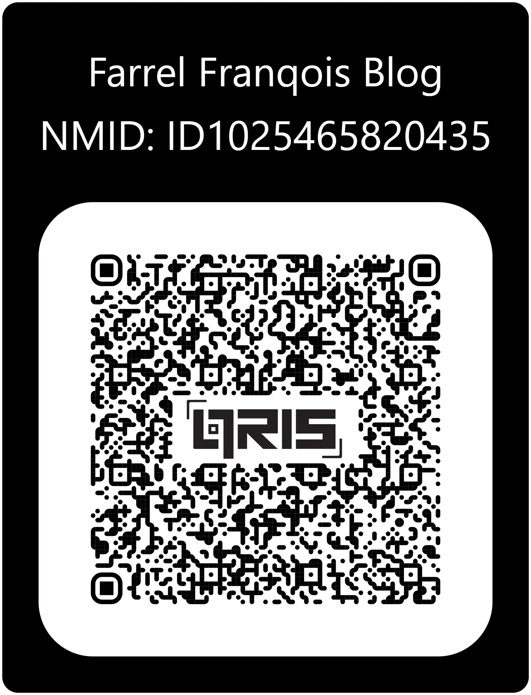
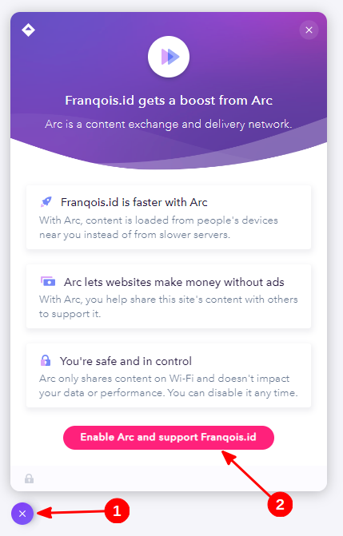

Riset, menulis dan memperbarui artikel yang ada itu memerlukan tenaga dan waktu, itu pun belum sama biaya operasional blog ini yang harus saya bayar.

Kalau kamu merasa bahwa blog ini berguna, maka ada beberapa cara yang bisa Anda gunakan untuk mendukungnya terus tayang.

Silakan pilih yang Anda suka, saya sangat mengapresiasi jika Anda melakukan setidaknya salah satu metode di bawah ini untuk mendukungnya.

## Menyawer Uang {#menyawer}

Anda dapat memberikan dukungan terhadap blog ini dengan menyawer sejumlah uang Anda melalui beberapa cara berikut di bawah ini:

### Menggunakan QRIS (disarankan)

Anda dapat menggunakan QRIS untuk menyawerkan sejumlah uang dengan cepat dan sederhana sebagai bentuk dukungan Anda terhadap blog ini, serta tentu saja kamu tidak perlu membuka situs web lain untuk sekadar menyawer.

Caranya cukup pindai kode QR berikut di bawah ini dari aplikasi pembayaran digital Anda, seperti aplikasi perbankan seluler (_Mobile Banking_) atau dompet elektronik (_E-wallet_) apa pun selama mendukung QRIS.

Jika Anda mengakses ini melalui perangkat seluler, silakan unduh gambarnya [di sini](Farrel_Franqois_Blog_QRIS_Dark.png?download=1) (walau bisa saja kamu mengunduhnya dengan menyimpan gambar di atas), lalu pindai gambar tersebut dengan mengunggahnya dari galeri di aplikasi pembayaran digital Anda.

Saya tidak tahu apakah QRIS di atas dapat digunakan oleh aplikasi pembayaran dari luar negeri atau tidak, tapi bisa dicoba terlebih dahulu dengan memindainya.

Berikut adalah negara-negara yang seharusnya dapat memindai kode QR di atas:

- Malaysia
- Singapura
- Thailand
- Jepang
- Tiongkok
- Korea Selatan (mulai 2026)

### Menggunakan platform monetisasi

Anda dapat menggunakan platform monetisasi digital untuk menyawerkan uang Anda sebagai bentuk dukungan terhadap blog ini, berikut adalah platform yang bisa digunakan:

- [PayPal](https://paypal.me/FarrelF) (Internasional)
- [Ko-fi](https://ko-fi.com/farrelf) (Internasional)
- [SociaBuzz](https://sociabuzz.com/farrelf/tribe)
- [Trakteer](https://trakteer.id/farrelf)
- [Saweria](https://saweria.co/farrelfranqois)

Semua layanan penyaweran dari Indonesia yang saya sebut di atas itu mendukung pembayaran melalui QRIS, sehingga kamu dapat menggunakan aplikasi perbankan seluler (_Mobile Banking_) dan dompet elektronik (_E-wallet_) apa pun selama mendukung QRIS, meski ada metode pembayaran lain yang dapat Anda coba di situ.

Sedangkan layanan internasional yang saya sebut hanya mendukung pembayaran melalui Saldo PayPal, Kartu Debit dan Kredit saja, prinsipal yang digunakan oleh kartu debit/kredit seperti Visa dan Mastercard jelas didukung.

## Menggunakan kode _referral_ {#pakai-kode-referral}

Beberapa layanan yang (pernah) saya gunakan menyediakan _referral_, ketika kamu mendaftar menggunakan kode tersebut, maka saya akan memperoleh sejumlah komisi atau manfaat yang bisa saya terima, tanpa dikenai biaya tambahan apa pun, baik dari sisi Anda atau saya sendiri.

Meski ini bisa saya jadikan sebagai salah satu sumber pendapatan, tetapi hal ini **tidak akan mempengaruhi pandangan saya terhadap produk atau layanan mereka**.

Berikut adalah kode _referral_ yang bisa Anda gunakan:

|Nama Layanan|Kode _Referral_|Keterangan|
|:--------------:|:-----------------------------:|:--------------------:|
| blu by BCA Digital    | `OKMOH1TXO`                                                  | |
| [bunny.net](https://afiliasi.farrelf.blog/bunny/)   | Klik tautannya            | |
| [Dewaweb](https://afiliasi.farrelf.blog/dewaweb/) | Klik tautannya            | |
| [Flip](https://afiliasi.farrelf.blog/flip/)| Klik tautannya atau pakai kode `WJRP9856`  | |
| [IDCloudHost](https://afiliasi.farrelf.blog/idch/) | Klik tautannya            | Layanan IDCloudHost biasa |
| [IDCloudHost Console](https://afiliasi.farrelf.blog/idch-console/)  | Klik tautannya atau pakai kode `m9z6qf` | Layanan Fleksibel dari IDCloudHost. Dapatkan bonus saldo sebesar Rp25.000,00 setelah isi ulang  |

## Arc (Paling mudah) (Sudah tidak berlaku)



Arc resmi mengakhiri dan mematikan layanan CDN P2P-nya (entah sejak kapan, mungkin sejak tanggal 16-17 Mei 2024 yang lalu), sehingga saya pun memutuskan untuk menonaktifkannya.

Jadi, kalau Anda ingin memberikan dukungan terhadap blog ini, maka cara di bawah ini sudah tidak lagi berlaku.



Tidak punya uang dan tidak punya layanan yang perlu didaftarkan? Tidak usah khawatir, ada cara yang paling mudah dan gratis untuk mendukung blog ini.

Karena blog ini telah menggunakan Arc sebagai layanan CDN-nya, maka cara yang paling mudah untuk mendukung blog ini adalah dengan mengaktifkan Arc untuk blog ini saat Anda mengunjunginya, caranya seperti berikut:

### Mengaktifkan Arc

Pertama-tama, pastikan kamu melihat ikon berbentuk lingkaran dan berwarna ungu di pojok kiri bawah. Tidak ketemu? Matikan pemblokir untuk blog ini (termasuk _Ad-blocker_) dan muat ulang blognya. Meski ketemu, saran saya matikan saja agar dukungannya lebih optimal.

Sudah? Kalau sudah, cari lagi ikonnya, lalu kamu klik ikon tersebut, setelah itu akan muncul sebuah dialog bahwa blog ini telah menggunakan layanan dari Arc. Nah, kamu klik pada _button_ **"Enable Arc and support Franqois.id"**, contohnya seperti gambar berikut:

Kira-kira seperti itu. Kalau _button_ tersebut tidak muncul dan yang muncul malah _button_ **"Get Arc for your site"**, itu artinya Arc telah aktif, sehingga kamu tidak perlu mengikutinya lagi.

Selain bisa mendukung blog ini karena diklaim bahwa saya bisa mendapatkan uang dari sana tanpa harus memasang iklan (walau sedang saya coba sih), kamu juga telah membantu pengunjung lain dalam memuat berkas-berkas statik blog ini dengan lebih cepat berkat jaringan P2P-nya.

### Jadi, apa itu Arc?

[Arc](https://arc.io) adalah sebuah layanan CDN yang menggunakan jaringan _peer-to-peer_, tidak seperti layanan CDN pada umumnya, mereka akan menggunakan _Service Worker_ untuk memulainya, lalu WebRTC akan digunakan untuk mengambil dan mengunggah aset-aset blog yang telah dimuat sebelumnya dari perangkat Anda. Untuk cara kerja yang lebih lengkap, silakan [klik di sini](https://arc.io/faq#how-does-arcs-cdn-work).

Tenang saja, ini tidak akan mengunggah semua data-data kamu ke banyak orang, hanya aset-aset blog ini (atau dari web yang menggunakan Arc) saja yang diunggah dan ini aman kok, meski ada kemungkinan bahwa mereka memakai Analitik dari Google.

Kalau kamu merasa tidak aman atau ingin menonaktifkannya dengan alasan apa pun, kamu bisa klik ikon tersebut lagi, lalu klik pada **"OPT OUT"**, lalu klik **"Opt out"** lagi, dan nyalakan kembali pemblokir iklannya kalau perlu. Dengan begitu, Arc akan dinonaktifkan, dan kamu bisa gunakan metode lain yang saya sediakan jika ingin mendukung blog ini.

## Akhir Kata

Sekian terlebih dahulu untuk halaman cara mendukung blog ini. Maaf apabila halamannya malah kebanyakan, karena banyak metode yang bisa Anda coba untuk mendukung blog ini.

Sekali lagi, kalau Anda merasa bahwa blog ini berguna, membantu atau bermanfaat, maka pertimbangkanlah untuk mendukung blog ini minimalnya dengan menonaktifkan pemblokir iklan.

Semoga blog ini bermanfaat bagi Anda yang telah membaca artikelnya ^_^
