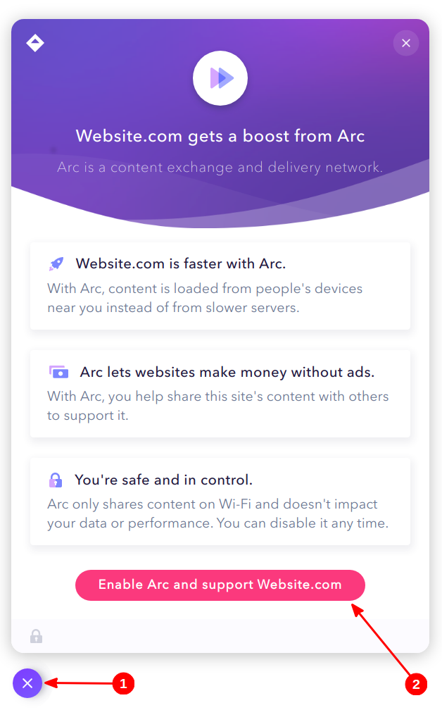

## Tentang Saya

Saya adalah makhluk hidup yang biasa-biasa saja, penuh dengan salah dan yah biasa-biasa aja, gak ada istimewanya. Jika adanya kesalahan teknis pada blog ini, tolong dikoreksi yah, saya juga sedang belajar menggunakan _Static-site Generator_.

## Tentang Blog ini

### Ikhtisar

Blog ini merupakan blog pribadi milik saya, tetapi yang saya bahas ini bukan sekadar tentang pribadi saya saja. Di blog ini, saya membahas apa yang ingin saya bahas.

Bukan apa-apa, namun mungkin blog ini agak _nge-random_ pembahasannya, entah itu bikin tutorial, beropini, bikin catatan biar gak lupa atau sekadar bikin diari kalo niat.

### Penggunaan Blog

Agar blog ini 'hidup' (bukan dalam artian _makhluk hidup_ yah), maka saya perlu beberapa komponen yang membantunya.

Berikut ini adalah apa yang saya pakai untuk blog ini:

- SSG: [Hugo Extended](https://gohugo.io/) (versi [](https://github.com/gohugoio/hugo/releases/tag/v)), saya gak pake CMS/_Platform_ kayak WordPress
- Tema: [Hugo Theme Stack](https://github.com/CaiJimmy/hugo-theme-stack)
- Fon: Keluarga [Lato](https://www.latofonts.com/) (varian: Lato Latin)
- Favicon: Ikon [Papan Klip](https://pixabay.com/images/id-1294565/) oleh [OpenClipart-Vectors](https://pixabay.com/users/openclipart-vectors-30363/) dari Pixabay, dilisensikan di bawah [Lisensi Pixabay](https://pixabay.com/service/license/)
- VCS: [GitHub](https://github.com)
- CI/CD:
  - [GitHub Actions](https://github.com/features/actions) sebagai CI/CD Utama
  - Netlify sebagai CI/CD Cadangan dan untuk pratinjau
- Domain:
  - [Digital Registra](https://www.digitalregistra.co.id/) sebagai Registrar Domain
  - [Rumahweb Indonesia](https://www.rumahweb.com/) sebagai Pengelola Domain
- DNS Otoritatif: [Cloudflare DNS](https://www.cloudflare.com/dns/)
- Hosting/Tempat Penyimpanan:
  - [Bunny Storage](https://afiliasi.farrel.franqois.id/bunny/storage/) sebagai Tempat Penyimpanan Utama untuk Blog
  - [Storj DCS (Decentralized Cloud Storage)](https://www.storj.io), [Tebi](https://tebi.io/), [Cloudflare Pages](https://pages.cloudflare.com/) dan [Netlify](https://www.netlify.com) sebagai Tempat Penyimpanan dan Hosting Cadangan
- Pewali terbalik (_Reverse Proxy_): [Bunny CDN](https://afiliasi.farrel.franqois.id/bunny/cdn/)
- Sertifikat TLS/SSL: [Google Trust Services (GTS)](https://pki.goog)
- CDN: Bunny CDN (Untuk berkas CSS, Fon dan Gambar)
- Sistem Komentar: [giscus](https://giscus.app)

### Kode Sumber Blog

Jika Anda menginginkan kode sumber untuk blog ini, entah untuk tujuan kontribusi, mempelajari blog ini atau lainnya, silakan kunjungi alamat URL berikut:

```plain
https://github.com/FarrelF/Blog
```

Atau, alamat URL berikut untuk kode sumber cerminnya:

```plain
https://gitlab.com/FarrelF/Blog
```

Kode Sumber tersebut saya lisensikan di bawah [GNU AGPLv3](https://github.com/FarrelF/Blog/blob/main/LICENSE), tetapi artikel di blog ini secara baku saya lisensikan di bawah [CC BY-SA 4.0](https://creativecommons.org/licenses/by-sa/4.0/), kecuali jika ada yang [dinyatakan sebaliknya](/ketentuan-dan-kebijakan-blog/).

Jadi, mungkin ada beberapa materi tertentu yang bisa saja diterbitkan di bawah lisensi yang berbeda (Contoh: Gambar/Media yang bersumber dari luar, dll) dan lisensi untuk materi-materi tersebut akan saya sebutkan di masing-masing Artikel dan Halaman sebagai atribusi jika saya diizinkan untuk menggunakannya.

## Hubungi saya

Anda dapat menghubungi saya secara pribadi melalui informasi kontak di bawah ini:

### Surel

- farrel(at)franqois(dot)id (Surel Pribadi)
- farrelf(at)pm(dot)me atau farrelf(at)protonmail(dot)com (Menggunakan Proton Mail, yang "katanya" lebih aman dan lebih ramah privasi)

### Media sosial/Perpesanan {#medsos}

- Telegram: [@FarrelF](https://t.me/FarrelF)
- Twitter: [@FarrelFranqois](https://twitter.com/FarrelFranqois)
- Facebook: [Farrel Franqois](https://www.facebook.com/FarrelFranqois)
- Keybase: [FarrelF](https://keybase.io/farrelf) (~~Jarang Aktif~~ Mungkin gak akan aktif)


Semua informasi kontak saya urutkan berdasarkan yang paling aktif di setiap kategori. Jadi jika Anda ingin menghubungi saya, saran saya hubungi di Telegram atau kirim pesan surel Anda ke alamat surel pribadi saya, yang tentu saja bukan ke alamat Proton Mail saya.

Tidak disarankan untuk berkirim pesan melalui Facebook, karena pesan yang Anda kirimkan tidak akan masuk ke dalam pesan utama, melainkan "Permintaan Pesan" (terutama jika dari profil/orang yang tidak saya kenal), sehingga pesan dari Anda tidak ternotifikasi oleh saya dan tidak bisa langsung saya baca sampai saya mengklik "Permintaan Pesan" secara manual, ditambah saya tidak terlalu sering aktif di Facebook.


## Kunci Publik

### Kunci PGP/GPG {#kunci-gpg}

Kunci PGP/GPG nantinya akan berguna buat Anda yang ingin mengirimkan pesan ke saya dengan lebih aman, serta dapat mengurangi kemungkinan untuk terbaca oleh orang lain karena memerlukan kunci pribadi saya untuk membukanya.

Berikut adalah informasi mengenai kunci GPG saya:

|<span class="tab-center">Informasi</span>|<span class="tab-center">Isi Data</span>|
|:--------------------|:-------------------------------------------------------------|
| Atas Nama           | Farrel Franqois                                              |
| Jenis Kunci         | ECC (Ed25519 dan Curve25519)                                 |
| Masa Berlaku        | 21 Januari 2026                                              |
| ID Kunci (Pendek)   | `0xA47AE59DC94ABF69` atau `A47AE59DC94ABF69`                 |
| ID Kunci (Panjang)  | `A148 2DE3 7280 1F1A E00F 92E0 A47A E59D C94A BF69`          |

Unduh kunci:

- [Mailvelope](https://keys.mailvelope.com/pks/lookup?op=get&search=0xA47AE59DC94ABF69)
- [OpenPGP\.org](https://keys.openpgp.org/search?q=A1482DE372801F1AE00F92E0A47AE59DC94ABF69)
- [Langsung (melalui CDN)](/0xA47AE59DC94ABF69.asc)

### Kunci Publik SSH

Kunci ini akan berguna buat Anda yang ingin perangkatnya (seperti Komputer PC/Laptop, Server, Ponsel/Tablet, dll) dapat diakses oleh saya melalui SSH atas izin dari Anda untuk keperluan apa pun, seperti menggunakan jasa/layanan dari saya yang memerlukan akses perangkat Anda, dll.

Anda dapat mengunduh ataupun melihat kunci-kunci publik tersebut melalui [Akun GitHub saya](https://github.com/FarrelF.keys).

Atau, selain melalui GitHub, Anda juga dapat mengunduhnya secara manual melalui tautan di bawah ini dengan jenis kunci yang berbeda-beda:

- [Ed25519](/ssh/id_ed25519.pub) (disarankan)
- [ECDSA P-256](/ssh/id_ecdsa.pub)
- [RSA 4096-bit](/ssh/id_rsa.pub)

Kalau bisa, saya sarankan agar Anda menggunakan Ed25519 sebagai jenis kunci publiknya, selain karena paling kecil ukurannya ketimbang jenis kunci lainnya, kunci tersebut lebih cepat dalam memproses autentikasi SSH dan diklaim lebih aman juga.

Lalu, masukkan isi kunci-kunci tersebut ke dalam berkas `.ssh/authorized_keys` di perangkat Anda.

## Memberi Dukungan/Menyawer {#memberi-dukungan}

Riset, menulis dan memperbarui artikel yang ada itu memerlukan tenaga dan waktu, itu pun belum sama biaya operasional blog ini yang harus saya bayar.

Kalau kamu merasa bahwa blog ini berguna, maka ada beberapa cara yang bisa Anda gunakan untuk mendukungnya terus tayang.

Silakan pilih yang Anda suka, saya sangat mengapresiasi jika Anda melakukan setidaknya salah satu metode di bawah ini untuk mendukungnya.

### Menyawer Uang {#menyawer}

Anda dapat memberikan dukungan terhadap blog ini dengan menyawer sejumlah uang Anda melalui beberapa cara berikut di bawah ini:

- [PayPal](https://paypal.me/FarrelF) (Internasional)
- [Ko-fi](https://ko-fi.com/farrelf) (Internasional)
- [SociaBuzz](https://sociabuzz.com/farrelf/tribe)
- [Saweria](https://saweria.co/FarrelFranqois)
- [Trakteer](https://trakteer.id/farrelf/tip)

Semua layanan penyaweran dari Indonesia yang saya sebut di atas itu mendukung pembayaran melalui QRIS, sehingga kamu dapat menggunakan aplikasi perbankan seluler (_Mobile Banking_) dan dompet elektronik (_E-wallet_) apa pun selama mendukung QRIS, meski ada metode pembayaran lain yang bisa Anda coba di situ.

Sedangkan layanan internasional yang saya sebut hanya mendukung pembayaran melalui Saldo PayPal, Kartu Debit dan Kredit saja.

### Menggunakan kode _referral_ {#pakai-kode-referral}

Beberapa layanan yang (pernah) saya gunakan menyediakan _referral_, ketika kamu mendaftar menggunakan kode tersebut, maka saya akan memperoleh sejumlah komisi atau manfaat yang bisa saya terima, tanpa dikenai biaya tambahan apa pun, baik dari sisi Anda atau saya sendiri.

Meski ini bisa saya jadikan sebagai salah satu sumber pendapatkan, tetapi hal ini **tidak akan mempengaruhi pandangan saya terhadap produk atau layanan mereka**.

Berikut adalah kode _referral_ yang bisa Anda gunakan:

|<span class="tab-center">Nama Layanan</span>|<span class="tab-center">Kode _Referral_</span>|
|:----------------------------:|:-------------------------------------------------------------:|
| blu by BCA Digital    | `OKMOH1TXO`                                                  |
| [bunny.net](https://afiliasi.farrel.franqois.id/bunny/)   | Klik tautannya            |
| [Dewaweb](https://afiliasi.farrel.franqois.id/dewaweb/) | Klik tautannya            |
| [Flip](https://afiliasi.farrel.franqois.id/flip/)| Klik tautannya atau pakai kode `WJRP9856`  |
| [IDCloudHost](https://afiliasi.farrel.franqois.id/idch/) | Klik tautannya            |
| [IDCloudHost Console](https://afiliasi.farrel.franqois.id/idch-console/)  | Klik tautannya atau pakai kode `m9z6qf`, cocok buat Anda yang ingin menggunakan layanan Object Storage, Cloud VPS, dan layanan fleksibel lainnya dari mereka. Anda juga akan mendapatkan bonus saldo sebesar Rp25.000,00 setelah mendaftar menggunakan kode tersebut |

### Metode Lainnya

Tidak punya uang dan tidak punya layanan yang perlu didaftarkan? Tidak usah khawatir, ada cara yang paling mudah untuk mendukung blog ini.

Pertama-tama, pastikan kamu melihat ikon berbentuk lingkaran dan berwarna ungu di pojok kiri bawah. Tidak ketemu? Matikan terlebih dahulu pemblokir iklannya dan kecualikan blog ini. Meski bisa, saya sarankan untuk kecualikan blog ini agar dukungannya lebih optimal.

Sudah? Kalau sudah, cari lagi ikonnya, lalu kamu klik ikon tersebut, setelah itu akan muncul sebuah dialog bahwa blog ini telah menggunakan layanan dari Arc. Nah, kamu klik pada _button_ **"Enable Arc and support Franqois.id"**, contohnya seperti gambar berikut:



Kira-kira seperti itu. Kalau _button_ tersebut tidak muncul dan yang muncul malah _button_ **"Get Arc for your site"**, itu artinya Arc telah aktif, sehingga kamu tidak perlu mengikutinya lagi.

Selain bisa mendukung blog ini karena diklaim bahwa saya bisa mendapatkan uang dari sana tanpa harus memasang iklan (walau sedang saya coba sih), kamu juga telah membantu pengunjung lain dalam memuat berkas-berkas statik blog ini dengan lebih cepat berkat jaringan P2P-nya.

Yap, [Arc](https://arc.io) adalah sebuah layanan CDN yang menggunakan jaringan _peer-to-peer_, tidak seperti layanan CDN pada umumnya, mereka akan menggunakan _Service Worker_ untuk memulainya, lalu WebRTC akan digunakan untuk mengambil dan mengunggah aset-aset blog yang telah dimuat sebelumnya dari perangkat Anda. Untuk cara kerja yang lebih lengkap, silakan [klik di sini](https://arc.io/faq#how-does-arcs-cdn-work).

Tenang saja, ini tidak akan mengunggah semua data-data kamu ke banyak orang, hanya aset-aset blog ini (atau dari web yang menggunakan Arc) saja yang diunggah dan ini aman kok, meski ada kemungkinan bahwa mereka memakai Analitik dari Google.

Kalau kamu merasa tidak aman atau ingin menonaktifkannya dengan alasan apa pun, kamu bisa klik ikon tersebut lagi, lalu klik pada **"Opt Out"**, lalu klik **"Opt Out"** lagi, dan nyalakan kembali pemblokirnya kalau perlu. Dengan begitu, Arc akan dinonaktifkan, dan kamu bisa gunakan metode lain yang saya sediakan jika ingin mendukung blog ini.

## Akhir Kata

Ya sudah, itu saja untuk halaman ini. Maaf kalau terlalu singkat, saya sendiri juga tidak terlalu niat-niat amat dalam mengurusi halaman ini sampai-sampai membuat kisah hidup saya di sini.

Halaman ini adalah tentang blog ini dan ringkasan mengenai saya, jadi saya buat secukupnya saja.

Semoga blog ini bermanfaat bagi Anda yang telah membaca artikelnya ^_^
