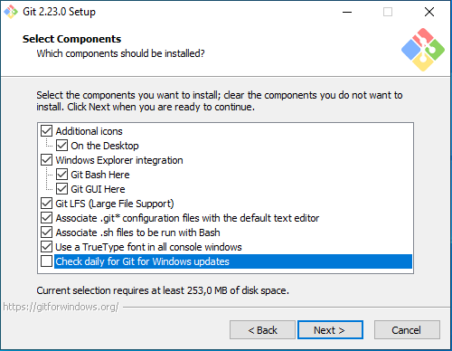
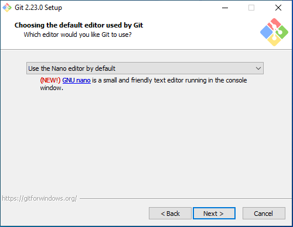
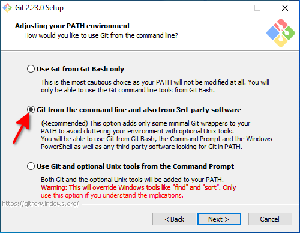
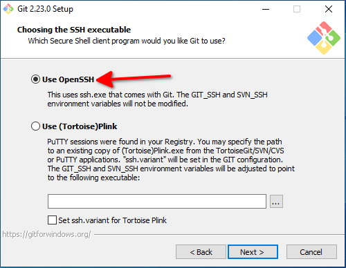
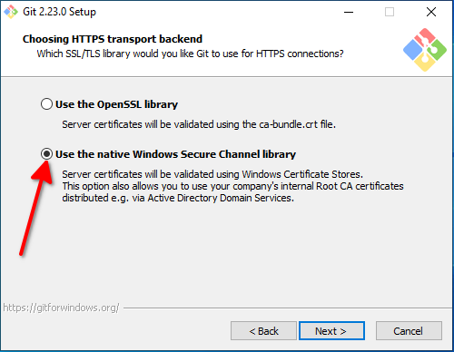
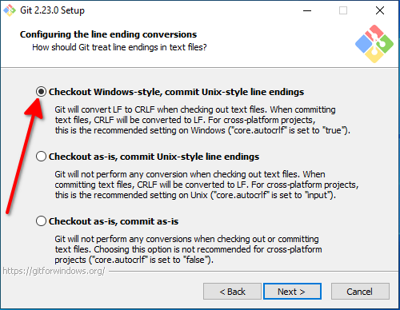
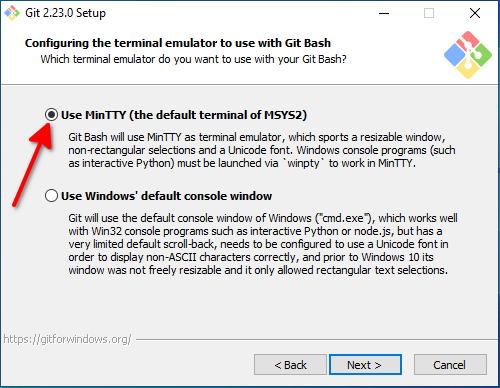
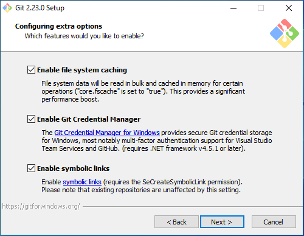
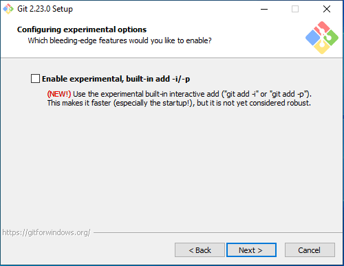

## Daftar Isi


## I. Cara Install Git
Untuk meng-install nya, Anda hanya perlu meng-unduh Git nya terlebih dahulu, bisa Anda kunjungi situs web resmi nya untuk meng-unduh Git, yakni: [https://git-scm.com](https://git-scm.com). Lalu, klik pada _Button_ "Download Git" bla bla bla. Atau, Anda juga bisa mengunjungi [Halaman Unduhan](https://git-scm.com/downloads) Resmi nya untuk meng-unduh Git.

### **Cara Install Git di GNU/Linux, macOS dan Sistem Operasi berbasis \*nix lain nya**
Pada GNU/Linux atau Sistem Operasi berbasis Unix/Unix-like lain nya, biasanya mereka akan memberikan petunjuk cara instalasi Git nya untuk masing-masing Distribusi atau Sistem Operasi nya (kecuali untuk macOS, yang tidak di beritahukan cara Install nya disana). Kalau begitu, Anda tinggal ikuti saja [petunjuk nya](https://git-scm.com/download/linux).

Atau, kalo Anda tidak ingin mengunjungi nya, Anda bisa ikuti Petunjuk nya di bawah ini:

#### **Untuk pengguna Distribusi Ubuntu dan Turunan nya**
Untuk pengguna Distribusi Ubuntu dan turunan nya, bisa Anda ikuti perintah berikut di bawah ini untuk meng-install Git:

```bash
$ sudo -- sh -c 'add-apt-repository ppa:git-core/ppa; apt update; apt install git'
```

#### **Untuk pengguna Distribusi Debian dan Turunan nya**
Untuk pengguna Distribusi Debian dan turunan nya, bisa Anda ikuti perintah berikut di bawah ini untuk meng-install Git:

    # apt update && apt install git

#### **Untuk pengguna Distribusi Arch, Manjaro dan Turunan nya**
Untuk pengguna Distribusi Arch, Manjaro dan turunan nya, bisa Anda ikuti perintah berikut di bawah ini untuk meng-install Git:

```bash
$ sudo pacman -S git
```

#### **Untuk pengguna Distribusi Fedora**
Untuk pengguna Distribusi Fedora dan turunan nya, bisa Anda ikuti perintah berikut di bawah ini untuk meng-install Git:

```bash
$ sudo yum install git      # Untuk Fedora 21 dan di bawah nya
$ sudo dnf install git      # Untuk Fedora 22 dan di atas nya
```

#### **Untuk pengguna Distribusi OpenSUSE dan Turunan nya**
Untuk pengguna Distribusi OpenSUSE dan turunan nya, bisa Anda ikuti perintah berikut di bawah ini untuk meng-install Git:

```bash
$ sudo zypper install git
```

#### **Untuk pengguna Distribusi Gentoo**
Untuk pengguna Distribusi Gentoo dan turunan nya, bisa Anda ikuti perintah berikut di bawah ini untuk meng-install Git:

    # emerge --ask --verbose dev-vcs/git

#### **Untuk pengguna NixOS atau yang menggunakan Nix Package Manager**
Untuk pengguna Distribusi NixOS atau yang menggunakan Nix Package Manager, bisa Anda ikuti perintah berikut di bawah ini untuk meng-install Git:

    # nix-env -i git

#### **Untuk pengguna Alpine Linux**
Untuk pengguna Alpine Linux, bisa Anda ikuti perintah berikut di bawah ini untuk meng-install Git:

    $ apk add git

#### **Untuk pengguna FreeBSD**
Untuk pengguna FreeBSD, bisa Anda ikuti perintah berikut di bawah ini untuk meng-install Git:

    # pkg install git

#### **Untuk pengguna OpenBSD**
Untuk pengguna OpenBSD, bisa Anda ikuti perintah berikut di bawah ini untuk meng-install Git:

    # pkg_add git

#### **Untuk pengguna macOS**

Untuk pengguna macOS, bisa Anda Unduh dan Install Git nya dari [sini](https://git-scm.com/download/mac). 

Sedangkan untuk Windows, Anda bisa ikuti petunjuk nya berikut.

### **Cara Install Git di Windows**
Cara Install Git di Windows sangatlah berbeda daripada Install Git di Sistem Operasi berbasis Unix/Unix-like (\*nix). Installer nya menggunakan GUI, sehingga dapat mempermudah kamu selama meng-install Git.

Hanya saja jika kamu salah langkah, maka yang terjadi adalah Git akan mengalami "kesalahan" (_error_) saat di gunakan, entah itu tidak bisa meng-kloning _Repository_ sampai mengurus nya.

Maka dari itu, jika Anda adalah pengguna Windows, maka Anda bisa ikuti cara instalasi nya berikut:

1. Unduh [Git untuk Windows](https://git-scm.com/download/win/).

2. Setelah di Unduh, buka berkas tersebut. Jika muncul UAC (_User Account Control_), klik pada _Button_ 'OK'.

3. Setelah itu, Install Git dengan Langkah-langkah berikut:

#### **1. Perjanjian Lisensi**
Nanti akan muncul Perjanjian Lisensi (_License Agreement_) setelah membuka berkas tersebut, klik pada _Button_ 'Next >' untuk melanjutkan Instalasi. 

**Catatan:** Jika Anda klik _Button_ tersebut dan lanjut meng-install nya, ini artinya Anda telah menyetujui Perjanjian tersebut.

#### **2. Pilih Komponen mana yang ingin di Install (_Select Components_)**
Pada langkah ini, silahkan Anda atur Komponen mana yang ingin Anda install dan di aktifkan oleh Anda, seperti: Asosiasi Berkas, Integrasi Windows Explorer, Pintasan di Desktop, dll.
   
Jika Anda ingin menggunakan TrueType di dalam semua Konsol Windows, centang "Use a TrueType font in all console Windows", seperti cuplikan berikut:
   


Setelah Anda selesai memilah-milih nya, klik pada _Button_ 'Next >' untuk melanjutkan ke Langkah ke-3.

#### **3. Pilih Editor mana yang akan di gunakan (_Choosing the default editor used by Git_)**
Pada langkah ini, Anda bisa pilih editor yang akan di gunakan oleh Git nanti nya

Pada tutorial ini, saya akan gunakan 'GNU nano' sebagai editor bawaan untuk Git, berikut cuplikan nya:



Kalo Anda ingin menggunakan Editor Favorit, sedangkan editor nya tidak tersedia disitu, nanti Anda bisa konfigurasi lagi

Karena secara bawaan Git memilih 'nano' sebagai editor nya, maka untuk langkah ini, bisa langsung Anda klik _Button_ 'Next >' untuk melanjutkan ke Langkah ke-4.

#### **4. Pilih Cara untuk Eksekusi Git (_Adjusting your PATH environment_)**
Setelah itu, pilih opsi untuk cara eksekusi Git, saya sarankan untuk pilih opsi **Git from the command line and also from 3rd-party software** (atau, membiarkan nya karena sudah terpilih) agar Git bisa di akses atau di eksekusi dari manapun, termasuk dari CMD (Command Prompt). 
   


Setelah Anda memilih opsinya, klik pada _Button_ 'Next >' untuk melanjutkan.

#### **5. Pilih Perangkat Lunak untuk Eksekusi SSH untuk Git (_Choosing the SSH executable_)**
Setelah itu, pilih eksekusi SSH untuk Git, ini akan berguna nanti ketika Anda mengelola *Repository* Git dengan SSH. Agar lebih mudah, pilih "OpenSSH" dengan memilih opsi **Use OpenSSH**, seperti pada cuplikan berikut: 



Setelah Anda memilih nya, klik pada _Button_ 'Next >' untuk melanjutkan ke Langkah ke-6.

#### **6. Menentukan Pustaka untuk HTTPS pada Git (_Choose HTTPS transport backend_)**
Pada langkah **Choose HTTPS transport backend**, Anda akan menentukan *Library*/Pustaka mana yang akan di gunakan untuk 'transportasi' HTTPS pada Git nanti nya. 

Saya sarankan untuk menggunakan Pustaka Bawaan dari Windows saja, yakni ['Windows Secure Channel'](https://msdn.microsoft.com/en-us/library/windows/desktop/aa380123(v=vs.85).aspx) (atau bisa di sebut 'winSSL' atau 'Schannel'), agar Git dapat mengenali CA (Certification Authority) dan Sertifikat SSL lain nya secara langsung di dalam Windows. 

Maka dari itu, pilihlah opsi **Use the native Windows Secure Channel library**, bukan **Use OpenSSL** (Kecuali jika Anda meng-install OpenSSL dan mempunyai berkas `ca-bundle.crt` di dalam Windows dan itupun belum saya tes), seperti pada cuplikan layar berikut ini:



Setelah Anda memilih nya, klik pada _Button_ 'Next >' untuk melanjutkan ke Langkah ke-7.

#### **7. Menentukan "Baris Baru" untuk Git (_Configuring the line ending conversions_)**
Selanjutnya, pada langkah **Configuring line endings conversions**, Anda akan menentukan bagaimana Git akan memperlakukan "Line Ending" (Baris Baru) nantinya.

Karakter *Line Ending* itu sendiri berbeda-beda, tergantung Sistem Operasi mana yang kamu gunakan, contoh: Pada Windows dan kebanyakan Sistem Operasi yang bukan berbasis Unix lain nya, karakter *Line Ending* yang berlaku adalah `\r\n`, sedangkan GNU/Linux, macOS atau Sistem Operasi berbasis Unix/Unix-like lain nya menggunakan `\n` saja.

Ada beberapa istilah mengenai *Line Ending* ini, salah satu nya adalah: LF, CR dan CRLF. LF merupakan singkatan dari *Line Feed* atau `\n`, sedangkan CR merupakan singkatan dari *Carriage Return* atau `\r`. Dan, CRLF merupakan gabungan dari CR dan LF, atau `\r\n` yang di berlakukan oleh Sistem Operasi Windows dan macOS hingga saat ini.

Untuk mempelajari lebih lanjut mengenai apa itu *Line Ending*, cari sendiri lewat Google, yah :slightly_smiling_face:

Jadi, karena Anda saat ini meng-install Git untuk Windows, maka pilihan yang terbaik untuk Sistem Operasi Windows adalah Opsi Pertama, yaitu **Checkout Windows-style, commit Unix-style line endings**.

Seperti cuplikan layar berikut:



Setelah Anda memilih nya, klik pada _Button_ 'Next >'.

#### **8. Memilih Terminal Emulator untuk Git Bash (_Configuring the terminal emulator to use with Git Bash_)**
Pada langkah ini, Anda akan memilih Terminal Emulator bawaan untuk Git Bash nya, apakah menggunakan Konsol Windows atau MinTTY. 

Mohon maaf, saat ini saya tidak mempunyai cuplikan layar sebagai contoh nya. Namun, pada tutorial ini, saya memilih menggunakan MinTTY dan saya sarankan untuk menggunakan nya daripada menggunakan Konsol Windows, dengan memilih opsi **Use MinTTY (the default terminal of MSYS2)**. 
   


Lalu, klik _Button_ 'Next >'.
   
#### **9. Konfigurasi Opsi Tambahan (_Configuring extra options_)**
Pada langkah ini, nanti akan ada tiga opsi, Anda bisa aktifkan semua opsi tersebut dengan mencentang nya.



Lalu, klik _Button_ 'Next >'.

#### **10. Konfigurasi Opsi Eksperimental (_Configuring experimental options_)**
Pada langkah ini, nanti akan ada satu opsi yang bisa Anda aktifkan, namun karena sifat nya Eksperimental, maka saya sarankan agar tidak mengaktifkan nya, kecuali jika Anda ingin mencoba nya. 



Pada Git versi 2.23, akan ada opsi seperti cuplikan di atas, namun hal ini mungkin tidak berlaku untuk versi kedepan nya.

Klik pada _Button_ 'Next >' untuk melanjutkan. Atau, jika ada _Button_ 'Install', klik pada _Button_ tersebut untuk meng-install Git.

#### **11. Proses Instalasi sampai Selesai**
Instalasi Git sedang dalam Proses, harap bersabar hingga selesai dalam beberapa menit kedepan.

Jika Git telah berhasil ter-install, klik pada _Button_ 'Finish'. Sebelum itu, Anda juga bisa hapus centang **Launch Git Bash** jika Anda tidak ingin menjalankan 'Git Bash' setelah selesai Install.

## II. Akhir kata
Sudah? Iya, sudah, cuma itu saja yang perlu Anda lakukan. Ini merupakan Artikel yang membahas tentang 'Cara Install Git', bukan 'Apa itu Git dan Cara Install nya', jadi saya tidak perlu basa-basi disini.

Yang perlu kamu lakukan setelah Install Git adalah, sebaiknya kamu pelajari mengenai penggunaan Git, banyak di Internet caranya, atau mungkin kamu akan lihat kedepan nya nanti jika Anda membuat/mengembangkan sebuah Perangkat Lunak.

Jika kamu mempunyai pertanyaan, kritik dan saran, komentar atau masukkan lain nya, silahkan kamu berkomentar melalui kolom komentar yang tersedia atau bisa kamu [Hubungi Saya](/tentang).

Terima kasih atas perhatian nya 😊

## III. Penggunaan Gambar dan Atribusi
Berkas-berkas Gambar (seperti Cuplikan layar dan Gambar lain nya) yang di gunakan di dalam artikel ini, disediakan di dalam [_Repository_ Blog ini](https://github.com/FarrelF/Blog). 

Jika Anda ingin menjelajahi nya, silahkan kunjungi Alamat URL berikut:

```plaintext
https://github.com/FarrelF/Blog/tree/main/content/post/2019-09-17-cara-install-git
```

Gambar yang terletak di paling atas dan di bawah judul artikel itu merupakan Logo Git, yang telah di buat oleh [Jason Long](https://twitter.com/jasonlong).

Logo Git di lisensi kan dengan [Creative Commons Attribution 3.0 Unported (CC BY 3.0)](https://creativecommons.org/licenses/by/3.0/) oleh pembuatnya, begitupun juga dengan varian logo Git [lain nya](https://git-scm.com/downloads/logos).

Jika Anda ingin meng-unduh lebih banyak, silahkan Anda kunjungi [halaman web resmi nya](https://git-scm.com/downloads/logos).
