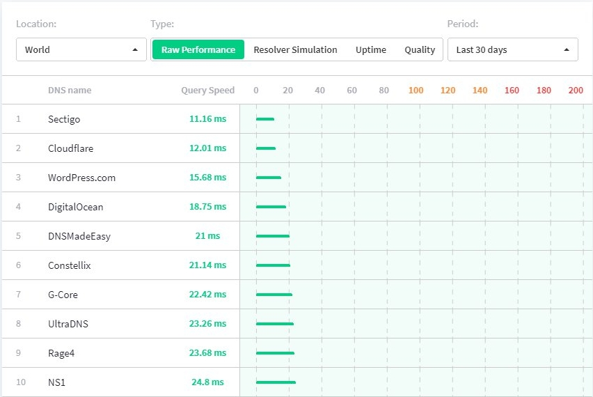
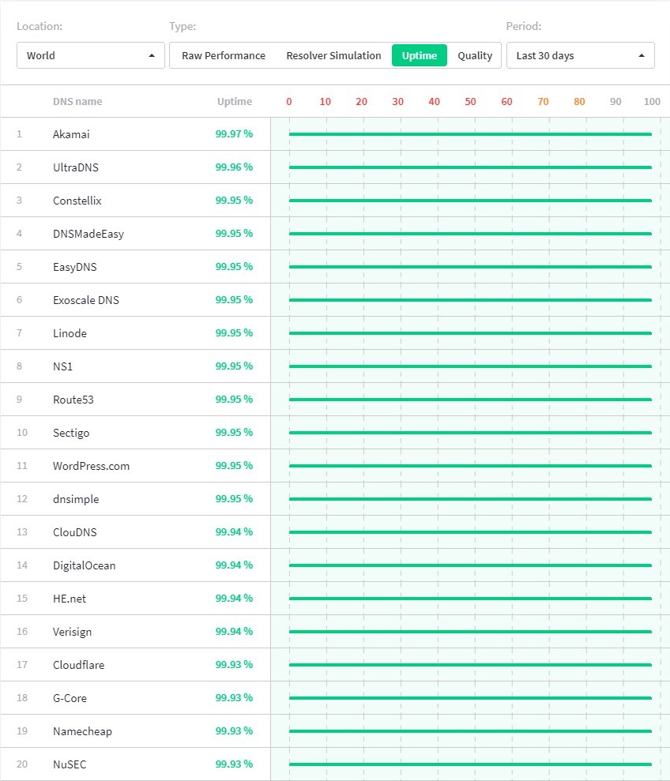
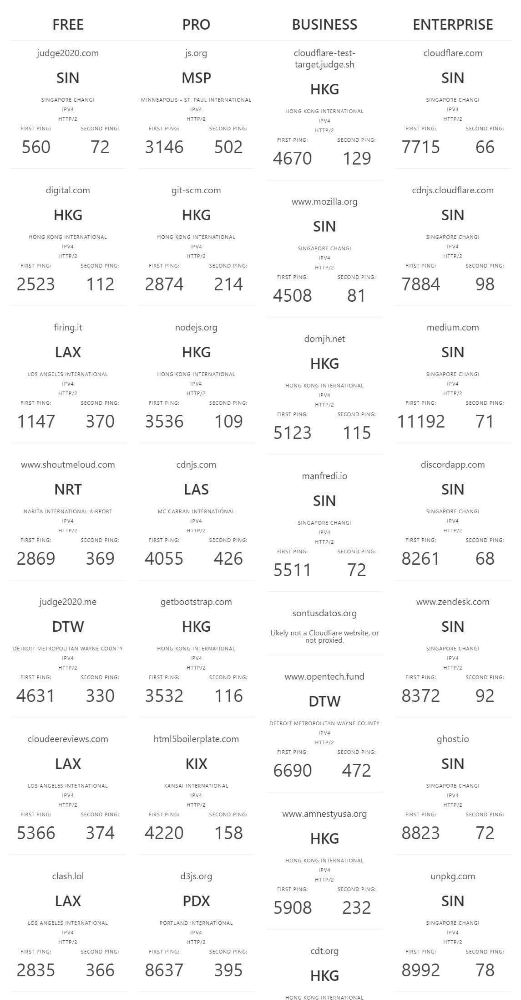

## Daftar Isi


## Apa itu Cloudflare?
**Cloudflare&reg;** (atau lengkapnya: **Cloudflare, Inc.**) adalah sebuah perusahaan Amerika Serikat yang menyediakan jasa-jasa yang diperuntukan bagi pembuat ataupun yang mengelola sebuah Web/Blog, seperti jasa jaringan pengantaran konten/_Content Delivery Network_ (CDN), pencegah serangan DDoS, mengamankan Web/Blog, Analitik, Pengelola Domain dan DNS.

Selain untuk Pembuat atau Pengelola Web/Blog, Cloudflare juga menyediakan sebuah Layanan DNS Rekursif yang di tujukan untuk semua pengguna, yang bernama [**1.1.1.1&trade;**](https://1.1.1.1) dan bahkan Cloudflare telah menyediakan Aplikasi nya agar semua orang bisa menggunakan nya dengan mudah.

Jadi, sekarang udah jelas kan Cloudflare itu apaan? Namun apakah saya perlu untuk menggunakan nya, mengingat layanan nya itu Gratis? Jawaban nya ya "entar dulu", abis ini nanti akan saya bahas dulu apa kelebihan dan kekurangan nya, karena jawaban nya akan sangat berhubungan dengan ini.

## Kelebihan menggunakan Cloudflare
Untuk pembahasan kali ini, saya cuma membahas kelebihan menggunakan Cloudflare sebagai CDN, Pengelola DNS dan _Firewall_ saja mengingat banyak sekali jasa/layanan dari Cloudflare itu, namun ketiga ini yang paling sering di gunakan oleh para Blogger atau Pengembang/Pengelola Web di bandingkan lain nya, apalagi Layanan tersebut tersedia versi Gratisan nya.

Kelebihan menggunakan Cloudflare saya jabarkan berikut di bawah ini.

### Membuat Web/Blog menjadi lebih hemat Kuota _Bandwidth_
Kalau kamu menggunakan Hosting yang mana Kuota _Bandwidth_ (Pita lebar) nya terbatas atau cuma dapat sedikit saja, siapa sih yang gak mau menghemat penggunaan Kuota nya? Apalagi jika Web/Blog nya ramai di kunjungi orang dan robot tiap hari?

Dengan menggunakan Layanan CDN nya, maka Anda dapat menghemat penggunaan _Bandiwdth_ Server. 

Lho, kok bisa? Karena dengan menggunakan CDN pada Web/Blog Anda, maka ketika orang lain mengunjungi Web/Blog Anda, Peramban Web milik Pengunjung tersebut hanya mengunduh berkas-berkas statis dari Server CDN nya alih-alih dari Server Asli nya.

Kira-kira, Illustrasi nya seperti berikut:

Hal inilah yang membuat penggunaan _Bandwidth_ akan menjadi jauh lebih hemat dari biasanya, apalagi jika Anda menyetel _Header_ `Cache-Control` nya dengan [benar](https://csswizardry.com/2019/03/cache-control-for-civilians), maka Anda akan bisa mengurangi penggunaan _Bandwidth_ nya secara signifikan!

Terlebih jika sistem pembiayaan untuk paket-paket pada layanan/jasa dari Cloudflare pun tidak menggunakan Sistem _Pay-as-you-Go_ (PAYG) sebagai Sistem Pembiayaan atau tidak perlu membayar tergantung pada penggunaan, melainkan itu merupakan Biaya _Flat_ per bulan saja, bahkan ada Gratisan nya juga. 

Sehingga, ini akan sangat cocok bagi Anda yang memiliki Web/Blog yang kunjungan nya sangat ramai, tapi tidak mau terbebani oleh tagihan yang membludak akibat penggunaan _Bandwidth_ yang sangat besar.

### DNS Otoritatif nya yang sangat cepat, reliabel dan cukup kaya fitur
Tahukah Anda, bahwa Layanan DNS Otoritatif dari Cloudflare itu sangatlah cepat dan reliabel? Menurut data yang ada di Situs Web DNSPerf yang saya ambil pada saat saya menulis artikel ini (Pada Tanggal 15 April 2021), DNS Cloudflare menempati posisi kedua untuk kecepatan mentah dengan _Uptime_ sebesar 99,93% selama 30 hari terakhir.

Catatan: Saya tidak menjamin keakuratan data diatas dalam menilai DNS Otoritatif yang ada, tapi setidaknya ini bisa dijadikan referensi bagi Anda yang ingin mencari DNS Otoritatif yang cocok untuk Web/Blog Anda dan saya sarankan Anda untuk mencarikan data pembanding untuk itu.

Jika Domain Anda terhubung ke DNS Cloudflare dan menggunakan nya sebagai Pengelola DNS dibandingkan dengan Pengelola DNS bawaan, maka Anda bisa mengurangi potensi _Downtime_ atau ketidaktersediaan pada Domain Anda, serta membuat Domain Anda dapat di _resolve_ lebih cepat oleh pengunjung.

Kenapa bisa gitu? Karena Cloudflare telah di tenagai oleh Server-server di 200 Kota dari 100 Negara di seluruh dunia yang mana ini akan saling berkaitan, begitupun juga CDN nya. 

Jadi, jika satu server DNS Cloudflare tidak tersedia, maka hanya perlu dirute ulang ke server lain nya dan hal ini memungkinkan untuk mempercepat _Resolve_ DNS dari segi Pengunjung, karena pengunjung mendapatkan server terdekat nya saat me-_resolve_ domain yang terhubung dengan DNS Cloudflare.

Karena DNS Otoritatif dari Cloudflare merupakan Pengelola DNS Eksternal, sehingga jika Server Hosting Anda mengalami ketidaktersediaan atau _Downtime_ (alias nge-_down_), maka layanan lain seperti surel eksternal, subdomain yang terhubung ke server lain, dll, tidak akan mengalami hal demikian.

Selain itu, Pengelola DNS ini memiliki cukup kaya akan fitur. DNSSEC untuk keamanan DNS? Ada! Cloudflare mendukung hal itu, Anda tinggal tambahkan Pengaturan DNSSEC pada Domain Anda melalui Pengaturan Domain bawaan. Untuk nilai-nilai nya, ikuti dengan yang ada di Cloudflare. 

"CNAME Flattening"? Ada! Fitur ini malah di aktifkan secara bawaan untuk 'root' nya saja. Anda juga bisa ekspor dan impor pengaturan DNS Anda dalam format BIND9 sewaktu-waktu jika ingin migrasi. Apakah saya bisa menikmati itu semua secara gratis? Tentu saja bisa! Anda hanya perlu menghubungkan Domain Anda ke DNS Cloudflare saja dengan mengubah _Nameserver_ nya sesuai dengan petunjuk yang ada.

### SSL Gratis dan Sertifikat nya mendukung Peramban Web yang lebih tua
Jika Hosting yang Anda gunakan tidak menyediakan SSL sama sekali, maka Anda bisa gunakan CDN dari Cloudflare agar Web/Blog Anda bisa di akses dengan Protokol HTTPS secara gratis, masa berlaku akan di perbarui secara otomatis oleh mereka.

Akar (atau _Root_) dari Sertifikat SSL yang di gunakan nya pun telah di dukung oleh Peramban Web (_Web Browser_) dari Perangkat yang lebih tua, selama Peramban Web tersebut mendukung SNI (singkatan dari "Server Name Indication") yang merupakan fitur dari protokol TLS.

Fitur tersebut di namakan ["Universal SSL"](https://support.cloudflare.com/hc/en-us/articles/204151138-Understanding-Universal-SSL). Jika Anda merasa tidak perlu menggunakan SSL dari Cloudflare, maka caranya ada dua, yakni: Nonaktifkan fitur "Universal SSL" atau jangan gunakan CDN dari Cloudflare.

### _Firewall_ dan Perlindungan dari Serangan DDoS
Jika Anda menggunakan CDN dari Cloudflare, maka Anda telah meminimalisir serangan DDoS di Web/Blog Anda. Proteksi ini bekerja pada lapisan ke-3, 4 dan 7 dalam model OSI, serta Proteksi ini tidak dikenakan biaya sama sekali alias gratis.

Selain itu, Cloudflare memiliki _Firewall_ yang siap melindungi Web/Blog Anda dari serangan dari luar, termasuk DDoS dan tentu saja Anda memiliki _Firewall_ bawaan yang bisa Anda atur kapan saja.

## Kekurangan menggunakan Cloudflare (terutama untuk pengguna Gratisan)
Tadi saya sudah menyebutkan kelebihan untuk menggunakan Cloudflare, terutama untuk layanan yang sering di gunakan oleh para Blogger atau Pengembang/Pengelola Situs Web, yakni CDN, Pengelola DNS dan _Firewall_ nya.

Sekarang saya bahas kekurangan nya, saya utamakan untuk pengguna Gratisan karena saya yakin bahwa mayoritas pengguna Cloudflare lebih memilih Paket "Gratis" daripada milih yang berbayar, kalaupun mampu bayar palingan cuma mentok di Paket "Pro" saja yang biaya nya cuma $20/bulan. (Jangan tersinggung yah, saya juga pake Gratisan juga kok, hehe 😀)

Saya tidak mempunyai data yang pasti, karena saya cuma menebak yang berdasarkan dari rute yang saya dapatkan ketika saya mengunjungi sebuah Web/Blog Anda yang menggunakan Cloudflare (lebih lanjutnya akan saya bahas setelah ini), tapi saya yakin bahwa Anda belum tentu sanggup untuk membayar uang sebesar $200 setiap bulan nya hanya untuk menyewa Paket "Business" (Bisnis), apalagi Paket "Enterprise" (Perusahaan).

Ok, tanpa basa-basi lagi, saya akan bahas kekurangan menggunakan Cloudflare (terutama untuk pengguna Gratisan) berikut di bawah ini.

### Rute CDN nya seringkali kacau
Anda mungkin berekspektasi bahwa CDN harusnya melayani pengunjungnya dekat dari Koneksi Internet yang digunakan oleh pengunjung, siapa yang tidak setuju? Tapi, Anda harus menerima kenyataan bahwa Rute yang didapatkan oleh pengunjung saat mengunjungi Web/Blog Anda yang menggunakan Cloudflare dengan paket selain "Enterprise" (apalagi Gratisan) tidak sesuai dengan ekspektasi pengunjung atau tidak mendapatkan lokasi yang dekat dengan mereka.

Seringkali pengunjung akan mendapatkan rute yang bahkan sangat jauh dari mereka, contoh: Koneksi Internet nya dari Indonesia (dengan asumsi tanpa menggunakan Proksi/VPN), ketika mengunjungi Web/Blog yang menggunakan Cloudflare Gratisan, maka Lalu Lintas akan di larikan ke Server Los Angeles, Jepang, atau Server Acak lain nya.

Sebagai imbas nya, tidak sedikit pula pengunjung yang merasa lambat ketika mengakses nya, bahkan sampai tidak bisa diakses sama sekali.

Contoh kasus nya adalah ketika mengakses Web/Blog yang menggunakan Cloudflare Gratisan dan Paket "Pro" dari ISP Telkom misalnya, karena rute yang mereka dapatkan itu sangat jauh dari koneksi nya, sehingga banyak orang yang [mengeluhkan akses ke sebuah Web/Blog](https://syeilendrapramuditya.wordpress.com/2020/04/29/koneksi-internet-telkom-indihome-telkomsel-tidak-bisa-akses-cloudflare/), bahkan sampai-sampai membuat sebuah utas di [Forum Komunitas nya](https://community.cloudflare.com/t/cant-access-website-with-isp-indonesia-telkom/169648) juga.

Untuk memastikan Rute CDN/Pusat Data Cloudflare mana yang didapat atau dijangkau oleh koneksi Internet yang digunakan sekarang, Anda dapat mengunjungi Situs Web ["Cloudflare Test"](https://cloudflare-test.judge.sh).

Ketika Anda mengunjungi nya, tunggu saja sampai semua teks nya tampil dengan baik. Jika Anda menggunakan Koneksi dari Telkomsel (saya uji ini di Kota Cirebon), maka kira-kira hasilnya sebagai berikut:

Jika ini di uji menggunakan ISP Telkom seperti IndiHome, berdasarkan pengalaman pribadi saya saat menggunakan IndiHome di Kota Cirebon (tapi belum sempat saya ambil Cuplikan nya), maka hasilnya mungkin akan sangat mirip dengan diatas.



Cuplikan diatas itu merupakan hasil krop gambar, silahkan <a class="link" href="2021-04-14_22.02.15_cloudflare-test.judge.sh_55a2fedde365.jpg">klik disini</a> jika Anda ingin melihat cuplikan asli nya.

Tapi, saya tidak menjamin keakuratan cuplikan diatas tentang hasil pengujian jangkauan pusat data Cloudflare, karena saya uji ini menggunakan Koneksi dari Telkomsel (Operator: by.u) di Kota Cirebon dan pemiripan/persamaan hasil pengujian saat menggunakan ISP Telkom (seperti IndiHome) itu hanya berdasarkan pengalaman pribadi saat menggunakan IndiHome di Kota Cirebon, mungkin di Kota/Kabupaten atau/dan menggunakan Operator/ISP lain hasilnya akan beda.

Tapi, setidaknya ini bisa dijadikan pertimbangan bagi Anda untuk memutuskan apakah CDN Cloudflare layak atau tidak bagi Anda sebagai pemilik/pengembang Web/Blog atau/dan pertimbangan untuk mencari ISP lain untuk pengguna biasa/pengunjung yang bukan pemilik/pengembang Web/Blog, walaupun tidak 100% akurat.



Pada gambar diatas, maka hasil nya disimpulkan sebagai berikut: 

- Rute CDN yang Anda dapatkan saat mengunjungi kebanyakan Web/Blog yang menggunakan Cloudflare paket Gratis dari Koneksi Telkom atau Telkomsel itu sangatlah kacau dan acak.
- Berlangganan paket "Pro" tidak cukup membantu, namun lebih baik daripada yang Gratisan.
- Pengguna paket "Business" biasanya akan mendapatkan rute ke Hong Kong (HKG) dan ada beberapa yang dapat Singapura (SIN).
- Untuk Web/Blog yang menggunakan Paket "Enterprise" mayoritas akan mendapatkan rute ke Singapura (SIN).

Cloudflare sendiri membedakan Prioritas Lalu Lintas Jaringan nya berdasarkan paket-paket yang ada, paket "Enterprise" adalah paket yang paling diprioritaskan. Hal ini mereka lakukan karena biaya _Bandwidth_ yang mereka bayarkan tergolong mahal untuk melayani banyak orang, sedangkan pengguna Cloudflare kebanyakan merupakan Pengguna Gratisan dan akan terus bertambah banyak.

Sehingga, pada akhirnya mereka mengarahkan lalu lintas pengunjung yang ingin mengunjungi Web/Blog yang menggunakan Cloudflare dengan paket selain "Business"/"Enterprise" ke Server yang paling murah, yakni yang paling jauh dari Pengunjung.

Untuk mengatasi hal ini, dari segi ISP harus melakukan _Direct-peering_ dengan Cloudflare, tapi beberapa ISP seperti nya belum melakukan nya secara maksimal atau bahkan ada yang enggan untuk melakukan nya, sehingga koneksi dari ISP tertentu ke jaringan Cloudflare kurang begitu bagus, entah karena alasan apa.

Kembali lagi ke hasil pengujian, kenapa saya selalu menyebutkan Telkomsel dan Telkom? Karena kedua itu yang paling menguasai jangkauan di seluruh Indonesia, bisa jadi hal ini yang membuat kedua ISP tersebut menjadi paling banyak pengguna nya.

Jadi, jika saya ingin menggunakan CDN dari Cloudflare, sedangkan kebanyakan pengunjung nya menggunakan Telkomsel, IndiHome dan Koneksi dari Jaringan Telkom lain nya, apa yang harus saya lakukan? Yah, Anda perlu berlangganan paket "Enterprise" jika ingin mendapatkan Prioritas Jaringan yang terbaik, atau seminimal-minimal nya Anda perlu berlangganan paket "Business" kalau begitu.

### Proteksi DDoS Lapisan ke-7 dan CDN hanya bekerja untuk Protokol HTTP(S) saja
Jika Anda ingin memproteksi Server Gim, FTP, SSH, RDP, RTMP, dan Server dengan Protokol selain HTTP(S) dari serangan DDoS, atau Anda ingin mengurangi latensi saat mengakses server Anda dengan Protokol selain HTTP(S), atau ingin mengakselerasi pengalaman memainkan gim secara daring dengan memanfaatkan CDN nya, maka Anda tidak bisa melakukan itu dengan layanan 'yang ada'.

Karena Proteksi DDoS dan CDN yang ada hanya bekerja untuk Protokol HTTP(S) saja, tidak untuk Protokol lain nya, alias hanya untuk _Webserver_ saja. Jika Anda ingin menggunakan CDN untuk Server selain _Webserver_, maka Anda perlu menggunakan [**Cloudflare Spectrum**](https://www.cloudflare.com/id-id/products/cloudflare-spectrum/) untuk itu.

Lalu, apakah fitur tersebut bisa saya peroleh secara gratis? Oh, tentu saja tidak! Untuk menggunakan nya, Anda harus berlangganan Paket "Pro" terlebih dahulu minimal nya dan yang bisa di Proteksi palingan cuma sebatas Server Minecraft dan SSH dengan jatah _Bandwidth_ sebesar 5 GB/bulan saja.

Atau jadilah pelanggan paket "Business" jika Anda ingin menggunakan CDN dan memproteksi Server RDP nya juga, serta di berikan jatah _Bandwidth_ sebesar 10 GB/bulan untuk masing-masing Server. 

Lalu, bagaimana jika saya ingin menggunakan CDN dan memproteksi Server selain itu, seperti Server Gim Kustom (contoh: Server SA:MP, MTA-SA, FiveM, dll), Server Basis Data, FTP(S), RTMP, Server Perbankan, dll? Yah, Anda perlu berlangganan paket "Enterprise" nya kalau begitu.

### Tidak bisa menggunakan _Nameserver_ Kustom
Jika Anda ingin menggunakan _Nameserver_ Kustom di Pengelola DNS Cloudflare, contoh: `ns1.domainkamu.com`, `ns2.domainkamu.com`, dst, alih-alih cuma menggunakan `xxxx1.ns.cloudflare.com` dan `xxxx2.ns.cloudflare.com` sebagai _Nameserver_.

Hal itu bisa Anda lakukan, tapi tidak secara Gratis, minimal Anda perlu berlangganan paket "Business" untuk menggunakan fitur itu. Yap, Anda gak salah baca, minimal "Business" bukan paket "Pro".

Mahal? Bagi yang butuh cuma _Nameserver_ Kustom, mungkin iya. Tapi untuk kebanyakan kasus, seperti nya Anda belum tentu butuh fitur tersebut, kalaupun kamu butuh yah jangan gunakan Cloudflare sebagai pengelola DNS kamu :slightly_smiling_face:

### _Firewall_ nya cenderung 'agresif' jika tidak di atur
