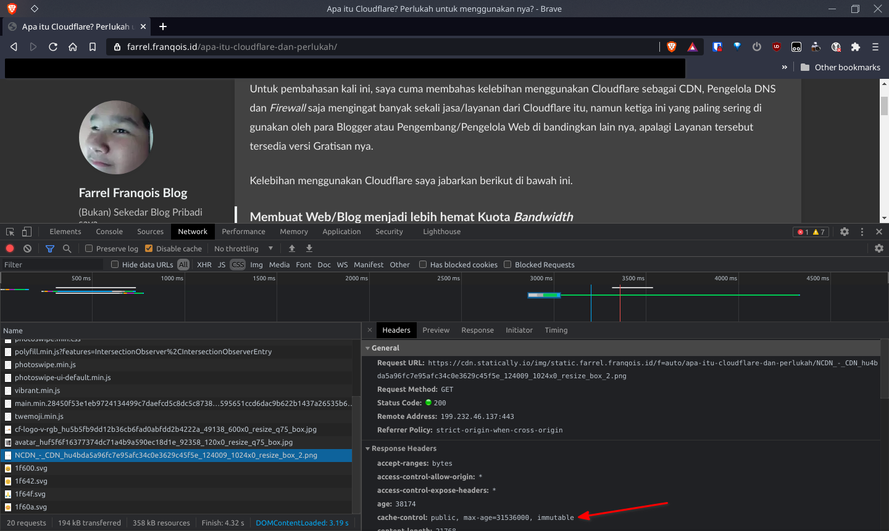

## Daftar Isi


## Pembuka
Kita semua tahu bahwa tidak semua Hosting menerapkan _Unmetered Bandwidth_ atau _Unlimited Bandwidth_ sehingga diberlakukan batasan kuota _Bandwidth_, jika melebihi batas tersebut maka Web/Blog menjadi tidak bisa diakses dan disuruh membayar biaya tambahan untuk menambahkan batasan tersebut agar Web/Blog bisa diakses.

Bahkan Hosting untuk Web Statis seperti Netlify, GitHub Pages, Render, dan Surge.sh pun menerapkan batasan kuota ini. Maka mau-gak mau, suka-gak suka, para pemilik Web/Blog harus menghemat konsumsi _Bandwidth_ Server daripada Web/Blog nya gak bisa diakses hanya karena kehabisan kuota. Belum lagi sama kuota Internet Pengunjung yang juga terbatas, kalau habis ya harus beli lagi, kan boros jadinya :-)

Nah, saya berikan solusi bagi yang ingin menghemat Konsumsi _Bandwidth_ ketika Web/Blog Anda 'dihantam' oleh pengunjung dan bot selama beberapa kali yang mungkin bisa Anda implementasikan. Tentu saja solusi nya tidak cukup dilakukan salah satu saja, melainkan 2 atau 3 solusi harus kamu lakukan demi menghemat konsumsi _Bandwidth_ Server/Hosting.

Berikut dibawah ini adalah solusi-solusi yang bisa Anda terapkan:

### Solusi ke-1: Lakukan kompresi terhadap berkas-berkas statik {#kompresi-berkas-statik}
Melakukan Kompresi terhadap berkas-berkas statik (seperti berkas JS, CSS, Gambar, dll) sebelum digunakan oleh Web/Blog Anda itu **Wajib Hukumnya!**

Ya kali kamu ingin mengunggah dan menyebarkan, serta 'menyajikan' Berkas Gambar yang besar nya beberapa puluhan bahkan ratusan Megabita kedalam Web/Blog kamu kepada pengunjung, kalo saya jadi pengunjungnya, saya malah langsung kabur.

Sudah banyak sekali Perangkat Lunak atau Situs Web yang memiliki fitur untuk meng-kompresi berkas gambar tanpa harus menurunkan kualitas gambar secara kasat mata manusia, sebut saja Situs Web seperti [TinyJPG](https://tinyjpg.com/) atau [TinyPNG](https://tinypng.com/) yang dapat meng-kompresi berkas gambar PNG atau JPG, ini bisa Anda lakukan sebelum mengunggah suatu berkas gambar kedalam Web/Blog Anda. 

Jika Anda menggunakan WordPress\.org (Hos Mandiri/_Self-hosted_), harusnya sudah banyak sekali yang menyediakan sejumlah _Plugin_ untuk melakukan kompresi dan optimasi terhadap berkas-berkas statik sebelum akhirnya 'disajikan' kepada pengunjung.

Atau, jika Anda menggunakan SSG (_Static-site Generator_), terutama Hugo, maka seharusnya ada fitur ["Image Processing"](https://gohugo.io/content-management/image-processing/) untuk memproses berkas Gambar dan ["Hugo Pipes"](https://gohugo.io/hugo-pipes/) untuk memproses berkas-berkas JS, CSS dan SASS yang bisa diimplementasikan kedalam Tema.

Jadi, itu bergantung pada tema yang Anda gunakan, jika temanya mengimplementasikan kedua fitur tersebut dengan benar dan optimal, maka beruntunglah Anda! Tapi, bagaimana jika tidak? Implementasikan lalu optimalkan saja sendiri dan jangan malas!

### Solusi ke-2: Atur HTTP Header `Cache-Control` dengan benar {#header-cache-control}

Mungkin Anda belum pernah mengenal _HTTP Header_ yang satu ini. Yap, `Cache-Control` merupakan sebuah _Response HTTP Header_ yang berfungsi untuk mendikte perilaku _cache_ Peramban Web. 

Singkatnya, Peramban Web akan menyimpan sumber daya tertentu, seperti berkas-berkas Gambar, JS, CSS, HTML dan berkas Statik lain nya disuatu tempat yang disebut dengan **Cache** setelah Situs Web/Blog selesai dimuat atau dikunjungi oleh pengguna. Tentu saja _Cache_ dari Peramban Web ini tersimpan di dalam perangkat penyimpanan yang digunakan sekarang, seperti Harddisk/SSD atau bahkan Memori RAM bisa digunakan.

Saat pengguna mengunjungi Situs Web nya kembali, disinilah _HTTP Header_ `Cache-Control` itu berperan, _Header_ tersebut menetapkan sebuah aturan untuk menentukan apakah Peramban Web yang digunakan oleh Pengguna tersebut akan memuat sumber daya yang diperlukan nya melalui _Cache_ atau justru malah sebaliknya, serta dapat mengatur/menentukan durasi penyimpanan _Cache_ nya.

Jika Peramban Web memuatnya melalui _Cache_ yang tersimpan, maka Peramban Web tidak akan menggunakan koneksi Internet untuk memuatnya, melainkan cukup gunakan media penyimpanan saja, hal ini tentu nya akan menghemat konsumsi _Bandwidth_ baik dari segi Klien dan Server.

Sedangkan jika sebaliknya, maka Peramban Web akan menggunakan Koneksi Internet untuk mendapatkan sumber daya yang dibutuhkan dan Server akan menggunakan koneksi nya untuk memberikan/mengirimkan sumber daya yang dibutuhkan kepada Klien, tentunya hal ini akan mengonsumsi _Bandwidth_ baik dari segi Klien dan Server, serta bisa saja malah menjadi boros jika ini terjadi terus-terusan.

Dalam konteks menghemat Konsumsi _Bandwidth_, mungkin Anda berpikir bahwa membuat Peramban Web dapat menyimpan sumber dayanya dengan waktu yang sangat lama kedalam _Cache_ (seperti mengatur _Header_ `Cache-Control` menjadi `public, max-age=31536000, immutable`) merupakan solusi yang saling menguntungkan, bukan?

Kalau seperti itu, memang benar, tapi akibatnya Situs Web 

### Solusi ke-3: Layani berkas-berkas statik dari Server lain {#layani-berkas-statik-dari-server-lain}

### Solusi ke-4: Gak mau ribet? Bayar! Gak mau bayar? Cari tempat lain! {#bayar-atau-pindah-tempat}
