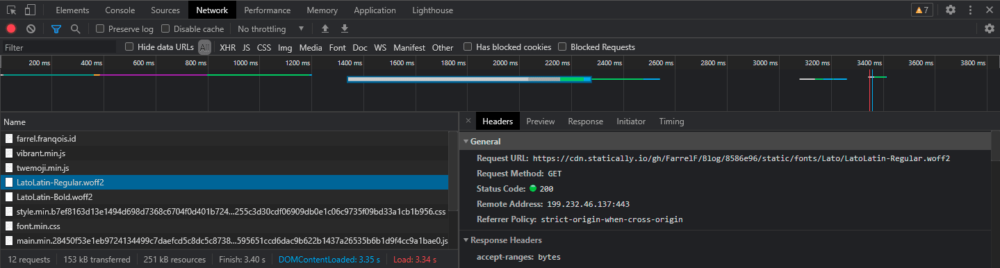

## Pembuka
Kita semua tahu bahwa tidak semua Hosting menerapkan _Unmetered Bandwidth_ atau _Unlimited Bandwidth_ sehingga diberlakukan batasan kuota _Bandwidth_, jika melebihi batas tersebut maka Web/Blog menjadi tidak bisa diakses dan disuruh membayar biaya tambahan untuk menambahkan batasan tersebut agar Web/Blog bisa diakses.

Bahkan Hosting untuk Web Statis seperti Netlify, GitHub Pages, Render, dan Surge.sh pun menerapkan batasan kuota ini. Maka mau-gak mau, suka-gak suka, para pemilik Web/Blog harus menghemat konsumsi _Bandwidth_ Server daripada Web/Blog-nya gak bisa diakses hanya karena kehabisan kuota. Belum lagi sama kuota Internet Pengunjung yang juga terbatas, kalau habis ya harus beli lagi, kan boros jadinya 🙂

Nah, saya berikan solusi bagi yang ingin menghemat Konsumsi _Bandwidth_ ketika Web/Blog Anda 'dihantam' oleh pengunjung dan bot selama beberapa kali yang mungkin bisa Anda implementasikan. Tentu saja solusinya tidak cukup dilakukan salah satu saja, melainkan 2 atau sampai 4 solusi harus kamu lakukan demi menghemat konsumsi _Bandwidth_ Server/Hosting.

## Sanggahan
Perlu Anda pahami bahwa Artikel ini hanyalah membahas bagaimana caranya untuk menghemat Kuota _Bandwidth_ Server, bukan cara mengoptimalkan sebuah Web/Blog ataupun cara menghemat Kuota Internet Pengunjung, karena itu merupakan hal-hal yang sangat berbeda.

Namun dengan ini, Anda juga bisa mengoptimalkan Web/Blog Anda dan bahkan menghemat kuota Internet Pengunjung Anda (terutama jika pengunjung tersebut setia terhadap Web/Blog Anda), atau malah justru sebaliknya.

Segala resiko yang ada setelah menerapkan salah satu atau lebih dari satu solusi pada Web/Blog Anda, silahkan Anda tanggung sendiri. Serta dengan menerapkan solusi-solusi di bawah ini, maka saya anggap bahwa Anda telah memahami solusi yang saya bahas serta resiko yang Anda terima nantinya.

Jadi, mohon perhatian dan pengertiannya dari pembaca sekalian 🙂

Terima kasih atas perhatian dan pengertiannya 😊

## Solusi-solusi untuk menghemat _Bandwidth_ Server
Berikut di bawah ini adalah solusi-solusi yang bisa Anda terapkan:

### Solusi ke-1: Lakukan kompresi terhadap berkas-berkas statik {#solusi-ke1}
Melakukan Kompresi terhadap berkas-berkas statik (seperti berkas JS, CSS, Gambar, dll) sebelum digunakan oleh Web/Blog Anda itu **Wajib Hukumnya!**

Ya kali, kamu ingin mengunggah dan menyebarkan serta 'menyajikan' Berkas Gambar yang besarnya beberapa puluhan bahkan ratusan Megabita kedalam Web/Blog kamu kepada pengunjung, kalo saya jadi pengunjungnya, saya malah langsung kabur alih-alih mengunjunginya.

Selain membuang-buang kuota, hal tersebut akan membuat Konsumsi Sumber Daya di Perangkat meningkat drastis karena Peramban Web akan memproses berkas-berkas statiknya.

Sudah banyak sekali Perangkat Lunak atau Situs Web yang memiliki fitur untuk mengoptimalkan berkas-berkas statik, salah satunya meng-kompresi berkas gambar tanpa harus menurunkan kualitas gambar secara kasat mata manusia, sebut saja Situs Web seperti [TinyJPG](https://tinyjpg.com/) atau [TinyPNG](https://tinypng.com/) yang dapat meng-kompresi berkas gambar PNG aau JPG, ini bisa Anda lakukan sebelum mengunggah suatu berkas gambar ke dalam Web/Blog Anda.

Atau, untuk mengoptimalkan berkas-berkas gambar di Komputer/Laptop Anda tanpa harus Unggah ke Web/Blog dulu, Anda bisa gunakan perangkat lunak seperti [Caesium](https://saerasoft.com/caesium)\*, [Imagine](https://github.com/meowtec/Imagine), [FileOptimizer](https://nikkhokkho.sourceforge.io/static.php?page=FileOptimizer)\* atau [ImageOptim](https://imageoptim.com/mac) untuk pengguna Apple macOS 10.9+.

**\*Catatan:** Dua perangkat lunak yang ditandai bintang itu hanya mendukung Sistem Operasi Windows saja.

Jika Anda menggunakan WordPress\.org (Hos Mandiri/_Self-hosted_), harusnya sudah banyak sekali yang menyediakan sejumlah _Plugin_ untuk melakukan kompresi dan optimasi terhadap berkas-berkas statik sebelum akhirnya 'disajikan' kepada pengunjung.

Atau, jika Anda menggunakan SSG (_Static-site Generator_), terutama Hugo, maka seharusnya ada fitur ["Image Processing"](https://gohugo.io/content-management/image-processing/) untuk memproses berkas Gambar dan ["Hugo Pipes"](https://gohugo.io/hugo-pipes/) untuk memproses berkas-berkas JS, CSS dan SASS yang bisa diimplementasikan kedalam Tema.

Selebihnya masih banyak cara lain yang bisa Anda lakukan untuk mengecilkan ukuran berkas-berkas statik, sebelum akhirnya digunakan untuk Produksi.

### Solusi ke-2: Atur HTTP Header `Cache-Control` dengan benar {#solusi-ke2}


Mungkin Anda belum pernah mengenal _HTTP Header_ yang satu ini. Yap, `Cache-Control` merupakan sebuah _HTTP Header_ yang berfungsi untuk mendikte perilaku _cache_ yang dilakukan oleh Peramban Web.

Singkatnya, Peramban Web akan menyimpan sumber daya tertentu, seperti berkas-berkas Gambar, JS, CSS, HTML dan berkas Statik lainnya disuatu tempat yang disebut dengan **Cache** setelah Situs Web/Blog selesai dimuat atau dikunjungi oleh pengguna.

Tentu saja _Cache_ dari Peramban Web ini tersimpan di dalam perangkat penyimpanan yang digunakan sekarang, seperti Harddisk/SSD atau bahkan Memori RAM bisa digunakan.

Saat pengguna mengunjungi Situs Web-nya kembali, di sinilah _HTTP Header_ `Cache-Control` itu berperan, _Header_ tersebut menetapkan sebuah aturan untuk menentukan apakah Peramban Web yang digunakan oleh Pengguna tersebut akan memuat sumber daya yang diperlukannya melalui _Cache_ atau justru malah sebaliknya, serta dapat mengatur/menentukan durasi penyimpanan _Cache_-nya.

Jika Peramban Web memuatnya melalui _Cache_ yang tersimpan, maka Peramban Web tidak akan menggunakan koneksi Internet untuk memuatnya, melainkan cukup gunakan media penyimpanan yang ada saja, hal ini tentunya akan menghemat konsumsi _Bandwidth_ baik dari segi Klien dan Server, terutama jika disimpan dalam waktu yang lama.

Sedangkan jika sebaliknya, maka Peramban Web akan selalu menggunakan Koneksi Internet untuk mendapatkan sumber daya yang dibutuhkan dan Server akan menggunakan koneksinya untuk memberikan/mengirimkan sumber daya yang dibutuhkan kepada Klien, tentunya hal ini akan mengonsumsi _Bandwidth_ baik dari segi Klien dan Server, serta bisa saja malah menjadi boros jika ini terjadi terus-terusan.

Untuk mengetahui perbedaan jika sumber daya disimpan ke dalam _Cache_ Peramban Web, serta digunakan atau tidaknya, bisa Anda lihat cuplikan berikut:

 

Dalam konteks menghemat Konsumsi _Bandwidth_ baik dari segi Server atau Klien, mungkin Anda berpikir bahwa membuat Peramban Web dapat menyimpan sumber dayanya dengan waktu yang sangat lama kedalam _Cache_ (seperti mengatur _Header_ `Cache-Control`-nya menjadi `public, max-age=31536000, immutable`) itu merupakan solusi yang saling menguntungkan, bukan?

Kalau seperti itu, memang benar, tapi akibatnya tampilan Situs Web menjadi tidak berubah sama sekali bahkan dapat merusak penampilan sebuah Situs Web, atau lebih parahnya konten-konten pada Situs Web menjadi tidak terlihat diperbarui (alias _"outdated\"_ atau "gak _update_") bahkan setelah menerbitkannya beberapa kali.

Hal ini terjadi karena Peramban Web akan tetap memuatnya melalui _Cache_ dan yang dimuat itu bukanlah Berkas yang baru, melainkan yang telah disimpan sebelumnya atau yang lama, sehingga sumber dayanya tertahan oleh _Cache_.

Tapi, ini adalah hal yang cukup krusial untuk diatur agar bisa menghemat konsumsi _Bandwidth_, jadi aturlah _Header_ tersebut dengan benar dan lakukan teknik _Cache Busting_ pada berkas-berkas statik sebelum mengatur `Cache-Control`0nya, serta bedakan mana sumber daya yang harus _di-cache_ dalam waktu yang lama atau tidaknya.

Untuk cara menyetel _HTTP Header_ (untuk _Response Header_)-nya, bisa Anda kunjungi referensi berikut:

- [How to modify HTTP headers using .htaccess files](https://www.a2hosting.com/kb/developer-corner/apache-web-server/modifying-http-headers) (Untuk Pengguna Apache/LiteSpeed)
- [How to Set Up Custom Headers - OpenLiteSpeed](https://openlitespeed.org/kb/how-to-set-up-custom-headers/) (Untuk Pengguna OpenLiteSpeed)
- [Adding and using header (HTTP) in nginx - Stack Overflow](https://stackoverflow.com/questions/11973047/adding-and-using-header-http-in-nginx) (Untuk Pengguna NGINX)
- [Custom headers - Netlify Docs](https://docs.netlify.com/routing/headers/) (Untuk Pengguna Netlify)
- [HTTP Headers for Static Sites - Render](https://render.com/docs/static-site-headers) (Untuk Pengguna Render sebagai Hosting Web/Blog Statis)
- [Configuration - Vercel](https://vercel.com/docs/configuration#project/headers) (Untuk Pengguna Vercel)

Sedangkan untuk mengatur _Header_ `Cache-Control` dengan benar, beserta dengan teknik _Cache Busting_-nya, ada referensi yang cukup bagus untuk Anda pelajari, bisa Anda kunjungi melalui tautan berikut:

- [Cache-Control for Civilians - CSS Wizardy](https://csswizardry.com/2019/03/cache-control-for-civilians/)

### Solusi ke-3: Memuat berkas-berkas statik (atau bahkan Web/Blog) dari Server lain {#solusi-ke3}
Jika Anda ingin menghemat konsumsi _Bandwidth_ Server, maka Anda bisa meng-hos kan Berkas-berkas statik lainnya di Server yang berbeda. Contohnya?

Anda mempunyai Blog yang disimpan di Server A yang mempunyai kuota _Bandwidth_ sebesar 100 GB/Bulan, untuk menyiasati/mengakalinya, Anda bisa menyimpan berkas-berkas statik lainnya di Server B yang batasan _Bandwidth_-nya sangat besar (sampai dikira tidak terbatas).

Sehingga peramban web milik pengunjung akan memuat berkas-berkas statiknya melalui Server B jika mengunjungi Situs Web/Blog Anda daripada Server A dan akan menghemat konsumsi _Bandwidth_ pada Server A, karena pada dasarnya Server A tidak digunakan untuk memuat berkas-berkas statik.

Ini adalah salah satu cara yang paling ampuh untuk menghemat konsumsi _Bandwidth_ Server ketimbang solusi-solusi tersedia lainnya.

Contoh lain? Sesuai contoh di atas, Anda juga bisa menggunakan [Google Fonts](https://fonts.google.com) atau [Adobe Fonts](https://fonts.adobe.com) sebagai penyedia Fon untuk Situs Web/Blog Anda ketimbang melakukan Hos Mandiri di Server Utama Anda.

Atau, Anda juga bisa memakai layanan CDN untuk Publik seperti [cdnjs](https://cdnjs.com), [unpkg](https://unpkg.com), [jsDelivr](https://www.jsdelivr.com), atau [Statically](https://statically.io) untuk memuat pustaka-pustaka web yang ada, seperti jQuery, Bootstrap, Twemoji dan Pustaka lainnya ketimbang melakukan Hos Mandiri.

Bahkan Anda juga bisa menggunakan Layanan CDN (_Content Delivery Network_) pihak ketiga yang dipasang pada Web/Blog Anda untuk mengakalinya, seperti menggunakan layanan CDN dari Cloudflare yang Gratisan misalnya.

Lho, kok bisa? Karena pada dasarnya jika Anda menggunakan CDN pihak ketiga untuk Web/Blog Anda, maka pengunjung akan memuat Situs Web/Blog atau berkas-berkas statiknya dari Server CDN, meskipun perlu proses 'penarikan' berkas dari Server Aslinya.

Kira-kira, Illustrasinya seperti berikut:


Untuk Layanan CDN yang gratis, Anda bisa gunakan Layanan CDN untuk Publik yang saya sebut di atas, seperti jsDelivr atau Statically. Bahkan Anda juga bisa menghantarkan berkas-berkas Gambar, JS dan CSS yang ada tersimpan di dalam Web/Blog Anda melalui Statically, lho!

Intinya, buatlah agar pengunjung memuat berkas statiknya dari server lain selain server utama untuk menghemat _Bandwidth_ dari Server Utama, itu aja. Serta, sekali lagi saya sebutkan bahwa cara ini merupakan salah satu cara yang paling ampuh dalam menghemat konsumsi _Bandwidth_ Server.

### Solusi ke-4: Buatlah agar berkas-berkas statik tidak bisa diakses dari luar {#solusi-ke4}
Jika Anda ingin lebih menghemat konsumsi _Bandwidth_ Server, maka buatlah berkas-berkas statik tidak bisa diakses dari luar Web/Blog Anda.

Kenapa? Karena jika Anda membiarkan gambar-gambarnya diakses dari Web/Blog lain, maka hal ini akan mengonsumsi _Bandwidth_ dari Server Anda secara terus-menerus dan ini bisa saja merupakan praktik pencurian aset Web/Blog tanpa izin dari Anda. Praktik tersebut dinamakan _Hotlinking_.

Jika Anda bertanya bagaimana cara untuk mencegah hal seperti ini, maka jawabannya adalah Blokir Aksesnya jika berkas tersebut tidak merujuk dari Web/Blog Anda ketika mengaksesnya. Contoh: Buatlah berkas-berkas yang ada di `website-a.com` hanya bisa diakses dari domain `website-a.com` saja, bukan dari domain `website-b.com`, dsb.

Jika Anda menggunakan CDN dari Cloudflare, maka Anda bisa mengaktifkan fitur **Hotlink Protection** yang terletak pada bagian **Scrap Shield** di dalam [Dasbor Cloudflare Anda](https://dash.cloudflare.com). Atau, jika Anda menggunakan Layanan CDN, maka Anda perlu melakukannya melalui Panel yang tersedia dari Penyedia CDN-nya.

Jika Anda menggunakan Layanan _Shared Hosting_ dan tidak menggunakan CDN sama sekali, maka di dalam kontrol panel yang digunakan oleh pihak Hosting (seperti: cPanel, DirectAdmin, dll) harusnya sudah ada fitur Proteksi dari Praktik _Hotlinking_ secara bawaan, Anda bisa gunakan itu jika ada.

Atau, Anda bisa kunjungi referensi berikut jika Anda ingin menyetelnya secara manual:

- [What Is Hotlinking? - KeyCDN Support](https://www.keycdn.com/support/what-is-hotlinking)
- [How to Prevent Image Hotlinking in Apache with .htaccess - TecAdmin](https://tecadmin.net/disable-image-hotlinking-apache/) (Hanya untuk Pengguna Apache/LiteSpeed)

### Solusi ke-5: Gak mau ribet? Tambah kuotanya! {#solusi-ke5}
Iya, saya tahu bahwa ini bukanlah cara menghemat, tapi saya kasih solusi bagi Anda yang tidak ingin kuota _Bandwidth_-nya habis, tapi gak mau ribet dengan melakukan solusi-solusi di atas. 

Yap, Anda tinggal memikirkan bagaimana caranya menambah Kuota _Bandwidth_ yang tersedia jika tidak mau ribet. Untuk saat ini pilihannya cuma dua, yakni bayar biayanya atau pindah ke penyedia lain yang kuotanya lebih banyak.

Tidak ada pilihan selain itu dan ini merupakan solusi yang cukup realistis atau masuk akal. Jika Anda ingin gratis, lakukan kedua atau sampai keempat solusi di atas, sedangkan jika Anda tidak mau ribet, tinggal tambahkan saja kuotanya, sesederhana itu bukan?

## Pertanyaan dan Jawaban yang (akan) sering ditanya {#pertanyaan-dan-jawaban}
Ini adalah bagian yang berisi tentang Pertanyaan yang (akan) sering ditanyakan, beserta Jawabannya.

Mungkin Anda perlu membaca pertanyaan dan jawabannya terlebih dahulu sebelum bertanya di kolom komentar sebagai referensi Anda.

### Pertanyaan ke-1: Apa itu _Cache Busting_? {#pertanyaan-ke1}
**Jawab:** _Cache Busting_ adalah sebuah teknik agar Peramban Web dapat memuat berkas yang lebih baru saat mengunjung sebuah Situs Web/Blog setelah adanya perubahan pada berkas tersebut, tanpa harus menunggu selama itu, namun berkas-berkas tersebut akan tetap _di-cache_ dalam waktu yang sangat lama.

Teknik ini akan menjawab pertanyaan seperti berikut: 
> Sebelumnya, saya telah mengatur agar berkas-berkas statik bisa tersimpan _di-cache_ dalam waktu 1 Tahun oleh Peramban Web, tapi masalahnya saya baru saja telah melakukan perubahan pada berkas tersebut.
> 
> Jadi, bagaimana agar pengunjung tidak perlu menunggu selama 1 Tahun untuk dapat menikmati perubahannya? Masa saya harus nyuruh pengunjung untuk membersihkan _Cache_ atau _Clear Cache_ pada Peramban Webnya?

Intinya, melakukan teknik _Cache Busting_ akan menyelesaikan masalah di atas.

### Pertanyaan ke-2: Situs Web/Blog saya terpasang Iklan (salah satunya: Google AdSense), apakah hal itu akan membuat boros Konsumsi _Bandwidth_ Server? {#pertanyaan-ke2}
**Jawab:** Tidak, karena pada dasarnya Anda tidak menyimpan berkas apapun ke dalam server Anda, kecuali Anda menyisipkan skrip kedalam HTML dan itupun ukurannya sangat kecil.

Sehingga jika Skrip tersebut termuat, maka yang dimuat adalah aset/sumber daya yang berasal dari Server lain, bukan dari Server Anda dan sangat sedikit pengaruhnya bagi server Anda.

Tapi kalo ditanya "Apakah ini akan membuat boros Kuota _Bandwidth_/Kuota Internet Pengunjung?", maka jawabannya adalah **Iya**.

Karena pada dasarnya Peramban Web Pengunjung secara otomatis akan memuat iklan-iklan yang sangat dinamis dalam berbagai format (entah itu dalam bentuk teks, gambar, video, dan lain-lain) saat berkunjung ke Situs Web/Blog Anda dan itu menggunakan koneksi Internet dari pengunjung agar bisa termuat, kecuali jika diblokir dari sisi klien/pengunjung.

### Pertanyaan ke-3: Apakah tidak ada solusi lain? {#pertanyaan-ke3}
**Jawab:** Untuk saat ini tidak ada, solusi-solusi yang saya tulis itu merupakan solusi yang cukup realistis/masuk akal supaya Anda dapat mengimplementasinya dengan baik, sehingga hanya solusi itu yang saya tahu.

Jika Anda memiliki solusi lain, maka Anda bisa memanfaatkannya. Namun, jika Anda memiliki solusi masuk akal lainnya, silahkan berikan masukkan dari Anda melalui kolom komentar 🙂

### Pertanyaan ke-4: Saya menggunakan CDN dari Cloudflare untuk Web/Blog saya demi menghemat konsumsi _Bandwidth_, maka solusi mana yang saya implementasikan? {#pertanyaan-ke4}
**Jawab:** Kamu mengimplementasikan [Solusi ke-3](#solusi-ke3).

Lho, kenapa? Karena pada dasarnya kamu telah mengatur bahwa pengunjung Situs Web/Blog kamu akan dilayani oleh Cloudflare, sehingga Web/Blog kamu akan dimuat menggunakan Server dari Cloudflare ketika dikunjungi, bukan lagi oleh Server Anda, meskipun Cloudflare membutuhkan penarikan berkas-berkas/sumber daya yang diperlukan dari Server Anda.

Jadi maksudnya adalah jika Anda menggunakan CDN dan melakukan _reverse-proxy_ (seperti menggunakan CDN dari Cloudflare), maka pengunjung tidak lagi mengakses Server Aslinya, melainkan Server CDNnya, sehingga ini akan menghemat konsumsi _Bandwidth_ Server.

Ini mirip seperti menyimpan sebuah berkas di Server lain, tapi yang disimpan ini bukanlah cuma berkas, melainkan 1 Situs Web/Blog secara keseluruhan.

### Pertanyaan ke-5: Apakah menghemat konsumsi _Bandwidth_ Server sama dengan menghemat Kuota Internet Pengunjung? {#pertanyaan-ke5}
**Jawab:** Tidak selalu, bisa iya dan bisa juga tidak, terutama jika Anda memiliki sumber daya eksternal (dari luar server Anda) dan itu tetap dimuat oleh pengunjung saat mengunjungi Web/Blog Anda.

Kenapa bisa begitu? Karena setiap Server memiliki kebijakan yang berbeda-beda, terutama perlakuan _Cache_ pada Peramban Web, ada server yang mengizinkan agar Peramban Web dapat menyimpan berkas-berkas/sumber daya kedalam _Cache_ dalam waktu yang sangat lama, bahkan ada pula yang tidak mengizinkan sama sekali.

Terlebih, saat mengunjungi Web/Blog Anda, Peramban Web akan memuat segala sumber daya yang diperlukannya, baik yang asalnya dari dalam Server itu sendiri dan dari luar Server yang tentunya memiliki kebijakan yang berbeda-beda.

Jika Server Luarnya tidak mengizinkan Peramban Web untuk menyimpan Berkas-berkas kedalam _Cache_, sedangkan Server Aslinya mengizinkannya, maka hal ini akan membuat konsumsi _Bandwidth_ Internet Pengunjung akan meningkat dan akan membuat boros kuota Internet jika itu terjadi terus-terusan, kecuali jika diblokir dari sisi klien/pengunjung.

Contohnya adalah _Platform_ Iklan seperti Google AdSense yang terpasang di Situs Web/Blog (mengacu pada [pertanyaan kedua](#pertanyaan-ke2)), karena sifatnya yang sangat dinamis dan bisa tampil dalam berbagai format, supaya bisa tampil seperti itu dan bisa ganti Iklan, maka tidak mungkin Server akan mengizinkan Peramban Web menyimpan Iklan tersebut kedalam _Cache_.

Iklan tersebut dimuat dari server lain, sehingga konsumsi _Bandwidth_ Server Utama tidak terpengaruh, tapi hal tersebut membuat Kuota Internet Pengunjung jadi boros karena membiarkan peramban web memuat iklannya, kecuali jika iklannya diblokir.

Namun, hal ini akan beda lagi jika kedua server (baik luar ataupun dalam) sama-sama mengizinkan Peramban Web untuk menyimpan berkas sumber dayanya kedalam _Cache_ dalam waktu yang lama, maka baik kuota Internet Pengunjung dan Konsumsi _Bandwidth_ Server akan bisa sedikit diperhemat.

### Pertanyaan ke-6: Apakah ada perangkat lunak, situs web atau solusi lain untuk mengoptimalkan berkas-berkas statik selain yang disebutkan di dalam artikel ini? {#pertanyaan-ke6}
**Jawab:** Banyak, tapi cari sendiri di Mesin Pencari aja, banyak jawabannya di sana.

Kata kunci yang bisa Anda gunakan untuk mesin pencari adalah, seperti: "Image Compression", "Image Compressor", "Image Optimizer", "CSS Minify", "JS Minify", "CSS Minifier", "JS Minifier" atau kata kunci lainnya yang bisa Anda kembangkan sendiri. 

Jika Anda ingin mencari perangkat lunaknya, Anda bisa tambahkan "Software" di akhir kata kuncinya, seperti "Image Compression Software" misalnya atau kembangkan saja sendiri biar hasilnya lebih akurat.

### Pertanyaan ke-7: Apakah semua solusi yang ada di sini itu mempercepat atau mengoptimalkan sebuah Situs Web? {#pertanyaan-ke7}
**Jawab:** Bisa iya, bisa juga tidak, atau bahkan bisa terjadi sebaliknya. Kecepatan Akses dan Kecepatan Penyelesaian Pemuatan pada Web/Blog itu terjadi karena banyak faktor.

Sedangkan untuk mengoptimalkan sebuah Web/Blog agar cepat diakses dan dimuat oleh Peramban Web itu banyak yang harus Anda lakukan selain melakukan solusi-solusi di atas.

Bahkan bisa terjadi sebaliknya, yakni Blog/Web menjadi lambat ketika diakses, atau malah sampai menjadi tidak tersedia (_nge-down_) setelah melakukan solusi-solusi di atas.

Jadi, jika Anda ingin menerapkan salah satu atau lebih dari solusi di atas, maka segala resiko harus Anda tanggung sendiri.

### Pertanyaan ke-8: Saya gak mau ribet kayak solusi-solusi di atas dan gak mau bayar juga, terus gimana solusi gratis yang paling mudah dan paling instannya, tentunya bebas ribet? {#pertanyaan-ke8}
**Jawab:** Menggunakan CDN dari Cloudflare yang Gratisan bisa cukup membantu untuk kasus seperti itu. 

Atau jika bisa, terapkan [solusi ke-3](#solusi-ke3) untuk Web/Blog Anda, contoh paling mudah memakai [Google Fonts](https://fonts.google.com) atau [Adobe Fonts](https://fonts.adobe.com) sebagai penyedia Fon atau simpan berkas gambar di Penyedia Hosting untuk Gambar, seperti [Imgur](https://imgur.com), [Postimages](https://postimages.org/id/) atau [ImgBB](https://imgbb.com/).

Tapi kalo kamu masih menganggapnya ribet atau sulit untuk dilakukan, maka solusinya adalah dengan menutup akses pangunjung ke Web/Blog Anda, entah itu dengan mengosongkan Web/Blog-nya atau memblokir akses dari pengunjung melalui _Firewall_ atau menghapus/menutup Web/Blog Anda atau lainnya. 

Dengan ini, Kuota _Bandwidth_ akan bisa diperhemat, bahkan Kuotanya malah jadi tidak terpakai sama sekali.

Solusinya gak ribet, instan dan sangat mudah untuk dilakukan bagi semua orang, tanpa perlu mengeluarkan biaya sedikitpun.

## Penutup
Ya sudah, artikelnya saya cukupkan dulu saja di sini. Dari Artikel ini, Anda belajar bahwa untuk menghemat kuota _Bandwidth_ Server memang harus ada usaha yang cukup dari yang punya Situs Web/Blog, kalau gak mau ribet ya solusinya nambah kuota, entah itu bayar atau pindah ke penyedia lain.

Terima kasih bagi Anda yang telah membaca artikel ini. Gimana? Pusing kan? Yah, saya hanya memberitahukan konsepnya saja, terlebih satu bagian di artikel ini memang "Panjang x Lebar", jadi maaf kalau saya tidak bisa memberikan cara implementasinya secara detail.

Serta, mohon maaf jika artikel ini memiliki kekeliruan dan kesalahan, baik dari ada yang salah ngetik, terlalu panjang, bertele-tele, dll. 

Jika adanya kesalahan dan kekeliruan dari saya, atau jika Anda memiliki pertanyaan lainnya/klarifikasi, bisa Anda berikan masukkan melalui kolom komentar yang tersedia. Masukkan dari Anda akan sangat berarti bagi saya dan artikel ini untuk kedepannya nanti.

Terima kasih atas perhatiannya 😊

## Penggunaan Gambar dan Atribusi
Berkas-berkas Gambar (seperti Cuplikan layar dan Gambar lainnya) yang digunakan di dalam artikel ini, disediakan di dalam [_Repository_ Blog ini](https://github.com/FarrelF/Blog).

Jika Anda ingin menjelajahinya, silahkan kunjungi Alamat URL berikut:

```plain
https://github.com/FarrelF/Blog/tree/main/content/post/2021-05-06-cara-menghemat-konsumsi-bandwidth-server
```

Gambar Illustrasi yang nama berkasnya adalah `NCDN_-_CDN.png` itu merupakan Illustrasi yang dibuat oleh "Kanoha" bersumber dari [Wikimedia Commons](https://commons.wikimedia.org/wiki/File:NCDN_-_CDN.png) dan dilisensikan di bawah ["CC BY-SA 3.0 Unported"](https://creativecommons.org/licenses/by-sa/3.0/deed.en) oleh sang pembuat.

Serta, sebuah foto yang nama berkasnya adalah `micheile-henderson-SoT4-mZhyhE-unsplash.jpg` yang saya gunakan sebagai sampul artikel itu merupakan sebuah foto yang dipotret oleh ["Micheile Henderson"](https://unsplash.com/@micheile) bersumber dari [Unsplash](https://unsplash.com/photos/SoT4-mZhyhE) dan dilisensikan di bawah ["Unsplash License"](https://unsplash.com/license) oleh sang pembuat.
