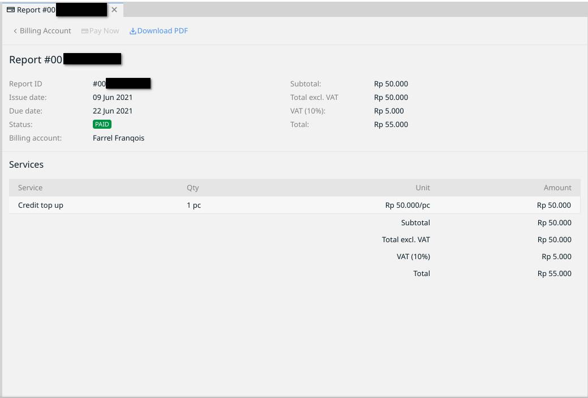
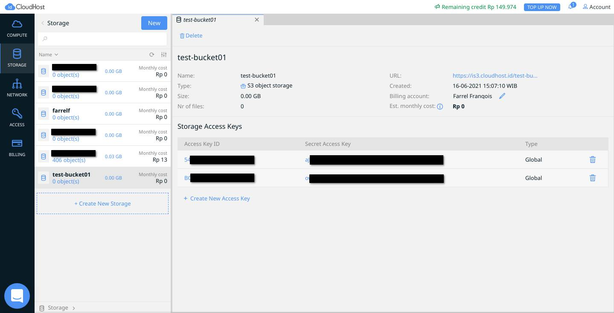
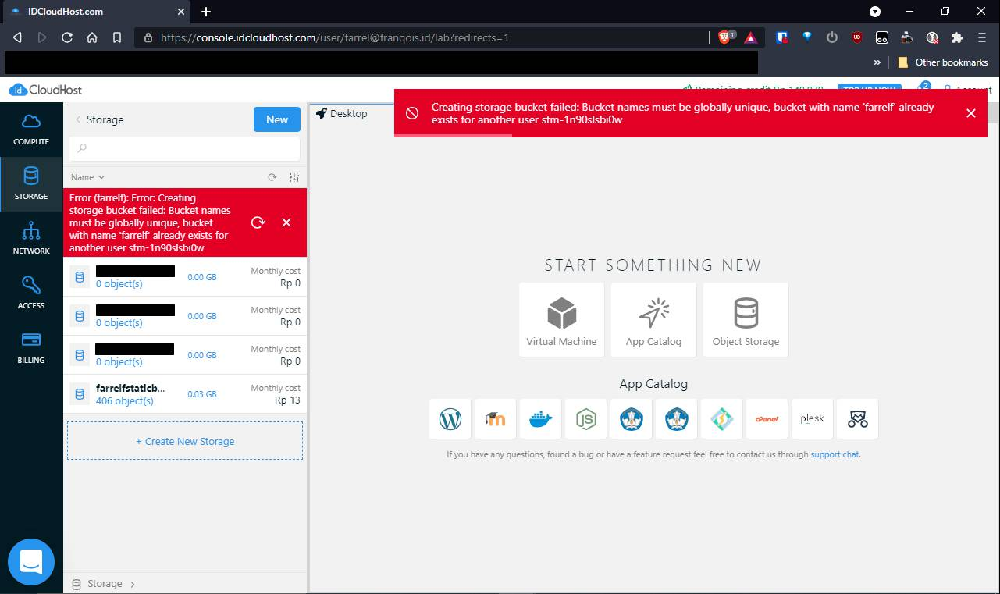
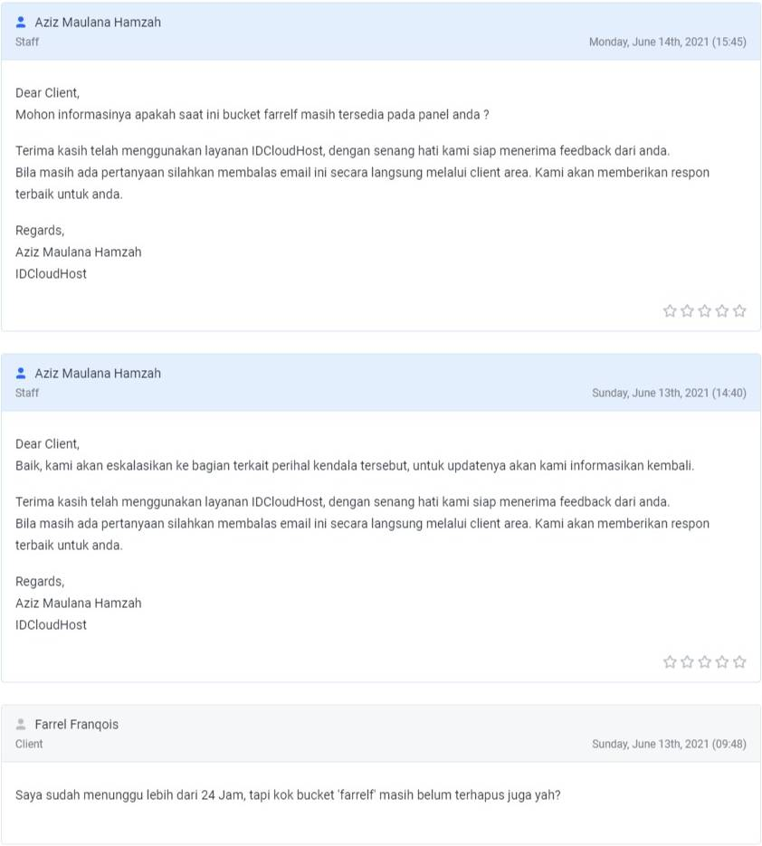
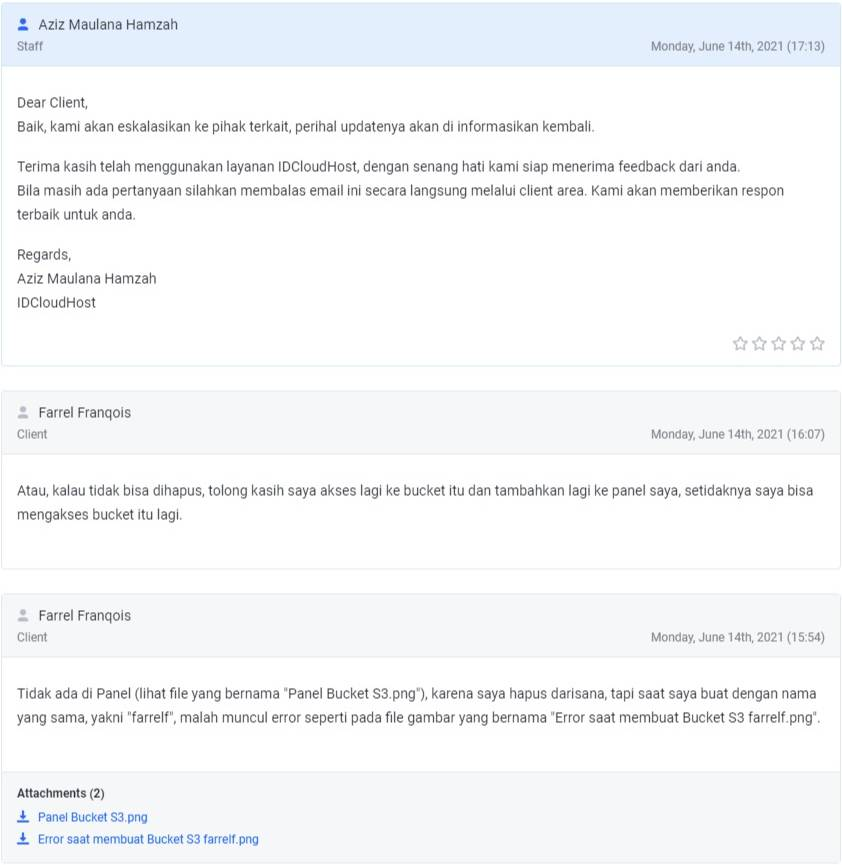
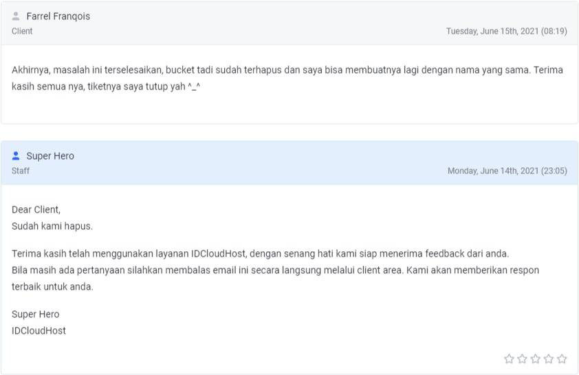

## Daftar Isi


## Pembuka
Setelah berbulan-bulan saya menggunakan FTP sebagai Protokol nya, kini saya menggunakan S3 sebagai Protokol Penyimpanan nya, yang tentunya untuk blog ini.

Karena sampai artikel ini ditulis, Bunny CDN masih belum merilis layanan penyimpanan yang menggunakan Protokol S3, masih menggunakan FTP hingga sekarang, akhirnya saya pindah ke IDCloudHost. 

Tentu saja saya tidak berlangganan hosting nya di sana, melainkan saya hanya berlangganan "Object Storage" nya saja yang menggunakan Protokol S3.

Di Artikel ini, saya akan bahas pengalaman saya saat menggunakan menggunakan layanan ini sekaligus penggunaan nya sebagai seorang yang pertama kali menyicipi Penyimpanan yang berbasis Objek ini.

Ya Anda benar, saya sendiri baru pertama kali menggunakan layanan penyimpanan dengan protokol S3 ini. Jadi, kalau ada kesalahan pada saya, tolong koreksi saya yah, saya juga masih sangat pemula terhadap Protokol S3 ini, hihi 😁

Oh iya, semua Cuplikan Layar yang ditampilkan itu merupakan cuplikan layar yang terbaru, bukan pada saat saya melakukan semua nya, karena saya tidak sempat mengambil cuplikan layar pada saat itu, jadi harap maklum yah 😊

## Pengalaman Penyimpanan S3 di IDCloudHost

### Saat pertama kali mengetahui nya
Saya mengetahui layanan ini dari Tweet Bapak Achmad Zaky berikut, yang merupakan Pendiri sekaligus mantan CEO Bukalapak (yang sekarang merupakan Pendiri dari Init 6)





Entahlah Tweet yang mana, tapi yang jelas saya tahu ini dari Tweet nya beliau yang dikutip oleh Bapak Teguh Aprianto.

Sontak hal itu membuat saya langsung mengunjungi situs web resminya IDCloudHost dan melihat-lihat apa saja produk-produk atau layanan nya dan ternyata di sana ada produk/layanan Penyimpanan Berbasis Objek yang menggunakan Protokol S3 yang bernama IS3 (IDCloudHost S3).

Harga yang ditawarkan sangat murah, yakni cuma sebesar Rp. 507,00/GB/Bulan saja, bahkan lebih murah daripada Layanan _Object Storage_ dari Indonesia lain nya yang pernah saya temui, seperti: [Biznet NEO Object Storage](https://www.biznetgio.com/product/neo-object-storage) dan [Kilat Storage](https://www.cloudkilat.com/layanan/kilat-storage).

Tentu saja biaya tersebut tidak termasuk biaya per _Request_ yang dilakukan, _Bandwidth_ keluar/masuk, dan biaya-biaya lainnya, karena biaya-biaya tersebut memang tidak ada di sana.

Karena harga yang murah serta bonus saldo sebesar Rp. 100.000,00 setelah melakukan isi ulang, hal itu membuat saya ingin mencoba layanan Penyimpanan berbasis Objek beberapa hari setelah saya mengunjunginya.

### Saat Pendaftaran dan Berlangganan
Berbeda daripada Layanan IDCloudHost pada umumnya (seperti Domain, Hosting, VPS, _Dedicated/Colocation Server_, dll), untuk bisa berlangganan Layanan Fleksibel nya (Seperti: _Virtual Machine_/VPS yang Fleksibel, _Network Resources_, dan _Object Storage_) maka Anda perlu mendaftar akun di Konsol IDCloudHost yang beralamat: [https://console.idcloudhost.com](https://console.idcloudhost.com) terlebih dahulu.

Ya, ini bukan seperti biasanya yang menggunakan laman [My IDCloudHost](https://my.idcloudhost.com) untuk segala urusan layanan yang ada dan layanan fleksibel tadi tidak menggunakan laman ini. Dengan kata lain, Anda harus buat akun nya di Konsol IDCloudHost itu tadi agar dapat menikmati nya.

 

Saya daftar akun nya pada akhir Mei yang lalu dan saya melakukan pengisian ulang (top-up) pada tanggal 9 Juni yang lalu, itu semua terjadi saat IDCloudHost memberikan Kredit sebesar Rp. 100.000,00 secara gratis jika saya melakukan _top-up_ yang minimalnya Rp. 50.000,00 dan saya isi ulang sebesar minimalnya saja.

Harga itu tentu saja belum termasuk PPn 10%, jadi saya bayar sebesar Rp. 55.000,00 saja untuk mengisi ulang nya. 

Metode pembayaran nya pun beragam, selain Kartu Kredit (Visa/Mastercard), ada ATM Bersama, Akun Virtual (Virtual Account) dari beberapa Bank, seperti Bank Permata, Mandiri, Maybank, BNI, dan CIMB Niaga (tidak ada _Virtual Account_ BCA), serta mendukung pembayaran lewat Ritel (seperti: Alfamart & Dan-dan), Pegadaian, Kantor Pos, OVO dan QRIS dari Shopee Pay saat artikel ini saya tulis.

Karena saya menggunakan LinkAja, maka saya pilih menggunakan Kode QRIS dari Shopee Pay, pembayarannya pun mudah, saya tinggal memindai Kode QR yang muncul di layar saja, nanti akan muncul semua biaya yang tertera di LinkAja. 

Setelah itu saya klik bayar dan masukkan nomor PIN nya, lalu pembayaran akan diproses dan diselesaikan secara otomatis tanpa harus verifikasi lagi setelah saya memasukkan kode PIN nya tadi. Sungguh mudah, bukan?

 

Tentu saja tidak ada biaya tambahan lain nya saat pengisian selain PPn 10%, yang artinya saya cuma membayar sebesar Rp. 55.000,00 saja kemarin. Setelah mengisi ulang saldo, barulah secara otomatis saya mendapatkan kredit gratis sebesar Rp. 100.000,00 dan saya langsung berlangganan _Object Storage_ nya pada saat itu juga.

### Saat pertama kali membuat Penyimpanan S3
Agar dapat menggunakan layanan penyimpanan dengan Protokol S3, maka Anda perlu membuat sebuah "wadah" yang disebut dengan "Bucket", wadah tersebut sudah jelas fungsinya, yakni untuk menyimpan Berkas dan Folder di dalam nya, namanya aja "Bucket", kalau kamu pernah ke KFC pastinya tahu apa itu "Bucket" dan perbedaan nya. 

Untuk membuat bucket nya sendiri cukup mudah, Anda tinggal klik pada "Storage" lalu klik "Create New Storage", isikan nama bucket nya, karakter nama bucket yang diizinkan yaitu: Mengandung angka, huruf kecil atau/dan tanda hubung (-). Kalau selesai, tinggal klik "Create" saja di bagian paling kanan.

Pembuatan yang mudah dan tanpa halangan, itulah yang saya alami saat membuat Bucket S3 di IDCloudHost, bucket S3 pertama yang saya buat bernama `farrelf` pada saat itu. Cuplikan di bawah ini hanyalah gambaran penampilan nya saja, karena pada saat itu tampilan nya benar-benar kosong dan belum ada satupun Bucket S3 nya saat itu.


Setelah dibuat dan bucket tersebut dipilih, maka akan tampil sebuah informasi untuk Bucket S3 yang cukup minim, seperti pada cuplikan berikut:



Kenapa minim? Karena disitu tidak ada Informasi tentang _Endpoint_, Alamat URL Alternatif, Informasi mengenai _Region_, dan Informasi yang diperlukan lainnya, saya baru menyadari semua itu saat menggunakan nya yang saya bahas lebih lanjut lagi.

Mungkin karena "Object Storage" ini baru banget kali yah sehingga minim gitu Informasinya, semoga semakin lengkap lagi Informasi nya 😊

Awalnya saya mengira kalau **Access Key ID** dan **Secret Key Access** itu cuma berlaku di satu Bucket S3 saja, tapi saat saya membuat bucket nya lagi, saya menyadari bahwa 2 Informasi penting itu berlaku untuk semua Bucket S3 yang saya buat.

Sehingga, ketika saya mengklik Bucket yang berbeda, maka **Access Key ID** dan **Secret Key Access** akan tampil dengan nilai yang sama. Mungkin maksudnya agar dapat memudahkan pengguna nya, sehingga menampilkan Informasi dengan cara seperti itu? Siapa tahu juga alasan nya begitu, karena saya merasa dimudahkan daripada dipisah gitu 🤷‍♂️

### Saat pertama kali menggunakan Penyimpanan S3
Karena di IDCloudHost belum ada fitur yang berguna untuk mengelola sekaligus menjelajah Berkas dan Folder di dalam Bucket, maka saya harus meng-install Aplikasi tambahan agar dapat mengelola nya.

Kalau di Windows itu ada sebuah Perangkat Lunak yang bernama ["Cyberduck"](https://cyberduck.io/), berfungsi sebagai pengelola berkas dari jarak jauh dan mendukung protokol S3 juga, serta merupakan FLOSS (Free/Libre Open Source Software). Saya tahu ini dari [Laman Dokumentasi nya](https://idcloudhost.com/panduan/cara-akses-object-storage-idcloudhost-menggunakan-cyberduck/).


Pada saat menggunakan Cyberduck dan saya klik kanan pada salah satu objek/berkas, lalu saya arahkan kursor nya ke "Copy URL", di situlah saya langsung menyadari kalau Bucket S3 itu bisa diakses melalui URL Alternatif, yaitu `https://nama-bucket.is3.cloudhost.id` dan sayangnya di Panel/Konsol nya belum ada Informasi seperti itu, padahal menurut saya lebih enak cara mengakses seperti ini, lebih bersih aja daripada `https://is3.cloudhost.id/nama-bucket`.

Lalu, bagaimana dengan GNU/Linux atau Android? Hmmm, di GNU/Linux saya harus me-_mounting_ Bucket S3 nya secara manual menggunakan `s3fs` agar bisa mengelola Berkas-berkas didalam nya (itupun sampai sekarang belum bisa). 

Kalau di Android saya kurang tahu, ada sebuah Aplikasi yang tersebar di Play Store untuk ini, tapi rasanya saya kurang percaya aja mengingat perangkat lunak tersebut tak terurus sejak lama dan itu bukanlah termasuk FLOSS.

Jadi, untuk sekarang saya belum bisa mengelola Berkas dan Folder yang di dalam Bucket S3 itu di Sistem Operasi selain Windows.

Karena rencananya saya gunakan Bucket S3 itu sebagai tempat untuk menyimpan Berkas-berkas Blog Statis, maka saya membutuhkan cuma membutuhkan fitur sinkronisasi dan itu semua bisa dilakukan dengan [Rclone](https://rclone.org/). 

Saat menggunakan Rclone, disitu saya langsung menyadari pengaturan perizinan pada Bucket S3 (Permissions) dan ada fitur ACL (Access control list) disitu, karena saya ingin menggunakan nya sebagai Hosting Web Statis, maka saya atur ACL nya menjadi `Public-Read` di Rclone.

Oh iya, seiring penggunaan, saya baru menyadari kalau ternyata IDCloudHost itu menggunakan _Platform_ dari [Warren.io](https://warren.io/id) untuk Layanan Fleksibel nya. Yah tidak masalah sih, yang penting kedepan nya bisa lebih berkembang lagi daripada lain nya yang menggunakan _Platform_ yang sama.

### Saat mencoba fitur Hosting Web Statis di S3
Tentu saja saya tidak jadikan ini sebagai Hosting Utama, melainkan sebagai tempat penyimpanan untuk Blog ini dan akan disebar melalui CDN yang saya gunakan (Bunny\.net).

Saya cuma mencoba fitur Hosting Web Statis di IDCloudHost S3 saja, karena di [AWS S3](https://aws.amazon.com/id/s3/) dan [Scaleway Object Storage](https://www.scaleway.com/en/object-storage/) ada fitur seperti ini. 

Pada dasarnya, fungsinya agar supaya Penyimpanan S3 ini dapat membaca berkas Indeks seperti `index.html` saja ketika diakses tanpa harus menuliskan `index.html` lagi di Alamat URL dan tentunya ini akan sangat berguna untuk Hosting Web Statis.

Nah, saya butuh fitur ini agar supaya mempermudah saya untuk meng-hostingkan Blog ini dengan CDN tanpa perlu melakukan penyetelan/pengaturan yang tidak perlu, seperti mengatur "Edge Rules" agar berkas Indeks bisa terbaca.

Karena secara bawaan _(default)_ fitur tersebut tidak diaktifkan, maka saya berinisiatif untuk mengaktifkan nya. Akhirnya saya gunakanlah [referensi dari Scaleway](https://www.scaleway.com/en/docs/s3-bucket-website/) dan di sana saya diperkenalkan serta disarankan untuk menggunakan AWS CLI, ya saya pakelah Perangkat Lunak tersebut.

Setelah saya membuat berkas `bucket-website.json` (sesuai Referensi) dan mengeksekusi perintah berikut:

```bash
$ aws s3api put-bucket-website --bucket <NAMA_BUCKET> --website-configuration file://bucket-website.json
```

Malah muncul kesalahan (error) dengan pesan berikut:

```
An error occurred (MethodNotAllowed) when calling the PutBucketWebsite operation: Unknown
```

Ya langsung bingung dong, masa gak boleh sih cuma Hosting Web Statis doang biar bisa disebar melalui CDN dengan mudah. Akhirnya saya coba cara lain, seperti merubah nama berkas, menggunakan `s3cmd`, bahkan sampai menggunakan Cyberduck pun juga sama aja hasilnya.

Akhirnya, ketika ingin meng-hosting Blog ini dan disebar melalui CDN seperti sekarang, saya malah perlu menyetel "Edge Rule" nya terlebih dahulu agar berkas `index.html` bisa terbaca sampai sekarang.

Setelah itu, saya sinkronkan secara manual dengan menggunakan Rclone. Iya, saat ini, blog ini saya hosting di Penyimpanan S3 nya, kemudian disebar dengan CDN, sehingga pengunjung tidak mengakses Bucket S3 nya, melainkan CDN nya.

Saat saya menghubungi dan membuat Tiket Dukungan nya (Support Ticket), mereka bilang kalau saat ini belum ada fitur Hosting Web Statis di Bucket S3, sedang dalam pengembangan katanya. 

Jadi, harus sabar menunggu kalau kamu butuh banget sama fiturnya, tapi kalo kamu bisa menyiasati nya (kayak saya), ya gas ajalah kalo pengen, hehe 😀

### Saat menghapus Bucket S3
Karena suatu alasan, maka saya berinisiatif mencoba untuk menghapus sebuah Bucket S3 dari laman Panel nya. Bucket S3 tersebut bernama `farrelf`.

Ada konfirmasi yang muncul sebelum menghapusnya, setelah menghapus nya, Bucket S3 tersebut hilang dari panel. Tapi, saat saya buat lagi dengan nama yang sama, malah muncul kalau Bucket tersebut sudah ada, padahal sudah saya hapus dan di Panel sudah tidak ada Bucket tersebut.



Setelah saya akses Bucket nya melalui Peramban Web, masih bisa diakses dong, dengan menampilkan pesan `AccessDenied`, lalu saya tambahkan salah satu nama file yang ingin diakses pada URL nya, seperti `index.html` dan benar saja bahwa file tersebut masih bisa diakses, itu tandanya kalau Bucket tersebut benar-benar masih ada.

Kalau sudah terhapus, seharusnya cuma nampil `NoSuchBucket` saat diakses lewat Peramban Web dan Bucket sudah tidak bisa diakses sama sekali dengan cara apapun, sehingga sudah seharusnya dapat dibuat lagi dengan nama yang sama, ini tidak.

Tapi pas saya coba mengaksesnya lewat AWS CLI untuk mencoba menghapus Bucket S3 nya, saya malah tidak dapat mengakses nya. 

Karena Bucket tersebut tidak benar-benar terhapus, maka saya buat Bucket S3 lagi yang bernama `farrelfstaticblog` untuk menyimpan Blog Statis dan saya gunakan sebelum artikel ini terbit.

Setelah menghubungi dan membuat Tiket Dukungan nya (Support Ticket), kata mereka kalau Penghapusan Bucket S3 lewat Panel itu tidak dilakukan secara _realtime_, melainkan secara terjadwal, sehingga saya harus menunggu beberapa hari agar Bucket S3 tersebut benar-benar terhapus.

Setelah beberapa hari (kira-kira selama 4-5 hari), Bucket tersebut akhirnya terhapus juga dan saya bisa membuat Bucket itu lagi dengan nama `farrelf`. Lho, kok bisa sampe 4-5 harian? Nanti akan saya bahas lebih lanjut.

Selang beberapa waktu setelah nya, saya mencoba menghapus Bucket S3 melalui AWS CLI dan `s3cmd`, malah Bucket tersebut bisa terhapus secara _realtime_ dan di Panel pun juga Bucket tersebut hilang, bahkan saya hapus Bucket S3 melalui Cyberduck juga bisa.

Untuk buktinya, Anda bisa lihat/tonton video berikut:



Hal ini lantas membuat saya berpikir:

> Lha kalo tahu gitu, ngapain 4-5 hari kemarin saya hapus melalui Panel nya yah?

Mungkin karena saat itu saya masih baru banget terhadap Penyimpanan yang menggunakan Protokol S3 ini, jadi ya saya belum tahu banyak.

Jadi jika Anda kebetulan berlangganan S3 dari IDCloudHost dan Anda ingin menghapus salah satu Bucket dengan alasan apapun, saran saya jangan hapus Bucket S3 dari Laman Panel nya jika Anda ingin membuatnya lagi.

### Saat menghubungi Dukungan Layanan
Alasan saya menghubungi dukungan layanan adalah karena masalah fitur Hosting Web Statis di S3, Penghapusan Bucket S3 dan fitur CNAME. Inti dari dukungan layanan (salah satunya melalui Tiket Dukungan/_Support Ticket_) selain fitur Hosting Web Statis adalah tentang penghapusan Bucket S3 yang gak _realtime_ itu. 

Fitur CNAME belum saya butuhkan, karena pada dasarnya saya tidak mungkin Hosting langsung di sana.

Tapi sebelum saya menghubungi Dukungan Layanan, seperti biasa, saya baca-baca terlebih dahulu [Dokumentasi nya](https://idcloudhost.com/panduan-kategori/object-storage/), siapa tahu kalo ada Informasi yang menjawab pertanyaan-pertanyaan saya di sana.

Tapi ternyata, dokumentasi nya belumlah lengkap, hingga artikel ini diterbitkan, dokumentasi di sana cuma membahas kasus yang sebatas cara membuat Bucket S3, mengakses Bucket S3, _Mounting_ Bucket S3 dan Integrasi ke WordPress saja.

Pada akhirnya, saya gunakanlah fasilitas "Live Chat" nya terlebih dahulu, karena di Panel/Konsol gak ada laman untuk menggunakan Tiket Dukungan dan di sana saya hanya disarankan untuk menggunakan fasilitas "Live Chat" nya, maka saya gunakanlah itu terlebih dahulu.

Tapi, Live Chat tidak memberikan jawaban yang berarti selama seharian dan bahkan saya disuruh untuk membuat tiket dukungan, karena hal itu, maka dengan terpaksa saya membuat Tiket Dukungan di laman ["My IDCloudHost"](https://my.idcloudhost.com) nya.

Jika Anda ingin melihat percakapan nya seperti apa di tiket dukungan, silahkan Anda lihat cuplikan layar mengenai transkrip percapakan berikut: 

**Catatan:** Saya sarankan untuk perbesar cuplikan nya dengan mengklik gambarnya dan gambar yang saya sisipkan bersifat urut berdasarkan angka yang tampil di keterangan gambar/_caption_.

     

Jika Anda ingin melihat Cuplikan Transkrip nya secara utuh, silahkan klik disini (Ukuran Berkas nya sebesar 1,60 MB dan Resolusinya sebesar 842x5254).

Bagaimana menurutmu mengenai tiket dukungan ini? Kalau menurut saya, respon mereka terlalu lambat dan mereka terlalu sering "melempar" pesan ke "tim terkait", mungkin saja mereka ini adalah beda tim divisi atau apalah saya juga gak tahu.

Atau, mungkin karena saya diawal tidak memberikan Cuplikan layar sebagai lampiran diawal, jadi mereka seperti gak paham detailnya seperti apa. 

Tapi yang jelas, respon mereka sangatlah lambat, kadang seringkali seharian baru bales Tiket/Pertanyaan saya, untungnya saat itu saya bersabar untuk menunggu dan terus mantengin tiketnya, serta saya saat itu tidak terlalu ada urgensi agar permasalahan nya cepat selesai.

Selama 4-5 Harian, barulah kasusnya terselesaikan dan akhirnya Bucket nya benar-benar terhapus, sehingga saya bisa lagi membuat Bucket S3 dengan nama yang sama seperti sebelumnya.

## Kesimpulan
Apakah Layanan ini disarankan? Jika Anda adalah orang yang pemula banget sama Protokol S3 ini dan sangat ingin belajar, maka untuk saat ini saya belum terlalu bisa menyarankan ini.

Kenapa? Karena Dokumentasi nya sangat belum lengkap dan belum tentu juga semua API Penyimpanan S3 dari AWS akan didukung oleh Penyimpanan S3 dari IDCloudHost, yah namanya juga "S3-compatible".

Belum lagi masalah penghapusan Bucket S3 melalui Panel yang tidak dilakukan secara _realtime_, melainkan secara terjadwal, kecuali jika Anda tahu bagaimana cara menghapus Bucket S3 nya secara _realtime_.

Saya lebih menyarankan Anda untuk belajar menggunakan S3 dari AWS nya secara langsung untuk saat ini, di sana dokumentasinya sangatlah lengkap dan komprehensif, sehingga apa yang Anda eksekusikan di sana maka akan sesuai dengan apa yang Anda pelajari di sana.

Tapi jika Anda ingin belajar dengan menggunakan S3 dari IDCloudHost, ya silahkan dicoba saja.

### Untuk Hosting Web Statis
Untuk Hosting Web Statis, saya belum terlalu sarankan juga karena fiturnya memang belum ada hingga saat ini, sehingga berkas `index.html` tidak terbaca dengan baik, kecuali jika kamu sanggup mengakali nya saat menggunakan CDN (seperti yang saya lakukan) atau kamu rela kalau ada `index.html` di URL setiap mengakses Blog/Web kamu, ya bolehlah dicoba.

Selain itu, di sana tidak ada fitur CNAME, jadi jika Anda ingin meng-hosting Web Statis Anda kedalam Bucket S3, maka Anda harus mempunyai/menyewa sebuah layanan CDN terlebih dahulu, paling murah bisa gunakan [Bunny CDN*](https://afiliasi.farrel.franqois.id/bunnycdn). (Pada praktiknya, Anda tetap harus menggunakan CDN sih, karena pada dasarnya S3 memang tidak didesain untuk digunakan sebagai Hosting)

Menggunakan Cloudflare Gratisan? Mungkin bisa Anda coba, tapi yang jelas itu perlu mengkaitkan terlebih dahulu domain nya dengan CNAME ke Bucket S3 nya.

### Untuk Kebutuhan lain
Bagaimana jika saya butuhnya cuma Integrasi ke WordPress, Backup Data, atau simpan data saja atau lain nya?

Yah, jika Anda tidak terlalu butuh _Support_/dukungan layanan atau jika Anda tidak masalah dengan Penghapusan Bucket S3 nya, saya bisa menyarankan Anda untuk menggunakan nya, terlepas dari kekurangan yang telah saya sampaikan sebelumnya.

Kenapa? Karena mereka menggunakan Server Indonesia (yang pasti sangat cepat jika diakses dari Indonesia), biaya yang fleksibel, harga yang sangat murah untuk per GB nya, pembayaran yang mudah dan beragam, serta tidak terkendala Bahasa saat berkomunikasi dengan Dukungan Layanan nya.

Jika Anda mengisi ulang Saldo Anda dari sekarang (minimal sebesar Rp. 50.000,00), maka Anda akan mendapatkan bonus saldo sebesar Rp. 100.000,00, promo tersebut ada sampai tanggal 30 Juni 2021. (Kalau tidak salah)

Jadi, jika Anda ingin menggunakan _Object Storage_ dari IDCloudHost ini, saya sarankan mulai saja dari sekarang.

## Pertanyaan yang (mungkin) sering ditanyakan
### Pertanyaan ke-1: Dimanakah Server _Object Storage_ IDCloudHost? {#pertanyaan-ke1}
Jawab: Ada di Jakarta, Indonesia. Saya tidak tahu di mana persisnya, jika Anda sangat ingin tahu letak servernya, mungkin bisa Anda tanyakan sendiri ke pihak IDCloudHost nya.

### Pertanyaan ke-2: Jika saya cuma mengunggah berkas/file kurang dari 1 GB, apakah saya akan dikenakan Rp. 507/Bulan juga? {#pertanyaan-ke2}
Jawab: Tidak, Anda hanya dikenakan sesuai dengan besaran ukuran berkas yang Anda unggah dan biayanya tidak langsung dibulatkan ke Rp. 507/Bulan saat Anda mengunggah berkas-berkas dengan ukuran kurang dari 1 GB.

Contohnya Blog Statis ini, saya Unggah semuanya ke dalam Bucket S3 `farrelfstaticblog` yang tidak mencapai 1 GB, tapi saya cuma perlu membayar sekitar Rp. 13,00/bulan saja.

Saldo saya berkurang cukup banyak karena saya seringkali melakukan mengunggah banyak berkas dan menghapusnya lagi dengan tujuan mempelajari Protokol S3 ini.

### Pertanyaan ke-3: Apa alasan kamu untuk menggunakan Layanan ini? {#pertanyaan-ke3}
Jawab: Alasan nya yakni cuma karena kemudahan Sinkronisasi dan biayanya fleksibel untuk kebutuhan saya.

Kebutuhan nya apa? Kebutuhan nya cuma menyimpan Blog Statis ini. Kenapa "kemudahan Sinkronisasi"? Karena Blog ini Statis, agar bisa terus diperbarui, maka diperlukan untuk melakukan Sinkronisasi.

Saat masih menggunakan FTP, saya bisa melakukan sinkronisasi melalui Rclone, namun perubahan pada berkas itu dikenali bukan berdasarkan pada _Hash_, melainkan cuma berdasarkan ukuran dari sebuah berkas dengan menggunakan satuan _Byte_/Bita, karena server tidak mendukungnya.

Sedangkan, ukuran pada suatu berkas itu akan berubah jika ada pengurangan atau penambahan jumlah karakter (terutama untuk berkas yang isinya Karakter Latin seperti berkas HTML, CSS dan JS ini).

Sehingga jika saya melakukan perubahan pada berkas CSS, lalu saya hasilkan Blog nya, maka berkas barupun tidak akan disinkronisasikan karena ukuran nya sama.

Meskipun saya menggunakan teknik _Fingerprinting_, memang saya bisa menyinkronisasikan berkas-berkas statik nya, tapi saya tidak bisa menyinkronkan perubahan pada berkas-berkas HTML karena ukuran nya memang sama seperti berkas sebelumnya dan jumlah karakternya pun juga sama, kecuali jika saya melakukan perubahan pada HTML nya.

Jadi, jika saya melakukan perubahan pada berkas-berkas statik, seperti CSS dan JS maka saya perlu meng-install Perangkat Lunak `lftp` agar menghapus berkas-berkas HTML, lalu saya upload lagi berkas-berkas nya.

Kenapa gak pake `lftp` aja semuanya? Karena `lftp` yang saya dan CI "GitHub Actions" (di Ubuntu 20.04) gunakan itu belum bisa menghapus berkas-berkas dari Server yang memiliki nama yang berbeda dari berkas yang ingin diunggah, karena berkas nya dianggap tidak ada oleh `lftp`. 

Misalnya, berkas yang diunggah itu adalah `style.min.9rcxxxx.css` untuk menggantikan `style.min.8bcxxxx.css` di Server, tapi berkas di Server tidak bisa terhapus melalui `lftp` karena suatu kesalahan yang entah penyebabnya. Pesan kesalahan nya seperti berikut:

```
rm: Access failed: 550 File Not Found (./style.min.8bcxxxx.css)
```

Aneh banget, padahal berkas tersebut jelas-jelas ada di Server setelah saya melakukan pemeriksaan ulang. 

Karena kesalahan seperti itu, makanya di GitHub Actions saya jalankan dulu Rclone nya, barulah saya jalankan juga `lftp` nya untuk sinkronisasi berkas-berkas HTML jika berkas CSS atau/dan JS mengalami perubahan. Ribet banget, kan?

Nah, karena menggunakan Protokol S3, jadi perubahan pada berkas itu dikenali berdasarkan _Hash_, jika berkas mengalami perubahan, bahkan tanpa mengurangi/menambah jumlah karakter sekalipun, berkas tersebut akan dianggap berbeda.

Sehingga ini akan mempermudah saya untuk melakukan Sinkronisasi Blog Statis ini tanpa perlu membuat langkah yang banyak seperti sebelumnya pada GitHub Actions. Jadi, berkat ini, saya hanya perlu Rclone saja untuk Sinkronisasi.

### Pertanyaan ke-4: Kenapa Anda malah memilih IDCloudHost daripada Layanan serupa dari Scaleway dan Wasabi misalnya? {#pertanyaan-ke4}
Jawab: Untuk Scaleway itu karena saya belum punya kartu kredit, meskipun gratis Penyimpanan sebesar 75 GB dan Kuota _Bandwidth_ keluar ke Internet sebesar 75 GB/Bulan, tapi untuk mendaftar nya saya harus menggunakan Kartu Kredit yang gunanya untuk Validasi.

Sedangkan untuk Wasabi, disana tidak ada tingkat Gratis nya, melainkan cuma masa percobaan selama 30 Hari saja dan pembayaran nya pun cuma bisa dilakukan dengan menggunakan [Kartu Kredit saja](https://wasabi-support.zendesk.com/hc/en-us/articles/115001407112-Does-Wasabi-accept-payment-via-methods-other-than-a-credit-card-).

Selain itu, saya lihat kalau Wasabi sendiri tidak memiliki fitur Hosting Web Statis, sehingga buat saya yang menyimpan Blog Statis ini akan merasa sama saja.

Saya pilih IDCloudHost hanya karena pembayaran yang mudah dan beragam dan layanan dukungan nya yang berbahasa Indonesia, itu saja sih. 

Saya juga berencana ingin migrasi ke Penyedia lain nya, bahkan mungkin saja saya akan migrasi ke AWS S3 untuk mempelajari Protokol S3 ini dengan mencoba tingkat Gratis (Free Tier) nya.

Mungkin saya akan mempertimbangkan opsi Kartu Kredit Virtual untuk ini, namun jika Anda memiliki cara lain, Anda bisa komentar di kolom komentar atau Anda bisa [japri ke saya](/tentang).

### Pertanyaan ke-5: Server Penyimpanan nya ada di Indonesia, tapi PoP Bunny CDN belum ada di Indonesia, sedangkan targetnya Indonesia. Bukankah ini akan memperlambat Blog nya sendiri karena 'bolak-balik' seperti itu? {#pertanyaan-ke5}
Jawab: Blog ini merupakan blog statis yang konten nya 'pasti', sehingga tidak perlu proses dinamis untuk menampilkan sebuah konten yang mempengaruhi sebuah kecepatan. 

Jadi, seharusnya secara kecepatan juga tidak ada perbedaan yang berarti. Untuk berkas-berkas statik nya sendiri, seperti Berkas-berkas CSS, JS dan Gambar, itu sudah dibantu oleh fitur ["Perma-Cache" dari Bunny CDN](https://bunny.net/cdn/perma-cache) agar berkas tersebut tidak lagi ditarik oleh Server CDN dari Penyimpanan S3 nya lagi setelah dikunjungi balik.

Apalagi jika berkas tersebut disimpan ke dalam "Edge Storage" yang telah direplikasi, sehingga akses ke berkas-berkas statik akan menjadi jauh lebih cepat, tanpa menyentuh Server Aslinya sama sekali.

### Pertanyaan ke-6: Apakah semua API S3 yang saya pelajari dari Dokumentasi AWS bisa saya gunakan di IDCloudHost? {#pertanyaan-ke6}
Jawab: Belum tentu, sejak ini merupakan "S3-compatible" belum tentu semua fitur dari AWS S3 bisa diaplikasikan ke dalam S3 nya IDCloudHost. 

Tapi jika Anda sudah berkecimpung cukup lama dengan protokol S3 ini dan ingin mempelajari API S3 pada IDCloudHost yang bisa digunakan, ya silahkan Anda coba saja sendiri.

## Penutup
Ya sudah, itu aja dulu pembahasan pada artikel kali ini. Saat ini saya belum bisa mengulas API dari S3 mana aja yang bisa digunakan pada IDCloudHost ini, karena saya sendiri baru pertama kali belajar tentang protokol S3 ini.

Jadi, jika Artikel ini dirasa kurang lengkap bagi kebutuhan Anda. Mohon maaf juga jika Artikel ini kesan nya seperti menjelekkan layanan _Object Storage_ dari IDCloudHost, saya tidak bermaksud demikian, saya cuma membahas pengalaman saya selama menggunakan Penyimpanan S3 dari IDCloudHost ini.

Selama menggunakan nya, saya menemukan cukup banyak kekurangan yang harusnya diperbarui. Mungkin semua kekurangan ini dikarenakan _Object Storage_ ini masih sangatlah baru, belum lama ada juga, tapi semoga saja layanan ini terus berkembang maju, salah satu nya dengan mampu menerima banyak masukkan dari pengguna nya dari waktu ke waktu.

Mengingat IDCloudHost mendapatkan [suntikkan dana sebesar US$ 5 juta](https://industri.kontan.co.id/news/raih-pendanaan-us-5-juta-idcloudhost-siap-sasar-pasar-asia) dari Init 6 juga (yang CEO nya adalah Bapak Achmad Zaky, salah satu Pendiri dan mantan CEO Bukalapak) belum lama ini, maka sudah seharusnya kalau Layanan ini merupakan layanan yang serius, termasuk tapi tidak terbatas pada Layanan Fleksibel (Layanan _Cloud_) lain nya, seperti _Cloud VPS_ dan _Network Resources_, setidaknya untuk pasar Asia.

Jikapun adanya kesalahan pada penulisan Artikel ini, silahkan Anda berkomentar melalui kolom komentar yang telah disediakan.

Semoga layanan ini bisa lebih berkembang lagi dengan baik kedepan nya dan Terima kasih bagi Anda yang telah membaca Artikel ini sampai habis 😊

## Penggunaan Gambar dan Atribusi
Berkas-berkas Gambar (seperti Cuplikan layar dan Gambar lain nya) yang di gunakan di dalam artikel ini, disediakan di dalam [_Repository_ Blog ini](https://github.com/FarrelF/Blog). 

Jika Anda ingin menjelajahi nya, silahkan kunjungi Alamat URL berikut:

```plaintext
https://github.com/FarrelF/Blog/tree/main/content/post/2021-06-25-nyobain-idcloudhost-object-storage
```

IDCloudHost dan logo nya merupakan Merek Dagang, Merek Dagang Terdaftar, atau/dan Pakaian Dagang dari PT. Cloud Hosting Indonesia, sehingga nama merek dan logo tersebut bukanlah milik saya pribadi. 

Saya hanya memberikan latar warna putih pada logo IDCloudHost agar logo tersebut bisa dilihat dalam Mode apapun (baik dalam Mode Gelap atau Terang).