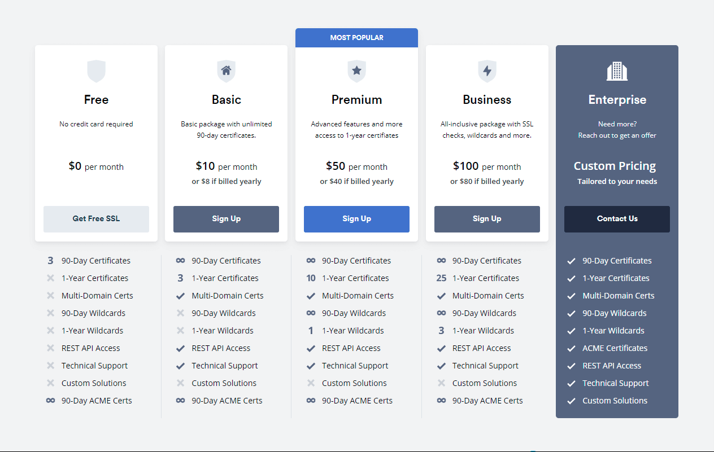
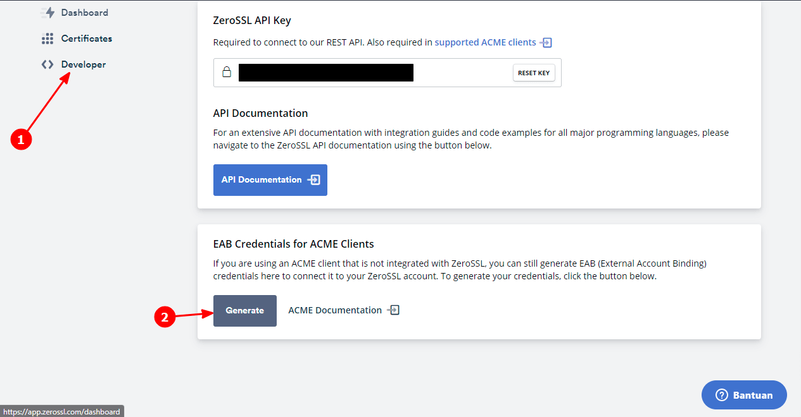
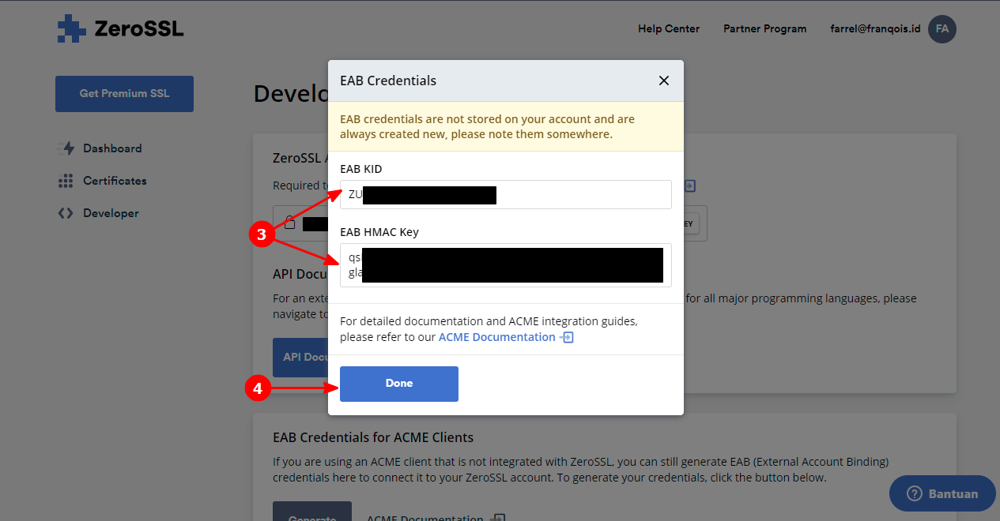
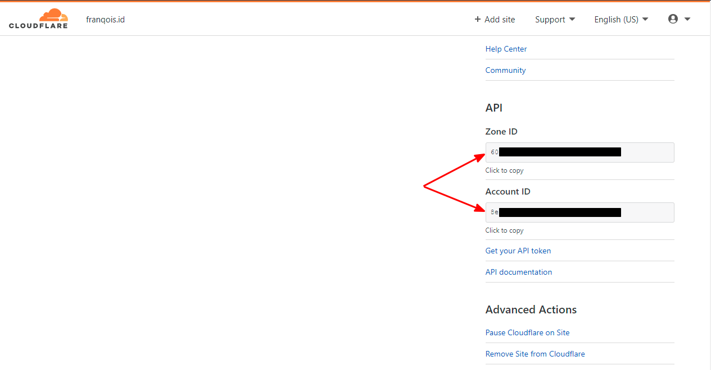
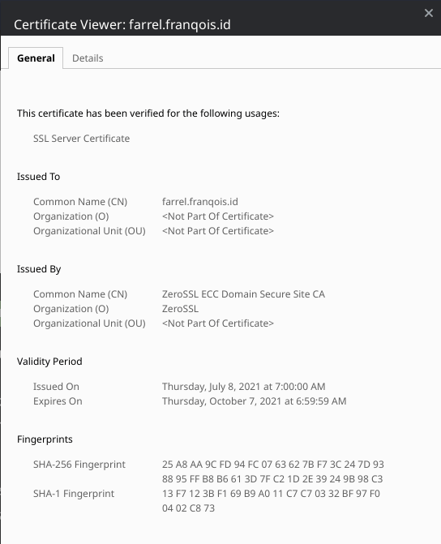
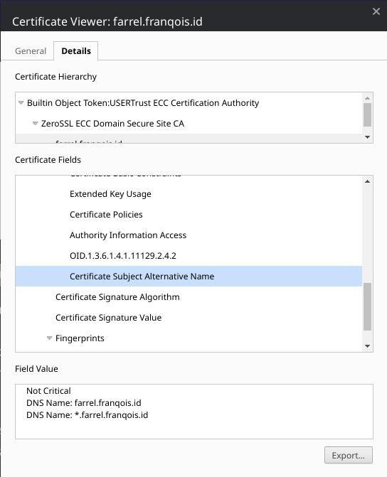
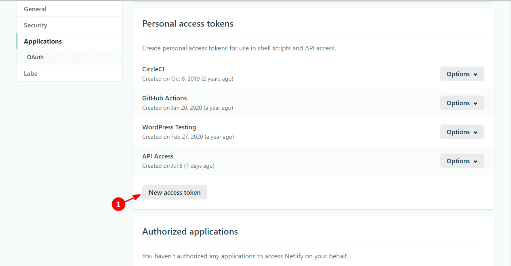
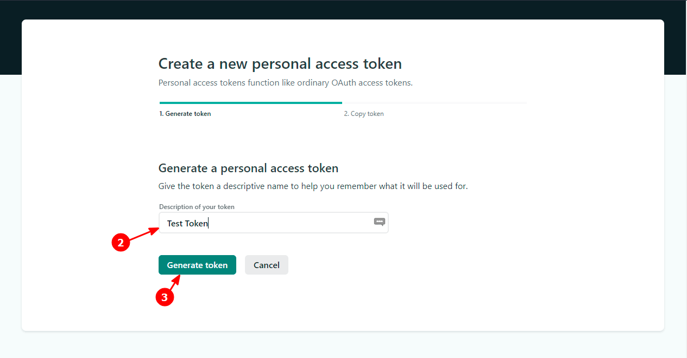
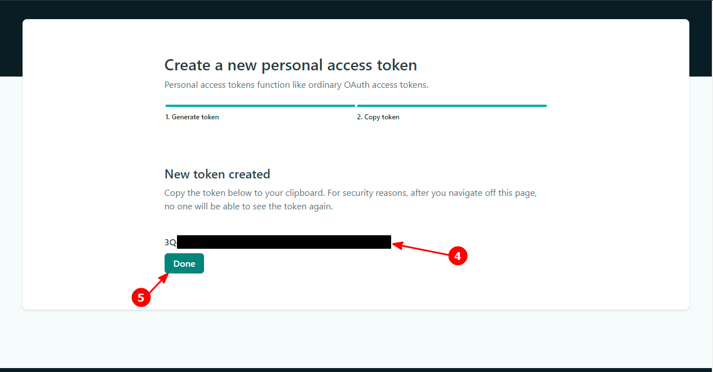
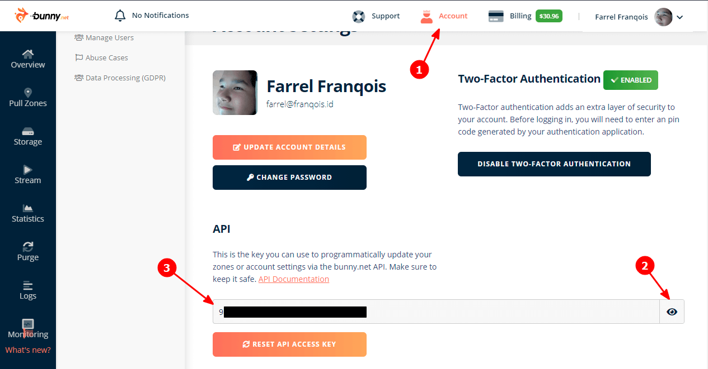

## Daftar Isi


## Pembuka
Artikel kali ini akan membahas tentang Cara memasang ZeroSSL + Renew secara Otomatis di Netlify dan BunnyCDN.

Di sini, Anda akan mempelajari untuk menerbitkan Sertifikat SSL yang bisa Anda dapatkan dari ZeroSSL, baik jangkauan nya untuk 1 Domain, Banyak Domain atau Subdomain, atau _Wildcard_ dengan menggunakan acme.sh

### Tunggu, ZeroSSL Gratis? Bukannya bayar? {#zerossl-gratis}
Iya, untuk saat ini ZeroSSL memanglah gratis, bahkan Anda juga bisa menerbitkan Sertifikat SSL _Wildcard_ nya secara gratis dengan jumlah yang tidak terbatas, dengan kunci RSA maupun ECC.

Tapi, itu hanya berlaku jika Anda membuat sertifikat SSL melalui Server ACME nya, bukan melalui Situs Web ataupun REST API nya. Semua sertifikat yang diterbitkan dengan Protokol ACME akan memiliki masa berlaku selama 90 hari kedepan.

Serta, jika Anda membuat/menerbitkan sebuah Sertifikat SSL menggunakan Protokol ACME dan Server ACME nya, maka kuota SSL yang ada di Situs Web tidak akan bertambah sama sekali.

Infonya dari mana? Salah satu infonya berasal dari [dokumentasinya](https://zerossl.com/documentation/acme/).

Tapi, sebetulnya jika kamu lebih teliti lagi, di Halaman ["Pricing"](https://zerossl.com/pricing/) nya pun kamu akan menemukan tulisan "90-Day ACME Certs" yang bersebelahan dengan Simbol "tidak terbatas", yang artinya kamu dapat menerbitkan Sertifikat SSL dari Server ACME nya dalam bentuk apapun secara gratis tanpa batasan jumlah.



Nah, sekarang sudah paham, kan? Jadi, Anda tidak perlu jadi orang kaya atau berduit banyak dulu biar bisa menerbitkan Sertifikat SSL dari ZeroSSL, kecuali jika Anda ingin Layanan Dukungan nya, serta sertifikat SSL dengan masa berlaku selama 1 Tahun, Anda bisa berlangganan yang berbayar.

### Persyaratan Perangkat Lunak
Di artikel ini, Anda akan mempelajari menerbitkan Sertifikat SSL dengan menggunakan [acme.sh](https://acme.sh) yang hanya kompatibel dengan Sistem Operasi berbasis *nix/UNIX-like, termasuk tapi tidak terbatas pada GNU/Linux, macOS, BSD dan Android.

Maka, persyaratan perangkat lunak yang harus Anda penuhi bagi pengguna Sistem Operasi agar bisa menggunakan acme.sh serta agar dapat mengikuti artikel ini secara keseluruhan. Berikut di bawah ini adalah persyaratannya:

#### Untuk Pengguna GNU/Linux, macOS, BSD dan Sistem Operasi berbasis \*nix lainnya {#pengguna-unix-like}

Jika terlalu panjang, maka persyaratan nya adalah sebagai berikut:
- OpenSSL/LibreSSL
- cURL
- Cron


Sistem Operasi berbasis Unix-like/\*nix (seperti GNU/Linux, macOS, dan BSD) sebetulnya tidak usah ditanya, mereka sudah pasti kompatibel dengan acme.sh karena aplikasi tersebut memang dirancang untuk \*nix. 

Asal punya OpenSSL/LibreSSL, cURL dan Cron, maka acme.sh dapat dijalankan sebagai mestinya, serta Anda dapat mengikuti Artikel ini secara keseluruhan. Wget juga bisa Anda gunakan, di artikel ini saya bahas hanya untuk mengunduh dan menginstal acme.sh saja.

Selain itu, Anda juga dapat meng-instal Socat (Socket Cat) agar acme.sh dapat dijalankan dalam "Standalone Mode", tapi itu tidak saya bahas di dalam artikel ini.

#### Untuk Pengguna Windows 10 {#pengguna-windows-10}

Jika terlalu panjang, maka persyaratan nya adalah sebagai berikut:
- Mempunyai dan mengaktifkan fitur WSL (Windows Subsystem for Linux)
- Persyaratan Perangkat Lunak pada WSL bisa mengikuti [persyaratan untuk GNU/Linux](#pengguna-unix-like)


Jika Anda menggunakan Windows, terutama Windows 10 (atau di atasnya), maka Anda bisa gunakan fitur [WSL (Windows Subsystem for Linux)](https://docs.microsoft.com/en-us/windows/wsl/install-win10) agar Anda bisa menggunakan Sistem Operasi GNU/Linux di dalam Windows.

Ketika Anda sedang menggunakan WSL, maka Anda bisa mengikuti persyaratan perangkat lunak untuk GNU/Linux. Jadi pastikan jika cURL, OpenSSL/LibreSSL dan Cron sudah ada di dalam Sistem WSL Anda (Biasanya ada).

#### Untuk Pengguna Android (tidak perlu akses _root_) {#pengguna-android}

Jika terlalu panjang, maka persyaratan nya adalah sebagai berikut:
- Tidak perlu Akses _root_ atau perangkat tidak perlu dalam keadaan ter-_root_. Jika demikian, ya tidak masalah
- Terinstalnya Termux di Perangkat Android Anda. Bisa Anda unduh di [F-Droid resminya](https://f-droid.org/repository/browse/?fdid=com.termux), jangan di [Google Play Store](https://play.google.com/store/apps/details?id=com.termux)! (Alasan nya [di sini](https://wiki.termux.com/wiki/Termux_Google_Play))
- Persyaratan di Termux setelah di-instal sebagai berikut:
    1. Perbarui semua Paket yang ada di Termux dengan perintah: `pkg update; pkg upgrade`
    2. Persyaratan Perangkat Lunak pada Termux bisa mengikuti [persyaratan untuk GNU/Linux](#pengguna-unix-like). Tapi, Anda juga dapat meng-instal semua keperluan nya dengan perintah: `pkg install curl wget openssl-tools cronie termux-services`, lalu mulai ulang Termux jika berhasil
    3. Aktifkan Layanan (_Service_) Cron di Latar Belakang dengan Perintah: `sv-enable crond`
    4. Pastikan Termux bisa mengakses Penyimpanan Internal atau Eksternal pada perangkat Anda, agar Anda bisa berbagi penyimpanan pada Termux. Referensi: ["Internal and external storage"](https://wiki.termux.com/wiki/Internal_and_external_storage#Access_shared_and_external_storage) dari Wiki Termux (Baca dan pahami mulai dari bagian "Access shared and external storage")


Jika Anda menggunakan Android, maka Anda bisa gunakan Termux untuk itu, selalu gunakan versi terbaru untuk pengalaman yang lebih nyaman.

Pastikan Termux tidak diunduh melalui [Google Play Store](https://play.google.com/store/apps/details?id=com.termux), melainkan melalui [F-Droid nya](https://f-droid.org/repository/browse/?fdid=com.termux).

Kenapa? Karena Termux sudah tidak lagi diperbarui di Google Play Store sejak 02 November 2020 yang lalu, untuk alasannya silahkan Anda baca [di sini](https://wiki.termux.com/wiki/Termux_Google_Play).

Ketika Anda sedang menggunakan Termux, maka Anda bisa mengikuti persyaratan perangkat lunak untuk Sistem Operasi berbasis \*nix. Jadi pastikan jika cURL, OpenSSL/LibreSSL, dan Cron sudah ada di dalam Termux Anda.

Tapi sayangnya, di dalam Termux belum terinstal OpenSSL dan Cron secara bawaan. Jadi setelah Anda Instal Termux, hal yang perlu Anda lakukan adalah perbarui semua paket-paket yang ada, lalu instal paket-paket yang diperlukan dengan perintah berikut:

```shell
$ pkg update; pkg upgrade
$ pkg install curl wget openssl-tools cronie termux-services
```

Kalau perlu, ganti _Repository_ pada Termux dengan perintah `termux-change-repo` dan gunakan _Repository_ Resmi dari Termux terlebih dahulu agar mendapatkan versi terbaru, barulah Anda eksekusikan perintah di atas. 

Setelah itu, mulai ulang Termux Anda dengan eksekusi perintah `exit`, lalu buka lagi Termux nya agar perubahannya bisa diterapkan. Setelah Termux dibuka lagi, aktifkan Cron dari latar belakang dengan meng-eksekusi perintah `sv-enable crond`.

Selain itu, pastikan Termux bisa mengakses Penyimpanan Internal dan Eksternal pada perangkat Anda. agar Anda bisa berbagi penyimpanan pada Termux. Silahkan Anda baca [halaman dokumentasinya](https://wiki.termux.com/wiki/Internal_and_external_storage#Access_shared_and_external_storage) dan pahami mulai dari bagian "Access shared and external storage".

Semua hal di atas bisa Anda lakukan tanpa perlu akses _root_ sedikitpun dan perangkat tidak perlu dalam keadaan ter-_root_, jadi tidak usah khawatir akan kehilangan garansi pada perangkat Anda.

## Sebelum menerbitkan Sertifikat SSL
Sebelum menerbitkannya, Anda perlu mengikuti beberapa poin pembahasan terlebih dahulu. Poin-poin akan saya bahas dalam langkah-demi-langkah.

Jadi, harap Anda jangan melewati satu langkahpun, kecuali jika ada catatan yang mengizinkannya.

Atau, Anda juga bisa lewati bagian ini jika Anda sudah pernah mendaftarkan akun ZeroSSL, meng-install dan konfigurasi acme.sh, serta melakukan pengaitan akun ZeroSSL dengan acme.sh sebelumnya.

### Membuat Akun ZeroSSL dan mendapatkan Kredensial EAB nya {#membuat-akun-zerossl}
**Catatan:** Jika Anda belum mempunyai Akun nya dan ingin membuatnya tanpa melalui Web, lewati ini jika Anda tidak ingin mendaftar melalui Web nya dan langsung [lanjut saja](#install-acme-sh).

Sebelum Anda menerbitkan Sertifikat SSL nya, maka Anda disarankan untuk mendaftar akun ZeroSSL nya terlebih dahulu melalui [Situs Webnya](https://zerossl.com).

Setelah mendaftar, Anda tidak perlu membuat/menerbitkan Sertifikatnya di sana, melainkan Anda hanya perlu Kredensial EAB (_External Account Binding_) yakni "EAB KID" dan "EAB HMAC Key" nya saja. Langkah-langkahnya sebagai berikut:

0. Daftar Akun ZeroSSL nya [di sana](https://app.zerossl.com/signup) dan Login setelah itu (Atau, Anda hanya perlu [Login](https://app.zerossl.com/login) saja jika Anda sudah pernah mendaftar akun sebelumnya)
1. Pada Dasbor ZeroSSL, klik "Developer"
2. Setelah itu, pada bagian "EAB Credentials for ACME Clients", klik _Button_ "Generate"
3. Simpan "EAB KID" dan "EAB HMAC Key" yang telah dihasilkan itu dengan baik, nanti akan digunakan lagi untuk acme.sh
4. Setelah menyimpannya, Anda tinggal klik _Button_ "Done" dan Selesai

Jika Anda tidak memahami langkah-langkah di atas, maka Anda dapat melihat Cuplikan Layar berikut yang cukup menyesuaikan dengan langkah-langkah di atas: (Silahkan perbesar gambarnya dengan mengkliknya)

 

Setelah Kredensial EAB dibuat, ya sudah lanjut saja ke langkah berikutnya, yakni Instal acme.sh, Anda sama sekali tidak perlu menerbitkan Sertifikat SSL nya di sana.

### Instal acme.sh {#install-acme-sh}
Setelah mendaftar akun ZeroSSL, salah satu yang perlu Anda lakukan adalah meng-instal acme.sh terlebih dahulu di dalam Sistem Operasi Anda.

Tidak perlu menggunakan Akun Administrator atau `root` untuk meng-instalnya, atau tidak perlu dieksekusikan dengan perintah `sudo`, cukup gunakan saja akun Anda. (Bahkan, lebih baik gini)

Cara meng-instalnya adalah dengan meng-eksekusikan salah satu perintah berikut:

Dengan cURL:

```shell
$ curl https://get.acme.sh | sh -s email=my@example.com
```

Atau, dengan GNU Wget:

```shell
$ wget -O -  https://get.acme.sh | sh -s email=my@example.com
```

Ganti `my@example.com` dengan Alamat Surel Anda.

Setelah selesai instal, pastikan bahwa acme.sh dapat dieksekusi dengan baik dengan mengetikkan `acme.sh --version` di dalam Terminal, lalu tekan tombol "<key>Enter</key>".

Jika dapat dieksekusi dengan baik, maka akan tampil versi dari acme.sh dan selamat Anda telah meng-instalnya dengan benar. Jika tidak, gunakan perintah `source` untuk memperbarui _Shell_, kalau masih tidak bisa juga, maka Anda perlu memasukkan direktori acme.sh kedalam variabel `PATH`, dengan salah satu cara berikut:

Untuk pengguna GNU Bash:

```shell
$ cp ${HOME}/.bashrc ${HOME}/.bashrc.1  ## Backup dulu
$ echo 'PATH="${PATH}:${HOME}/.acme.sh" && export PATH' >> ${HOME}/.bashrc
$ echo 'LE_WORKING_DIR="${HOME}/.acme.sh" && export LE_WORKING_DIR' >> ${HOME}/.bashrc
$ chmod +x ${HOME}/.acme.sh/acme.sh
$ source ${HOME}/.bashrc
```

Untuk pengguna Zsh:

```zsh
$ cp ${HOME}/.zshrc ${HOME}/.zshrc.1  ## Backup dulu
$ echo 'PATH="${PATH}:${HOME}/.acme.sh" && export PATH' >> ${HOME}/.zshrc
$ echo 'LE_WORKING_DIR="${HOME}/.acme.sh" && export LE_WORKING_DIR' >> ${HOME}/.zshrc
$ chmod +x ${HOME}/.acme.sh/acme.sh
$ source ${HOME}/.zshrc
```

### Verifikasi DNS di acme.sh
Agar Sertifikat SSL dapat diterbitkan melalui Protokol ACME, maka pengguna diperlukan melakukan verifikasi. Salah satunya adalah dengan verifikasi DNS.

Verifikasi DNS merupakan metode verifikasi yang paling dianjurkan, selain mudah dan hanya pemilik domain yang bisa melakukannya, Anda juga dapat menerbitkan Sertifikat SSL untuk semua Subdomain Anda (_Wildcard SSL_) dengan mudah.

Agar acme.sh dapat melakukan verifikasi DNS secara otomatis saat menerbitkan dan memperbarui Sertifikat SSL, maka acme.sh harus dapat mengakses dan merubah _DNS Record_ pada akun Penyedia DNS Otoritatif Anda.

Untuk itu, Anda perlu memberikan acme.sh sebuah izin untuk mengaksesnya dengan memberinya sebuah _Token_, Kunci API atau bahkan Nama Pengguna dan Kata Sandi untuk mengakses akun tertentu.

#### Untuk Pengguna DNS Otoritatif Cloudflare
Jika Anda menggunakan Cloudflare sebagai DNS Otoritatif untuk Domain Anda, Anda tinggal buat sebuah "API Token" (`CF_Token`) dan dapatkan "Account ID" (`CF_Account_ID`) nya, jika berkenan, Anda juga bisa mendapatkan "Zone ID" (`CF_Zone_ID`) nya juga agar acme.sh hanya menargetkan ke 1 Domain Utama saja secara spesifik.

Untuk membuat "API Token" nya, silahkan Anda baca [dokumentasinya](https://developers.cloudflare.com/api/tokens/create), di sana sudah dijelaskan secara lengkap tentang bagaimana cara membuat "API Token" nya.

Buatlah "API Token" yang diizinkan untuk mengedit DNS nya dengan memilih "Edit zone DNS" sebagai Templat saat ingin membuatnya. Serta, pastikan juga bahwa Anda menjangkau semua Domain atau _Zone_ yang ada di Cloudflare, agar nanti Anda bisa menargetkan seluruh domain yang ada di Cloudflare.

Untuk mendapatkan "Account ID" dan "Zone ID" nya, Anda tinggal ke [Halaman Dasbor Cloudflare](https://dash.cloudflare.com), pilih Domain nya, lalu gulirkan kebawah, nanti akan ketemu Informasi mengenai "Account ID" dan "Zone ID", seperti di bawah ini:



Nah, setelah semuanya berhasil didapat, maka Anda tinggal masukkan saja semua Informasinya ke dalam variabel. Dengan cara berikut:

```shell
### Di bawah ini adalah Informasi yang wajib dimasukki
$ CF_Token="API_TOKEN_KAMU_DI_SINI" && export CF_Token
$ CF_Account_ID="ACCOUNT_ID_KAMU_DI_SINI" && export CF_Account_ID

### Anda juga dapat memasukkan "Zone ID" jika Anda ingin acme.sh menargetkan hanya
### untuk 1 Domain Utama saja secara spesifik, tapi ini bukanlah hal yang wajib, jadi sebaiknya tidak usah saja
$ CF_Zone_ID="ZONE_ID_KAMU_DI_SINI" && export CF_Zone_ID
```

 
Jika Anda langsung mengeksekusinya melalui Terminal, maka jangan sampai kamu mengakhiri sesi Terminal atau _Shell_ kamu sampai menerbitkan Sertifikat SSL di acme.sh dengan menggunakan DNS sebagai metode verifikasi, variabel tersebut akan terhapus secara otomatis jika sesi berakhir. 

Jika kamu tidak mau itu terjadi, maka simpanlah variabel di atas ke dalam berkas `${HOME}/.bashrc` atau `${HOME}/.zshrc` (untuk Pengguna Zsh), lalu gunakan perintah `source` agar dapat memperbarui _Shell_ nya.

Peringatan di atas tidak berlaku jika _Shell_ yang Anda gunakan memiliki fitur Riwayat atau Penyelesaian Otomatis yang berbasiskan Riwayat _Shell_, dan yang pasti Anda tahu cara menggunakannya.


Udah itu aja, jika Anda menggunakan Cloudflare dan sudah memasukkan Informasi-informasi di atas, maka Anda hanya perlu langsung melanjutkan ke [langkah berikutnya](#registrasi-akun-acme-sh) saja.

#### Untuk Pengguna DNS Otoritatif lain
Jika Anda menggunakan Layanan DNS Otoritatif selain Cloudflare, seperti Hurricane Electric Free DNS, Constellix, NS1, ClouDNS, Amazon Route53, dll, maka Anda perlu membaca [halaman dokumentasinya](https://github.com/acmesh-official/acme.sh/wiki/dnsapi).

Karena setiap Penyedia DNS Otoritatif mempunyai cara yang berbeda-beda untuk mengaksesnya. Jadi, silahkan ikuti yang ada di dokumentasinya.

Jika sudah, silahkan lanjut ke [langkah berikutnya](#registrasi-akun-acme-sh).

### Registrasi Akun melalui acme.sh {#registrasi-akun-acme-sh}
Secara bawaan, acme.sh menggunakan ZeroSSL sebagai CA (_Certificate Authority_) nya, jadi jika Anda adalah orang yang pertama kali menggunakan acme.sh, silahkan registrasikan akun ZeroSSL Anda terlebih dahulu ke Server ACME nya menggunakan acme.sh dengan perintah berikut:

```shell
$ acme.sh --register-account --eab-kid EAB_KID_KAMU_DI_SINI --eab-hmac-key EAB_HMAC_KEY_KAMU_DI_SINI
```

Ganti `EAB_KID_KAMU_DI_SINI` dan `EAB_HMAC_KEY_KAMU_DI_SINI` dengan "EAB KID" dan "EAB HMAC Key" yang telah kamu simpan sebelumnya.

Atau, jika Anda belum pernah daftar sama sekali dan ingin mendaftarkan akun ZeroSSL tanpa menggunakan Peramban Web, maka Anda dapat eksekusi perintah berikut:

```shell
$ acme.sh --register-account -m myemail@example.com
```

Ganti `myemail@example.com` dengan Alamat Surel Anda yang valid.

Setelah itu, kamu telah dapat menggunakan acme.sh seperti biasanya untuk menerbitkan/membuat dan memperbarui Sertifikat SSL kamu.

## Menerbitkan Sertifikat SSL dengan acme.sh {#menerbitkan-sertifikat-ssl}
Nah, setelah mengikuti beberapa langkah, akhirnya Anda bisa sampai di sini, yakni menerbitkan Sertifikat SSL.

Ada beberapa cara untuk menerbitkannya menggunakan acme.sh, tidak perlu Anda ikuti semua dan sesuaikan dengan selera Anda. Berikut adalah cara-caranya:

### Menerbitkan Sertifikat SSL (Wajib dipelajari) {#issue-cert}
Jika Anda ingin menerbitkan Sertifikat SSL dengan acme.sh (cth. hanya untuk 1 Domain dan 1 Subdomain), maka format perintah nya akan menjadi seperti berikut:

```shell
$ acme.sh --issue -d domain.com -d www.domain.com METODE_VERIFIKASI PARAMETER_TAMBAHAN
```

Jika Anda mengeksekusi perintah di atas, maka Anda menerbitkan Sertifikat SSL hanya untuk 1 Domain dan 1 Subdomain saja, yakni `domain.com` dan `www.domain.com`.

Parameter `-d` berfungsi untuk menentukan domain yang dijangkau oleh Sertifikat SSL tersebut saat diterbitkan, isikan itu dengan Domain Anda. Sebenarnya, Anda juga dapat menambahkan perameter `-d` agar Sertifikat SSL menjangkau setiap domain yang Anda masukkan, sebanyak yang Anda mau.

Domain Pertama yang Anda masukkan akan menjadi "Common Name"/"Subject"/"Issued to" pada Sertifikat SSL, selain SAN (_Subject Alternative Name_), sedangkan domain kedua dan seterusnya hanya dimasukkan kedalam SAN saja. Selain itu, nama direktori untuk Sertifikat SSL nya sendiri akan ditentukan berdasarkan domain pertama yang Anda masukkan.

Contohnya seperti Cuplikan berikut:

 

Jika Anda melihat cuplikan di atas, "Common Name" yang tampil adalah `farrel.franqois.id` bukan `*.farrel.franqois.id`, padahal Sertifikat yang saya terbitkan itu adalah Sertifikat SSL _Wildcard_, dan `*.farrel.franqois.id` malah cuma dimasukkan ke dalam SAN (_Subject Alternative Name_) saja bersamaan dengan Domain Pertama nya.

Kenapa bisa begitu? Sederhananya karena Domain Pertama yang saya masukkan ketika menerbitkan sebuah Sertifikat SSL adalah `farrel.franqois.id`, bukan `*.farrel.franqois.id`. Nah, sekarang sudah paham, kan?

Parameter `--issue` berfungsi agar acme.sh menerbitkan Sertifikat SSL Anda. Parameter selain `--issue` adalah `--renew` untuk memperbarui Sertifikat SSL yang ada, `--revoke` untuk mencabut Sertifikat SSL, `--remove` untuk menghapus Sertifikat SSL dari acme.sh, dll. Anda juga dapat menambahkan parameter `--force` di sampingnya agar dapat melakukannya secara paksa.

#### Metode Verifikasi (`METODE_VERIFIKASI`)
Anda harus menggantikan `METODE_VERIFIKASI` di atas dengan parameter/argumen mengenai metode verifikasi yang ada, menjadi parameter berikut salah satunya:
- `--webroot lokasi_webroot` atau `-w lokasi_webroot` jika Anda ingin menggunakan metode _Webroot_. Ganti `lokasi_webroot` dengan lokasi Web Anda, seperti `/var/www/html`, `/home/username/public_html`, atau apa aja yang penting itu menandakan lokasi Web Anda.
- `--dns nama_dns` jika Anda ingin menggunakan metode DNS. Ganti `nama_dns` dengan nama berkas yang ada [di sana](https://github.com/acmesh-official/acme.sh/tree/master/dnsapi) (tanpa disebutkan ekstensinya) dan sesuaikan dengan Penyedia DNS Otoritatif yang Anda gunakan. (Saya bahas ini di bagian terpisah)
- `--apache` jika Anda ingin mengintegrasikan dengan _Web Server_ Apache2.
- `--nginx (lokasi_conf)` jika Anda ingin mengintegrasikan dengan _Web Server_ NGINX. Anda bisa ganti `(lokasi_conf)` dengan lokasi berkas konfigurasi untuk NGINX Anda jika diinginkan, barangkali acme.sh tidak bisa mendeteksi berkas konfigurasi NGINX secara otomatis, jika tidak maka cukup tulis `--nginx` saja.
- `--standalone` jika Anda tidak mempunyai Aplikasi _Web Server_ atau sedang tidak berada di dalam Server Web (cth. Sedang berada di dalam Server FTP atau SMTP).

Jadi, Anda tidak bisa sembarangan membuat Sertifikat SSL untuk domain lain. Berhasil atau Gagal akan menambahkan _Rate Limit_ pada beberapa CA seperti Let's Encrypt dan Buypass CA. Jadi, berhati-hatilah ketika ingin menerbitkan Sertifikat SSL.

#### Parameter Tambahan (`PARAMETER_TAMBAHAN`)
Anda bisa menggantikan `PARAMETER_TAMBAHAN` dengan parameter lain yang ingin Anda tambahkan saat menerbitkan Sertifikat SSL, parameter lain nya sebagai berikut:
- `--test` atau `--staging` jika Anda ingin menjalankannya dalam mode pengujian. Ini cocok bagi Anda yang sedang belajar menggunakan acme.sh atau menguji penerbitan Sertifikat SSL dengan metode verifikasi yang berbeda tanpa mempengaruhi _Rate Limit_ aslinya. 

    Jadi, saya sarankan agar Anda selalu gunakan parameter ini jika Anda sedang mempelajari penggunaan acme.sh atau memastikan apakah sertifikat SSL bisa diterbitkan dengan benar atau tidaknya tanpa mempengaruhi _Rate Limit_ dari suatu CA.

    Jika Anda sudah merasa yakin, maka Anda bisa terbitkan ulang Sertifikat SSL nya untuk Produksi dengan menggunakan parameter `--issue --force`, tanpa parameter `--test` atau `--staging`.

- `--keylength opsi` atau `-k opsi` jika Anda ingin menerbitkan Sertifikat SSL dengan ukuran kunci atau kunci yang berbeda. Ganti `opsi` dengan `2048`, `3072`, `4096`, `8192`, `ec-256`, `ec-384`, atau `ec-512` (Saya bahas di bagian terpisah)
- `--cert-file file` untuk menyalinkan berkas Sertifikat ke dalam direktori lain setelah menerbitkan/memperbarui Sertifikat SSL nya. Ganti `file` menjadi lokasi atau/dan nama berkas yang Anda inginkan.
- `--key-file file` untuk menyalinkan berkas Kunci ke dalam direktori lain setelah menerbitkan/memperbarui Sertifikat SSL nya. Ganti `file` menjadi lokasi atau/dan nama berkas yang Anda inginkan.
- `--ca-file file` untuk menyalinkan berkas Sertifikat CA/Sertifikat Penengah ke dalam direktori lain setelah menerbitkan/memperbarui Sertifikat SSL nya. Ganti `file` menjadi lokasi atau/dan nama berkas yang Anda inginkan.
- `--fullchain-file file` untuk menyalinkan berkas Sertifikat _Fullchain_ ke dalam direktori lain setelah menerbitkan/memperbarui Sertifikat SSL nya. Ganti `file` menjadi lokasi atau/dan nama berkas yang Anda inginkan.
- `--reloadcmd perintah` untuk mengeksekusikan perintah untuk me-_reload_ Server setelah menerbitkan/memperbarui Sertifikat SSL nya.

Udah itu saja yang saya bahas, parameter lainnya masih banyak, tapi yang saya bahas adalah kasus umumnya saja. Jika Anda tidak ingin menambahkan parameter lain, Anda hanya menghapus `PARAMETER_TAMBAHAN` nya saja.

### Menerbitkan Sertifikat SSL dengan Menggunakan DNS sebagai Metode Verifikasi (Wajib dipelajari) {#verifikasi-dns}
Jika Anda ingin menerbitkan Sertifikat SSL yang menggunakan DNS sebagai Metode Verifikasi nya, maka Anda tinggal tambahkan saja parameter `--dns nama_dns`.

Contoh di bawah ini adalah perintah untuk menerbitkan Sertifikat SSL untuk 1 Domain dan 1 Subdomain dengan menggunakan DNS dari Cloudflare sebagai Metode Verifikasi:

```shell
$ acme.sh --issue -d domain.com -d www.domain.com --dns dns_cf
```

Jika Anda menggunakan Penyedia DNS Otoritatif selain Cloudflare, ganti saja `dns_cf` nya menjadi nama-nama berkas yang tampil [di sana](https://github.com/acmesh-official/acme.sh/tree/master/dnsapi) (tanpa disebutkan ekstensinya).

Misalnya: Anda ingin menerbitkan sebuah Sertifikat SSL untuk `domain.com` dan ingin menggunakan DNS dari Constellix sebagai Metode Verifikasinya, karena nama berkas di sananya adalah `dns_constellix`, maka Anda tinggal tambahkan saja parameter `--dns dns_constellix`. Jadinya seperti berikut:

```shell
$ acme.sh --issue -d domain.com -d www.domain.com --dns dns_constellix
```

Atau, Anda bisa baca halaman [dokumentasinya](https://github.com/acmesh-official/acme.sh/wiki/dnsapi), sebenarnya di sana juga telah disediakan cara menerbitkan Sertifikat SSL dengan menggunakan DNS sebagai Verifikasi nya untuk masing-masing Penyedia.

Nah, sekarang paham, kan? Ini juga sangat penting untuk menerbitkan Sertifikat SSL [dalam bentuk _Wildcard_](#wildcard-ssl), karena Verifikasi melalui DNS merupakan salah satu syarat yang wajib.

### Menerbitkan Sertifikat SSL untuk Banyak Domain dan Subdomain {#multi-domain}
Untuk menerbitkan Sertifikat SSL yang menargetkan Banyak Domain dan Subdomain, sebenarnya Anda tinggal masukkan parameter `-d` untuk setiap domainnya. Contohnya seperti berikut:

Untuk 2 Domain dan 4 Subdomain:

```shell
$ acme.sh --issue -d domain1.com -d www.domain1.com -d sub.domain1.com -d domain2.com -d www.domain2.com -d sub.domain2.com
```

Untuk 4 Domain saja:

```shell
$ acme.sh --issue -d domain1.com -d domain2.com -d domain3.com -d domain4.com
```

Atau, jika Anda ingin menggunakan metode verifikasi yang berbeda-beda untuk setiap domain, maka Anda bisa meraciknya dengan contoh seperti berikut:

```shell
$ acme.sh --issue \
          -d domain1.com -d www.domain1.com --dns dns_cf \
          -d domain2.com -d www.domain2.com --dns dns_constellix \
          -d domain3.com -d www.domain3.com -w /home/username/public_html \
          -d domain4.com -d www.domain4.com --apache \
          -d domain5.com -d www.domain5.com --nginx
```

Dan seterusnya akan seperti itu caranya.

### Menerbitkan Sertifikat SSL yang menjangkau Seluruh Subdomainnya {#wildcard-ssl}
Jika Anda ingin menerbitkan Sertifikat SSL yang menjangkau seluruh Subdomain atau dalam bentuk _Wildcard_, maka Anda tinggal tambahkan parameter `-d "*.domain.com"` saja.

Tapi Anda juga harus menambahkan parameter `--dns nama_dns`, karena dibutuhkan [verifikasi melalui Metode DNS](#verifikasi-dns) sebagai Syarat Wajib agar bisa menerbitkannya dalam bentuk _Wildcard_.

Contoh di bawah ini adalah perintah untuk menerbitkan Sertifikat SSL untuk 1 Domain dan Semua Subdomainnya dengan menggunakan DNS dari Cloudflare sebagai Verifikasi:

```shell
$ acme.sh --issue -d "*.domain.com" -d domain.com --dns dns_cf
```

Sertifikat yang diterbitkan dengan perintah di atas adalah untuk `*.domain.com` dan `domain.com` dengan menggunakan DNS dari Cloudflare sebagai Verifikasi.

Jika Anda bukan pengguna Cloudflare, maka Anda perlu baca halaman [dokumentasinya](https://github.com/acmesh-official/acme.sh/wiki/dnsapi) terlebih dahulu, di situ sudah dijelaskan cara-caranya.

Kenapa _Wildcard_ nya dikutip dua? Karena terkadang _Shell_ lain tidak dapat meng-intepretasi tanda bintang dengan baik jika tidak dikutip, seperti Zsh (Z shell) misalnya.

Kenapa _Wildcard_ nya diletakkan di awal? Agar Domain _Wildcard_ nya tampil sebagai "Common Name"/"Subject"/"Issued to" pada Sertifikat SSL. Kenapa? Karena Sertifikat SSL _Wildcard_ yang saya lihat menampilkan Domain _Wildcard_ sebagai "Issued to"/"Common Name" nya. Apa itu "Issued to"/"Common Name"? Itu sudah saya jelaskan [di bagian awal](#issue-cert).

Apakah itu menjangkau Sub-subdomain seperti `sub.sub.domain.com`? Tentu saja tidak, karena sertifikat SSL tersebut cuma diterbitkan untuk `*.domain.com` dan `domain.com`, yang mana cuma menjangkau `sub1.domain.com`, `sub2.domain.com`, dst, bukan `sub.sub.domain.com`.

Jika Anda mau seperti itu, tambahkan saja Subdomain Anda beserta _Wildcard_ nya, jadi parameter yang Anda tambahkan adalah `-d "*.sub.domain.com" -d sub.domain.com`.

Contohnya menjadi seperti berikut:

```shell
$ acme.sh --issue -d "*.domain.com" -d domain.com -d "*.sub.domain.com" -d sub.domain.com --dns dns_cf
```

Nah, sekarang paham, kan?

### Menerbitkan Sertifikat SSL dengan ukuran kunci yang berbeda {#ssl-beda-ukuran-kunci}
Secara Bawaan, acme.sh akan menerbitkan Sertifikat SSL dengan kunci RSA yang berukuran 2048 bit (RSA-2048). Jika Anda ingin menerbitkan Sertifikat SSL dengan ukuran kunci yang berbeda, tambahkan saja parameter `--keylength ukuran_kunci_rsa`. 

Contoh Perintah di bawah ini jika Anda ingin menerbitkannya dengan kunci RSA yang berukuran 3072 bit (RSA-3072):

```shell
$ acme.sh --issue -d domain.com -d www.domain.com --keylength 3072
```

Atau, berikut di bawah ini jika Anda ingin menerbitnya dalam bentuk _Wildcard_:

```shell
$ acme.sh --issue -d "*.domain.com" -d domain.com --keylength 3072 --dns dns_cf
```

Jika Anda ingin menerbitkannya dengan ukuran kunci sebesar 4096 bit, Anda tinggal ganti saja menjadi `--keylength 4096`. Intinya, Anda perhatikan saja terhadap nilai parameternya.

Ukuran Kunci RSA yang didukung oleh acme.sh beserta nilai parameter `keylength` nya adalah:
- RSA-2048 (Bawaan)
- RSA-3072 (`3072`)
- RSA-4096 (`4096`)
- RSA-8192 (`8192`)

**Catatan:** Didukung oleh acme.sh, bukan berarti didukung oleh CA yang digunakan, tapi ZeroSSL sepertinya mendukung semua itu.


Saya tidak menyarankan Anda untuk menerbitkan serta menggunakan ukuran kunci yang terlalu besar. 

Karena selain menghasilkan kunci dengan ukuran yang besar, terkadang proses pemuatan konten pada Perangkat Lunak (termasuk Peramban Web) akan memakan waktu saat sedang proses 'jabat tangan' TLS (_TLS handshake_), yang berakibat pada membengkaknya penggunaan CPU/Prosesor pada Perangkat tertentu untuk meng-enkripsi transaksi data saat proses 'jabat tangan'.

Jika Anda merupakan pemilik Web/Blog, maka kemungkinan hal ini akan mempengaruhi performa Web/Blog secara keseluruhan dan ini mungkin akan berpotensi mengurangi pengunjung pada Web/Blog Anda.

Saya sarankan agar Anda gunakan ukuran kunci yang ideal. Ukuran kunci yang ideal untuk kebanyakan kasus adalah 2048 bit atau 3072 bit, atau yang paling besar adalah 4096 bit, tidak perlu terlalu besar.


### Menerbitkan Sertifikat SSL dengan kunci ECC/ECDSA {#ecdsa-ssl}
Secara bawaan, acme.sh akan menerbitkan Sertifikat SSL dengan kunci RSA. Jika Anda ingin menerbitkannya menggunakan kunci ECC (_Eliptic Curve Cryptography_)/ECDSA (_Eliptic Curve Digital Signature Algorithm_), maka Anda hanya perlu tambahkan saja parameter `--keylength ec-ukuran_kuncinya`.

Contoh Perintah di bawah ini jika Anda ingin menerbitkan Sertifikat SSL ECDSA dengan ukuran P-384:

```shell
$ acme.sh --issue -d domain.com -d www.domain.com --keylength ec-384
```

Atau, berikut di bawah ini jika Anda ingin menerbitkannya dalam bentuk _Wildcard_:

```shell
$ acme.sh --issue -d "*.domain.com" -d domain.com --keylength ec-384 --dns dns_cf
```

Jika Anda ingin menerbitkannya dengan kunci ECDSA P-256, tinggal ganti saja menjadi `--keylength ec-256`. Perhatikan saja nilai parameter dari `keylength` nya.

Ukuran Kunci ECC/ECDSA yang didukung oleh acme.sh beserta nilai dari parameter `keylength` adalah:
- ECDSA P-256 (`ec-256`)
- ECDSA P-384 (`ec-384`)
- ECDSA P-512 (`ec-512`)

**Catatan:** Didukung oleh acme.sh, bukan berarti didukung oleh CA yang digunakan, termasuk Let's Encrypt yang belum mendukung kunci ECDSA dengan ukuran kunci P-512.

## Berkas-berkas acme.sh {#berkas-berkas-acme-sh}
Bagian ini akan membahas tentang berkas-berkas yang berada di dalam direktori acme.sh itu terinstal. 

Ini bukanlah hal yang wajib, sehingga bisa Anda [lewati]() jika berkenan, tapi ini sangat disarankan untuk dipelajari, selain supaya Anda bisa memasang sertifikat SSL nya dengan baik, ini juga dapat membantu Anda untuk menyelesaikan masalah Anda saat menggunakannya.

### Letak acme.sh dan konfigurasi akunnya {#letak-acme-sh}
Biasanya, acme.sh akan terinstal di dalam direktori `${HOME}/.acme.sh`.

Sedangkan letak berkas konfigurasi (terutama untuk konfigurasi Akun) itu terletak di `${HOME}/.acme.sh/account.conf`.

Berkas tersebut menyimpan sejumlah Informasi yang berkaitan dengan Akun yang Anda masukkan melalui variabel dari sebuah _Shell_ (Seperti _Token_, Kunci API, atau bahkan Nama Pengguna dan Kata Sandi), acme.sh akan menyimpan Informasi tersebut secara otomatis ke dalam berkas `account.conf` jika dijalankan dan akan digunakan kembali jika tersimpan.

Jadi, jika Anda memiliki masalah saat menggunakan acme.sh hanya karena akunnya tidak valid, entah itu salah memasukkan atau Informasinya tidak ada, Anda bisa menggantinya dengan mengganti variabel di dalam _Shell_ nya, lalu hapus berkas `account.conf` nya.

### Letak Sertifikat SSL {#letak-sertifikat-ssl}
Sertifikat yang dihasilkan oleh acme.sh itu bukan dalam bentuk kertas, melainkan dalam bentuk berkas digital. Sehingga, setelah acme.sh berhasil menerbitkan Sertifikat SSL nya, maka berkas-berkasnya akan disimpan ke dalam direktori tertentu.

Biasanya acme.sh akan memberitahukan di mana berkas-berkas tersebut berada setelah Anda menerbitkannya. Berkas-berkas tersebut sangat diperlukan untuk memasang Sertifikat SSL pada Web/Blog Anda.

Tapi jika Anda belum mengetahui letaknya, berkas-berkas yang dihasilkan oleh acme.sh setelah menerbitkan sebuah Sertifikat SSL akan tersimpan di dalam direktori berikut:

```text
${HOME}/.acme.sh/domain.com
```

Atau, jika Anda menerbitkannya dengan menggunakan kunci ECC/ECDSA, maka Sertifikat SSL akan tersimpan di dalam direktori berikut:

```text
${HOME}/.acme.sh/domain.com_ecc
```

Ganti `domain.com` dengan Alamat Domain/Subdomain kamu.

Penamaan Direktori tersebut ditentukan berdasarkan domain pertama yang kamu masukkan saat menerbitkannya dengan acme.sh. Contoh:

Jika kamu menerbitkannya dengan perintah berikut:

```shell
$ acme.sh --issue -d domain.com -d www.domain.com
```

Maka semua sertifikat untuk 2 Domain di atas akan tersimpan di direktori `${HOME}/.acme.sh/domain.com`, karena domain pertamanya adalah `domain.com` bukan `www.domain.com` jika Anda lihat baris perintah di atas. Sedangkan jika kamu menggunakan perintah berikut:

```shell
$ acme.sh --issue -d "*.sub.domain.com" -d sub.domain.com -d "*.domain.com" -d domain.com --dns dns_cf
```

Maka semua berkas-berkas Sertifikat SSL akan tersimpan di dalam direktori `${HOME}/.acme.sh/sub.domain.com`, karena domain pertamanya adalah `sub.domain.com` bukan `domain.com` jika Anda lihat baris perintah di atas. Begitupula dengan seterusnya.

### Isi direktori dan berkas yang diperlukan {#isi-direktori}
Setelah mengetahui direktori, sekarang isi direktori nya. Isi nya akan seperti ini:

```shell
$ ls -la ${HOME}/.acme.sh/domain.com
total 44
drwxr-xr-x  2 user user 4096 Jul  8 08:46 .
drwx------ 10 user user 4096 Jul  8 08:50 ..
-rw-r--r--  1 user user 4399 Jul  8 08:46 ca.cer
-rw-r--r--  1 user user 2472 Jul  8 08:46 domain.com.cer
-rw-r--r--  1 user user  580 Jul  8 08:46 domain.com.conf
-rw-r--r--  1 user user 1318 Jul  8 08:45 domain.com.csr
-rw-r--r--  1 user user  164 Jul  8 08:45 domain.com.csr.conf
-rw-r--r--  1 user user 2459 Jul  8 08:45 domain.com.key
-rw-r--r--  1 user user 6871 Jul  8 08:46 fullchain.cer
```

Jika Penyedia Hosting/CDN nanti meminta kita untuk memasukkan 3 Informasi untuk mengaktifkan Sertifikat SSL nya, maka berkas yang perlu Anda gunakan/kirimkan/masukkan adalah: 
- `domain.com.cer` (Sebagai Sertifikat nya)
- `domain.com.key` (Sebagai Kunci nya)
- `ca.cer` (Sebagai Sertifikat CA/Sertifikat Penengah/"Intermediate Certificate" nya)

Atau, jika mereka cuma meminta 2 Informasi saja, maka berkas yang perlu Anda gunakan/kirimkan/masukkan adalah:
- `fullchain.cer` (Sebagai Sertifikat nya)
- `domain.com.key` (Sebagai Kunci nya)

Udah itu saja? Udah, hanya itu yang perlu kamu unggah nantinya. Berkas `csr` dan `conf` tidak perlu kamu unggah sama sekali, karena itu berguna nantinya untuk memperbarui Sertifikat SSL Anda.

Kenapa bukan `domain.com.cer`? Karena `fullchain.cer` itu merupakan gabungan dari `domain.com.cer` dan `ca.cer`. 

Praktik terbaik dalam memasang Sertifikat SSL, selain sertifikat untuk domain, adalah Anda diharuskan untuk memasang/memberikan Informasi mengenai Kunci dan Sertifikat Penengah (_Intermediate Certificate_) dari CA kepada penyedia nya.

Jika Anda hanya menggunakan berkas `domain.com.cer` daripada `fullchain.cer` sebagai Informasi Sertifikat saat Penyedia hanya meminta 2 Informasi saja, maka rantai pada Sertifikat SSL yang terpasang malah tidak sempurna, karena tidak ada Sertifikat Penengah dari CA nya.

## Memasang Sertifikat SSL {#memasang-ssl}
Setelah menerbitkan Sertifikat SSL, Anda perlu memasangkan nya. Setiap penyedia Web mempunyai cara memasang Sertifikat SSL yang berbeda-beda, kali ini saya bahas cara memasang Sertifikat SSL untuk Netlify dan Bunny CDN.

Memasang Sertifikat SSL yang saya bahas di sini tidaklah menggunakan metode unggah manual melalui Web, melainkan kamu 'Nembak' ke API nya.

Maksudnya adalah Anda akan melakukan _Request_ dengan metode POST kepada Server API masing-masing penyedianya agar Sertifikat SSL bisa terpasang.

Berikut adalah cara-caranya:

### Di Netlify
#### Membuat "Personal Access Token" dan Mendapatkan "Site ID"
Sebelum Anda bisa memasang Sertifikat SSL menggunakan API dari Netlify, maka Anda perlu membuat "Personal Access Token" nya terlebih dahulu, berikut adalah caranya:

**Catatan:** Anda bisa abaikan ini jika Anda sudah membuat dan masih menyimpan "Personal Access Token" nya di dalam Perangkat Anda.

0. Anda bisa langsung masuk [ke sini](https://app.netlify.com/user/applications), lakukan login terlebih dahulu jika diminta.
1. Klik pada _Button_ "New access token" di Bagian "Personal access tokens"
2. Masukkan Nama/Deskripsi mengenai Token nya
3. Setelah itu, klik pada _Button_ "Generate" untuk menghasilkan "Access Token" nya.
4. Setelah "Access Token" tampil, simpan itu baik-baik, karena "Access Token" tersebut tidak bisa tampil lagi dan itu akan digunakan kembali, serta pastikan bahwa tidak ada orang lain yang mengetahuinya
5. Klik pada _Button_ "Done" jika merasa sudah selesai

Jika Anda tidak memahami langkah-langkah di atas, maka Anda dapat melihat Cuplikan Layar berikut yang cukup menyesuaikan dengan langkah-langkah di atas: (Silahkan perbesar gambarnya dengan mengklik nya)

  

Untuk mendapatkan "Site ID" nya, Anda bisa mendapatkan nya di "Site settings", lalu klik pada "General" -> Klik "Site details", di situ akan muncul informasi-informasi mengenai Web Anda. Seperti Cuplikan berikut:


Jika Anda melihat cuplikan di atas, "API ID" yang saya tunjuk itu merupakan "Site ID" nya, simpan ID tersebut baik-baik. Selain "API ID", Anda juga bisa menggunakan domain Anda atau menggunakan subdomain dari Netlify sebagai "Site ID" nya.

Langkah selanjutnya adalah memasang Sertifikat SSL melalui API nya.

#### Memasang Sertifikat SSL melalui API dari Netlify
Sekarang Anda tinggal memasang sertifikat nya saja melalui API dari Netlify. Sebelum itu, Netlify meminta agar kita mengirimkan 3 Informasi/Berkas untuk memasang Sertifikat SSL nya.

Agar kita dapat mengirimkan berkas-berkas itu melalui API nya, maka sebelum mengakses API nya, Anda perlu menyimpan isi dari 3 berkas tersebut ke dalam sebuah Variabel. 

Seperti yang sudah saya bahas sebelumnya, bahwa berkas-berkas yang diperlukan jika Anda diminta untuk mengirimkan 3 Informasi adalah `domain.com.cer`, `domain.com.key` dan `ca.cer`.

Anda dapat menyimpan nya dengan perintah berikut:

```shell
$ PLAIN_CERT="$(awk '{printf "%s\\n", $0}' ${HOME}/.acme.sh/domain.com/domain.com.cer)"
$ PLAIN_KEY="$(awk '{printf "%s\\n", $0}' ${HOME}/.acme.sh/domain.com/domain.com.key)"
$ PLAIN_CA="$(awk '{printf "%s\\n", $0}' ${HOME}/.acme.sh/domain.com/ca.cer)"
$ NETLIFY_ACCESS_TOKEN="ACCESS_TOKEN_KAMU_DI_SINI"
```

Silahkan ubah direktori dan nama berkasnya sesuai dengan Sertifikat SSL yang tersimpan di dalam Perangkat Anda.

Selain direktori dan nama berkasnya, Anda juga bisa bebas menggantikan nama variabel nya sesuka Anda, misalnya: `PLAIN_CERT` jadi `PLAIN_CERT_1`, atau `CERT`, atau lain nya, asal bisa Anda gunakan variabel tersebut kembali.

Setelah memasukkannya ke dalam Variabel, Anda tinggal panggil saja API nya dengan perintah berikut:

```shell
$ curl -X POST \
       -H 'Authorization: Bearer '${NETLIFY_ACCESS_TOKEN}'' \
       -H 'content-type: application/json' \
       --data '{"certificate": "'"${PLAIN_CERT}"'", "key": "'"${PLAIN_KEY}"'", "ca_certificates": "'"${PLAIN_CA}"'"}' \
       --url https://api.netlify.com/api/v1/sites/SITE_ID_KAMU_DI_SINI/ssl
```

Atau, gunakan perintah berikut ini jika Anda ingin memanggilnya dalam satu baris saja:

```shell
$ curl -X POST -H 'Authorization: Bearer '${NETLIFY_ACCESS_TOKEN}'' -H 'content-type: application/json' --data '{"certificate": "'"${PLAIN_CERT}"'", "key": "'"${PLAIN_KEY}"'", "ca_certificates": "'"${PLAIN_CA}"'"}' --url https://api.netlify.com/api/v1/sites/SITE_ID_KAMU_DI_SINI/ssl
```

Jika sukses, maka akan tampil pesan dalam format JSON, seperti di bawah ini:

```json
{"id":"5dxxxxxxxxxxxxxxxxxxxxxx","state":"custom","domains":["domain.com","*.domain.com"],"created_at":"2019-08-30T06:39:58.331Z","updated_at":"2021-07-12T17:07:40.622Z","expires_at":"2021-10-06T23:59:59.000Z","custom":true,"migrate_to_le_running":false,"renewal_error_message":null,"renewable":false,"renew_running":false}
```

Atau, jika dipercantik, maka penampilan nya akan seperti di bawah ini:

```json
{
   "id":"5dxxxxxxxxxxxxxxxxxxxxxx",
   "state":"custom",
   "domains":[
      "domain.com",
      "*.domain.com"
   ],
   "created_at":"2019-08-30T06:39:58.331Z",
   "updated_at":"2021-07-12T17:07:40.622Z",
   "expires_at":"2021-10-06T23:59:59.000Z",
   "custom":true,
   "migrate_to_le_running":false,
   "renewal_error_message":null,
   "renewable":false,
   "renew_running":false
}
```

Jika gagal, maka pastinya muncul pesan yang tidak seperti di atas, melainkan Pesan Galat (_Error_) yang pesan nya berbeda-beda.

Nah, gimana? Cukup mudah, bukan? Jika Anda berhasil memasang Sertifikat SSL Anda di Netlify dengan API nya dan tidak ada penyedia lain, maka Anda hanya perlu membuat sebuah skrip _Shell_ agar SSL bisa [diperbarui secara otomatis](#renew-ssl).

### Di Bunny\.net (Sebelumnya: BunnyCDN)
#### Mendapatkan "Access Key" dan "Pull Zone ID" nya
Sebelum Anda bisa memasang Sertifikat SSL menggunakan API dari Bunny\.net (sebelumnya: BunnyCDN), maka Anda perlu mendapatkan "Access Key" dan "Pull Zone ID" nya terlebih dahulu, berikut di bawah ini adalah caranya:

0. Silahkan akses ke [Dasbor Bunny.net](https://panel.bunny.net/) nya, login jika diminta.
1. Klik pada "Account" yang letaknya di atas dan berikon seorang raja
2. Di bagian "API", kamu akan melihat sebuah kotak teks diisikan dengan lingkaran atau tanda bintang, klik pada Ikon mata jika Anda ingin melihatnya isi sebenarnya
3. Nah, "Access Key" sudah tampil, simpan itu baik-baik untuk digunakan nanti dan pastikan orang lain tidak mengetahui "Access Key" nya

Jika Anda tidak memahami langkah-langkah di atas, maka Anda dapat melihat Cuplikan Layar berikut yang cukup menyesuaikan dengan langkah-langkah di atas: (Silahkan perbesar gambarnya dengan mengklik nya)



Untuk "Pull Zone ID" nya, Anda bisa dapatkan itu di pengaturan nya. Caranya setelah login dan diarahkan ke Halaman Dasbor, klik "Pull Zones" -> Lalu kamu pilih _Pull Zone_ yang ingin kamu pasangkan Sertifikat SSL nya -> Setelah dipilih dan diklik, maka alamat URL pada Peramban Web akan menjadi seperti format di bawah ini:

```text
https://panel.bunny.net/pullzones/edit/ANGKA_YANG_MUNCUL
```

Angka yang muncul di akhir alamat URL (`ANGKA_YANG_MUNCUL`) itu adalah "Pull Zone ID" kamu, jadi simpan itu baik-baik jika Anda ingin memasangkan Sertifikat SSL nya dan pastikan kamu telah membuat "Custom Hostname" sebelumnya di sana.

Karena selain "Access Key" dan "Pull Zone ID", mempunyai "Custom Hostname" merupakan hal yang wajib hukumnya, karena Anda tidak bisa menggunakan Subdomain dari Bunny\.net (`b-cdn.net`) untuk dipasangkan Sertifikat SSL nya.

Setelah mendapatkan semuanya, selanjutnya adalah memasang Sertifikat SSL melalui API nya.

#### Memasang Sertifikat SSL melalui API dari Bunny\.net
Sekarang Anda tinggal memasang sertifikat nya saja melalui API dari Bunny\.net. Sebelum itu, Bunny\.net meminta agar kita hanya mengirimkan 2 Informasi/Berkas saja untuk memasang Sertifikat SSL nya.

Agar kita dapat mengirimkan 2 Informasi/Berkas itu melalui API nya, maka sebelum mengakses API nya, Anda perlu menyimpan isi dari 2 berkas tersebut ke dalam sebuah Variabel.

Seperti yang sudah saya bahas sebelumnya, bahwa berkas-berkas yang diperlukan jika diminta 2 informasi saja adalah `domain.com.key` dan `fullchain.cer`.

Tapi dalam pengiriman berkas untuk SSL, Bunny\.net sedikit berbeda daripada Netlify yang hanya menerima dalam bentuk teks biasa (_Plain text_), di sana Anda hanya bisa mengirimkan berkas-berkas dalam format Base64 saja.

Sehingga untuk menyimpan nya ke dalam variabel, maka Anda harus meng-_encode_ isi berkas-berkas tersebut ke dalam Base64.

Tanpa basa-basi lagi, Anda dapat menyimpan nya ke dalam variabel dengan perintah berikut:

```shell
$ BASE64_FULLCHAIN_CER=$(cat ${HOME}/.acme.sh/domain.com/fullchain.cer | openssl base64 -A)
$ BASE64_KEY=$(cat ${HOME}/.acme.sh/domain.com/domain.com.key | openssl base64 -A)
$ BUNNY_ACCESS_KEY="ACCESS_KEY_KAMU_DI_SINI"
```

Silahkan ubah direktori dan nama berkasnya sesuai dengan Sertifikat SSL yang tersimpan di dalam Perangkat Anda.

Selain direktori dan nama berkasnya, Anda juga bisa bebas menggantikan nama variabel nya sesuka Anda, misalnya: `BASE64_FULLCHAIN_CER` jadi `FULLCHAIN_CER`, atau `FULLCHAIN`, atau lain nya, asal bisa Anda gunakan variabel tersebut kembali.

Setelah memasukkannya ke dalam Variabel, Anda tinggal panggil saja API nya dengan perintah berikut:

```shell
$ curl -X POST \
       -H 'Accept: application/json' \
       -H 'AccessKey: '${BUNNY_ACCESS_KEY}'' \
       -H 'Content-Type: application/json' \
       --data '{"Hostname": "CUSTOM_HOSTNAME_KAMU_DI_SINI", "Certificate": "'"${BASE64_FULLCHAIN_CER}"'", "CertificateKey": "'"${BASE64_KEY}"'"}' \
       --url https://api.bunny.net/pullzone/PULL_ZONE_ID_KAMU_DI_SINI/addCertificate
```

Atau, gunakan perintah berikut ini jika Anda ingin memanggilnya dalam satu baris saja:

```shell
$ curl -X POST -H 'Accept: application/json' -H 'AccessKey: '${BUNNY_ACCESS_KEY}'' -H 'Content-Type: application/json' --data '{"Hostname": "CUSTOM_HOSTNAME_KAMU_DI_SINI", "Certificate": "'"${BASE64_FULLCHAIN_CER}"'", "CertificateKey": "'"${BASE64_KEY}"'"}' --url https://api.bunny.net/pullzone/PULL_ZONE_ID_KAMU_DI_SINI/addCertificate
```

Jika berhasil, maka tidak akan muncul pesan apapun (Kode Status: [**204 No Content**](https://http.cat/204)), berbeda daripada Netlify yang menampilkan pesan dalam format JSON. Sebaliknya, jika tidak berhasil, maka pesan galat akan muncul dengan pesan yang berbeda-beda, tergantung kondisi yang ada.

Nah, gimana? Cukup mudah, bukan? Jika Anda berhasil memasang Sertifikat SSL Anda di BunnyCDN dengan memanggil API nya dan tidak ada penyedia lain, maka Anda hanya perlu membuat sebuah skrip _Shell_ agar SSL bisa [diperbarui secara otomatis](#renew-ssl).

### Disebutkan secara khusus: Di cPanel (butuh Akses SSH) {#di-cpanel}
Jika Anda merupakan pengguna Layanan _Shared Hosting_ dan menggunakan cPanel sebagai Kontrol Panel nya, mungkin Anda bisa kunjungi [Halaman Wiki nya](https://github.com/acmesh-official/acme.sh/wiki/Simple-guide-to-add-TLS-cert-to-cpanel) untuk panduan nya.

Saya tidak bisa jelaskan lebih lengkap dan tidak bisa menjamin bahwa ini akan bekerja, karena saya tidak menggunakan nya.

Anda akan membutuhkan kemampuan untuk Akses SSH ke Akun cPanel Anda untuk melakukan itu, silahkan hubungi dukungan terkait agar Akses SSH bisa dibuka dan sertai alasan yang jelas agar Anda tidak dianggap sebagai orang yang ingin menyalahgunakan fitur tersebut.

Tapi, ada beberapa layanan Hosting Web yang memisahkan paket tertentu untuk Akses SSH nya, sehingga mungkin Anda perlu _Upgrade_ paket terlebih dahulu agar bisa menggunakan fitur tersebut.

### Lain nya
Jika Anda menggunakan Penyedia Hosting selain Netlify (seperti GitHub Pages, Vercel, Surge\.sh, Render\.com, atau Kontrol Panel untuk Layanan Hosting selain cPanel seperti DirectAdmin, Virtualmin/Webmin, CyberPanel, Kloxo-MR, InterWorx, dll) atau menggunakan Penyedia CDN selain Bunny CDN (seperti Cloudflare, Fastly, AWS CloudFront, Akamai, Verizon EdgeCast, SwiftServe, dll), mohon maaf di sini belum tersedia.

Kenapa? Karena setiap penyedia dan perangkat lunak mempunyai cara yang berbeda untuk memanggil API nya, serta cara yang berbeda dalam mengirim datanya dan jika saya ingin mengetahui cara kerjanya, maka saya harus mencobanya terlebih dahulu, maka dari itu saya belum (atau mungkin tidak) bisa menyediakan semuanya di sini.

Anda bisa membaca dan mempelajari masing-masing dokumentasinya sebagai referensi Anda untuk memasang Sertifikat SSL di Penyedia lain. Bila berkenan, Anda juga dapat membantu saya menambahkan Penyedia di sini dengan berkomentar di dalam kolom komentar.

## _Renew_ SSL secara Otomatis {#renew-ssl}
Setelah selesai memadang Sertifikat SSL, sekarang Anda tinggal membuat Sertifikat SSL ini bisa diperbarui/di-_renew_ secara otomatis. Lalu, bagaimana caranya?

Caranya sebagai berikut:

### Membuat Berkas Skrip _Shell_ {#membuat-berkas-skrip-shell}
Anda perlu membuat sebuah Berkas Skrip _Shell_ nya terlebih dahulu agar Sertifikat SSL dapat diperbarui dengan menggunakan _Shell_/di dalam Terminal, untuk isinya Anda bisa pelajari contohnya berikut:

```shell
#!/usr/bin/env sh

# Skrip ini saya lisensikan di bawah lisensi "The Unlicense" (https://unlicense.org/)
# Silahkan Anda kembangkan sendiri kode skrip di bawah ini

### Di bawah ini adalah perintah untuk memperbarui Sertifikat SSL melalui acme.sh
### dengan memanfaatkan parameter `--cron` nya
${HOME}/.acme.sh/acme.sh --cron --home ${HOME}/.acme.sh

### Di bawah ini adalah memasukkan Informasi yang diperlukan untuk memasang SSL di Netlify 
### ke dalam Variabel
NETLIFY_ACCESS_TOKEN="ACCESS_TOKEN_KAMU_DI_SINI"
PLAIN_CERT="$(awk '{printf "%s\\n", $0}' ${HOME}/.acme.sh/domain.com/domain.com.cer)"
PLAIN_KEY="$(awk '{printf "%s\\n", $0}' ${HOME}/.acme.sh/domain.com/domain.com.key)"
PLAIN_CA="$(awk '{printf "%s\\n", $0}' ${HOME}/.acme.sh/domain.com/ca.cer)"

### Di bawah ini adalah memasukkan Informasi yang diperlukan untuk memasang SSL di Bunny.net 
### ke dalam Variabel
BUNNY_ACCESS_KEY="ACCESS_KEY_KAMU_DI_SINI"
BASE64_FULLCHAIN_CER="$(cat ${HOME}/.acme.sh/domain.com/fullchain.cer | openssl base64 -A)"
BASE64_KEY="$(cat ${HOME}/.acme.sh/domain.com/domain.com.key | openssl base64 -A)"

### Di bawah ini adalah perintah untuk memasang/memperbarui SSL di Netlify
curl -X POST \
     -H 'Authorization: Bearer '${NETLIFY_ACCESS_TOKEN}'' \
     -H 'content-type: application/json' \
     --data '{"certificate": "'"${PLAIN_CERT}"'", "key": "'"${PLAIN_KEY}"'", "ca_certificates": "'"${PLAIN_CA}"'"}' \
     --url https://api.netlify.com/api/v1/sites/SITE_ID_KAMU_DI_SINI/ssl

### Di bawah ini adalah perintah untuk memasang/memperbarui SSL di Bunny.net
curl -X POST \
     -H 'Accept: application/json' \
     -H 'AccessKey: '${BUNNY_ACCESS_KEY}'' \
     -H 'Content-Type: application/json' \
     --data '{"Hostname": "CUSTOM_HOSTNAME_KAMU_DI_SINI", "Certificate": "'"${BASE64_FULLCHAIN_CER}"'", "CertificateKey": "'"${BASE64_KEY}"'"}' \
     --url https://api.bunny.net/pullzone/PULL_ZONE_ID_KAMU_DI_SINI/addCertificate

### Di bawah ini adalah baris perintah untuk membuat berkas log untuk memastikan bahwa Cron telah berhasil dijalankan
echo "Cron sukses dijalankan. Waktu: $(date +"%Y-%m-%d %H:%M:%S%z")" >> renew-ssl.log
```

Silahkan Anda pelajari skrip di atas dan kembangkan sendiri skrip nya menjadi versi Anda sendiri. Jika sudah selesai, maka simpanlah berkas tersebut, boleh Anda namakan dengan apa saja dan disimpan di mana saja asal bisa Anda gunakan kembali.

Tapi saya sarankan agar Anda menyimpan nya di dalam folder `${HOME}`, dan saya asumsikan bahwa Anda menamainya dengan `renew-ssl.sh` agar lebih mudah, karena pastinya Anda menamainya dengan nama yang berbeda. 

Jika sudah tersimpan, Anda bisa tes skrip tersebut dengan perintah `sh /lokasi/ke/berkas/renew-ssl.sh` atau `./lokasi/ke/berkas/renew-ssl.sh` di dalam Terminal Anda. Jika sudah berhasil, maka Anda tinggal jadwalkan saja agar skrip otomatis dijalankan sesuai jadwal yang telah Anda atur.

### Otomatisasi Skrip dengan "Cron Jobs"
Anda bisa membuat Skrip tersebut (`renew-ssl.sh`) berjalan secara Otomatis/terjadwal dengan "Cron Jobs". Bagaimana caranya? Caranya sebagai berikut:

Edit Crontab dengan perintah berikut: (tanpa perlu akses _root_ ataupun menggunakan `sudo`)

```shell
$ crontab -e
```

Saat mengedit, Anda akan menemukan sebuah Cron dengan teks yang mirip seperti berikut:

```crontab
6 0 * * * "/home/username/.acme.sh"/acme.sh --cron --home "/home/username/.acme.sh" > /dev/null
```

`"/home/username/.acme.sh"/acme.sh --cron --home "/home/username/.acme.sh"` adalah perintahnya. Perintah pada Crontab untuk acme.sh mungkin akan berbeda-beda, karena perbedaan Nama Pengguna, dll. Ganti itu dengan perintah untuk mengeksekusi berkas `renew-ssl.sh`, contohnya seperti ini: `/usr/bin/env sh /lokasi/ke/berkas/renew-ssl.sh`.

Jika Anda menyimpan skrip tersebut di dalam folder `${HOME}`, maka Anda dapat menambahkan variabel nya di sana, contoh: `/usr/bin/env sh ${HOME}/lokasi/ke/berkas/renew-ssl.sh`.

`6 0 * * *` adalah parameter Crontab yang menentukan kapan Perintah tersebut dilaksanakan, `6 0 * * *` artinya kalau perintah tersebut akan dilaksanakan pada pukul 00:06 untuk setiap harinya. Parameter yang Anda temukan nanti mungkin berbeda-beda, jadi silahkan Anda ganti parameter tersebut dengan sesuka Anda, selama masih mengikuti aturan dari Cron.

Misalnya, jika Anda ingin perintah tersebut dieksekusi pada menit ke-0 dan setiap jam ke-2 dari pukul 0 hingga 23, atau setiap 2 jam sekali pada pukul dengan kelipatan 2 di menit ke-0 (seperti pukul 00:00, 02:00, 04:00, 06:00, 08:00, 10:00, 12:00, 14:00, dst), maka Anda bisa menggantinya menjadi `0 0/2 * * *`. Contohnya seperti berikut:

```crontab
0 0/2 * * * /usr/bin/env sh ${HOME}/lokasi/ke/berkas/renew-ssl.sh > /dev/null
```

Atau, Anda bisa manfaatkan Situs Web [Crontab.guru](https://crontab.guru/) untuk membantu Anda dalam menentukan Parameter pada Crontab nya.

Untuk `> /dev/null` nya biarkan saja, fungsinya itu hanya membuang keluaran, karena ini dijalankan melalui Cron Jobs, maka keluaran tidak diperlukan untuk itu. Tapi Anda bisa mengganti atau menghapusnya jika merasa tidak yakin.

Setelah semuanya selesai, simpan berkas tersebut dan keluar dari editor teks yang Anda gunakan sekarang. Setelahnya, "Cron Job" akan dijalankan, tinggal tunggu waktunya saja agar skrip dijalankan sesuai jadwal.

## _Renew_ SSL secara Otomatis di Android {#renew-ssl-di-android}
**Catatan:** Ini berlaku bagi Anda yang melakukan semuanya dengan menggunakan Komputer/Laptop Anda. Jika Anda melakukan semuanya di Ponsel Pintar (_Smartphone_) dengan Sistem Operasi Android Anda, maka Anda tidak perlu mengikuti bagian ini.

Memperbarui/Me-_renew_ Sertifikat SSL secara Otomatis di Ponsel Pintar (_Smartphone_) yang menggunakan Sistem Operasi Android di Latar Belakangnya (_Background_) itu merupakan kelebihan tersendiri jika dibandingkan dengan di Komputer PC/Laptop. Selain karena bisa dibawa ke mana-mana dan sering digunakan, ponsel juga cenderung bisa dinyalakan selama 24x7 jam secara nonstop (kecuali jika kehabisan baterai).

Serta, perangkat ponsel pintar dengan Sistem Operasi Android juga sangat bervariasi (tidak eksklusif dibuat oleh/untuk 1 merek saja), begitupula dengan harganya, jadi saya yakin banyak orang yang memilikinya, mungkin termasuk Anda?

Tanpa basa-basi lagi, caranya sebagai berikut:

0. Pastikan Perangkat Lunak pada Ponsel Android Anda sudah memenuhi [Persyaratan nya](#pengguna-android) terlebih dahulu. Sudah? Kalau begitu, Anda bisa lanjut.
1. Sebelum itu, Anda perlu menyalinkan direktori acme.sh dan skrip `renew-ssl.sh` di atas ke perangkat lain. Maka Anda perlu meng-kompres direktori dan berkas tersebut dengan perintah berikut:

```bash
$ cd ${HOME}
$ tar -cvzf acme.sh.tar.gz .acme.sh lokasi/ke/berkas/renew-ssl.sh
```

2. Setelah meng-kompresinya, silahkan Anda langsung menyalinkan nya ke dalam penyimpanan perangkat Anda. Jika perlu, silahkan lakukan enkripsi pada berkas tersebut terlebih dahulu sebelum menyalinkan/mengirimkan nya
3. Setelah disalin ke dalam perangkat Anda, silahkan Anda pindahkan berkas tersebut ke dalam direktori "Home" yang berada di Penyimpanan Termux
4. Setelah itu, buka Termux, dekripsi jika Anda melakukan enkripsi, lalu ekstrak berkas tersebut dengan perintah berikut:
```bash
$ tar -xvzf acme.sh.tar.gz
```
5. Aturlah Crontab di Termux agar Berkas Skrip `renew-ssl.sh` bisa dieksekusi secara terjadwal oleh "Cron Jobs". Bila masih belum paham/lupa, silahkan Anda baca bagian Otomatisasi dengan "Cron Jobs" di atas.
6. Jika sudah selesai, maka jangan akhiri sesi Termux nya, biarkan saja dia berjalan di latar belakang. 

    Jika kamu mengakhirinya, silahkan buka Termux nya lagi, lalu eksekusikan perintah: `sv-enable crond` untuk mengaktikan layanan Cron

Ya udah, gitu aja. Setelah Anda mengikuti langkah-langkah di atas, silahkan gunakan ponsel Anda dengan sebagaimana mestinya tanpa perlu menutup Termux nya.

Akhirnya, selesai juga setelah mengikuti langkah-langkah di atas. Gimana, pusing kan? Atau, malah bosen? Iyalah, gimana tidak, artikel ini saja panjang lebarnya nya kebangetan. Tapi, setelah memasang Sertifikat SSL, kenapa harus memilih ZeroSSL daripada Let's Encrypt? Pertanyaan ini akan dijawab pada pembahasan berikutnya.

## Kenapa memilih ZeroSSL daripada Let's Encrypt? {#zerossl-vs-lets-encrypt}
### Menggunakan Akar Sertifikat dari Sectigo/Comodo CA
ZeroSSL menggunakan Akar Sertifikat dari Sectigo (sebelumnya dikenal sebagai "COMODO CA"/"COMODO" saja), yang telah didukung dan dipercaya oleh mayoritas perangkat lunak sejak lama.

Ini artinya, hampir semua perangkat lunak bisa menggunakan Sertifikat ini, bahkan oleh perangkat lunak versi lama sekalipun (cth. Internet Explorer 6.0+, Mozilla Firefox 1.0+, Opera 6.1+, AOL 5+, Peramban pada Blackberry 4.3.0+, Android 1.5+, dll)

Untuk lebih lanjut, Anda bisa kunjungi halaman [daftar kompatibilitas nya](https://help.zerossl.com/hc/en-us/articles/360058294074-ZeroSSL-Compatibility-List).

Akar dari Sertifikat Let's Encrypt (DST Root X1) memang mendukung dan dipercaya oleh mayoritas perangkat lunak, termasuk Windows XP. Namun sebelumnya sempat ada ["kegundahan"](https://letsencrypt.org/2020/11/06/own-two-feet.html) karena Akar yang mereka gunakan sudah mau habis masa berlakunya, sehingga ini berimbas pada perangkat lama, terutama untuk Android 7.1.1 kebawah.

Tapi, masalah ini [selesai](https://letsencrypt.org/2020/12/21/extending-android-compatibility.html) untuk Android dengan melakukan _Cross-Signing_ antara akar "DST X1 Root" (dari "IdenTrust") dan akar yang baru, yakni "ISRG X1 Root" (dari "Internet Security Research Group").

Namun, hal ini bukan berarti masalah sudah selesai sepenuhnya, kemungkinan besar bahwa ada perangkat lain yang tidak kompatibel dengan Akar "ISRG X1 Root" ini setelah Akar pertama habis masa berlaku nya, selain Windows XP SP3 dan Android 2.3.6 (atau di atasnya). Jika Anda ingin melihat kompatibilitasnya, silahkan kunjungi [halaman ini](https://letsencrypt.org/docs/certificate-compatibility/).

Jadi, jika Anda ingin sebuah Sertifikat SSL Gratis untuk Web/Blog atau Aplikasi Anda serta dapat diakses oleh hampir semua orang, mungkin ZeroSSL bisa menjadi pilihan yang terbaik untuk Anda.

### Tidak (atau Belum?) menerapkan _Rate Limit_ {#tidak-menerapkan-rate-limit}
Sampai artikel ini diterbitkan, ZeroSSL tidak (atau Belum?) menerapkan _Rate Limit_ atau batasan penerbitan Sertifikat SSL, tidak seperti Let's Encrypt yang telah menerapkan nya. Gak percaya? Silahkan Anda kunjungi [halaman komparasinya](https://zerossl.com/letsencrypt-alternative/#acme) (Baca bagian "ACME" nya).

Jadi, Anda tidak perlu takut jika Anda gagal menerbitkan sertifikat SSL dengan alasan apapun, karena _Rate Limit_ tidak ditentukan di sana. 

Meskipun begitu, saya tetap menyarankan Anda untuk menerbitkan nya dalam mode _Staging_ jika Anda ingin melakukan uji coba dalam penerbitan Sertifikat SSL nya, sehingga fitur tersebut tidak disalahgunakan.

### Gratis
Ya, Anda dapat memasang Sertifikat SSL dari ZeroSSL dan menikmati semua kelebihan di atas secara gratis, bahkan Anda bisa menerbitkan Sertifikat SSL dalam jumlah yang banyak, baik dalam bentuk Satu Domain, Multi-domain, atau bahkan _Wildcard_, selama Anda menggunakan Protokol ACME nya.

Masa berlaku yang Anda dapatkan adalah 90 Hari untuk setiap sertifikatnya. Sebenarnya, ini sudah saya bahas [dari awal](#zerossl-gratis), silahkan Anda baca untuk lebih lanjut.

## Pertanyaan yang (akan) sering ditanya, beserta jawaban nya {#pertanyaan-dan-jawaban}
### Pertanyaan ke-1: Kenapa harus acme.sh dan kenapa tidak pakai yang lain seperti Certbot? {#pertanyaan-ke1}
**Jawab:** Karena acme.sh lebih sederhana dan lebih mudah dipelajari, serta fiturnya pun lumayan lengkap juga, apalagi untuk kasus umum seperti menerbitkan dan memperbarui sertifikat SSL.

Selain itu, acme.sh juga mendukung berbagai Sistem Operasi \*nix dan lebih ringan karena cuma berbasis _Shell_, serta mendukung berbagai layanan DNS Otoritatif yang ada di Internet dan berbagai CA selain Let's Encrypt dan ZeroSSL.

Tapi jika Anda ingin menggunakan Certbot, ya silahkan saja.

### Pertanyaan ke-2: Selain acme.sh, apakah ada alternatifnya untuk Windows? {#pertanyaan-ke2}
**Jawab:** Ada, namanya [win-acme](https://www.win-acme.com/). 

Tapi, saya belum coba dan keliatan nya saya lebih suka acme.sh daripada win-acme, meskipun saya harus menggunakan WSL agar mengoperasikan acme.sh nya. Kalo mau pake ya silahkan.

### Pertanyaan ke-3:  {#pertanyaan-ke3}
### Pertanyaan ke-4:  {#pertanyaan-ke4}
## Kesimpulan dan Penutup
