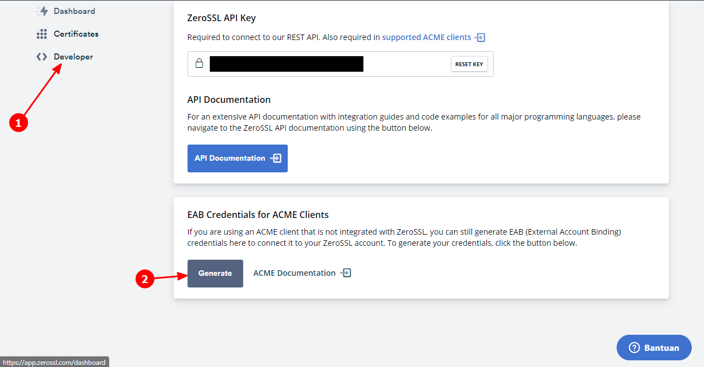
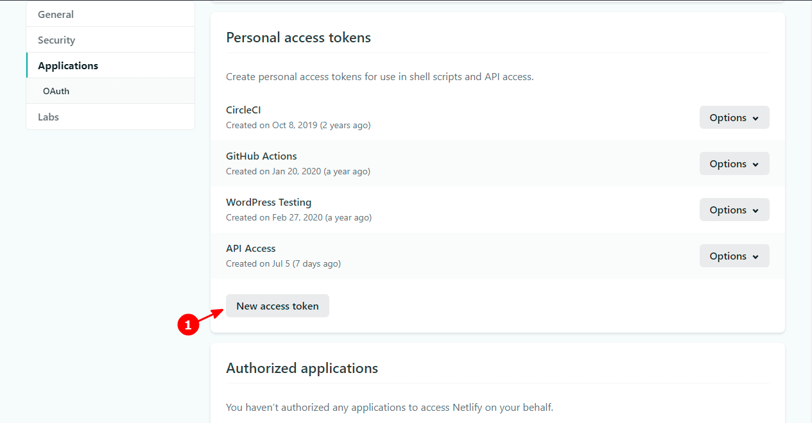
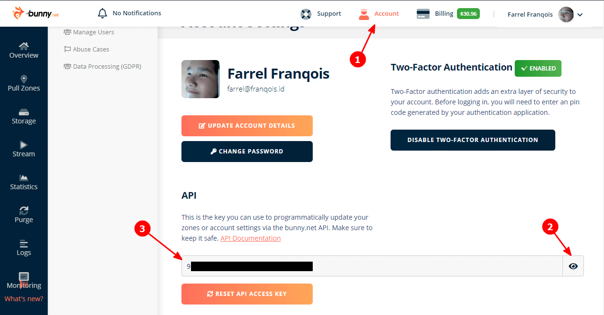

## Daftar Isi


## Pembuka
Artikel kali ini akan membahas tentang Cara memasang ZeroSSL + Renew secara Otomatis di Netlify dan BunnyCDN.

Di sini, Anda akan mempelajari untuk menerbitkan Sertifikat SSL yang bisa Anda dapatkan dari ZeroSSL, baik jangkauan nya untuk 1 Domain, Banyak Domain atau Subdomain, atau _Wildcard_ dengan menggunakan acme.sh sebagai perkakasnya, setelah itu Anda akan memasang sertifikat SSL dengan memanggil Server API milik Bunny.net dan Netlify memakai cURL.

[acme.sh](https://acme.sh) adalah sebuah perkakas klien untuk Protokol ACME, yang bertujuan sebagai alat bantu untuk menerbitkan/memperbarui/mencabut atau mengelola Sertifikat SSL. Perkakas tersebut dibuat dengan menggunakan _Shell_ dan Kompatibel di hampir semua Sistem Operasi yang berbasis \*nix.

### Tunggu, ZeroSSL Gratis? Bukannya bayar? {#zerossl-gratis}
Iya, untuk saat ini ZeroSSL memanglah gratis, bahkan Anda juga bisa menerbitkan Sertifikat SSL _Wildcard_ nya secara gratis dengan jumlah yang tidak terbatas, dengan kunci RSA maupun ECC.

Tapi, itu hanya berlaku jika Anda membuat sertifikat SSL melalui Server ACME nya, bukan melalui Situs Web ataupun REST API nya. Semua sertifikat yang diterbitkan dengan Protokol ACME akan memiliki masa berlaku selama 90 hari kedepan.

Serta, jika Anda membuat/menerbitkan sebuah Sertifikat SSL menggunakan Protokol ACME dan Server ACME nya, maka kuota SSL yang ada di Situs Web tidak akan bertambah sama sekali.

Infonya dari mana? Salah satu infonya berasal dari [dokumentasinya](https://zerossl.com/documentation/acme/).

Tapi, sebetulnya jika kamu lebih teliti lagi, di Halaman ["Pricing"](https://zerossl.com/pricing/) nya pun kamu akan menemukan tulisan "90-Day ACME Certs" yang bersebelahan dengan Simbol "tidak terbatas", yang artinya kamu dapat menerbitkan Sertifikat SSL dari Server ACME nya dalam bentuk apapun secara gratis tanpa batasan jumlah.


Nah, sekarang sudah paham, kan? Jadi, Anda tidak perlu jadi orang kaya atau berduit banyak dulu biar bisa menerbitkan Sertifikat SSL dari ZeroSSL, kecuali jika Anda ingin Layanan Dukungan nya, Akses REST API nya, serta sertifikat SSL dengan masa berlaku selama 1 Tahun, Anda bisa berlangganan yang berbayar.

### Persyaratan Perangkat Lunak
Di artikel ini, Anda akan mempelajari menerbitkan Sertifikat SSL dengan menggunakan [acme.sh](https://acme.sh) yang hanya kompatibel dengan Sistem Operasi berbasis *nix/UNIX-like, termasuk tapi tidak terbatas pada GNU/Linux, macOS, BSD dan Android.

Maka, persyaratan perangkat lunak yang harus Anda penuhi bagi pengguna Sistem Operasi agar bisa menggunakan acme.sh serta agar dapat mengikuti artikel ini secara keseluruhan. Berikut di bawah ini adalah persyaratannya:

#### Untuk Pengguna GNU/Linux, macOS, BSD dan Sistem Operasi berbasis \*nix lainnya {#syarat-pengguna-unix-like}

Jika terlalu panjang, maka persyaratan nya adalah sebagai berikut:
- OpenSSL (atau LibreSSL?)
- cURL
- Cron
- Socat (Opsional, karena tidak saya bahas)


Sistem Operasi berbasis Unix/Unix-like (\*nix) seperti GNU/Linux, macOS, dan BSD, sebetulnya tidak usah ditanya, mereka sudah pasti kompatibel dengan acme.sh karena aplikasi tersebut memang dirancang untuk \*nix. 

Asal punya OpenSSL (atau LibreSSL?), cURL dan Cron, maka acme.sh dapat dijalankan sebagaimana mestinya, serta Anda dapat mengikuti Artikel ini secara keseluruhan. Wget juga bisa Anda gunakan, di artikel ini saya bahas hanya untuk mengunduh dan menginstal acme.sh saja.

Selain itu, Anda juga dapat meng-instal Socat (Socket Cat) agar acme.sh dapat dijalankan dalam "Standalone Mode", tapi itu tidak saya bahas di dalam artikel ini.

#### Untuk Pengguna Windows {#syarat-pengguna-windows}

Jika terlalu panjang, maka persyaratan nya adalah sebagai berikut:
- Memiliki Akses ke Lingkungan Unix/Unix-like: (Pilih salah satu caranya)
    - Mengaktifkan fitur [WSL (Windows Subsystem for Linux)](https://docs.microsoft.com/en-us/windows/wsl/install-win10) untuk Windows 10 atau di atasnya
    - Mesin Virtual atau Kontainer dengan Sistem Operasi berbasis Unix/Unix-like (disarankan GNU/Linux)
    - Mengakses Server Anda yang menggunakan Sistem Operasi \*nix dengan menggunakan Klien SSH
- Persyaratan Perangkat Lunak pada WSL, Mesin Virtual/Kontainer atau pada Server bisa mengikuti [persyaratan untuk Sistem Operasi \*nix](#syarat-pengguna-unix-like)


Jika Anda menggunakan Windows, maka Anda perlu untuk mengakses Lingkungan Unix/Unix-like (\*nix), Anda bisa gunakan cara apapun untuk melakukan nya. Jika Anda menggunakan Windows 10 (atau di atasnya), maka Anda bisa gunakan fitur [WSL (Windows Subsystem for Linux)](https://docs.microsoft.com/en-us/windows/wsl/install-win10) agar Anda bisa menggunakan Sistem Operasi GNU/Linux di dalam Windows.

Atau, jika Anda tidak ingin/tidak bisa menggunakan WSL, maka Anda juga bisa memiliki Mesin Virtual/Kontainer dan Instal, lalu gunakan Sistem Operasi berbasis Unix/Unix-like (seperti GNU/Linux) di dalam Mesin tersebut.

Atau, Anda juga bisa akses Server Anda yang menggunakan Sistem Operasi \*nix untuk mengikuti artikel ini dengan menggunakan Klien SSH tanpa perlu mengorbankan kinerja pada Komputer/Laptop Anda.

Ketika Anda sedang memakai WSL, Mesin Virtual/Kontainer atau Server, maka Anda bisa mengikuti persyaratan perangkat lunak untuk Sistem Operasi \*nix. Jadi pastikan jika cURL, OpenSSL (atau LibreSSL?) dan Cron sudah ada di dalam Sistem WSL (Biasanya ada), di dalam Mesin Virtual/Kontainer atau di dalam Server Anda.

#### Untuk Pengguna Android (tidak perlu akses _root_) {#syarat-pengguna-android}

Jika terlalu panjang, maka persyaratan nya adalah sebagai berikut:
- Tidak perlu Akses _root_ atau perangkat tidak perlu dalam keadaan ter-_root_. Jika demikian, ya tidak masalah
- Terinstalnya Termux di Perangkat Android Anda. Bisa Anda unduh di [F-Droid resminya](https://f-droid.org/repository/browse/?fdid=com.termux), jangan unduh di [Google Play Store](https://play.google.com/store/apps/details?id=com.termux)! (Alasan nya [di sini](https://wiki.termux.com/wiki/Termux_Google_Play))
- Persyaratan di Termux setelah di-instal sebagai berikut:
    1. Perbarui semua Paket yang ada di Termux dengan perintah: `pkg update; pkg upgrade`
    2. Persyaratan Perangkat Lunak pada Termux bisa mengikuti [persyaratan untuk GNU/Linux](#syarat-pengguna-unix-like). Tapi, Anda juga dapat meng-instal semua keperluan nya dengan perintah: `pkg install curl wget openssl-tools cronie termux-services`, lalu mulai ulang Termux jika berhasil
    3. Aktifkan Layanan (_Service_) Cron di Latar Belakang dengan Perintah: `sv-enable crond`
    4. Pastikan Termux bisa mengakses Penyimpanan Internal atau Eksternal pada perangkat Anda, agar Anda bisa berbagi penyimpanan pada Termux. Referensi: ["Internal and external storage"](https://wiki.termux.com/wiki/Internal_and_external_storage#Access_shared_and_external_storage) dari Wiki Termux (Baca dan pahami mulai dari bagian "Access shared and external storage")


Jika Anda menggunakan Android, maka Anda bisa gunakan Termux untuk itu, selalu gunakan versi terbaru untuk pengalaman yang lebih nyaman.

Pastikan Termux tidak diunduh melalui [Google Play Store](https://play.google.com/store/apps/details?id=com.termux), melainkan melalui [F-Droid nya](https://f-droid.org/repository/browse/?fdid=com.termux).

Kenapa? Karena Termux sudah tidak lagi diperbarui di Google Play Store sejak 02 November 2020 yang lalu, untuk alasannya silahkan Anda baca [di sini](https://wiki.termux.com/wiki/Termux_Google_Play).

Ketika Anda sedang menggunakan Termux, maka Anda bisa mengikuti persyaratan perangkat lunak untuk Sistem Operasi berbasis \*nix. Jadi pastikan jika cURL, OpenSSL, dan Cron sudah ada di dalam Termux Anda.

Tapi sayangnya, di dalam Termux belum terinstal OpenSSL dan Cron secara bawaan. Jadi setelah Anda Instal Termux, maka hal yang perlu Anda lakukan adalah perbarui semua paket-paket yang ada, lalu instal paket-paket yang diperlukan dengan perintah berikut:

```bash
$ pkg update; pkg upgrade
$ pkg install curl wget openssl-tools cronie termux-services
```

Kalau perlu, ganti _Repository_ pada Termux dengan perintah `termux-change-repo` dan gunakan _Repository_ Resmi dari Termux terlebih dahulu agar mendapatkan versi terbaru, barulah Anda eksekusikan perintah di atas. 

Setelah itu, mulai ulang Termux Anda dengan eksekusi perintah `exit`, lalu buka lagi Termux nya agar perubahannya bisa diterapkan. Setelah Termux dibuka lagi, aktifkan Cron dari latar belakang dengan meng-eksekusi perintah `sv-enable crond`.

Selain itu, pastikan Termux bisa mengakses Penyimpanan Internal dan Eksternal pada perangkat Anda. agar Anda bisa berbagi penyimpanan pada Termux. Silahkan Anda baca [halaman dokumentasinya](https://wiki.termux.com/wiki/Internal_and_external_storage#Access_shared_and_external_storage) dan pahami mulai dari bagian "Access shared and external storage".

Semua hal di atas bisa Anda lakukan tanpa perlu akses _root_ sedikitpun dan perangkat tidak perlu dalam keadaan ter-_root_, jadi Anda tidak perlu khawatir akan kehilangan garansi pada perangkat Anda.

### Sanggahan
Sebelum Anda lanjut, saya peringati bahwa Artikel/Tutorial yang dibahas ini sangatlah "Panjang x Lebar", jika Anda tidak sanggup membaca Artikel yang terlalu panjang, maka saya sarankan cari Artikel lain yang membahas ini secara sederhana, jangan paksakan diri Anda kecuali jika Anda ingin belajar.

Meskipun artikel ini Panjang x Lebar, saya usahakan agar semuanya saya bahas dalam langkah-demi-langkah, sehingga mudah dipahami oleh Anda.

Saya usahakan agar pembahasan di artikel ini bisa diterapkan/diikuti oleh hampir semua pengguna Sistem Operasi, termasuk tapi tidak terbatas pada Sistem Operasi Windows dan hampir semua Sistem Operasi berbasis \*nix, seperti Sistem Operasi yang menggunakan Kernel Linux (cth. GNU/Linux, Android, Alpine Linux, Void Linux, dll), macOS, BSD, dan Sistem Operasi \*nix lainnya.

Namun, bukan berarti Anda bisa mengikuti semuanya meskipun saya berusaha agar ini bisa diikuti oleh hampir semua Sistem Operasi, karena saya belum mencoba di Sistem Operasi selain GNU/Linux, Windows dan Android, sehingga saya tidak berani menjamin nya.

Jadi, mohon perhatian dan pengertian nya, jika Anda melanjutkan berarti Anda sudah memahami nya. Terima kasih dan selamat melanjutkan 😊

## Sebelum menerbitkan Sertifikat SSL
Sebelum menerbitkannya, Anda perlu mengikuti beberapa poin pembahasan terlebih dahulu. Poin-poin akan saya bahas dalam langkah-demi-langkah.

Jadi, harap Anda jangan melewati satu langkahpun, kecuali jika ada catatan yang mengizinkannya.

Atau, Anda juga bisa lewati bagian ini jika Anda sudah pernah mendaftarkan akun ZeroSSL, meng-install dan konfigurasi acme.sh, serta melakukan pengaitan akun ZeroSSL dengan acme.sh sebelumnya.

### Membuat Akun ZeroSSL dan mendapatkan Kredensial EAB nya {#membuat-akun-zerossl}

Jika Anda belum mempunyai Akun nya dan ingin menggunakan acme.sh tanpa harus mendaftarkan akun ZeroSSL nya, lewati ini dan langsung [lanjut saja](#install-acme-sh).


Sebelum Anda menerbitkan Sertifikat SSL nya, maka Anda disarankan untuk mendaftar akun ZeroSSL nya terlebih dahulu melalui [Situs Webnya](https://zerossl.com).

Setelah mendaftar, Anda tidak perlu membuat/menerbitkan Sertifikatnya di sana, melainkan Anda hanya perlu Kredensial EAB (_External Account Binding_) yakni "EAB KID" dan "EAB HMAC Key" nya saja. Langkah-langkahnya sebagai berikut:

0. Daftar Akun ZeroSSL nya [di sana](https://app.zerossl.com/signup) dan Login setelah itu (Atau, Anda hanya perlu [Login](https://app.zerossl.com/login) saja jika Anda sudah pernah mendaftar akun sebelumnya)
1. Pada Dasbor ZeroSSL, klik "Developer"
2. Setelah itu, pada bagian "EAB Credentials for ACME Clients", klik _Button_ "Generate"
3. Simpan "EAB KID" dan "EAB HMAC Key" yang telah dihasilkan itu dengan baik, nanti akan digunakan lagi untuk acme.sh
4. Setelah menyimpannya, Anda tinggal klik _Button_ "Done" dan Selesai

Jika Anda tidak memahami langkah-langkah di atas, maka Anda dapat melihat Cuplikan Layar berikut yang cukup menyesuaikan dengan langkah-langkah di atas: (Silahkan perbesar gambarnya dengan mengkliknya)

 

Setelah Kredensial EAB dibuat, ya sudah lanjut saja ke langkah berikutnya, yakni Instal acme.sh, Anda sama sekali tidak perlu menerbitkan Sertifikat SSL nya di sana.

### Instal acme.sh {#install-acme-sh}
Setelah mendaftar akun ZeroSSL, salah satu yang perlu Anda lakukan adalah meng-instal acme.sh terlebih dahulu di dalam Sistem Operasi Anda.

Tidak perlu menggunakan Akun Administrator atau `root` untuk meng-instalnya, atau tidak perlu dieksekusikan melalui perintah `sudo`, cukup gunakan saja akun Anda, seperti biasanya. (Bahkan, lebih baik gini)

Cara meng-instalnya adalah dengan meng-eksekusikan salah satu perintah berikut:

Dengan cURL:

```shell
curl https://get.acme.sh | sh -s email=my@example.com
```

Atau, dengan GNU Wget:

```shell
wget -O -  https://get.acme.sh | sh -s email=my@example.com
```

Ganti `my@example.com` dengan Alamat Surel Anda, jangan lupa dimasukkan. Tapi jika Anda lupa memasukkan/tidak atau salah memasukkan alamat surel saat meng-instalnya, maka Anda dapat eksekusi perintah di bawah ini setelah terinstal:

```shell
cp ~/.acme.sh/account.conf ~/.acme.sh/account.conf.1 ## Backup dulu
sed -i '/ACCOUNT\_EMAIL\=/d' ~/.acme.sh/account.conf ## Hapus Variabel `ACCOUNT_EMAIL` yang sudah ada
printf "ACCOUNT_EMAIL='my@example.com'\n" >> ~/.acme.sh/account.conf
```

Ganti `my@example.com` dengan Alamat Surel Anda.

Setelah selesai instal, pastikan bahwa acme.sh dapat dieksekusi dengan baik dengan mengetikkan `acme.sh --version` di dalam Terminal, lalu tekan tombol "<key>Enter</key>".

Jika dapat dieksekusi dengan baik, maka akan tampil versi dari acme.sh dan selamat Anda telah meng-instalnya dengan benar.

Jika tidak, gunakan perintah `source` untuk memperbarui _Shell_ (cth. `source ~/.bashrc` atau `. ~/.bashrc`), kalau masih tidak bisa juga, maka Anda perlu memasukkan direktori acme.sh kedalam variabel `PATH`, dengan salah satu cara berikut:

Untuk pengguna GNU Bash:

```shell
cp ~/.bashrc ~/.bashrc.1  ## Backup dulu
echo 'PATH="${HOME}/.acme.sh:${PATH}" && export PATH' >> ~/.bashrc
echo 'LE_WORKING_DIR="${HOME}/.acme.sh" && export LE_WORKING_DIR' >> ~/.bashrc
chmod +x ~/.acme.sh/acme.sh
source ~/.bashrc
```

Untuk pengguna Zsh:

```zsh
cp ~/.zshrc ~/.zshrc.1  ## Backup dulu
echo 'PATH="${HOME}/.acme.sh:${PATH}" && export PATH' >> ~/.zshrc
echo 'LE_WORKING_DIR="${HOME}/.acme.sh" && export LE_WORKING_DIR' >> ~/.zshrc
chmod +x ~/.acme.sh/acme.sh
source ~/.zshrc
```

### Verifikasi DNS di acme.sh
Agar Sertifikat SSL dapat diterbitkan melalui Protokol ACME, maka pengguna diperlukan melakukan verifikasi. Salah satunya adalah dengan verifikasi DNS.

Verifikasi DNS merupakan metode verifikasi yang paling dianjurkan, selain mudah dan hanya pemilik domain yang bisa melakukannya, Anda juga dapat menerbitkan Sertifikat SSL untuk semua Subdomain Anda (_Wildcard SSL_) dengan mudah.

Selain itu, jika Anda ingin sertifikat SSL nya hanya dipasang ke penyedia web yang sedang saya bahas di artikel ini, yakni Netlify dan BunnyCDN, yang mana Anda tidak perlu mengaitkan domain Anda dengan _Web Server_ milik Anda, maka metode verifikasi seperti ini wajib Anda pelajari.

Agar acme.sh dapat melakukan verifikasi DNS secara otomatis saat menerbitkan dan memperbarui Sertifikat SSL, maka acme.sh harus dapat mengakses dan merubah _DNS Record_ pada akun Penyedia DNS Otoritatif Anda.

Untuk itu, Anda perlu memberikan acme.sh sebuah izin untuk mengaksesnya dengan memberinya sebuah _Token_, Kunci API atau bahkan Nama Pengguna dan Kata Sandi untuk mengakses akun tertentu.

#### Untuk Pengguna DNS Otoritatif Cloudflare {#untuk-pengguna-dns-cloudflare}
Jika Anda menggunakan Cloudflare sebagai DNS Otoritatif untuk Domain Anda, Anda tinggal buat sebuah "API Token" (`CF_Token`) dan dapatkan "Account ID" (`CF_Account_ID`) nya, jika berkenan, Anda juga bisa mendapatkan "Zone ID" (`CF_Zone_ID`) nya juga agar acme.sh hanya menargetkan ke 1 Domain Utama saja secara spesifik.

Untuk membuat "API Token" nya, silahkan Anda baca [dokumentasinya](https://developers.cloudflare.com/api/tokens/create), di sana sudah dijelaskan secara lengkap tentang bagaimana cara membuat "API Token" nya.

Buatlah "API Token" yang diizinkan untuk mengedit DNS nya dengan memilih "Edit zone DNS" sebagai Templat saat ingin membuatnya. Serta, pastikan juga bahwa Anda menjangkau semua Domain atau _Zone_ yang ada di Cloudflare, agar nanti Anda bisa menargetkan seluruh domain yang ada di Cloudflare.

Untuk mendapatkan "Account ID" dan "Zone ID" nya, Anda tinggal ke [Halaman Dasbor Cloudflare](https://dash.cloudflare.com), pilih Domain nya, lalu gulirkan kebawah, nanti akan ketemu Informasi mengenai "Account ID" dan "Zone ID", seperti di bawah ini:


Nah, setelah semuanya berhasil didapat, maka Anda tinggal masukkan saja semua Informasinya ke dalam variabel. Dengan cara berikut:

```shell
### Di bawah ini adalah Informasi yang wajib dimasukki
CF_Token="API_TOKEN_KAMU_DI_SINI" && export CF_Token
CF_Account_ID="ACCOUNT_ID_KAMU_DI_SINI" && export CF_Account_ID

### Anda juga dapat memasukkan "Zone ID" jika Anda ingin acme.sh menargetkan hanya
### untuk 1 Domain Utama saja secara spesifik, tapi ini bukanlah hal yang wajib, jadi sebaiknya tidak usah saja
CF_Zone_ID="ZONE_ID_KAMU_DI_SINI" && export CF_Zone_ID
```

 
Jika Anda langsung mengeksekusinya melalui Terminal, maka jangan sampai kamu mengakhiri sesi Terminal atau _Shell_ kamu sampai menerbitkan Sertifikat SSL di acme.sh dengan menggunakan DNS sebagai metode verifikasi, variabel tersebut akan terhapus secara otomatis jika sesi berakhir. 

Jika kamu tidak mau itu terjadi, maka simpanlah variabel di atas ke dalam berkas `~/.bashrc` atau `~/.zshrc` (untuk Pengguna Zsh), lalu gunakan perintah `source` agar dapat memperbarui _Shell_ nya.

Peringatan di atas tidak berlaku jika _Shell_ yang Anda gunakan memiliki fitur Riwayat atau Penyelesaian Otomatis yang berbasiskan Riwayat _Shell_, dan yang pasti Anda tahu cara menggunakannya.


Udah itu aja, jika Anda menggunakan Cloudflare dan sudah memasukkan Informasi-informasi di atas, maka Anda hanya perlu langsung melanjutkan ke [langkah berikutnya](#registrasi-akun-acme-sh) saja.

#### Untuk Pengguna DNS Otoritatif lain {#untuk-pengguna-dns-lain}
Jika Anda menggunakan Layanan DNS Otoritatif selain Cloudflare, seperti Hurricane Electric Free DNS, Constellix, NS1, ClouDNS, Amazon Route53, dll, maka Anda perlu membaca [halaman dokumentasinya](https://github.com/acmesh-official/acme.sh/wiki/dnsapi).

Karena setiap Penyedia DNS Otoritatif mempunyai cara yang berbeda-beda untuk mengaksesnya. Jadi, silahkan ikuti yang ada di dokumentasinya.

Jika sudah, silahkan lanjut ke [langkah berikutnya](#registrasi-akun-acme-sh).

### Registrasi Akun melalui acme.sh {#registrasi-akun-acme-sh}
Secara bawaan, acme.sh menggunakan ZeroSSL sebagai CA (_Certificate Authority_) nya, jadi jika Anda adalah orang yang pertama kali menggunakan acme.sh, silahkan registrasikan akun ZeroSSL yang telah Anda buat terlebih dahulu ke Server ACME nya menggunakan acme.sh dengan perintah berikut:

```shell
acme.sh --register-account --eab-kid EAB_KID_KAMU_DI_SINI --eab-hmac-key EAB_HMAC_KEY_KAMU_DI_SINI
```

Ganti `EAB_KID_KAMU_DI_SINI` dan `EAB_HMAC_KEY_KAMU_DI_SINI` dengan "EAB KID" dan "EAB HMAC Key" yang telah kamu simpan sebelumnya.

Atau, jika Anda belum pernah daftar akun ZeroSSL sama sekali dan ingin menggunakan acme.sh tanpa harus mendaftarkan akun ZeroSSL dari Web, maka Anda dapat eksekusi perintah berikut:

```shell
acme.sh --register-account
```

Keluaran nya akan seperti di bawah ini:

```
[Sel 10 Agu 2021 05:31:16  WIB] Create account key ok.
[Sel 10 Agu 2021 05:31:16  WIB] No EAB credentials found for ZeroSSL, let's get one
[Sel 10 Agu 2021 05:31:17  WIB] Registering account: https://acme.zerossl.com/v2/DV90
[Sel 10 Agu 2021 05:31:20  WIB] Registered
[Sel 10 Agu 2021 05:31:20  WIB] ACCOUNT_THUMBPRINT='f4qxxxxxxxxxxxxxxxxx_xxxxxxx-xxxxxxxxx_xxxx'
```


Dengan mengeksekusi perintah di atas, itu bukan berarti Anda mendaftarkan akun ZeroSSL yang kemudian bisa Anda gunakan untuk login ke dalam [Situs Web ZeroSSL nya](https://app.zerossl.com/login).

Jika Anda ingin mengelola sertifikat tersebut di Web nya, maka saya sarankan agar Anda membuat akunnya terlebih dahulu melalui Situs Web nya, caranya bisa Anda baca di [langkah pertama](#membuat-akun-zerossl), lalu kaitkan Kredensial EAB nya di acme.sh.


Anda bisa Simpan `ACCOUNT_THUMBPRINT` nya dengan baik, barangkali suatu saat nanti Anda ingin menjalankan acme.sh dalam ["Stateless Mode"](https://github.com/acmesh-official/acme.sh/wiki/Stateless-Mode). Tapi, Anda bisa dapatkan itu kembali dengan mengeksekusi perintah `acme.sh --register-account`.

Setelah itu, kamu telah dapat menggunakan acme.sh seperti biasanya untuk menerbitkan/membuat dan memperbarui Sertifikat SSL kamu.

## Menerbitkan Sertifikat SSL dengan acme.sh {#menerbitkan-sertifikat-ssl}
Nah, setelah mengikuti beberapa langkah, akhirnya Anda bisa sampai di sini, yakni menerbitkan Sertifikat SSL.

Ada beberapa cara untuk menerbitkannya menggunakan acme.sh, tidak perlu Anda ikuti semua dan sesuaikan dengan selera Anda, kecuali jika ada teks "Wajib dipelajari" nya, bagian itu yang wajib Anda pelajari.

Berikut adalah cara-caranya:

### Menerbitkan Sertifikat SSL (Wajib dipelajari) {#issue-cert}
Jika Anda ingin menerbitkan Sertifikat SSL dengan acme.sh (cth. hanya untuk 1 Domain dan 1 Subdomain), maka format perintah nya akan menjadi seperti berikut:

```shell
acme.sh --issue -d domain.com -d www.domain.com METODE_VERIFIKASI PARAMETER_TAMBAHAN
```

Jika Anda mengeksekusi perintah di atas, maka Anda menerbitkan Sertifikat SSL hanya untuk 1 Domain dan 1 Subdomain saja, yakni `domain.com` dan `www.domain.com`.

Parameter `-d` berfungsi untuk menentukan domain yang dijangkau oleh Sertifikat SSL tersebut saat diterbitkan, isikan itu dengan Domain Anda. Sebenarnya, Anda juga dapat menambahkan perameter `-d` agar Sertifikat SSL menjangkau setiap domain yang Anda masukkan, sebanyak yang Anda mau.

Domain Pertama yang Anda masukkan akan menjadi "Common Name"/"Subject"/"Issued to" pada Sertifikat SSL, selain SAN (_Subject Alternative Name_), sedangkan domain kedua dan seterusnya hanya dimasukkan kedalam SAN saja. 

Selain itu, nama direktori untuk Sertifikat SSL nya sendiri akan ditentukan berdasarkan domain pertama yang Anda masukkan.

Contohnya seperti Cuplikan berikut di Windows:

 

Atau, di bawah ini untuk GNU/Linux:

 

Jika Anda melihat cuplikan di atas, "Common Name" yang tampil adalah `farrel.franqois.id` bukan `*.farrel.franqois.id`, padahal Sertifikat yang saya terbitkan itu adalah Sertifikat SSL _Wildcard_, dan `*.farrel.franqois.id` malah cuma dimasukkan ke dalam SAN (_Subject Alternative Name_) saja bersamaan dengan Domain Pertama nya.

Kenapa bisa begitu? Sederhananya karena Domain Pertama yang saya masukkan ketika menerbitkan sebuah Sertifikat SSL adalah `farrel.franqois.id`, bukan `*.farrel.franqois.id`. Nah, sekarang sudah paham, kan?

Parameter `--issue` berfungsi agar acme.sh menerbitkan Sertifikat SSL Anda. Parameter selain `--issue` adalah sebagai berikut:
- `--renew` untuk memperbarui Sertifikat SSL yang ada 
- `--revoke` untuk mencabut Sertifikat SSL yang ada
- `--remove` untuk menghapus Sertifikat SSL yang ada
- `--renew-all` untuk memperbarui semua Sertifikat SSL yang ada (**Catatan:** Anda tidak perlu menambahkan parameter `-d` jika menggunakan parameter ini)
- Dan lain-lain nya

Anda juga dapat menambahkan parameter `--force` di sampingnya agar dapat melakukannya secara paksa.

#### Metode Verifikasi (`METODE_VERIFIKASI`)
Anda harus menggantikan `METODE_VERIFIKASI` di atas dengan parameter/argumen mengenai metode verifikasi yang ada, menjadi parameter berikut: (Setidaknya gunakan salah satu parameter)
- `--webroot lokasi_webroot` atau `-w lokasi_webroot` jika Anda ingin menggunakan metode _Webroot_. 

    Ganti `lokasi_webroot` dengan lokasi Web Anda, seperti `/var/www/html`, `/home/username/public_html`, atau apa aja yang penting itu menandakan lokasi Web Anda.

- `--dns nama_dns` jika Anda ingin menggunakan metode DNS. 

    Ganti `nama_dns` dengan yang ada di [halaman dokumentasinya](https://github.com/acmesh-official/acme.sh/wiki/dnsapi) dan sesuaikan dengan Penyedia DNS Otoritatif yang Anda gunakan. (Saya bahas ini di bagian terpisah)

- `--apache` jika Anda ingin menggunakan _Web Server_ Apache2 sebagai verifikasi nya.
- `--nginx (lokasi_conf)` jika Anda ingin meggunakan _Web Server_ NGINX sebagai verifikasi nya. 

    Anda bisa ganti `(lokasi_conf)` dengan lokasi berkas konfigurasi untuk NGINX Anda jika diinginkan, barangkali acme.sh tidak bisa mendeteksi berkas konfigurasi NGINX secara otomatis, jika tidak maka cukup tulis `--nginx` saja.

- `--standalone` jika Anda tidak mempunyai Aplikasi _Web Server_ atau sedang tidak berada di dalam Server Web (cth. Sedang berada di dalam Server FTP atau SMTP).

Jadi, Anda tidak bisa sembarangan membuat Sertifikat SSL untuk domain lain. Berhasil atau Gagal akan menambahkan _Rate Limit_ jika Anda menggunakan CA seperti Let's Encrypt dan Buypass CA. Jadi, berhati-hatilah ketika ingin menerbitkan Sertifikat SSL dengan menggunakan Protokol ACME, terutama jika Anda menggunakan CA selain ZeroSSL.

#### Parameter Tambahan (`PARAMETER_TAMBAHAN`)
Anda bisa menggantikan `PARAMETER_TAMBAHAN` dengan parameter lain yang ingin Anda tambahkan saat menerbitkan Sertifikat SSL, parameter lain nya sebagai berikut:
- `--test` atau `--staging` jika Anda ingin menjalankannya dalam mode pengujian. Ini cocok bagi Anda yang sedang belajar menggunakan acme.sh atau menguji penerbitan Sertifikat SSL dengan metode verifikasi yang berbeda tanpa mempengaruhi _Rate Limit_ aslinya. 

    Jadi, saya sarankan agar Anda selalu gunakan parameter ini jika Anda sedang mempelajari penggunaan acme.sh atau memastikan apakah sertifikat SSL bisa diterbitkan dengan benar atau tidaknya tanpa mempengaruhi _Rate Limit_ dari suatu CA.

    Jika Anda sudah merasa yakin, maka Anda bisa terbitkan ulang Sertifikat SSL nya untuk Produksi dengan menggunakan parameter `--issue --force`, tanpa parameter `--test` atau `--staging`.

- `--server opsi_ca` jika Anda ingin menerbitkan sertifikat SSL oleh CA lain, yang secara bawaan diterbitkan oleh ZeroSSL sebagai CA. 

    Ganti `opsi_ca` menjadi nama pendek dari CA yang mendukung, seperti: `zerossl`, `buypass`, `buypass_test`, `letsencrypt`, `letsencrypt_test`, `sslcom`.

    Atau, Anda juga bisa ganti `opsi_ca` dengan memasukkan Alamat URL Server ACME dari Penyedia CA Anda. Untuk selengkapnya, silahkan Anda pelajari dari [Halaman Wiki nya](https://github.com/acmesh-official/acme.sh/wiki/Server).

- `--keylength opsi` atau `-k opsi` jika Anda ingin menerbitkan Sertifikat SSL dengan ukuran kunci atau kunci yang berbeda. Ganti `opsi` dengan `2048`, `3072`, `4096`, `8192`, `ec-256`, `ec-384`, atau `ec-512` (Saya bahas di bagian terpisah)
- `--cert-file file` untuk menyalinkan berkas Sertifikat ke dalam direktori lain setelah menerbitkan/memperbarui Sertifikat SSL nya. Ganti `file` menjadi lokasi atau/dan nama berkas yang Anda inginkan.
- `--key-file file` untuk menyalinkan berkas Kunci ke dalam direktori lain setelah menerbitkan/memperbarui Sertifikat SSL nya. Ganti `file` menjadi lokasi atau/dan nama berkas yang Anda inginkan.
- `--ca-file file` untuk menyalinkan berkas Sertifikat CA/Sertifikat Penengah ke dalam direktori lain setelah menerbitkan/memperbarui Sertifikat SSL nya. Ganti `file` menjadi lokasi atau/dan nama berkas yang Anda inginkan.
- `--fullchain-file file` untuk menyalinkan berkas Sertifikat _Fullchain_ ke dalam direktori lain setelah menerbitkan/memperbarui Sertifikat SSL nya. Ganti `file` menjadi lokasi atau/dan nama berkas yang Anda inginkan.
- `--reloadcmd perintah` untuk mengeksekusikan perintah untuk me-_reload_ Server setelah menerbitkan/memperbarui Sertifikat SSL nya.

Udah itu saja yang saya bahas, parameter lainnya masih banyak, tapi yang saya bahas adalah kasus umumnya saja. Jika Anda tidak ingin menambahkan parameter lain, Anda hanya menghapus `PARAMETER_TAMBAHAN` nya saja.

#### Setelah menerbitkan sertifikat SSL
Jika Anda menerbitkan Sertifikat SSL memakai acme.sh dan dinyatakan berhasil, maka akhir dari keluaran nya kira-kira akan seperti berikut:

```plain
[Kam 12 Agu 2021 02:14:50  WIB] Cert success.
-----BEGIN CERTIFICATE-----
ISI SERTIFIKAT
-----END CERTIFICATE-----
[Kam 12 Agu 2021 02:14:50  WIB] Your cert is in: /home/username/.acme.sh/domain.com/domain.com.cer
[Kam 12 Agu 2021 02:14:50  WIB] Your cert key is in: /home/username/.acme.sh/domain.com/domain.com.key
[Kam 12 Agu 2021 02:14:50  WIB] The intermediate CA cert is in: /home/username/.acme.sh/domain.com/ca.cer
[Kam 12 Agu 2021 02:14:50  WIB] And the full chain certs is there: /home/username/.acme.sh/domain.com/fullchain.cer
```

Ini artinya, bahwa Sertifikat SSL telah berhasil dibuat/diterbitkan oleh CA dan berkas-berkas yang diperlukan telah disimpan di dalam direktori `/home/username/.acme.sh/domain.com` atau di `~/.acme.sh/domain.com`.

Berkas-berkas seperti `domain.com.cer`, `domain.com.key` dan `ca.cer` atau `fullchain.cer` dan `domain.com.key` akan diperlukan untuk pemasangan sertifikat SSL di Layanan Hosting/CDN, untuk lebih lanjut akan saya bahas di bagian terpisah.

Tapi, nama direktori untuk menyimpan dan bahkan nama dari berkas-berkas tersebut biasanya bergantung pada domain pertama yang dimasukkan saat ingin menerbitkan sebuah sertifikat SSL. 

Contohnya Anda ingin menerbitkan sertifikat SSL dengan perintah berikut:

```shell
acme.sh --issue -d www.domain.com -d domain.com --nginx
```

Karena domain pertama yang dimasukkan adalah `www.domain.com`, bukan `domain.com` sesuai perintah di atas, maka berkas-berkas yang diperlukan akan disimpan di dalam direktori `/home/username/.acme.sh/www.domain.com`, bukan di dalam direktori `/home/username/.acme.sh/domain.com` jika berhasil.

Nah, sekarang Anda sudah paham, kan? Kalau sudah paham, tinggal pelajari verifikasi menggunakan DNS dan tentukan cara menerbitkan sertifikat SSL nya dengan sesuka kamu.

### Menerbitkan Sertifikat SSL dengan Menggunakan DNS sebagai Metode Verifikasi (Wajib dipelajari) {#verifikasi-dns}
Jika Anda ingin menerbitkan Sertifikat SSL yang menggunakan DNS sebagai Metode Verifikasi nya, maka Anda tinggal tambahkan saja parameter `--dns nama_dns`. 

Contoh di bawah ini adalah perintah untuk menerbitkan Sertifikat SSL untuk 1 Domain dan 1 Subdomain dengan menggunakan DNS dari Cloudflare sebagai Metode Verifikasi:

```shell
acme.sh --issue -d domain.com -d www.domain.com --dns dns_cf
```


Jika Anda sedang mempelajari penggunaan perkakas acme.sh, maka saya sarankan agar Anda selalu tambahkan parameter `--test` atau `--staging` untuk menjalankan perkakas acme.sh dalam mode pengujian, ini cocok untuk Anda yang sedang belajar.

Jika Anda sudah merasa yakin, maka Anda bisa terbitkan ulang Sertifikat SSL nya untuk Produksi dengan menggunakan parameter `--issue --force`, tanpa parameter `--test` atau `--staging`.


Jika Anda menggunakan Penyedia DNS Otoritatif selain Cloudflare, ganti saja `dns_cf` nya menjadi yang ada di dalam [dokumentasinya](https://github.com/acmesh-official/acme.sh/wiki/dnsapi).

Misalnya: Anda ingin menerbitkan sebuah Sertifikat SSL untuk `domain.com` dan ingin menggunakan DNS dari Constellix sebagai Metode Verifikasinya, maka Anda tinggal tambahkan saja parameter `--dns dns_constellix`. Jadinya seperti berikut:

```shell
acme.sh --issue -d domain.com -d www.domain.com --dns dns_constellix
```

Nah, sekarang paham, kan? Ini juga sangat penting untuk menerbitkan Sertifikat SSL [dalam bentuk _Wildcard_](#wildcard-ssl), karena Verifikasi melalui DNS merupakan salah satu syarat yang wajib.

Selain itu, jika Anda ingin sertifikat SSL nya hanya dipasang ke penyedia web yang sedang saya bahas di artikel ini, yakni Netlify dan BunnyCDN, yang mana Anda tidak perlu mengaitkan domain Anda dengan _Web Server_ milik Anda, maka metode verifikasi seperti ini wajib Anda pelajari.

### Menerbitkan Sertifikat SSL untuk Banyak Domain dan Subdomain {#multi-domain}
Untuk menerbitkan Sertifikat SSL yang menargetkan Banyak Domain dan Subdomain, sebenarnya Anda tinggal masukkan parameter `-d` untuk setiap domainnya. Contohnya seperti berikut:

Untuk 2 Domain dan 4 Subdomain:

```shell
acme.sh --issue -d domain1.com -d www.domain1.com -d sub.domain1.com -d domain2.com -d www.domain2.com -d sub.domain2.com
```


Jika Anda sedang mempelajari penggunaan perkakas acme.sh, maka saya sarankan agar Anda selalu tambahkan parameter `--test` atau `--staging` untuk menjalankan perkakas acme.sh dalam mode pengujian, ini cocok untuk Anda yang sedang belajar.

Jika Anda sudah merasa yakin, maka Anda bisa terbitkan ulang Sertifikat SSL nya untuk Produksi dengan menggunakan parameter `--issue --force`, tanpa parameter `--test` atau `--staging`.


Untuk 4 Domain saja:

```shell
acme.sh --issue -d domain1.com -d domain2.com -d domain3.com -d domain4.com
```

Atau, jika Anda ingin menggunakan metode verifikasi yang berbeda-beda untuk setiap domain, maka Anda bisa meraciknya dengan contoh seperti berikut:

```shell
acme.sh --issue \
        -d domain1.com -d www.domain1.com --dns dns_cf \
        -d domain2.com -d www.domain2.com --dns dns_constellix \
        -d domain3.com -d www.domain3.com -w /home/username/public_html \
        -d domain4.com -d www.domain4.com --apache \
        -d domain5.com -d www.domain5.com --nginx
```

Dan seterusnya akan seperti itu caranya.

### Menerbitkan Sertifikat SSL yang menjangkau Seluruh Subdomainnya {#wildcard-ssl}
Jika Anda ingin menerbitkan Sertifikat SSL yang menjangkau seluruh Subdomain atau dalam bentuk _Wildcard_, maka Anda tinggal tambahkan parameter `-d '*.domain.com'` saja.

Tapi Anda juga harus menambahkan parameter `--dns nama_dns`, karena dibutuhkan [verifikasi melalui Metode DNS](#verifikasi-dns) sebagai Syarat Wajib agar bisa menerbitkannya dalam bentuk _Wildcard_.

Contoh di bawah ini adalah perintah untuk menerbitkan Sertifikat SSL untuk 1 Domain dan Semua Subdomainnya dengan menggunakan DNS dari Cloudflare sebagai Verifikasi:

```shell
acme.sh --issue -d '*.domain.com' -d domain.com --dns dns_cf
```


Jika Anda sedang mempelajari penggunaan perkakas acme.sh, maka saya sarankan agar Anda selalu tambahkan parameter `--test` atau `--staging` untuk menjalankan perkakas acme.sh dalam mode pengujian, ini cocok untuk Anda yang sedang belajar.

Jika Anda sudah merasa yakin, maka Anda bisa terbitkan ulang Sertifikat SSL nya untuk Produksi dengan menggunakan parameter `--issue --force`, tanpa parameter `--test` atau `--staging`.


Sertifikat yang diterbitkan dengan perintah di atas adalah untuk `*.domain.com` dan `domain.com` dengan menggunakan DNS dari Cloudflare sebagai Verifikasi.

Jika Anda bukan pengguna Cloudflare, maka Anda perlu baca halaman [dokumentasinya](https://github.com/acmesh-official/acme.sh/wiki/dnsapi) terlebih dahulu, di situ sudah dijelaskan cara-caranya.

Kenapa _Wildcard_ nya dikutip? Karena terkadang _Shell_ lain tidak dapat meng-intepretasi tanda bintang dengan baik jika tidak dikutip, seperti Zsh (Z shell) misalnya.

Kenapa _Wildcard_ nya diletakkan di awal? Agar Domain _Wildcard_ nya tampil sebagai "Common Name"/"Subject"/"Issued to" pada Sertifikat SSL. Kenapa? Karena Sertifikat SSL _Wildcard_ yang saya lihat menampilkan Domain _Wildcard_ sebagai "Issued to"/"Common Name" nya. Apa itu "Issued to"/"Common Name"? Itu sudah saya jelaskan [di bagian awal](#issue-cert).

Apakah itu menjangkau Sub-subdomain seperti `sub.sub.domain.com`? Tentu saja tidak, karena sertifikat SSL tersebut cuma diterbitkan untuk `*.domain.com` dan `domain.com`, yang mana cuma menjangkau `sub1.domain.com`, `sub2.domain.com`, dst, bukan `sub.sub.domain.com`.

Jika Anda mau seperti itu, tambahkan saja Subdomain Anda beserta _Wildcard_ nya, jadi parameter yang Anda tambahkan adalah `-d '*.sub.domain.com' -d sub.domain.com`.

Contohnya menjadi seperti berikut:

```shell
acme.sh --issue -d '*.domain.com' -d domain.com -d '*.sub.domain.com' -d sub.domain.com --dns dns_cf
```

Nah, sekarang paham, kan?

### Menerbitkan Sertifikat SSL dengan ukuran kunci yang berbeda {#ssl-beda-ukuran-kunci}
Secara Bawaan/Asali, acme.sh akan menerbitkan Sertifikat SSL dengan kunci RSA yang berukuran 2048 bit (RSA-2048). Jika Anda ingin menerbitkan Sertifikat SSL dengan ukuran kunci yang berbeda, tambahkan saja parameter `--keylength ukuran_kunci_rsa`. 

Contoh Perintah di bawah ini jika Anda ingin menerbitkannya dengan kunci RSA yang berukuran 3072 bit (RSA-3072):

```shell
acme.sh --issue -d domain.com -d www.domain.com --keylength 3072
```


Jika Anda sedang mempelajari penggunaan perkakas acme.sh, maka saya sarankan agar Anda selalu tambahkan parameter `--test` atau `--staging` untuk menjalankan perkakas acme.sh dalam mode pengujian, ini cocok untuk Anda yang sedang belajar.

Jika Anda sudah merasa yakin, maka Anda bisa terbitkan ulang Sertifikat SSL nya untuk Produksi dengan menggunakan parameter `--issue --force`, tanpa parameter `--test` atau `--staging`.


Atau, berikut di bawah ini jika Anda ingin menerbitnya dalam bentuk _Wildcard_:

```shell
acme.sh --issue -d '*.domain.com' -d domain.com --keylength 3072 --dns dns_cf
```

Jika Anda ingin menerbitkannya dengan ukuran kunci sebesar 4096 bit, Anda tinggal ganti saja menjadi `--keylength 4096`. Intinya, Anda perhatikan saja terhadap nilai parameternya.

Ukuran Kunci RSA yang didukung oleh acme.sh beserta nilai parameter `keylength` nya adalah:
- RSA-2048 (Bawaan)
- RSA-3072 (`3072`)
- RSA-4096 (`4096`)
- RSA-8192 (`8192`)

**Catatan:** Didukung oleh acme.sh, bukan berarti didukung oleh CA yang digunakan, tapi ZeroSSL sepertinya mendukung semua itu.


Saya tidak menyarankan Anda untuk menerbitkan serta menggunakan ukuran kunci yang terlalu besar. 

Karena selain menghasilkan kunci dengan ukuran yang besar, terkadang proses pemuatan konten pada Perangkat Lunak (termasuk Peramban Web) akan memakan waktu saat sedang proses 'jabat tangan' TLS (_TLS handshake_), yang berakibat pada membengkaknya penggunaan CPU/Prosesor pada Perangkat tertentu untuk meng-enkripsi transaksi data saat proses 'jabat tangan'.

Jika Anda merupakan pemilik Web/Blog, maka kemungkinan hal ini akan mempengaruhi performa Web/Blog secara keseluruhan dan ini mungkin akan berpotensi mengurangi pengunjung pada Web/Blog Anda.

Saya sarankan agar Anda gunakan ukuran kunci yang ideal. Ukuran kunci yang ideal untuk kebanyakan kasus adalah 2048 bit atau 3072 bit, atau yang paling besar adalah 4096 bit, tidak perlu terlalu besar.


### Menerbitkan Sertifikat SSL dengan kunci ECC/ECDSA {#ecdsa-ssl}
Secara bawaan, acme.sh akan menerbitkan Sertifikat SSL dengan kunci RSA. Jika Anda ingin menerbitkannya menggunakan kunci ECC (_Eliptic Curve Cryptography_)/ECDSA (_Eliptic Curve Digital Signature Algorithm_), maka Anda hanya perlu tambahkan saja parameter `--keylength ec-ukuran_kuncinya`.

Contoh Perintah di bawah ini jika Anda ingin menerbitkan Sertifikat SSL ECDSA dengan ukuran P-384:

```shell
acme.sh --issue -d domain.com -d www.domain.com --keylength ec-384
```


Jika Anda sedang mempelajari penggunaan perkakas acme.sh, maka saya sarankan agar Anda selalu tambahkan parameter `--test` atau `--staging` untuk menjalankan perkakas acme.sh dalam mode pengujian, ini cocok untuk Anda yang sedang belajar.

Jika Anda sudah merasa yakin, maka Anda bisa terbitkan ulang Sertifikat SSL nya untuk Produksi dengan menggunakan parameter `--issue --force`, tanpa parameter `--test` atau `--staging`.


Atau, berikut di bawah ini jika Anda ingin menerbitkannya dalam bentuk _Wildcard_:

```shell
acme.sh --issue -d '*.domain.com' -d domain.com --keylength ec-384 --dns dns_cf
```

Jika Anda ingin menerbitkannya dengan kunci ECDSA P-256, tinggal ganti saja menjadi `--keylength ec-256`. Perhatikan saja nilai parameter dari `keylength` nya.

Ukuran Kunci ECC/ECDSA yang didukung oleh acme.sh beserta nilai dari parameter `keylength` adalah:
- ECDSA P-256 (`ec-256`)
- ECDSA P-384 (`ec-384`)
- ECDSA P-512 (`ec-512`)

**Catatan:** Didukung oleh acme.sh, bukan berarti didukung oleh CA yang digunakan, termasuk Let's Encrypt yang belum mendukung kunci ECDSA dengan ukuran kunci P-512.

Sekadar Informasi saja: Jika Anda menerbitkan sertifikat SSL dengan kunci ECC/ECDSA, maka berkas-berkas sertifikat SSL akan tersimpan di dalam direktori yang berakhiran dengan `_ecc`, seperti: `/home/username/.acme.sh/domain.com_ecc`, bukan di dalam direktori `/home/username/.acme.sh/domain.com`. Nama berkas-berkasnya akan sama saja, tidak ada yang berbeda.

## Berkas-berkas acme.sh {#berkas-berkas-acme-sh}
Bagian ini akan membahas tentang berkas-berkas yang berada di dalam direktori acme.sh itu terinstal. 

Ini bukanlah hal yang wajib, sehingga bisa Anda [lewati](#memasang-ssl) jika berkenan, tapi ini sangat disarankan untuk dipelajari, selain supaya Anda bisa memasang sertifikat SSL nya dengan baik, ini juga dapat membantu Anda untuk menyelesaikan masalah Anda saat menggunakannya.

### Letak acme.sh dan konfigurasi akunnya {#letak-acme-sh}
Biasanya, acme.sh akan terinstal di dalam direktori `${HOME}/.acme.sh`.

Sedangkan letak berkas konfigurasi (terutama untuk konfigurasi Akun) itu terletak di `${HOME}/.acme.sh/account.conf`.

Berkas tersebut menyimpan sejumlah Informasi yang berkaitan dengan Akun yang Anda masukkan melalui variabel dari sebuah _Shell_ (Seperti _Token_, Kunci API, atau bahkan Nama Pengguna dan Kata Sandi), acme.sh akan menyimpan Informasi tersebut secara otomatis ke dalam berkas `account.conf` jika dijalankan dan akan digunakan kembali jika tersimpan.

Contoh isi berkas `account.conf`:

```shell
$ cat ${HOME}/.acme.sh/account.conf

#LOG_FILE="/home/username/.acme.sh/acme.sh.log"
#LOG_LEVEL=1

#AUTO_UPGRADE="1"

#NO_TIMESTAMP=1


UPGRADE_HASH='d96cca382274c7595785a94816ef586e452b7f27'
SAVED_CF_Token='clxxxxxxxxxxxxxxxxxxxxxxxxxxxxxxxxxxxxxx'
SAVED_CF_Account_ID='8exxxxxxxxxxxxxxxxxxxxxxxxxxxxxx'
ACCOUNT_EMAIL='my@example.com'
USER_PATH='/home/username/bin:/home/username/.local/bin:/usr/local/sbin:/usr/local/bin:/usr/bin:/usr/lib/jvm/default/bin:/usr/bin/site_perl:/usr/bin/vendor_perl:/usr/bin/core_perl:/var/lib/snapd/snap/bin'
```

Jadi, jika Anda memiliki masalah saat menggunakan acme.sh hanya karena akunnya tidak valid, entah itu salah memasukkan atau Informasinya tidak ada, Anda bisa menggantinya dengan mengganti variabel di dalam _Shell_ nya, lalu hapus variabel tersebut di dalam berkas `account.conf` nya.

### Isi direktori dan berkas yang diperlukan {#isi-direktori}
Setelah mengetahui direktori, sekarang isi direktori nya. Isi nya akan seperti ini:

```shell
$ ls -la ~/.acme.sh/domain.com
total 44
drwxr-xr-x  2 user user 4096 Jul  8 08:46 .
drwx------ 10 user user 4096 Jul  8 08:50 ..
-rw-r--r--  1 user user 4399 Jul  8 08:46 ca.cer
-rw-r--r--  1 user user 2472 Jul  8 08:46 domain.com.cer
-rw-r--r--  1 user user  580 Jul  8 08:46 domain.com.conf
-rw-r--r--  1 user user 1318 Jul  8 08:45 domain.com.csr
-rw-r--r--  1 user user  164 Jul  8 08:45 domain.com.csr.conf
-rw-r--r--  1 user user 2459 Jul  8 08:45 domain.com.key
-rw-r--r--  1 user user 6871 Jul  8 08:46 fullchain.cer
```

Jika Penyedia Hosting/CDN nanti meminta kita untuk memasukkan 3 Informasi untuk mengaktifkan Sertifikat SSL nya, maka berkas yang perlu Anda gunakan/kirimkan/masukkan adalah: 
- `domain.com.cer` (Sebagai Sertifikat nya)
- `domain.com.key` (Sebagai Kunci nya)
- `ca.cer` (Sebagai Sertifikat CA/Sertifikat Penengah/"Intermediate Certificate" nya)

Atau, jika mereka cuma meminta 2 Informasi saja, maka berkas yang perlu Anda gunakan/kirimkan/masukkan adalah:
- `fullchain.cer` (Sebagai Sertifikat nya)
- `domain.com.key` (Sebagai Kunci nya)

Udah itu saja? Udah, hanya itu yang perlu kamu unggah nantinya. Berkas `.csr`, `.csr.conf` dan `.conf` tidak perlu kamu unggah sama sekali, karena itu akan berguna nantinya untuk memperbarui Sertifikat SSL Anda.

Kenapa bukan `domain.com.cer`? Karena `fullchain.cer` itu merupakan gabungan dari `domain.com.cer` dan `ca.cer`. 

Praktik terbaik dalam memasang Sertifikat SSL, selain sertifikat untuk domain, adalah Anda diharuskan untuk memasang/memberikan Informasi mengenai Kunci dan Sertifikat Penengah (_Intermediate Certificate_) dari CA kepada penyedia nya.

Jika Anda hanya menggunakan berkas `domain.com.cer` daripada `fullchain.cer` sebagai Informasi Sertifikat saat Penyedia hanya meminta 2 Informasi saja, maka rantai pada Sertifikat SSL yang terpasang malah tidak sempurna, karena tidak ada Sertifikat Penengah dari CA nya.

Selain berkas CSR dan Sertifikat, berkas `domain.com.conf` juga berguna sebagai konfigurasi acme.sh untuk domain tertentu (cth. `domain.com`), Anda bisa atur Perintah yang akan dieksekusi sebelum, setelah atau setelah sertifikat sukses diperbarui melalui berkas tersebut, akan saya bahas ini di setelah bagian pemasangan sertifikat SSL.

## Memasang Sertifikat SSL {#memasang-ssl}
Setelah menerbitkan Sertifikat SSL, Anda perlu memasangkan nya. Setiap penyedia Web mempunyai cara memasang Sertifikat SSL yang berbeda-beda, kali ini saya bahas cara memasang Sertifikat SSL untuk Netlify dan Bunny CDN.

Memasang Sertifikat SSL yang saya bahas di sini tidaklah menggunakan metode unggah manual melalui Web, melainkan kamu 'Nembak' ke API nya.

Maksudnya adalah Anda akan melakukan _Request_ dengan metode POST kepada Server API masing-masing penyedianya agar Sertifikat SSL bisa terpasang.

Berikut adalah cara-caranya:

### Di Netlify
#### Membuat "Personal Access Token" dan Mendapatkan "Site ID"
Sebelum Anda bisa memasang Sertifikat SSL menggunakan API dari Netlify, maka Anda perlu membuat "Personal Access Token" nya terlebih dahulu, berikut adalah caranya:


Anda bisa abaikan ini jika Anda sudah membuat dan masih menyimpan "Personal Access Token" nya di dalam Perangkat Anda.


0. Anda bisa langsung masuk [ke sini](https://app.netlify.com/user/applications), lakukan login terlebih dahulu jika diminta.
1. Klik pada _Button_ "New access token" di Bagian "Personal access tokens"
2. Masukkan Nama/Deskripsi mengenai Token nya
3. Setelah itu, klik pada _Button_ "Generate" untuk menghasilkan "Access Token" nya.
4. Setelah "Access Token" tampil, simpan itu baik-baik, karena "Access Token" tersebut tidak bisa tampil lagi dan itu akan digunakan kembali, serta pastikan bahwa tidak ada orang lain yang mengetahuinya
5. Klik pada _Button_ "Done" jika merasa sudah selesai

Jika Anda tidak memahami langkah-langkah di atas, maka Anda dapat melihat Cuplikan Layar berikut yang cukup menyesuaikan dengan langkah-langkah di atas: (Silahkan perbesar gambarnya dengan mengklik nya)

  

Untuk mendapatkan "Site ID" nya, Anda bisa mendapatkan nya di "Site settings", lalu klik pada "General" -> Klik "Site details", di situ akan muncul informasi-informasi mengenai Web Anda. Seperti Cuplikan berikut:


Jika Anda melihat cuplikan di atas, "API ID" yang saya tunjuk itu merupakan "Site ID" nya, simpan ID tersebut baik-baik. Selain "API ID", Anda juga bisa menggunakan domain Anda atau menggunakan subdomain dari Netlify sebagai "Site ID" nya.

Langkah selanjutnya adalah memasang Sertifikat SSL melalui API nya.

#### Memasang Sertifikat SSL melalui API dari Netlify
Sekarang Anda tinggal memasang sertifikat nya saja melalui API dari Netlify. Sebelum itu, Netlify meminta agar kita mengirimkan 3 Informasi/Berkas untuk memasang Sertifikat SSL nya.

Agar kita dapat mengirimkan berkas-berkas itu melalui API nya, maka sebelum mengakses API nya, Anda perlu menyimpan isi dari 3 berkas tersebut ke dalam sebuah Variabel. 

Karena Anda cuma diminta 3 berkas, maka berkas-berkas yang diperlukan untuk diunggah/Anda kirimkan ke Netlify adalah `domain.com.cer` sebagai Sertifikatnya, `domain.com.key` sebagai Kunci Pribadi nya dan `ca.cer` Sertifikat Penengahnya, berkas lain nya (seperti: `fullchain.cer`) tidak perlu Anda kirimkan.

Anda dapat menyimpan nya dengan perintah berikut:

```shell
PLAIN_CERT="$(awk '{printf "%s\\n", $0}' ${HOME}/.acme.sh/domain.com/domain.com.cer)"
PLAIN_KEY="$(awk '{printf "%s\\n", $0}' ${HOME}/.acme.sh/domain.com/domain.com.key)"
PLAIN_CA="$(awk '{printf "%s\\n", $0}' ${HOME}/.acme.sh/domain.com/ca.cer)"
NETLIFY_ACCESS_TOKEN="ACCESS_TOKEN_KAMU_DI_SINI"
```

Atau, di bawah ini jika Anda ingin menggunakan perintah `cat`:

```shell
PLAIN_CERT="$(cat ${HOME}/.acme.sh/domain.com/domain.com.cer | awk '{printf "%s\\n", $0}')"
PLAIN_KEY="$(cat ${HOME}/.acme.sh/domain.com/domain.com.key | awk '{printf "%s\\n", $0}')"
PLAIN_CA="$(cat ${HOME}/.acme.sh/domain.com/ca.cer | awk '{printf "%s\\n", $0}')"
NETLIFY_ACCESS_TOKEN="ACCESS_TOKEN_KAMU_DI_SINI"
```

Silahkan ubah direktori dan nama berkasnya sesuai dengan Sertifikat SSL yang tersimpan di dalam Perangkat Anda.

Selain direktori dan nama berkasnya, Anda juga bisa bebas menggantikan nama variabel nya sesuka Anda, misalnya: `PLAIN_CERT` jadi `PLAIN_CERT_1`, atau `CERT`, atau lain nya, asal bisa Anda gunakan variabel tersebut kembali.

Setelah memasukkannya ke dalam Variabel, Anda tinggal panggil saja API nya dengan perintah berikut:

```shell
curl -X POST \
     -H 'Authorization: Bearer '${NETLIFY_ACCESS_TOKEN}'' \
     -H 'content-type: application/json' \
     --data '{"certificate": "'"${PLAIN_CERT}"'", "key": "'"${PLAIN_KEY}"'", "ca_certificates": "'"${PLAIN_CA}"'"}' \
     --url https://api.netlify.com/api/v1/sites/SITE_ID_KAMU_DI_SINI/ssl
```

Atau, gunakan perintah berikut ini jika Anda ingin memanggilnya dalam satu baris saja:

```shell
curl -X POST -H 'Authorization: Bearer '${NETLIFY_ACCESS_TOKEN}'' -H 'content-type: application/json' --data '{"certificate": "'"${PLAIN_CERT}"'", "key": "'"${PLAIN_KEY}"'", "ca_certificates": "'"${PLAIN_CA}"'"}' --url https://api.netlify.com/api/v1/sites/SITE_ID_KAMU_DI_SINI/ssl
```

Jika sukses, maka akan tampil pesan dalam format JSON, seperti di bawah ini:

```json
{"id":"5dxxxxxxxxxxxxxxxxxxxxxx","state":"custom","domains":["domain.com","*.domain.com"],"created_at":"2019-08-30T06:39:58.331Z","updated_at":"2021-07-12T17:07:40.622Z","expires_at":"2021-10-06T23:59:59.000Z","custom":true,"migrate_to_le_running":false,"renewal_error_message":null,"renewable":false,"renew_running":false}
```

Atau, jika dipercantik, maka penampilan nya akan seperti di bawah ini:

```json
{
   "id":"5dxxxxxxxxxxxxxxxxxxxxxx",
   "state":"custom",
   "domains":[
      "domain.com",
      "*.domain.com"
   ],
   "created_at":"2019-08-30T06:39:58.331Z",
   "updated_at":"2021-07-12T17:07:40.622Z",
   "expires_at":"2021-10-06T23:59:59.000Z",
   "custom":true,
   "migrate_to_le_running":false,
   "renewal_error_message":null,
   "renewable":false,
   "renew_running":false
}
```

Jika gagal, maka pastinya muncul pesan yang tidak seperti di atas, melainkan Pesan Galat (_Error_) yang pesan nya berbeda-beda.

Nah, gimana? Cukup mudah, bukan? Jika Anda berhasil memasang Sertifikat SSL Anda di Netlify dengan API nya dan tidak ada penyedia lain, maka Anda hanya perlu membuat sebuah skrip _Shell_ agar SSL bisa [diperbarui secara otomatis](#renew-ssl).

### Di Bunny\.net (Sebelumnya: BunnyCDN)
#### Mendapatkan "Access Key" dan "Pull Zone ID" nya

Anda bisa abaikan ini jika Anda sudah membuat dan masih menyimpan "Access Key" dan "Pull Zone ID" nya di dalam Perangkat Anda, serta jika Anda telah mengetahui Nama Hos tujuan nya.


Sebelum Anda bisa memasang Sertifikat SSL menggunakan API dari Bunny\.net (sebelumnya: BunnyCDN), maka Anda perlu mendapatkan "Access Key" dan "Pull Zone ID" nya terlebih dahulu, berikut di bawah ini adalah caranya:

0. Silahkan akses ke [Dasbor Bunny.net](https://panel.bunny.net/) nya, login jika diminta.
1. Klik pada "Account" yang letaknya di atas dan berikon seorang raja
2. Di bagian "API", kamu akan melihat sebuah kotak teks diisikan dengan lingkaran atau tanda bintang, klik pada Ikon mata jika Anda ingin melihatnya isi sebenarnya
3. Nah, "Access Key" sudah tampil, simpan itu baik-baik untuk digunakan nanti dan pastikan orang lain tidak mengetahui "Access Key" nya

Jika Anda tidak memahami langkah-langkah di atas, maka Anda dapat melihat Cuplikan Layar berikut yang cukup menyesuaikan dengan langkah-langkah di atas: (Silahkan perbesar gambarnya dengan mengklik nya)



Untuk "Pull Zone ID" nya, Anda bisa dapatkan itu di pengaturan nya. Caranya setelah login dan diarahkan ke Halaman Dasbor, klik "Pull Zones" -> Lalu kamu pilih _Pull Zone_ yang ingin kamu pasangkan Sertifikat SSL nya -> Setelah dipilih dan diklik, maka alamat URL pada Peramban Web akan menjadi seperti format di bawah ini:

```text
https://panel.bunny.net/pullzones/edit/ANGKA_YANG_MUNCUL
```

Angka yang muncul di akhir alamat URL (`ANGKA_YANG_MUNCUL`) itu adalah "Pull Zone ID" kamu, jadi simpan itu baik-baik jika Anda ingin memasangkan Sertifikat SSL nya dan pastikan kamu telah membuat "Custom Hostname" sebelumnya di sana.

Karena selain "Access Key" dan "Pull Zone ID", mempunyai "Custom Hostname" merupakan hal yang wajib hukumnya, karena Anda tidak bisa menggunakan Subdomain dari Bunny\.net (`b-cdn.net`) untuk dipasangkan Sertifikat SSL nya.

Setelah mendapatkan semuanya, selanjutnya adalah memasang Sertifikat SSL melalui API nya.

#### Memasang Sertifikat SSL melalui API dari Bunny\.net
Sekarang Anda tinggal memasang sertifikat nya saja melalui API dari Bunny\.net. Sebelum itu, Bunny\.net meminta agar kita hanya mengirimkan 2 Informasi/Berkas saja untuk memasang Sertifikat SSL nya.

Agar kita dapat mengirimkan 2 Informasi/Berkas itu melalui API nya, maka sebelum mengakses API nya, Anda perlu menyimpan isi dari 2 berkas tersebut ke dalam sebuah Variabel.

Karena Anda cuma diminta 2 berkas saja, maka berkas-berkas yang diperlukan untuk diunggah/Anda kirimkan ke BunnyCDN adalah `domain.com.key` untuk Kunci Pribadi nya dan `fullchain.cer` untuk Sertifikatnya, berkas lain nya (seperti: `ca.cer` dan `domain.com.cer`) tidak perlu Anda kirimkan.

Tapi dalam pengiriman berkas untuk SSL, Bunny\.net sedikit berbeda daripada Netlify yang hanya menerima dalam bentuk teks biasa (_Plain text_), di sana Anda hanya bisa mengirimkan berkas-berkas dalam format Base64 saja.

Sehingga untuk menyimpan nya ke dalam variabel, maka Anda harus meng-_encode_ isi berkas-berkas tersebut ke dalam Base64.

Tanpa basa-basi lagi, Anda dapat menyimpan nya ke dalam variabel dengan perintah berikut:

```shell
BASE64_FULLCHAIN_CER="$(cat ${HOME}/.acme.sh/domain.com/fullchain.cer | openssl base64 -A)"
BASE64_KEY="$(cat ${HOME}/.acme.sh/domain.com/domain.com.key | openssl base64 -A)"
BUNNY_ACCESS_KEY="ACCESS_KEY_KAMU_DI_SINI"
```

Silahkan ubah direktori dan nama berkasnya sesuai dengan Sertifikat SSL yang tersimpan di dalam Perangkat Anda.

Selain direktori dan nama berkasnya, Anda juga bisa bebas menggantikan nama variabel nya sesuka Anda, misalnya: `BASE64_FULLCHAIN_CER` jadi `FULLCHAIN_CER`, atau `FULLCHAIN`, atau lain nya, asal bisa Anda gunakan variabel tersebut kembali.

Setelah memasukkannya ke dalam Variabel, Anda tinggal panggil saja API nya dengan perintah berikut:

```shell
curl -X POST \
     -H 'Accept: application/json' \
     -H 'AccessKey: '${BUNNY_ACCESS_KEY}'' \
     -H 'Content-Type: application/json' \
     --data '{"Hostname": "CUSTOM_HOSTNAME_KAMU_DI_SINI", "Certificate": "'"${BASE64_FULLCHAIN_CER}"'", "CertificateKey": "'"${BASE64_KEY}"'"}' \
     --url https://api.bunny.net/pullzone/PULL_ZONE_ID_KAMU_DI_SINI/addCertificate
```

Atau, gunakan perintah berikut ini jika Anda ingin memanggilnya dalam satu baris saja:

```shell
curl -X POST -H 'Accept: application/json' -H 'AccessKey: '${BUNNY_ACCESS_KEY}'' -H 'Content-Type: application/json' --data '{"Hostname": "CUSTOM_HOSTNAME_KAMU_DI_SINI", "Certificate": "'"${BASE64_FULLCHAIN_CER}"'", "CertificateKey": "'"${BASE64_KEY}"'"}' --url https://api.bunny.net/pullzone/PULL_ZONE_ID_KAMU_DI_SINI/addCertificate
```

Jika berhasil, maka tidak akan muncul pesan apapun (Kode Status: [**204 No Content**](https://http.cat/204)), berbeda daripada Netlify yang menampilkan pesan dalam format JSON. Sebaliknya, jika tidak berhasil, maka pesan galat akan muncul dengan pesan yang berbeda-beda, tergantung kondisi yang ada.

Nah, gimana? Cukup mudah, bukan? Jika Anda berhasil memasang Sertifikat SSL Anda di BunnyCDN dengan memanggil API nya dan tidak ada penyedia lain, maka Anda hanya perlu membuat sebuah skrip _Shell_ agar SSL bisa [diperbarui secara otomatis](#renew-ssl) atau mungkin Anda perlu mempelajari [Konfigurasi acme.sh untuk Domain tertentu](#konfigurasi-acme-sh) terlebih dahulu sebelum itu.

### Disebutkan secara khusus: Di cPanel (butuh Akses SSH) {#di-cpanel}
Jika Anda merupakan pengguna Layanan _Shared Hosting_ dan menggunakan cPanel sebagai Kontrol Panel nya, mungkin Anda bisa kunjungi [Halaman Wiki nya](https://github.com/acmesh-official/acme.sh/wiki/Simple-guide-to-add-TLS-cert-to-cpanel) untuk panduan nya.

Saya tidak bisa jelaskan lebih lengkap dan tidak bisa menjamin bahwa ini akan bekerja, karena saya tidak menggunakan nya.

Anda akan membutuhkan kemampuan untuk Akses SSH ke Akun cPanel Anda untuk melakukan itu, silahkan hubungi dukungan terkait agar Akses SSH bisa dibuka dan sertai alasan yang jelas agar Anda tidak dianggap sebagai orang yang ingin menyalahgunakan fitur tersebut.

Tapi, ada beberapa layanan Hosting Web yang memisahkan paket tertentu untuk Akses SSH nya, sehingga mungkin Anda perlu _Upgrade_ paket terlebih dahulu agar bisa menggunakan fitur tersebut.

### Lain nya
Jika Anda menggunakan Penyedia Hosting selain Netlify (seperti GitHub Pages, Vercel, Surge\.sh, Render\.com, atau Kontrol Panel untuk Layanan Hosting selain cPanel seperti DirectAdmin, Virtualmin/Webmin, CyberPanel, Kloxo-MR, InterWorx, dll) atau menggunakan Penyedia CDN selain Bunny CDN (seperti Cloudflare, Fastly, AWS CloudFront, Akamai, Verizon EdgeCast, SwiftServe, dll), mohon maaf di sini belum tersedia.

Kenapa? Karena setiap penyedia dan perangkat lunak mempunyai cara yang berbeda untuk memanggil API nya, serta cara yang berbeda dalam mengirim datanya dan jika saya ingin mengetahui cara kerjanya, maka saya harus mencobanya terlebih dahulu, maka dari itu saya belum (atau mungkin tidak) bisa menyediakan semuanya di sini.

Anda bisa membaca dan mempelajari masing-masing dokumentasinya sebagai referensi Anda untuk memasang Sertifikat SSL di Penyedia lain. Bila berkenan, Anda juga dapat membantu saya menambahkan Penyedia di sini dengan berkomentar di dalam kolom komentar.

## Konfigurasi acme.sh untuk Domain tertentu {#konfigurasi-acme-sh}
Salah satu kelebihan acme.sh selain ringan dan kompatibel di hampir semua Sistem Operasi berbasis \*nix adalah mampu memberikan fleksibilitas bagi Anda untuk mengatur perkakasnya dan mengatur apa yang dilakukan baik sebelum dan sesudah mengeksekusi perkakas tersebut melalui konfigurasinya.

Konfigurasi tersebut bisa Anda lakukan untuk Domain tertentu, sehingga tidak semua Domain yang menggunakan acme.sh terkena efek nya. Hal ini akan menjadi kelebihan tersendiri sejak penyedia Hosting/CDN memperlakukan setiap Domain dengan berbeda-beda.

Jadi, sebelum membuat/menentukan skrip untuk me-_renew_/memperbarui sertifikat SSL, mungkin ada baiknya Anda pelajari terlebih dahulu cara mengkonfigurasi acme.sh untuk Domain tertentu di sini, meskipun ini bisa langsung Anda [lewati](#renew-ssl).

Pertama-tama, lihat isi dari berkas `domain.com.conf` terlebih dahulu, seperti biasa, ganti `domain.com` dengan Domain Anda. 

Contoh isi dari berkas `domain.com.conf` adalah sebagai berikut:

```shell
$ cat ~/.acme.sh/domain.com/domain.com.conf
Le_Domain='domain.com'
Le_Alt='*.domain.com'
Le_Webroot='dns_cf'
Le_PreHook=''
Le_PostHook=''
Le_RenewHook=''
Le_API='https://acme.zerossl.com/v2/DV90'
Le_Keylength='ec-384'
Le_OrderFinalize='https://acme.zerossl.com/v2/DV90/order/kyxxxxxxxxxxxxxxxxxxxx/finalize'
Le_LinkOrder='https://acme.zerossl.com/v2/DV90/order/kyxxxxxxxxxxxxxxxxxxxx'
Le_LinkCert='https://acme.zerossl.com/v2/DV90/cert/20xxxxxxxxxxxxxxxxxxxx'
Le_CertCreateTime='1625708943'
Le_CertCreateTimeStr='Thu Jul  8 01:49:03 UTC 2021'
Le_NextRenewTimeStr='Mon Sep  6 01:49:03 UTC 2021'
Le_NextRenewTime='1630806543'
```

Jika Anda ingin merubahnya, silahkan Anda rubah/edit isi dari berkas tersebut dengan Editor Teks favorit Anda.

Dari semua variabel, yang boleh dirubah adalah nilai dari variabel `Le_PreHook`, `Le_PostHook`, dan `Le_RenewHook` saja. Bagaimana dengan lainnya? Untuk lainnya saya sarankan agar Anda tidak merubahnya, apalagi `Le_API`, `Le_OrderFinalize`, `Le_LinkOrder`, dan `Le_LinkCert`, kecuali jika Anda memahami apa yang sedang Anda lakukan dan siap menerima resikonya.

Jadi, saya bahas yang boleh dirubah saja. Berikut adalah penjelasan mengenai nilai dari konfigurasi/variabel di atas:

- `Le_PreHook`: adalah perintah yang akan dieksekusi sebelum perkakas acme.sh menjalankan tugasnya untuk menerbitkan/memperbarui sertifikat SSL
- `Le_PostHook`: adalah perintah yang akan dieksekusi setelah perkakas acme.sh menjalankan tugasnya untuk menerbitkan/memperbarui sertifikat SSL, tidak peduli apakah berhasil atau gagal
- `Le_RenewHook`: adalah perintah yang akan dieksekusi setelah perkakas acme.sh berhasil memperbarui sertifikat SSL nya

Ketiga variabel tersebut bisa Anda isi dengan perintah itu langsung, contoh berikut ini adalah ketika Anda ingin menyetak teks "Halo, Dunia!" di sebelum perkakas acme.sh menjalankan tugasnya:

```shell
Le_PreHook='echo "Halo, Dunia!"'
```

Namun, jika perintah yang ingin Anda jalankan itu mengandung multi-baris atau lebih dari satu baris perintah, maka Anda perlu konversikan/_encode_ terlebih dahulu baris perintah/skrip tersebut ke dalam Base64. 

Tentu saja, hasil konversi ke Base64 tidak dianjurkan untuk dipasang baris pemutus (_break line_)/memisahkan baris dengan alasan apapun, semuanya harus dalam satu baris saja.

Berikut di bawah ini adalah contoh format Base64 yang salah: (Untuk kasus ini)

```plain
cHJpbnRmICJBOiBTZWxhbWF0ISBLYW11IHRlbGFoIHN1a3NlcyB1bnR1ayBtZW1wZXJiYXJ1aSBz
ZXJ0aWZpa2F0IFNTTCBueWFcbkI6IEhhYmlzIGluaSBuZ2FwYWluP1xuQTogWW8gbmRhayB0YWh1
ISBLb2sgdGFueWEgc2F5YT9cbkI6IExoYT9cbiI=
```

Berikut di bawah ini adalah contoh format Base64 yang benar: (Untuk kasus ini)

```plain
cHJpbnRmICJBOiBTZWxhbWF0ISBLYW11IHRlbGFoIHN1a3NlcyB1bnR1ayBtZW1wZXJiYXJ1aSBzZXJ0aWZpa2F0IFNTTCBueWFcbkI6IEhhYmlzIGluaSBuZ2FwYWluP1xuQTogWW8gbmRhayB0YWh1ISBLb2sgdGFueWEgc2F5YT9cbkI6IExoYT9cbiI=
```

Setelah selesai melakukan konversi, Anda bisa isi variabel-variabel tersebut dengan `__ACME_BASE64__START_(BARIS_PERINTAH_DALAM_BENTUK_BASE64)__ACME_BASE64__END_`.

Ganti `(BARIS_PERINTAH_DALAM_BENTUK_BASE64)` dengan baris perintah yang telah Anda konversikan/_encode_ ke dalam Base64 sebelumnya. 

Contohnya, jika Anda ingin mengeksekusi perintah berikut setelah perkakas acme.sh sukses memperbarui sertifikat SSL nya:

```shell
echo "Selamat! Kamu telah sukses untuk memperbarui sertifikat SSL nya"
echo "Habis ini ngapain?"
echo "Yo ndak tahu! Kok tanya saya?"
```

Maka pertama-tama, Anda perlu konversikan baris perintah di atas. Jika perintah di atas telah dikonversi ke Base64, maka akan menjadi teks seperti berikut:

```plain
ZWNobyAiU2VsYW1hdCEgS2FtdSB0ZWxhaCBzdWtzZXMgdW50dWsgbWVtcGVyYmFydWkgc2VydGlmaWthdCBTU0wgbnlhIgplY2hvICJIYWJpcyBpbmkgbmdhcGFpbj8iCmVjaG8gIllvIG5kYWsgdGFodSEgS29rIHRhbnlhIHNheWE/Igo=
```

Setelah dikonversi, variabel yang perlu Anda isi adalah variabel `Le_RenewHook` dan nilai variabel nya menjadi seperti berikut: 

```shell
Le_RenewHook='__ACME_BASE64__START_ZWNobyAiU2VsYW1hdCEgS2FtdSB0ZWxhaCBzdWtzZXMgdW50dWsgbWVtcGVyYmFydWkgc2VydGlmaWthdCBTU0wgbnlhIgplY2hvICJIYWJpcyBpbmkgbmdhcGFpbj8iCmVjaG8gIllvIG5kYWsgdGFodSEgS29rIHRhbnlhIHNheWE/Igo=__ACME_BASE64__END_'
```

Tapi perlu diingat, bahwa perintah yang dieksekusi melalui acme.sh akan menggunakan direktori dari berkas `domain.com.conf` sebagai direktori kerjanya (cth. lokasi `domain.com.conf` yang berada di dalam direktori `~/.acme.sh/domain.com/` akan digunakan sebagai direktori kerja).

Jadi, segala aktivitas masukkan/keluaran pada penyimpanan yang telah Anda lakukan saat perintah tersebut dijalankan (cth. membuat sebuah berkas atau folder, melihat isi dari berkas dengan perintah `cat`, dll) tanpa menyertakan direktori lengkapnya, maka Anda akan melakukan nya di dalam direktori `~/.acme.sh/domain.com/`.

Nah, sekarang Anda sudah paham, kan? Jika sudah paham, maka silahkan Anda lanjut ke [bagian selanjutnya](#renew-ssl).

## Membuat Skrip untuk me-_Renew_ SSL {#renew-ssl}
Setelah Anda mempelajari di bagian-bagian sebelumnya, sekarang Anda tinggal membuat Sertifikat SSL ini bisa diperbarui/di-_renew_ secara otomatis. Lalu, bagaimana caranya?

Anda perlu membuat sebuah skrip terlebih dahulu agar SSL dapat diperbarui, ada dua metode yang bisa Anda coba. Metode nya sebagai berikut:

### Metode ke-1: Memanfaatkan Konfigurasi dari acme.sh (Disarankan) {#memanfaatkan-konfigurasi-acme-sh}
Anda bisa gunakan konfigurasi dari perkakas acme.sh agar dia mengeksekusi baris perintah setelah acme.sh berhasil memperbarui sertifikat SSL nya untuk Domain tertentu. Untuk selengkapnya, bisa Anda pelajari itu di [bagian sebelumnya](#konfigurasi-acme-sh).

Kenapa saya rekomendasikan? Karena dengan ini Anda tidak perlu memanggil API setiap hari yang memakan kuota Internet Anda (terlebih jika Anda menggunakan Data Seluler) karena mengunggah berkas-berkas yang diperlukan, Anda bisa memanggil API tersebut hanya di saat tertentu saja (cth. Hanya saat acme.sh sukses memperbarui sertifikat SSL nya).

Selain itu, jika Anda menyalinkan acme.sh ke perangkat lain, maka acme.sh tetap akan mengeksekusikan skrip tersebut di perangkat lain sesuai konfigurasi yang telah Anda atur di dalamnya daripada Anda membuat skrip sendiri secara terpisah.

Lalu, bagaimana caranya? Caranya Anda bisa salin dan tempelkan baris perintah yang Anda gunakan untuk memanggil API tadi ke dalam konfigurasi nya.

Contoh di bawah ini adalah skrip untuk memasang sertifikat SSL ke Netlify setelah sertifikat SSL berhasil diperbarui oleh acme.sh:

```bash
PLAIN_CERT="$(cat domain.com.cer | awk '{printf "%s\\n", $0}')"
PLAIN_KEY="$(cat domain.com.key | awk '{printf "%s\\n", $0}')"
PLAIN_CA="$(cat ca.cer | awk '{printf "%s\\n", $0}')"
NETLIFY_ACCESS_TOKEN="ACCESS_TOKEN_KAMU_DI_SINI"
NETLIFY_SITE_ID="SITE_ID_KAMU_DI_SINI"

curl -X POST \
     -H 'Authorization: Bearer '${NETLIFY_ACCESS_TOKEN}'' \
     -H 'content-type: application/json' \
     --data '{"certificate": "'"${PLAIN_CERT}"'", "key": "'"${PLAIN_KEY}"'", "ca_certificates": "'"${PLAIN_CA}"'"}' \
     --url https://api.netlify.com/api/v1/sites/${NETLIFY_SITE_ID}/ssl
```

Jika Anda ingin mengeksekusi skrip seperti di atas, maka Anda perlu konversi ke Base64. Berikut adalah Base64 dari contoh skrip di atas:

```plain
UExBSU5fQ0VSVD0iJChjYXQgZG9tYWluLmNvbS5jZXIgfCBhd2sgJ3twcmludGYgIiVzXFxuIiwgJDB9JykiClBMQUlOX0tFWT0iJChjYXQgZG9tYWluLmNvbS5rZXkgfCBhd2sgJ3twcmludGYgIiVzXFxuIiwgJDB9JykiClBMQUlOX0NBPSIkKGNhdCBjYS5jZXIgfCBhd2sgJ3twcmludGYgIiVzXFxuIiwgJDB9JykiCk5FVExJRllfQUNDRVNTX1RPS0VOPSJBQ0NFU1NfVE9LRU5fS0FNVV9ESV9TSU5JIgpORVRMSUZZX1NJVEVfSUQ9IlNJVEVfSURfS0FNVV9ESV9TSU5JIgoKY3VybCAtWCBQT1NUIFwKICAgICAtSCAnQXV0aG9yaXphdGlvbjogQmVhcmVyICcke05FVExJRllfQUNDRVNTX1RPS0VOfScnIFwKICAgICAtSCAnY29udGVudC10eXBlOiBhcHBsaWNhdGlvbi9qc29uJyBcCiAgICAgLS1kYXRhICd7ImNlcnRpZmljYXRlIjogIiciJHtQTEFJTl9DRVJUfSInIiwgImtleSI6ICInIiR7UExBSU5fS0VZfSInIiwgImNhX2NlcnRpZmljYXRlcyI6ICInIiR7UExBSU5fQ0F9IicifScgXAogICAgIC0tdXJsIGh0dHBzOi8vYXBpLm5ldGxpZnkuY29tL2FwaS92MS9zaXRlcy8ke05FVExJRllfU0lURV9JRH0vc3NsCg==
```

Setelah dikonversi, variabel yang perlu Anda isi adalah variabel `Le_RenewHook` dan nilai variabel nya menjadi seperti berikut:

```shell
Le_RenewHook='__ACME_BASE64__START_UExBSU5fQ0VSVD0iJChjYXQgZG9tYWluLmNvbS5jZXIgfCBhd2sgJ3twcmludGYgIiVzXFxuIiwgJDB9JykiClBMQUlOX0tFWT0iJChjYXQgZG9tYWluLmNvbS5rZXkgfCBhd2sgJ3twcmludGYgIiVzXFxuIiwgJDB9JykiClBMQUlOX0NBPSIkKGNhdCBjYS5jZXIgfCBhd2sgJ3twcmludGYgIiVzXFxuIiwgJDB9JykiCk5FVExJRllfQUNDRVNTX1RPS0VOPSJBQ0NFU1NfVE9LRU5fS0FNVV9ESV9TSU5JIgpORVRMSUZZX1NJVEVfSUQ9IlNJVEVfSURfS0FNVV9ESV9TSU5JIgoKY3VybCAtWCBQT1NUIFwKICAgICAtSCAnQXV0aG9yaXphdGlvbjogQmVhcmVyICcke05FVExJRllfQUNDRVNTX1RPS0VOfScnIFwKICAgICAtSCAnY29udGVudC10eXBlOiBhcHBsaWNhdGlvbi9qc29uJyBcCiAgICAgLS1kYXRhICd7ImNlcnRpZmljYXRlIjogIiciJHtQTEFJTl9DRVJUfSInIiwgImtleSI6ICInIiR7UExBSU5fS0VZfSInIiwgImNhX2NlcnRpZmljYXRlcyI6ICInIiR7UExBSU5fQ0F9IicifScgXAogICAgIC0tdXJsIGh0dHBzOi8vYXBpLm5ldGxpZnkuY29tL2FwaS92MS9zaXRlcy8ke05FVExJRllfU0lURV9JRH0vc3NsCg==__ACME_BASE64__END_'
```

Setelah melakukan konfigurasi, Anda tinggal perlu menunggu sampai acme.sh berhasil memperbarui sertifikat SSL nya untuk Anda, pastikan "Cron Jobs" dalam keadaan aktif.

### Metode ke-2: Membuat Berkas Skrip _Shell_ {#membuat-berkas-skrip-shell}
Jika Anda lebih suka membuat Skrip secara terpisah, maka Anda bisa membuat sebuah Berkas Skrip _Shell_ nya terlebih dahulu agar Sertifikat SSL dapat diperbarui dengan menggunakan _Shell_/di dalam Terminal, untuk isinya Anda bisa pelajari contohnya berikut:

```shell
#!/usr/bin/env sh

# Skrip ini saya lisensikan di bawah lisensi "The Unlicense" (https://unlicense.org/)
# Silahkan Anda kembangkan sendiri kode skrip di bawah ini

### Di bawah ini adalah perintah untuk memperbarui Sertifikat SSL melalui acme.sh
### dengan memanfaatkan parameter `--cron` nya
${HOME}/.acme.sh/acme.sh --cron --home ${HOME}/.acme.sh

### Di bawah ini adalah memasukkan Informasi yang diperlukan untuk memasang SSL di Netlify 
### ke dalam Variabel
NETLIFY_ACCESS_TOKEN="ACCESS_TOKEN_KAMU_DI_SINI"
PLAIN_CERT="$(awk '{printf "%s\\n", $0}' ${HOME}/.acme.sh/domain.com/domain.com.cer)"
PLAIN_KEY="$(awk '{printf "%s\\n", $0}' ${HOME}/.acme.sh/domain.com/domain.com.key)"
PLAIN_CA="$(awk '{printf "%s\\n", $0}' ${HOME}/.acme.sh/domain.com/ca.cer)"

### Di bawah ini adalah memasukkan Informasi yang diperlukan untuk memasang SSL di Bunny.net 
### ke dalam Variabel
BUNNY_ACCESS_KEY="ACCESS_KEY_KAMU_DI_SINI"
BASE64_FULLCHAIN_CER="$(cat ${HOME}/.acme.sh/domain.com/fullchain.cer | openssl base64 -A)"
BASE64_KEY="$(cat ${HOME}/.acme.sh/domain.com/domain.com.key | openssl base64 -A)"

### Di bawah ini adalah perintah untuk memasang/memperbarui SSL di Netlify
curl -X POST \
     -H 'Authorization: Bearer '${NETLIFY_ACCESS_TOKEN}'' \
     -H 'content-type: application/json' \
     --data '{"certificate": "'"${PLAIN_CERT}"'", "key": "'"${PLAIN_KEY}"'", "ca_certificates": "'"${PLAIN_CA}"'"}' \
     --url https://api.netlify.com/api/v1/sites/SITE_ID_KAMU_DI_SINI/ssl

### Di bawah ini adalah perintah untuk memasang/memperbarui SSL di Bunny.net
curl -X POST \
     -H 'Accept: application/json' \
     -H 'AccessKey: '${BUNNY_ACCESS_KEY}'' \
     -H 'Content-Type: application/json' \
     --data '{"Hostname": "CUSTOM_HOSTNAME_KAMU_DI_SINI", "Certificate": "'"${BASE64_FULLCHAIN_CER}"'", "CertificateKey": "'"${BASE64_KEY}"'"}' \
     --url https://api.bunny.net/pullzone/PULL_ZONE_ID_KAMU_DI_SINI/addCertificate

### Di bawah ini adalah baris perintah untuk membuat berkas log untuk memastikan bahwa Cron telah berhasil dijalankan
echo "Cron sukses dijalankan. Waktu: $(date +"%Y-%m-%d %H:%M:%S%z")" >> renew-ssl.log
```

Silahkan Anda pelajari skrip di atas dan kembangkan sendiri skrip nya menjadi versi Anda sendiri. Jika sudah selesai, maka simpanlah berkas tersebut, boleh Anda namakan dengan apa saja dan disimpan di mana saja asal bisa Anda gunakan kembali.

Tapi saya sarankan agar Anda menyimpan nya di dalam folder `${HOME}`, dan saya asumsikan bahwa Anda menamainya dengan `renew-ssl.sh` agar lebih mudah, karena pastinya Anda menamainya dengan nama yang berbeda. 

Jika sudah tersimpan, Anda bisa tes skrip tersebut dengan perintah `sh /lokasi/ke/berkas/renew-ssl.sh` atau `./lokasi/ke/berkas/renew-ssl.sh` di dalam Terminal Anda. Jika sudah berhasil, maka Anda tinggal jadwalkan saja agar skrip otomatis dijalankan sesuai jadwal yang telah Anda atur.

## Otomatisasi Skrip dengan "Cron Jobs" {#otomatisasi-skrip-dengan-cron-jobs}
Anda bisa membuat Skrip tersebut (Melalui Konfigurasi atau berkas `renew-ssl.sh`) berjalan secara Otomatis/terjadwal dengan "Cron Jobs". Bagaimana caranya? Caranya sebagai berikut:

Edit Crontab dengan perintah berikut: (tanpa perlu akses _root_ ataupun menggunakan `sudo`)

```shell
$ crontab -e
```

Saat mengedit, Anda akan menemukan sebuah Cron dengan teks yang mirip seperti berikut:

```crontab
6 0 * * * "/home/username/.acme.sh"/acme.sh --cron --home "/home/username/.acme.sh" > /dev/null
```

`"/home/username/.acme.sh"/acme.sh --cron --home "/home/username/.acme.sh"` adalah perintahnya. Perintah pada Crontab untuk acme.sh mungkin akan berbeda-beda, karena perbedaan Nama Pengguna, dll. 

Jika Anda menggunakan [Metode ke-2](#membuat-berkas-skrip-shell) untuk membuat Skrip nya, ganti itu dengan perintah untuk mengeksekusi berkas `renew-ssl.sh`, contohnya seperti ini: `/usr/bin/env sh /lokasi/ke/berkas/renew-ssl.sh`, tapi jika tidak ya sebaiknya tidak usah diganti.

Jika Anda menyimpan skrip tersebut di dalam folder `${HOME}`, maka Anda dapat menambahkan variabel nya di sana, contoh: `/usr/bin/env sh ${HOME}/lokasi/ke/berkas/renew-ssl.sh`.

`6 0 * * *` adalah parameter Crontab yang menentukan kapan Perintah tersebut dilaksanakan, `6 0 * * *` artinya kalau perintah tersebut akan dilaksanakan pada pukul 00:06 untuk setiap harinya. Parameter yang Anda temukan nanti mungkin berbeda-beda, jadi silahkan Anda ganti parameter tersebut dengan sesuka Anda, selama masih mengikuti aturan dari Cron.

Misalnya, jika Anda ingin perintah tersebut dieksekusi pada menit ke-0 dan setiap jam ke-2 dari pukul 0 hingga 23, atau setiap 2 jam sekali pada pukul dengan kelipatan 2 di menit ke-0 (seperti pukul 00:00, 02:00, 04:00, 06:00, 08:00, 10:00, 12:00, 14:00, dst), maka Anda bisa menggantinya menjadi `0 0/2 * * *`. Contohnya seperti berikut:

```crontab
0 0/2 * * * /usr/bin/env sh ${HOME}/lokasi/ke/berkas/renew-ssl.sh > /dev/null
```

Atau, contoh lainnya seperti berikut:

```crontab
0 0/2 * * * "/home/username/.acme.sh"/acme.sh --cron --home "/home/username/.acme.sh" > /dev/null
```

Atau, Anda bisa manfaatkan Situs Web [Crontab.guru](https://crontab.guru/) untuk membantu Anda dalam menentukan Parameter pada Crontab nya.

Untuk `> /dev/null` nya biarkan saja, fungsinya itu hanya membuang keluaran, karena ini dijalankan melalui Cron Jobs, maka keluaran tidak diperlukan untuk itu. Tapi Anda bisa mengganti atau menghapusnya jika merasa tidak yakin.

Setelah semuanya selesai, simpan berkas tersebut dan keluar dari editor teks yang Anda gunakan sekarang. Setelahnya, "Cron Job" akan dijalankan, tinggal tunggu waktunya saja agar skrip dijalankan sesuai jadwal.

## _Renew_ SSL secara Otomatis di Android {#renew-ssl-di-android}

Ini berlaku bagi Anda yang melakukan semuanya dengan menggunakan Komputer/Laptop Anda. Jika Anda melakukan semuanya di Ponsel Pintar (_Smartphone_) dengan Sistem Operasi Android Anda, maka Anda tidak perlu mengikuti bagian ini.


Memperbarui/Me-_renew_ Sertifikat SSL secara Otomatis di Ponsel Pintar (_Smartphone_) yang menggunakan Sistem Operasi Android di Latar Belakangnya (_Background_) itu merupakan kelebihan tersendiri jika dibandingkan dengan di Komputer PC/Laptop. 

Selain karena bisa dibawa ke mana-mana dan sering digunakan, ponsel juga cenderung bisa dinyalakan selama 24x7 jam secara nonstop (kecuali jika kehabisan baterai), Anda hanya perlu koneksi Internet saja.

Serta, perangkat ponsel pintar dengan Sistem Operasi Android juga sangat bervariasi (tidak eksklusif dibuat oleh/untuk 1 merek saja), begitupula dengan harganya, jadi saya yakin banyak orang yang memilikinya, mungkin termasuk Anda?

Tanpa basa-basi lagi, caranya sebagai berikut:

0. Pastikan Perangkat Lunak pada Ponsel Android Anda sudah memenuhi [Persyaratan nya](#syarat-pengguna-android) terlebih dahulu. Sudah? Kalau begitu, Anda bisa lanjut.
1. Sebelum itu, Anda perlu menyalinkan direktori acme.sh ke perangkat lain dari Komputer PC/Laptop Anda. Kompresi direktori dan berkas tersebut dengan perintah berikut dari Komputer PC/Laptop Anda:

```bash
cd
tar --exclude '.acme.sh/*.sh' --exclude '.acme.sh/*.env' --exclude '.acme.sh/*.md' --format pax -cvzf acme.sh.tar.gz .acme.sh
```

**Catatan:** Jika Anda menggunakan [Metode ke-2](#membuat-berkas-skrip-shell), maka Anda perlu kompresi berkas `renew-ssl.sh` nya juga.

2. Setelah meng-kompresinya, silahkan Anda langsung menyalinkan nya ke dalam penyimpanan perangkat Anda. Jika perlu, silahkan lakukan enkripsi pada berkas tersebut terlebih dahulu sebelum menyalinkan/mengirimkan nya
3. Setelah disalin ke dalam perangkat Anda, silahkan Anda pindahkan berkas tersebut ke dalam direktori "Home" yang berada di dalam Penyimpanan Termux. 

   Pastikan Aplikasi Manajemen Berkas di Android Anda dapat mengakses Penyimpanan Termux, sesuai dengan persyaratan

4. Setelah itu, buka Termux, lalu instal terlebih dahulu acme.sh nya di dalam Termux dengan perintah berikut:
```bash
curl https://get.acme.sh | sh -s
```
5. Setelah Anda meng-instal nya, dekripsi berkas `acme.sh.tar.gz` jika Anda melakukan enkripsi, lalu ekstrak berkas tersebut dengan perintah berikut:
```bash
tar -xvzf acme.sh.tar.gz
```
6. Setelah diekstrak, aturlah `USER_PATH` di dalam berkas `~/.acme.sh/account.conf` dengan perintah berikut:
```bash
cp ~/.acme.sh/account.conf ~/.acme.sh/account.conf.1 ## Backup dulu
sed -i '/USER\_PATH\=/d' ~/.acme.sh/account.conf
printf "USER_PATH='%s'\n" ${PATH} >> ~/.acme.sh/account.conf
```
7. Jika Anda membuat berkas skrip terpisah (mengikuti [Metode ke-2](#membuat-berkas-skrip-shell)), maka aturlah Crontab di Termux agar Berkas Skrip `renew-ssl.sh` bisa dieksekusi secara terjadwal oleh "Cron Jobs". Bila masih belum paham/lupa, silahkan Anda baca bagian [Otomatisasi dengan "Cron Jobs"](#otomatisasi-skrip-dengan-cron-jobs) di atas. 

   Jika Anda mengikuti [Metode ke-1](#memanfaatkan-konfigurasi-acme-sh), maka harusnya Anda bisa lewati langkah ini, karena biasanya Crontab secara otomatis di atur setelah Anda meng-instal perkakas acme.sh nya. 

   Kalau tidak yakin, Anda bisa mengaturnya secara manual atau eksekusikan perintah `acme.sh --install-cronjob` di dalam Termux Anda untuk memasang Cron Job nya.

8. Jika sudah selesai, maka jangan tutupi Aplikasi Termux nya (cth. Dengan menutup/mengakhiri semua sesi Termux dengan perintah `exit`, Berhenti Paksa Termux, Mulai Ulang Perangkat, Mematikan Perangkat, dll), biarkan saja dia berjalan di latar belakang.

    Jika kamu menutupinya, silahkan buka Termux nya lagi, lalu eksekusikan perintah: `sv-enable crond` untuk mengaktikan kembali layanan Cron nya

Ya udah, gitu aja. Setelah Anda mengikuti langkah-langkah di atas, silahkan gunakan ponsel Anda dengan sebagaimana mestinya tanpa perlu menutup Termux nya.

Akhirnya, selesai juga setelah mengikuti langkah-langkah di atas. Gimana, pusing kan? Atau, malah bosen? Iyalah, gimana tidak, artikel ini saja panjang lebarnya nya kebangetan. Tapi, setelah memasang Sertifikat SSL, kenapa harus memilih ZeroSSL daripada Let's Encrypt? Pertanyaan ini akan dijawab pada pembahasan berikutnya.

## Kenapa memilih ZeroSSL daripada Let's Encrypt? {#zerossl-vs-lets-encrypt}
### Mengakar pada Sectigo/Comodo CA
Sertifikat SSL dari ZeroSSL bergantung pada Sectigo (sebelumnya dikenal sebagai "COMODO CA"/"COMODO" saja) sebagai Sertifikat Akar, yang telah didukung dan dipercaya oleh mayoritas perangkat lunak sejak lama. 

Informasi mengenai sertifikat akarnya sebagai berikut:

- Akar Pertama: "[AAA Certificate Service](https://censys.io/certificates/d7a7a0fb5d7e2731d771e9484ebcdef71d5f0c3e0a2948782bc83ee0ea699ef4)" yang masa berlakunya sampai 31 Desember 2028 pukul 23:59:59 atau 01 Januari 2029

- Akar Kedua: "[USERTrust RSA Certification Authority](https://censys.io/certificates/e793c9b02fd8aa13e21c31228accb08119643b749c898964b1746d46c3d4cbd2)" atau "[USERTrust ECC Certification Authority](https://censys.io/certificates/4ff460d54b9c86dabfbcfc5712e0400d2bed3fbc4d4fbdaa86e06adcd2a9ad7a)" yang masing-masing masa berlakunya sampai 18 Januari 2038 pukul 23:59:59 atau 19 Januari 2038

Ini artinya, hampir semua perangkat lunak bisa menggunakan Sertifikat ini, bahkan oleh perangkat lunak versi lama sekalipun (cth. Internet Explorer 6.0+, Mozilla Firefox 1.0+, Opera 6.1+, AOL 5+, Peramban pada Blackberry 4.3.0+, Android 1.5+, dll)

Untuk lebih lanjut, Anda bisa kunjungi halaman [daftar kompatibilitas nya](https://help.zerossl.com/hc/en-us/articles/360058294074-ZeroSSL-Compatibility-List).

Akar dari Sertifikat Let's Encrypt (DST Root X1) memang mendukung dan dipercaya oleh mayoritas perangkat lunak, termasuk Windows XP. 

Namun, sebelumnya sempat ada ["kegundahan"](https://letsencrypt.org/2020/11/06/own-two-feet.html) karena Akar yang mereka gunakan sudah mau habis masa berlakunya, sehingga ini berimbas pada perangkat lama, terutama untuk Android 7.1.1 kebawah.

Tapi, masalah ini [selesai](https://letsencrypt.org/2020/12/21/extending-android-compatibility.html) untuk Android dengan melakukan _Cross-Signing_ antara akar "[DST X1 Root](https://censys.io/certificates/0687260331a72403d909f105e69bcf0d32e1bd2493ffc6d9206d11bcd6770739)" (dari "IdenTrust") dan akar yang baru, yakni "[ISRG X1 Root](https://censys.io/certificates/96bcec06264976f37460779acf28c5a7cfe8a3c0aae11a8ffcee05c0bddf08c6)" (dari "Internet Security Research Group").

Hal ini bukan berarti masalah sudah selesai sepenuhnya, kemungkinan besar bahwa ada perangkat lain yang tidak kompatibel dengan Akar "ISRG X1 Root" ini setelah Akar pertama habis masa berlaku nya, selain Windows XP SP3 dan Android 2.3.6 (atau di atasnya). Jika Anda ingin melihat kompatibilitasnya, silahkan kunjungi [halaman ini](https://letsencrypt.org/docs/certificate-compatibility/).

Jadi, jika Anda ingin sebuah Sertifikat SSL Gratis untuk Web/Blog atau Aplikasi Anda serta dapat diakses oleh hampir semua orang, mungkin ZeroSSL bisa menjadi pilihan yang terbaik untuk Anda.

### Tidak (atau Belum?) menerapkan _Rate Limit_ {#tidak-menerapkan-rate-limit}
Sampai artikel ini diterbitkan, ZeroSSL tidak (atau Belum?) menerapkan _Rate Limit_ atau batasan penerbitan Sertifikat SSL, tidak seperti Let's Encrypt yang telah menerapkan nya. Gak percaya? Silahkan Anda kunjungi [halaman komparasinya](https://zerossl.com/letsencrypt-alternative/#acme) (Baca bagian "ACME" nya) atau [halaman dokumentasinya](https://zerossl.com/documentation/acme/).

Jadi, Anda tidak perlu takut jika Anda gagal menerbitkan sertifikat SSL dengan alasan apapun, karena _Rate Limit_ tidak ditentukan di sana.

Meskipun begitu, saya tetap menyarankan Anda untuk menerbitkan nya dalam mode _Staging_ jika Anda ingin melakukan uji coba dalam penerbitan Sertifikat SSL nya, sehingga fitur tersebut tidak disalahgunakan. Tapi, kalau Anda lebih suka dalam mode biasa, ya silahkan saja.

### Gratis
Ya, Anda dapat memasang Sertifikat SSL dari ZeroSSL dan menikmati semua kelebihan di atas secara gratis, bahkan Anda bisa menerbitkan Sertifikat SSL dalam jumlah yang banyak, baik dalam bentuk Satu Domain, Multi-domain, atau bahkan _Wildcard_, selama Anda menggunakan Protokol ACME nya.

Masa berlaku yang Anda dapatkan adalah 90 Hari untuk setiap sertifikatnya. Sebenarnya, ini sudah saya bahas [dari awal](#zerossl-gratis), silahkan Anda baca untuk lebih lanjut.

## Pertanyaan yang (akan) sering ditanya, beserta jawaban nya {#pertanyaan-dan-jawaban}
### Pertanyaan ke-1: Apa itu Protokol ACME? {#pertanyaan-ke1}
**Jawab:** Protokol ACME (singkatan dari "Automatic Certificate Management Environment") adalah protokol komunikasi untuk mengotomatisasi interaksi antara Penyelenggara Sertifikat (bahasa Inggris: **_Certificate Authority_** atau disingkat dengan **CA**) dan Pengguna Server Web nya. 

Hal ini memungkinkan untuk penyebaran/penginangan Infrastruktur Kunci Publik/Umum (bahasa Inggris: **_Public Key Infrastructure_** atau disingkat dengan **PKI**) dengan biaya yang rendah/murah.

Protokol tersebut dirancang oleh pihak [Internet Security Research Group](https://www.abetterinternet.org/) (ISRG), yang pada awalnya untuk layanan [Let's Encrypt](https://letsencrypt.org/) mereka.

Protokol yang berbasis pada penyampaian pesan berformat JSON melalui Protokol HTTPS, telah ditetapkan sebagai Standar Internet di dalam [RFC 8555](https://datatracker.ietf.org/doc/html/rfc8555) oleh kelompok kerja IETF yang disewanya sendiri.

### Pertanyaan ke-2: Apa itu CA? {#pertanyaan-ke2}
**_Certificate Authority_** (disebut juga sebagai: **_Certification Authority_**) atau disingkat **CA** (bahasa Indonesia: **Penyelenggara Sertifikat/Penyelenggara Sertifikat Elektronik** atau disingkat dengan **PSrE**) adalah sebuah entitas yang mengeluarkan/menerbitkan sertifikat digital dengan memverifikasi identitas pihak subjek (seperti Situs Web, Alamat Surel, Perusahaan, Organisasi/Lembaga/Yayasan atau Perseorangan).

Dalam Sertifikat SSL, CA juga bertindak sebagai pihak ketiga yang tepercaya/dipercaya baik oleh subjek (pemilik) sertifikat dan oleh pihak yang mengandalkan sertifikat (Perangkat Lunak).

### Pertanyaan ke-3: Apa saja CA selain ZeroSSL dan Let's Encrypt yang bisa menggunakan Protokol ACME? {#pertanyaan-ke3}
**Jawab:** Untuk yang gratisan, ada [BuyPass Go SSL](https://www.buypass.com/ssl/resources/acme-free-ssl) dan [SSL.com](https://www.ssl.com/certificates/free/).

Sedangkan yang berbayar ada [DigiCert](https://www.digicert.com/tls-ssl/certcentral-tls-ssl-manager), [Entrust](https://www.entrust.com/knowledgebase/ssl/how-to-use-acme-to-install-ssl-tls-certificates-in-entrust-certificate-services-apache) dan mungkin SSL.com ada versi berbayarnya juga.

### Pertanyaan ke-4: Bagaimana caranya agar acme.sh menggunakan CA Let's Encrypt atau lain nya sebagai CA Asali/Baku (Default CA), bukan ZeroSSL? {#pertanyaan-ke4}
**Jawab:** Jika Anda ingin menggantikan CA Asali/Baku pada acme.sh, maka Anda tinggal jalankan perkakas acme.sh dengan parameter `--set-default-ca opsi_ca`.

Maka format perintah nya akan seperti berikut:

```shell
acme.sh --set-default-ca opsi_ca
```

Anda bisa ganti `opsi_ca` dengan nama pendek dari CA yang didukung oleh acme.sh atau dengan Alamat URL Server ACME yang dimiliki oleh CA. Untuk mengetahui nama pendek atau Alamat URL nya, Anda bisa mengunjungi [Halaman Wikinya](https://github.com/acmesh-official/acme.sh/wiki/Server).

Contoh perintah di bawah ini adalah menggantikan CA Asali/Baku menjadi Let's Encrypt:

```shell
acme.sh --set-default-ca letsencrypt
```

Penggantian ini harusnya dilakukan sebelum Anda menerbitkan sertifikat SSL apapun, karena ini hanya berefek jika Anda menerbitkan sertifikat SSL terbaru. Tapi jika Anda melakukan itu setelah menerbitkan sertifikat SSL nya, maka Anda perlu menggantikan sertifikat SSL tersebut.

### Pertanyaan ke-5: Bagaimana caranya agar saya bisa menggantikan sertifikat SSL menjadi dari Let's Encrypt atau CA lain nya, saya tidak ingin sertifikat SSL dari ZeroSSL? {#pertanyaan-ke5}
**Jawab:** Caranya adalah Anda tinggal menerbitkan ulang sertifikat SSL dengan CA yang berbeda secara paksa.

Saat menerbitkan sertifikat SSL, Anda tinggal perlu tambahkan parameter `--server opsi_ca`, setelah itu Anda bisa barengi itu dengan opsi `--force` agar acme.sh dapat melakukan nya dengan paksa.

Format perintah nya akan seperti berikut:

```shell
acme.sh --issue -d domain.com -d www.domain.com --server opsi_ca --force
```

Anda bisa ganti `opsi_ca` dengan nama pendek dari CA yang didukung oleh acme.sh atau dengan Alamat URL Server ACME yang dimiliki oleh CA, seperti yang telah saya bahas di pertanyaan sebelumnya.

### Pertanyaan ke-6: Bagaimana caranya agar saya bisa menghapus sertifikat nya? {#pertanyaan-ke6}
**Jawab:** Jika Anda ingin berniat untuk menghapus sertifikat SSL dari acme.sh, maka Anda perlu mengetahui Domain mana yang ingin dihapus sertifikat SSL nya dan Domain Pertama yang Anda masukkan saat menerbitkan sertifikat SSL nya.

Pertama-tama, Anda perlu tahu Domain Pertama yang Anda masukkan dengan mengetahui isi dari direktori acme.sh nya, memakai perintah berikut: (beserta keluarannya)

```shell
$ ls -la ~/.acme.sh
total 276
drwx------  10 user user   4096 Agu 16 01:13 .
drwxr-xr-x 137 user user  20480 Agu 16 01:43 ..
-rw-------   1 user user    560 Agu 12 22:03 account.conf
-rwx--x--x   1 user user 207935 Agu 11 16:56 acme.sh
-rw-------   1 user user     92 Jul  4 18:22 acme.sh.env
drwx------   4 user user   4096 Agu 12 14:14 ca
drwxr-xr-x   2 user user   4096 Agu 11 16:56 deploy
drwxr-xr-x   2 user user   4096 Agu 11 16:56 dnsapi
drwx------   2 user user   4096 Jul 22 12:06 '*.domain.com'
drwx------   2 user user   4096 Jul 22 12:06 '*.domain.com_ecc'
drwx------   2 user user   4096 Jul 22 12:06 domain.com
drwx------   2 user user   4096 Jul 22 12:06 domain.com_ecc
-rw-------   1 user user    335 Agu 16 01:12 http.header
drwxr-xr-x   2 user user   4096 Agu 11 16:56 notify
```

Nah, sekarang lihat pada hasil keluaran di atas, itu ada nama domain `domain.com` dan `*.domain.com`, itu adalah domain pertama yang Anda masukkan saat menerbitkan sertifikat SSL, beserta ada versi ECC nya.

Anda bisa pilih salah satu domain yang ingin Anda hapus, di pembahasan kali ini saya menghapus sertifikat SSL untuk `domain.com`.

Jika Anda sudah mengetahuinya dan sudah benar-benar tidak menggunakan nya lagi atau bahkan Anda tidak memasangkan sertifikat SSL tersebut di Aplikasi, Web atau Blog Anda, Anda bisa mencabutnya terlebih dahulu dengan parameter `--revoke`, berikut adalah contohnya:

```shell
acme.sh --revoke -d domain.com
```

Tapi jika Anda masih memasangnya, maka saran saya jangan dicabut, dikhawatirkan Aplikasi, Web atau Blog menjadi tidak dapat diakses karena sertifikatnya dicabut, lebih baik Anda pasang terlebih dahulu Sertifikat SSL barunya, baru cabut sertifikat lamanya atau langsung hapus saja. 

Untuk memasukkan alamat Domain nya, Anda tidak perlu mengingat deretan domain saat menerbitkan SSL, Anda cukup tahu Domain Pertama yang Anda masukkan saat menerbitkan sertifikat SSL nya dan itu bisa Anda lihat melalui nama direktorinya saja.

Setelah itu, Anda bisa menghapusnya dengan perintah berikut:

```shell
acme.sh --remove -d domain.com
```

Nanti keluaran nya akan seperti berikut:

```shell
[Sen 16 Agu 2021 01:12:56  WIB] domain.com is removed, the key and cert files are in /home/username/.acme.sh/domain.com
[Sen 16 Agu 2021 01:12:56  WIB] You can remove them by yourself.
```

Jika perlu, Anda juga bisa menghapus secara manual berkas-berkas tersebut sesuai dengan keluaran agar lebih bersih.

Tapi jika Anda ingin menghapus sertifikat SSL versi ECC nya, maka Anda tinggal perlu tambahkan paramter `--ecc` nya saja. Format perintah nya seperti berikut:

```shell
acme.sh --remove -d domain.com --ecc
```

Atau, jika Anda ingin mencabut sertifikat SSL untuk versi ECC nya, maka Anda tinggal tambahkan parameter `--ecc` nya saat Anda ingin mencabutnya. Format perintah nya seperti berikut:

```shell
acme.sh --revoke -d domain.com --ecc
```

Nah, seperti itulah jawaban untuk pertanyaan ini.

### Pertanyaan ke-7: Sertifikat SSL sudah saya hapus, tapi pas saya jalankan acme.sh dalam Cron atau untuk memperbarui semua SSL (`--renew-all`), kok domain yang terhapus masih ada saat saya cek di Terminal? {#pertanyaan-ke7}
**Jawab:** Itu karena Anda belum menghapus direktori nya setelah menghapus sertifikat SSL dari perkakas acme.sh nya. Jadi, Anda perlu menghapus direktori tersebut secara manual.

Solusi nya adalah Hapus Direktori tersebut (cth. `~/.acme.sh/domain.com` untuk `domain.com`) secara manual setelah menghapus sertifikat SSL nya.

### Pertanyaan ke-8: Kenapa harus acme.sh dan kenapa tidak pakai yang lain seperti Certbot? {#pertanyaan-ke8}
**Jawab:** Karena acme.sh lebih sederhana dan lebih mudah dipelajari, serta fiturnya pun lumayan lengkap juga, apalagi untuk kasus umum seperti menerbitkan dan memperbarui sertifikat SSL.

Selain itu, acme.sh juga mendukung berbagai Sistem Operasi \*nix dan lebih ringan karena cuma berbasis _Shell_, serta mendukung berbagai layanan DNS Otoritatif yang ada di Internet dan berbagai CA asali selain Let's Encrypt dan ZeroSSL yang bisa Anda ganti.

Tapi jika Anda ingin menggunakan Certbot, ya silahkan saja.

### Pertanyaan ke-9: Selain acme.sh, apakah ada alternatifnya untuk Windows? {#pertanyaan-ke9}
**Jawab:** Ada, namanya [win-acme](https://www.win-acme.com/) yang mendukung Windows secara _native_. Sebenarnya, Anda juga bisa menggunakan Certbot, dia juga mendukung Windows.

Tapi, saya belum coba dan keliatan nya saya lebih suka acme.sh daripada lain nya, meskipun saya harus menggunakan WSL agar mengoperasikan acme.sh nya. Kalo mau pake ya silahkan.

### Pertanyaan ke-10: Bagaimana caranya saya hapus acme.sh sepenuhnya? {#pertanyaan-ke10}
**Jawab:** Anda tinggal ketik perintah berikut:

```shell
acme.sh --uninstall
```

Lalu, hapus sebuah skrip yang berkaitan dengan acme.sh di dalam berkas Skrip _Shell_ Interaktif milik Anda, seperti di dalam berkas `~/.bashrc` atau `~/.zshrc`.

Setelah itu, gunakan perintah `source` untuk menyegarkan kembali _Shell_ Anda. Kalau perlu, Anda juga dapat menghapus direktori acme.sh dengan perintah `rm -rf ~/.acme.sh` jika direktori tersebut masih ada.

### Pertanyaan ke-11: Jika Netlify hanya menerima sertifikat SSL dalam bentuk Teks Biasa, kenapa kita pake perintah `awk`? Kenapa gak pake perintah `cat` aja? {#pertanyaan-ke11}
**Jawab:** Karena isi berkas sertifikat itu mengandung multi-baris, sedangkan Netlify tidak menerima itu.

Jika saya hanya menggunakan perintah `cat`, maka akan tampil isi dari berkas sertifikat yang sebenarnya sebagai keluaran.

Jadi, saya ganti setiap baris pemutus (_line break_) dengan `\n` menggunakan perintah `awk`.

Dari mana saya mendapatkan perintah `awk` tersebut? Saya dapatkan itu dari [salah satu pertanyaan](https://stackoverflow.com/q/38672680) yang dijawab oleh Pak [Ed Morton](https://stackoverflow.com/users/1745001/ed-morton) di [Stack Overflow](https://stackoverflow.com/a/38674872), tapi jika Anda ingin menggunakan `sed`, maka Anda bisa cari jawaban lain yang ada di sana.

### Pertanyaan ke-12: Kenapa pake OpenSSL untuk melakukan konversi/_encoding_ teks ke Base64? Kenapa gak pake perintah `base64` aja? {#pertanyaan-ke12}
**Jawab:** Karena artikel ini saya buat agar bisa diikuti oleh banyak perangkat, seperti Pengguna Windows, GNU/Linux, Android, BSD dan macOS. Maka saya usahakan agar perintah-perintah yang saya bahas di sini kompatibel oleh banyak perangkat lunak.

Sedangkan `base64` itu belum tentu kompatibel di semua perangkat, `base64` [milik GNU (GNU coreutils)](https://www.gnu.org/software/coreutils/manual/html_node/base64-invocation.html) dan yang bukan milik GNU itu benar-benar berbeda, baik dari segi perintah ataupun keluaran nya.

Serta, macOS tidak menggunakan GNU coreutils, sehingga perintah dan keluaran nya pun belum tentu sama dengan perintah dan keluaran yang ada di Sistem Operasi lain.

Terlebih, saya memiliki ekspektasi bahwa keluaran nya adalah Base64 tanpa multi-baris atau baris pemisah (_line break_) sama sekali, sedangkan perintah `base64` belum tentu atau bahkan tidak memenuhi ekspektasi saya, tapi saya tidak yakin di Sistem Operasi lain akan seperti apa keluaran nya, sejak perintah-perintahnya saja berbeda.

Jadi, saya gunakan OpenSSL sebagai gantinya, karena saya yakin OpenSSL pasti terinstal di hampir semua Sistem Operasi berbasis Unix/Unix-like (\*nix) seperti GNU/Linux, BSD, macOS, dan Sistem Operasi berbasis \*nix lain nya.

Kalau di Android Anda tinggal Instal Termux, lalu instal `openssl-tools` saja di dalam Termux. Bagaimana dengan Windows? Untuk Pengguna Windows sudah saya [syaratkan dari awal](#syarat-pengguna-windows) agar menggunakan Mesin Virtual, Kontainer atau WSL (Windows Subsystem for Linux) sekalian yang sudah terinstal OpenSSL.

Lagian, acme.sh hanya kompatibel dengan Sistem Operasi/Lingkungan \*nix, jadi mau-gak mau harus pakai perangkat lunak yang bisa menyediakan lingkungan \*nix atau pakai WSL saja sekalian.

Namun, jika Anda bisa menawarkan solusi yang lebih baik daripada ini, silahkan Anda komentar di dalam kolom komentar yang telah disediakan.

### Pertanyaan ke-13: Saya menggunakan Windows 10 dan WSL, saya berhasil memasang SSL dengan mengikuti artikel ini, tapi bagaimana cara memperbarui SSL secara Otomatis? {#pertanyaan-ke13}
**Jawab**: Jika Anda mempunyai Ponsel Pintar dengan menggunakan Sistem Operasi Android, saya lebih menyarankan Anda untuk memperbarui SSL secara otomatis melalui Ponsel saja, dan Komputer PC/Laptop Anda gunakan untuk menerbitkan Sertifikat atau saat memakai acme.sh.

Saya sarankan ini karena ponsel bisa dinyalakan selama 24/7 jam secara nonstop (kecuali jika Baterai habis atau Sesi Termux diakhiri), sudah saya bahas tutorialnya secara lengkap di artikel ini.

Jika Anda terpaksa tidak menggunakan Ponsel Pintar Android dengan alasan apapun, Anda bisa melakukan nya di Windows 10. Untuk saat ini ada dua cara, yakni dengan menggunakan Cron yang ada di salah satu distribusi WSL atau menggunakan "Task Scheduler".

Di Ubuntu 20.04 WSL, Anda dapat menggunakan Cron dengan mengaktifkan layanannya terlebih dahulu dengan perintah `sudo service cron start`, lalu atur Crontab nya seperti biasa.

Tapi, jika sesi distribusi WSL tersebut diterminasi (cth. Diterminasi dengan perintah `wsl -t Nama-Distribusi`, Komputer PC/Laptop dimatikan/di-_shutdown_ atau dimulai ulang/di-_restart_, dll), maka semua proses WSL termasuk proses layanan Cron akan dinonaktifkan, sehingga Anda perlu pakai WSL, lalu aktifkan layanan nya dan membiarkan WSL tetap berjalan.

Anda bisa eksekusi `C:\Windows\System32\wsl.exe -d Nama-Distribusi -u root /usr/bin/env sh -c service cron start` saat _Start-up_ agar layanan Cron bisa diaktifkan tanpa harus mengakses Terminal WSL. Ganti `Nama-Distribusi` dengan Nama Distribusi WSL yang Anda gunakan sekarang.

Atau, Anda juga dapat menggunakan "Task Scheduler" untuk memperbarui SSL secara otomatis, ini lebih cocok jika Anda membuat Skrip nya dengan terpisah (menjadi Berkas Skrip tersendiri), tapi Anda juga bisa menjalankan Layanan Cron di WSL saat _Start-up_ dengan "Task Scheduler" juga, kok.

Caranya: 
1. Buka "Task Scheduler"
2. Di dalam folder "Task Scheduler Library", klik "Create Basic Task" untuk membuat sebuah "Tugas" baru
3. Nanti akan muncul dialog Wisaya atau _Wizard_ yang menuntun kamu dalam membuat sebuah Tugas. Pertama-tama, tulis Nama dan Deskripsi tugas nya, lalu klik "Next >"
4. Pada langkah "Trigger", nanti kamu menentukan kapan Tugas tersebut dieksekusi/SSL akan diperbarui, di situ ada salah satu opsi berikut yang bisa Anda pilih: (Klik "Next >" jika sudah selesai)
    - "Daily" yang artinya setiap hari
    - "Weekly" yang artinya setiap minggu
    - "Monthly" yang artinya setiap bulan
    - "One time" yang artinya satu kali saja
    - "When the computer starts" yang artinya setiap kali komputer dinyalakan dan sistem sudah siap, tidak peduli apakah sudah login atau belum
    - "When I log on" yang artinya setiap kamu login

5. Jika ada sub-langkah setelah "Trigger", maka tentukan kapan Tugas tersebut dieksekusi dengan memilih opsi-opsi yang ada. Klik "Next >" jika sudah selesai.
6. Pada langkah "Action", nanti akan ada 3 pilihan, maka Anda pilih "Start a program"
7. Pada sub-langkah "Start a program", nanti akan ada kotak teks yang harus Anda isi, berikut adalah Informasinya: (Klik "Next >" jika sudah selesai)
   - Isikan **Program/script** dengan `C:\Windows\System32\wsl.exe`
   - Isikan **Add arguments (optional)** dengan `-d Nama-Distribusi -u nama-pengguna /usr/bin/env sh ${HOME}/lokasi/ke/berkas/renew-ssl.sh &`

        Ganti `Nama-Distribusi` dengan Nama Distribusi WSL yang kamu gunakan, ganti `nama-pengguna` dengan Nama Pengguna/_Username_ di WSL kamu dan ganti `${HOME}/lokasi/ke/berkas/renew-ssl.sh` dengan lokasi berkas skrip `renew-ssl.sh` yang telah kamu buat sebelumnya.

8. Pada langkah "Finish", kamu akan diperlihatkan tugas yang ingin kamu buat. Periksa terlebih dahulu tugas yang ingin kamu buat sebelum diinangkan. Jika merasa yakin, silahkan klik "Finish".

Cuma kekurangan dari cara "Task Scheduler" adalah jika tugas dieksekusi, maka akan muncul Jendela/_Window_ yang akibatnya cukup menganggu aktivitas yang sedang Anda lakukan saat menggunakan Aplikasi di Windows (cth. Saat bermain sebuah Gim/Gim Daring, dll)

Mungkin ini bisa diakali jika tugas tersebut dieksekusi setelah kamu masuk/_login_ saja, siapa tahu bisa.

### Pertanyaan ke-14: Apa yang terjadi jika rantai pada Sertifikat SSL yang terpasang malah tidak sempurna? {#pertanyaan-ke14}
**Jawab:** Tergantung pada ketidaksempurnaannya seperti apa, jika Anda hanya memasang Sertifikat dan Kunci Pribadi (bahasa Inggris: _Private Key_) nya saja, tanpa Sertifikat CA nya, maka perangkat lunak biasanya masih bisa menerima nya, tapi ada yang tidak karena berbagai alasan, salah satunya adalah masalah 'kepercayaan' atau keamanan.

Sedangkan jika Anda tidak memasang Kunci Pribadi, maka Sertifikat SSL tersebut biasanya tidak bisa digunakan/tidak diterima oleh Perangkat Lunak, karena Server memerlukan Kunci Pribadi untuk melakukan Dekripsi Data.

Atau, jika Anda tidak memasang Sertifikat untuk Domain nya, sepertinya Anda sudah bisa menebak apa yang akan terjadi.

Kalau jawabanmu adalah "Sertifikat SSL menjadi gagal terpasang dan tidak diterima oleh Perangkat Lunak" maka jawabanmu benar, karena sama saja seperti kamu membuat sebuah Sertifikat, tapi tidak tahu untuk siapa.

Jadi, pasanglah sertifikat SSL dengan benar!

### Pertanyaan ke-15: Kok Sertifikat USERTrust yang saya lihat masa berlakunya cuma sampai tahun 2029 saja, bukan nya sampai tahun 2038 seperti yang dibahas tadi? {#pertanyaan-ke15}
**Jawab:** Sertifikat USERTrust yang Anda lihat itu bukanlah Sertifikat Akar nya. Kenapa? Karena ia masih mengakar pada Sertifikat "AAA Certificate Services".

Syarat agar menjadi "Sertifikat Akar" adalah bahwa ia tidak mengakar pada Sertifikat apapun, melainkan mengakari Sertifikat lain dan dalam hierarki sertifikat SSL, posisi Sertifikat Akar itu merupakan yang paling tinggi dibandingkan dengan bawahan nya.

Jika Anda bingung, silahkan lihat cuplikan berikut:

 

Seperti yang Anda lihat pada cuplikan di atas, hierarki tertinggi untuk Sertifikat SSL dari ZeroSSL di Windows 10 adalah "Sectigo (AAA)" (sebutan lain dari "AAA Certificate Service"), bukan "USERTrust ECC Certification Authority".

Berbeda bila dibandingkan dengan Hierarki Sertifikat SSL di Sistem Operasi berbasis \*nix seperti GNU/Linux yang malah menempatkan "USERTrust ECC Certification Authority" sebagai Sertifikat Akar nya.

Jadi, sertifikat akar yang Anda dapatkan itu bergantung pada Perangkat Lunak yang Anda gunakan. Soal kenapa Sertifikat Akar nya bisa dapat yang berbeda-beda itu saya kurang tahu, mungkin akan tergantung Perangkat Lunak yang Anda gunakan, bisa jadi karena Perangkat Lunak tersebut mendukung _Cross-signing_ atau lain nya.

Tapi, alasan kenapa Sertifikat Akar yang lama masih digunakan oleh beberapa Perangkat Lunak (terutama di Windows) padahal ada Sertifikat Akar lain yang bisa digunakan adalah bisa jadi karena selama Sertifikat Akar tersebut masih bisa digunakan, maka ia tetap akan menggunakan nya, ketika sudah habis, barulah menggunakan Akar yang baru.

Alasan lain kenapa masih menggunakan Sertifikat Akar yang lama oleh Perangkat Lunak adalah karena Perangkat Lunak tersebut sudah 'berumur', tidak diperbarui ataupun tidak bisa memperbarui Sertifikat yang ada, sehingga sertifikat akar alternatif belum/tidak ada.

Agar Sertifikat SSL dapat bekerja, maka Perangkat Lunak perlu 'mempercayai'/mengenali Sertifikat Akar tersebut, salah satunya adalah perlu memiliki Sertifikat Akarnya dan memasangkan nya ke dalam perangkat Anda. 

Memperbarui Sertifikat-sertifikat adalah salah satu cara agar perangkat lunak dapat mengenali Sertifikat Akar baru yang sudah bermunculan seiring berjalan nya waktu.

Tapi, jika tidak bisa diperbarui, maka Perangkat Lunak akan menggunakan Sertifikat Akar lama yang tersimpan di dalam tempat penyimpanan sertifikat nya. Jika sertifikat akar tersebut habis masa berlaku nya, maka skenario terburuknya adalah Sertifikat SSL kamu tidak bisa digunakan.

Alasan-alasan tersebut hanyalah kemungkinan saja, saya tidak mempunyai referensi yang pasti, jadi bisa saja ini salah.

### Pertanyaan ke-16: Saya mengalami galat/_error_ selama menggunakan acme.sh, bagaimana cara mengatasinya? {#pertanyaan-ke16}
**Jawab:** Cara mengatasinya itu bergantung dengan galat nya. Berbeda pesan galat, maka akan beda penyebabnya, beda penyebab maka solusi pun akan berbeda. Sehingga, saya tidak bisa memberikan solusi yang pasti.

Jadi, pertama-tama Anda perlu diagnosa terlebih dahulu mengenai penyebabnya. Untu caranya, silahkan Anda kunjungi [halaman dokumentasinya](https://github.com/acmesh-official/acme.sh/wiki/How-to-debug-acme.sh).

Anda perlu melihat-lihat/membaca barisan keluaran nya saat acme.sh sedang bekerja, jika ada yang menurut Anda mencurigakan, mungkin saja itu adalah penyebabnya.

Jika Anda merasa kesulitan untuk mengatasi masalahnya, mungkin Anda bisa salinkan semua keluaran nya terlebih dahulu, lalu tempelkan itu ke dalam Layanan Pastebin seperti [Pastebin dari Teknik.io](https://paste.teknik.io/), [GitHub Gist](https://gist.github.com), [IX](http://ix.io/), dll.

Setelah menempelkannya, maka Anda perlu mengirimkan teks nya, setelah dikirimkan maka akan muncul Alamat URL untuk mengakses teks nya, salinkan Alamat URL tersebut dan tempelkan itu ke dalam kolom komentar nantinya.

Serta, berikan pembuka dan detail seperti Informasi Sistem Operasi, versi acme.sh, kronologi, dll selengkap mungkin di dalam kolom komentar nya, agar saya dan yang lain bisa lebih cepat membantu Anda, karena Informasi yang diperlukan tersedia.

### Pertanyaan ke-17: Bagaimana cara menggantikan Informasi Akun yang telah saya masukkan sebelumnya? Soalnya tadi saya salah memasukkan nya {#pertanyaan-ke17}
**Jawab:** Jika Anda ingin mengganti Informasi Akun yang telah Anda masukkan sebelumnya dengan alasan apapun, seperti salah ketik, informasi nya telah diganti, dll, maka Anda bisa lakukan itu dengan merubah variabel di dalam _Shell_ nya, lalu rubah isi berkas `account.conf` yang berada di dalam direktori acme.sh

Saat menerbitkan/memperbarui sertifikat, acme.sh secara otomatis akan menyimpan Informasi Akun yang Anda masukkan ke dalam berkas `account.conf` dalam bentuk variabel `SAVED_{VARIABEL}`. 

Misalnya, jika Anda menggunakan Cloudflare sebagai DNS Otoritatif untuk domain Anda, maka Anda perlu menyimpan "API Token" ke dalam variabel `CF_Token` dan "Account ID" ke dalam variabel `CF_Account_ID` di dalam Terminal terlebih dahulu.

Setelah menyimpan nya dan menjalankan perkakas acme.sh untuk menerbitkan sertifikat nya, maka secara otomatis acme.sh akan menyimpan kedua informasi tersebut ke dalam berkas `account.conf`, tapi dalam bentuk variabel `SAVED_CF_Token` untuk `CF_Token` dan `SAVED_CF_Account_ID` untuk `CF_Account_ID` nya.

Nah, jika Anda menggunakan DNS Otoritatif dari Cloudflare, maka ganti nilai dari variabel `CF_Token` dan `CF_Account_ID`, lalu hapus variabel `SAVED_CF_Token` dan `SAVED_CF_Account_ID` di dalam berkas `~/.acme.sh/account.conf`.

Kalau mau cepat, Anda bisa salin dan tempelkan perintah berikut ke dalam Terminal Anda:
```shell
cp ~/.acme.sh/account.conf ~/.acme.sh/account.conf.1 ## Backup dulu
CF_Token="API_TOKEN_KAMU_DI_SINI" && export CF_Token
CF_Account_ID="ACCOUNT_ID_KAMU_DI_SINI" && export CF_Account_ID
sed -i '/SAVED\_CF\_Token\=/d' ~/.acme.sh/account.conf
sed -i '/SAVED\_CF\_Account\_ID\=/d' ~/.acme.sh/account.conf
```

Tapi jika Anda menggunakan DNS Otoritatif lain, variabel yang digunakan akan berbeda-beda untuk setiap penyedia, maka Anda perlu mengetahui variabel-variabel tersebut, untuk mengetahui variabel yang mereka gunakan, silahkan Anda kunjungi terlebih dahulu [halaman dokumentasinya](https://github.com/acmesh-official/acme.sh/wiki/dnsapi).

Setelah itu, coba perbarui/terbitkan lagi sertifikat nya, acme.sh akan menyimpan informasi akun lagi secara otomatis setelah dieksekusi.

## Penutup
Ya udah, segitu aja dulu artikel kali ini. Gimana? Pusing? Meriang? Ya makanya pelan-pelan baca nya, sudah saya jelaskan dari awal kalau artikel ini bakalan panjang kali lebar.

Saya tulis artikel ini sejak 10 Juli 2021 dan perlu waktu 1 bulan lebih agar saya bisa menerbitkan nya, karena artikel ini membahas banyak hal dan juga sedikit 'riset' agar artikel ini bisa diikuti oleh banyak perangkat, belum lagi sama kalimat-kalimat nya, itupun belum sama pengujian nya.

Terima kasih bagi Anda yang telah membaca serta mempelajari yang ada di artikel ini, mohon maaf jika artikel ini memiliki beberapa kekeliruan dan kesalahan, seperti salah ketik, kurang jelas, salah informasi, dll, karena artikel ini jauh dari sempurna.

Saya akan berusaha untuk terus-terusan memperbarui artikel ini seiring berkembangnya Informasi yang ada, karena yang saya pos ini adalah tutorial, sehingga perlu adanya penyesuaian.

Jika adanya kesalahan dan kekeliruan, atau kalau Anda memiliki pertanyaan lain nya, bisa Anda berikan masukkan melalui kolom komentar yang tersedia. Masukkan dari Anda akan sangat berarti bagi saya dan artikel ini untuk kedepan nya nanti.

Terima kasih atas perhatian nya 😊

## Penggunaan Gambar dan Atribusi
Berkas-berkas Gambar (seperti Cuplikan layar dan Gambar lain nya) yang di gunakan di dalam artikel ini, disediakan di dalam [_Repository_ Blog ini](https://github.com/FarrelF/Blog).

Jika Anda ingin menjelajahi nya, silahkan kunjungi Alamat URL berikut:

```plaintext
https://github.com/FarrelF/Blog/tree/main/content/post/2021-08-26-cara-memasang-zerossl-dan-renew-otomatis-di-netlify-bunnycdn
```

ZeroSSL dan logo nya merupakan Merek Dagang, Merek Dagang Terdaftar, atau/dan Pakaian Dagang dari "Stack Holdings GmbH", sehingga nama merek dan logo tersebut bukanlah milik saya pribadi, saya hanya dapatkan itu dari Situs Web Resmi nya dan di sana belum ada petunjuk penggunaan logo nya.
