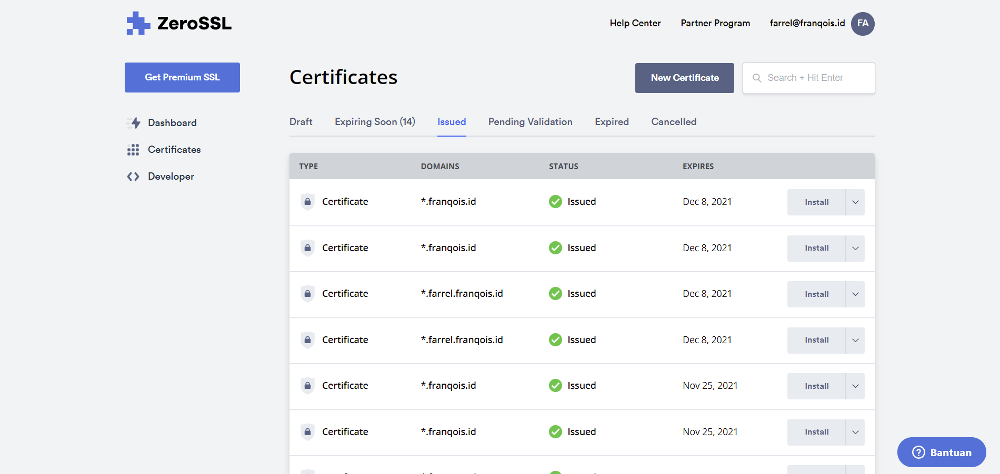

## Pembuka
Artikel kali ini akan membahas tentang Cara memasang ZeroSSL + Renew secara Otomatis di [Netlify](https://www.netlify.com) dan [BunnyCDN](https://afiliasi.farrel.franqois.id/bunnycdn).

Blog ini telah menggunakan ZeroSSL sebagai Sertifikat TLS/SSL-nya dalam bentuk _Wildcard_. Gak percaya? Silahkan Anda lihat sendiri.

Kendala saat pemasangannya adalah tidak banyak penyedia yang mendukungnya, kebanyakan hanya mendukung Let's Encrypt saja.

Sehingga saya perlu menggunakan acme.sh untuk menerbitkan/memperbarui sertifikat TLS/SSL (mungkin seterusnya saya akan menyebutnya dengan "Sertifikat SSL"), lalu saya melakukan _Request_ ke Server API-nya Netlify dan BunnyCDN untuk memasangkan sertifikat SSL-nya menggunakan cURL.

Terlihat sederhana, bukan? Tapi, sebenarnya itu tidak sesederhana dan semudah yang Anda bayangkan.

Berkat bantuan dari beberapa referensi, akhirnya saya dapat memasangkan sertifikat tersebut dan membuatnya dapat diperbarui secara otomatis.

Nah, makanya saya buat artikel ini, siapa tahu mungkin Anda tertarik atau merasa tertantang untuk memasang sertifikat SSL dari ZeroSSL ini ke dalam Web/Blog Anda bila dibandingkan dengan Let's Encrypt. Semoga artikel ini akan bermanfaat buat Anda 🙂

Di sini, Anda akan mempelajari untuk menerbitkan sertifikat SSL yang bisa Anda dapatkan dari ZeroSSL, baik jangkauannya untuk 1 Domain, Banyak Domain atau Subdomain, atau _Wildcard_ dengan menggunakan acme.sh sebagai perkakasnya, setelah itu Anda akan memasangkannya dengan cara memanggil Server API milik Bunny.net dan Netlify memakai cURL.

Bagi yang belum tahu, [ZeroSSL](https://zerossl.com) adalah salah satu CA (_Certificate Authority_) atau PSrE (Penyelenggara Sertifikat/Penyelenggara Sertifikat Elektronik) yang menerbitkan/mengelola/mencabut Sertifikat SSL untuk Internet. Ia merupakan salah satu produk dari [apilayer](https://apilayer.com/).

Sedangkan [acme.sh](https://acme.sh) adalah sebuah perkakas klien untuk Protokol ACME, yang bertujuan sebagai alat bantu untuk menerbitkan/memperbarui/mencabut atau mengelola Sertifikat SSL. Perkakas tersebut dibuat dengan menggunakan _Shell_ dan Kompatibel di hampir semua Sistem Operasi yang berbasis \*nix.

### Tunggu, ZeroSSL Gratis? Bukannya bayar? {#zerossl-gratis}
Iya, untuk saat ini ZeroSSL memanglah gratis, bahkan Anda juga dapat menerbitkan Sertifikat SSL _Wildcard-nya_ secara gratis dengan jumlah yang tidak terbatas, dengan kunci RSA maupun ECC.

Tapi, itu hanya berlaku jika Anda menerbitkannya melalui Server ACME-nya, bukan melalui Situs Web ataupun REST API-nya. Semua sertifikat yang diterbitkan dengan Protokol ACME akan memiliki masa berlaku selama 90 hari kedepan.

Serta, jika Anda membuat/menerbitkan sebuah Sertifikat SSL menggunakan Protokol ACME dan Server ACME-nya, maka kuota yang ada di Situs Web tidak akan bertambah sama sekali.

Infonya dari mana? Salah satu infonya berasal dari [dokumentasinya](https://zerossl.com/documentation/acme/).

~~Tapi, sebetulnya jika kamu lebih teliti lagi, di Halaman "[Pricing](https://zerossl.com/pricing/)"-nya pun kamu akan menemukan tulisan "90-Day ACME Certs" yang bersebelahan dengan Simbol "tidak terbatas", yang artinya kamu dapat menerbitkan Sertifikat SSL dari Server ACME-nya dalam bentuk apapun secara gratis tanpa batasan jumlah.~~

**PEMBARUAN, 16 Oktober 2021:** Simbol tersebut sekarang sudah tidak ada lagi di halaman tersebut, mungkin tujuannya memang untuk _marketing_ biar ZeroSSL tidak dianggap gratis.


Nah, sekarang sudah paham, kan? Jadi, Anda tidak perlu jadi orang kaya atau berduit banyak dulu biar bisa menerbitkan sertifikat SSL dari ZeroSSL, kecuali jika Anda ingin Layanan Dukungan, Akses REST API-nya, serta sertifikat SSL dengan masa berlaku selama 1 Tahun, Anda bisa berlangganan yang berbayar.

### Kenapa ZeroSSL? Dan, kenapa gak pakai Let's Encrypt aja? {#zerossl-vs-lets-encrypt}
#### Kompatibilitas Perangkat
Sertifikat SSL dari ZeroSSL bergantung pada Sectigo (sebelumnya dikenal sebagai "COMODO CA"/"COMODO" saja) sebagai Sertifikat Akar dari Rantai Sertifikat (yang bisa disebut dengan "Rantai Kepercayaan", bahasa Inggrisnya: _Chain of Trust_), yang telah didukung dan dipercaya oleh mayoritas perangkat lunak sejak lama. 

Informasi mengenai sertifikat akarnya sebagai berikut:

- Akar untuk Rantai (_Chain of Trust_) Pertama: "[AAA Certificate Services](https://search.censys.io/certificates/d7a7a0fb5d7e2731d771e9484ebcdef71d5f0c3e0a2948782bc83ee0ea699ef4)" yang masa berlakunya sampai 31 Desember 2028 pukul 23:59:59 atau 01 Januari 2029 dalam waktu UTC

- Akar untuk Rantai (_Chain of Trust_) Kedua: "[USERTrust RSA Certification Authority](https://search.censys.io/certificates/e793c9b02fd8aa13e21c31228accb08119643b749c898964b1746d46c3d4cbd2)" atau "[USERTrust ECC Certification Authority](https://search.censys.io/certificates/4ff460d54b9c86dabfbcfc5712e0400d2bed3fbc4d4fbdaa86e06adcd2a9ad7a)" yang masing-masing masa berlakunya sampai 18 Januari 2038 pukul 23:59:59 atau 19 Januari 2038 dalam waktu UTC

Ini artinya, hampir semua perangkat lunak bisa menggunakan sertifikat ini, bahkan oleh perangkat lunak versi lama sekalipun (cth. Internet Explorer 6.0+, Mozilla Firefox 1.0+, Opera 6.1+, AOL 5+, Peramban pada Blackberry 4.3.0+, Android 1.5+, dll)

Untuk lebih lanjut, Anda bisa kunjungi halaman [daftar kompatibilitasnya](https://help.zerossl.com/hc/en-us/articles/360058294074-ZeroSSL-Compatibility-List).

Sedangkan Akar dari _Chain of Trust-nya_ Let's Encrypt adalah "[DST Root CA X3](https://search.censys.io/certificates/0687260331a72403d909f105e69bcf0d32e1bd2493ffc6d9206d11bcd6770739)" (dari "IdenTrust") yang juga mendukung dan dipercaya oleh mayoritas perangkat lunak, termasuk Windows XP SP3 dan Android 7.1.1 kebawah.

Namun, sebelumnya sempat ada ["kegundahan"](https://letsencrypt.org/2020/11/06/own-two-feet.html) karena Akar yang mereka gunakan sudah mau habis masa berlakunya, akar tersebut akan habis pada tanggal 30 September 2021 dan akan digantikan dengan yang baru, yakni "[ISRG Root X1](https://search.censys.io/certificates/96bcec06264976f37460779acf28c5a7cfe8a3c0aae11a8ffcee05c0bddf08c6)" (dari "Internet Security Research Group"), sehingga ini berimbas pada perangkat lama, terutama untuk Android 7.1.1 kebawah.

Tapi, masalah ini [selesai](https://letsencrypt.org/2020/12/21/extending-android-compatibility.html) untuk Android dengan melakukan _Cross-Signing_, yang artinya sertifikat akar yang lama (DST Root CA X3) telah menerbitkan sertifikat yang 'sama dengan' sertifikat akar barunya, yakni "[ISRG Root X1](https://search.censys.io/certificates/6d99fb265eb1c5b3744765fcbc648f3cd8e1bffafdc4c2f99b9d47cf7ff1c24f)" sebagai sertifikat penengah, agar 'rantai' dapat terus digunakan meski ada bagian yang rapuh karena sudah habis masanya.


Hal ini bukan berarti masalah sudah selesai sepenuhnya, kemungkinan besar bahwa ada perangkat lain yang tidak kompatibel dengan Akar baru ini setelah Akar pertama habis masa berlakunya, kecuali Windows XP SP3 (jika Anda memperbarui sertifikat akarnya) dan Android 2.3.6 (atau di atasnya).

Berdasarkan Halaman [Kompatibilitas sertifikatnya](https://letsencrypt.org/docs/certificate-compatibility/), sepertinya perangkat yang mempercayai "ISRG Root X1" itu berkurang bila dibandingkan dengan perangkat yang mempercayai "DST Root CA X3". Sehingga, ada kemungkinan bahwa banyak perangkat lain yang tidak kompatibel dengan Let's Encrypt.


Per tanggal 30 September 2021 kemarin, sertifikat akar "DST Root CA X3" telah habis masa berlakunya dan telah diganti menjadi "ISRG Root X1".

Meski masa berlakunya habis, Let's Encrypt tetap kompatibel dengan Sistem Operasi Android 7.1.1 ke bawah, tapi masih menggunakan "DST Root CA X3" sebagai akarnya (lihat cuplikan layar di atas).

Jadi, jika Anda menggunakan Android 7.1.1 ke bawah, maka Anda tidak perlu melakukan apapun.

Namun jika Anda tidak menggunakan Android, tidak bisa mengakses Web/Blog yang menggunakan Let's Encrypt atau sekadar ingin menikmati akar baru dari Let's Encrypt, silahkan unduh sertifikat akar "[ISRG Root X1](https://letsencrypt.org/certs/isrgrootx1.pem)", lalu instal sertifikat akar tersebut agar dapat dipercaya oleh perangkat Anda.

Setelah selesai menginstal, nonaktifkan/hapus sertifikat akar lama, yakni "DST Root CA X3" dari perangkat Anda.

Selain mengunduh dan menginstal sertifikat akarnya secara manual, Anda juga dapat memperbarui sistem pada perangkat Anda agar dapat menikmati sertifikat akar yang baru.


Jadi, jika Anda ingin sebuah Sertifikat SSL Gratis untuk Web/Blog atau Aplikasi Anda serta dapat diakses oleh hampir semua orang atau/dan Anda kurang yakin dengan resolusi dari pihak Let's Encrypt, mungkin ZeroSSL bisa menjadi pilihan yang terbaik untuk Anda.

#### Tidak (atau Belum?) menerapkan _Rate Limit_ {#tidak-menerapkan-rate-limit}
Sampai artikel ini diterbitkan, ZeroSSL tidak (atau Belum?) menerapkan _Rate Limit_ atau batasan penerbitan sertifikat SSL, tidak seperti Let's Encrypt yang telah menerapkannya.

Gak percaya? Silahkan Anda kunjungi [halaman komparasinya](https://zerossl.com/letsencrypt-alternative/#acme) (Baca bagian "ACME"-nya) atau [halaman dokumentasinya](https://zerossl.com/documentation/acme/).

Jadi, Anda tidak perlu takut jika Anda mengalami kegagalan menerbitkan sertifikat SSL dengan alasan apapun, karena _Rate Limit_ tidak ditentukan di sana.

#### Memiliki antarmuka untuk mengelola sertifikat {#antarmuka-pengelola-sertifikat}
ZeroSSL memiliki antarmuka untuk mengelola sertifikat SSL di dalam Situs Web-nya. Di sana, Anda bisa melihat sertifikat SSL yang telah Anda terbitkan, sekaligus mengelola sertifikatnya.

 

Selain itu, Anda bisa menghabiskan kuota "SSL Gratis" yang telah diberikan oleh mereka dengan membuat sertifikat SSL dari Situs Web-nya.

Tapi sayangnya, Anda tidak bisa mencabut sertifikat SSL yang telah Anda terbitkan melalui server ACME-nya di dalam Situs Web-nya, jadi Anda hanya bisa melihat dan mengunduhnya saja.

### Persiapan {#persiapan}
Di artikel ini, Anda akan mempelajari menerbitkan Sertifikat SSL dengan menggunakan [acme.sh](https://acme.sh) yang (harusnya) hanya kompatibel dengan Sistem Operasi berbasis \*nix/mirip Unix, termasuk tapi tidak terbatas pada GNU/Linux, macOS, BSD dan Android.

Anda harus mempersiapkannya agar perkakas acme.sh bisa digunakan dan agar Anda bisa mengikuti artikel ini secara keseluruhan, apalagi jika Anda menggunakan Sistem Operasi Windows.

Berikut di bawah ini adalah persiapannya:

#### Untuk Pengguna GNU/Linux, macOS, BSD dan Sistem Operasi berbasis \*nix lainnya {#persiapan-pengguna-unix-like}

Jika terlalu panjang, maka perangkat lunak yang harus Anda siapkan adalah sebagai berikut:
- OpenSSL (atau LibreSSL?)
- cURL
- Cron
- _Shell_ yang disarankan: _Shell_ seperti GNU Bash (`bash`), Z Shell (`zsh`), atau Bourne-shell (`sh`). Penggunaan `fish` belum bisa saya sarankan, selain sangat berbeda, mungkin hasilnya tidak sesuai ekspektasi, terutama jika Anda menggunakan Netlify

Socat (Socket Cat) di sini bersifat Opsional jika Anda ingin menjalankan acme.sh dalam "Standalone Mode", tidak wajib Anda instal dan artikel ini tidak membahasnya lebih lanjut.


Sistem Operasi berbasis Unix/Mirip-Unix (\*nix) seperti GNU/Linux, macOS, dan BSD, sebetulnya tidak usah ditanya, mereka sudah pasti kompatibel dengan acme.sh karena perkakas tersebut memang dirancang untuk \*nix.

Asal punya OpenSSL (atau LibreSSL?), cURL dan Cron, maka acme.sh dapat dijalankan sebagaimana mestinya, serta Anda dapat mengikuti Artikel ini secara keseluruhan. Wget juga bisa Anda gunakan, tapi di artikel ini saya bahas Wget hanya untuk mengunduh dan menginstal acme.sh saja.

Untuk _Shell-nya_, saya sarankan agar Anda gunakan _Shell_ seperti GNU Bash (`bash`), Z Shell (`zsh`) atau Bourne-shell (`sh`).

Saya belum menyarankan penggunaan `fish` sebagai _Shell_, terutama jika Anda menggunakan Netlify. Kenapa? Selain sangat berbeda, hasilnya mungkin akan tidak sesuai dengan ekspektasi Anda, terutama jika Anda memasukkan isi berkas sertifikat yang akan dikirimkan ke Netlify ke dalam variabel atau mungkin saya belum mempelajarinya lebih lanjut.

Saya tetap membahas cara memasukkan variabel di dalam _Shell_ `fish` jika Anda tetap ingin menggunakannya, tapi saya gak membahasnya lebih lanjut sampai memasukkan isi berkas sertifikat ke dalam variabel, terutama untuk Netlify.

Anda juga dapat menginstal Socat (Socket Cat) agar acme.sh dapat dijalankan dalam "Standalone Mode", tapi itu tidak saya bahas lebih lanjut di sini.

#### Untuk Pengguna Windows {#persiapan-pengguna-windows}

Jika terlalu panjang, maka hal-hal yang harus Anda siapkan adalah sebagai berikut:
- Memiliki Akses ke Lingkungan Unix/Mirip-Unix: (Pilih salah satu caranya)
    - Mengaktifkan fitur [WSL (Windows Subsystem for Linux)](https://docs.microsoft.com/en-us/windows/wsl/install-win10) untuk Windows 10 atau di atasnya
    - Menggunakan Perangkat Lunak yang dapat mengemulasikan lingkungan UNIX, seperti Git Bash, Cygwin, dll, namun opsi ini belum saya coba
    - Mesin Virtual atau Kontainer dengan Sistem Operasi berbasis Unix/Mirip-Unix (disarankan GNU/Linux)
    - Mengakses Server Anda yang menggunakan Sistem Operasi \*nix dengan menggunakan Klien SSH
- Persiapan Perangkat Lunak pada WSL, Mesin Virtual/Kontainer atau pada Server bisa mengikuti [persiapan untuk Sistem Operasi \*nix](#persiapan-pengguna-unix-like)


Jika Anda menggunakan Windows, maka Anda perlu untuk mengakses Lingkungan Unix/Mirip-Unix (\*nix), Anda bisa gunakan cara apapun untuk melakukannya.

Jika Anda menggunakan Windows 10 (atau di atasnya), maka Anda bisa gunakan fitur [WSL (Windows Subsystem for Linux)](https://docs.microsoft.com/en-us/windows/wsl/install-win10) agar Anda bisa menggunakan Sistem Operasi GNU/Linux di dalam Windows.

Jika Anda tidak ingin/tidak bisa menggunakan WSL, maka Anda juga bisa menggunakan perangkat lunak yang dapat mengemulasikan lingkungan UNIX, seperti Git Bash, Cygwin, dan lainnya, namun itu belum saya coba. 

Atau, memiliki Mesin Virtual/Kontainer dan Instal, lalu gunakan Sistem Operasi berbasis Unix/Mirip-Unix (seperti GNU/Linux) di dalam Mesin tersebut.

Selain itu, Anda juga bisa akses Server Anda yang menggunakan Sistem Operasi \*nix untuk mengikuti artikel ini dengan menggunakan Klien SSH tanpa perlu mengorbankan kinerja pada Komputer/Laptop Anda.

Ketika Anda sedang memakai WSL, Mesin Virtual/Kontainer atau Server, maka Anda bisa mengikuti persiapan perangkat lunak untuk Sistem Operasi \*nix. Jadi pastikan jika cURL, OpenSSL (atau LibreSSL?) dan Cron sudah ada di dalam Sistem WSL (Biasanya ada), di dalam Mesin Virtual/Kontainer atau di dalam Server Anda.

#### Untuk Pengguna Android (tidak perlu akses _root_) {#persiapan-pengguna-android}

Jika terlalu panjang, maka hal-hal yang harus Anda siapkan adalah sebagai berikut:
- Menggunakan Sistem Operasi Android versi 7.0 atau di atasnya, sebagai syarat untuk menggunakan Termux. Jika di bawah 7.0, maka Anda bisa gunakan [versi lamanya](https://archive.org/details/termux-repositories-legacy), tapi saya tidak bisa menjamin bahwa Anda akan bisa mengikuti artikel ini kedepannya, karena saya belum mengujinya, mungkin saja caranya akan berbeda dibandingkan dengan yang saya bahas di sini
- Terinstalnya Termux di dalam Perangkat Android Anda. Bisa Anda unduh di [F-Droid resminya](https://f-droid.org/repository/browse/?fdid=com.termux), jangan unduh di [Google Play Store](https://play.google.com/store/apps/details?id=com.termux)! (Alasannya [di sini](https://wiki.termux.com/wiki/Termux_Google_Play))
- Persiapan yang harus Anda lakukan pada Termux setelah di-instal adalah sebagai berikut:
    1. Buka Termux-nya
    2. Perbarui semua Paket yang ada di Termux dengan perintah: `pkg up`
    3. Instal semua keperluannya dengan perintah: `pkg i -y curl wget openssl-tool cronie termux-services`, lalu mulai ulang Termux jika berhasil
    4. Aktifkan Layanan (_Service_) Cron di Latar Belakang dengan Perintah: `sv-enable crond`
    5. Atau, jika Anda memiliki komputer/laptop dan Ponsel Pintar berbasis Android yang terkoneksi jaringan yang sama, maka sebaiknya kamu instal `openssh` (atau sejenisnya) di dalam Termux, lalu kamu lakukan semua itu secara remot dari komputer/laptop kamu melalui Klien SSH. Caranya Anda bisa baca [artikel ini](/cara-menggunakan-termux-dari-komputer/)

**Catatan:** Semua hal di atas bisa Anda lakukan tanpa perlu akses _root_ sedikitpun dan perangkat tidak perlu dalam keadaan _ter-root_.


Jika Anda menggunakan Android, maka Anda bisa gunakan Termux untuk itu, selalu gunakan versi terbaru untuk pengalaman yang lebih nyaman dan lebih baik. Sebelum mengunduh, pastikan bahwa Android yang Anda gunakan sudah versi 7.0 atau di atasnya, sebagai syarat untuk menggunakan Termux.

Tapi jika versi Android Anda berada di bawah 7.0 (terutama versi 5 atau 6), maka Anda bisa gunakan [versi lamanya](https://archive.org/details/termux-repositories-legacy), namun saya tidak bisa menjamin bahwa Anda akan bisa mengikuti artikel ini kedepan karena versi pustaka yang digunakan masih lama dan saya belum mengujinya, jadi mungkin caranya akan berbeda dibandingkan dengan yang akan saya bahas di sini.

Setelah itu, pastikan Termux tidak diunduh melalui [Google Play Store](https://play.google.com/store/apps/details?id=com.termux), melainkan melalui [F-Droid](https://f-droid.org/repository/browse/?fdid=com.termux).

Kenapa? Karena Termux sudah tidak lagi diperbarui di Google Play Store sejak 02 November 2020 yang lalu, untuk alasannya silahkan Anda baca [di sini](https://wiki.termux.com/wiki/Termux_Google_Play).

Ketika Anda sedang menggunakan Termux, maka Anda bisa mengikuti persiapan perangkat lunak untuk Sistem Operasi berbasis \*nix. Jadi pastikan jika cURL, OpenSSL, dan Cron sudah ada di dalam Termux Anda.

Tapi sayangnya, di dalam Termux belum terinstal OpenSSL dan Cron secara bawaan. Jadi setelah Anda Instal Termux, maka hal yang perlu Anda lakukan adalah perbarui semua paket-paket yang ada, lalu instal semua paket yang diperlukan dengan perintah berikut:

```bash
pkg up -y; pkg i -y curl wget openssl-tool cronie termux-services
```

Kalau perlu, ganti _Repository_ pada Termux dengan perintah `termux-change-repo` dan gunakan _Repository_ Resmi dari Termux terlebih dahulu agar mendapatkan versi terbaru, barulah Anda eksekusikan perintah di atas. 

Setelah itu, mulai ulang Termux Anda dengan eksekusi perintah `exit`, lalu buka lagi Termux-nya agar perubahannya bisa diterapkan. Setelah Termux dibuka lagi, aktifkan Cron dari latar belakang dengan meng-eksekusi perintah `sv-enable crond`.

Jika Anda memiliki komputer/laptop dan Ponsel Pintar berbasis Android yang terkoneksi jaringan yang sama, maka sebaiknya kamu instal `openssh` (atau sejenisnya) di dalam Termux, lalu kamu lakukan semua itu secara remot dari komputer/laptop kamu melalui Klien SSH, sehingga tidak perlu melakukan pemindahan lagi ke dalam Android.

Anda bisa baca [artikel ini](/cara-menggunakan-termux-dari-komputer/) untuk mengetahui caranya.

Semua hal di atas bisa Anda lakukan tanpa perlu akses _root_ sedikitpun dan perangkat tidak perlu dalam keadaan _ter-root_, ini sama sekali tidak menghilangkan garansi pada perangkat Anda, jadi tidak usah khawatir.

### Catatan, Peringatan dan Sanggahan
Sebelum Anda lanjut, saya peringati bahwa Artikel/Tutorial yang dibahas ini sangatlah "Panjang x Lebar", jika Anda tidak sanggup membaca Artikel yang terlalu panjang, maka saya sarankan cari Artikel lain yang membahas ini secara sederhana, jangan paksakan diri Anda kecuali jika Anda ingin belajar.

Meskipun artikel ini Panjang x Lebar, saya usahakan agar semuanya saya bahas dalam langkah-demi-langkah, sehingga lebih mudah dipahami oleh Anda.

Oleh karena itu, saya sarankan Anda gunakan perangkat dengan layar yang lebih besar ketimbang layar dari Ponsel Anda yang sekarang (cth. PC/Laptop, Monitor, Tablet/Televisi Pintar, Desktop Mode pada Ponsel/Tablet Pintar, dll) dan memiliki sebuah Papan ketik (_Keyboard_) untuk mengikuti artikel ini.

Jika Anda mengalami kesulitan dalam bernavigasi, silahkan Anda gunakan tombol <key>CTRL</key>+<key>F</key>, lalu isi dengan bagian atau teks yang ingin Anda cari.

Saya usahakan agar pembahasan di artikel ini bisa diterapkan/diikuti oleh hampir semua pengguna Sistem Operasi, termasuk tapi tidak terbatas pada Sistem Operasi Windows dan hampir semua Sistem Operasi berbasis \*nix, seperti Sistem Operasi yang berbasis Linux (cth. GNU/Linux, Android, Alpine Linux, Void Linux, dll), macOS, BSD, dan Sistem Operasi \*nix lainnya.

Namun, bukan berarti Anda bisa mengikuti semuanya meskipun saya berusaha agar ini bisa diikuti oleh hampir semua Sistem Operasi, karena saya belum mencoba di Sistem Operasi selain GNU/Linux, Windows dan Android, sehingga saya tidak berani menjaminnya.

Jadi, mohon perhatian dan pengertiannya, jika Anda melanjutkan berarti Anda sudah memahaminya.

Terima kasih dan selamat melanjutkan 😊

## Sebelum menerbitkan Sertifikat SSL
Sebelum menerbitkannya, Anda perlu mengikuti beberapa poin pembahasan terlebih dahulu. Poin-poin akan saya bahas dalam langkah-demi-langkah.

Jadi, harap Anda jangan melewati satu langkahpun, kecuali jika ada catatan yang mengizinkannya.

Atau, Anda juga bisa lewati bagian ini jika Anda sudah pernah mendaftarkan akun ZeroSSL, meng-install dan konfigurasi acme.sh, serta melakukan pengaitan akun ZeroSSL dengan acme.sh sebelumnya.

### Membuat Akun ZeroSSL dan mendapatkan Kredensial EAB-nya {#membuat-akun-zerossl}

Jika Anda belum mempunyai akunnya dan ingin menggunakan acme.sh tanpa harus mendaftarkan akun ZeroSSL-nya, lewati ini dan langsung [lanjut saja](#install-acme-sh).

Tapi saya tetap sarankan agar Anda tidak melewati langkah ini.


Sebelum Anda menerbitkan sertifikat SSL-nya, maka Anda disarankan untuk mendaftar akun ZeroSSL terlebih dahulu melalui [Situs Webnya](https://zerossl.com).

Setelah mendaftar, Anda tidak perlu membuat/menerbitkan sertifikatnya di sana, melainkan Anda hanya perlu Kredensial EAB (_External Account Binding_) yakni **EAB KID** dan **EAB HMAC Key**-nya saja.

Kredensial EAB adalah sebuah kredensial untuk menghubungkan antara perkakas/perangkat lunak yang merupakan klien untuk protokol ACME dengan akun CA/PSrE yang telah Anda daftarkan.

Tanpa basa-basi lagi, langkah-langkahnya sebagai berikut:

0. Daftar Akun ZeroSSL-nya [di Situs Web-nya](https://app.zerossl.com/signup) dan Login setelah itu (Atau, Anda hanya perlu [Login](https://app.zerossl.com/login) saja jika Anda sudah pernah mendaftar akun sebelumnya)
1. Pada Dasbor ZeroSSL, klik **Developer**
2. Setelah itu, pada bagian **EAB Credentials for ACME Clients**, klik _Button_ **Generate**
3. Simpan **EAB KID** dan **EAB HMAC Key** yang telah dihasilkan itu dengan baik, nanti akan digunakan lagi untuk acme.sh
4. Setelah menyimpannya, Anda tinggal klik _Button_ **Done** dan Selesai

Jika Anda tidak memahami langkah-langkah di atas, maka Anda dapat melihat Cuplikan Layar berikut yang cukup menyesuaikan dengan langkah-langkah di atas: (Silahkan perbesar gambarnya dengan mengkliknya)

 

Setelah Kredensial EAB dibuat, ya sudah lanjut saja ke langkah berikutnya, yakni Instal acme.sh, Anda sama sekali tidak perlu menerbitkan Sertifikat SSL-nya di sana.

### Instal acme.sh {#install-acme-sh}
Setelah mendaftar akun ZeroSSL, salah satu hal yang perlu Anda lakukan adalah menginstal acme.sh terlebih dahulu di dalam Sistem Operasi Anda.

Tidak perlu menggunakan Akun Administrator atau `root` untuk meng-instalnya, atau tidak perlu dieksekusikan melalui perintah `sudo` layaknya Certbot, cukup gunakan saja akun Anda, seperti biasanya. (Bahkan, lebih baik gini)

Cara menginstalnya adalah dengan mengeksekusikan salah satu perintah berikut:

Dengan cURL:

```shell
curl https://get.acme.sh | sh -s email=aku@contoh.com
```

Atau, dengan GNU Wget:

```shell
wget -O -  https://get.acme.sh | sh -s email=aku@contoh.com
```

Ganti `aku@contoh.com` dengan Alamat Surel Anda, jangan lupa dimasukkan. Tapi, jika Anda lupa memasukkan/tidak atau salah memasukkan alamat surel saat meng-instalnya, maka Anda dapat eksekusi perintah di bawah ini setelah terinstal:

```shell
cp "$HOME"/.acme.sh/account.conf "$HOME"/.acme.sh/account.conf.1 ## Backup dulu
sed -i '/ACCOUNT\_EMAIL\=/d' "$HOME"/.acme.sh/account.conf ## Hapus Variabel `ACCOUNT_EMAIL` yang sudah ada
printf "ACCOUNT_EMAIL='%s'\n" "aku@contoh.com" >> "$HOME"/.acme.sh/account.conf
```

Ganti `aku@contoh.com` dengan Alamat Surel Anda.

Setelah selesai instal, pastikan bahwa acme.sh dapat dieksekusi dengan baik dengan mengetikkan `acme.sh --version` di dalam Terminal, lalu tekan tombol "<key>Enter</key>".

Jika dapat dieksekusi dengan baik, maka akan tampil versi dari acme.sh dan selamat Anda telah menginstalnya dengan benar.

Jika tidak, gunakan perintah `source` untuk memperbarui _Shell_ (cth. `source "$HOME"/.bashrc` atau `. "$HOME"/.bashrc`), kalau masih tidak bisa juga, maka Anda perlu memasukkan direktori acme.sh kedalam variabel `PATH` dengan menambahkan teks berikut di bawah ini ke dalam berkas konfigurasi _Shell_ yang nantinya akan digunakan ketika Anda menjalankan sebuah _Shell_ secara interaktif (cth. `~/.bashrc` untuk pengguna GNU Bash, `~/.zshrc` untuk pengguna Zsh atau `~/.config/fish/config.fish` untuk pengguna fish).

Berikut adalah teksnya:

```shell
PATH="$HOME/.acme.sh:$PATH" && export PATH
LE_WORKING_DIR="$HOME/.acme.sh" && export LE_WORKING_DIR
```

Atau, berikut di bawah ini jika Anda menggunakan `fish` sebagai _Shell_:

```shell
fish_add_path "$HOME"/.acme.sh
set -xU LE_WORKING_DIR "$HOME"/.acme.sh
```

Atau di bawah ini jika Anda menggunakan `fish` dengan versi di bawah 3.2.0:

```shell
set -Ua fish_user_paths "$HOME"/.acme.sh
set -xU LE_WORKING_DIR "$HOME"/.acme.sh
```

Setelah selesai menambahkannya, simpanlah berkas tersebut dari Editor Teks favorit Anda dan perbarui _Shell-nya_ dengan menggunakan perintah `source`, lalu coba eksekusikan perkakas acme.sh-nya.

### Verifikasi DNS di acme.sh
Agar Sertifikat SSL dapat diterbitkan melalui Protokol ACME, maka pengguna diperlukan melakukan verifikasi. Salah satunya adalah dengan verifikasi DNS.

Verifikasi DNS merupakan sebuah metode yang menggunakan pengaturan DNS Otoritatif pada Domain untuk memverifikasi Kepemilikan Domain sebelum sertifikat SSL diterbitkan/diperbarui.

Verifikasi seperti ini tidak memerlukan keberadaan _Web Server_ atau tidak perlu mengakses konten apapun (cth. Mengakses `http://domain.com/.well-known/.acme-challenge-xxxxxxxxxxxx`) untuk itu, sehingga Anda bisa menerbitkannya di mana saja dan di perangkat apa saja (termasuk Ponsel Pintar, Komputer PC, Laptop, dll), tanpa harus mempunyai/menyewa sebuah Server/Perangkat terlebih dahulu.

Ini juga sebagai syarat agar Anda dapat menerbitkan sertifikat SSL untuk semua Subdomain Anda (_Wildcard SSL_) dengan mudah.

Selain itu, karena Anda ingin memasang sertifikat SSL di Penyedia Web yang sedang saya bahas di artikel ini, yakni Netlify dan BunnyCDN, serta Anda melakukannya di dalam perangkat seperti Komputer PC, Laptop, Ponsel Pintar Anda atau perangkat lain yang Anda miliki, maka metode verifikasi seperti ini wajib Anda pelajari.

Namun, agar perkakas acme.sh dapat melakukan verifikasi DNS secara otomatis saat menerbitkan dan memperbarui sertifikat SSL-nya, maka acme.sh harus dapat mengakses dan merubah _DNS Record_ di dalam Domain milik Anda dengan mengakses Akun Penyedia DNS Otoritatif milik Anda.

Untuk itu, Anda perlu berikan sebuah izin untuk membaca dan merubah _DNS Record-nya_ dengan memberinya sebuah kredensial milik Anda, seperti: _Token_, Kunci API atau bahkan Nama Pengguna dan Kata Sandi.

**Kalau saya gak mau gimana?** Bisa saja Anda melakukannya secara Manual, sehingga Anda menambahkan _DNS Record-nya_ secara manual juga.

Tapi sertifikat SSL tersebut memiliki masa berlaku selama 90 hari, sehingga harus diperbarui sebelum habis masanya (minimal 60 hari setelah sertifikat diterbitkan) dan saat pembaruan Anda harus masukkan lagi _DNS Record-nya_ secara manual, sehingga tidak mungkin kamu bisa memperbarui sertifikat SSL tersebut secara otomatis.

Pertanyaannya, apa kamu gak capek kayak gitu terus? Ya terserah kamu, sih. Kalo saya jadi kamu, mending saya pake metode yang Otomatis saja ketimbang pake yang Manual.

#### Untuk Pengguna DNS Otoritatif Cloudflare {#untuk-pengguna-cloudflare}
Jika Anda menggunakan Cloudflare sebagai DNS Otoritatif untuk Domain Anda, Anda tinggal buat sebuah **API Token** (`CF_Token`) dan dapatkan **Account ID** (`CF_Account_ID`)-nya untuk kredensialnya.

Jika berkenan, Anda juga bisa mendapatkan **Zone ID** (`CF_Zone_ID`)-nya agar acme.sh hanya menargetkan ke 1 Domain Utama saja secara spesifik, tapi ini tidak wajib, jadi sebaiknya tidak usah.

Untuk membuat _API Token-nya_, silahkan Anda baca [dokumentasinya](https://developers.cloudflare.com/api/tokens/create), di sana sudah dijelaskan secara lengkap tentang bagaimana cara membuat _API Token-nya_.

Jika belum jelas, saya bahas saja caranya di sini. Caranya sebagai berikut:

0. Pastikan Anda sudah login terlebih dahulu menggunakan akun Cloudflare Anda dengan mengunjungi [Halaman Dasbornya](https://dash.cloudflare.com/login). Udah? Kalo gitu, Anda bisa lanjut
1. Jika Anda sudah sampai di halaman dasbornya: 
   - a. Klik pada Ikon Orang di pojok kanan atas
   - b. Lalu, klik **My Profile**
   - c. Setelah itu, klik pada tab **API Tokens**. 

    Atau sederhananya, silahkan [klik di sini](https://dash.cloudflare.com/profile/api-tokens)
2. Setelah Anda memasukki bagian **API Token**, klik pada _Button_ **Create Token**

    Kira-kira untuk no. 1 dan 2 cuplikannya akan seperti berikut:


3. Saat proses membuat Token, Anda akan memilih templat yang digunakan untuk membuat Tokennya. Maka dari itu, gunakan saja templat **Edit zone DNS** dengan mengklik _Button_ **Use this template** di sebelahnya (Seperti pada cuplikan berikut)


4. Setelah menentukan templatnya, nanti Anda akan diminta untuk melengkapi informasi yang ada di sana. Lengkapi informasi berikut ini:
   - **Token Name**: Itu merupakan nama Token yang ingin Anda buat. Secara baku, nama Token menggunakan nama templatnya, Anda bisa rubah itu sesuka Anda dengan mengklik pada ikon Pensil di sebelah namanya
   - **Permissions**: Itu merupakan perizinan untuk Token yang Anda buat nantinya, karena menggunakan templat **Edit zone DNS**, maka seharusnya Informasi tersebut sudah dilengkapi. Pastikan itu sudah diisi dengan **Zone**, **DNS** dan **Edit**, kalau sudah, Anda bisa lewati ini.
   - **Zone Resources**: Itu merupakan cakupan Zona (_Zone_) untuk Token ini. Jika Anda ingin Token yang Anda buat itu dapat mencakup semua Domain yang telah Anda tambahkan di Cloudflare, maka pastikan pilih: (salah satu)
       - **Include** dan **All zones**
       - **Include**, **All zones from an account**, lalu pilih Akun yang ingin Anda cakup
   - **Client IP Address Filtering**: Jika Anda ingin mengatur/menyaring Alamat IP Klien/Pengguna API, maka Anda bisa atur itu. Jika tidak, maka sebaiknya lewati saja.
   - **TTL**: Atur itu jika Anda ingin Token yang Anda buat memiliki masa berlaku, jika tidak maka sebaiknya lewati saja

5. Jika Anda sudah mengisi semua informasinya, klik pada _Button_ **Continue to summary**

    Kira-kira untuk no. 4 dan 5, cuplikannya akan menjadi seperti berikut:


6. Di sana Anda akan melihat kesimpulan dari Token yang ingin Anda buat, jika merasa yakin, silahkan klik pada _Button_ **Create Token** (Seperti pada cuplikan berikut)


7. Setelah itu, kodenya akan tampil di sana. Salinkan _API Token_ tersebut dengan mengklik pada _Button_ **Copy**, lalu simpan itu baik-baik karena kode tersebut tidak akan tampil lagi, serta pastikan bahwa tidak ada satupun orang lain yang mengetahuinya kecuali dengan seizin Anda. Selain itu, Anda juga dapat mengujinya di sana untuk memastikan apakah kode terebut bekerja atau tidak.


Nah, setelah _API Token_ dibuat, maka Anda harus mendapatkan _Account ID-nya_, kalau kamu perlu bisa dapatkan _Zone ID-nya_ juga.

Untuk mendapatkan kedua itu, Anda tinggal ke [Halaman Dasbor Cloudflare](https://dash.cloudflare.com), pilih Domainnya, lalu gulirkan kebawah, nanti akan ketemu Informasi mengenai _Account ID_ dan _Zone ID_, seperti di bawah ini:


Nah, setelah semuanya berhasil didapat, maka Anda tinggal masukkan saja semua Informasinya ke dalam variabel. Dengan cara berikut:

```shell
### Di bawah ini adalah Informasi yang wajib dimasukki
CF_Token="API_TOKEN_KAMU_DI_SINI" && export CF_Token
CF_Account_ID="ACCOUNT_ID_KAMU_DI_SINI" && export CF_Account_ID

### Anda juga dapat memasukkan "Zone ID" jika Anda ingin acme.sh menargetkan hanya
### untuk 1 Domain Utama saja secara spesifik, tapi ini bukanlah hal yang wajib, jadi sebaiknya tidak usah
CF_Zone_ID="ZONE_ID_KAMU_DI_SINI" && export CF_Zone_ID
```

Atau, dengan cara berikut:

```shell
### Di bawah ini adalah Informasi yang wajib dimasukki
export CF_Token="API_TOKEN_KAMU_DI_SINI"
export CF_Account_ID="ACCOUNT_ID_KAMU_DI_SINI"

### Anda juga dapat memasukkan "Zone ID" jika Anda ingin acme.sh menargetkan hanya
### untuk 1 Domain Utama saja secara spesifik, tapi ini bukanlah hal yang wajib, jadi sebaiknya tidak usah
export CF_Zone_ID="ZONE_ID_KAMU_DI_SINI"
```

Atau di bawah ini jika Anda menggunakan `fish` sebagai _Shell_:

```shell
set -x CF_Token "API_TOKEN_KAMU_DI_SINI"
set -x CF_Account_ID "ACCOUNT_ID_KAMU_DI_SINI"
set -x CF_Zone_ID "ZONE_ID_KAMU_DI_SINI"
```

Udah itu aja, jika Anda menggunakan Cloudflare dan sudah memasukkan Informasi-informasi di atas, maka Anda hanya perlu langsung melanjutkan ke [langkah berikutnya](#registrasi-akun-acme-sh) saja.

#### Untuk Pengguna Netlify DNS {#untuk-pengguna-netlify-dns}
Jika Anda menggunakan Netlify sebagai DNS Otoritatif untuk Domain Anda, Anda tinggal buat sebuah **Personal Access Token** (`NETLIFY_ACCESS_TOKEN`)-nya.

Ngomong-ngomong, selain bisa untuk Verifikasi DNS, _Token_ ini bisa Anda gunakan untuk memasang [sertifikat SSL-nya](#pasang-ssl-di-netlify) nanti. Jadi, setelah Anda membuatnya, simpanlah _Token_ tersebut dengan baik agar bisa digunakan nanti.

Cara membuatnya sebagai berikut:

0. Anda bisa langsung masuk [ke sini](https://app.netlify.com/user/applications), lakukan login terlebih dahulu jika diminta.
1. Klik pada _Button_ **New access token** di Bagian **Personal access tokens**


2. Masukkan Nama/Deskripsi mengenai Tokennya
3. Setelah itu, klik pada _Button_ **Generate** untuk menghasilkan **Access Token**-nya


4. Setelah **Access Token** tampil, simpan itu baik-baik, karena **Access Token** tersebut tidak bisa tampil lagi dan itu akan digunakan kembali, serta pastikan bahwa tidak ada orang lain yang mengetahuinya
5. Klik pada _Button_ **Done**"jika merasa sudah selesai


Jika Anda tidak memahami langkah-langkah di atas, maka Anda dapat melihat Cuplikan Layar berikut yang cukup menyesuaikan dengan langkah-langkah di atas: (Silahkan perbesar gambarnya dengan mengkliknya)

Nah, setelah berhasil didapat, maka Anda tinggal masukkan saja semua Informasinya ke dalam variabel. Dengan cara berikut:

```shell
NETLIFY_ACCESS_TOKEN="ACCESS_TOKEN_KAMU_DI_SINI" && export NETLIFY_ACCESS_TOKEN
```

Atau, dengan cara berikut:

```shell
export NETLIFY_ACCESS_TOKEN="ACCESS_TOKEN_KAMU_DI_SINI"
```

Atau di bawah ini jika Anda menggunakan `fish` sebagai _Shell_:

```shell
set -x NETLIFY_ACCESS_TOKEN "ACCESS_TOKEN_KAMU_DI_SINI"
```

Udah itu aja, jika Anda menggunakan Netlify dan sudah memasukkan Informasi-informasi di atas, maka Anda hanya perlu langsung melanjutkan ke [langkah berikutnya](#registrasi-akun-acme-sh) saja.

#### Untuk Pengguna DNS Otoritatif lain {#untuk-pengguna-dns-lain}
Jika Anda menggunakan Layanan DNS Otoritatif selain Cloudflare dan Netlify DNS, seperti Hurricane Electric Free DNS, Constellix, NS1, ClouDNS, Amazon Route 53, dll, maka Anda perlu membaca [halaman dokumentasinya](https://github.com/acmesh-official/acme.sh/wiki/dnsapi).

Karena setiap Penyedia DNS Otoritatif mempunyai cara yang berbeda-beda untuk mengaksesnya. Jadi, silahkan ikuti yang ada di dokumentasinya.

Jika sudah, silahkan lanjut ke [langkah berikutnya](#registrasi-akun-acme-sh).

### Registrasi Akun melalui acme.sh {#registrasi-akun-acme-sh}
Secara baku, acme.sh menggunakan ZeroSSL sebagai CA (_Certificate Authority_)-nya, jadi jika Anda adalah orang yang pertama kali menggunakan acme.sh, silahkan registrasikan akun ZeroSSL yang telah Anda buat terlebih dahulu ke Server ACME-nya menggunakan acme.sh dengan perintah berikut:

```shell
acme.sh --register-account --eab-kid EAB_KID_KAMU_DI_SINI --eab-hmac-key EAB_HMAC_KEY_KAMU_DI_SINI
```

Ganti `EAB_KID_KAMU_DI_SINI` dan `EAB_HMAC_KEY_KAMU_DI_SINI` dengan "EAB KID" dan "EAB HMAC Key" yang telah kamu simpan sebelumnya.

**Kalau saya belum daftar sama sekali gimana?** Jika Anda belum pernah daftar akun ZeroSSL sama sekali dan ingin menggunakan acme.sh tanpa harus mendaftarkan akun ZeroSSL dari Web, maka Anda dapat eksekusi perintah berikut:

```shell
acme.sh --register-account
```

Keluarannya akan seperti di bawah ini:

```plain
[Sel 10 Agu 2021 05:31:16  WIB] Create account key ok.
[Sel 10 Agu 2021 05:31:16  WIB] No EAB credentials found for ZeroSSL, let's get one
[Sel 10 Agu 2021 05:31:17  WIB] Registering account: https://acme.zerossl.com/v2/DV90
[Sel 10 Agu 2021 05:31:20  WIB] Registered
[Sel 10 Agu 2021 05:31:20  WIB] ACCOUNT_THUMBPRINT='f4qxxxxxxxxxxxxxxxxx_xxxxxxx-xxxxxxxxx_xxxx'
```

**Kalau saya gak peroleh Kredensial EAB-nya gimana? Apakah bisa memakai perintah di atas?** Sepengalaman saya dulu, bisa.


Dengan mengeksekusi perintah di atas (`acme.sh --register-account` saja), itu bukan berarti Anda telah mendaftarkan akun ZeroSSL yang kemudian bisa Anda gunakan untuk login ke dalam [Situs Web ZeroSSL-nya](https://app.zerossl.com/login).

Jika Anda ingin mengelola sertifikat tersebut di Web-nya, maka saya sarankan agar Anda membuat akunnya terlebih dahulu melalui Situs Web-nya, caranya bisa Anda baca di [langkah pertama](#membuat-akun-zerossl), lalu kaitkan Kredensial EAB-nya di acme.sh.


Anda bisa Simpan `ACCOUNT_THUMBPRINT`-nya dengan baik, barangkali suatu saat nanti Anda ingin menjalankan acme.sh dalam "[Stateless Mode](https://github.com/acmesh-official/acme.sh/wiki/Stateless-Mode)". Tapi, Anda bisa dapatkan itu kembali dengan mengeksekusi perintah `acme.sh --register-account`.

Setelah itu, kamu telah dapat menggunakan acme.sh seperti biasanya untuk menerbitkan/membuat dan memperbarui sertifikat SSL kamu.

## Menerbitkan Sertifikat SSL dengan acme.sh {#menerbitkan-sertifikat-ssl}
Nah, setelah mengikuti beberapa langkah, akhirnya Anda bisa sampai di sini, yakni menerbitkan Sertifikat SSL.

Ada beberapa cara untuk menerbitkannya menggunakan acme.sh, tidak perlu Anda ikuti semua dan sesuaikan dengan selera Anda, kecuali jika ada teks "Wajib dipelajari"-nya, bagian itu yang wajib Anda pelajari.

Berikut adalah cara-caranya:

### Menerbitkan Sertifikat SSL (Wajib dipelajari) {#issue-cert}
Jika Anda ingin menerbitkan sertifikat SSL dengan acme.sh (cth. hanya untuk 1 Domain dan 1 Subdomain), maka format perintahnya akan menjadi seperti berikut:

```shell
acme.sh --issue -d www.domain.com -d domain.com METODE_VERIFIKASI PARAMETER_TAMBAHAN
```

Perintah di atas akan menerbitkan Sertifikat SSL yang hanya menjangkau 1 Domain dan 1 Subdomain saja, yakni `www.domain.com` dan `domain.com`.

Parameter `-d` berfungsi untuk menentukan domain yang dijangkau oleh sertifikat SSL tersebut saat diterbitkan, isikan itu dengan Domain Anda.

Sebenarnya, Anda juga dapat menambahkan perameter `-d` agar Sertifikat SSL menjangkau setiap domain yang Anda masukkan, sebanyak yang Anda mau.

Domain Pertama yang Anda masukkan akan menjadi **Common Name**, **Subject** atau **Issued to** pada Sertifikat SSL, selain SAN (_Subject Alternative Name_), sedangkan domain kedua dan seterusnya hanya dimasukkan kedalam SAN saja.

Selain itu, nama direktori untuk Sertifikat SSL-nya sendiri akan ditentukan berdasarkan domain pertama yang Anda masukkan.

Contohnya seperti Cuplikan berikut di Windows:

 

Atau, di bawah ini untuk GNU/Linux: (Lebih tepatnya di Peramban Web berbasis Chromium/Google Chrome untuk GNU/Linux)

 

Jika Anda melihat cuplikan di atas, "Common Name" yang tampil adalah `farrel.franqois.id` bukan `*.farrel.franqois.id`, padahal Sertifikat yang saya terbitkan itu adalah Sertifikat SSL _Wildcard_, dan `*.farrel.franqois.id` malah cuma dimasukkan ke dalam SAN (_Subject Alternative Name_) saja bersamaan dengan Domain Pertamanya.

**Kenapa bisa begitu?** Sederhananya karena Domain Pertama yang saya masukkan ketika menerbitkan sebuah Sertifikat SSL adalah `farrel.franqois.id`, bukan `*.farrel.franqois.id`. Nah, sekarang sudah paham, kan?

Parameter `--issue` berfungsi agar acme.sh menerbitkan Sertifikat SSL Anda. Parameter selain `--issue` adalah sebagai berikut:
- `--renew` untuk memperbarui Sertifikat SSL yang ada
- `--revoke` untuk mencabut salah satu Sertifikat SSL yang ada di dalam perangkat Anda
- `--remove` untuk menghapus salah satu Sertifikat SSL dari perangkat Anda
- `--renew-all` untuk memperbarui semua Sertifikat SSL yang ada (**Catatan:** Anda tidak perlu menambahkan parameter `-d` jika menggunakan parameter ini)
- Dan lain-lainnya

#### Metode Verifikasi (`METODE_VERIFIKASI`)
Anda harus menggantikan `METODE_VERIFIKASI` di atas dengan parameter/argumen mengenai metode verifikasi yang ada, menjadi parameter berikut: (Setidaknya gunakan salah satu parameter)
- `--webroot lokasi_webroot` atau `-w lokasi_webroot` jika Anda ingin menggunakan metode _Webroot_. 

    Ganti `lokasi_webroot` dengan lokasi Web Anda, seperti `/var/www/html`, `/home/username/public_html`, atau apa aja yang penting itu menandakan lokasi Web Anda.

- `--dns nama_dns` jika Anda ingin menggunakan metode DNS. 

    Ganti `nama_dns` dengan yang ada di [halaman dokumentasinya](https://github.com/acmesh-official/acme.sh/wiki/dnsapi) dan sesuaikan dengan Penyedia DNS Otoritatif yang Anda gunakan. (Saya bahas ini di bagian terpisah)

- `--apache` jika Anda ingin menggunakan _Web Server_ Apache2 sebagai verifikasinya.
- `--nginx (lokasi_conf)` jika Anda ingin meggunakan _Web Server_ NGINX sebagai verifikasinya.

    Anda bisa ganti `(lokasi_conf)` dengan lokasi berkas konfigurasi untuk NGINX Anda jika diinginkan, barangkali acme.sh tidak bisa mendeteksi berkas konfigurasi NGINX secara otomatis, jika tidak maka cukup tulis `--nginx` saja.

- `--standalone` jika Anda tidak mempunyai Aplikasi _Web Server_ atau sedang tidak berada di dalam Server Web (cth. Sedang berada di dalam Server FTP atau SMTP).

Dengan adanya verifikasi seperti ini, artinya Anda tidak bisa sembarangan membuat Sertifikat SSL untuk domain lain. Berhasil atau Gagal akan menambahkan _Rate Limit_ jika Anda menggunakan CA seperti Let's Encrypt dan Buypass.

Jadi, berhati-hatilah ketika Anda ingin menerbitkan Sertifikat SSL dengan menggunakan Protokol ACME, terutama jika Anda menggunakan CA selain ZeroSSL.

#### Parameter Tambahan (`PARAMETER_TAMBAHAN`)
Anda bisa menggantikan `PARAMETER_TAMBAHAN` dengan parameter lain yang ingin Anda tambahkan saat menerbitkan Sertifikat SSL, parameter lainnya sebagai berikut:
- `--force` jika Anda ingin melakukannya dengan cara paksa.
- `--test` atau `--staging` jika Anda ingin menjalankannya dalam mode pengujian. Ini cocok bagi Anda yang sedang belajar menggunakan acme.sh atau menguji penerbitan Sertifikat SSL dengan metode verifikasi yang berbeda tanpa mempengaruhi _Rate Limit_ aslinya. 

    Jadi, saya sarankan agar Anda selalu gunakan parameter ini jika Anda sedang mempelajari penggunaan acme.sh atau memastikan apakah sertifikat SSL bisa diterbitkan dengan benar atau tidaknya tanpa mempengaruhi _Rate Limit_ dari suatu CA.

    Kalau sudah merasa yakin, Anda bisa terbitkan ulang Sertifikat SSL-nya untuk Produksi dengan menggunakan parameter `--issue --force`, tanpa parameter `--test` atau `--staging`.

- `--server opsi_ca` jika Anda ingin menerbitkan sertifikat SSL oleh CA lain, yang secara bawaan diterbitkan oleh ZeroSSL sebagai CA. 

    Ganti `opsi_ca` menjadi nama pendek dari CA yang mendukung, seperti: `zerossl`, `buypass`, `buypass_test`, `letsencrypt`, `letsencrypt_test`, `sslcom`.

    Atau, Anda juga bisa ganti `opsi_ca` dengan memasukkan Alamat URL Server ACME dari Penyedia CA Anda. Untuk selengkapnya, silahkan Anda pelajari dari [Halaman Wiki-nya](https://github.com/acmesh-official/acme.sh/wiki/Server).

- `--keylength opsi` atau `-k opsi` jika Anda ingin menerbitkan Sertifikat SSL dengan ukuran kunci atau kunci yang berbeda. Ganti `opsi` dengan `2048`, `3072`, `4096`, `8192`, `ec-256`, `ec-384`, atau `ec-512` (Saya bahas di bagian terpisah)
- `--cert-file file` untuk menyalinkan berkas Sertifikat ke dalam direktori lain setelah menerbitkan/memperbarui Sertifikat SSL-nya. Ganti `file` menjadi lokasi atau/dan nama berkas yang Anda inginkan.
- `--key-file file` untuk menyalinkan berkas Kunci ke dalam direktori lain setelah menerbitkan/memperbarui Sertifikat SSL-nya. Ganti `file` menjadi lokasi atau/dan nama berkas yang Anda inginkan.
- `--ca-file file` untuk menyalinkan berkas Sertifikat CA/Sertifikat Penengah ke dalam direktori lain setelah menerbitkan/memperbarui Sertifikat SSL-nya. Ganti `file` menjadi lokasi atau/dan nama berkas yang Anda inginkan.
- `--fullchain-file file` untuk menyalinkan berkas Sertifikat _Fullchain_ ke dalam direktori lain setelah menerbitkan/memperbarui Sertifikat SSL-nya. Ganti `file` menjadi lokasi atau/dan nama berkas yang Anda inginkan.
- `--reloadcmd perintah` untuk mengeksekusikan perintah untuk _me-reload_ Server setelah menerbitkan/memperbarui Sertifikat SSL-nya.
- `--ecc` agar perintah tersebut ditujukan untuk sertifikat SSL yang menggunakan kunci ECC/ECDSA.

    Tanpa parameter ini, maka perintah tersebut akan dieksekusi untuk sertifikat SSL yang berkunci RSA. Parameter ini hanya bisa digunakan jika ada parameter `--renew`, `--revoke`, `--remove`, `--install-cert`, `--to-pkcs12` dan `--create-csr` saja.

    Contoh penggunaannya di bawah ini: 
    - `acme.sh --remove -d www.domain.com --ecc` untuk menghapus salah satu sertifikat SSL yang berkunci ECC dari perangkat Anda
    - `acme.sh --revoke -d www.domain.com --ecc` untuk mencabut salah satu sertifikat SSL yang berkunci ECC
    - Dan masih banyak lagi!

    Jadi, Anda tidak bisa menggunakan parameter ini untuk menerbitkan sertifikat SSL, atau bisa dibilang bahwa Anda hanya bisa memakainya saat sertifikat SSL tersebut telah diterbitkan dengan menggunakan kunci ECC/ECDSA saja

Udah itu saja yang saya bahas, parameter lainnya masih banyak, tapi yang saya bahas adalah kasus umumnya saja.

Jika Anda ingin mempelajari parameter lainnya lebih lanjut, silahkan Anda gunakan perintah `acme.sh --help` untuk menampilkan parameter apa saja yang bisa Anda gunakan.

Jika Anda tidak ingin menambahkan parameter lain, Anda bisa menghapus `PARAMETER_TAMBAHAN`-nya.

#### Setelah menerbitkan sertifikat SSL
Jika Anda menerbitkan Sertifikat SSL memakai acme.sh dan dinyatakan berhasil, maka akhir dari keluarannya kira-kira akan seperti berikut:

```plain
[Kam 12 Agu 2021 02:14:50  WIB] Cert success.
-----BEGIN CERTIFICATE-----
ISI SERTIFIKAT
-----END CERTIFICATE-----
[Kam 12 Agu 2021 02:14:50  WIB] Your cert is in: /home/username/.acme.sh/domain.com/domain.com.cer
[Kam 12 Agu 2021 02:14:50  WIB] Your cert key is in: /home/username/.acme.sh/domain.com/domain.com.key
[Kam 12 Agu 2021 02:14:50  WIB] The intermediate CA cert is in: /home/username/.acme.sh/domain.com/ca.cer
[Kam 12 Agu 2021 02:14:50  WIB] And the full chain certs is there: /home/username/.acme.sh/domain.com/fullchain.cer
```

Ini artinya, bahwa Sertifikat SSL telah berhasil dibuat/diterbitkan oleh CA dan berkas-berkas yang diperlukan telah disimpan di dalam direktori `/home/username/.acme.sh/domain.com` atau di `$HOME/.acme.sh/domain.com`.

Berkas-berkas seperti `domain.com.cer`, `domain.com.key` dan `ca.cer` atau `fullchain.cer` dan `domain.com.key` akan diperlukan untuk pemasangan sertifikat SSL di Layanan Hosting/CDN, untuk lebih lanjut akan saya bahas di bagian terpisah.

Tapi, nama direktori untuk menyimpan dan bahkan nama dari berkas-berkas tersebut biasanya bergantung pada domain pertama yang dimasukkan saat ingin menerbitkan sebuah sertifikat SSL. 

Contohnya Anda ingin menerbitkan sertifikat SSL dengan perintah berikut:

```shell
acme.sh --issue -d www.domain.com -d domain.com --nginx
```

Karena domain pertama yang dimasukkan adalah `www.domain.com`, bukan `domain.com` sesuai perintah di atas, maka berkas-berkas yang diperlukan akan disimpan di dalam direktori `/home/username/.acme.sh/www.domain.com`, bukan di dalam direktori `/home/username/.acme.sh/domain.com` jika berhasil.

Nah, sekarang Anda sudah paham, kan? Kalau sudah paham, tinggal pelajari verifikasi menggunakan DNS dan tentukan cara menerbitkan sertifikat SSL-nya dengan sesuka kamu.

### Menerbitkan Sertifikat SSL dengan Menggunakan DNS sebagai Metode Verifikasi (Wajib dipelajari) {#verifikasi-dns}
Jika Anda ingin menerbitkan Sertifikat SSL yang menggunakan DNS sebagai Metode verifikasinya, maka Anda tinggal tambahkan saja parameter `--dns nama_dns`.

Contoh di bawah ini adalah perintah untuk menerbitkan Sertifikat SSL untuk 1 Domain dan 1 Subdomain dengan menggunakan DNS dari Cloudflare sebagai Metode Verifikasi:

```shell
acme.sh --issue -d www.domain.com -d domain.com --dns dns_cf
```


Jika Anda sedang mempelajari penggunaan perkakas acme.sh, maka saya sarankan agar Anda selalu tambahkan parameter `--test` atau `--staging` untuk menjalankan perkakas acme.sh dalam mode pengujian, ini cocok untuk Anda yang sedang belajar.

Kalau sudah merasa yakin, Anda bisa terbitkan ulang Sertifikat SSL-nya untuk Produksi dengan menggunakan parameter `--issue --force`, tanpa parameter `--test` atau `--staging`.


Jika Anda menggunakan Penyedia DNS Otoritatif selain Cloudflare, ganti saja `dns_cf`-nya menjadi yang ada di dalam [dokumentasinya](https://github.com/acmesh-official/acme.sh/wiki/dnsapi).

Misalnya: Anda ingin menerbitkan sebuah Sertifikat SSL untuk `www.domain.com` dan ingin menggunakan Netlify DNS sebagai Metode Verifikasinya, maka Anda tinggal tambahkan saja parameter `--dns dns_netlify`. Jadinya seperti berikut:

```shell
acme.sh --issue -d www.domain.com -d domain.com --dns dns_netlify
```

Nah, sekarang paham, kan? Ini juga sangat penting untuk menerbitkan Sertifikat SSL [dalam bentuk _Wildcard_](#wildcard-ssl), karena Verifikasi melalui DNS merupakan salah satu syarat yang wajib.

Selain itu, jika Anda ingin memasang sertifikat SSL di Penyedia Web yang sedang saya bahas di artikel ini, yakni Netlify dan BunnyCDN, serta Anda melakukannya di dalam perangkat seperti Komputer PC, Laptop dan Ponsel Pintar Anda atau di dalam perangkat yang sepenuhnya milik Anda, maka metode verifikasi seperti ini wajib Anda pelajari.

Sekadar Informasi saja, sebelum menggunakan DNS sebagai metode verifikasinya, saya sarankan agar Anda membaca dan pahami terlebih dahulu bagaimana cara menambahkan Kredensialnya, silahkan [klik di sini](#verifikasi-dns-di-acmesh).

### Menerbitkan Sertifikat SSL untuk Banyak Domain dan Subdomain {#multi-domain}
Untuk menerbitkan Sertifikat SSL yang menargetkan Banyak Domain dan Subdomain, sebenarnya Anda tinggal masukkan parameter `-d` untuk setiap domainnya. Contohnya seperti berikut:

Untuk 2 Domain dan 4 Subdomain:

```shell
acme.sh --issue -d domain1.com -d www.domain1.com -d sub.domain1.com -d domain2.com -d www.domain2.com -d sub.domain2.com
```


Jika Anda sedang mempelajari penggunaan perkakas acme.sh, maka saya sarankan agar Anda selalu tambahkan parameter `--test` atau `--staging` untuk menjalankan perkakas acme.sh dalam mode pengujian, ini cocok untuk Anda yang sedang belajar.

Kalau sudah merasa yakin, Anda bisa terbitkan ulang Sertifikat SSL-nya untuk Produksi dengan menggunakan parameter `--issue --force`, tanpa parameter `--test` atau `--staging`.


Untuk 4 Domain saja:

```shell
acme.sh --issue -d domain1.com -d domain2.com -d domain3.com -d domain4.com
```

Atau, jika Anda ingin menggunakan metode verifikasi yang berbeda-beda untuk setiap domain, maka Anda bisa meraciknya dengan contoh seperti berikut:

```shell
acme.sh --issue \
        -d www.domain1.com -d domain1.com --dns dns_cf \
        -d www.domain2.com -d domain2.com --dns dns_netlify \
        -d www.domain3.com -d domain3.com -w /home/username/public_html \
        -d www.domain4.com -d domain4.com --apache \
        -d www.domain5.com -d domain5.com --nginx
```

Dan seterusnya akan seperti itu caranya.

### Menerbitkan Sertifikat SSL yang menjangkau Seluruh Subdomain {#wildcard-ssl}
Jika Anda ingin menerbitkan Sertifikat SSL yang menjangkau seluruh Subdomain atau dalam bentuk _Wildcard_, maka Anda tinggal tambahkan parameter `-d '*.domain.com'` saja.

Tapi Anda juga harus menambahkan parameter `--dns nama_dns`, karena dibutuhkan [verifikasi melalui Metode DNS](#verifikasi-dns) sebagai Syarat Wajib agar bisa menerbitkannya dalam bentuk _Wildcard_.

Contoh di bawah ini adalah perintah untuk menerbitkan Sertifikat SSL untuk 1 Domain dan Semua Subdomainnya dengan menggunakan DNS dari Cloudflare sebagai Verifikasi:

```shell
acme.sh --issue -d '*.domain.com' -d domain.com --dns dns_cf
```


Jika Anda sedang mempelajari penggunaan perkakas acme.sh, maka saya sarankan agar Anda selalu tambahkan parameter `--test` atau `--staging` untuk menjalankan perkakas acme.sh dalam mode pengujian, ini cocok untuk Anda yang sedang belajar.

Kalau sudah merasa yakin, Anda bisa terbitkan ulang Sertifikat SSL-nya untuk Produksi dengan menggunakan parameter `--issue --force`, tanpa parameter `--test` atau `--staging`.


Sertifikat yang diterbitkan dengan perintah di atas adalah untuk `*.domain.com` dan `domain.com` dengan menggunakan DNS dari Cloudflare sebagai Verifikasi.

Jika Anda bukan pengguna Cloudflare, maka Anda tinggal ganti saja `dns_cf`-nya.

**Kenapa _Wildcard-nya_ dikutip?** Karena terkadang _Shell_ lain memperlakukan tanda bintang dengan berbeda jika tidak dikutip, seperti Zsh (Z shell) misalnya.

**Kenapa _Wildcard-nya_ diletakkan di awal?** Agar Domain _Wildcard-nya_ tampil sebagai "Common Name"/"Subject"/"Issued to" pada Sertifikat SSL.

**Kenapa seperti itu?** Karena Sertifikat SSL _Wildcard_ yang saya lihat menampilkan Domain _Wildcard_ sebagai "Issued to"/"Common Name"-nya.

**Apa itu "Issued to"/"Common Name"?** Itu sudah saya jelaskan [di bagian awal](#issue-cert).

**Apakah itu menjangkau Sub-subdomain seperti `sub.sub.domain.com`?** Tentu saja tidak, karena sertifikat SSL tersebut cuma diterbitkan untuk `*.domain.com` dan `domain.com`, yang mana cuma menjangkau `sub1.domain.com`, `sub2.domain.com`, dst, bukan `sub.sub.domain.com`.

Jika Anda mau seperti itu, tambahkan saja Subdomain Anda beserta _Wildcard-nya_, jadi parameter yang Anda tambahkan adalah `-d '*.sub.domain.com' -d sub.domain.com`.

Contohnya menjadi seperti berikut:

```shell
acme.sh --issue -d '*.domain.com' -d domain.com -d '*.sub.domain.com' -d sub.domain.com --dns dns_cf
```

Nah, sekarang paham, kan?

### Menerbitkan Sertifikat SSL dengan ukuran kunci yang berbeda {#ssl-beda-ukuran-kunci}
Secara bawaan/baku, perkakas acme.sh akan menerbitkan Sertifikat SSL dengan kunci RSA yang berukuran 2048 bit (RSA-2048). 

Jika Anda ingin menerbitkan Sertifikat SSL dengan ukuran kunci yang berbeda, tambahkan saja parameter `--keylength ukuran_kunci_rsa`. Ganti `ukuran_kunci_rsa` dengan Ukuran kunci RSA yang didukung.

Contoh Perintah di bawah ini jika Anda ingin menerbitkannya dengan kunci RSA yang berukuran 3072 bit (RSA-3072):

```shell
acme.sh --issue -d domain.com -d www.domain.com --keylength 3072
```


Jika Anda sedang mempelajari penggunaan perkakas acme.sh, maka saya sarankan agar Anda selalu tambahkan parameter `--test` atau `--staging` untuk menjalankan perkakas acme.sh dalam mode pengujian, ini cocok untuk Anda yang sedang belajar.

Kalau sudah merasa yakin, Anda bisa terbitkan ulang Sertifikat SSL-nya untuk Produksi dengan menggunakan parameter `--issue --force`, tanpa parameter `--test` atau `--staging`.


Atau, berikut di bawah ini jika Anda ingin menerbitnya dalam bentuk _Wildcard_:

```shell
acme.sh --issue -d '*.domain.com' -d domain.com --keylength 3072 --dns dns_cf
```

Jika Anda ingin menerbitkannya dengan ukuran kunci sebesar 4096 bit, tinggal Anda ganti saja parameter menjadi `--keylength 4096`. Intinya, perhatikan saja terhadap nilai parameternya.

Ukuran Kunci RSA yang didukung oleh acme.sh beserta nilai parameter `keylength`-nya adalah:
- RSA-2048 (Bawaan)
- RSA-3072 (`3072`)
- RSA-4096 (`4096`)
- RSA-8192 (`8192`)

**Catatan:** Didukung oleh perkakas acme.sh, bukan berarti didukung oleh CA yang digunakan, salah satunya adalah Let's Encrypt yang tidak mendukung penggunaan kunci RSA dengan ukuran di atas 4096 bit.


Saya tidak menyarankan Anda untuk menerbitkan serta menggunakan ukuran kunci yang terlalu besar. 

Karena selain menghasilkan kunci dengan ukuran yang besar, terkadang proses pemuatan konten pada Perangkat Lunak (termasuk Peramban Web) akan memakan waktu saat sedang proses 'jabat tangan' TLS (_TLS handshake_), yang berakibat pada membengkaknya penggunaan CPU/Prosesor pada Perangkat tertentu untuk meng-enkripsi transaksi data saat proses 'jabat tangan'.

Jika Anda merupakan pemilik Web/Blog, maka kemungkinan hal ini akan mempengaruhi performa Web/Blog secara keseluruhan dan ini mungkin akan berpotensi mengurangi pengunjung pada Web/Blog Anda.

Saya sarankan agar Anda gunakan ukuran kunci yang ideal. Ukuran kunci yang ideal untuk kebanyakan kasus adalah 2048 bit atau 3072 bit, atau yang paling besar adalah 4096 bit, tidak perlu terlalu besar.


### Menerbitkan Sertifikat SSL dengan kunci ECC/ECDSA {#ecdsa-ssl}
Secara bawaan, acme.sh akan menerbitkan Sertifikat SSL dengan kunci RSA. 

Jika Anda ingin menerbitkannya menggunakan kunci ECC (_Eliptic Curve Cryptography_)/ECDSA (_Eliptic Curve Digital Signature Algorithm_), maka Anda hanya perlu tambahkan saja parameter `--keylength ec-ukuran_kuncinya`. Ganti `ukuran_kuncinya` dengan Ukuran kunci ECC yang didukung.

Contoh Perintah di bawah ini jika Anda ingin menerbitkan Sertifikat SSL ECDSA dengan ukuran P-384:

```shell
acme.sh --issue -d domain.com -d www.domain.com --keylength ec-384
```


Jika Anda sedang mempelajari penggunaan perkakas acme.sh, maka saya sarankan agar Anda selalu tambahkan parameter `--test` atau `--staging` untuk menjalankan perkakas acme.sh dalam mode pengujian, ini cocok untuk Anda yang sedang belajar.

Kalau sudah merasa yakin, Anda bisa terbitkan ulang Sertifikat SSL-nya untuk Produksi dengan menggunakan parameter `--issue --force`, tanpa parameter `--test` atau `--staging`.


Atau, berikut di bawah ini jika Anda ingin menerbitkannya dalam bentuk _Wildcard_:

```shell
acme.sh --issue -d '*.domain.com' -d domain.com --keylength ec-384 --dns dns_cf
```

Jika Anda ingin menerbitkannya dengan kunci ECDSA P-256, tinggal ganti saja menjadi `--keylength ec-256`. Perhatikan saja nilai parameter dari `keylength`-nya.

Ukuran Kunci ECC/ECDSA yang didukung oleh acme.sh beserta nilai dari parameter `keylength` adalah:
- ECDSA P-256 (`ec-256`)
- ECDSA P-384 (`ec-384`)
- ECDSA P-512 (`ec-512`)

**Catatan:** Didukung oleh acme.sh, bukan berarti didukung oleh CA yang digunakan, termasuk Let's Encrypt yang belum mendukung kunci ECDSA dengan ukuran kunci P-512.


Saya tidak menyarankan Anda untuk menerbitkan serta menggunakan ukuran kunci yang terlalu besar. 

Karena selain menghasilkan kunci dengan ukuran yang besar, terkadang proses pemuatan konten pada Perangkat Lunak (termasuk Peramban Web) akan memakan waktu saat sedang proses 'jabat tangan' TLS (_TLS handshake_), yang berakibat pada membengkaknya penggunaan CPU/Prosesor pada Perangkat tertentu untuk meng-enkripsi transaksi data saat proses 'jabat tangan'.

Jika Anda merupakan pemilik Web/Blog, maka kemungkinan hal ini akan mempengaruhi performa Web/Blog secara keseluruhan dan ini mungkin akan berpotensi mengurangi pengunjung pada Web/Blog Anda.

Saya sarankan agar Anda gunakan ukuran kunci yang ideal. Ukuran kunci yang ideal untuk kebanyakan kasus adalah P-256, atau yang paling besar adalah P-384, tidak perlu terlalu besar.


Sekadar Informasi saja, jika Anda menerbitkan sertifikat SSL dengan kunci ECC/ECDSA, maka berkas-berkas sertifikat SSL akan tersimpan di dalam direktori yang berakhiran dengan `_ecc`, seperti: `/home/username/.acme.sh/domain.com_ecc`, bukan di dalam direktori `/home/username/.acme.sh/domain.com`. 

Nama berkas-berkasnya akan sama saja, tidak ada yang berbeda. Satu hal lagi, jika Anda ingin mencabut, menghapus, atau memperbarui/_me-renew_ sertifikat SSL secara manual, maka Anda perlu menambahkan parameter `--ecc` di setelahnya.

Contoh perintahnya sebagai berikut:

```shell
acme.sh --remove -d domain.com --ecc
```

- Contoh di atas merupakan perintah untuk menghapus sertifikat SSL yang berkunci ECC/ECDSA. Ganti `--remove` dengan parameter/argumen lain yang Anda inginkan

    Salah satunya: `--renew` jika Anda ingin memperbarui sertifikatnya, atau `--revoke` jika Anda ingin mencabut sertifikatnya, atau parameter lainnya.

- Ganti `domain.com` dengan alamat domain pertama yang Anda masukkan saat menerbitkan sertifikat SSL.

Nah, akhirnya Anda telah berhasil menerbitkan sertifikat SSL-nya, selanjutnya Anda perlu mengetahui berkas-berkas yang berada di dalam direktori acme.sh-nya, terutama mengetahui berkas mana yang perlu dikirimkan nantinya beserta konfigurasi akunnya.

Jika Anda merasa itu gak penting, maka Anda bisa langsung lanjut ke bagian [Memasang sertifikat SSL-nya](#memasang-ssl).

## Berkas-berkas acme.sh {#berkas-berkas-acme-sh}
Bagian ini akan membahas tentang berkas-berkas yang berada di dalam direktori acme.sh itu terinstal. 

Ini bukanlah hal yang wajib, sehingga bisa Anda [lewati](#memasang-ssl) jika berkenan, tapi ini sangat disarankan untuk dipelajari, selain supaya Anda bisa memasang sertifikat SSL-nya dengan baik, ini juga dapat membantu Anda untuk menyelesaikan masalah Anda saat menggunakannya.

### Letak acme.sh, isi direktorinya beserta fungsi-fungsinya {#letak-acme-sh}
Biasanya, acme.sh akan terinstal di dalam direktori `$HOME/.acme.sh`. Isi dari direktorinya sebagai berikut:

```shell
$ ls -la "$HOME"/.acme.sh
total 256
drwx------ 10 user user   4096 Aug 27 15:43  .
drwx------ 12 user user   4096 Sep 27 11:56  ..
-rw-r--r--  1 user user   1747 Aug 27 15:38  account.conf
-rwxr-xr-x  1 user user 205958 Jul  5 16:41  acme.sh
-rw-r--r--  1 user user     92 Jul  4 18:22  acme.sh.env
drwxr-xr-x  3 user user   4096 Jul  4 18:33  ca
drwxr-xr-x  2 user user   4096 Jul  5 16:41  deploy
drwxr-xr-x  2 user user   4096 Jul  5 16:41  dnsapi
drwxr-xr-x  2 user user   4096 Jul  8 08:50  domain.com
drwxr-xr-x  2 user user   4096 Aug 27 11:45  domain.com_ecc
drwxr-xr-x  2 user user   4096 Aug 27 15:38 '*.domain.com'
drwxr-xr-x  2 user user   4096 Aug 27 15:37 '*.domain.com_ecc'
-rw-r--r--  1 user user    224 Aug 27 16:26  http.header
drwxr-xr-x  2 user user   4096 Jul  5 16:41  notify
```

**Catatan:** Huruf `d` di paling awal baris pada keluaran (cth. `drwxr` yang berawalan huruf `d`) itu merupakan direktori, bukan sebuah berkas.

Setiap direktori dan berkas yang ada di dalam sana memiliki fungsinya masing-masing. Fungsi-fungsi dari isi direktori acme.sh adalah sebagai berikut:

1. Berkas `acme.sh`: Berkas utama untuk perkakas acme.sh, berkas tersebut akan dieksekusi ketika Anda menjalankan perkakas acme.sh
2. Berkas `acme.sh.env`: Berkas yang digunakan untuk menyimpan lingkungan variabel (_environment variables_) yang mengatur bagaimana perkakas acme.sh dijalankan
3. Berkas `account.conf`: Berkas konfigurasi untuk perkakas acme.sh
4. Direktori `ca`: Direktori yang digunakan sebagai tempat penyimpanan Informasi mengenai akun CA yang telah Anda registrasikan/kaitkan sebelumnya melalui parameter `--register-account` atau secara otomatis jika Anda menerbitkan sertifikat SSL untuk pertama kalinya.

    Direktori tersebut (dan berkas-berkas di dalamnya) akan digunakan oleh perkakas acme.sh untuk menerbitkan, memperbarui dan mencabut sertifikat SSL dengan menggunakan akun yang telah Anda registrasikan/kaitkan sebelumnya

5. Direktori `deploy`: Direktori yang digunakan sebagai tempat penyimpanan berkas skrip _Shell_ untuk penggunaan fitur _Deploy Hook_ yang ada pada perkakas acme.sh, isi direktori tersebut adalah skrip _Deploy Hook_ yang disediakan oleh perkakas tersebut.

    Direktori tersebut (dan berkas-berkas di dalamnya) akan digunakan oleh perkakas acme.sh jika Anda menggunakan fitur _Deploy Hook-nya_. Untuk cara penggunaannya, silahkan kunjungi [halaman dokumentasinya](https://github.com/acmesh-official/acme.sh/wiki/deployhooks)

6. Direktori `dnsapi`: Direktori yang digunakan sebagai tempat penyimpanan berkas skrip _Shell_ untuk penggunaan fitur verifikasi DNS yang ada pada perkakas acme.sh saat menerbitkan dan memperbarui sertifikat SSL. Isi direktori tersebut adalah penyedia DNS yang telah didukung oleh acme.sh untuk verifikasi.

    Direktori tersebut (dan berkas-berkas di dalamnya) akan digunakan oleh perkakas acme.sh jika Anda menggunakan DNS sebagai verifikasi dalam menerbitkan dan memperbarui sertifikat SSL-nya. Untuk cara penggunaannya itu sudah saya jelaskan sebelumnya, yakni di dalam bagian "[Menerbitkan Sertifikat SSL dengan Menggunakan DNS sebagai Metode Verifikasi](#verifikasi-dns)".

7. Direktori yang berawalan dengan nama domain (cth. `domain.com` dan `'*.domain.com'`) merupakan Direktori yang digunakan sebagai tempat penyimpanan sertifikat SSL yang telah Anda terbitkan, beserta konfigurasinya. Isi di dalam direktori tersebut adalah berkas-berkas yang diperlukan untuk memasang sertifikat SSL ke dalam Web/Blog Anda, berkas CSR untuk memperbarui sertifikat, dan berkas konfigurasinya.

    Direktori tersebut (terutama berkas-berkas di dalamnya) sangat wajib untuk diketahui, karena itu akan sangat diperlukan untuk pemasangan dan pengaktifan sertifikat SSL yang telah Anda terbitkan ke dalam Web/Blog Anda. Berkas Konfigurasi di dalamnya (cth. `domain.com.conf`) bisa Anda gunakan untuk mengkonfigurasi perilaku acme.sh baik sebelum dan sesudahnya.

    Nama dari direktori tersebut ditentukan oleh domain pertama yang telah Anda masukkan saat menerbitkan sertifikat SSL dengan perkakas acme.sh sebelumnya

8. Direktori yang berawalan dengan nama domain dan berakhiran `_ecc` (cth. `domain.com_ecc` dan `'*.domain.com_ecc'`): Sama saja seperti no. 7, bedanya di sini menyimpan sertifikat SSL yang telah diterbitkan dengan kunci ECC/ECDSA, yang telah saya bahas di dalam [bagian sebelumnya](#ecdsa-ssl).
9. Berkas `http.header`: Entah berkas ini fungsinya untuk apaan, tapi mungkin berkas ini akan digunakan untuk menerbitkan dan memperbarui sertifikat SSL dengan perkakas acme.sh, jadi sebaiknya jangan dihapus
10. Direktori `notify`: Direktori yang digunakan sebagai tempat penyimpanan berkas skrip _Shell_ untuk penggunaan fitur _Notify Hook_ yang ada pada perkakas acme.sh, isi direktori tersebut adalah skrip _Notify Hook_ yang disediakan oleh perkakas tersebut.

    Direktori tersebut (dan berkas-berkas di dalamnya) akan digunakan oleh perkakas acme.sh jika Anda menggunakan fitur _Notify Hook-nya_. Untuk cara penggunaannya, silahkan kunjungi [halaman dokumentasinya](https://github.com/acmesh-official/acme.sh/wiki/notify)

Nah, itulah letak acme.sh, isi direktorinya beserta fungsi-fungsinya.

### Konfigurasi acme.sh
Letak berkas konfigurasi (terutama untuk konfigurasi Akun) itu terletak di `$HOME/.acme.sh/account.conf`.

Berkas tersebut menyimpan sejumlah kredensial yang Anda masukkan melalui variabel dari sebuah _Shell_ (Seperti _Token_, Kunci API, atau bahkan Nama Pengguna dan Kata Sandi), acme.sh akan menyimpan Informasi tersebut secara otomatis ke dalam berkas `account.conf` jika dijalankan dan akan digunakan kembali jika tersimpan.

Berikut adalah contoh isi berkas `account.conf`:

```shell
$ cat "$HOME"/.acme.sh/account.conf

#LOG_FILE="/home/username/.acme.sh/acme.sh.log"
#LOG_LEVEL=1

#AUTO_UPGRADE="1"

#NO_TIMESTAMP=1


UPGRADE_HASH='d96cca382274c7595785a94816ef586e452b7f27'
ACCOUNT_EMAIL='aku@contoh.com'
USER_PATH='/home/username/bin:/home/username/.local/bin:/usr/local/sbin:/usr/local/bin:/usr/bin:/usr/lib/jvm/default/bin:/usr/bin/site_perl:/usr/bin/vendor_perl:/usr/bin/core_perl:/var/lib/snapd/snap/bin'
```

Jadi, jika Anda memiliki masalah saat menggunakan acme.sh hanya karena akunnya tidak valid, entah itu salah memasukkan atau kredensialnya tidak ada, Anda bisa menggantinya dengan merubah berkas tersebut dengan menggunakan Editor Teks favorit Anda.

### Isi direktori `domain.com` dan berkas yang diperlukan {#isi-direktori-domain-com}
Berikut di bawah ini adalah isi dari direktori `domain.com` yang ada di dalam perkakas acme.sh, di dalamnya ada berkas-berkas yang diperlukan untuk memasangkan sertifikat SSL.

```shell
$ ls -la "$HOME"/.acme.sh/domain.com
total 44
drwxr-xr-x  2 user user 4096 Jul  8 08:46 .
drwx------ 10 user user 4096 Jul  8 08:50 ..
-rw-r--r--  1 user user 4399 Jul  8 08:46 ca.cer
-rw-r--r--  1 user user 2472 Jul  8 08:46 domain.com.cer
-rw-r--r--  1 user user  580 Jul  8 08:46 domain.com.conf
-rw-r--r--  1 user user 1318 Jul  8 08:45 domain.com.csr
-rw-r--r--  1 user user  164 Jul  8 08:45 domain.com.csr.conf
-rw-r--r--  1 user user 2459 Jul  8 08:45 domain.com.key
-rw-r--r--  1 user user 6871 Jul  8 08:46 fullchain.cer
```

Jika Penyedia Hosting/CDN nanti meminta kita untuk memasukkan 3 Informasi untuk mengaktifkan/memasang Sertifikat SSL-nya, maka berkas yang perlu Anda gunakan/kirimkan/masukkan adalah: 
- `domain.com.cer` (Sebagai sertifikatnya)
- `domain.com.key` (Sebagai Kuncinya)
- `ca.cer` (Sebagai Sertifikat CA/Sertifikat Penengah/"Intermediate Certificate"-nya)

Atau, jika mereka cuma meminta 2 Informasi saja, maka berkas yang perlu Anda gunakan/kirimkan/masukkan adalah:
- `fullchain.cer` (Sebagai sertifikatnya)
- `domain.com.key` (Sebagai Kuncinya)

Udah itu saja? Udah, hanya itu yang perlu kamu unggah nantinya. Berkas `.csr`, `.csr.conf` dan `.conf` tidak perlu kamu unggah sama sekali, karena itu akan berguna nantinya untuk memperbarui sertifikat SSL Anda.

Kenapa bukan `domain.com.cer`? Karena `fullchain.cer` itu merupakan gabungan dari `domain.com.cer` dan `ca.cer`. 

Praktik terbaik dalam memasang Sertifikat SSL, selain sertifikat untuk domain, adalah Anda diharuskan untuk memasang/memberikan Informasi mengenai Kunci dan Sertifikat Penengah (_Intermediate Certificate_) dari CA kepada penyedianya.

Jika Anda hanya menggunakan berkas `domain.com.cer` daripada `fullchain.cer` sebagai Informasi Sertifikat saat Penyedia hanya meminta 2 Informasi saja, maka rantai pada Sertifikat SSL yang terpasang malah tidak sempurna, karena tidak ada Sertifikat Penengah dari CA-nya.

Selain berkas CSR dan Sertifikat, berkas `domain.com.conf` juga berguna sebagai konfigurasi acme.sh untuk domain tertentu (cth. `domain.com`), Anda bisa atur Perintah yang akan dieksekusi sebelum, setelah atau setelah sertifikat sukses diperbarui melalui berkas tersebut, akan saya bahas ini di setelah bagian pemasangan sertifikat SSL.

## Memasang Sertifikat SSL {#memasang-ssl}
Setelah menerbitkan sertifikat SSL, Anda perlu memasangkannya supaya sertifikat SSL yang telah Anda terbitkan bisa diaktifkan. Setiap penyedia Web mempunyai cara memasang Sertifikat SSL yang berbeda-beda, kali ini saya bahas cara memasang Sertifikat SSL untuk Netlify dan Bunny CDN (+ cPanel).

Memasang Sertifikat SSL yang saya bahas di sini tidaklah menggunakan metode unggah manual melalui Web, melainkan kamu 'Nembak' ke API-nya.

Maksudnya Anda akan memanggil Server API masing-masing penyedianya untuk melakukan _Request_ dengan metode POST agar Sertifikat SSL bisa terpasang.

Berikut adalah cara-caranya:

### Di Netlify {#pasang-ssl-di-netlify}
#### Membuat _Personal Access Token_ dan Mendapatkan _Site ID_ {#membuat-personal-access-token-dan-site-id}

Anda bisa abaikan ini jika Anda sudah membuat dan masih menyimpan **Personal Access Token** dan **Site ID**-nya di dalam Perangkat Anda.


Agar Anda bisa mengakses Server API-nya, maka Anda perlu untuk membuat kunci aksesnya, salah satunya adalah dengan membuat **Personal Access Token**-nya.

Untuk membuat _Personal Access Token-nya_ sendiri sudah saya bahas di bagian "Verifikasi DNS di acme.sh". Jika Anda belum sempat membuat _Personal Access Token_ sebelumnya, silahkan [klik di sini](#untuk-pengguna-netlify-dns) untuk caranya.

Setelah _Personal Access Token_ dibuat, maka Anda perlu mendapatkan **Site ID**-nya. Tapi untuk mendapatkannya, Anda bisa pergi ke **Site settings**, lalu klik pada **General** -> Terakhir, klik **Site details**, di situ akan muncul informasi-informasi mengenai Web Anda, seperti cuplikan berikut:


Jika Anda melihat cuplikan di atas, **API ID** yang saya tunjuk itu merupakan **Site ID**-nya, simpan ID tersebut baik-baik. Selain _API ID_, Anda juga bisa menggunakan domain Anda atau menggunakan subdomain dari Netlify sebagai _Site ID-nya_.

Langkah selanjutnya adalah memasang Sertifikat SSL melalui API-nya.

#### Memasang Sertifikat SSL melalui API dari Netlify


Jika Anda menggunakan `fish` sebagai _Shell_ baku, mungkin perintah di bawah ini akan tidak bekerja, karena cara memasukkan variabelnya yang sangat berbeda ketimbang _Shell_ pada umumnya dan hasilnya mungkin tidak akan sesuai dengan ekspektasi jikapun bisa.

Jadi, saya sarankan agar Anda gunakan _Shell_ lainnya seperti `bash`, `zsh` atau `sh` terlebih dahulu untuk sementara.


Sekarang Anda tinggal memasang sertifikatnya saja melalui API dari Netlify. Sebelum itu, Netlify meminta agar kita mengirimkan 3 Informasi/Berkas untuk memasang Sertifikat SSL-nya.

Agar kita dapat mengirimkan berkas-berkas itu melalui API-nya, maka sebelum mengakses API-nya, Anda perlu menyimpan isi dari 3 berkas tersebut ke dalam sebuah Variabel. 

Karena Anda cuma diminta 3 berkas, maka berkas-berkas yang diperlukan untuk diunggah/Anda kirimkan ke Netlify adalah `domain.com.cer` sebagai Sertifikatnya, `domain.com.key` sebagai Kunci Pribadinya dan `ca.cer` Sertifikat Penengahnya, berkas lainnya (seperti: `fullchain.cer`) tidak perlu Anda kirimkan.

Anda dapat menyimpannya dengan perintah berikut:

```shell
PLAIN_CERT="$(awk '{printf "%s\\n", $0}' "$HOME"/.acme.sh/domain.com/domain.com.cer)"
PLAIN_KEY="$(awk '{printf "%s\\n", $0}' "$HOME"/.acme.sh/domain.com/domain.com.key)"
PLAIN_CA="$(awk '{printf "%s\\n", $0}' "$HOME"/.acme.sh/domain.com/ca.cer)"
NETLIFY_ACCESS_TOKEN="ACCESS_TOKEN_KAMU_DI_SINI"
```

Atau, di bawah ini jika Anda ingin cara lain:

```shell
PLAIN_CERT="$(awk '{printf "%s\\n", $0}' < "$HOME"/.acme.sh/domain.com/domain.com.cer)"
PLAIN_KEY="$(awk '{printf "%s\\n", $0}' < "$HOME"/.acme.sh/domain.com/domain.com.key)"
PLAIN_CA="$(awk '{printf "%s\\n", $0}' < "$HOME"/.acme.sh/domain.com/ca.cer)"
NETLIFY_ACCESS_TOKEN="ACCESS_TOKEN_KAMU_DI_SINI"
```

Silahkan ubah direktori dan nama berkas di atas sesuai dengan letak sertifikat SSL yang telah tersimpan di dalam Perangkat Anda dan ubah teks `ACCESS_TOKEN_KAMU_DI_SINI` menjadi _Personal access token_ yang telah Anda buat dan simpan sebelumnya.

Selain direktori dan nama berkasnya, Anda juga bisa bebas menggantikan nama variabelnya sesuka Anda, misalnya: `PLAIN_CERT` jadi `PLAIN_CERT_1`, atau `CERT`, atau lainnya, asal bisa Anda gunakan variabel tersebut kembali.

Setelah memasukkannya ke dalam Variabel, Anda tinggal panggil saja API-nya dengan perintah berikut:

```shell
curl -X POST \
     -H 'Authorization: Bearer '$NETLIFY_ACCESS_TOKEN'' \
     -H 'content-type: application/json' \
     --data '{"certificate": "'"$PLAIN_CERT"'", "key": "'"$PLAIN_KEY"'", "ca_certificates": "'"$PLAIN_CA"'"}' \
     --url "https://api.netlify.com/api/v1/sites/SITE_ID_KAMU_DI_SINI/ssl"
```

Atau, gunakan perintah berikut ini jika Anda ingin memanggilnya dalam satu baris saja:

```shell
curl -X POST -H 'Authorization: Bearer '$NETLIFY_ACCESS_TOKEN'' -H 'content-type: application/json' --data '{"certificate": "'"$PLAIN_CERT"'", "key": "'"$PLAIN_KEY"'", "ca_certificates": "'"$PLAIN_CA"'"}' --url "https://api.netlify.com/api/v1/sites/SITE_ID_KAMU_DI_SINI/ssl"
```

Jika sukses, maka akan tampil pesan dalam format JSON, seperti di bawah ini:

```json
{"id":"5dxxxxxxxxxxxxxxxxxxxxxx","state":"custom","domains":["*.domain.com","domain.com"],"created_at":"2019-08-30T06:39:58.331Z","updated_at":"2021-07-12T17:07:40.622Z","expires_at":"2021-10-06T23:59:59.000Z","custom":true,"migrate_to_le_running":false,"renewal_error_message":null,"renewable":false,"renew_running":false}
```

Atau, penampilannya akan seperti di bawah ini jika dipercantik:

```json
{
   "id":"5dxxxxxxxxxxxxxxxxxxxxxx",
   "state":"custom",
   "domains":[
      "*.domain.com",
      "domain.com"
   ],
   "created_at":"2019-08-30T06:39:58.331Z",
   "updated_at":"2021-07-12T17:07:40.622Z",
   "expires_at":"2021-10-06T23:59:59.000Z",
   "custom":true,
   "migrate_to_le_running":false,
   "renewal_error_message":null,
   "renewable":false,
   "renew_running":false
}
```

Jika gagal, maka pastinya muncul pesan yang tidak seperti di atas, melainkan Pesan Galat (_Error_) yang pesannya berbeda-beda.

Nah, gimana? Cukup mudah, bukan? Jika Anda berhasil memasang Sertifikat SSL Anda di Netlify dengan API-nya dan tidak ada penyedia lain, maka Anda hanya perlu membuat sebuah skrip _Shell_ agar SSL bisa [diperbarui secara otomatis](#renew-ssl).

### Di Bunny\.net (Sebelumnya: BunnyCDN) {#pasang-ssl-di-bunnycdn}
#### Mendapatkan "Access Key" dan "Pull Zone ID"-nya

Anda bisa abaikan ini jika Anda sudah membuat dan masih menyimpan **Access Key** dan **Pull Zone ID**-nya di dalam Perangkat Anda, serta jika Anda telah mengetahui Nama Hos tujuannya.


Sebelum Anda bisa memasang Sertifikat SSL menggunakan API dari Bunny\.net (sebelumnya: BunnyCDN), maka Anda perlu mendapatkan **Access Key** dan **Pull Zone ID**-nya terlebih dahulu, berikut di bawah ini adalah caranya:

0. Silahkan akses ke [Dasbor Bunny.net](https://panel.bunny.net/)-nya, login jika diminta.
1. Klik pada **Account** yang letaknya di atas dan berikon seorang raja
2. Di bagian **API**, kamu akan melihat sebuah kotak teks diisikan dengan lingkaran atau tanda bintang, klik pada Ikon mata jika Anda ingin melihatnya isi sebenarnya
3. Nah, _Access Key_ sudah tampil, simpan itu baik-baik untuk digunakan nanti dan pastikan orang lain tidak mengetahui _Access Key-nya_

Jika Anda tidak memahami langkah-langkah di atas, maka Anda dapat melihat Cuplikan Layar berikut yang cukup menyesuaikan dengan langkah-langkah di atas: (Silahkan perbesar gambarnya dengan mengkliknya)


Untuk _Pull Zone ID-nya_, Anda bisa dapatkan itu di pengaturannya. Caranya setelah login dan diarahkan ke Halaman Dasbor, klik **Pull Zones** -> Lalu kamu pilih _Pull Zone_ yang ingin kamu pasangkan Sertifikat SSL-nya -> Setelah dipilih dan diklik, maka alamat URL pada Peramban Web akan menjadi seperti format di bawah ini:

```text
https://panel.bunny.net/pullzones/edit/ANGKA_YANG_MUNCUL
```

Angka yang muncul di akhir alamat URL (`ANGKA_YANG_MUNCUL`) itu adalah _Pull Zone ID_ kamu, jadi simpan itu baik-baik jika Anda ingin memasangkan Sertifikat SSL-nya dan pastikan kamu telah membuat **Custom Hostname** sebelumnya di sana.

Karena selain _Access Key_ dan _Pull Zone ID_, mempunyai _Custom Hostname_ merupakan hal yang wajib hukumnya, karena Anda tidak bisa menggunakan Subdomain dari Bunny\.net (`b-cdn.net`) untuk dipasangkan Sertifikat SSL-nya.

Setelah mendapatkan semuanya, selanjutnya adalah memasang Sertifikat SSL melalui API-nya.

#### Memasang Sertifikat SSL melalui API dari Bunny\.net
Sekarang Anda tinggal memasang sertifikatnya saja melalui API dari Bunny\.net. Sebelum itu, Bunny\.net meminta agar kita hanya mengunggah 2 Berkas saja untuk memasang Sertifikat SSL-nya.

Agar kita dapat mengunggah 2 Berkas itu melalui API-nya, maka sebelum mengakses API-nya, Anda perlu menyimpan isi dari 2 berkas tersebut ke dalam sebuah Variabel.

Karena Anda cuma diminta 2 berkas saja, maka berkas-berkas yang diperlukan untuk diunggah/Anda kirimkan ke BunnyCDN adalah `domain.com.key` untuk Kunci Pribadinya dan `fullchain.cer` untuk Sertifikatnya, berkas lainnya (seperti: `ca.cer` dan `domain.com.cer`) tidak perlu Anda kirimkan.

Tapi dalam pengiriman berkas untuk SSL, Bunny\.net sedikit berbeda daripada Netlify yang hanya menerima dalam bentuk teks biasa (_Plain text_), di sana Anda hanya bisa mengirimkannya dalam bentuk Base64 saja.

Sehingga untuk menyimpannya ke dalam variabel, maka Anda harus _meng-encode_ isi berkas-berkas tersebut ke dalam Base64.

Tanpa basa-basi lagi, Anda dapat menyimpannya ke dalam variabel dengan perintah berikut:

```shell
BASE64_FULLCHAIN_CER="$(openssl base64 -A < "$HOME"/.acme.sh/domain.com/fullchain.cer)"
BASE64_KEY="$(openssl base64 -A < "$HOME"/.acme.sh/domain.com/domain.com.key)"
BUNNY_ACCESS_KEY="ACCESS_KEY_KAMU_DI_SINI"
```

Atau, di bawah ini jika Anda menggunakan `fish` sebagai _Shell_:

```shell
set BASE64_FULLCHAIN_CER (openssl base64 -A < "$HOME"/.acme.sh/domain.com/fullchain.cer)
set BASE64_KEY (openssl base64 -A < "$HOME"/.acme.sh/domain.com/domain.com.key)
set BUNNY_ACCESS_KEY "ACCESS_KEY_KAMU_DI_SINI"
```

Silahkan ubah direktori dan nama berkas di atas sesuai dengan Sertifikat SSL yang tersimpan di dalam Perangkat Anda dan ubah teks `ACCESS_KEY_KAMU_DI_SINI` menjadi _Access Key_ yang telah Anda simpan sebelumnya.

Selain direktori dan nama berkasnya, Anda juga bisa bebas menggantikan nama variabelnya sesuka Anda, misalnya: `BASE64_FULLCHAIN_CER` jadi `FULLCHAIN_CER`, atau `FULLCHAIN`, atau lainnya, asal bisa Anda gunakan variabel tersebut kembali.

Setelah memasukkannya ke dalam Variabel, Anda tinggal panggil saja API-nya dengan perintah berikut:

```shell
curl -X POST \
     -H 'Accept: application/json' \
     -H 'AccessKey: '$BUNNY_ACCESS_KEY'' \
     -H 'Content-Type: application/json' \
     --data '{"Hostname": "CUSTOM_HOSTNAME_KAMU_DI_SINI", "Certificate": "'"$BASE64_FULLCHAIN_CER"'", "CertificateKey": "'"$BASE64_KEY"'"}' \
     --url "https://api.bunny.net/pullzone/PULL_ZONE_ID_KAMU_DI_SINI/addCertificate"
```

Atau, gunakan perintah berikut ini jika Anda ingin memanggilnya dalam satu baris saja:

```shell
curl -X POST -H 'Accept: application/json' -H 'AccessKey: '$BUNNY_ACCESS_KEY'' -H 'Content-Type: application/json' --data '{"Hostname": "CUSTOM_HOSTNAME_KAMU_DI_SINI", "Certificate": "'"$BASE64_FULLCHAIN_CER"'", "CertificateKey": "'"$BASE64_KEY"'"}' --url "https://api.bunny.net/pullzone/PULL_ZONE_ID_KAMU_DI_SINI/addCertificate"
```

Jika berhasil, maka tidak akan muncul pesan apapun (Kode Status: [**204 No Content**](https://http.cat/204)), berbeda daripada Netlify yang menampilkan pesan dalam format JSON. Sebaliknya, jika tidak berhasil, maka pesan galat akan muncul dengan pesan yang berbeda-beda, tergantung kondisi yang ada.

Nah, gimana? Cukup mudah, bukan? Jika Anda berhasil memasang Sertifikat SSL Anda di BunnyCDN dengan memanggil API-nya dan tidak ada penyedia lain, maka Anda hanya perlu membuat sebuah skrip _Shell_ agar SSL bisa [diperbarui secara otomatis](#renew-ssl) atau mungkin Anda perlu mempelajari [Konfigurasi acme.sh untuk Domain tertentu](#konfigurasi-acme-sh) terlebih dahulu sebelum itu.

### Disebutkan secara khusus: Di cPanel (butuh Akses SSH) {#di-cpanel}
Jika Anda merupakan pengguna cPanel sebagai Kontrol Panelnya, baik itu di dalam Server Anda atau pada Layanan _Shared Hosting_ yang Anda gunakan, mungkin bisa langsung kunjungi [Halaman Wiki-nya](https://github.com/acmesh-official/acme.sh/wiki/Simple-guide-to-add-TLS-cert-to-cpanel).

Saya tidak bisa jelaskan lebih lengkap dan tidak bisa menjamin bahwa ini akan bekerja, karena saya tidak memakainya.

Anda akan membutuhkan kemampuan untuk Akses SSH ke Akun cPanel Anda untuk melakukan itu. Jika Anda merupakan pengguna Layanan _Shared Hosting_, silahkan hubungi dukungan terkait agar Akses SSH bisa dibuka dan sertai alasan yang jelas agar Anda tidak dianggap sebagai orang yang ingin menyalahgunakan fitur tersebut.

Tapi, ada beberapa layanan Hosting Web yang memisahkan paket tertentu untuk Akses SSH-nya, sehingga mungkin Anda perlu _Upgrade_/Pindah paket terlebih dahulu agar bisa menggunakan fitur tersebut.

### Lainnya
Jika Anda menggunakan Penyedia Hosting selain Netlify (seperti GitHub Pages, Vercel, Surge\.sh, Render\.com), Kontrol Panel untuk Hosting selain cPanel (seperti DirectAdmin, Virtualmin/Webmin, CyberPanel, Kloxo-MR, InterWorx, dll) atau menggunakan Penyedia CDN selain Bunny CDN (seperti Cloudflare, Fastly, AWS CloudFront, Akamai, Verizon EdgeCast, SwiftServe, dll), mohon maaf di sini belum tersedia.

Kenapa? Karena setiap penyedia dan perangkat lunak mempunyai cara yang berbeda untuk memanggil API-nya, serta cara yang berbeda dalam mengirim datanya dan jika saya ingin mengetahui cara kerjanya, maka saya harus mencobanya terlebih dahulu, maka dari itu saya belum (atau mungkin tidak) bisa menyediakan semuanya di sini.

Anda bisa membaca dan mempelajari masing-masing dokumentasinya sebagai referensi Anda untuk memasang sertifikat SSL di Penyedia lain. Bila berkenan, Anda juga dapat membantu saya menambahkan Penyedia di sini dengan berkomentar di dalam kolom komentar.

## Konfigurasi acme.sh untuk Domain tertentu {#konfigurasi-acme-sh-untuk-domain}
Salah satu kelebihan acme.sh selain ringan dan kompatibel di hampir semua Sistem Operasi berbasis \*nix adalah mampu memberikan fleksibilitas bagi Anda untuk mengatur perkakasnya dan mengatur apa yang dilakukan baik sebelum dan sesudah mengeksekusi perkakas tersebut melalui konfigurasinya.

Konfigurasi tersebut bisa Anda lakukan untuk Domain tertentu, sehingga tidak semua Domain yang menggunakan acme.sh terkena efeknya. Hal ini akan menjadi kelebihan tersendiri sejak penyedia Hosting/CDN memperlakukan setiap Domain dengan berbeda-beda.

Jadi, sebelum membuat/menentukan skrip untuk _me-renew_/memperbarui sertifikat SSL, mungkin ada baiknya Anda pelajari terlebih dahulu cara mengkonfigurasi acme.sh untuk Domain tertentu di sini, meskipun ini bisa langsung Anda [lewati](#renew-ssl).

Pertama-tama, lihat isi dari berkas `domain.com.conf` terlebih dahulu, seperti biasa, ganti `domain.com` dengan Domain Anda. 

Contoh isi dari berkas `domain.com.conf` adalah sebagai berikut:

```shell
$ cat "$HOME"/.acme.sh/domain.com/domain.com.conf
Le_Domain='domain.com'
Le_Alt='*.domain.com'
Le_Webroot='dns_cf'
Le_PreHook=''
Le_PostHook=''
Le_RenewHook=''
Le_API='https://acme.zerossl.com/v2/DV90'
Le_Keylength='ec-384'
Le_OrderFinalize='https://acme.zerossl.com/v2/DV90/order/kyxxxxxxxxxxxxxxxxxxxx/finalize'
Le_LinkOrder='https://acme.zerossl.com/v2/DV90/order/kyxxxxxxxxxxxxxxxxxxxx'
Le_LinkCert='https://acme.zerossl.com/v2/DV90/cert/20xxxxxxxxxxxxxxxxxxxx'
Le_CertCreateTime='1625708943'
Le_CertCreateTimeStr='Thu Jul  8 01:49:03 UTC 2021'
Le_NextRenewTimeStr='Mon Sep  6 01:49:03 UTC 2021'
Le_NextRenewTime='1630806543'
```

Jika Anda ingin merubahnya, silahkan Anda rubah/edit isi dari berkas tersebut dengan Editor Teks favorit Anda.

Dari semua variabel, yang boleh dirubah adalah nilai dari variabel `Le_PreHook`, `Le_PostHook`, dan `Le_RenewHook` saja.

**Bagaimana dengan lainnya?** Untuk lainnya saya sarankan agar Anda tidak merubahnya, apalagi `Le_Domain`, `Le_Alt`, `Le_API`, `Le_OrderFinalize`, `Le_LinkOrder`, dan `Le_LinkCert`, kecuali jika Anda memahami apa yang sedang Anda lakukan dan siap menerima resikonya.

Jadi, saya bahas yang boleh dirubah saja. Berikut adalah penjelasan mengenai nilai dari konfigurasi/variabel di atas:

- `Le_PreHook`: adalah perintah yang akan dieksekusi sebelum perkakas acme.sh menjalankan tugasnya untuk menerbitkan/memperbarui sertifikat SSL
- `Le_PostHook`: adalah perintah yang akan dieksekusi setelah perkakas acme.sh menjalankan tugasnya untuk menerbitkan/memperbarui sertifikat SSL, tidak peduli apakah berhasil atau gagal
- `Le_RenewHook`: adalah perintah yang akan dieksekusi setelah perkakas acme.sh berhasil memperbarui sertifikat SSL-nya

Ketiga variabel tersebut bisa Anda isi dengan perintah itu langsung, contoh berikut ini adalah ketika Anda ingin menyetak teks "Halo, Dunia!" di sebelum perkakas acme.sh menjalankan tugasnya:

```shell
Le_PreHook='echo "Halo, Dunia!"'
```

Namun, jika perintah yang ingin Anda jalankan itu mengandung multi-baris atau lebih dari satu baris perintah, maka saya sarankan Anda buat saja berkas _Shell_ di dalam direktori di mana berkas `domain.conf` itu berada (cth. di dalam direktori `$HOME/.acme.sh/domain.com/`).

Setelah itu, rubah nilai dari variabel `Le_RenewHook`, `Le_PreHook` atau `Le_PostHook` menjadi cara Anda mengeksekusikan/menjalankan berkas skripnya. (Disarankan: `/usr/bin/env sh nama-berkas-skrip.sh` atau `/data/data/com.termux/files/usr/bin/sh renew.sh` jika Anda menggunakan Termux)

Tapi perlu diingat, perintah yang dieksekusi/dijalankan melalui acme.sh akan menggunakan direktori di mana berkas `domain.com.conf` itu berada sebagai direktori kerjanya.

Jadi, segala aktivitas masukkan/keluaran pada penyimpanan yang telah Anda lakukan saat perintah tersebut dijalankan (cth. membuat sebuah berkas atau folder, melihat isi dari berkas dengan perintah `cat`, dll) tanpa menyertakan direktori lengkapnya, maka Anda akan melakukannya di dalam direktori `$HOME/.acme.sh/domain.com/`.

Setelah perintah tersebut berhasil dieksekusi, maka nilai variabel yang telah Anda rubah sebelumnya akan menjadi seperti berikut:

```shell
__ACME_BASE64__START_<BARIS_PERINTAH_DALAM_BENTUK_BASE64>__ACME_BASE64__END_
```

`<BARIS_PERINTAH_DALAM_BENTUK_BASE64>` adalah Base64 dari perintah yang sebelumnya Anda terapkan di dalam variabel tersebut. Ya, acme.sh secara otomatis _meng-encode_ perintah yang telah Anda tentukan menjadi Base64.

### Contoh Kasus: Menjalankan sebuah Berkas Skrip setelah Memperbarui Sertifikat SSL
Contohnya Si Udin membuat sebuah berkas skrip yang bernama `renew.sh` untuk memperbarui SSL pada domain `www.si-udin.com` miliknya yang di Hosting menggunakan Netlify dan dia ingin agar skrip tersebut dijalankan/dieksekusi setelah sertifikat SSL sukses diperbarui.

Isi berkas skripnya sebagai berikut:

```shell
#!/usr/bin/env sh

# Skrip ini saya lisensikan di bawah lisensi "The Unlicense" (https://unlicense.org/)
# Silahkan Anda kembangkan sendiri kode skrip di bawah ini

PLAIN_CERT="$(awk '{printf "%s\\n", $0}' < www.si-udin.com.cer)"
PLAIN_KEY="$(awk '{printf "%s\\n", $0}' < www.si-udin.com.key)"
PLAIN_CA="$(awk '{printf "%s\\n", $0}' < ca.cer)"
NETLIFY_ACCESS_TOKEN="ACCESS_TOKEN_KAMU_DI_SINI"
NETLIFY_SITE_ID="SITE_ID_KAMU_DI_SINI"

curl -X POST \
     -H 'Authorization: Bearer '$NETLIFY_ACCESS_TOKEN'' \
     -H 'content-type: application/json' \
     --data '{"certificate": "'"$PLAIN_CERT"'", "key": "'"$PLAIN_KEY"'", "ca_certificates": "'"$PLAIN_CA"'"}' \
     --url "https://api.netlify.com/api/v1/sites/"$NETLIFY_SITE_ID"/ssl"
```

**Kenapa perintah di atas mengarahkan kepada berkasnya langsung? Kenapa tidak ditentukan direktorinya?** Itu karena suatu saat skrip tersebut dijalankan, maka direktori kerjanya adalah `$HOME/.acme.sh/www.si-udin.com` yang di dalamnya ada berkas `www.si-udin.com.cer`, `www.si-udin.com.key` dan `ca.cer` dan itu diperlukan bagi Netlify, serta itu merupakan tempat berkas `www.si-udin.com.conf` berada, yang gunanya untuk mengkonfigurasi supaya skrip tersebut bisa digunakan.

Sehingga, dia tidak perlu menentukan direktorinya lagi secara absolut, dia cuma perlu menuliskan nama berkasnya saja.

Setelah pembuatan skripnya selesai, ia simpan berkas tersebut, berkas skrip tersebut ia simpan di dalam direktori `$HOME/.acme.sh/www.si-udin.com/`, sehingga berkas tersebut berdekatan dengan berkas konfigurasinya, yakni `www.si-udin.com.conf`.

Setelah menyimpannya, ia perlu melakukan konfigurasi supaya skripnya bisa dijalankan saat acme.sh sukses memperbarui sertifikatnya. Untuk melakukan konfigurasi, maka ia perlu mengubah isi dari berkas `$HOME/.acme.sh/www.si-udin.com/www.si-udin.com.conf`.

Di dalam berkas tersebut ada banyak variabel yang kosong, termasuk `Le_PreHook`, `Le_PostHook`, dan `Le_RenewHook`. Karena ia mau menjalankan skrip tersebut saat sertifikat SSL sukses diperbarui, jadi ia memilih untuk mengisi variabel `Le_RenewHook` ketimbang variabel lain.

Nah, dia isi itu dengan `/usr/bin/env sh renew.sh`. Jadi, variabelnya akan menjadi seperti berikut:

```shell
Le_RenewHook='/usr/bin/env sh renew.sh'
```

Setelah itu, ia simpan berkas tersebut dan beberapa bulan kemudian, acme.sh memperbarui sertifikat SSL tersebut dan berhasil, lalu skrip tersebut akhirnya berhasil dijalankan dan `www.si-udin.com` telah menggunakan sertifikat yang lebih baru.

Setelah skrip tersebut berhasil dijalankan dan melihat lagi konfigurasinya, ia melihat kalau nilai dari variabel `Le_RenewHook` itu berubah menjadi seperti berikut:

```shell
Le_RenewHook='__ACME_BASE64__START_L3Vzci9iaW4vZW52IHNoIHJlbmV3LnNo__ACME_BASE64__END_'
```

Itu artinya, perintah tersebut telah dikonversikan menjadi Base64 secara otomatis oleh acme.sh saat perintah tersebut dieksekusi. `L3Vzci9iaW4vZW52IHNoIHJlbmV3LnNo` adalah Base64 dari perintah `/usr/bin/env sh renew.sh`.

Nah, sekarang Anda sudah paham, kan? Jika sudah paham, silahkan lanjut ke [bagian selanjutnya](#renew-ssl).

## Membuat Skrip untuk _me-renew_ SSL {#renew-ssl}
Setelah Anda mempelajari di bagian-bagian sebelumnya, sekarang Anda tinggal membuat Sertifikat SSL ini bisa diperbarui/_di-renew_ secara otomatis. Lalu, bagaimana caranya?

Anda perlu membuat sebuah skrip terlebih dahulu agar SSL dapat diperbarui, ada dua metode yang bisa Anda coba. Metodenya sebagai berikut:

### Metode ke-1: Memanfaatkan Konfigurasi dari acme.sh {#memanfaatkan-konfigurasi-acme-sh}
Anda bisa gunakan konfigurasi dari perkakas acme.sh agar dia mengeksekusi baris perintah setelah acme.sh berhasil memperbarui sertifikat SSL-nya untuk Domain tertentu. Untuk selengkapnya, bisa Anda pelajari itu di [bagian sebelumnya](#konfigurasi-acme-sh-untuk-domain).

Kelebihannya Anda tidak perlu memanggil API setiap hari yang memakan kuota Internet Anda (terlebih jika Anda menggunakan Data Seluler) karena mengunggah berkas-berkas yang diperlukan, Anda bisa memanggil API tersebut hanya di saat tertentu saja (cth. Hanya saat acme.sh sukses memperbarui sertifikat SSL-nya).

Selain itu, jika Anda menyalinkan/memindahkan acme.sh ke perangkat lain, maka acme.sh tetap akan mengeksekusikan skrip tersebut di perangkat lain sesuai konfigurasi yang telah Anda atur di dalamnya daripada Anda membuat skrip sendiri secara terpisah.

Setelah melakukan konfigurasi, Anda tinggal perlu menunggu sampai acme.sh berhasil memperbarui sertifikat SSL-nya untuk Anda, pastikan _Cron Job_ dalam keadaan aktif.

### Metode ke-2: Membuat Berkas Skrip _Shell_ {#membuat-berkas-skrip-shell}
Jika Anda lebih suka membuat Skrip secara terpisah, maka Anda bisa membuat sebuah Berkas Skrip _Shell-nya_ terlebih dahulu agar sertifikat SSL dapat diperbarui dengan menggunakan _Shell_/di dalam Terminal, untuk isinya Anda bisa pelajari contohnya berikut:

```shell
#!/usr/bin/env sh

# Skrip ini saya lisensikan di bawah lisensi "The Unlicense" (https://unlicense.org/)
# Silahkan Anda kembangkan sendiri kode skrip di bawah ini

### Di bawah ini adalah perintah untuk memperbarui Sertifikat SSL melalui acme.sh
### dengan memanfaatkan parameter `--cron`-nya
"$HOME"/.acme.sh/acme.sh --cron --home "$HOME"/.acme.sh

### Di bawah ini adalah memasukkan Informasi yang diperlukan untuk memasang SSL di Netlify 
### ke dalam Variabel
NETLIFY_ACCESS_TOKEN="ACCESS_TOKEN_KAMU_DI_SINI"
PLAIN_CERT="$(awk '{printf "%s\\n", $0}' < "$HOME"/.acme.sh/domain.com/domain.com.cer)"
PLAIN_KEY="$(awk '{printf "%s\\n", $0}' < "$HOME"/.acme.sh/domain.com/domain.com.key)"
PLAIN_CA="$(awk '{printf "%s\\n", $0}' < "$HOME"/.acme.sh/domain.com/ca.cer)"

### Di bawah ini adalah memasukkan Informasi yang diperlukan untuk memasang SSL di Bunny.net 
### ke dalam Variabel
BUNNY_ACCESS_KEY="ACCESS_KEY_KAMU_DI_SINI"
BASE64_FULLCHAIN_CER="$(openssl base64 -A < "$HOME"/.acme.sh/domain.com/fullchain.cer)"
BASE64_KEY="$(openssl base64 -A < "$HOME"/.acme.sh/domain.com/domain.com.key)"

### Di bawah ini adalah perintah untuk memasang/memperbarui SSL di Netlify
curl -X POST \
     -H 'Authorization: Bearer '$NETLIFY_ACCESS_TOKEN'' \
     -H 'content-type: application/json' \
     --data '{"certificate": "'"$PLAIN_CERT"'", "key": "'"$PLAIN_KEY"'", "ca_certificates": "'"$PLAIN_CA"'"}' \
     --url "https://api.netlify.com/api/v1/sites/SITE_ID_KAMU_DI_SINI/ssl"

### Di bawah ini adalah perintah untuk memasang/memperbarui SSL di Bunny.net
curl -X POST \
     -H 'Accept: application/json' \
     -H 'AccessKey: '$BUNNY_ACCESS_KEY'' \
     -H 'Content-Type: application/json' \
     --data '{"Hostname": "CUSTOM_HOSTNAME_KAMU_DI_SINI", "Certificate": "'"$BASE64_FULLCHAIN_CER"'", "CertificateKey": "'"$BASE64_KEY"'"}' \
     --url "https://api.bunny.net/pullzone/PULL_ZONE_ID_KAMU_DI_SINI/addCertificate"

### Di bawah ini adalah baris perintah untuk membuat berkas log untuk memastikan bahwa Cron telah berhasil dijalankan
echo "Cron sukses dijalankan. Waktu: $(date +"%Y-%m-%d %H:%M:%S%z")" >> renew-ssl.log
```

**Catatan:** Skrip di atas juga dapat bekerja di _Shell_ yang sangat berbeda dan tidak sesuai dengan POSIX seperti `fish`, karena mengikuti _Shebang_ yang telah saya tentukan, yakni `/usr/bin/env sh`. Jadi, skrip di atas seharusnya dapat dieksekusi oleh _Shell_ apapun selama mengikuti/'menghormati' _Shebang_ yang telah ditentukan.

Skrip di atas menggunakan `/usr/bin/env sh` sebagai _shebang_. Jika Anda adalah pengguna Termux dan kalau mau, Anda bisa menggantinya menjadi `/data/data/com.termux/files/usr/bin/sh`, meskipun Termux sendiri mentoleransi penggunaan `/usr/bin/env sh` sebagai _shebang_.

Silahkan Anda pelajari skrip di atas dan kembangkan sendiri skripnya menjadi versi Anda sendiri. Jika sudah selesai, maka simpanlah berkas tersebut, boleh Anda namakan dengan apa saja dan disimpan di mana saja asal bisa Anda gunakan kembali.

Tapi saya sarankan agar Anda menyimpannya di dalam folder `$HOME`, dan saya asumsikan bahwa Anda menamainya dengan `renew-ssl.sh` agar mempermudah saya dalam membahasnya, karena pastinya Anda menamainya dengan nama yang berbeda.

Jika sudah tersimpan, berikan ijin eksekusi terhadap berkas tersebut dengan perintah `chmod +x renew-ssl.sh` atau `chmod +x /lokasi/ke/berkas/renew-ssl.sh`.

Setelah itu, Anda bisa tes skrip tersebut dengan perintah `sh /lokasi/ke/berkas/renew-ssl.sh` atau `./lokasi/ke/berkas/renew-ssl.sh` di dalam Terminal Anda. Jika sudah berhasil, maka Anda tinggal jadwalkan saja agar skrip otomatis dijalankan sesuai jadwal yang telah Anda atur.

## Otomatisasi Skrip dengan _Cron Job_ {#otomatisasi-skrip-dengan-cron-jobs}
Anda bisa membuat Skrip tersebut (Melalui Konfigurasi atau berkas `renew-ssl.sh`) berjalan secara Otomatis/terjadwal dengan _Cron Job_. Bagaimana caranya? Caranya sebagai berikut:

Edit _Crontab_ dengan perintah berikut: (tanpa perlu akses _root_ ataupun menggunakan `sudo`)

```shell
crontab -e
```

Saat mengedit, Anda akan menemukan sebuah Cron dengan teks yang mirip seperti berikut:

```crontab
6 0 * * * "/home/username/.acme.sh"/acme.sh --cron --home "/home/username/.acme.sh" > /dev/null
```

`"/home/username/.acme.sh"/acme.sh --cron --home "/home/username/.acme.sh"` adalah perintahnya. Perintah pada _Crontab_ untuk acme.sh mungkin akan berbeda-beda, karena perbedaan Nama Pengguna, dll. 

Jika Anda menggunakan [Metode ke-2](#membuat-berkas-skrip-shell) untuk membuat skripnya, ganti itu dengan perintah untuk mengeksekusi berkas `renew-ssl.sh`, contohnya seperti ini: `/usr/bin/env sh /lokasi/ke/berkas/renew-ssl.sh`, tapi jika tidak ya sebaiknya tidak usah diganti.

Jika Anda menyimpan skrip tersebut di dalam folder `$HOME`, maka Anda dapat menambahkan variabelnya di sana, contoh: `/usr/bin/env sh "$HOME"/lokasi/ke/berkas/renew-ssl.sh`.

`6 0 * * *` adalah parameter _Crontab_ yang menentukan kapan Perintah tersebut dilaksanakan, `6 0 * * *` artinya kalau perintah tersebut akan dilaksanakan pada pukul 00:06 untuk setiap harinya. Parameter yang Anda temukan nanti mungkin berbeda-beda, jadi silahkan Anda ganti parameter tersebut dengan sesuka Anda, selama masih mengikuti aturan dari Cron.

Misalnya, jika Anda ingin perintah tersebut dieksekusi pada menit ke-0 dan setiap jam ke-2 dari pukul 0 hingga 23, atau setiap 2 jam sekali pada pukul dengan kelipatan 2 di menit ke-0 (seperti pukul 00:00, 02:00, 04:00, 06:00, 08:00, 10:00, 12:00, 14:00, dst), maka Anda bisa menggantinya menjadi `0 */2 * * *`. Contohnya seperti berikut:

```crontab
0 */2 * * * /usr/bin/env sh "$HOME"/lokasi/ke/berkas/renew-ssl.sh > /dev/null
```

Atau, contoh lainnya seperti berikut:

```crontab
0 */2 * * * "/home/username/.acme.sh"/acme.sh --cron --home "/home/username/.acme.sh" > /dev/null
```

Atau, Anda bisa manfaatkan Situs Web [Crontab.guru](https://crontab.guru/) untuk membantu Anda dalam menentukan Parameter pada _Crontab-nya_.

Untuk `> /dev/null`-nya biarkan saja, fungsinya itu hanya membuang keluaran, karena ini dijalankan melalui _Cron Job_, maka keluaran tidak diperlukan untuk itu. Tapi Anda bisa mengganti atau menghapusnya jika merasa tidak yakin.

Setelah semuanya selesai, simpan berkas tersebut dan keluar dari editor teks yang Anda gunakan sekarang. Setelahnya, _Cron Job_ akan dijalankan, tinggal tunggu waktunya saja agar skrip dijalankan sesuai jadwal.

Ya udah, gitu aja. Setelah Anda mengikuti langkah-langkah di atas, silahkan gunakan ponsel Anda dengan sebagaimana mestinya tanpa perlu menutup Termux-nya.

Akhirnya, selesai juga setelah mengikuti langkah-langkah di atas. Gimana, pusing kan? Atau, malah bosen? Iyalah, gimana tidak, artikel ini saja panjang lebarnya kebangetan.

Ya sudah, semua pembahasan di artikel ini sudah selesai, kamu bisa akhiri saja sampai sini jika Anda tidak mempunyai keluhan apapun.

Tapi jika Anda memiliki pertanyaan, maka ada baiknya baca terlebih dahulu bagian berikutnya sebelum bertanya, barangkali saja pertanyaan dari pikiran kamu bisa terjawab di sini.

## Pertanyaan yang (mungkin) akan sering ditanya, beserta jawabannya {#pertanyaan-dan-jawaban}
### Pertanyaan ke-1: Apa itu Protokol ACME? {#pertanyaan-ke1}
**Jawab:** Menurut salah satu Artikel di [Wikipedia](https://en.wikipedia.org/wiki/Automated_Certificate_Management_Environment), Protokol ACME (singkatan dari "Automatic Certificate Management Environment") adalah protokol komunikasi untuk mengotomatisasi interaksi antara Penyelenggara Sertifikat (bahasa Inggris: **_Certificate Authority_** atau disingkat dengan **CA**) dan Pengguna Server Web-nya.

Hal ini memungkinkan untuk penyebaran/penginangan Infrastruktur Kunci Publik (bahasa Inggris: **_Public Key Infrastructure_** atau disingkat dengan **PKI**) dengan biaya yang rendah/murah.

Protokol tersebut dirancang oleh pihak [Internet Security Research Group](https://www.abetterinternet.org/) (ISRG), yang pada awalnya untuk layanan [Let's Encrypt](https://letsencrypt.org/) mereka.

Protokol yang berbasis pada penyampaian pesan berformat JSON melalui Protokol HTTPS ini telah ditetapkan sebagai Standar Internet di dalam [RFC 8555](https://datatracker.ietf.org/doc/html/rfc8555) oleh kelompok kerja IETF yang disewanya sendiri.

### Pertanyaan ke-2: Apa itu CA? {#pertanyaan-ke2}
**_Certificate Authority_** (disebut juga sebagai: **_Certification Authority_**) atau disingkat **CA** (bahasa Indonesia: **Penyelenggara Sertifikat/Penyelenggara Sertifikat Elektronik** atau disingkat dengan **PSrE**) adalah sebuah entitas yang mengeluarkan/menerbitkan sertifikat digital dengan memverifikasi identitas pihak subjek (seperti Situs Web, Alamat Surel, Perusahaan, Organisasi/Lembaga/Yayasan atau Perseorangan).

Dalam Sertifikat SSL, CA juga bertindak sebagai pihak ketiga yang tepercaya/dipercaya baik oleh subjek (pemilik) sertifikat dan oleh pihak yang mengandalkan sertifikat (Perangkat Lunak).

### Pertanyaan ke-3: Apa itu PKI? {#pertanyaan-ke3}
Menurut salah satu Artikel di [Wikipedia](https://en.wikipedia.org/wiki/Public_key_infrastructure), **_Public key Infrastructure_** (bukan tentang **Partai Komunis Indonesia**) atau disingkat **PKI** (bahasa Indonesia: **Infrastruktur Kunci Publik** atau disingkat dengan **IKP**) adalah seperangkat peran, kebijakan, perangkat keras, perangkat lunak, dan prosedur yang diperlukan untuk membuat, mengelola, mendistribusikan, menggunakan, menyimpan, dan mencabut sertifikat digital dan mengelola enkripsi kunci publik.

Tujuan IKP adalah untuk memfasilitasi transfer informasi elektronik yang aman untuk berbagai aktivitas jaringan seperti perdagangan elektronik (_e-commerce_), perbankan melalui internet (_internet banking_), dan perpesanan surel rahasia. 

IKP diperlukan untuk aktivitas di mana kata sandi sederhana merupakan metode otentikasi yang kurang memadai dan juga diperlukan sebagai bukti yang lebih ketat untuk mengonfirmasi identitas pihak yang terlibat dalam komunikasi, serta untuk memvalidasi informasi yang ditransfer.

### Pertanyaan ke-4: Apa saja CA selain ZeroSSL dan Let's Encrypt yang bisa menggunakan Protokol ACME? {#pertanyaan-ke4}
**Jawab:** Untuk yang gratisan, ada [Buypass Go SSL](https://www.buypass.com/products/tls-ssl-certificates/go-ssl) dan [SSL.com](https://www.ssl.com/certificates/free/).

Sedangkan yang berbayar ada [DigiCert](https://www.digicert.com/tls-ssl/certcentral-tls-ssl-manager), [Entrust](https://www.entrust.com/knowledgebase/ssl/how-to-use-acme-to-install-ssl-tls-certificates-in-entrust-certificate-services-apache) dan mungkin SSL\.com ada versi berbayarnya juga.

### Pertanyaan ke-5: Bagaimana caranya agar acme.sh menggunakan CA Let's Encrypt atau lainnya sebagai CA Asali/Baku (Default CA), bukan ZeroSSL? {#pertanyaan-ke5}
**Jawab:** Jika Anda ingin menggantikan CA Asali/Baku pada acme.sh, maka Anda tinggal jalankan perkakas acme.sh dengan parameter `--set-default-ca --server opsi_ca`.

Maka format perintahnya akan seperti berikut:

```shell
acme.sh --set-default-ca --server opsi_ca
```

Anda bisa ganti `opsi_ca` dengan nama pendek dari CA yang didukung oleh acme.sh atau dengan Alamat URL Server ACME yang dimiliki oleh CA. Untuk mengetahui nama pendek atau Alamat URL-nya, Anda bisa mengunjungi [Halaman Wikinya](https://github.com/acmesh-official/acme.sh/wiki/Server).

Contoh perintah di bawah ini adalah menggantikan CA Asali/Baku menjadi Let's Encrypt:

```shell
acme.sh --set-default-ca --server letsencrypt
```

Penggantian ini harusnya dilakukan sebelum Anda menerbitkan sertifikat SSL apapun, karena ini hanya berefek jika Anda menerbitkan sertifikat SSL terbaru. Tapi jika Anda melakukan itu setelah menerbitkan sertifikat SSL-nya, maka Anda perlu menggantikan sertifikat SSL tersebut.

### Pertanyaan ke-6: Bagaimana caranya agar saya bisa menggantikan sertifikat SSL menjadi dari Let's Encrypt atau CA lainnya, saya tidak ingin sertifikat SSL dari ZeroSSL? {#pertanyaan-ke6}
**Jawab:** Caranya tinggal Anda terbitkan ulang sertifikat SSL oleh CA yang berbeda secara paksa.

Saat menerbitkan sertifikat SSL, Anda perlu menambahkan parameter `--server opsi_ca` dan itu harus dibarengi dengan parameter `--force` agar acme.sh dapat melakukannya dengan paksa. Tanpa parameter/argumen `--force`, maka Anda tidak mungkin bisa menggantinya.

Format perintahnya akan seperti berikut:

```shell
acme.sh --issue -d domain.com -d www.domain.com --server opsi_ca --force
```

Anda bisa ganti `opsi_ca` dengan nama pendek dari CA yang didukung oleh acme.sh atau dengan Alamat URL Server ACME yang dimiliki oleh CA, seperti yang telah saya bahas di pertanyaan sebelumnya.

### Pertanyaan ke-7: Bagaimana caranya agar saya bisa menghapus sertifikatnya? {#pertanyaan-ke7}
**Jawab:** Anda bisa menghapusnya dengan perintah berikut:

```shell
acme.sh --remove -d domain.com
```

Anda bisa menambahkan argumen `--ecc` jika Anda ingin menghapus sertifikat ECC/ECDSA, contoh perintahnya akan seperti berikut:

```shell
acme.sh --remove -d domain.com --ecc
```

Ganti `domain.com` menjadi Domain mana yang ingin Anda hapus sertifikatnya, tidak perlu mengingat seluruh domain yang Anda masukkan saat menerbitkan sebuah sertifikat SSL, cukup ingat Domain Pertama yang Anda masukkan saat menerbitkannya.

Jika Anda tidak ingat Domain Pertama yang Anda masukkan, silahkan lihat isi dari direktori `~/.acme.sh` atau `$HOME/.acme.sh`, di situ akan ada folder yang bernama Alamat Domain Anda.

Setelah mengeksekusi perintah di atas, nanti keluarannya akan seperti berikut:

```shell
[Sen 16 Agu 2021 01:12:56  WIB] domain.com is removed, the key and cert files are in /home/username/.acme.sh/domain.com
[Sen 16 Agu 2021 01:12:56  WIB] You can remove them by yourself.
```

Jika perlu, Anda juga bisa menghapus secara manual folder tersebut sesuai dengan keluaran agar lebih bersih.

Nah, sekarang Anda sudah paham kan caranya?

### Pertanyaan ke-8: Sertifikat SSL sudah saya hapus, tapi pas saya jalankan acme.sh dalam Cron atau untuk memperbarui semua SSL (`--renew-all`), kok domain yang terhapus masih ada saat saya cek di Terminal? {#pertanyaan-ke8}
**Jawab:** Itu karena Anda belum menghapus direktorinya setelah menghapus sertifikat SSL dari perkakas acme.sh-nya. Jadi, Anda perlu menghapus direktori tersebut secara manual.

Solusinya adalah Hapus Direktori tersebut (cth. `$HOME/.acme.sh/domain.com` untuk `domain.com`) secara manual setelah menghapus sertifikat SSL-nya.

### Pertanyaan ke-9: Kenapa harus acme.sh dan kenapa tidak pakai yang lain seperti Certbot atau Lego? {#pertanyaan-ke9}
**Jawab:** Karena acme.sh lebih sederhana dan lebih mudah dipelajari, serta fiturnya pun lumayan lengkap juga, apalagi untuk kasus umum seperti menerbitkan dan memperbarui sertifikat SSL.

Perkakas tersebut bisa diakses tanpa perlu akun `root` atau perintah `sudo` sama sekali, sehingga bisa diakses seperti biasa.

Saya dengar kalau Certbot memerlukan akses root atau menggunakan perintah `sudo` untuk itu, kalau itu benar maka hal itu gak banget, apalagi kalau kasusnya adalah memasangkan sertifikat SSL di Netlify dan BunnyCDN.

Selain itu, acme.sh juga mendukung berbagai Sistem Operasi \*nix dan lebih ringan karena itu merupakan berkas skrip _Shell_, serta mendukung berbagai layanan DNS Otoritatif yang ada di Internet dan berbagai CA baku selain Let's Encrypt dan ZeroSSL yang bisa Anda ganti tanpa perlu memasukkan Alamat URL-nya lagi, mudah dipindahkan atau digandakan ke perangkat lain, dan sebagainya.

Mengenai alasan kenapa saya tidak menggunakan [Lego](https://github.com/go-acme/lego) sebagai perkakas klien ACME, karena jujur saja saya baru tahu perkakas tersebut dan saya sendiri sudah lama terbiasa dengan acme.sh, jadi saya perlu waktu untuk mempelajarinya.

Tapi, jika Anda lebih suka atau lebih memilih untuk menggunakan Lego atau Certbot, ya silahkan saja.

### Pertanyaan ke-10: Selain acme.sh, apakah ada alternatifnya untuk Windows? {#pertanyaan-ke10}
**Jawab:** Ada, namanya [win-acme](https://www.win-acme.com/) atau [Lego](https://github.com/go-acme/lego) yang mendukung Windows secara _native_. Sebenarnya, Anda juga bisa menggunakan Certbot, dia juga mendukung Windows.

Tapi, saya belum coba dan keliatannya saya lebih suka (atau mungkin lebih tepatnya "lebih terbiasa" dengan) acme.sh daripada lainnya, meskipun saya harus menggunakan WSL agar mengoperasikannya. Kalo mau pake ya silahkan.

### Pertanyaan ke-11: Bagaimana caranya saya hapus acme.sh sepenuhnya? {#pertanyaan-ke11}
**Jawab:** Anda tinggal ketik perintah berikut:

```shell
acme.sh --uninstall
```

Lalu, hapus sebuah skrip yang berkaitan dengan acme.sh di dalam berkas Skrip _Shell_ Interaktif milik Anda, seperti di dalam berkas `$HOME/.bashrc` atau `$HOME/.zshrc`.

Setelah itu, gunakan perintah `source` untuk menyegarkan kembali _Shell_ Anda. Kalau perlu, Anda juga dapat menghapus direktori acme.sh dengan perintah `rm -rf "$HOME"/.acme.sh` jika direktori tersebut masih ada.

### Pertanyaan ke-12: Jika Netlify hanya menerima sertifikat SSL dalam bentuk Teks Biasa, kenapa kita pake perintah `awk`? Kenapa gak pake perintah `cat` aja? {#pertanyaan-ke12}
**Jawab:** Karena isi berkas sertifikat itu mengandung multi-baris, sedangkan Netlify tidak menerima itu.

Jika saya hanya menggunakan perintah `cat`, maka akan tampil isi dari berkas sertifikat yang sebenarnya sebagai keluaran.

Jadi, saya ganti setiap jeda baris/baris pemutus (_line break_) dengan `\n` menggunakan perintah `awk`, agar si Netlify bisa memproses permintaan dari kita.

### Pertanyaan ke-13: Kenapa pake OpenSSL untuk melakukan konversi/_encoding_ teks ke Base64? Kenapa gak pake perintah `base64` aja? {#pertanyaan-ke13}
**Jawab:** Karena artikel ini saya buat agar bisa diikuti oleh banyak perangkat, seperti Pengguna Windows, GNU/Linux, Android, BSD dan macOS. Maka saya usahakan agar perintah-perintah yang saya bahas di sini kompatibel oleh banyak perangkat lunak dengan hasil yang sama.

Sedangkan `base64` itu belum tentu kompatibel dan akan sama hasil keluarannya untuk semua perangkat, `base64` [milik GNU (GNU coreutils)](https://www.gnu.org/software/coreutils/manual/html_node/base64-invocation.html) dan yang bukan milik GNU itu benar-benar berbeda, baik dari segi perintah ataupun hasil keluarannya.

Serta, macOS tidak menggunakan "GNU coreutils", sehingga perintah dan keluarannya pun belum tentu sama dengan perintah dan keluaran yang ada di Sistem Operasi lain, seperti GNU/Linux.

Terlebih, saya memiliki ekspektasi bahwa keluarannya adalah Base64 tanpa multi-baris atau baris pemisah (_line break_) sama sekali, sedangkan perintah `base64` belum tentu atau bahkan bisa jadi tidak memenuhi ekspektasi saya, tapi saya tidak yakin di Sistem Operasi lain akan seperti apa keluarannya, sejak perintah-perintahnya saja berbeda.

Jadi, saya gunakan OpenSSL sebagai gantinya, karena saya yakin OpenSSL pasti terinstal di hampir semua Sistem Operasi berbasis Unix/Mirip-Unix (\*nix) seperti GNU/Linux, BSD, macOS, dan Sistem Operasi berbasis \*nix lainnya.

Kalau di Android Anda tinggal Instal Termux, lalu instal `openssl-tool` saja di dalam Termux. Bagaimana dengan Windows? Untuk Pengguna Windows sudah saya bahas dari awal di bagian [Persiapan](#persiapan-pengguna-windows).

Lagian, acme.sh hanya kompatibel dengan Sistem Operasi/Lingkungan \*nix, jadi mau-gak mau harus pakai perangkat lunak yang bisa menyediakan lingkungan \*nix atau pakai WSL saja sekalian.

Namun, jika Anda bisa menawarkan solusi yang lebih baik daripada ini, silahkan Anda komentar di dalam kolom komentar yang telah disediakan.

### Pertanyaan ke-14: Saya menggunakan Windows 10 dan WSL, saya berhasil memasang sertifikat SSL dengan mengikuti artikel ini, tapi bagaimana caranya agar saya bisa memperbaruinya secara otomatis? {#pertanyaan-ke14}
**Jawab**: Jika Anda mempunyai Ponsel Pintar dengan menggunakan Sistem Operasi Android, saya lebih menyarankan Anda untuk memperbaruinya secara otomatis melalui Ponsel saja dan Komputer PC/Laptopnya Anda gunakan untuk menerbitkan sertifikat atau saat memakai acme.sh.

Saya sarankan ini karena selain bisa dibawa ke mana-mana (karena berukuran kecil) dan konektivitasnya lebih luas/banyak, ponsel juga bisa diaktifkan lebih lama ketimbang Komputer/Laptop kamu, bahkan bisa diaktifkan selama 24/7 jam nonstop kalau kamu mau.

Caranya sudah saya bahas secara lengkap di artikel ini.

Tapi jika Anda terpaksa tidak menggunakannya dengan alasan apapun, Anda bisa melakukannya di Windows 10.

Untuk saat ini ada dua cara, yakni dengan menggunakan _Cron Job_ yang ada di salah satu distribusi WSL atau menggunakan "Task Scheduler". Cara-caranya sebagai berikut:

#### Cara ke-1: Menggunakan _Cron Job_ yang ada di salah satu distribusi WSL
Di salah satu distribusi WSL, seperti Ubuntu 20.04, Anda dapat menggunakan Cron dengan mengaktifkan layanannya terlebih dahulu dengan perintah `sudo service cron start`, lalu atur _Crontab-nya_ seperti biasa.

Tapi, jika sesi distribusi WSL tersebut diterminasi (cth. Diterminasi dengan perintah `wsl -t Nama-Distribusi`, Komputer PC/Laptop dimatikan/_di-shutdown_ atau dimulai ulang/_di-restart_, dll), maka semua proses WSL termasuk proses layanan Cron akan dinonaktifkan, sehingga Anda perlu pakai WSL, lalu aktifkan layanannya dan membiarkan WSL tetap berjalan.

Anda bisa eksekusi `C:\Windows\System32\wsl.exe -d Nama-Distribusi -u root /usr/bin/env sh -c service cron start` saat _Start-up_ agar layanan Cron bisa diaktifkan tanpa harus mengakses Terminal WSL. Ganti `Nama-Distribusi` dengan Nama Distribusi WSL yang Anda gunakan sekarang.

#### Cara ke-2: Menggunakan _Task Scheduler_
Anda juga dapat menggunakan "Task Scheduler" untuk memperbarui SSL secara otomatis, ini lebih cocok jika Anda membuat skripnya dengan terpisah (menjadi Berkas Skrip tersendiri), tapi Anda juga bisa menjalankan Layanan Cron di WSL saat _Start-up_ dengan "Task Scheduler" juga, kok.

Caranya sebagai berikut:
1. Buka "**Task Scheduler**"
2. Di dalam folder "**Task Scheduler Library**", klik "**Create Basic Task**" untuk membuat sebuah "Tugas" baru
3. Nanti akan muncul dialog Wisaya atau _Wizard_ yang menuntun kamu dalam membuat sebuah Tugas. Pertama-tama, tulis Nama dan Deskripsi tugasnya, lalu klik "**Next >**"
4. Pada langkah "**Trigger**", nanti kamu menentukan kapan Tugas tersebut dieksekusi/SSL akan diperbarui, di situ ada salah satu opsi berikut yang bisa Anda pilih: (Klik "**Next >**" jika sudah selesai)
    - "**Daily**" yang artinya setiap hari
    - "**Weekly**" yang artinya setiap minggu
    - "**Monthly**" yang artinya setiap bulan
    - "**One time**" yang artinya satu kali saja
    - "**When the computer starts**" yang artinya setiap kali komputer dinyalakan dan sistem sudah siap, tidak peduli apakah sudah login atau belum
    - "**When I log on**" yang artinya setiap kamu login

5. Jika ada sub-langkah setelah "**Trigger**", maka tentukan kapan Tugas tersebut dieksekusi dengan memilih opsi-opsi yang ada. Klik "**Next >**" jika sudah selesai.
6. Pada langkah "**Action**", nanti akan ada 3 pilihan, maka Anda pilih "**Start a program**"
7. Pada sub-langkah "**Start a program**", nanti akan ada kotak teks yang harus Anda isi, berikut adalah Informasinya: (Klik "**Next >**" jika sudah selesai)
   - Isikan **Program/script** dengan `C:\Windows\System32\wsl.exe`
   - Isikan **Add arguments (optional)** dengan `-d Nama-Distribusi -u nama-pengguna /usr/bin/env sh "$HOME"/lokasi/ke/berkas/renew-ssl.sh &`
        - Ganti `Nama-Distribusi` dengan Nama Distribusi WSL yang kamu gunakan
        - Ganti `nama-pengguna` dengan Nama Pengguna/_Username_ di WSL kamu
        - Ganti `$HOME/lokasi/ke/berkas/renew-ssl.sh` dengan lokasi berkas skrip `renew-ssl.sh` yang telah kamu buat sebelumnya atau ganti itu dengan `$HOME/.acme.sh/acme.sh --cron` jika Anda menggunakan Metode Pertama dalam membuat skrip.

8. Pada langkah "**Finish**", kamu akan diperlihatkan tugas yang ingin kamu buat. Periksa terlebih dahulu tugas yang ingin kamu buat sebelum diinangkan, jika merasa yakin, silahkan klik "**Finish**".

Cuma kekurangan dari cara "Task Scheduler" adalah jika tugas tersebut dieksekusi, maka akan muncul Jendela/_Window_ yang akibatnya cukup menganggu aktivitas yang sedang Anda lakukan saat menggunakan Aplikasi di Windows (cth. Saat bermain sebuah Gim/Gim Daring, dll)

Mungkin ini bisa diakali jika tugas tersebut dieksekusi setelah kamu masuk/_login_ saja, siapa tahu bisa.

### Pertanyaan ke-15: Apa yang terjadi jika rantai pada sertifikat SSL yang terpasang malah tidak sempurna? {#pertanyaan-ke15}
**Jawab:** Tergantung pada ketidaksempurnaannya seperti apa, jika Anda hanya memasang Sertifikat dan Kunci Pribadi (bahasa Inggris: _Private Key_)-nya saja, tanpa sertifikat CA-nya, maka perangkat lunak biasanya masih bisa menerimanya, tapi ada yang tidak karena berbagai alasan, salah satunya adalah masalah 'kepercayaan' atau keamanan.

Sedangkan jika Anda tidak memasang Kunci Pribadi, maka sertifikat tersebut biasanya tidak bisa digunakan/tidak diterima oleh Perangkat Lunak, karena Server memerlukan Kunci Pribadi untuk melakukan Dekripsi Data.

Atau, jika Anda tidak memasang sertifikat untuk Domainnya, sepertinya Anda sudah bisa menebak apa yang akan terjadi.

Kalau jawabanmu adalah "Sertifikat TLS/SSL menjadi gagal terpasang dan tidak diterima oleh Perangkat Lunak" maka jawabanmu benar, karena sama saja seperti kamu membuat sebuah Sertifikat, tapi tidak tahu untuk siapa.

Jadi, pasanglah sertifikatnya dengan benar!

### Pertanyaan ke-16: Kok Sertifikat USERTrust yang saya lihat masa berlakunya cuma sampai tahun 2029 saja, bukannya sampai tahun 2038 seperti yang dibahas tadi? {#pertanyaan-ke16}
**Jawab:** Sertifikat USERTrust yang Anda lihat itu bukanlah Sertifikat Akarnya. Kenapa? Karena ia masih bergantung pada Sertifikat "AAA Certificate Services" sebagai Sertifikat Akar.

Syarat agar menjadi "Sertifikat Akar" adalah bahwa ia tidak mengakar pada Sertifikat apapun, melainkan mengakari Sertifikat lain dan dalam hierarki sertifikat SSL atau Rantai Kepercayaan, posisi Sertifikat Akar itu merupakan yang paling tinggi dibandingkan dengan bawahannya.

Jika Anda bingung, silahkan lihat cuplikan berikut:

 

Seperti yang Anda lihat pada cuplikan di atas, hierarki tertinggi untuk Sertifikat SSL dari ZeroSSL di Windows 10 adalah "Sectigo (AAA)" (sebutan lain dari "AAA Certificate Service"), bukan "USERTrust ECC Certification Authority".

Berbeda bila dibandingkan dengan Hierarki/Rantai Sertifikat SSL di Sistem Operasi berbasis \*nix seperti GNU/Linux dan Android (terutama versi terbaru), serta Perangkat Lunak lain seperti Mozilla Firefox yang malah menempatkan "USERTrust ECC Certification Authority" sebagai Sertifikat Akarnya.

Jadi, sertifikat akar/rantai (atau _Chain of Trust_) yang Anda dapatkan itu bergantung pada Perangkat Lunak yang Anda gunakan.

### Pertanyaan ke-17: Kenapa Sertifikat Akar/Rantai yang didapat bisa berbeda-beda di tiap perangkat? {#pertanyaan-ke17}
**Jawab:** Saya kurang tahu, mungkin akan tergantung Perangkat Lunak yang Anda gunakan, bisa jadi karena Perangkat Lunak tersebut mendukung _Cross-signing_, karena alasan keamanan, 'kepercayaan' atau lainnya, yang ini hanya kemungkinan saja, karena saya tidak mempunyai referensi mengenai ini.

Alasan lain kenapa masih menggunakan Sertifikat Akar yang lama oleh Perangkat Lunak adalah karena Perangkat Lunak tersebut sudah 'berumur', tidak diperbarui ataupun tidak bisa memperbarui Sertifikat yang ada, sehingga sertifikat akar alternatif belum/tidak ada.

Agar Sertifikat SSL dapat bekerja, maka Perangkat Lunak perlu 'mempercayai'/mengenali Sertifikat Akar tersebut, salah satunya adalah perlu memiliki Sertifikat Akarnya dan memasangkannya ke dalam perangkat Anda. 

Masalahnya, Sertifikat Akar memiliki masa berlaku, sehingga perlu diperbarui agar aplikasi/web yang menggunakan sertifikat tersebut dapat diakses/digunakan secara terus-menerus di dalam perangkat itu.

Memperbarui Perangkat Lunak adalah salah satu cara untuk memperbarui masa berlaku dari sertifikat akar yang lama dan dapat mengenali Sertifikat Akar baru yang sudah bermunculan seiring berjalannya waktu.

Tapi, jika tidak bisa diperbarui, maka Perangkat Lunak akan menggunakan Sertifikat Akar lama yang tersimpan di dalam tempat penyimpanan sertifikatnya.

Jika sertifikat akar tersebut habis masa berlakunya, maka skenario terburuknya adalah Aplikasi/Web yang terpasang sertifikat SSL dengan akar tersebut akan tidak bisa diakses dari perangkat itu sebagaimana mestinya.

### Pertanyaan ke-18: Saya mengalami galat/_error_ selama menggunakan acme.sh, bagaimana cara mengatasinya? {#pertanyaan-ke18}
**Jawab:** Cara mengatasinya itu bergantung dengan galatnya. Berbeda pesan galat, maka akan beda penyebabnya, beda penyebab maka solusi pun akan berbeda. Sehingga, saya tidak bisa memberikan solusi yang pasti.

Jadi, pertama-tama Anda perlu diagnosa terlebih dahulu mengenai penyebabnya. Untuk caranya, silahkan Anda kunjungi [halaman dokumentasinya](https://github.com/acmesh-official/acme.sh/wiki/How-to-debug-acme.sh).

Anda perlu melihat-lihat/membaca barisan keluarannya saat acme.sh sedang bekerja, jika ada yang menurut Anda mencurigakan, mungkin saja itu adalah penyebabnya.

Jika Anda merasa kesulitan untuk mengatasi masalahnya, mungkin Anda bisa salinkan semua keluarannya terlebih dahulu, lalu tempelkan itu ke dalam Layanan Pastebin seperti [Pastebin dari Teknik.io](https://paste.teknik.io/), [GitHub Gist](https://gist.github.com), [IX](http://ix.io/), dll.

Setelah menempelkannya, maka Anda perlu mengirimkan teksnya, sebelum dikirimkan mungkin Anda perlu menutupi beberapa informasi terlebih dahulu, setelah dikirimkan maka akan muncul Alamat URL untuk mengakses teksnya, salinkan Alamat URL tersebut dan tempelkan itu ke dalam kolom komentar nantinya.

Serta, berikan pembuka dan detail seperti Informasi Sistem Operasi, versi acme.sh, kronologi, dll selengkap mungkin di dalam kolom komentarnya, agar saya dan yang lain bisa lebih cepat membantu Anda, karena Informasi yang diperlukan tersedia.

### Pertanyaan ke-19: Bagaimana cara menggantikan Kredensial Akun yang telah saya masukkan sebelumnya? Soalnya tadi saya salah memasukkannya {#pertanyaan-ke19}
**Jawab:** Jika Anda ingin mengganti Kredensial yang telah Anda masukkan sebelumnya dengan alasan apapun, seperti salah ketik, kredensialnya telah diganti, dll, maka Anda bisa lakukan itu dengan merubah/deklarasi lagi variabel tersebut ke dalam _Shell-nya_, lalu rubah isi berkas `account.conf` yang berada di dalam direktori acme.sh

Saat menerbitkan/memperbarui sertifikat, acme.sh secara otomatis akan menyimpan kredensial yang telah Anda masukkan sebelumnya melalui Terminal ke dalam berkas `account.conf` dalam bentuk variabel `SAVED_{VARIABEL}` dan akan digunakan lagi untuk memperbarui sertifikat SSL yang telah Anda terbitkan sebelumnya.

Misalnya, jika Anda menggunakan Cloudflare sebagai DNS Otoritatif untuk domain Anda, maka Anda perlu menyimpan kredensial berupa "API Token" ke dalam variabel `CF_Token` dan "Account ID" ke dalam variabel `CF_Account_ID` di dalam Terminal terlebih dahulu.

Setelah menyimpannya dan menjalankan perkakas acme.sh untuk menerbitkan sertifikatnya, maka secara otomatis acme.sh akan menyimpan kedua informasi tersebut ke dalam berkas `account.conf`, tapi dalam bentuk variabel `SAVED_CF_Token` untuk `CF_Token` dan `SAVED_CF_Account_ID` untuk `CF_Account_ID`-nya.

Nah, jika Anda menggunakan DNS Otoritatif dari Cloudflare dan ingin menggantikan Kredensialnya, entah itu ganti "API Token" atau/dan "Account ID"-nya, maka Anda tinggal ganti saja nilai dari variabel `SAVED_CF_Token` dan `SAVED_CF_Account_ID` atau salah satunya di dalam berkas `$HOME/.acme.sh/account.conf`.

Kalau mau cepat, Anda bisa salin dan tempelkan perintah berikut ke dalam Terminal Anda.

Gunakan Perintah berikut ini jika Anda ingin menggantikan dua-duanya:

```shell
cp "$HOME"/.acme.sh/account.conf "$HOME"/.acme.sh/account.conf.1 ## Backup dulu
sed -i '/SAVED\_CF\_Token\=/d' "$HOME"/.acme.sh/account.conf
sed -i '/SAVED\_CF\_Account\_ID\=/d' "$HOME"/.acme.sh/account.conf
printf "SAVED_CF_Token='%s'\n" "API_TOKEN_KAMU_DI_SINI" >> "$HOME"/.acme.sh/account.conf
printf "SAVED_CF_Account_ID='%s'\n" "ACCOUNT_ID_KAMU_DI_SINI" >> "$HOME"/.acme.sh/account.conf
```

Atau, contoh perintah di bawah ini jika Anda hanya ingin menggantikan `CF_Token`-nya saja:

```shell
cp "$HOME"/.acme.sh/account.conf "$HOME"/.acme.sh/account.conf.1 ## Backup dulu
sed -i '/SAVED\_CF\_Token\=/d' "$HOME"/.acme.sh/account.conf
printf "SAVED_CF_Token='%s'\n" "API_TOKEN_KAMU_DI_SINI" >> "$HOME"/.acme.sh/account.conf
```

Tapi jika Anda menggunakan DNS Otoritatif lain, maka variabel yang digunakan akan berbeda-beda untuk setiap penyedia, maka Anda perlu mengetahui dan menyesuaikan variabel-variabel tersebut, untuk mengetahui variabel yang mereka gunakan, silahkan Anda kunjungi terlebih dahulu [halaman dokumentasinya](https://github.com/acmesh-official/acme.sh/wiki/dnsapi).

Setelah itu, coba perbarui/terbitkan lagi sertifikatnya, dengan begini acme.sh akan menggunakan kredensial barunya.

### Pertanyaan ke-20: Apakah ini juga bisa diikuti oleh pengguna perangkat komputer kecil seperti Raspberry Pi dan perangkat sejenis lainnya? {#pertanyaan-ke20}
**Jawab:** Sangat bisa, Anda sangat bisa untuk mengikuti semua tutorial yang ada di sini menggunakan perangkat komputer kecil Anda, seperti Raspberry Pi atau sejenisnya.

Untuk Sistem Operasinya, saya sarankan Anda gunakan GNU/Linux yang merupakan Sistem Operasi berbasis \*nix dibandingkan dengan Windows. Di Android juga bisa, tapi saya sarankan unduh, instal dan gunakan aplikasi Termux untuk itu.

### Pertanyaan ke-21: Bagaimana caranya agar saya bisa menyalinkan acme.sh ke dalam Perangkat lain? {#pertanyaan-ke21}
**Jawab:** Bisa sekali, cara menyalinkan acme.sh ke dalam Perangkat lainnya sebagai berikut:

0. Pastikan perangkat yang Anda tuju/perangkat baru Anda sudah memenuhi [persiapannya](#persiapan) terlebih dahulu. Sudah? Kalau begitu, Anda bisa lanjut.
1. Sebelum itu, Anda perlu menyalinkan direktori acme.sh ke perangkat baru dari perangkat lama Anda. Kompresi direktori dan berkas tersebut dengan perintah berikut dari perangkat lama Anda:

```shell
cd
tar --exclude '.acme.sh/deploy' --exclude '.acme.sh/notify' --exclude '.acme.sh/dnsapi' --exclude '.acme.sh/acme.sh' --exclude '.acme.sh/*.env' --format pax -cvzf acme.sh.tar.gz .acme.sh
```

Anda bisa mengganti `acme.sh.tar.gz` menjadi nama berkas yang Anda inginkan, asal terakhirnya ada `.tar.gz`-nya.

**Catatan:** Jika Anda menggunakan [Metode ke-2](#membuat-berkas-skrip-shell), maka Anda perlu kompresi berkas `renew-ssl.sh`-nya juga.

2. Setelah mengkompresinya, silahkan Anda langsung menyalinkannya ke dalam perangkat yang ingin Anda tuju/perangkat baru Anda. Jika perlu, silahkan lakukan enkripsi pada berkas tersebut terlebih dahulu sebelum menyalinkan/mengirimkannya
3. (**Catatan:** Mulai sekarang/di langkah ini, gunakan perangkat yang Anda tuju/perangkat baru Anda sampai seterusnya) Setelah disalin ke dalam perangkat baru, silahkan Anda pindahkan berkas tersebut ke direktori `$HOME` atau `~` yang ada di dalam perangkat baru Anda.

4. Setelah itu, buka Terminalnya dari perangkat baru, lalu instal terlebih dahulu acme.sh-nya di dalam perangkatnya dengan perintah berikut:
```bash
curl https://get.acme.sh | sh -s
```
5. Setelah Anda menginstalnya, dekripsi berkas `acme.sh.tar.gz` jika Anda melakukan enkripsi, lalu ekstrak berkas tersebut dengan perintah berikut:
```bash
tar -xvzf acme.sh.tar.gz
```
6. Setelah diekstrak, aturlah `USER_PATH` di dalam berkas `$HOME/.acme.sh/account.conf` dengan perintah berikut:
```bash
cp "$HOME"/.acme.sh/account.conf "$HOME"/.acme.sh/account.conf.1 ## Backup dulu
sed -i '/USER\_PATH\=/d' "$HOME"/.acme.sh/account.conf
printf "USER_PATH='%s'\n" "$PATH" >> "$HOME"/.acme.sh/account.conf
```
7. Jika Anda membuat berkas skrip terpisah (mengikuti [Metode ke-2](#membuat-berkas-skrip-shell)), maka aturlah _Crontab_ melalui Terminal agar Berkas Skrip `renew-ssl.sh` bisa dieksekusi secara terjadwal oleh _Cron Job_. Bila masih belum paham/lupa, silahkan Anda baca bagian [Otomatisasi dengan _Cron Job_](#otomatisasi-skrip-dengan-cron-jobs) di atas. 

   Jika Anda mengikuti [Metode Pertama](#memanfaatkan-konfigurasi-acme-sh), maka harusnya Anda bisa lewati langkah ini, karena biasanya _Crontab_ secara otomatis di atur setelah Anda menginstal perkakas acme.sh-nya. 

   Kalau tidak yakin, Anda bisa mengaturnya secara manual atau eksekusikan perintah `acme.sh --install-cronjob` di dalam perangkat baru Anda untuk memasang _Cron Job-nya_.

8. Jika sudah selesai, pastikan agar layanan Cron selalu aktif di dalam perangkat baru Anda, baik saat perangkat dijalankan, bahkan saat perangkat dalam posisi _start-up_/setelah dinyalakan.

9. Jika ini berhasil, maka sebaiknya Anda hapus _Cron Job_ yang berkaitan dengan acme.sh atau pembaruan sertifikat SSL di dalam perangkat lama Anda, hal ini dilakukan supaya tidak menimbulkan konflik saat memperbarui sertifikat SSL-nya hanya karena Informasi/kredensialnya sama.

    Caranya bisa hapus manual melalui `crontab -e`, atau gunakan perintah `acme.sh --uninstall-cronjob` untuk menghapusnya secara otomatis dari perangkat lama Anda

    Kalau perlu, Anda juga dapat menghapus acme.sh sepenuhnya dari perangkat lama Anda dengan perintah `acme.sh --uninstall; rm -rf ~/.acme.sh`

### Pertanyaan ke-22: Saat saya menerbitkan/memperbarui Sertifikat SSL melalui acme.sh, kok malah muncul error 5xx yah? (cth. "504 Gateway Time-Out") {#pertanyaan-ke22}
**Jawab:** Penyebab dari masalah ini kemungkinan terbesarnya adalah bahwa Server tersebut sedang mengalami gangguan, kendala atau ketidaktersediaan (_downtime_) karena suatu masalah, seperti banyaknya pengguna, Koneksi dari Server/Proksi yang melambat, dll.

Jadi, sabarlah menunggu sampai beberapa waktu kemudian, entah itu beberapa menit, jam atau beberapa hari, siapa tahu nanti permasalahan pada Servernya bisa terselesaikan, sehingga bisa digunakan kembali.

### Pertanyaan ke-23: Apakah benar bahwa SSL Gratisan itu memiliki Enkripsi yang lemah? {#pertanyaan-ke23}
**Jawab:** Itu tidak benar, jika ada artikel yang menyatakan demikian, itu bisa dipastikan sesat. Karena Enkripsi, baik itu Algoritma, _Cipher_ (Penyandian) dan Entropi pada Enkripsi itu ditentukan sepenuhnya oleh Konfigurasi _Cipher Suite_ yang ada pada Server.

Jadi, besaran kekuatan enkripsi pada Protokol TLS/SSL itu sepenuhnya ditentukan oleh Server, bukan oleh sertifikat maupun pihak CA.

Sertifikatnya sendiri tidak mempunyai andil besar dalam menentukan seberapa kuatnya Enkripsi, karena sebenarnya Sertifikat SSL itu sendiri tidak melakukannya, itu cuma membuktikan kalau Blog/Web tersebut sudah 'ditandatangani' oleh pemilik yang bersangkutan melalui CA sebagai pihak ketiga/perantara, enkripsinya sendiri dilakukan oleh Perangkat Lunak yang digunakan oleh Klien dan Server.

Bahkan jika Anda menggunakan sertifikat yang telah Anda tandatangani sendiripun (_self-signed certificate_), proses Enkripsinya tetap berjalan seperti biasa saat mengunjunginya, tapi Blog/Web-nya menjadi tidak bisa diakses dari perangkat lain. Kenapa? Karena sertifikat yang digunakan itu tidak dipercaya oleh perangkat lunak secara universal.

Sertifikat SSL sendiri hanya membawakan Kunci Publik (_Public key_) yang tertera di dalamnya yang digunakan untuk membantu berjalannya proses 'jabat tangan' TLS (_TLS handshake_) agar menciptakan proses transaksi yang aman saat mengunjungi sebuah Web/Blog atau mengirimkan data ke dalam sebuah Web serta menerima data dari sebuah Web.

Selain itu, saat sertifikat SSL ingin dibuat dengan acme.sh, Anda bisa menentukan ukuran dan jenis kuncinya dengan bebas, semakin besar ukuran kuncinya maka semakin kuat kuncinya.

Namun, hal itu akan mengorbankan kinerja dari sebuah perangkat saat mengunjunginya karena perangkat keras belum tentu dapat memprosesnya dengan cepat, apalagi jika tidak memiliki fitur akselerasi dari perangkat keras, sehingga ini juga akan mengorbankan kinerja dari sebuah Web/Blog.

### Pertanyaan ke-24: Masa aktif sertifikat SSL gratisan (termasuk dari ZeroSSL) rata-rata hanya 90 hari, apakah itu tidak bermasalah? {#pertanyaan-ke24}
**Jawab:** Selama bisa diperbarui secara otomatis, maka seharusnya tidak masalah.

Sekarang ini sudah sangat banyak atau bahkan mayoritas Perangkat Lunak klien untuk Protokol ACME, Penyedia Web (seperti Layanan Hosting Web dan CDN), dll, sanggup memperbarui sertifikat tersebut secara otomatis berkat dukungan protokol ACME-nya.

Untuk kasus pembaruan sertifikat SSL dari ZeroSSL (yang telah saya bahas di artikel ini), itu juga diperbarui secara otomatis melalui perkakas acme.sh yang telah dijalankan di dalam latar belakang pada ponsel/perangkat Anda.

Jadi, Anda hanya perlu duduk diam dan menunggu bahwa sertifikat SSL berhasil diperbarui, tidak perlu melakukan apapun, Anda hanya perlu pastikan bahwa koneksi Internet selalu ada pada ponsel/perangkat Anda.

Ada beberapa manfaat yang bisa Anda dapatkan untuk masa berlaku yang pendek ini, seperti:
1. Sertifikat yang kamu gunakan akan selalu mendapatkan algoritma tandatangan dan kunci yang tidak tertinggal, serta dapat cepat "beradaptasi" jika suatu saat para perusahaan/organisasi perangkat lunak besar (seperti Google, Microsoft, Apple, Mozilla dan Cisco) memutuskan untuk memblokir/"tidak lagi mempercayai" sertifikat yang ditandatangani dengan algoritma atau/dan menggunakan kunci yang telah usang, karena alasan keamanan.

    Kalau kamu tidak paham apa yang saya maksud, coba kamu bayangkan kalau di tahun 2008 yang lalu kamu menyewa sebuah [sertifikat SSL dengan masa berlaku 10 tahun](https://search.censys.io/certificates/09d49c5857d484ca1ba26a700cb7d731967d043040f4736c6958fb41f5e5ef29) (yang artinya berlaku sampai tahun 2018), yang mana saat itu sertifikat SSL masih ditandatangani dengan algoritma SHA1 dan menggunakan kunci RSA 1024-bit. 

    Tapi 3-5 tahun kemudian, perusahaan/organisasi perangkat lunak besar tersebut malah memutuskan untuk tidak lagi mempercayai/memblokir sertifikat yang ditandatangani dengan algoritma yang telah usang seperti SHA1 dan menggunakan kunci yang telah usang seperti RSA dengan ukuran 1024-bit.

    Nah, kira-kira seperti itulah maksudnya, paham kan?

2. Anda memiliki fleksibilitas/kebebasan untuk menggantikan CA/PSrE tanpa terkunci dalam jangka panjang
3. Dengan mengotomatiskan pembaruan sertifikat, Anda dapat meminimalkan pembaruan dalam keadaan mendadak secara manual. Memperbaruinya secara manual akan menguras waktu lain berharga Anda.
4. Meminimalisir terjadinya salah penerbitan (_mis-issuance_) pada sertifikat SSL dan terkomprominya kunci pribadi untuk sertifikatnya.

    Jika terjadinya _mis-issuance_ pada sertifikat atau kunci pribadimu dikompromikan/dicuri, maka hal ini tidak akan bertahan lama karena masanya yang pendek.

    Jadi, Anda tinggal menunggu sampai masa berlakunya habis atau menerbitkan ulang sertifikatnya dengan kunci pribadi yang baru, tanpa perlu _me-revoke_ sertifikat lamanya terlebih dahulu yang membuat situs web/aplikasi menjadi _down_/tidak berfungsi (kalau bisa sih _di-revoke_ dulu), ini akan mengurangi ketergantungan Anda pada proses _Revocation_ yang menurut Scott Helme itu ["kacau balau"](https://scotthelme.co.uk/revocation-is-broken/)

5. Anda selalu bisa mendapatkan kunci terbaru (dengan merotasi kunci pribadi) ketika memperbarui sertifikatnya secara otomatis.

    **Catatan:** Ini tergantung dari Perkakas Klien ACME yang Anda gunakan, perkakas acme.sh secara baku tidak merotasi kunci pribadi, dengan kata lain tidak membuat kunci pribadi baru ketika memperbarui sertifikatnya, sehingga ia tetap menggunakan kunci yang ada sebelumnya.

    Ketika Anda ingin menerbitkan sertifikatnya, Anda dapat menambahkan parameter `--always-force-new-domain-key` atau jika telanjur, Anda dapat menambahkan `Le_ForceNewDomainKey=1` di dalam berkas `domain.com.conf` agar acme.sh selalu membuat kunci baru setiap pembaruan sertifikat

Tentu saja hal ini bukan berarti tanpa kekurangan, mengotomatiskan pembaruan sertifikat SSL itu merupakan tugas yang menantang.

Jika Anda adalah pengguna Netlify atau Bunny CDN, mungkin Anda dapat menyelesaikannya dengan mengikuti artikel ini, tapi ini akan menantang jika Anda tidak menggunakan keduanya atau apalagi jika Anda menggunakan perangkat yang berumur tua atau jadul, maka mengimplementasikan ini akan sangat sulit atau bahkan menjadi tidak mungkin.

Itupun belum sama kendala kebijakan organisasi/perusahaan, atau kendala yang nantinya dialami jika Anda berada di dalam DMZ (Singkatan dari: **_demilitarized zone_**, bahasa Indonesia: **Zona demiliterisasi**), sehingga mungkin tidak disarankan untuk menggunakan sertifikat SSL dengan masa berlaku yang pendek.

Kalau Anda ingin masa aktif yang lebih dari itu, mungkin Anda bisa coba sertifikat SSL dari Buypass, yakni "[**Buypass Go SSL**](https://www.buypass.com/products/tls-ssl-certificates/go-ssl)" yang memiliki masa aktif maksimal 180 hari atau sekitar 6 bulan saja.

Tapi sayangnya Anda tidak bisa menerbitkannya dalam bentuk _Wildcard_, namun mungkin Anda bisa menerbitkannya dalam bentuk multi-domain atau/dan multi-subdomain.

### Pertanyaan ke-25: Apakah sertifikat SSL dari ZeroSSL (baik gratisan atau berbayarnya) itu boleh dipasang pada Situs Web untuk keperluan komersial (seperti Perdagangan Elektronik, dll)? {#pertanyaan-ke25}
**Jawab:** Saya kurang tahu secara pastinya apakah sertifikat SSL tersebut boleh tidak digunakan oleh Situs Web yang punya keperluan komersial, seperti Perdagangan elektronik (bahasa Inggris: **_e-commerce_**).

Namun, di dalam halaman [Syarat & Ketentuan Layanannya](https://zerossl.com/terms/), tertulis kalimat berikut:

> You may not use ZeroSSL for any commercial purpose including but not limited to selling, licensing, providing services, or distributing ZeroSSL to any third party unless you have received the express written consent of ZeroSSL beforehand.

Saya kurang tahu/kurang paham apa maksud dari kalimat `for any commercial purpose` di sini, apakah tidak boleh dipasang di Situs Web Perdagangan Elektronik secara keseluruhan atau melarang tindakan komersil pada layanan ZeroSSL-nya saja.

Kalaupun tidak boleh dipasang di Situs Web tersebut, saya juga kurang tahu apakah itu berlaku untuk pengguna gratisan, yang berbayar atau malah semua. Karena TOS ini sepertinya melingkupi semua layanan yang ada pada ZeroSSL, gak peduli itu gratisan ataupun berbayar.

Jadi, jawabannya saya kurang tahu dan belum saya tanya ke mereka, mungkin saja diperbolehkan sama mereka selama tidak mengkomersilkan layanan mereka tanpa seizin dari mereka.

### Pertanyaan ke-26: Apa alasan kamu menggunakan ZeroSSL? Padahal tampilan blog ini akan lebih baik apabila diakses dengan Web Browser yang Sangat Modern {#pertanyaan-ke26}
**Jawab:** Alasan saya menggunakan ZeroSSL sebagai berikut:

#### Karena ingin mencoba hal yang baru dan merasa ZeroSSL lebih baik ketimbang Let's Encrypt
Setelah beberapa tahun saya menggunakan sertifikat SSL dari Let's Encrypt (entahlah, mungkin sekitar dari 2016 atau 2017-an), karena sekarang ini saya baru tahu kalau ada CA selain Let's Encrypt yang menawarkan sertifikat SSL-nya secara gratis, seperti ZeroSSL, maka saya memutuskan untuk tidak lagi menggunakan Let's Encrypt sebagai CA/PSrE yang 'eksklusif'.

Selain itu, dari beberapa aspek, sertifikat SSL dari ZeroSSL jelas lebih baik ketimbang Let's Encrypt untuk saat ini. Mungkin Let's Encrypt mendapatkan banyak sponsor/donatur dari luaran sana, namun bukan berarti sertifikatnya lebih baik dibandingkan lainnya.

Bisa jadi uang hasil sponsor atau donasi tersebut digunakan untuk memperbarui infrastruktur mereka, pengembangan fitur-fitur, perangkat lunak dan protokol ACME-nya.

Jadi, selama ZeroSSL lebih baik daripada Let's Encrypt pada beberapa aspek, kenapa tidak? Toh, saya pake ini juga bukan sekadar untuk blog ini saja.

#### Membantu Let's Encrypt
Alasan ini mungkin terlihat aneh, tapi saya jelaskan kenapa menggunakan alasan ini.

Let's Encrypt itu merupakan organisasi nirlaba yang super sibuk, CA tersebut terkenal di mana-mana dan hampir semua penyedia Hosting/CDN menyediakan fitur pemasangan sertifikat SSL tersebut dari Panelnya, salah satunya adalah Netlify, Vercel, OnRender, GitHub Pages, GitLab Pages, Bunny CDN, Akamai, Cloudflare, bahkan di layanan _Shared Hosting_ biasa pun mayoritasnya ada fitur tersebut.

Karena saya tidak bisa berdonasi dalam bentuk uang, sponsor atau dalam bentuk apapun itu, maka saya tidak lagi mengekslusifkan Let's Encrypt untuk seluruh domain dan subdomain saya sebagai CA demi menghemat pengeluaran mereka serta memaksimalkan anggarannya.

Dengan memaksimalkan anggarannya, maka mereka bisa memfokuskan anggarannya untuk hal lain, seperti mengembangkan protokol ACME agar protokol tersebut bisa lebih baik lagi dari yang sekarang.

Lagipula, memiliki lebih dari 1 CA Gratisan yang menggunakan Protokol ACME itu merupakan hal yang sangat, sangat baik untuk ekosistem IKP dan penggunanya sama-sama diuntungkan di sini, karena ada pilihan lain.

#### Merasa tertantang dan mendapat ilmu baru
Saat ingin menggunakan ZeroSSL, mayoritas penyedia web belum mendukung antarmuka untuk pemasangan sertifikat SSL dari ZeroSSL secara otomatis, kebanyakan dari mereka cuma mendukung Let's Encrypt saja, seperti yang pernah saya bahas di awal.

Sehingga saya merasa tertantang untuk menerbitkan, memasang dan mengotomasi pembaruan sertifikat SSL tersebut sendirian, dengan menggunakan acme.sh untuk mengelola sertifikatnya dan cURL untuk memasang sertifikatnya dengan memanfaatkan Server API dari Penyedia Web-nya.

Pada akhirnya, saya mendapatkan ilmu baru yang cukup berguna juga, setidaknya untuk saya sendiri.

### Pertanyaan ke-27: Apa kekurangan ZeroSSL menurut Anda? {#pertanyaan-ke27}
**Jawab:** Kekurangannya menurut saya adalah:

- Server ACME-nya yang kadang-kadang bermasalah. Jadi, Anda harus bersabar jika Anda mengalami masalah saat menerbitkan/memperbarui sertifikat SSL melalui server ACME-nya. Kalo gak mau sabar, ya berlangganan aja atau ganti dengan yang lain.
- Memiliki kelebihan di Pengelolaan Sertifikatnya, tapi tidak bisa mencabut atau menghapus sertifikat SSL yang diterbitkan melalui server ACME-nya.

Itu aja sih kekurangannya untuk saat ini, masalah sertifikat Akar yang berubah itu adalah masalah lain, karena yang kamu tanyakan adalah saat ini, bukan kedepannya.

Kalau sertifikat akarnya berubah, saya tinggal putuskan apakah CA tersebut perlu diganti atau tidaknya.

## Referensi lain di Artikel ini
Di bawah ini adalah referensi-referensi yang saya gunakan untuk Artikel ini yang sebelumnya tidak saya sebut/bahas.

Berikut adalah referensinya:

### Referensi Penggunaan API Bunny.net
- Halaman [Dokumentasi API Bunny.net](https://docs.bunny.net/reference/pull-zone#pullzonepublic_addcertificate)
- Cuplikan berikut adalah Obrolan di Dukungan Tiket yang menyatakan jika ingin memasangkan sertifikat SSL menggunakan panggilan API-nya, maka berkas-berkas tersebut harus dikirimkan dalam bentuk Base64:


- Untuk konversi ke dalam Base64, komentar-komentar di dalam [jawaban dari "Steve Folly"](https://superuser.com/a/120815) di Super User sangat membantu saya.

### Referensi Penggunaan API Netlify
- Halaman [Dokumentasi API Netlify](https://open-api.netlify.com/#operation/provisionSiteTLSCertificate)
- Halaman yang berjudul **"[Get started with the Netlify API](https://docs.netlify.com/api/get-started/)"** dari Netlify
- Melakukan Inspeksi Jaringan di Peramban Web saat memasang sertifikat SSL secara manual di dalam Situs Web-nya, dengan bertujuan untuk mengetahui bagaimana Netlify mengirimkan datanya ke dalam Server dan hasilnya itulah yang dijadikan referensi.

  Anda bisa lakukan itu sendiri dengan cara berikut:
  1. Tekan tombol <key>CTRL</key>+<key>SHIFT</key>+<key>I</key> sebelum memasang sertifikat SSL di Netlify
  2. Klik pada tab "Network", nanti di situ akan tampil sebuah panel kosong dan hanya berpesan kalau kamu perlu menyegarkan (_refresh_) halamannya atau menekan tombol CTRL+R terlebih dahulu, tapi jangan Anda lakukan itu.
  3. Pasang sertifikat SSL kamu secara manual di Halaman Web-nya
  4. Jika kamu sudah selesai mengisi semua informasi yang diperlukan, klik pada _button_ **"Install certificate"**
  5. Setelah kamu mengklik _button_ tersebut, maka di dalam Panel Inspeksi Jaringan akan muncul sebuah permintaan (_request_) dari `api.netlify.com`, klik pada permintaan tersebut, nanti akan muncul sebuah Informasi mengenai permintaan tersebut di sebelah kanan Panelnya.
  6. Setelah muncul, arahkan kursor kamu ke sebelah kanan Panel, lalu kamu gulirkan itu ke bawah menggunakan tetikus (_mouse_) kamu sampai kamu menemukan bagian **"Request Payload"** atau sejenisnya.
  7. Jika ketemu, seperti itulah data yang akan kamu kirimkan ke Netlify saat memasang sertifikat SSL kamu secara manual

- Untuk cara menghilangkan jeda barisnya (_line break_) dan menggantinya dengan karakter `\n`, saya pakai [jawaban dari "Ed Morton"](https://stackoverflow.com/a/38674872) di Stack Overflow sebagai referensi, jawabannya dilisensikan di bawah lisensi [CC BY-SA 4.0](https://creativecommons.org/licenses/by-sa/4.0/).

### Referensi untuk lainnya
- Utas yang berjudul **"[How do I Crontab on Termux..](https://www.reddit.com/r/termux/comments/i27szk/how_do_i_crontab_on_termux/)"** di Reddit sebagai referensi untuk menginstal _Cron Job_ di Termux
- Utas yang berjudul **"[Do I need to set crontab again when I restart termux?](https://www.reddit.com/r/termux/comments/n6y82b/do_i_need_to_set_crontab_again_when_i_restart/)"** di Reddit sebagai referensi untuk mengaktifkan Layanan Cron jika Termux diterminasi
- Halaman yang berjudul **"[RSA key lengths](https://www.javamex.com/tutorials/cryptography/rsa_key_length.shtml)"** dari Javamex sebagai referensi untuk pengaruh Ukuran kunci RSA bagi kecepatan
- Hasil dari pengujian dengan perintah `openssl speed rsa2048 rsa3072 rsa4096` yang rata-rata menyatakan/menyimpulkan bahwa semakin besar ukuran kuncinya (terutama untuk kunci RSA), maka akan semakin besar pengaruhnya terhadap kecepatan.

Di bawah ini adalah hasil pengujian di Laptop: (Menggunakan Laptop Lenovo Legion 5 15ARH05, Prosesor: AMD Ryzen 7 4800H, RAM: 8x2 GB DDR4, GPU: NVIDIA GTX 1650 Ti)

```plain
                  sign    verify    sign/s verify/s
rsa 2048 bits 0.000516s 0.000015s   1937.1  66884.5
rsa 3072 bits 0.001568s 0.000031s    637.9  32169.3
rsa 4096 bits 0.003504s 0.000054s    285.4  18588.0
```

Dan, di bawah ini adalah hasil pengujian di PC saya: (PC-nya menggunakan Prosesor: Intel Pentium G2030, RAM: 2x2 GB DDR3, GPU: Terintegrasi dari Intel)

```
                  sign    verify    sign/s verify/s
rsa 2048 bits 0.001680s 0.000050s    595.1  19946.8
rsa 3072 bits 0.005208s 0.000106s    192.0   9463.3
rsa 4096 bits 0.012121s 0.000186s     82.5   5368.5
```

- Halaman **"[Making tar Archives More Portable](https://www.gnu.org/software/tar/manual/html_section/Portability.html)"** dari Proyek GNU
- Halaman [Manual Perintah `tar` untuk macOS](https://ss64.com/osx/tar.html) (yang entah apakah benar sesuai atau tidaknya untuk versi sekarang)

## Penutup
Ya udah, segitu aja dulu artikel kali ini. Gimana? Pusing? Meriang? Ya makanya pelan-pelan bacanya, sudah saya jelaskan dari awal kalau artikel ini bakalan panjang kali lebar.

Saya tulis artikel ini sejak 10 Juli 2021 dan perlu waktu 1 bulan lebih agar saya bisa menerbitkannya, karena artikel ini membahas banyak hal dan juga sedikit 'riset' agar artikel ini bisa diikuti oleh banyak perangkat, belum lagi sama kalimat-kalimatnya, itupun belum sama pengujiannya.

Terima kasih bagi Anda yang telah membaca serta mempelajari yang ada di artikel ini, mohon maaf jika artikel ini memiliki beberapa kekeliruan dan kesalahan, seperti salah ketik, kurang jelas, salah informasi, dll, karena artikel ini jauh dari sempurna.

Saya akan berusaha untuk terus-terusan memperbarui artikel ini seiring berkembangnya Informasi yang ada, karena yang saya pos ini adalah tutorial, sehingga perlu adanya penyesuaian.

Jika adanya kesalahan dan kekeliruan, atau kalau Anda memiliki pertanyaan lainnya, bisa Anda berikan masukkan melalui kolom komentar yang tersedia. Masukkan dari Anda akan sangat berarti bagi saya dan artikel ini untuk kedepannya nanti.

Terima kasih atas perhatiannya 😊

## Penggunaan Gambar dan Atribusi
Berkas-berkas Gambar (seperti Cuplikan layar dan Gambar lainnya) yang di gunakan di dalam artikel ini, disediakan di dalam [_Repository_ Blog ini](https://github.com/FarrelF/Blog).

Jika Anda ingin menjelajahinya, silahkan kunjungi Alamat URL berikut:

```plaintext
https://github.com/FarrelF/Blog/tree/main/content/post/2021-08-26-cara-memasang-zerossl-dan-renew-otomatis-di-netlify-bunnycdn
```

ZeroSSL dan logonya merupakan Merek Dagang, Merek Dagang Terdaftar, atau/dan Pakaian Dagang dari "Stack Holdings GmbH", sehingga nama merek dan logo tersebut bukanlah milik saya pribadi, saya hanya dapatkan itu dari Situs Web Resminya dan di sana belum ada petunjuk penggunaan logonya.
