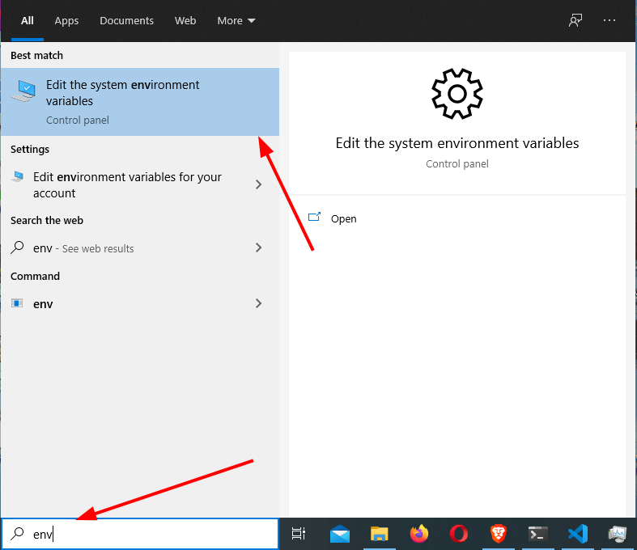
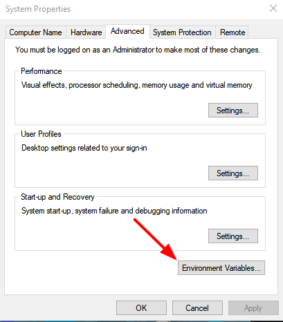
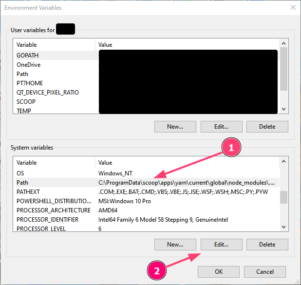
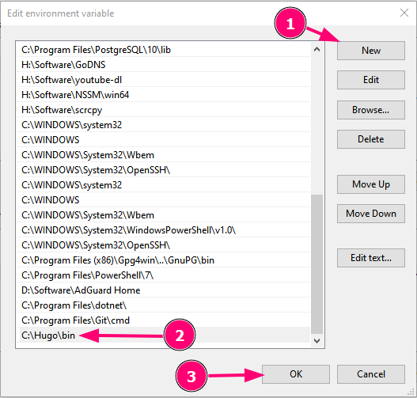

## Daftar Isi


## Apa itu Hugo?
Hugo adalah salah satu SSG (_Static-site Generator_) atau Generator Web Statis yang dibuat menggunakan bahasa pemrograman Go, dikembangkan oleh Bjørn Erik Pedersen, Steve Francia, dan kontributor lainnya

Hugo juga merupakan FLOSS (_Free/Libre Open Source Software_) yang dirilis di bawah [Lisensi Apache 2.0](https://github.com/gohugoio/hugo/blob/master/LICENSE), kode sumbernya bisa Anda akses [di sini](https://github.com/gohugoio/hugo).

Hugo mendukung berbagai _Platform_ yang ada, termasuk Sistem Operasi Windows, macOS, berbasis Linux, dan BSD, baik untuk arsitektur x86, x64 (disebut sebagai x86-64 atau AMD64), ARM dan ARM64.

SSG ini diklaim sebagai SSG tercepat oleh para pengembangnya, salah satunya adalah karena Hugo berjalan di lingkungan yang _Native_, tanpa ketergantungan (_dependencies_) apapun dan memiliki fitur yang dinamakan _Fast Render Mode_.

Selain itu, Hugo juga memiliki banyak fitur lainnya, seperti i18n untuk dukungan multibahasa, berkas data, berkas statis, pemrosesan gambar, pemrosesan berkas CSS, JS, dll yang dapat menunjang kebutuhan untuk Situs Web/Blog Anda.

## Varian Hugo
Hugo memiliki 2 varian, yakni Hugo dan Hugo Extended, bedanya adalah kalau Hugo Extended memiliki fitur tambahan, seperti Pemrosesan berkas SCSS/SASS yang tidak dimiliki oleh Hugo Standar.

Tapi, Hugo Extended memiliki dukungan yang lebih sedikit dibandingkan dengan Hugo biasa dan secara resmi hanya disediakan untuk Sistem Operasi berikut:
- Windows yang berarsitektur x64
- Sistem Operasi berbasiskan Linux yang berarsitektur x64, itupun perlu "GNU C Library" (glibc)
- macOS yang berarsitektur x64 dan ARM64

Meskipun secara resmi Hugo Extended hanya disediakan untuk _Platform_ di atas saja, bukan berarti Hugo Extended hanya bisa untuk _Platform_ di atas saja, ada _Platform_ lain yang bisa memakainya, Void Linux dan Termux di Android adalah salah satu contohnya, nanti akan saya bahas cara instalnya.

## Cara Install Hugo
Di bagian ini, saya akan membahas Cara Install nya.

Caranya sendiri akan berbeda-beda untuk setiap Sistem Operasi ataupun _Platform_ yang ada, jadi pastikan Anda mengikutinya sesuai dengan Sistem Operasi atau _Platform_ yang Anda gunakan.

Berikut adalah cara instalasinya:

### Windows
#### Pengelola Paket Scoop
Jika Anda menggunakan [Scoop](https://scoop.sh) sebagai Pengelola Paket Anda di Windows, maka Anda bisa meng-install Hugo dengan perintah berikut:

```powershell
> scoop install hugo
```

Atau, ganti `hugo` jadi `hugo-extended` jika Anda ingin meng-install Hugo Extended, seperti berikut:

```powershell
> scoop install hugo-extended
```

Perintah di atas akan meng-install Hugo di dalam Direktori Pengguna (`%USERPROFILE%\scoop\apps`), jika Anda ingin Hugo nya dapat berjalan di Semua Pengguna, maka Anda perlu menambahkan argumen `-g`.

Perintahnya akan menjadi seperti berikut:

```powershell
> scoop install hugo-extended -g
```

Tapi, Anda perlu membuka Command Prompt, Windows Terminal, Windows PowerShell atau PowerShell Core nya sebagai Administrator terlebih dahulu sebelum menjalankan perintah di atas.

Jika Anda sudah meng-install `sudo` melalui Scoop atau [`gsudo`](https://github.com/gerardog/gsudo) sebelumnya, maka cukup tambahkan saja `sudo` sebelum menjalankan perintah Scoop, tanpa harus menjalankan Terminal sebagai Administrator, menjadi seperti berikut:

```powershell
> sudo scoop install hugo-extended -g
```

Dengan begini, Anda tidak perlu membuka Terminal sebagai Administrator lagi.

Untuk memperbarui versinya, silahkan ganti opsi `install` di atas menjadi `update`.

#### Pengelola Paket Chocolatey
Jika Anda menggunakan [Chocolatey](https://chocolatey.org/) sebagai Pengelola Paket Anda di Windows, maka Anda bisa meng-install Hugo dengan perintah berikut:

```powershell
> choco install hugo
```

Perintah di atas akan meng-install Hugo dalam varian Biasa/Standar, jika Anda ingin meng-install Hugo Extended, cukup ganti saja `hugo` menjadi `hugo-extended`, seperti berikut:

```powershell
> choco install hugo-extended
```

Untuk memperbarui versinya, silahkan ganti opsi `install` di atas menjadi `upgrade`.

#### Berkas Biner, tanpa Pengelola Paket (Manual)
Hugo telah menyediakan berkas Biner yang telah dikompilasi agar dapat digunakan secara langsung dan berkas tersebut diarsipkan dengan format/ekstensi `.zip` (untuk Windows), jadi Anda bisa langsung menggunakannya setelah berkas tersebut diunduh dan diekstrak.

Berkas Biner adalah nama lain dari Berkas yang tujuannya untuk dieksekusi, kalau di Windows Anda akan mengenal dengan berkas yang berekstensi `.exe`.

Jika Anda tidak ingin menggunakan Pengelola Paket apapun untuk meng-installnya, maka berikut adalah langkah-langkahnya:

1. Unduh Berkas Arsip yang berisi berkas biner Hugo di [Halaman Perilisannya](https://github.com/gohugoio/hugo/releases).

    Di situ tersedia 4 berkas yang bisa Anda unduh salah satunya, semua itu diarsipkan dalam format Zip, sesuaikan dengan Arsitektur Sistem Operasi yang Anda gunakan.

    Tapi, jika Anda ingin meng-install Hugo Extended, unduh berkas yang namanya diawali dengan `hugo_extended`

2. Setelah diunduh, ekstrak berkas arsip tersebut ke dalam folder/direktori apa saja.

    Saya asumsikan bahwa Anda mengekstraknya ke dalam Folder `C:\Hugo\bin` dan akan saya gunakan direktori tersebut untuk seterusnya

3. Setelah diekstrak, Anda perlu menambahkan ke dalam variabel `PATH` agar Hugo bisa dieksekusikan di mana saja.

    Pertama-tama, klik "Start Menu", lalu manfaatkan fasilitas pencarian yang ada di sana atau Anda juga bisa langsung ke pencarian yang ada di _Taskbar_ jika Anda memasangkannya.

    Saat di pencarian, ketik `env` di situ, nanti akan muncul tulisan **Edit the system environment variables** dan klik tulisan tersebut, seperti cuplikan berikut:



4. Nanti akan muncul dialog **System Properties**, di dalam dialog tersebut, klik pada _Button_ **Environment Variables...**, seperti cuplikan berikut:



5. Setelah itu, Anda akan memasukki dialog yang berjudul **Environment Variables**, di situ nanti ada dua kolom, yakni **User variables** yang terletak di atas dan **System variables** yang terletak di bawah.

    Karena Variabel yang di ubah ini lingkupnya ke satu Sistem Operasi, yang artinya semua Akun Pengguna (_User Account_) kena, maka carilah variabel `PATH` di dalam kolom **System variables**.

    Setelah ketemu, pilih variabel tersebut dan klik pada _Button_ **Edit**, seperti cuplikan berikut:



6. Anda memasukki dialog yang berjudul **Edit environment variables**, di situ Anda akan merubah nilai dari variabel tersebut. Windows 10 dan Windows 7 mungkin memiliki penampilan yang berbeda, jadi cara mengubahnya akan berbeda-beda, berikut di bawah ini adalah caranya:

    - Di Windows 10: Nilai dari variabel `PATH` yang tampil di Windows 10 adalah dalam bentuk daftar. Untuk menambahkannya, cukup Anda klik pada _Button_ **New**, lalu isi nilainya dengan Lokasi berkas Biner Hugo itu berada.

        Jika Anda sebelumnya mengekstrak Hugo di `C:\Hugo\bin`, maka isi nilainya dengan `C:\Hugo\bin` juga. Setelah menambahkannya, klik pada _Button_ **OK**, seperti cuplikan berikut:

        

    - Di Windows 7: Nilai dari Variabel `PATH` yang tampil di Windows 7 adalah dalam bentuk deretan. Untuk menambahkannya, cukup Anda tambahkan `C:\Hugo\bin;` saja di bagian akhir deretan (**JANGAN DIGANTI SEMUA DERETANNYA!!**).

        `C:\Hugo\bin` menunjukkan tempat di mana Hugo diekstrak, jika Anda mengekstraknya di tempat lain, maka ganti `C:\Hugo\bin` menjadi lokasi di mana Berkas Biner Hugo itu berada.

        Setelah itu, klik pada _Button_ **OK**.

        **Catatan:** Mohon maaf, karena saya tidak lagi memakai Windows 7, jadi cuplikannya belum ada saat ini

7. Jika masih ada sesi Command Prompt, Windows Terminal, Windows PowerShell, PowerShell Core, dll, maka Anda perlu menutup semuanya terlebih dahulu/mengakhiri semua sesinya, lalu membukanya kembali.

    Biasanya, perubahan pada variabel `PATH` tidak akan berefek jika sesinya masih ada. Jika Anda tidak membuka Terminalnya, silahkan Anda membukanya terlebih dahulu, entah itu Command Prompt, Windows Terminal, PowerShell, dll.

8. Setelah Anda membuka Terminalnya, silahkan Anda eksekusikan perintah `hugo version` untuk menampilkan versi Hugo yang Anda gunakan. Jika berhasil, maka akan tampil keluaran seperti berikut:

```plain
hugo v0.88.1-5BC54738+extended windows/amd64 BuildDate=2021-09-04T09:39:19Z VendorInfo=gohugoio
```

9. Selamat! Anda telah berhasil meng-install Hugo. Jika Anda ingin memperbarui versi Hugo nya, cukup unduh lagi berkas binernya, lalu tinggal timpakan berkas lamanya.

Nah, untuk Windows nya saya cukupkan di sini dulu, berikutnya saya bahas Cara Install Hugo untuk Sistem Operasi GNU/Linux.

WinGet? Sayang sekali, itu masih belum ada hingga saat ini, jadi Anda harus menggunakan metode lain selain WinGet tentunya.

### GNU/Linux
#### Debian, Ubuntu dan Turunannya
Jika Anda adalah pengguna Debian, Ubuntu atau Turunannya, sebenarnya Anda dapat meng-installnya dengan perintah berikut:

```shell
$ sudo sh -c 'apt update; apt install -y hugo'
```

Atau:

    # apt update; apt install -y hugo

Tapi cara di atas tidak saya rekomendasikan, karena versi yang Anda dapatkan nantinya merupakan versi yang lama (kecuali jika Anda menggunakan Distribusi dengan rilis bergulir).

Jika Anda ingin versi terbaru dari Hugo, silahkan Anda unduh itu di halaman [perilisan resminya](https://github.com/gohugoio/hugo/releases), pastikan unduh `.deb` nya, setelah itu Anda instal secara manual.

Atau, jika Anda lebih suka lewat Terminal, maka pertama-tama Anda perlu mengubah hak akses Anda di Terminal menjadi `root` dengan perintah `sudo su`, `sudo -i` atau `sudo -s`.

Lalu, unduh mentahan Hugo nya dengan skrip berikut:

```shell
HUGO_VERSION="$(curl -s https://api.github.com/repos/gohugoio/hugo/releases/latest | grep tag_name | cut -d 'v' -f2 | cut -d'"' -f1)" # Untuk mendapatkan versi terbaru Hugo
HUGO_ARCH="64bit" # Arsitektur yang tersedia adalah 64bit, 32bit, ARM atau ARM64
FILENAME="hugo_${HUGO_VERSION}_Linux-${HUGO_ARCH}.deb"
cd /tmp; wget -c "https://github.com/gohugoio/hugo/releases/download/v${HUGO_VERSION}/${FILENAME}" # Mengunduh mentahan Hugo nya dengan bantuan GNU Wget
```

Kalau mau, silahkan ganti nilai dari variabel `HUGO_ARCH` di atas dengan Arsitektur Sistem Operasi yang Anda gunakan, tapi tersedia di Hugo.

Arsitektur yang tersedia adalah sebagai berikut:
- `64bit` (untuk x86_64, x64, atau AMD64)
- `32bit` (untuk x86 atau i686)
- `ARM` (untuk AArch32 atau Pengguna ARM dengan 32-bit)
- `ARM64` (untuk Pengguna ARM dengan 64-bit)

Atau, jika Anda ingin mengunduh Hugo Extended, maka Anda bisa menggantikan `hugo_${HUGO_VERSION}_Linux-${HUGO_ARCH}.deb` yang ada di dalam variabel `FILENAME` menjadi `hugo_extended_${HUGO_VERSION}_Linux-64bit.deb` dan hapus Variabel `HUGO_ARCH`.

Kalau gak mau ribet, tinggal copas aja skrip berikut:

```shell
HUGO_VERSION="$(curl -s https://api.github.com/repos/gohugoio/hugo/releases/latest | grep tag_name | cut -d 'v' -f2 | cut -d'"' -f1)" # Untuk mendapatkan versi terbaru Hugo
FILENAME="hugo_extended_${HUGO_VERSION}_Linux-64bit.deb"
cd /tmp; wget -c "https://github.com/gohugoio/hugo/releases/download/v${HUGO_VERSION}/${FILENAME}" # Mengunduh mentahan Hugo nya dengan bantuan GNU Wget
```

**Catatan:** Secara resmi, Hugo Extended tidak disediakan berkas Biner yang telah dikompilasi untuk arsitektur selain `64bit`, kecuali untuk Sistem Operasi macOS yang disediakan arsitektur `ARM64` nya juga.

Lalu, instal berkas yang telah Anda unduh dengan perintah berikut:

```shell
dpkg -i ${FILENAME}
rm ${FILENAME} # Untuk menghapus mentahan Hugo setelah meng-installnya
```

Jika merasa sudah selesai, silahkan alihkan kembali hak akses di dalam Terminal Anda menjadi Pengguna Biasa dengan perintah `exit`.

Untuk memperbarui versi Hugo nya, Anda perlu mengulangi semua langkah-langkah di atas.

#### Arch Linux, Manjaro dan Turunannya
Jika Anda adalah pengguna Arch Linux, Manjaro atau Turunannya, Anda dapat meng-install Hugo dengan perintah berikut:

```shell
$ sudo pacman -S hugo
```

Namun jika Anda lebih memilih lewat AUR (_Arch User Repository_), silahkan gunakan paket [`hugo-bin`](https://aur.archlinux.org/packages/hugo-bin/) dari AUR.

Cara Instal paket dari AUR akan berbeda-beda, tergantung _AUR Helper_ yang Anda gunakan.

Tapi jika Anda menggunakan Yay sebagai _AUR Helper_ nya, maka Anda dapat memakai perintah berikut:

```shell
$ yay -S hugo-bin
```

**Catatan:** Varian Hugo yang digunakan oleh Arch, Manjaro dan Turunannya adalah Hugo Extended, begitupula dengan paket `hugo-bin` yang ada di AUR.

#### Solus dan Turunannya
Jika Anda menggunakan Solus atau Turunannya, maka Anda dapat meng-installnya dengan perintah berikut:

```shell
$ sudo eopkg install hugo
```

**Catatan:** Saya tidak memakai Solus dan Turunannya, tapi berdasarkan [konfigurasinya](https://dev.getsol.us/source/hugo/browse/master/package.yml), kemungkinan varian Hugo yang digunakan oleh Solus dan Turunannya adalah Hugo Extended.

#### Void Linux dan Turunannya
Jika Anda adalah pengguna Void Linux atau Turunannya, Anda dapat meng-install Hugo dengan perintah berikut:

```shell
$ sudo xbps-install -S hugo
```

**Catatan:** Saya tidak memakai Void Linux dan Turunannya, tapi berdasarkan [templatnya](https://github.com/void-linux/void-packages/blob/master/srcpkgs/hugo/template), kemungkinan varian Hugo yang digunakan oleh Void Linux dan Turunannya adalah Hugo Extended. Selain itu, Hugo Extended yang mereka gunakan didukung oleh semua arsitektur (baik itu x86, x64, ARM, ARM64, dan arsitektur lainnya) dan "C Library" (`glibc` dan `musl`) yang ada pada Void Linux.

#### Homebrew (Universal)
Jika Anda ingin menggunakan [Homebrew (brew)](https://brew.sh/) yang lebih Universal, maka Anda bisa meng-installnya dengan perintah berikut:

```shell
$ brew install hugo
```

**Catatan:** Saya tidak memakai Pengelola Paket Homebrew, tapi berdasarkan [kode formulanya](https://github.com/Homebrew/homebrew-core/blob/HEAD/Formula/hugo.rb), kemungkinan varian Hugo yang digunakan oleh Pengelola Paket Homebrew adalah Hugo Extended.

#### Snap (Universal)
Jika Anda ingin menggunakan Snap yang lebih Universal, maka Anda bisa meng-installnya dengan perintah berikut:

```shell
$ snap install hugo
```

Perintah di atas akan meng-install Hugo dengan varian biasa, jika Anda ingin meng-install Hugo Extended, Anda hanya perlu tambahkan argumen `--channel=extended/stable` saja, menjadi seperti berikut:

```shell
$ snap install hugo --channel=extended/stable
```


Kalau dibilang 'Universal' mungkin tidak terlalu, semenjak Snap sendiri memasukkan Systemd sebagai ketergantungan, sehingga Distribusi yang Anda gunakan harus memakai Systemd sebagai Init agar Snap bisa digunakan. 

Jika Anda menggunakan Distribusi Non-Systemd seperti Void Linux, Devuan, MX Linux (lebih tepatnya ia tidak menggunakannya sebagai "Init baku"), Artix Linux, GUIX dan turunannya dan lainnya, maka kemungkinan besar Anda tidak dapat menggunakan Pengelola Paket Snap.

Makanya di awal saya bilang "lebih Universal", karena bisa untuk distribusi lainnya yang lebih luas ketimbang menggunakan Pengelola Paket bawaan.


#### Berkas Biner, tanpa Pengelola Paket (Universal, Manual)
Hugo telah menyediakan berkas Biner yang telah dikompilasi agar dapat digunakan secara langsung dan berkas tersebut diarsipkan dengan format/ekstensi `.tar.gz` (untuk GNU/Linux), jadi Anda bisa langsung menggunakannya setelah berkas tersebut diunduh dan diekstrak.

Berkas Biner adalah nama lain dari Berkas yang tujuannya untuk dieksekusi, kalau di Windows Anda akan mengenal dengan berkas yang berekstensi `.exe`.

Berkas tersebut biasanya akan kompatibel dengan hampir seluruh distribusi GNU/Linux, jadi jika distribusi yang Anda gunakan tidak saya bahas di sini dan tidak mau menggunakan Pengelola Paket 'Universal' atau bahkan sama sekali tidak mau menggunakan Pengelola Paket, maka Anda bisa gunakan berkas Binernya.

Cara sederhananya:
1. Unduh salah satu berkas Arsip yang berisikan berkas Biner Hugo dari [Halaman Perilisannya](https://github.com/gohugoio/hugo/releases) (yang berformat `.tar.gz`)
2. Ekstrak berkasnya
3. Izinkan agar berkas yang bernama `hugo` bisa dieksekusi (dengan mengeksekusi perintah `chmod +x hugo`)
4. Pindahkan berkas yang bernama `hugo` ke dalam direktori `/usr/local/bin` (dengan mengeksekusi perintah `sudo mv hugo /usr/local/bin/`)
5. Pastikan bahwa `/usr/local/bin/hugo` itu milik pengguna `root` (dengan mengeksekusi perintah `sudo chown root:root /usr/local/bin/hugo`)
6. Selesai!

**Catatan:** Bisa saja Anda memindahkan berkas tersebut ke dalam direktori lain yang termasuk dalam variabel `PATH`, seperti `/home/username/.local/bin` misalnya dan tidak perlu melakukan peralihan kepemilikan ke `root`, tapi saya rekomendasikan agar diletakkan ke dalam direktori `/usr/local/bin` supaya Hugo bisa dieksekusi oleh seluruh pengguna di satu sistem.

Jika Anda lebih suka melakukannya secara langsung di Terminal (atau cara panjangnya) maka pertama-tama Anda perlu mengubah hak akses Anda di Terminal menjadi `root` dengan perintah `sudo su`, `sudo -i`, atau `sudo -s`.

Lalu, unduh versi terbaru dari Hugo dengan mengeksekusi skrip berikut, lalu tekan "Enter": (Langsung copas aja)

```shell
HUGO_VERSION="$(curl -s https://api.github.com/repos/gohugoio/hugo/releases/latest | grep tag_name | cut -d 'v' -f2 | cut -d'"' -f1)" # Untuk mendapatkan versi terbaru Hugo
HUGO_ARCH="64bit" # Arsitektur yang tersedia adalah 64bit, 32bit, ARM atau ARM64
FILENAME="hugo_${HUGO_VERSION}_Linux-${HUGO_ARCH}.tar.gz"
cd /tmp; wget -c "https://github.com/gohugoio/hugo/releases/download/v${HUGO_VERSION}/${FILENAME}" # Menavigasikan Terminal ke /tmp, lalu mengunduh Hugo nya di sana dengan bantuan GNU Wget
```

Kalau mau, silahkan ganti nilai dari variabel `HUGO_ARCH` di atas dengan Arsitektur Sistem Operasi yang Anda gunakan, tapi tersedia di Hugo. 

Arsitektur yang tersedia adalah sebagai berikut:
- `64bit` (untuk x86_64, x64, atau AMD64)
- `32bit` (untuk x86 atau i686)
- `ARM` (untuk AArch32 atau Pengguna ARM dengan 32-bit)
- `ARM64` (untuk Pengguna ARM dengan 64-bit)

Atau, jika Anda ingin mengunduh Hugo Extended, maka Anda bisa menggantikan `hugo_${HUGO_VERSION}_Linux-${HUGO_ARCH}.tar.gz` yang ada di dalam variabel `FILENAME` menjadi `hugo_extended_${HUGO_VERSION}_Linux-64bit.tar.gz` dan hapus Variabel `HUGO_ARCH`.

Kalau gak mau ribet, tinggal copas aja skrip berikut:

```shell
HUGO_VERSION="$(curl -s https://api.github.com/repos/gohugoio/hugo/releases/latest | grep tag_name | cut -d 'v' -f2 | cut -d'"' -f1)" # Untuk mendapatkan versi terbaru Hugo
FILENAME="hugo_extended_${HUGO_VERSION}_Linux-64bit.tar.gz"
cd /tmp; wget -c "https://github.com/gohugoio/hugo/releases/download/v${HUGO_VERSION}/${FILENAME}" # Menavigasikan Terminal ke /tmp, lalu mengunduh Hugo nya di sana dengan bantuan GNU Wget
```

**Catatan:** Secara resmi, Hugo Extended tidak disediakan berkas Biner yang telah dikompilasi untuk arsitektur selain `64bit`, kecuali untuk Sistem Operasi macOS yang disediakan arsitektur `ARM64` nya juga.

Setelah mengunduhnya, Anda perlu mengeksekusi skrip berikut untuk meng-installnya:

```shell
tar -xvzf ${FILENAME}; chmod +x hugo # Ekstrak Berkas Arsip dan Izinkan berkas yang bernama 'hugo' agar dapat dieksekusi
mv hugo /usr/local/bin/; chown root:root /usr/local/bin/hugo # Memindahkan berkas yang bernama 'hugo' ke /usr/local/bin dan mengubah kepemilikan berkas 'hugo' menjadi milik 'root'
rm ${FILENAME} LICENSE README.md # Menghapus berkas yang sudah tak terpakai lai
cd - # Kembali ke direktori sebelumnya
```

Setelah itu, pastikan kalau Hugo dapat berjalan dengan mengeksekusi perintah berikut untuk melihat versi Hugo yang Anda gunakan sekarang:

```shell
hugo version
```

Jika berhasil, maka keluarannya akan seperti di bawah ini:

```plain
hugo v0.88.1-5BC54738+extended linux/amd64 BuildDate=2021-09-04T09:39:19Z VendorInfo=gohugoio
```

Keluaran di atas itu terjadi karena saya menggunakan Hugo Extended, jika Anda menggunakan varian biasa, harusnya sih sama aja, bedanya cuma gak ada tulisan `extended` nya aja.

Kalau mau, Anda juga dapat membuat Halaman Panduan (manpages) untuk Hugo dengan perintah berikut:

```shell
hugo gen man --dir '/usr/local/man/man1'
```

Kalau sudah, Anda bisa tes Halaman Panduannya dengan mengeksekusi perintah `man hugo` di dalam Terminal Anda.

Jika Anda ingin memasang fitur _Completion_ untuk _Shell_ yang Anda gunakan di Terminal, maka Anda dapat memasangkannya dengan perintah berikut: (Sesuaikan dengan _Shell_ yang ter-install di Sistem Anda)

```shell
hugo gen autocomplete --type=bash | install -Dm 644 /dev/stdin "/usr/share/bash-completion/completions/hugo" ## Untuk Pengguna GNU Bash
hugo gen autocomplete --type=zsh | install -Dm 644 /dev/stdin "/usr/share/zsh/site-functions/_hugo" ## Untuk Pengguna Z Shell (zsh)
```

Silahkan Anda coba fitur _Completion_ di dalam Terminal Anda setelah itu.

Jika merasa sudah selesai, silahkan alihkan kembali hak akses di dalam Terminal Anda menjadi Pengguna Biasa dengan perintah `exit`.

Untuk memperbarui versi Hugo nya, Anda perlu mengulangi semua langkah-langkah di atas.

### macOS
#### MacPorts
**Catatan:** Saya tidak memakai Sistem Operasi macOS dan MacPorts sebagai Pengelola Paket, mungkin cara instalasi yang saya lontarkan di sini kurang begitu akurat sehingga bisa saja salah. Jika terjadi kesalahan dan Anda adalah pengguna MacPorts, mohon berikan masukkan/koreksi dari Anda melalui Kolom Komentar.

Jika Anda menggunakan [MacPorts](https://www.macports.org/) sebagai Pengelola Paket di dalam macOS Anda, maka Anda dapat meng-install Hugo dengan perintah berikut:

```shell
$ sudo port install hugo
```

Perintah di atas akan meng-install Hugo dengan varian biasa, jika Anda ingin meng-install Hugo Extended, Anda hanya perlu tambahkan argumen `+extended` saja, menjadi seperti berikut:

```shell
$ sudo port install hugo +extended
```

Anda juga dapat menambahkan fitur _Completion_ untuk Bash kalau mau dengan menambahkan argumen `+bash_completion` di dalam baris perintahnya saja.

Jika Anda tidak ingin menggunakan `sudo`, maka hapus saja `sudo` nya.

#### Homebrew
Jika Anda menggunakan [Homebrew (brew)](https://brew.sh/) sebagai Pengelola Paket di dalam macOS Anda, maka Anda dapat meng-install Hugo dengan perintah berikut:

```
$ brew install hugo
```

**Catatan:** Saya tidak memakai Pengelola Paket Homebrew, tapi berdasarkan [kode formulanya](https://github.com/Homebrew/homebrew-core/blob/HEAD/Formula/hugo.rb), kemungkinan varian Hugo yang digunakan oleh Pengelola Paket Homebrew adalah Hugo Extended.

### Android
#### Termux
Jika Anda menggunakan [Termux](https://termux.com/) di dalam Android Anda, maka Anda dapat meng-install Hugo dengan perintah berikut:

```shell
$ pkg upgrade; pkg i hugo
```

Perintah di atas akan meng-install Hugo Extended, bukan Hugo varian Biasa/Standar, berdasarkan [konfigurasinya](https://github.com/termux/termux-packages/blob/master/packages/hugo/build.sh) meskipun Anda menggunakan Arsitektur dari ARM.

Jadi, Anda tidak perlu lagi khawatir mengenai masalah varian Hugo di Android Anda, tapi saya sarankan agar Anda menggunakan [Termux versi terbarunya](https://f-droid.org/en/packages/com.termux/) (tidak diunduh dari Google Play Store) untuk pengalaman yang lebih nyaman dan versi Android nya minimal 7.0 agar Termux versi terbaru bisa digunakan.

### BSD
#### OpenBSD dan Turunannya
**Catatan:** Saya tidak memakai Sistem Operasi berbasis BSD, seperti OpenBSD, mungkin cara instalasi yang saya lontarkan di sini kurang begitu akurat sehingga bisa saja salah. Jika terjadi kesalahan dan Anda adalah pengguna OpenBSD, mohon berikan masukkan/koreksi dari Anda melalui Kolom Komentar.

Jika Anda adalah pengguna OpenBSD dan Turunannya, maka Anda dapat meng-install Hugo dengan perintah berikut:

```shell
$ doas pkg_add hugo
```

Karena saya tidak pakai, jadi saya tidak tahu apa varian Hugo yang terinstal nantinya dan dapat versi berapa.

Jika versi yang didapat adalah versi lama dan Anda sangat ingin mendapatkan versi terbarunya, maka Anda bisa mempertimbangkan opsi instalasi melalui [OpenBSD Ports](https://openports.se/www/hugo), mungkin ini akan menghimpun (_compile_) kode sumber Hugo.

### Docker
Jika Anda menggunakan Docker, mungkin Anda bisa gunakan _Docker Image_ [`klakegg/hugo`](https://hub.docker.com/r/klakegg/hugo/) untuk itu. Ini memang bukan resmi dari pengembang, tapi mereka sendiri merekomendasikannya.

## Pertanyaan dan Jawaban
### Pertanyaan ke-1: Varian Hugo mana yang harus dipakai? {#pertanyaan-ke1}
**Jawab:** Usahakan untuk selalu gunakan Hugo Extended ketimbang Hugo dengan varian Biasa/Standar.

Dukungan tema akan lebih beragam jika Anda menggunakan Hugo Extended, karena ada beberapa tema yang menggunakan SCSS ketimbang CSS untuk mengatur penampilannya.

Lagipula, sudah banyak _Platform_ yang mendukung Hugo Extended ini, walaupun secara resmi hanya disediakan untuk _Platform_ tertentu saja.

### Pertanyaan ke-2: Kenapa Cara Install Hugo di Fedora, Red Hat, SUSE dan Turunannya malah gak dibahas? {#pertanyaan-ke2}
**Jawab:** Karena versi Hugo yang digunakan oleh Fedora, Red Hat dan Turunannya adalah versi lama.

Hingga saat ini, saya belum menemukan _Repository_ luar yang cocok untuk Fedora, Red Hat, SUSE dan Turunannya.

Jika Anda sangat ingin meng-install Hugo di dalam Distribusi yang tidak saya bahas, maka saya sarankan agar Anda meng-installnya melalui cara yang lebih "Universal" seperti menggunakan Snap, Homebrew atau melalui cara manual (mengunduh berkas biner, tanpa pengelola paket).

## Penutup
Sudah? Iya, sudah, cuma itu saja yang perlu Anda lakukan. Ini merupakan Artikel yang membahas tentang 'Cara Install Hugo', bukan 'Cara Install Hugo beserta konfigurasinya', walaupun saya sedikit berbasa-basi tentang apa itu Hugo dan apa saja variannya.

Demi kesederhanaan Artikel ini, maka topik tentang membuat Blog di Hugo beserta konfigurasinya akan saya bahas secara terpisah.

Jika kamu mempunyai pertanyaan, kritik dan saran, komentar atau masukkan lainnya, silahkan kamu berkomentar melalui kolom komentar yang tersedia atau bisa kamu [Hubungi Saya](/tentang).

Terima kasih atas perhatiannya 😊
