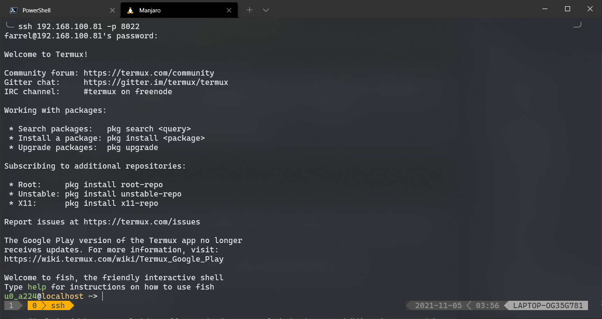
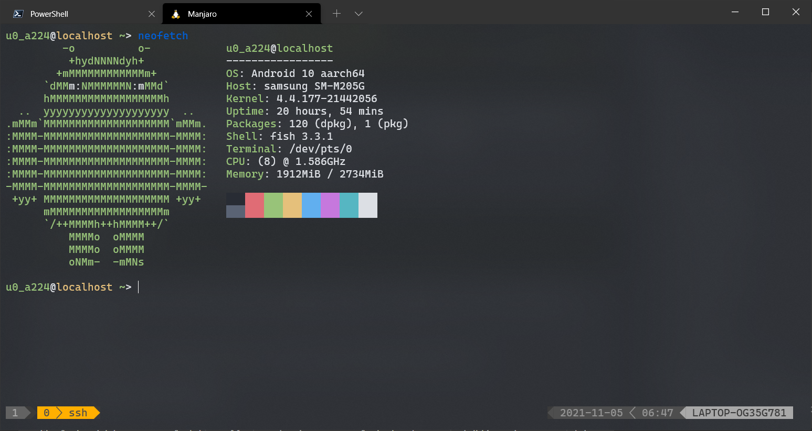
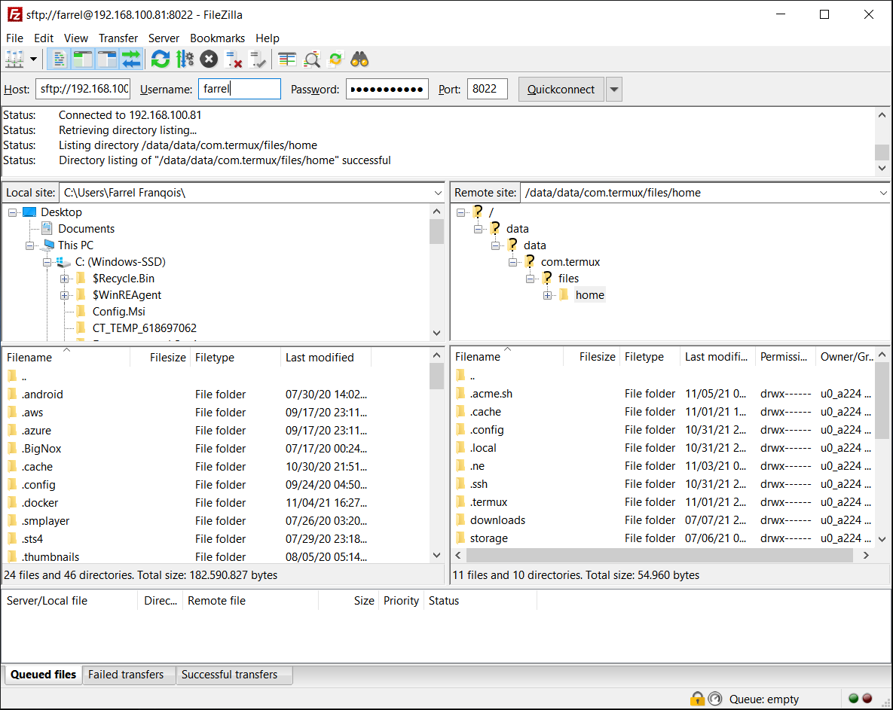
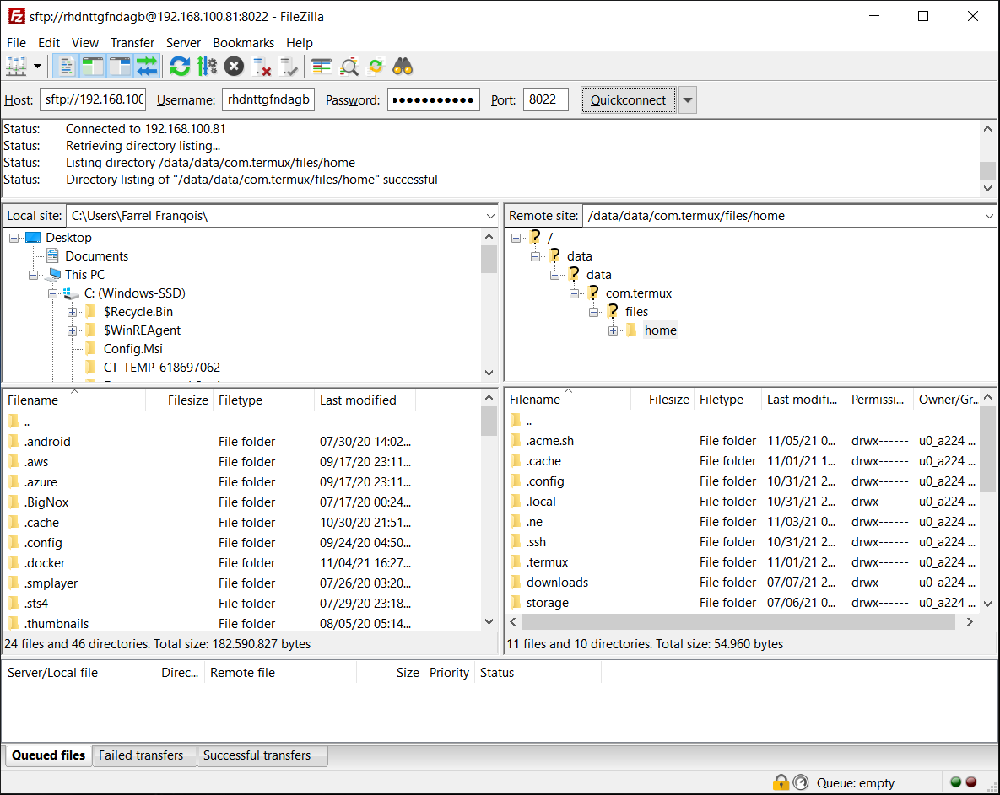

## Pembuka
Menggunakan Termux itu bisa menyenangkan jika kamu memiliki tujuan. Jika tidak, maka sama saja seperti membuang air ke laut, ya sama-sama gak berguna.

Tapi bagi sebagian orang, mengetik baris perintah dari layar ponsel itu sangatlah tidak nyaman, apalagi jika baris perintah itu panjang kali lebar dan berjumlah banyak.

Jika Anda memiliki perangkat seperti Komputer/Laptop, selain Ponsel Android, mungkin Anda akan lebih nyaman jika mengetik baris perintah tersebut di Komputer/Laptop, ketimbang di layar ponsel?

Kalau begitu, kenapa gak kamu pakai Termux dari Komputer/Laptopmu saja?

Nah, inilah yang sedang saya bahas di artikel ini, yakni "Cara menggunakan Termux dari Komputer/Laptop".

Dah, gak usah banyak _cingcong_, mari saya bahas langsung persiapan dan caranya.

## Persiapan
Gak ada persiapan khusus, cuma perlu koneksi Internet, Ponsel Android Anda dan tentunya sudah terinstal Termux.

Saya sarankan agar selalu gunakan Termux versi terbaru untuk pengalaman yang lebih nyaman dan pastikan Anda mengunduhnya di [F-Droid](https://f-droid.org/en/packages/com.termux/), bukan di Google Play Store.

Kalo kamu sudah telanjur mengunduhnya di Google Play Store, kamu perlu [mencadangkan (_backup_) datanya](https://wiki.termux.com/wiki/Backing_up_Termux) terlebih dahulu, setelah itu hapus Termux-nya, lalu kamu unduh Termux-nya dari F-Droid dan Install lagi.

Untuk versi Android nya sendiri, saya sarankan agar Anda menggunakan Android versi 7.0 atau di atasnya, untuk menggunakan Termux versi terbaru.

Sebaiknya kamu _meng-update_ semua paket yang terinstal di Termux untuk mengikuti ini, tapi kalo tidak mau ya gak apa-apa, bisa dicoba dulu.

Pastikan agar Komputer/Laptop dan Ponsel Android kamu terkoneksi dengan jaringan yang sama, jika Anda tidak menyewa sebuah Layanan Internet _Fixed Broadband_ seperti IndiHome, First Media, Biznet Home, dll atau tidak memiliki perangkat khusus yang memancarkan sinyal Wi-Fi di rumah (seperti: Modem ONT, Router Wi-Fi, Access Point, dll), Anda bisa gunakan fitur **Hotspot Tethering** (bahasa Indonesia: **Penambatan Hotspot**) yang ada di Ponsel kamu.

Serta pastikan juga bahwa Perangkat Lunak Klien SSH ada terinstal di dalam Komputer/Laptop kamu. Anda bisa gunakan [PuTTY](https://www.putty.org) atau [Bitvise](https://www.bitvise.com) untuk itu, tapi jika Anda menggunakan Windows 10 atau Sistem Operasi berbasis Linux/Unix, maka Anda bisa menggunakan OpenSSH sebagai Klien SSH yang sudah terinstal di dalam sistem Anda.

## Caranya
### Konfigurasi Awal
Pada bagian ini saya membahas konfigurasi awalnya, saya susun semuanya dalam langkah-demi-langkah supaya Anda bisa memahaminya dengan mudah.

Berikut adalah hal yang harus Anda lakukan:

**Langkah ke-1:** Buka Aplikasi Termux (Pastinya)

**Langkah ke-2:** Instal paket `openssh` dan `termux-services` di Termux kamu dengan perintah berikut:

```shell {linenos=false}
pkg i -y openssh termux-services
```

Atau, di bawah ini jika Anda ingin menggunakan APT:

```shell {linenos=false}
apt update; apt install -y openssh termux-services
```

Kalau mau, setelah ini Anda juga dapat menginstal `nmap` untuk mengecek _port_ yang aktif atau/dan `iproute2` sebagai utilitas jaringan, salah satunya adalah mengecek Alamat IP pada jaringan yang Anda gunakan sekarang, dengan perintah berikut:

```shell {linenos=false}
pkg i -y nmap iproute2
```

Atau, di bawah ini jika Anda ingin menggunakan APT:

```shell {linenos=false}
apt update; apt install -y nmap iproute2
```

**Langkah ke-3:** Kamu perlu menyetel kata sandi untuk Nama Pengguna yang kamu gunakan dengan mengetikkan `passwd` di dalam Termux, lalu tekan "Enter", tanpa perlu mengingat/menyebutkan Nama Penggunanya secara spesifik dan tanpa perlu memasukkan argumen apapun.

Setelah itu, masukkan kata sandi baru yang Anda inginkan, itu akan digunakan untuk _login_ ke dalam SSH nya nanti, kata sandi yang Anda masukkan tidak tampil di konsol, jadi jangan sampai lupa!

Contoh perintah dan keluarannya sebagai berikut jika sukses:

```shell
$ passwd
New password:
Retype new password:
New password was successfully set.
```

Ini serius, kamu gak perlu menyebutkan ataupun mengingat Nama Pengguna (_Username_) nya.

**Langkah ke-4:** Aktifkan Server SSH nya dengan mengetik `sshd` di dalam Termux, lalu tekan "Enter"

**Langkah ke-5:** Cek terlebih dahulu untuk memastikan Server SSH aktif di Termux dengan mengetikkan `pidof sshd`, lalu tekan "Enter".

Jika tidak ada hasil keluaran apapun, maka artinya Server SSH tidak dalam keadaan aktif.

Jika ada hasil keluaran yang berbentuk angka, maka artinya Server SSH dalam keadaan aktif.

Selain menggunakan `pidof`, jika tadi Anda menginstal `nmap`, maka Anda juga dapat mengeceknya melalui `nmap` untuk memastikan _port_ mana saja yang aktif.

Eksekusikan perintah `nmap localhost` di dalam Termux untuk mengeceknya melalui `nmap`, lalu hasilnya akan seperti berikut:

```shell
$ nmap localhost
Starting Nmap 7.91 ( https://nmap.org ) at 2021-11-04 22:49 WIB
Nmap scan report for localhost (127.0.0.1)
Host is up (0.0070s latency).
Not shown: 999 closed ports
PORT     STATE SERVICE
8022/tcp open  oa-system

Nmap done: 1 IP address (1 host up) scanned in 1.20 seconds
```

Jika ada tulisan seperti `8022/tcp open oa-system` di atas, maka artinya Server SSH dalam keadaan aktif dan _port_ `8022` itu terbuka.

Oh iya, jangan lupa bahwa `8022` adalah _port_ SSH yang digunakan, jadi ketika Anda login, pastikan agar menggunakan _port_ `8022`.

**Langkah ke-6:** Ketahui terlebih dahulu Alamat IP pada jaringan Anda dengan mengetikkan `ifconfig` di Termux, lalu tekan "Enter".

Contoh keluarannya akan seperti berikut:

```shell
$ ifconfig
Warning: cannot open /proc/net/dev (Permission denied). Limited output.
lo: flags=73<UP,LOOPBACK,RUNNING>  mtu 65536
        inet 127.0.0.1  netmask 255.0.0.0
        unspec 00-00-00-00-00-00-00-00-00-00-00-00-00-00-00-00  txqueuelen 1  (UNSPEC)

tun0: flags=81<UP,POINTOPOINT,RUNNING>  mtu 1500
        inet 10.18.234.134  netmask 255.0.0.0  destination 10.18.234.134
        unspec 00-00-00-00-00-00-00-00-00-00-00-00-00-00-00-00  txqueuelen 500  (UNSPEC)

wlan0: flags=4163<UP,BROADCAST,RUNNING,MULTICAST>  mtu 1460
         inet 192.168.100.81  netmask 255.255.255.0  broadcast 192.168.100.255
         unspec 00-00-00-00-00-00-00-00-00-00-00-00-00-00-00-00  txqueuelen 3000  (UNSPEC)
```

Seperti yang Anda lihat di atas, bahwa Alamat IP untuk Antarmuka sambungan Wi-Fi (`wlan0`) yang saya dapatkan adalah `192.168.100.81` yang letaknya berada di paling bawah.

Mungkin hasilnya akan berbeda di perangkat Anda, jadi pastikan Anda lebih teliti dalam mencari Alamat IP-nya.

Jika Anda menggunakan **Hotspot Tethering** (bahasa Indonesia: **Penambatan Hotspot**), maka cari Alamat IP Anda di antarmuka `ap0` atau `swlan0`, bukan `wlan0`. Mungkin nama antarmukanya akan berbeda di beberapa perangkat tertentu, tapi biasanya salah satu dari kedua nama tersebut digunakan sebagai nama antarmuka untuk Penambatan Hotspot.

Selain `ifconfig`, jika tadi Anda menginstal `iproute2`, maka Anda juga dapat mencari Alamat IP-nya melalui perintah `ip addr list (nama_antarmuka)`.

Contoh perintah dan keluarannya seperti berikut:

```shell
$ ip addr list wlan0
52: wlan0: <BROADCAST,MULTICAST,UP,LOWER_UP> mtu 1460 qdisc mq state UP group default qlen 3000
    link/ether b4:a5:ac:cd:17:ef brd ff:ff:ff:ff:ff:ff
    inet 192.168.100.81/24 brd 192.168.100.255 scope global wlan0
       valid_lft forever preferred_lft forever
```

Ganti `wlan0` yang di atas menjadi antarmuka yang ingin Anda lihat alamat IP-nya.

Sebagai contoh, Anda bisa menggantinya dengan `ap0` atau `swlan0` jika ponsel Anda sedang menggunakan fitur **Hotspot Tethering** (bahasa Indonesia: **Penambatan Hotspot**).

Alamat IP yang tampil nantinya akan digunakan untuk _login_ melalui Klien SSH yang ada di Komputer/Laptop kamu, jadi jangan sampai lupa!

**Langkah ke-7:** Terakhir, aktifkan _service_/layanan untuk OpenSSH agar Server SSH dapat diaktifkan ketika Termux dijalankan dengan mengeksekusi perintah `sv enable sshd` di dalam Termux.

### Mengakses Ponsel Android melalui SSH
Setelah melakukan konfigurasi awal, maka saatnya mengakses Ponsel Android dari Komputer/Laptop Anda.

Berikut adalah caranya:

**Langkah ke-1:** Sekarang Anda gunakan Komputer/Laptopmu dan jangan akhiri sesi Termux-nya. Coba kamu akses Android kamu dari Komputer/Laptopmu melalui SSH dengan melakukan _login_ terlebih dahulu.

Anda bisa lakukan ini melalui Klien SSH yang ada di Komputer/Laptop kamu, termasuk PuTTY.

Untuk kredensialnya, cukup masukkan Alamat IP, _Port_ dan kata sandinya saja, tidak perlu kamu masukkan _Username_ atau Nama Penggunanya. Kalaupun kamu ingin memasukkannya, kamu bisa memasukkan _Username_ nya dengan bebas.

Jika Anda menggunakan OpenSSH/Dropbear sebagai klien SSH di Komputer/Laptop kamu, maka perintah untuk _login_ nya sebagai berikut:

```shell {linenos=false}
ssh 192.168.100.81 -p 8022
```

Silahkan ganti `192.168.100.81` menjadi Alamat IP dari ponsel Anda.

Setelah menentukan Alamat IP-nya, ada parameter `-p` yang menentukan _port_ yang digunakan oleh Server, secara baku ia menggunakan _port_ `8022`, jika selain itu, silahkan ganti `8022` di atas dengan _port_ yang digunakan oleh Server SSH Anda.

Mengenai _Username_ nya, Anda gak salah lihat, di sini saya tidak memakai _Username_, karena Pengguna/_Username_ Standar di Termux itu cuma satu saja, selain itu hanya ada `root` saja.

Oleh karena itu, OpenSSH yang ada pada Termux itu tidak membandingkan _Username_ satu sama lain sama sekali, semuanya mengarah pada satu _Username_ yang sama, bahkan ketika Anda mengisinya dengan bebas sekalipun.

Sehingga OpenSSH pada Termux ini sangat berbeda bila dibandingkan dengan OpenSSH yang ada di Sistem lain, berdasarkan [tambalan](https://github.com/termux/termux-packages/blob/6499dede84dae2ecfbb1c1a2914526b78d4ff24a/packages/openssh/auth.c.patch) yang dilakukan oleh mereka.

**Langkah ke-2:** Jika ada pesan yang menyatakan "Are you sure you want to continue connecting?", ketik saja `yes`, lalu tekan "Enter". Setelah itu, masukkan kata sandinya.

**Langkah ke-3:** Jika berhasil, maka akan muncul _Prompt_ yang bisa Anda gunakan untuk mengetik baris perintah, seperti cuplikan berikut:



Di langkah ini, kamu sudah bisa mengontrol/menggunakan Termux dari Komputer/Laptop kamu, sekarang coba eksekusikan perintah yang kamu mau.

Sebagai contoh, di sini saya ingin meng-install Neofetch di Termux, maka perintahnya adalah sebagai berikut:

```shell {linenos=false}
pkg i neofetch
```

Setelah terinstal, saya eksekusikan perintah `neofetch` dari Komputer/Laptop, maka kira-kira hasilnya akan seperti cuplikan berikut:



Nah, kira-kira seperti itu.

Bagaimana? Mudah sekali bukan? Tapi artikel ini belum selesai sampai sini saja, ada satu hal lagi yang bisa Anda lakukan melalui Termux ini, yang mungkin berguna bagi Anda yang saya bahas nanti di bagian selanjutnya.

## Lainnya
### Menggunakan SFTP
Selain menggunakan Termux secara _Remote_, Anda juga dapat mengirimkan (mengunggah), mengambil (mengunduh), menambahkan, merubah dan menghapus berkas-berkas yang ada di dalam Ponsel Android Anda berkat dukungan protokol SFTP.

Karena Anda membuka akses SSH dan menggunakan OpenSSH sebagai Server SSH di dalam Termux kamu, maka Protokol SFTP secara otomatis diaktifkan.

Agar bisa mengakses SFTP nya, Anda perlu sebuah Aplikasi FTP untuk itu, untuk kasus ini saya gunakan [FileZilla](https://filezilla-project.org/).

Selain FileZilla, Anda juga dapat menggunakan Aplikasi lain seperti [WinSCP](https://winscp.net/), [CyberDuck](https://cyberduck.io/), dll. Hanya saja, dalam kasus ini saya gunakan FileZilla.

Setelah terinstal, buka Aplikasi tersebut, lalu Anda harus mengisi kredensialnya berikut di bawah ini di dalam Aplikasinya untuk menggunakan SFTP:

- Hos (_Host_): `sftp://ALAMAT_IP_KAMU` (cth. `sftp://192.168.100.81`) atau `sftp://ALAMAT_IP_KAMU:PORT` (cth. `sftp://192.168.100.81:8022`)
- Nama Pengguna (_Username_): Wajib diisi, tidak boleh kosong, tapi bisa Anda isi bebas
- Kata Sandi (_Password_): Isi ini dengan kata sandi Termux Anda
- _Port_: Isi dengan _Port_ yang digunakan oleh Server SSH kamu, _Port_ bakunya adalah `8022` (sebaiknya jangan diisi jika Anda sudah mengisi _port_ nya saat mengisikan Alamat URL Hos)

Setelah memasukkan semua Informasi/Kredensial di atas, silahkan lakukan _login_, jika Anda menggunakan FileZilla, Anda bisa klik pada _Button_ **Quickconnect** (atau bahasa Indonesia nya adalah **Koneksi Cepat**).

> Tapi, _Username_ nya diisi bebas, apa artinya bisa diisi sembarangan?

Sangat bisa, Anda sangat bisa sembarang isi _Username_ nya, untuk buktinya bisa Anda lihat 2 cuplikan berikut ini: (Saya menggunakan FileZilla)

 

Apakah isinya sama? Sama aja, mau Anda masukkan apapun _Username_ nya, isinya akan sama saja, gak ada bedanya sama sekali. Hal ini karena OpenSSH pada Termux tidak membandingkan _Username_, jadi ia hanya fokus pada 1 _Username_ saja.

Kenapa begitu? Karena Termux hanya memiliki 1 Pengguna Standar saja, seperti yang telah saya jelaskan di bagian "Mengakses Ponsel Android melalui SSH" pada langkah ke-1 sebelumnya.

Oh iya, agar Anda bisa mentransfer berkas dari dalam Ponsel ke Perangkat lain atau sebaliknya, Anda bisa gunakan perintah `termux-setup-storage` untuk membuka perizinannya/jembatan antara Termux dan Penyimpanan pada Perangkat, setelahnya Anda tinggal transfer saja melalui Aplikasi Klien FTP.

Untuk lebih lanjut, silahkan baca [di sini](https://wiki.termux.com/wiki/Internal_and_external_storage#Access_shared_and_external_storage) (Baca mulai dari bagian "Access shared and external storage").

Dengan begini, Anda bisa mentransfer berkas dari dalam Ponsel Anda ke dalam Perangkat lain atau sebaliknya tanpa perlu meng-install Aplikasi "khusus" lagi ataupun tanpa terkena kendala kabel/lubangnya lagi.

## Pertanyaan dan Jawaban
Jika Anda memiliki pertanyaan, silahkan masukkan pertanyaan dari Anda ke dalam kolom komentar yang tersedia.

Tapi, tidak ada salahnya untuk membaca terlebih dahulu pertanyaan dan jawaban berikut sebagai referensi buat Anda sebelum bertanya.

### Pertanyaan ke-1: Bagaimana caranya agar Server SSH bisa diaktifkan secara otomatis setelah Perangkat _di-boot_ tanpa perlu mengaktifkannya lagi di Termux secara manual? {#pertanyaan-ke1}
**Jawab:** Anda bisa melakukannya dengan cara berikut:

1. Unduh dan Instal Aplikasi [**Termux:Boot**](https://f-droid.org/packages/com.termux.boot/) dari F-Droid, pastikan Anda mengunduh Termux-nya di F-Droid juga, bukan di Google Play Store, jangan dicampur-campur!
2. Pergi ke Setelan Android Anda, lalu nonaktifkan fitur "Pengoptimalan Baterai" untuk Aplikasi **Termux** dan **Termux:Boot**.
3. Buka Aplikasi **Termux:Boot** dengan mengklik ikon aplikasi di _Launcher_/Peluncur Anda. Ini mengizinkan agar Termux bisa dijalankan secara otomatis setelah perangkat _di-boot_
4. Buka Aplikasi **Termux** nya, lalu buatlah direktori `~/.termux/boot/` di sana dengan perintah: `mkdir -p ~/.termux/boot/`
5. Buatlah berkas skripnya di sana (`~/.termux/boot/`), nama berkasnya bisa bebas, tapi contoh kali ini saya menamainya dengan `startup-script`
6. Isilah berkas `startup-script` dengan skrip yang ingin Anda jalankan saat perangkat sudah _di-boot_ dan awali terlebih dahulu dengan `/data/data/com.termux/files/usr/bin/sh` sebagai _shebang_

Oh iya, setelah menentukan _shebang_ nya, mungkin memasukkan perintah `termux-wake-lock` akan sangat membantu agar perangkat tidak "tertidur" dan Termux bisa tetap berjalan di latar belakang.

**Contoh:** Jika Anda ingin menjalankan Server SSH atau `sshd`, maka isi dari skrip `startup-script` akan seperti berikut:

```shell
#!/data/data/com.termux/files/usr/bin/sh
termux-wake-lock
sshd
```

Atau, jika Anda ingin agar [**Termux-services**](https://wiki.termux.com/wiki/Termux-services) mengaktifkan semua layanan yang ada dan didukungnya (seperti OpenSSH, Cronie/Cron Job, Apache2, NGINX, dll) dan mengaktifkan server SSH nya, maka isi dari skrip `startup-script` akan seperti berikut:

```shell
#!/data/data/com.termux/files/usr/bin/sh
termux-wake-lock
. $PREFIX/etc/profile
```

Solusi seperti ini akan sangat cocok bagi Anda yang ingin mengotomatiskan sesuatu, salah satunya adalah mengotomatiskan pembaruan sertifikat SSL dari ZeroSSL melalui acme.sh di Termux yang telah saya bahas [di artikel sebelumnya](/cara-memasang-zerossl-di-netlify-bunnycdn/).

### Pertanyaan ke-2: Apakah ada caranya agar akses SSH ini bisa dilakukan secara remot tanpa harus terhubung di jaringan yang sama? (cth. Ketika saya sedang berada di luar kota) {#pertanyaan-ke2}
**Jawab:** ~~Untuk saat ini saya belum tahu caranya, jadi maaf kalau saya belum bisa memberikan caranya di sini.~~

~~Saya tahu ada layanan [ngrok](https://ngrok.com/) atau sejenisnya, tapi itu belum saya coba buat akses SSH.~~

~~Jadi, untuk saat ini saya masih belum tahu bisa atau tidaknya, tapi jika Anda mempunyai caranya dan ingin memberitahukannya, silahkan Anda berikan masukkannya melalui kolom komentar.~~

~~Mungkin penggunaan VPN dengan Alamat IP sendiri atau melakukan **Reverse SSH Tunneling** bisa membantu Anda, tapi saya kurang paham caranya.~~


Anda bisa mencoba [Cloudflare Access](https://developers.cloudflare.com/cloudflare-one/tutorials/ssh) dan Cloudflare Argo Tunnel agar dapat mengakses SSH dari jarak jauh tanpa harus terhubung di jaringan yang sama.

Jadi, Anda bisa mengaksesnya melalui jaringan Internet, seperti yang saya lakukan sekarang.

Namun, Anda perlu menghimpun kode sumber Cloudflared-nya terlebih dahulu di Termux, silahkan [klik di sini](https://gist.github.com/Erisa/4015ae12211434b8f2f64ac1d731b830) untuk caranya.

Setelah itu Anda perlu pastikan bahwa Termux-nya telah aktif terus di latar belakang pada Ponsel Anda, jangan dimatikan.

Selebihnya nanti akan saya buatkan artikelnya.


### Pertanyaan ke-3: Kenapa saya tetap mendapatkan pesan "Permission Denied", padahal penyimpanan sudah saya izinkan dan `termux-setup-storage` sudah saya jalankan? {#pertanyaan-ke3}
**Jawab:** Bisa jadi karena kutu (_bug_) yang terjadi di dalam Sistem Operasi Android yang Anda gunakan, terutama untuk pengguna Android 11.

Jika Anda mengalami ini dan merupakan pengguna Android 11, mungkin bisa Anda coba matikan izin "Penyimpanan" pada Aplikasi Termux, lalu nyalakan kembali setelah itu.

Melakukannya mungkin akan mematikan Termux di Perangkat Anda, dengan kata lain Termux akan "Force Close" atau ditutup secara paksa, namun Anda dapat membuka aplikasinya kembali setelah itu seperti biasanya.

Setelah Anda membukanya kembali, maka seharusnya Anda dapat mengakses dan mengelola Penyimpanan Perangkat dari Termux tanpa terkena galat "Permission Denied" lagi.

**Bagaimana jika saya bukan pengguna Android 11?** Mungkin ini bisa Anda coba terlebih dahulu, selebihnya saya kurang tahu cara selain ini.

### Pertanyaan ke-4: Mengapa saya masih tidak bisa mengakses Termux dari Komputer/Laptop saya, padahal sudah di dalam jaringan yang sama dan Alamat IP yang saya masukkan benar? {#pertanyaan-ke4}
**Jawab:** Banyak faktor sebenarnya mengenai hal ini, salah satunya adalah:

1. _Firewall_ (Baik yang dilakukan oleh Sistem Operasi, Aplikasi pihak ketiga, Router/ONT, dll) yang memblokir Alamat IP, aplikasi ataupun akses tertentu.
2. Alamat IP Lokal yang Anda ataupun perangkat Anda dapatkan itu sudah digunakan oleh orang lain (Alamat IP Duplikat). Ini mungkin akan terjadi jika Anda berada di tempat ramai atau Anda menggunakan MAC Acak saat terkoneksi ke jaringan yang mana Anda akan mendapatkan Alamat IP yang acak pula.
3. Jaringan yang Anda gunakan mungkin tidak mengizinkan akses ke perangkat lain secara lokal untuk alasan keamanan, seperti jaringan [wifi.id](https://wifi.id) oleh Grup Telkom.
4. Dan faktor-faktor lainnya.

Solusi yang bisa Anda coba salah satunya yaitu:

1. Periksa kembali Alamat IP yang Anda tuju, pastikan bahwa Alamat IP yang Anda tuju sudah benar.
2. Periksa Pengaturan _Firewall_ Anda, baik dari bawaan Sistem Operasi, Aplikasi Pihak Ketiga atau dari Router/ONT sekalipun, jika terblokir maka Anda harus membuka aksesnya. Kalau perlu, Anda juga dapat mematikan _Firewall-nya_ terlebih dahulu untuk sementara waktu.
3. Coba usahakan untuk tidak menggunakan Alamat MAC yang Acak terlebih dahulu agar memperkecil kemungkinan untuk mendapatkan Alamat IP yang sama. Jika Anda tidak ingin menggunakan Alamat MAC Asli ataupun tidak bisa, Anda bisa coba ganti Alamat IP-nya.
4. Coba koneksikan ke/gunakan jaringan lokal lain, jangan gunakan jaringan Wi-Fi yang memerlukan login seperti wifi.id, Biznet Wifi, dll.
5. Buatlah jaringan lokal sendiri, berikut di bawah ini adalah salah satu caranya:
    - Untuk pengguna Android: Anda dapat menggunakan fitur **Penambatan Hotspot** (bahasa Inggris: **Hotspot Tethering**) untuk membuat jaringan lokal sendiri secara nirkabel. Jika Anda sedang tersambung dengan Koneksi Wi-Fi di perangkat, pastikan perangkat Anda memiliki dan mengaktifkan fitur **Wi-Fi Sharing**, **Berbagi Wi-Fi**, dan fitur sejenis lainnya agar koneksi Wi-Fi tidak terputus saat penambatan diaktifkan.
    - Untuk pengguna Windows 10 atau di atasnya: Anda bisa menggunakan fitur **Mobile Hotspot** di dalam Windows 10 (atau di atasnya) bagi pengguna komputer PC/Laptop untuk membuat jaringan lokal secara nirkabel.

Nah, itu saja penyebab dari masalah ini beserta solusi yang bisa Anda coba salah satunya.

## Penutup
Pembahasan di artikel ini sudah saya cukupi di sini saja. Terima kasih buat Anda yang telah membaca dan memahami artikel ini sampai habis.

Mohon maaf apabila adanya kekurangan atau kesalahan yang ada di artikel ini, seperti salah ketik, salah informasi, dll. Kesalahan-kesalahan tersebut saya usahakan untuk diperrbaiki kedepannya.

Jika kamu mempunyai pertanyaan, kritik dan saran, komentar atau masukkan lainnya, silahkan kamu berkomentar melalui kolom komentar yang tersedia atau bisa kamu [Hubungi Saya](/tentang).

Terima kasih atas perhatiannya 😊

## Penggunaan Gambar dan Atribusi
Berkas-berkas Gambar (seperti Cuplikan layar dan Gambar lain nya) yang di gunakan di dalam artikel ini, disediakan di dalam [_Repository_ Blog ini](https://github.com/FarrelF/Blog).

Jika Anda ingin menjelajahi nya, silahkan kunjungi Alamat URL berikut:

```plain {linenos=false}
https://github.com/FarrelF/Blog/tree/main/content/post/2021-11-17-cara-menggunakan-termux-dari-komputer-laptop
```
