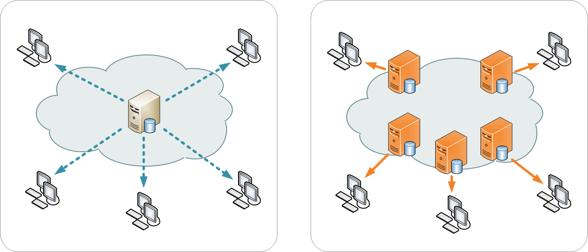



Intinya, lihat dan baca di bagian ["Kesimpulan"](#kesimpulan).

Artikel yang Anda lihat/baca sekarang ini adalah versi fafifu wasweswos nya, alias versi "Panjang x Lebar" nya, membahas kelebihan dan kekurangan beserta alasan nya yang bisa menjadi pertimbangan Anda untuk menggunakan Cloudflare.



## Apa itu Cloudflare?
**Cloudflare&reg;** (atau lengkapnya: **Cloudflare, Inc.**) adalah sebuah perusahaan Amerika Serikat yang menyediakan jasa-jasa yang diperuntukan bagi pembuat ataupun yang mengelola sebuah Web/Blog, seperti jasa jaringan pengantaran konten/_Content Delivery Network_ (CDN), pencegah serangan DDoS, mengamankan Web/Blog, Analitik, Pengelola Domain dan DNS.

Selain untuk Pembuat atau Pengelola Web/Blog, Cloudflare juga menyediakan sebuah Layanan DNS Rekursif yang di tujukan untuk semua pengguna, yang bernama [**1.1.1.1&trade;**](https://1.1.1.1) dan bahkan Cloudflare telah menyediakan Aplikasi nya agar semua orang bisa menggunakan nya dengan mudah.

Jadi, sekarang udah jelas kan Cloudflare itu apaan? Banyak sekali Web/Blog yang merekomendasikan untuk menggunakan Layanan DNS, CDN dan _Firewall_ dari Cloudflare untuk mengoptimalkan sebuah Web/Blog, tapi apakah saya perlu untuk menggunakan jasa-jasa/layanan tersebut, mengingat layanan itu Gratis?

Jawaban nya ya "entar dulu", abis ini nanti akan saya bahas dulu apa kelebihan dan kekurangan nya, karena jawaban nya akan sangat berhubungan dengan ini.

## Kelebihan menggunakan Cloudflare {#kelebihan-cloudflare}
Untuk pembahasan kali ini, saya cuma membahas kelebihan menggunakan Cloudflare sebagai CDN, Pengelola DNS dan _Firewall_ saja mengingat banyak sekali jasa/layanan dari Cloudflare itu, namun ketiga ini yang paling sering digunakan oleh para Blogger atau Pengembang/Pengelola Web dibandingkan lain nya, apalagi Layanan tersebut tersedia versi Gratisan nya.

Kelebihan menggunakan Cloudflare saya jabarkan berikut di bawah ini.

### Membuat Web/Blog menjadi lebih hemat Kuota _Bandwidth_ {#hemat-konsumsi-bandwidth-server}
Kalau kamu menggunakan Hosting yang mana Kuota _Bandwidth_ (Pita lebar) nya terbatas atau cuma dapat sedikit saja, siapa sih yang gak mau menghemat konsumsi Kuota nya? Apalagi jika Web/Blog nya ramai dikunjungi orang dan robot tiap hari?

Dengan menggunakan Layanan CDN nya, maka Anda dapat menghemat konsumsi/penggunaan _Bandwidth_ Server. 

Lho, kok bisa? Karena dengan menggunakan CDN pada Web/Blog Anda, maka ketika orang lain mengunjungi Web/Blog Anda, Peramban Web milik Pengunjung tersebut hanya mengunduh berkas-berkas statis dari Server CDN nya alih-alih dari Server Asli/Asal nya (bisa kamu sebut "Server Hosting" jika Anda menggunakan layanan Hosting).

Kira-kira, Illustrasi nya seperti berikut:


Hal inilah yang membuat konsumsi _Bandwidth_ akan menjadi jauh lebih hemat dari biasanya, apalagi jika Anda menyetel _Header_ `Cache-Control` nya dengan [benar](https://csswizardry.com/2019/03/cache-control-for-civilians), maka Anda akan bisa mengurangi konsumsi _Bandwidth_ nya secara signifikan!

Terlebih jika sistem pembiayaan untuk paket-paket pada layanan/jasa dari Cloudflare pun tidak menggunakan Sistem _Pay-as-you-Go_ (PAYG) sebagai Sistem Pembiayaan atau tidak perlu membayar tergantung pada penggunaan, melainkan itu merupakan Biaya _Flat_ per bulan saja, bahkan ada Gratisan nya juga.[^1]

Sehingga, ini akan sangat cocok bagi Anda yang memiliki Web/Blog yang kunjungan nya sangat ramai, tapi tidak mau terbebani oleh tagihan yang membludak akibat konsumsi _Bandwidth_ yang sangat besar.

[^1]: Cloudflare, "Our Plans | Pricing", [https://www.cloudflare.com/plans/](https://www.cloudflare.com/plans/) (diakses pada tanggal 19 April 2021, pukul 01:46 WIB)

### DNS Otoritatif nya yang sangat cepat, reliabel dan cukup kaya fitur {#pengelola-dns}
Tahukah Anda, bahwa Layanan [DNS Otoritatif dari Cloudflare](https://www.cloudflare.com/dns/) itu sangatlah cepat dan lumayan reliabel? Menurut data yang ada di Situs Web DNSPerf yang saya ambil pada saat saya menulis artikel ini (Pada Tanggal 15 April 2021), DNS Cloudflare menempati posisi kedua untuk kinerja mentah dengan _Uptime_ sebesar 99,93% selama 30 hari terakhir.

 

**Catatan:** Saya tidak menjamin keakuratan data di atas dalam menilai DNS Otoritatif yang ada, tapi setidaknya ini bisa dijadikan referensi bagi Anda yang ingin mencari DNS Otoritatif yang cocok untuk Web/Blog Anda dan saya sarankan Anda untuk mencarikan data pembanding untuk itu.

Jika Domain Anda terhubung ke DNS Cloudflare dan menggunakan nya sebagai Pengelola DNS dibandingkan dengan Pengelola DNS bawaan, maka Anda bisa mengurangi potensi _Downtime_ atau ketidaktersediaan pada Domain Anda, serta membuat Domain Anda dapat _di-resolve_ lebih cepat oleh pengunjung.

Kenapa bisa gitu? Karena Cloudflare telah di tenagai oleh Server-server di 200 Kota dari 100 Negara di seluruh dunia[^2] yang mana ini akan saling berkaitan, begitupun juga CDN nya. 

Jadi, jika satu server DNS Cloudflare tidak tersedia, maka hanya perlu dirute ulang ke server lain nya dan hal ini memungkinkan untuk mempercepat _Resolve_ DNS dari segi Pengunjung, karena pengunjung mendapatkan server terdekat nya saat _me-resolve_ domain yang terhubung dengan DNS Cloudflare.

Karena DNS Otoritatif dari Cloudflare merupakan Pengelola DNS Eksternal, sehingga jika Server Hosting Anda mengalami ketidaktersediaan atau _Downtime_ (alias nge-_down_), maka layanan lain seperti surel eksternal, subdomain yang terhubung ke server lain, dll, tidak akan mengalami hal demikian.

Selain itu, Pengelola DNS ini memiliki cukup kaya akan fitur. DNSSEC untuk keamanan DNS? Ada! Cloudflare mendukung hal itu[^3], Anda tinggal tambahkan Pengaturan DNSSEC pada Domain Anda melalui Pengaturan Domain bawaan. Untuk nilai-nilai nya, ikuti dengan yang ada di Cloudflare. 

"CNAME Flattening"? Ada! Fitur ini malah diaktifkan secara bawaan untuk 'root' nya saja[^4]. Anda juga bisa ekspor dan impor pengaturan DNS Anda dalam format BIND9 sewaktu-waktu jika ingin migrasi[^5]. Apakah saya bisa menikmati itu semua secara gratis? Tentu saja bisa! Anda hanya perlu menghubungkan Domain Anda ke DNS Cloudflare saja dengan mengubah _Nameserver_ nya sesuai dengan petunjuk yang ada.


[^2]: Cloudflare, "Data Center Map | CDN PoP Locations Map", [https://www.cloudflare.com/network/](https://www.cloudflare.com/network/) (diakses pada tanggal 19 April 2021, pukul 01:53 WIB)

[^3]: Cloudflare, "DNSSEC Protection | Provision and manage DNSSEC with Cloudflare", [https://www.cloudflare.com/dns/dnssec/](https://www.cloudflare.com/dns/dnssec/) (diakses pada tanggal 19 April 2021, pukul 01:56 WIB)

[^4]: Matthew Prince \(The Cloudflare Blog\), "Introducing CNAME Flattening: RFC-Compliant CNAMEs at a Domain's Root", [https://blog.cloudflare.com/introducing-cname-flattening-rfc-compliant-cnames-at-a-domains-root/](https://blog.cloudflare.com/introducing-cname-flattening-rfc-compliant-cnames-at-a-domains-root/) (diakses pada tanggal 19 April 2021, pukul 01:58 WIB)

[^5]: Cloudflare Help Center, "Importing and exporting DNS records", [https://support.cloudflare.com/hc/en-us/articles/200168856-Importing-and-exporting-DNS-records](https://support.cloudflare.com/hc/en-us/articles/200168856-Importing-and-exporting-DNS-records) (diakses pada tanggal 19 April 2021, pukul 02:01 WIB)

### Bisa menyembunyikan Alamat IP Server {#menyembunyikan-alamat-ip-server}
Dengan Anda menggunakan CDN dan melakukan _reverse-proxy_ pada Web/Blog utama Anda, maka Anda telah 'menyembunyikan' Alamat IP Server Asli nya, ini sebenarnya berlaku bagi semua CDN termasuk jika Anda menggunakan CDN dari Cloudflare.

Dengan menggunakan CDN dari Cloudflare, maka Anda telah menyembunyikan Alamat IP dari Server Asli Anda dengan _reverse-proxy_, kecuali jika Anda menggunakan Subdomain yang terpisah untuk CDN nya, dan tentunya ini bisa dilakukan secara gratis.

Ini akan sangat cocok bagi Anda yang tidak ingin 'memamerkan' Alamat IP Server nya di depan umum.

### Kompresi terhadap berkas JavaScript, CSS dan HTML {#kompresi-js-css-html}
Cloudflare memiliki fitur kompresi (_minify_) terhadap berkas JavaScript, CSS dan HTML jika Anda menggunakan CDN dari Cloudflare untuk mengoptimalkan Web/Blog Anda. Fitur tersebut bernama ["Auto Minify"](https://blog.cloudflare.com/an-all-new-and-improved-autominify).

Biasanya fitur ini dinonaktifkan secara bawaan, jadi Anda perlu mengaktifkan nya sendiri di Dasbor Cloudflare. Fitur "Auto Minify" dapat ditemukan di bagian "Speed" (yang gambarnya petir) pada Laman Dasbor Cloudflare. Berikut cuplikan nya:

 

Setelah mengaktifkan ataupun mematikan nya, maka Anda perlu _Purge Cache_ CDN Cloudflare nya terlebih dahulu, barulah opsinya bisa diterapkan sebagaimana mestinya.

### SSL Gratis dan Sertifikat nya mendukung Peramban Web yang lebih tua {#ssl-gratis}
Jika Hosting yang Anda gunakan tidak menyediakan SSL sama sekali, maka Anda bisa gunakan CDN dari Cloudflare agar Web/Blog Anda bisa diakses dengan Protokol HTTPS secara gratis, masa berlaku akan diperbarui secara otomatis oleh mereka.

Akar (atau _Root_) dari Sertifikat SSL yang digunakan nya pun telah didukung oleh Peramban Web (_Web Browser_) dari Perangkat yang lebih tua, selama Peramban Web tersebut mendukung SNI (singkatan dari "Server Name Indication") yang merupakan fitur dari protokol TLS.

Fitur tersebut dinamakan ["Universal SSL"](https://support.cloudflare.com/hc/en-us/articles/204151138-Understanding-Universal-SSL). Biasanya fitur "Universal SSL" telah diaktifkan secara bawaan jika Anda menggunakan CDN dari Cloudflare, tapi Anda bisa mengaturnya di bagian "SSL" (yang gambarnya gembok) pada Laman Dasbor Cloudflare.

Jika Anda merasa tidak perlu menggunakan SSL dari Cloudflare, maka caranya ada dua, yakni: Nonaktifkan fitur "Universal SSL" atau jangan gunakan CDN dari Cloudflare.

### *Firewall* dan Perlindungan dari Serangan DDoS {#firewall-dan-proteksi-dari-ddos}
Jika Anda menggunakan CDN dari Cloudflare, maka Anda telah meminimalisir serangan DDoS di Web/Blog Anda. Proteksi ini bekerja pada lapisan ke-3, 4 dan 7 dalam model OSI, serta Proteksi ini tidak dikenakan biaya sama sekali alias gratis[^1].

Selain itu, Cloudflare memiliki _Firewall_ yang siap melindungi Web/Blog Anda dari serangan dari luar, termasuk DDoS dan tentu saja Anda memiliki _Firewall_ bawaan yang bisa Anda atur kapan saja[^6].

[^6]: Cloudflare, "Cloudflare WAF | Web Application Firewall", [https://www.cloudflare.com/waf/](https://www.cloudflare.com/waf/) (diakses pada tanggal 19 April 2021, pukul 02:11 WIB)

## Kekurangan menggunakan Cloudflare (terutama untuk pengguna Gratisan) {#kekurangan-cloudflare}
Tadi saya sudah menyebutkan kelebihan untuk menggunakan Cloudflare, terutama untuk layanan yang sering digunakan oleh para Blogger atau Pengembang/Pengelola Situs Web, yakni CDN, Pengelola DNS dan _Firewall_ nya.

Sekarang saya bahas kekurangan nya, saya utamakan untuk pengguna Gratisan karena saya yakin bahwa mayoritas pengguna Cloudflare lebih memilih Paket "Gratis" daripada milih yang berbayar, kalaupun mampu bayar palingan cuma mentok di Paket "Pro" saja yang biaya nya cuma $20/bulan. (Jangan tersinggung yah, saya juga pake yang Gratisan juga kok, hehe 😀)

Saya tidak mempunyai data yang pasti, karena saya cuma menebak yang berdasarkan dari rute yang saya dapatkan ketika saya mengunjungi sebuah Web/Blog Anda yang menggunakan Cloudflare (lebih lanjutnya akan saya bahas setelah ini), tapi saya yakin bahwa Anda belum tentu sanggup untuk membayar uang sebesar $200 setiap bulan nya hanya untuk menyewa Paket "Business" (Bisnis), apalagi Paket "Enterprise" (Perusahaan).

Ok, tanpa basa-basi lagi, saya akan bahas kekurangan menggunakan Cloudflare (terutama untuk pengguna Gratisan) berikut di bawah ini.

### Rute CDN nya seringkali kacau
Anda mungkin berekspektasi bahwa CDN harusnya melayani pengunjungnya dekat dari Koneksi Internet yang digunakan oleh pengunjung, siapa yang tidak setuju? Tapi, Anda harus menerima kenyataan bahwa Rute yang didapatkan oleh pengunjung saat mengunjungi Web/Blog Anda yang menggunakan Cloudflare dengan paket selain "Enterprise" (apalagi Gratisan) tidak sesuai dengan ekspektasi pengunjung atau tidak mendapatkan lokasi yang dekat dengan mereka.

Seringkali pengunjung akan mendapatkan rute yang bahkan sangat jauh dari mereka, contoh: Koneksi Internet nya dari Indonesia (dengan asumsi tanpa menggunakan Proksi/VPN), ketika mengunjungi Web/Blog yang menggunakan Cloudflare Gratisan, maka Lalu Lintas akan dilarikan ke Server Los Angeles, Jepang, atau Server Acak lain nya.

Sebagai imbas nya, tidak sedikit pula pengunjung yang merasa lambat ketika mengakses nya, bahkan sampai tidak bisa diakses sama sekali.

Contoh kasus nya adalah ketika mengakses Web/Blog yang menggunakan Cloudflare Gratisan dan Paket "Pro" dari ISP Telkom misalnya, karena rute yang mereka dapatkan itu sangat jauh dari koneksi nya, sehingga banyak orang yang mengeluhkan akses ke sebuah Web/Blog[^7] [^8] [^9] [^10], bahkan sampai-sampai membuat sebuah utas di [Forum Komunitas nya](https://community.cloudflare.com/t/cant-access-website-with-isp-indonesia-telkom/169648) juga.

Sudah rute CDN nya kacau gara-gara ISP nya, terus Koneksi Internasional nya malah buruk, sehingga pantas saja jika orang-orang protes seperti itu sejak menggunakan Cloudflare sebagai CDN, terutama dari ISP Telkom/Telkomsel.

Untuk menguji koneksi Internet ke jaringan Cloudflare dari ISP Anda, salah satunya Anda bisa kunjungi Situs Web ["Cloudflare Test"](https://cloudflare-test.judge.sh).

Ketika Anda mengunjungi nya, tunggu saja sampai semua teks nya tampil dengan baik. Saya uji ini menggunakan Telkomsel, jadi jika Anda menggunakan Koneksi dari Telkomsel (saya uji ini di Kota Cirebon), maka kira-kira hasilnya sebagai berikut:


Jika ini diuji menggunakan ISP Telkom seperti IndiHome, berdasarkan pengalaman pribadi saya saat menggunakan IndiHome di Kota Cirebon (tapi belum sempat saya ambil Cuplikan nya), maka hasilnya mungkin akan sangat mirip dengan di atas.



Cuplikan di atas itu merupakan hasil krop gambar, silahkan klik di sini jika Anda ingin melihat cuplikan asli nya.

Tapi, saya tidak menjamin keakuratan cuplikan di atas tentang hasil pengujian jangkauan pusat data Cloudflare, karena saya uji ini menggunakan Koneksi dari Telkomsel (Operator: by.U) di Kota Cirebon dan pemiripan/persamaan hasil pengujian saat menggunakan ISP dari Telkom (seperti IndiHome) itu hanya berdasarkan pengalaman pribadi saat menggunakan IndiHome di Kota Cirebon, mungkin di Kota/Kabupaten atau/dan menggunakan Operator/ISP lain hasilnya akan beda.

Tapi, setidaknya ini bisa dijadikan pertimbangan bagi Anda untuk memutuskan apakah CDN Cloudflare layak atau tidak bagi Anda sebagai pemilik/pengembang Web/Blog atau/dan pertimbangan untuk mencari ISP lain untuk pengguna biasa/pengunjung yang bukan pemilik/pengembang Web/Blog, walaupun tidak 100% akurat.



Berdasarkan cuplikan di atas, maka hasil nya bisa disimpulkan sebagai berikut: 

- Rute CDN yang didapatkan saat mengunjungi kebanyakan Web/Blog yang menggunakan Cloudflare paket Gratis dari Koneksi Telkom atau Telkomsel itu sangatlah kacau dan acak, kadang ke Server Amerika Serikat, Jepang atau jarang-jarang mendapatkan rute ke Singapura.
- Berlangganan paket "Pro" tidak cukup membantu, namun terkadang ada beberapa situs web yang mendapatkan rute ke Server Hong Kong (HKG) dan paket ini jelas lebih baik daripada yang Gratisan.
- Pengguna paket "Business" biasanya akan mendapatkan rute ke Hong Kong (HKG) dan ada beberapa yang dapat Singapura (SIN), ada 1 Situs Web yang mendapatkan rute ke Negara Bagian Michigan di Amerika Serikat (DTW).
- Untuk Web/Blog yang menggunakan Paket "Enterprise" mayoritas akan mendapatkan rute ke Singapura (SIN).

Cloudflare sendiri membedakan Prioritas Lalu Lintas Jaringan nya berdasarkan paket-paket yang ada, paket "Enterprise" adalah paket yang paling diprioritaskan[^12] [^13]. Menurut saya, hal ini mereka lakukan karena biaya _Bandwidth_ yang mereka bayarkan tergolong mahal untuk melayani banyak orang, sedangkan pengguna Cloudflare sendiri kebanyakan merupakan Pengguna Gratisan dan akan terus bertambah banyak.

Sehingga, pada akhirnya mereka mengarahkan lalu lintas pengunjung yang ingin mengunjungi Web/Blog yang menggunakan Cloudflare dengan paket selain "Business"/"Enterprise" ke Server yang paling murah, yakni yang paling jauh dari Pengunjung.

Untuk mengatasi hal ini, dari segi ISP harus melakukan [_Direct-peering_](https://www.cloudflare.com/partners/peering-portal/) dengan Cloudflare[^14], tapi beberapa ISP Rumahan (berdasarkan dengan yang saya alami) seperti nya belum melakukan nya secara maksimal atau bahkan ada yang enggan untuk melakukan nya, sehingga koneksi dari ISP tertentu ke jaringan Cloudflare kurang begitu bagus, entah karena alasan apa.

Jika Anda mengetahui sesuatu atau bahkan jika Anda merupakan perwakilan dari suatu ISP (terutama terget pasaran nya adalah Pengguna Rumahan), mungkin bisa memberikan klarifikasi di kolom komentar 🙂

Kembali lagi ke hasil pengujian, kenapa saya selalu menyebutkan Telkomsel dan Telkom? Karena kedua itu yang paling menguasai jangkauan di seluruh Indonesia, bisa jadi hal ini yang membuat kedua ISP tersebut menjadi paling banyak pengguna nya.

Jadi, jika saya ingin menggunakan CDN dari Cloudflare, sedangkan kebanyakan pengunjung nya menggunakan Telkomsel, IndiHome dan Koneksi dari Jaringan Telkom lain nya, apa yang harus saya lakukan? Yah, seminimal-minimal nya Anda perlu berlangganan paket "Business", atau berlangganan Paket "Enterprise" sekalian agar mendapatkan prioritas jaringan yang terbaik.

[^7]: Syeilendra Pramuditya, "Koneksi Internet Telkom (IndiHome/Telkomsel) Tidak Bisa Akses CloudFlare?", [https://syeilendrapramuditya.wordpress.com/2020/04/29/koneksi-internet-telkom-indihome-telkomsel-tidak-bisa-akses-cloudflare/](https://syeilendrapramuditya.wordpress.com/2020/04/29/koneksi-internet-telkom-indihome-telkomsel-tidak-bisa-akses-cloudflare/) (diakses pada tanggal 11 April 2021, pukul 23:42 WIB)

[^8]: Harsh Kansagara \(Twitter: @theharshin\), [https://twitter.com/theharshin/status/1278606869691424768](https://twitter.com/theharshin/status/1278606869691424768) (diakses pada tanggal 11 April 2021, pukul 23:50 WIB)

[^9]: Diskusi Web Hosting, "Masalah Telkomsel/Telkom ?", [https://www.diskusiwebhosting.com/threads/masalah-telkomsel-telkom.34190/](https://www.diskusiwebhosting.com/threads/masalah-telkomsel-telkom.34190/) (diakses pada tanggal 11 April 2021, pukul 23:44 WIB)

[^10]: BiruDaun Web Developer, "Cloudflare? It’s time we moved on.", [https://www.indonesiadigitalmarketing.id/id/cloudflare-its-time-we-moved-on/](https://www.indonesiadigitalmarketing.id/id/cloudflare-its-time-we-moved-on/) (diakses pada tanggal 19 April 2021, pukul 06:02 WIB)

[^11]: Chris Chua \(The Cloudflare Blog\), "Good Morning, Jakarta!", [https://blog.cloudflare.com/selamat-pagi-jakarta-customers/](https://blog.cloudflare.com/selamat-pagi-jakarta-customers/) (diakses pada tanggal 19 April 2021, pukul 17:26 WIB)

[^12]: "United States Securities and Exchange Commission" dan "Cloudflare, Inc.", Halaman 79 dari Dokumen "FORM S-1 REGISTRATION STATEMENT", [https://www.sec.gov/Archives/edgar/data/1477333/000119312519222176/d735023ds1.htm](https://www.sec.gov/Archives/edgar/data/1477333/000119312519222176/d735023ds1.htm) (diakses pada tanggal 14 April 2021, pukul 22:27 WIB)

[^13]: Hunter Ray \(GitHub: judge2020\), "Explanation", [https://github.com/judge2020/cloudflare-connectivity-test/wiki/Explanation](https://github.com/judge2020/cloudflare-connectivity-test/wiki/Explanation) (diakses pada tanggal 14 April 2021, pukul 23:45 WIB)

[^14]: Dom J. H. \(Cloudflare Community\), "Peering - Why don’t I reach the closest datacenter to me?", [https://community.cloudflare.com/t/peering-why-dont-i-reach-the-closest-datacenter-to-me/76479](https://community.cloudflare.com/t/peering-why-dont-i-reach-the-closest-datacenter-to-me/76479) (diakses pada tanggal 19 April 2021, pukul 03:38 WIB)

### Proteksi DDoS Lapisan ke-7 dan CDN hanya bekerja untuk Protokol HTTP(S) saja {#proteksi-ddos-http-https}
Jika Anda ingin memproteksi Server Gim, FTP, SSH, RDP, RTMP, dan Server dengan Protokol selain HTTP(S) dari serangan DDoS, atau Anda ingin mengurangi latensi saat mengakses server Anda dengan Protokol selain HTTP(S), atau ingin mengakselerasi pengalaman memainkan gim secara daring dengan memanfaatkan CDN nya, maka Anda tidak bisa melakukan itu dengan layanan 'yang ada'.

Karena Proteksi DDoS dan CDN yang ada hanya bekerja untuk Protokol HTTP(S) saja, tidak untuk Protokol lain nya, alias hanya untuk _Webserver_ saja. Jika Anda ingin menggunakan CDN untuk Server selain _Webserver_, maka Anda perlu menggunakan [**Cloudflare Spectrum**](https://www.cloudflare.com/id-id/products/cloudflare-spectrum/) untuk itu.

Lalu, apakah fitur tersebut bisa saya peroleh secara gratis? Oh, tentu saja tidak! Untuk menggunakan nya, minimal Anda harus berlangganan Paket "Pro" terlebih dahulu dan yang bisa diproteksi/digunakan palingan cuma sebatas Server Minecraft dan SSH dengan jatah Kuota _Bandwidth_ sebesar 5 GB/bulan saja.

Atau, jadilah pelanggan paket "Business" jika Anda ingin menggunakan CDN dan memproteksi Server RDP nya juga, serta diberikan jatah _Bandwidth_ sebesar 10 GB/bulan untuk masing-masing Server. 

Lalu, bagaimana jika saya ingin menggunakan CDN dan memproteksi Server selain itu, seperti Server Gim Kustom (contoh: Server SA:MP, MTA-SA, FiveM, atau Server Gim Kustom lainnya), Server Basis Data, FTP(S), RTMP, Server Perbankan, dll? Yah, Anda perlu berlangganan paket "Enterprise" nya kalau begitu.

### Tidak bisa menggunakan _Nameserver_ Kustom {#tidak-bisa-menggunakan-nameserver-kustom}
Jika Anda ingin menggunakan _Nameserver_ Kustom di Pengelola DNS Cloudflare, contoh: `ns1.domainkamu.com`, `ns2.domainkamu.com`, dst, alih-alih cuma menggunakan `xxxx1.ns.cloudflare.com` dan `xxxx2.ns.cloudflare.com` sebagai _Nameserver_.

Hal itu bisa Anda lakukan, tapi tidak secara Gratis, minimal Anda perlu berlangganan paket "Business" untuk menggunakan fitur itu. Yap, Anda gak salah baca, minimal "Business" bukan paket "Pro".

Mahal? Bagi yang butuh cuma _Nameserver_ Kustom, mungkin iya. Tapi untuk kebanyakan kasus, seperti nya Anda belum tentu butuh fitur tersebut, kalaupun kamu butuh yah jangan gunakan Cloudflare sebagai pengelola DNS kamu 🙂

### Pengunjung bisa jadi 'kabur' jika *Firewall* nya tidak diatur {#pengunjung-bisa-kabur}
Apakah Anda pernah mengalami hal dibawah ini saat mengakses Web/Blog yang menggunakan Cloudflare:


Atau, bahkan ini:


Jika Anda pernah mengalami nya, maka bukan hanya Anda saja yang pernah mengalami nya, tapi bisa saja pengunjung Web/Blog Anda mengalami hal yang serupa saat mengunjungi Web/Blog Anda yang menggunakan CDN dari Cloudflare. Tapi jika Anda jawab "tidak" pun juga belum tentu itu berlaku ke semua orang, termasuk pengunjung Web/Blog Anda, bisa jadi mereka mengalami hal-hal di atas juga.

Penyebabnya macam-macam, salah satu yang paling sering adalah Alamat IP yang digunakan saat mengunjungi Web/Blog itu memiliki reputasi yang buruk alias "kotor". Alamat IP "kotor" ini disebabkan oleh banyak hal, seperti aktivitas _Phishing_, _Spamming_, Menyebarkan _Malware_, _Fraud_, dsb, dengan menggunakan Alamat IP tersebut.

Alamat IP yang "kotor" bukan berarti perbuatan pengunjung nya "kotor" juga, karena Alamat IP tersebut bisa digunakan oleh banyak orang, terutama saat orang berselancar dengan Internet dan Alamat IP yang digunakan tersebut akan diganti secara otomatis dalam beberapa menit hingga beberapa jam. 

Jika Anda tahu Alamat IP Dinamis (_Dynamic IP Address_) itu apa, maka itulah sistem pembagian Alamat IP dari kebanyakan ISP Rumahan yang berlaku saat ini (apalagi untuk Seluler). Masalah seperti ini akan sering terjadi jika Web/Blog Anda dikunjungi oleh ISP yang memiliki Alamat IP dengan jumlah yang tidak banyak.

Kembali lagi ketopik yang sebenarnya, menggunakan CDN dari Cloudflare maka artinya kamu telah Menggunakan _Firewall_ nya, ini yang membuat peran _Firewall_ dari Server Asli/Asal (bisa kamu sebut "Server Hosting" jika Anda menggunakan layanan Hosting) terhadap Web/Blog kamu menjadi sedikit tidak berguna.

Serta, jika pengunjung terus-terusan mengalami hal di atas, bukan nya menjadi tidak mungkin kalau pengunjung akan malas mengunjungi Web/Blog Anda, apalagi jika sampai tetap diblokir juga setelah beberapa kali mengaksesnya, atau jika Alamat IP dari Cloudflare diblokir oleh _Firewall_ dari Server Asli/Asal.

Jadi, jika Anda tidak ingin kehilangan pengunjung hanya karena pengalaman di atas, maka aturlah _Firewall_ dari Cloudflare nya dengan benar dan pastikan kalau Server Asli/Asal tidak memblokir [Alamat IP dari Cloudflare](https://www.cloudflare.com/ips/).

Atau, jika Hosting yang Anda gunakan itu menyediakan Proteksi terhadap DDoS secara gratis, maka sudah seharusnya Anda tidak perlu lagi menggunakan Proteksi DDoS atau Layanan _Firewall_ dan CDN dari Cloudflare untuk itu, cukup percayakan saja kepada pihak Hosting dan lakukan pencadangan (_backup_) secara berkala ke luar Server Asal (entah data nya disimpan ke PC, ke Penyimpanan Awan, dll).

Lagian, Web/Blog kamu belum tentu selalu menjadi target dari serangan DDoS juga, kan? Masalah melindungi Web/Blog dari serangan lain, seperti _Deface_ maka Anda bisa melakukan nya sendiri, tidak perlu sampai menggunakan CDN dari Cloudflare untuk itu.

## Kesimpulan
Setelah semua ini, apakah saya masih perlu menggunakan nya? Maka jawaban nya adalah Anda tidak disarankan menggunakan Layanan CDN Gratisan dari Cloudflare untuk Web/Blog Anda dengan dalih untuk mempercepat dan mengamankan suatu Web/Blog. 

Karena rute CDN nya yang seringkali _ngaco_ terutama jika dikunjungi menggunakan koneksi dari Telkom (salah satunya: IndiHome)/Telkomsel karena Koneksi Internasional nya buruk, maka bukan nya mempercepat malah memperlambat bahkan menghalangi orang lain mengaksesnya. Hal tersebut tidak berlaku jika Anda berlangganan Paket "Enterprise" nya.

Saya yakin bahwa masalah tersebut bukan cuma untuk 2 ISP itu saja, itupun belum sama resiko kehilangan pengunjung karena harus menyelesaikan CAPTCHA atau bahkan diblokir karena dikunjungi menggunakan Alamat IP yang "kotor" jika tidak diatur _Firewall_ nya dengan baik, ini akan sering terjadi di ISP yang memiliki jumlah Alamat IP yang sedikit.

Belum juga sama koneksi dari Server Hosting ke Cloudflare nya, kalo koneksi nya buruk atau bahkan Alamat IP Cloudflare nya sampai diblokir oleh _Firewall_ Server nya, bisa-bisa Web/Blog nya malah dianggap nge-_down_, padahal tidak sama sekali.

Jika Anda ingin menggunakan Cloudflare sebagai CDN dengan alasan apapun, maka jangan terlalu berharap terutama pada kecepatan. Saya sendiri lebih menyarankan Anda untuk menggunakan nya sebagai Pengelola DNS untuk Domain Anda, dan itu masih sangat layak digunakan tanpa perlu berlangganan apapun alias secara Gratis, karena Server DNS nya sangat cepat dan reliabel untuk versi gratis nya.

## Pertanyaan dan Jawaban yang (akan) sering ditanya {#pertanyaan-dan-jawaban}
Ini adalah bagian yang berisi tentang Pertanyaan yang (akan) sering ditanyakan, beserta Jawaban nya.

Mungkin Anda perlu membaca pertanyaan dan jawaban nya terlebih dahulu sebelum bertanya di kolom komentar sebagai referensi Anda.

### Pertanyaan ke-1: Pengunjung saya kebanyakan tidak menggunakan ISP Telkomsel/Telkom, apakah disarankan menggunakan CDN dari Cloudflare yang gratisan? {#pertanyaan-ke1}
Jawab: Tetap saja tidak terlalu disarankan, saya masih menyarankan Anda untuk menggunakan pengelola DNS nya daripada CDN nya jika Anda ingin Gratisan.

Paling utama nya tetap saja Rute CDN nya, walaupun kata kamu bagus koneksi nya, tapi itu tidak menjamin bahwa koneksi ke Jaringan Cloudflare akan baik juga kedepan dan lagipula tidak ada jaminan bahwa rute CDN yang didapat akan selalu konsisten dan akan selalu mendapatkan pusat data yang terbaik untuk pengunjung Anda, apalagi jika Anda adalah pengguna Gratisan.

### Pertanyaan ke-2: Apakah ada cara lain untuk menentukan rute CDN Cloudflare selain mengunjungi Situs Web `cloudflare-test.judge.sh`? Lalu, bagaimana Anda menebak paket Cloudflare yang digunakan oleh pemilik Web/Blog tanpa mengunjungi Situs Web tersebut? {#pertanyaan-ke2}
Jawab: Ada, caranya Anda tinggal tambahkan `/cdn-cgi/trace` setelah mengetikkan Alamat Domain/Nama Hos (_Hostname_) saat Anda ingin mengunjungi sebuah Web/Blog di Peramban Web Anda, contoh formatnya menjadi seperti ini: `https://contoh.domain.com` -> `https://contoh.domain.com/cdn-cgi/trace` 

NB: Anda tinggal ganti saja `contoh.domain.com` nya menjadi Alamat Domain/Nama Hos untuk Web Anda.

Itu merupakan sebuah alat yang disediakan oleh Cloudflare untuk membantu pemecahan masalah saat Web/Blog menggunakan CDN dari Cloudflare, salah satu contohnya adalah masalah lambatnya web/blog ketika diakses, informasi-informasi yang ditampilkan nya cukup membantu untuk usaha penyelesaian masalah.

Cuplikan dibawah ini merupakan hasil dari penggunaan `/cdn-cgi/trace` untuk nama hos `cloudflare-test.franqois.id` yang menggunakan Cloudflare Gratisan:


Seperti yang Anda lihat bahwa saya diarahkan ke Server/Pusat data yang ada di Singapura (SIN), dilihat dari `colo` nya yang bernilai `SIN`, padahal lokasi nya ada di Indonesia (`loc=ID`) dan Cloudflare mempunyai pusat data nya di Jakarta[^11].

Nah, dari sini lah saya biasanya menebak Paket Cloudflare apa yang Anda gunakan untuk Web/Blog Anda, kalau rutenya tidak sesuai dengan ekspektasi, maka saya tebak kalau kemungkinan terbesarnya Anda menggunakan CDN Cloudflare Gratisan atau bisa jadi pengguna Paket "Pro", jika sebaliknya maka bisa dipastikan kemungkinan terbesarnya menggunakan paket "Enterprise", meskipun ada kemungkinan yang menggunakan Paket "Business" juga.

Oh iya, saya tidak menggunakan koneksi dari ISP Telkomsel/Telkom (seperti: IndiHome) untuk melakukan pengujian di atas, melainkan saya menggunakan Transvision Hi-Speed yang nanti akan saya ceritakan pengalaman nya.

### Pertanyaan ke-3: Apa maksud dari 3 Huruf yang tampil di Situs Web `cloudflare-test.judge.sh` atau di `/cdn-cgi/trace`? Seperti `SIN` atau `colo=SIN`? {#pertanyaan-ke3}
Jawab: 3 Huruf itu adalah Kode IATA (singkatan dari: _International Air Transport Association_ atau bahasa Indonesia nya: Asosiasi Pengangkutan Udara Internasional), kebanyakan bandar udara (baik domestik ataupun internasional) memiliki kode ini sebagai Identifikasi.

Misalnya: `SIN` yang tampil pada hasil pengujian di [pertanyaan ke-2](#pertanyaan-ke2) itu merupakan kode IATA untuk [Bandar Udara Internasional Changi Singapura](https://id.wikipedia.org/wiki/Bandar_Udara_Internasional_Changi_Singapura).

Jadi, Cloudflare menggunakan kode IATA sebagai nama letak pusat data nya.

### Pertanyaan ke-4: Saya ingin menghemat konsumsi _Bandwidth_, tapi saya tidak ingin menggunakan CDN dari Cloudflare. Bagaimana caranya? {#pertanyaan-ke4}
Jawab: Jawaban nya ada di artikel saya yang berjudul ["Cara menghemat Konsumsi _Bandwidth_ Server"](/menghemat-konsumsi-bandwidth-server).

Silahkan Anda terapkan solusi-solusi yang bisa Anda terapkan, seperti: Mengatur _Header_ `Cache-Control`, Mengecilkan Ukuran berkas-berkas statik, Memuat berkas-berkas statik dari Server lain, dll.

Jika Anda menggunakan CDN lain selain Cloudflare juga bisa saja.

### Pertanyaan ke-5: Apakah ada referensi Layanan CDN lain selain Cloudflare? {#pertanyaan-ke5}
Jawab: Ada, banyak malah.

Jika Anda ingin Layanan CDN yang gratis, Anda bisa pertimbangkan [jsDelivr](https://www.jsdelivr.com) atau [Statically](https://statically.io), namun Anda tidak bisa mengontrol penggunaan CDN nya, karena pada dasarnya itu merupakan Layanan CDN untuk Umum, sehingga sebelum menggunakan nya, harap baca dokumentasinya dulu biar tidak menyalahgunakan nya.

Meskipun begitu, Layanan CDN seperti Statically mampu menghantarkan berkas-berkas gambar, JS, dan CSS yang tersimpan di dalam Web/Blog kamu, bukan hanya di dalam sebuah _Repository_ saja. Bahkan Statically memiliki [_Plugin_ WordPress](https://wordpress.org/plugins/statically/) nya secara resmi yang berguna untuk meng-integrasikan Statically dengan Web/Blog yang menggunakan WordPress (Hos-mandiri).

Sedangkan jika Anda ingin Layanan CDN yang murah, namun dengan kualitas yang tidak kalah dengan yang mahal yang tentunya memiliki penggunaan yang mudah, mungkin Anda bisa pertimbangkan [Bunny CDN](https://afiliasi.farrel.franqois.id/bunnycdn)\*, Anda bisa coba terlebih dahulu selama 14 Hari tanpa pengurangan fitur apapun sebelum membayar nya.


Tautan BunnyCDN di atas merupakan tautan afiliasi, jika Anda mendaftar dan membayar sebuah layanan melalui tautan tersebut, maka Anda telah memberikan dukungan terhadap saya agar saya lebih bersemangat dalam menulis artikel, karena menulis itu menguras tenaga, pikiran dan waktu. 

Tapi tenang saja, Anda tidak akan terkena biaya tambahan apapun karena afiliasi ini, saya jamin 100%.


Selain BunnyCDN, mungkin Anda bisa mencoba Layanan CDN dari Arc.io, selain mendapatkan layanan CDN yang berbasis _Peer-to-Peer_ (P2P) nya, Anda bisa mendapatkan uang juga.

Atau, jika Anda ingin Layanan CDN yang kelas dunia, namun Anda tidak ingin menggunakan [Cloudflare Enterprise](https://www.cloudflare.com/enterprise/), bisa gunakan Layanan CDN dari [Akamai](https://www.akamai.com) atau [5centscdn](https://www.5centscdn.net/) untuk lebih 'murah' nya.

Sekadar Informasi saja bahwa mayoritas ISP di Indonesia (termasuk Telkomsel/Telkom) memiliki hubungan/relasi yang baik dengan Akamai dan bahkan ada beberapa diantaranya memiliki Server _Cache_ nya sendiri sehingga akses nya akan jauh lebih cepat oleh Pengguna ISP nya, sehingga ini patut dipertimbangkan.

Layanan CDN dari _Hyperscaler_ Raksasa seperti [Google Cloud CDN](https://cloud.google.com/cdn), AWS [CloudFront](https://aws.amazon.com/id/cloudfront/)/[Global Accelerator](https://aws.amazon.com/global-accelerator/), [Alibaba Cloud CDN](https://www.alibabacloud.com/id/product/cdn) atau [Microsoft Azure CDN](https://azure.microsoft.com/services/cdn/)\*\* mungkin bisa Anda pertimbangkan juga, mengingat mayoritas dari mereka memiliki pusat data di Indonesia (khususnya di Jakarta) dengan biaya yang bisa Anda hitung sendiri dan masing-masing ada "Tingkat Gratis" nya juga, walau gak semua.

**\*\*Catatan:** Microsoft Azure CDN memiliki 3 Penyedia CDN yang (mungkin) bisa Anda pilih sendiri, yakni Akamai, Verizon EdgeCast atau CDN dari Microsoft itu sendiri. Saya bilang "mungkin" karena saya belum pernah pakai saja.

Saya tidak bisa menyebutkan selain itu, jadi saya kira cukupkan sampai sini saja untuk layanan CDN nya.

### Pertanyaan ke-6: Apa itu "Server Asli" atau "Server Asal"? {#pertanyaan-ke6}
Jawab: "Server Asli" atau "Server Asal" itu merujuk pada Server yang Anda gunakan untuk menghoskan Situs Web/Blog Anda, entah itu di Server Hosting (jika Anda menggunakan layanan _Shared Hosting_ dan layanan Hosting lainnya), Server VPS, Server Khusus _(Dedicated Server)_, Server Kolokasi _(Colocation Server)_, Server Penyimpanan _(Storage Server)_, dll.

"Server Asli" atau "Server Asal" juga merupakan Bahasa Indonesia dari "Origin Server". Kenapa disebut seperti itu oleh Penyedia CDN adalah karena cara kerja CDN itu sendiri yang berperan sebagai 'penengah'.

Maksudnya adalah saat Situs Web/Blog yang menggunakan CDN itu dikunjungi oleh pengunjung, maka Server CDN (yang biasa disebut sebagai "PoP" atau _Point of Presence_) akan "menarik" sumberdaya yang dibutuhkan dari Server Situs Web/Blog nya agar sumberdaya tersebut didistribusikan kedalam Server CDN, kemudian dikirim ke pengunjung. 

Nah, setelah dikunjungi untuk kedua kali atau seterusnya, maka sumberdaya yang diperlukan akan sepenuhnya dimuat dari Server CDN/PoP yang ada. Kira-kira, seperti itulah alasan nya.

### Pertanyaan ke-7: Apakah ini sepenuhnya salah ISP? {#pertanyaan-ke7}
**Jawab:** Tidak selalu dan tidak sepenuhnya salah juga, pihak Cloudflare dan pengguna nya juga gak bisa lepas dari ini.

Seperti yang saya bahas sebelumnya, bahwa Cloudflare juga membedakan Prioritas Jaringan berdasarkan paket-paket yang digunakan nya, artinya secara "otomatis" mereka juga 'sengaja' mengarahkan pengunjung Situs Web/Blog yang menggunakan Cloudflare Gratisan ke Server/Pusat data "termurah".

Sedangkan, pengguna CDN Cloudflare Gratisan kemungkinan akan terus bertambah sampai waktu yang belum ditentukan dengan alasan yang berbeda-beda, belum lagi ramainya pengunjung pada satu atau banyak Situs Web/Blog yang menggunakan CDN Cloudflare Gratisan yang masing-masing menghabiskan puluhan sampai ribuan GB setiap hari/setiap waktu yang bisa menjadi penyebab semua ini.

Jadi, siapa yang pantas disalahkan? Apakah pihak ISP, Cloudflare, Pengguna CDN Cloudflare yang Gratisan lain nya atau malah Anda sendiri atau malah semuanya? Silahkan Anda nilai saja sendiri.

## Penutup
Ya sudah, sepertinya pembahas di artikel ini saya cukupkan sampai sini saja. Ngomong-ngomong, saya tulis artikel ini dimulai dari tanggal 06 April 2021 dan Artikel ini terbit saat di bulan Ramadhan tahun ini, tidak terasa juga yah 🙂

Terima kasih bagi Anda yang telah membaca artikel ini. Mohon maaf jika artikel ini memiliki kekeliruan dan kesalahan, baik dari ada yang salah ngetik, terlalu panjang, bertele-tele, dll.

Serta saya juga tidak bermaksud untuk menyinggung siapapun di sini, saya cuma bermaksud untuk membahas tentang Kelebihan dan Kekurangan dari Ketiga Layanan Cloudflare yang bisa digunakan untuk Web/Blog Anda. Saya juga berharap agar pembaca bisa mempertimbangkan keputusan nya mengenai penggunaan layanan dari Cloudflare untuk Web/Blog nya setelah membaca artikel ini.

Jika adanya kesalahan dan kekeliruan dari saya, atau jika Anda memiliki pertanyaan lain nya/klarifikasi, bisa Anda berikan masukkan melalui kolom komentar yang tersedia. Masukkan dari Anda akan sangat berarti bagi saya dan artikel ini untuk kedepan nya nanti.

Terima kasih atas perhatian nya dan ~~Selamat menunaikan Ibadah Puasa Ramadhan 1442H bagi umat Muslim yang menjalankan nya 🙏 😊~~

**PEMBARUAN Jum'at, 28 Mei 2021:** Sekarang bulan Ramadhan sudah berakhir dan memasukki bulan Syawal sejak Artikel ini diperbarui. Selamat Hari Raya Idul Fitri 1442H, Mohon maaf lahir dan batin dan maaf juga kalau saya sangat telat mengucapkan nya 🙏

## Penggunaan Gambar dan Atribusi
Berkas-berkas Gambar (seperti Cuplikan layar dan Gambar lain nya) yang digunakan di dalam artikel ini, disediakan di dalam [_Repository_ Blog ini](https://github.com/FarrelF/Blog). 

Jika Anda ingin menjelajahi nya, silahkan kunjungi Alamat URL berikut:

```plaintext
https://github.com/FarrelF/Blog/tree/main/content/post/2021/04/23-apa-itu-cloudflare-dan-perlukah
```

Gambar Illustrasi yang nama berkasnya adalah `NCDN_-_CDN.png` itu merupakan Illustrasi yang dibuat oleh "Kanoha" bersumber dari [Wikimedia Commons](https://commons.wikimedia.org/wiki/File:NCDN_-_CDN.png) dan dilisensikan di bawah ["CC BY-SA 3.0 Unported"](https://creativecommons.org/licenses/by-sa/3.0/deed.en) oleh sang pembuat.

Logo Cloudflare (yang saya gunakan sebagai sampul artikel ini) merupakan Merek Dagang/Pakaian Dagang terdaftar dari **Cloudflare, Inc.** 

Jadi, logo-logo tersebut tetap milik mereka yang memiliki merek/pakaian dagang. Jika Anda ingin mengunduh dan menggunakan logo-logo tersebut, silahkan kunjungi Laman [Logo Cloudflare](https://www.cloudflare.com/logo/).
