## Pembuka

Artikel ini membahas cara menerbitkan sertifikat SSL/TLS dari [ZeroSSL](https://zerossl.com) dengan bantuan [acme.sh](https://acme.sh), memasangnya ke [Netlify](https://www.netlify.com), [bunny\.net (sebelumnya BunnyCDN)](https://afiliasi.farrelf.blog/bunny/cdn/), cPanel dan DirectAdmin lewat pemanggilan Server API memakai `curl`, lalu _me-renew_-nya secara otomatis.

Singkatnya, artikel ini adalah versi ringkas dari tutorial tersebut: hanya langkah-langkah yang Anda butuhkan. Penjelasan yang panjang-lebar (perbandingan dengan Let's Encrypt, parameter lanjutan, DNS Alias Mode, FAQ lengkap, referensi, dll) saya pindahkan ke dalam spoiler pada bab [**Materi Lanjutan**](#materi-lanjutan), jadi buka saja kalau memang ingin tahu.


**PEMBARUAN, 08 Mei 2022:** Blog ini telah memakai Google Trust Services (GTS), tidak lagi memakai ZeroSSL, tapi semua instruksi di artikel ini tidak banyak berubah.

Alur keseluruhannya kira-kira begini: buat akun ZeroSSL beserta kredensial _EAB_ → instal acme.sh → daftarkan akunnya → buat kredensial API untuk penyedia yang Anda pakai → verifikasi DNS → terbitkan sertifikat → pasang sertifikatnya lewat API → otomatiskan pembaruannya.


Bagi yang belum tahu, [ZeroSSL](https://zerossl.com) adalah salah satu CA (_Certificate Authority_) atau otoritas sertifikat yang menerbitkan, mengelola dan mencabut sertifikat SSL/TLS untuk Internet. Sedangkan [acme.sh](https://acme.sh) adalah perkakas klien untuk protokol ACME yang dibuat dengan _shell_, ringan, dan kompatibel di hampir semua sistem operasi berbasis \*nix.

Jika ada hal yang ingin Anda tanyakan, cek dulu bagian [FAQ](#pertanyaan-dan-jawaban), bisa jadi pertanyaan Anda sudah terjawab di sana.

## Kenapa ZeroSSL? {#zerossl-vs-lets-encrypt}

Ringkasnya, alasan memilih ZeroSSL adalah sebagai berikut:

- **Gratis lewat protokol ACME**, termasuk untuk _wildcard_, tanpa batas jumlah sertifikat, dan mendukung RSA maupun ECC. Sertifikatnya berlaku maksimum 90 hari. Selengkapnya di [subbagian ini](#zerossl-gratis).
- **Kompatibilitas perangkat luas.** Rantai sertifikatnya memakai akar dari Sectigo ("AAA Certificate Services" dan "USERTrust"), yang sudah dipercaya mayoritas perangkat lunak sejak lama, bahkan perangkat lawas sekalipun.
- **Tanpa _rate limit_.** Sampai artikel ini ditulis, ZeroSSL tidak memberlakukan batasan penerbitan sertifikat, jadi kegagalan penerbitan tidak mengurangi kuota Anda.
- **Ada dasbor web** untuk melihat, mengelola, dan mengunduh sertifikat yang telah Anda terbitkan.

Kalau Anda ingin tahu rinciannya (rantai kepercayaan, kisah akar "DST Root CA X3" milik Let's Encrypt, dsb), semuanya ada di spoiler [Alasan lengkap memilih ZeroSSL](#alasan-lengkap-zerossl).

### Tunggu, ZeroSSL Gratis? Bukannya bayar? {#zerossl-gratis}

Iya, gratis, bahkan untuk _wildcard_ dan dalam jumlah tak terbatas, baik RSA maupun ECC. Syaratnya: Anda harus menerbitkannya lewat **server ACME-nya**, bukan lewat situs web atau REST API-nya. Sertifikat yang diterbitkan lewat ACME berlaku maksimum 90 hari.

Sedangkan layanan berbayar ZeroSSL hanya untuk dukungan pelanggan dan akses ke REST API-nya, jadi Anda tidak perlu jadi orang kaya dulu untuk memakainya. Rinciannya ada di [dokumentasi ACME-nya](https://zerossl.com/documentation/acme/).

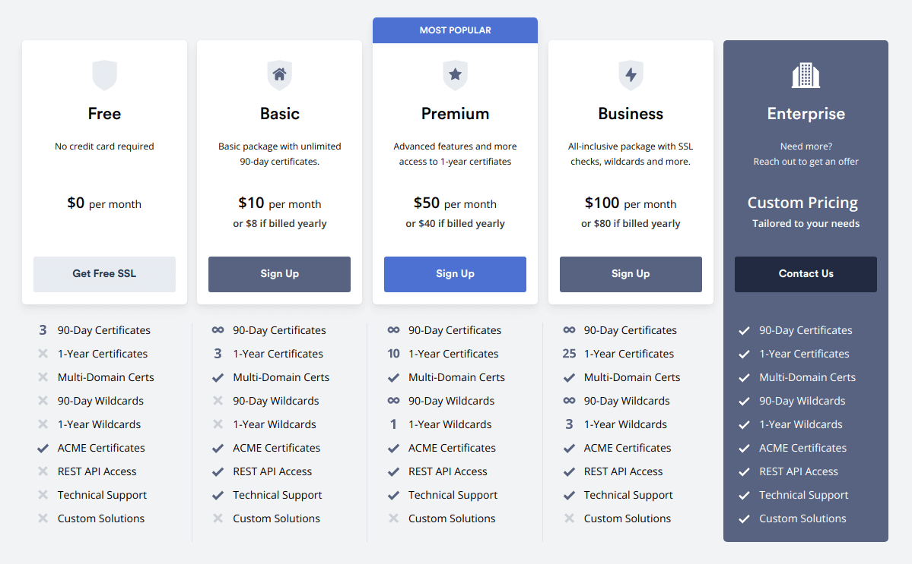

## Persiapan {#persiapan}

Di artikel ini Anda akan memakai acme.sh, yang (harusnya) hanya kompatibel dengan sistem operasi berbasis Unix atau mirip Unix (\*nix). Jadi, siapkan dulu kemampuan dasar _shell_ Anda: `ls`, `cd`, variabel seperti `$HOME` dan `$PATH`, fitur `~`, _copy-paste_ dari luar ke Terminal, mengetahui _shell_ yang dipakai, dan mengedit berkas di dalam Terminal.

"Terminal" di sini maksudnya aplikasi _terminal emulator_ seperti GNOME Terminal, Konsole, Windows Terminal, Git Bash, dan sejenisnya.

| Sistem operasi | Yang perlu disiapkan |
| --- | --- |
| GNU/Linux, macOS, BSD, dll | OpenSSL (atau LibreSSL), `curl`, dan Cron (atau _Systemd Timer_) |
| Windows | WSL 2 (disarankan), atau Git Bash/Cygwin, mesin virtual/kontainer, atau akses SSH ke perangkat \*nix |
| Android 7.0 ke atas | Termux beserta paket `curl`, `wget`, `openssl-tool`, `jq`, `cronie`, dan `termux-services` |

#### Untuk Pengguna GNU/Linux, macOS, BSD dan Sistem Operasi berbasis \*nix lainnya {#persiapan-pengguna-unix-like}

- OpenSSL (atau LibreSSL)
- `curl`
- Cron (atau Systemd Timer untuk pengguna Systemd)
- Socat (_Socket Cat_) — opsional, hanya untuk yang ingin menjalankan acme.sh dalam _standalone mode_, yang tidak dibahas di artikel ini

#### Untuk Pengguna Windows {#persiapan-pengguna-windows}

acme.sh butuh lingkungan \*nix, jadi siapkan salah satu caranya:

- Mengaktifkan [WSL 2](https://learn.microsoft.com/en-us/windows/wsl/install) untuk Windows 10 ke atas (disarankan)
- Memakai perangkat lunak emulasi UNIX seperti Git Bash atau Cygwin (belum saya coba)
- Mesin virtual atau kontainer dengan sistem operasi \*nix
- Mengakses perangkat \*nix lain lewat klien SSH

Setelah itu, ikuti [persiapan untuk sistem operasi \*nix](#persiapan-pengguna-unix-like) di lingkungan tersebut.

#### Untuk Pengguna Android (tidak perlu akses _root_) {#persiapan-pengguna-android}

1. Pakai Android 7.0 ke atas (syarat minimum Termux). Di bawah itu, silakan ikuti [panduannya](https://github.com/termux/termux-app/wiki/Termux-on-android-5-or-6), tapi saya tidak bisa menjamin artikel ini tetap bisa diikuti.
2. Instal Termux, idealnya lewat [F-Droid resminya](https://f-droid.org/repository/browse/?fdid=com.termux). Versi [Google Play Store](https://play.google.com/store/apps/details?id=com.termux) masih bersifat eksperimental.
3. Buka Termux, lalu jalankan:

    ```shell
    pkg upg -y
    pkg i -y curl wget openssl-tool jq cronie termux-services
    ```

4. Mulai ulang Termux, kemudian aktifkan layanan cron-nya:

    ```shell
    sv-enable crond && sv up crond
    ```

5. Supaya praktis, kerjakan semuanya dari komputer lewat SSH; caranya saya bahas di [artikel ini](https://farrelf.blog/cara-menggunakan-termux-dari-komputer/).

**Catatan:** Semua langkah di atas bisa dilakukan tanpa akses _root_ sama sekali, jadi Anda tidak perlu khawatir soal garansi perangkat.

### Membuat Akun ZeroSSL dan mendapatkan Kredensial EAB-nya {#membuat-akun-zerossl}

Sebelum menerbitkan sertifikat, daftar dulu [akun ZeroSSL](https://app.zerossl.com/signup) (atau [login](https://app.zerossl.com/login) kalau sudah punya). Anda tidak perlu menerbitkan sertifikat di sana, cukup ambil kredensial _EAB_ (_External Account Binding_) saja, yaitu **"EAB KID"** dan **"EAB HMAC Key"**. Kredensial inilah yang menghubungkan acme.sh dengan akun ZeroSSL Anda.

Langkah-langkahnya:

1. Login ke [Dasbor ZeroSSL](https://app.zerossl.com/login).
2. Klik **"Developer"**.
3. Pada bagian **"EAB Credentials for ACME Clients"**, klik tombol **"Generate"**.
4. Simpan **"EAB KID"** dan **"EAB HMAC Key"** yang muncul, nanti dipakai untuk acme.sh.
5. Klik **"Done"**, selesai.

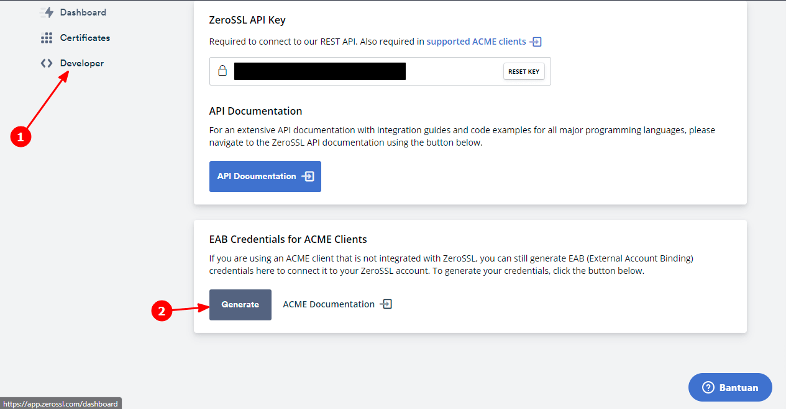 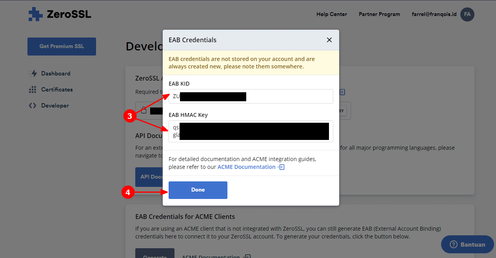

Kredensial EAB bisa dipakai berulang kali, jadi simpan baik-baik dan jangan beritahu siapa pun kecuali orang yang Anda percayai.

### Instal acme.sh {#install-acme-sh}

Anda tidak perlu akun `root` atau `sudo` untuk menginstal acme.sh, cukup pakai akun Anda biasanya. Eksekusi salah satu perintah berikut:

```shell
curl https://get.acme.sh | sh -s email=emailku@domain.com
```

Atau dengan GNU Wget:

```shell
wget -O - https://get.acme.sh | sh -s email=emailku@domain.com
```

Tambahkan `--force` jika Anda tidak ingin acme.sh memasang _cron job_ bawaannya:

```shell
curl https://get.acme.sh | sh -s email=emailku@domain.com --force
```

Ganti `emailku@domain.com` dengan alamat surel Anda. Setelah itu, pastikan acme.sh bisa dieksekusi dengan `acme.sh --version`. Kalau belum dikenal, tutup Terminal lalu buka lagi, atau tambahkan baris berikut ke `~/.bashrc` (atau `~/.zshrc`):

```shell
source ~/.acme.sh/acme.sh.env
```

Pengguna `fish` bisa memakai perintah berikut, lalu simpan di `~/.config/fish/conf.d/acme.sh.fish`:

```fish
fish_add_path "$HOME"/.acme.sh
set -xU LE_WORKING_DIR "$HOME"/.acme.sh
```

(Variannya untuk `fish` versi di bawah 3.2.0: `set -Ua fish_user_paths "$HOME"/.acme.sh`.)

### Registrasi Akun melalui acme.sh {#registrasi-akun-acme-sh}

Secara baku acme.sh memakai ZeroSSL sebagai CA-nya, jadi untuk pemakaian pertama, daftarkan akun ZeroSSL Anda ke Server ACME-nya:

```shell
acme.sh --register-account \
        --eab-kid EAB_KID_KAMU_DI_SINI \
        --eab-hmac-key EAB_HMAC_KEY_KAMU_DI_SINI
```

Ganti `EAB_KID_KAMU_DI_SINI` dan `EAB_HMAC_KEY_KAMU_DI_SINI` dengan kredensial EAB yang sudah Anda simpan tadi. Simpan juga `ACCOUNT_THUMBPRINT`-nya, barangkali suatu saat Anda ingin memakai [Stateless Mode](https://github.com/acmesh-official/acme.sh/wiki/Stateless-Mode); kalau hilang, cukup jalankan `acme.sh --register-account` lagi.

### Membuat Akses API

Sebelum menerbitkan sertifikat, buat dulu kode token untuk akses API-nya. Token ini dipakai untuk verifikasi DNS sekaligus untuk memasang sertifikatnya nanti, jadi Anda **wajib** membuatnya, tapi cukup untuk layanan yang benar-benar Anda pakai.

Misalnya, kalau DNS-nya di Cloudflare dan hosting-nya di Netlify, maka Anda hanya perlu membuat token Cloudflare (untuk verifikasi DNS) dan token Netlify (untuk memasang sertifikat). Kalau Anda sudah pernah membuatnya, langsung saja ke [Verifikasi DNS di acme.sh](#verifikasi-dns-di-acmesh).


Satu aturan yang sama untuk semuanya: kode token hanya bisa dilihat **sekali saja**, jadi simpanlah baik-baik dan jangan sampai diketahui orang lain.


#### Penyedia DNS Cloudflare {#cloudflare-api-token}

Untuk membuat kode token API-nya (`CF_Token` dan `CF_Account_ID`), silakan ikuti [dokumentasinya](https://developers.cloudflare.com/fundamentals/api/get-started/create-token/). Intinya:

1. Buat token baru, lalu pilih templat **"Edit zone DNS"** — atau pada **Permissions** pilih **"Zone"**, **"DNS"** dan **"Edit"** — agar acme.sh bisa mengubah catatan DNS untuk verifikasi.
2. Simpan kode token yang muncul (hanya tampil sekali), beserta **"Account ID"** dan (opsional) **"Zone ID"** dari dasbor Cloudflare.

#### Netlify {#netlify-personal-access-token}

Token ini dipakai untuk verifikasi DNS (kalau DNS-nya di Netlify) sekaligus untuk memasang sertifikatnya nanti.

0. Buka [halaman Personal access tokens](https://app.netlify.com/user/applications) dan login bila diminta.
1. Klik tombol **"New access token"**.

    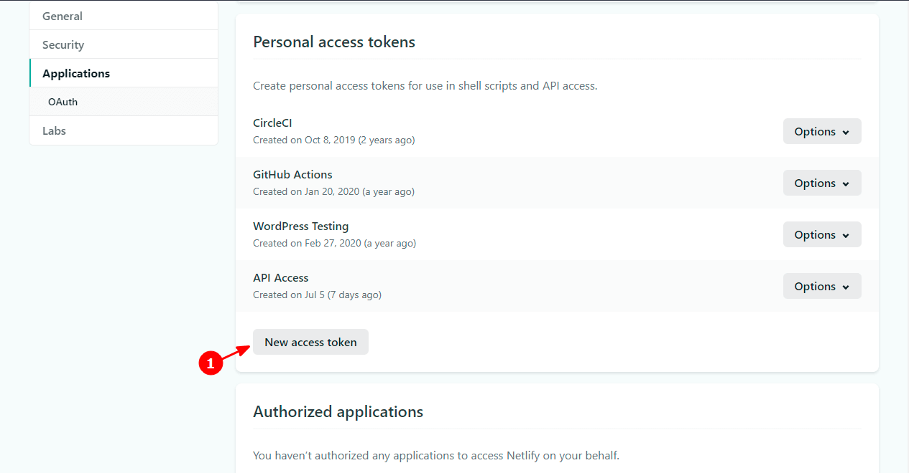

2. Masukkan nama/deskripsi token.
3. Klik **"Generate"** untuk menghasilkan tokennya.

    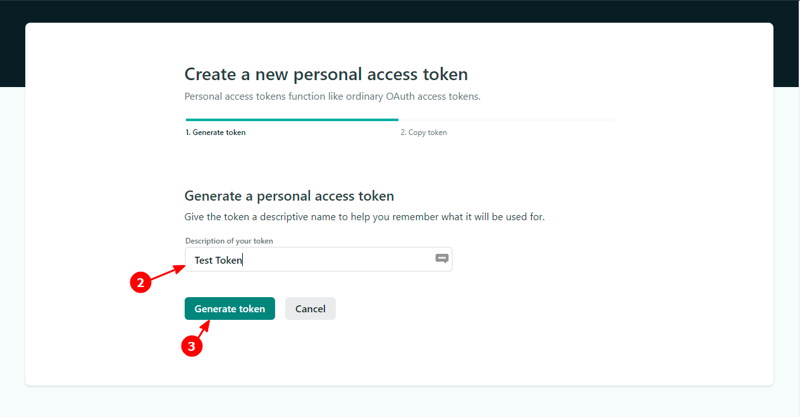

4. Simpan **"Access Token"** yang muncul karena tidak akan tampil lagi.
5. Klik **"Done"**.

    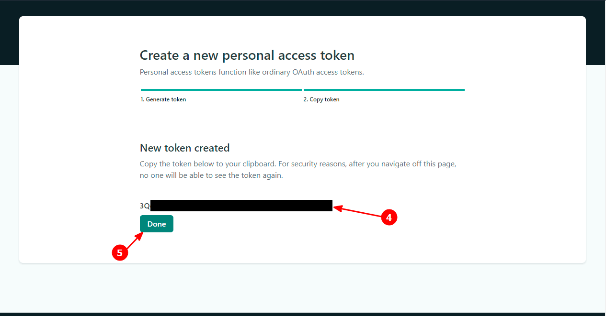

Selain itu, Anda juga membutuhkan **"Site ID"** (nama lainnya: **"API ID"**) untuk memasang sertifikat. Caranya: buka **"Site settings"** → **"General"** → **"Site details"**, lalu salin **"API ID"**-nya. Anda juga boleh memakai nama domain Anda sebagai penggantinya.

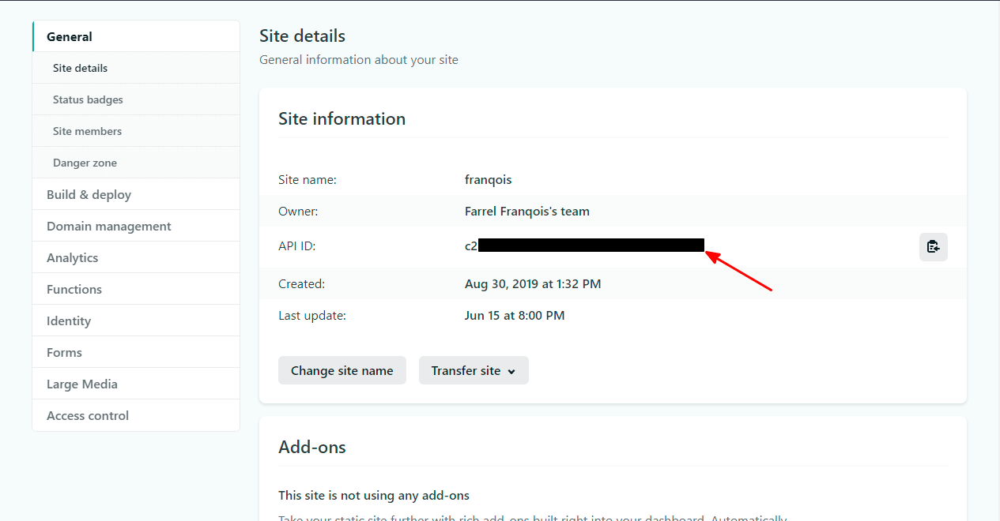

#### bunny\.net (sebelumnya BunnyCDN) {#bunny-access-key}

Untuk memasang sertifikat, Anda membutuhkan **"Access Key"** dan **"Pull Zone ID"**.

**"Access Key"**: buka [Dasbor bunny.net](https://dash.bunny.net/), klik foto profil → **"Account settings"** → **"API Key"**, lalu salin isinya (klik ikon papan klip, atau ikon mata untuk melihat isannya).

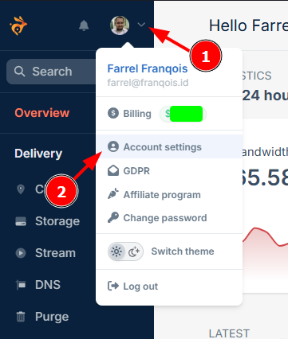 

**"Pull Zone ID"**: buka **"Delivery"** → **"CDN"** → pilih _Pull Zone_ Anda. Angka di akhir alamat URL adalah _Pull Zone ID_-nya:

```plain
https://dash.bunny.net/cdn/ANGKA_YANG_MUNCUL
```

Pastikan Anda sudah membuat **"Custom Hostname"** di _Pull Zone_ tersebut, karena sertifikat tidak bisa dipasang ke subdomain bawaan bunny\.net (`b-cdn.net`).

#### cPanel {#cpanel-api-token}


Fitur ini masih berstatus eksperimental, jadi tanggung sendiri risikonya, misalnya perubahan perilaku yang cepat.


1. Login ke cPanel memakai **akun cPanel** (bukan akun _billing_).
2. Cari dan buka **"Manage API Tokens"** di bagian **"Security"**.

    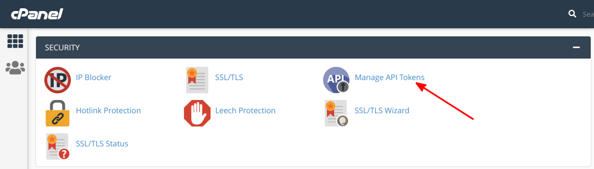

3. Lengkapi pembuatan tokennya:

    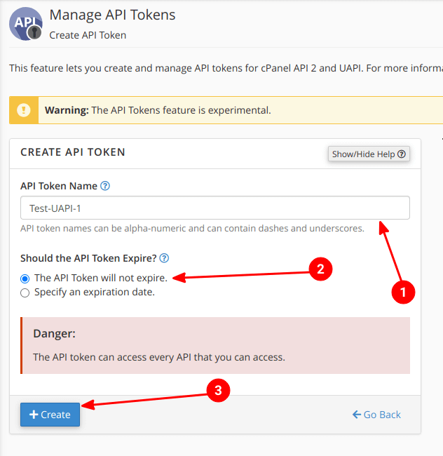

    - **API Token Name:** nama bebas, hanya boleh alfanumerik, tanda hubung, dan garis bawah; peka huruf besar/kecil.
    - **Should the API Token Expire?:** pilih **"The API Token will not expire"** agar token tidak kedaluwarsa (kalau mau ada masa berlakunya, pastikan Anda bisa memperbaruinya secara otomatis).

4. Klik **"Create"** (bahasa Indonesia: **"Buat"**).
5. Simpan _API Token_ yang hanya tampil sekali itu, centang **"Create another token after I click Yes, I saved my token."**, lalu klik **"Yes, I Saved My Token"**.

    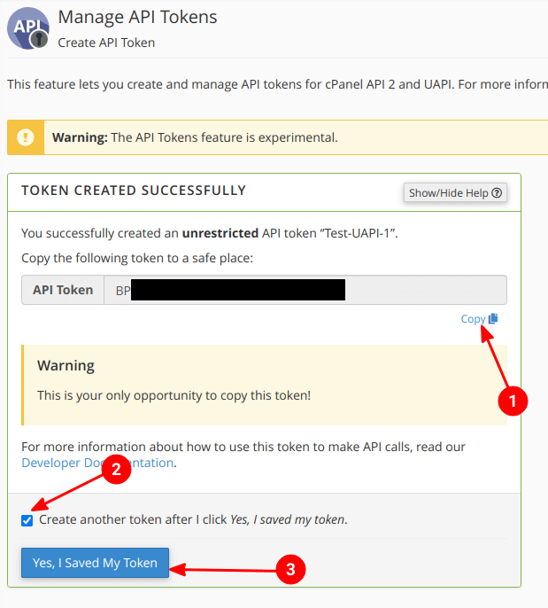

Untuk memasang sertifikat lewat API cPanel, Anda juga membutuhkan [`jq`](https://jqlang.github.io/jq/), jadi silakan instal dulu di perangkat Anda.

#### DirectAdmin {#directadmin-login-key}

Sebaiknya buat **"Login Key"** khusus (bukan memakai kata sandi akun) agar hak aksesnya bisa dibatasi, misalnya hanya untuk perintah SSL.

1. Login ke DirectAdmin memakai **akun DirectAdmin** (bukan akun _billing_).
2. Cari **"Login Keys"**, lalu klik hasilnya.

    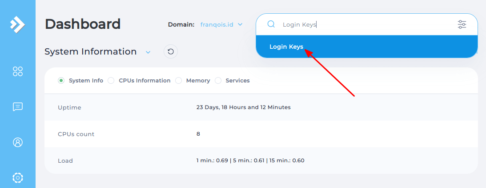

3. Klik tombol **"Create"**, lalu lengkapi informasinya:

    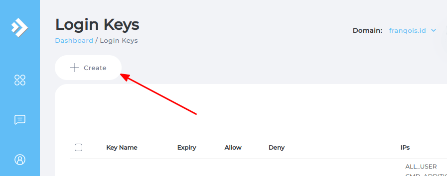
    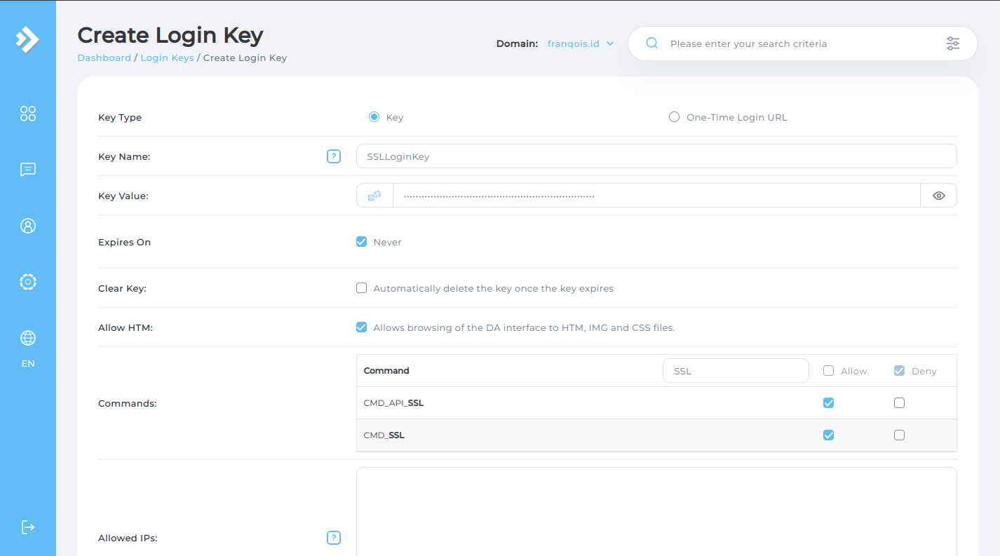

    - **Key Type:** pilih **"Key"**.
    - **Key Name:** hanya boleh karakter alfanumerik, tanpa simbol dan spasi.
    - **Key Value:** klik ikon dadu agar nilainya dibuat acak; jangan pakai kata sandi Anda.
    - **Expires On:** centang **"Never"** saja, kecuali Anda bisa memperbaruinya secara terprogram.
    - **Commands:** centang **"Deny"** untuk semua perintah, lalu cari kata kunci **"SSL"** dan izinkan (kolom **"Allow"**) hanya `CMD_API_SSL` dan `CMD_SSL`.
    - **Allowed IPs:** kosongkan saja agar semua IP boleh memakai kunci ini, kecuali Anda punya kebutuhan khusus.
    - **Current Password:** isi dengan kata sandi akun DirectAdmin Anda sekarang.

4. Klik **"Create"**, lalu simpan **"Key Value"** yang tampil (hanya tampil sekali) dan tutup dengan mengklik ikon silangnya.

    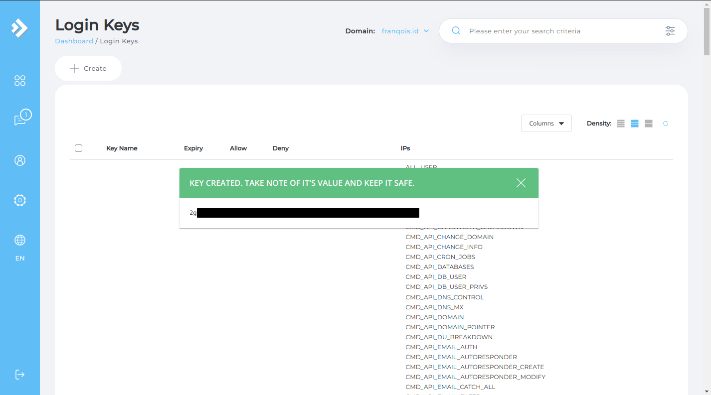

### Verifikasi DNS di acme.sh

Untuk menerbitkan sertifikat lewat protokol ACME, Anda harus membuktikan kepemilikan domain lewat sebuah tantangan (_challenge_). Metode yang dipakai di artikel ini adalah **verifikasi DNS**: acme.sh membuat/mengubah catatan DNS di domain Anda, lalu CA memeriksanya.

Verifikasi DNS ini:

- tidak butuh _web server_, jadi bisa dijalankan dari perangkat apa saja (komputer, ponsel, server, dll);
- menjadi syarat agar bisa menerbitkan sertifikat _wildcard_ (`*.domain.com`);
- wajib dibuat otomatis, karena sertifikat hanya berlaku 90 hari dan akan _di-renew_ berulang kali.

Otomatis berarti acme.sh perlu kredensial akses API ke penyedia DNS Anda. Anda memang bisa melakukannya secara manual (menambahkan catatan DNS sendiri), tapi capek, 'kan, mengulanginya tiap 90 hari?

#### Untuk Pengguna DNS Otoritatif Cloudflare {#untuk-pengguna-cloudflare}

Anda membutuhkan `CF_Token` dan `CF_Account_ID`, serta (opsional) `CF_Zone_ID` supaya acme.sh bisa langsung menargetkan zona tanpa perlu mencarinya. Caranya membuatnya ada di [subbagian Cloudflare](#cloudflare-api-token). Masukkan ke variabel berikut (langsung di Terminal):

```shell
export CF_Token="API_TOKEN_KAMU_DI_SINI"
export CF_Account_ID="ACCOUNT_ID_KAMU_DI_SINI"
export CF_Zone_ID="ZONE_ID_KAMU_DI_SINI" # opsional
```

Catatan: kalau `CF_Zone_ID` diisi, maka konfigurasinya disimpan di berkas konfigurasi domain, bukan di `~/.acme.sh/account.conf`.

#### Untuk Pengguna Netlify DNS {#untuk-pengguna-netlify-dns}

Cukup dengan **"Personal Access Token"** yang sudah Anda buat di [subbagian Netlify](#netlify-personal-access-token):

```shell
export NETLIFY_ACCESS_TOKEN="ACCESS_TOKEN_KAMU_DI_SINI"
```

#### Untuk Pengguna Bunny DNS {#untuk-pengguna-bunny-dns}

Cukup dengan **"Access Key"** yang sudah Anda ambil di [subbagian bunny\.net](#bunny-access-key):

```shell
export BUNNY_API_KEY="ACCESS_KEY_KAMU_DI_SINI"
```

#### Untuk Pengguna Penyedia DNS lain {#untuk-pengguna-dns-lain}

Kalau Anda memakai penyedia DNS selain Cloudflare, Netlify DNS dan Bunny DNS (misalnya Route 53, Google Cloud DNS, Hurricane Electric, NS1, ClouDNS, dll), silakan baca [halaman dokumentasi dnsapi-nya](https://github.com/acmesh-official/acme.sh/wiki/dnsapi) karena variabel dan caranya berbeda-beda tiap penyedia.

Variabel ini cukup disetel sekali sebelum menerbitkan sertifikat; setelah berhasil, acme.sh akan menyimpannya sendiri. (Pengguna `fish`: gantikan `export X="Y"` dengan `set -x X "Y"`.)

## Menerbitkan Sertifikat TLS dengan acme.sh {#menerbitkan-sertifikat-ssl}

### Menerbitkan Sertifikat TLS (Wajib dipelajari) {#issue-cert}

Format perintah dasarnya:

```shell
acme.sh --issue -d www.domain.com -d domain.com METODE_VERIFIKASI PARAMETER_TAMBAHAN
```

- Setiap `-d` adalah domain yang dijangkau sertifikat; boleh diulang sebanyak yang Anda mau.
- Domain **pertama** yang Anda masukkan menjadi "Common Name"/"Subject"/"Issued to" sekaligus nama direktori penyimpanan berkasnya. Domain berikutnya hanya masuk ke SAN (_Subject Alternative Name_).

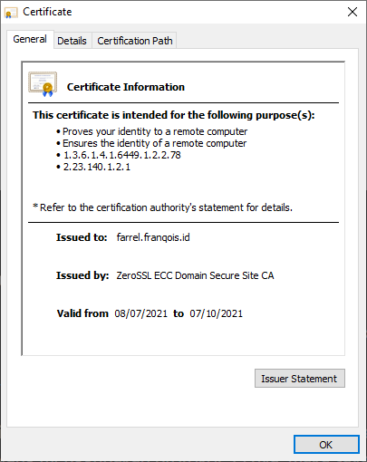 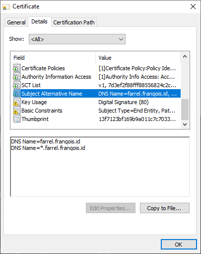

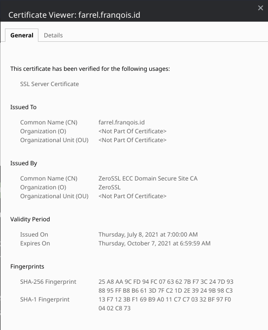 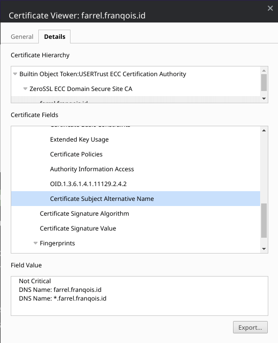

Perintah lain yang perlu Anda ketahui: `--renew` (memperbarui), `--renew-all` (memperbarui semua, tanpa `-d`), `--revoke` (mencabut), dan `--remove` (menghapus dari perangkat Anda).


Saat sedang belajar, selalu tambahkan `--test` atau `--staging` agar dijalankan dalam mode pengujian dan tidak kena _rate limit_ asli.

Saat memperbarui sertifikat mode uji, tambahkan `--force --server letsencrypt_test`, karena acme.sh akan otomatis membalikkan CA-nya ke Let's Encrypt versi produksi.

Kalau sudah yakin, terbitkan ulang untuk produksi dengan `--issue --force` tanpa `--test`/`--staging`.


#### Metode Verifikasi (`METODE_VERIFIKASI`)

Untuk artikel ini, metode yang dipakai adalah DNS (`--dns nama_dns`), misalnya `--dns dns_cf` untuk Cloudflare. Selain itu tersedia `--webroot` (atau `-w`), `--apache`, `--nginx`, dan `--standalone`; penjelasannya beserta daftar parameter lainnya ada di spoiler [Parameter lanjutan acme.sh](#parameter-tambahan).

#### Setelah menerbitkan Sertifikat TLS

Kalau berhasil, keluarannya kira-kira seperti ini:

```plain
[Kam 12 Agu 2021 02:14:50  WIB] Cert success.
[Kam 12 Agu 2021 02:14:50  WIB] Your cert is in: /home/username/.acme.sh/domain.com/domain.com.cer
[Kam 12 Agu 2021 02:14:50  WIB] Your cert key is in: /home/username/.acme.sh/domain.com/domain.com.key
[Kam 12 Agu 2021 02:14:50  WIB] The intermediate CA cert is in: /home/username/.acme.sh/domain.com/ca.cer
[Kam 12 Agu 2021 02:14:50  WIB] And the full chain certs is there: /home/username/.acme.sh/domain.com/fullchain.cer
```

Berkas inilah yang nanti Anda kirimkan ke Netlify, bunny\.net, cPanel, atau DirectAdmin:

- Penyedia yang butuh **3 informasi**: `domain.com.cer` (sertifikat), `domain.com.key` (kunci), `ca.cer` (sertifikat penengah/CA)
- Penyedia yang butuh **2 informasi**: `fullchain.cer` (gabungan `domain.com.cer` + `ca.cer`) dan `domain.com.key`

Berkas `.csr`, `.csr.conf` dan `.conf` tidak perlu dikirimkan; ketiganya dipakai oleh acme.sh untuk keperluan pembaruan dan konfigurasi.

### Menerbitkan Sertifikat TLS dengan menggunakan DNS sebagai Metode Verifikasi (Wajib dipelajari) {#verifikasi-dns}

Tinggal tambahkan parameter `--dns nama_dns`. Contoh untuk 1 domain dan 1 subdomain dengan DNS Cloudflare:

```shell
acme.sh --issue -d www.domain.com -d domain.com --dns dns_cf
```

Penyedia DNS lain? Ganti saja `dns_cf`-nya, misalnya `dns_netlify`:

```shell
acme.sh --issue -d www.domain.com -d domain.com --dns dns_netlify
```

Kalau verifikasi sering gagal karena DNS belum terpropagasi, tambahkan `--dnssleep durasi` (dalam detik):

```shell
acme.sh --issue -d www.domain.com -d domain.com --dns dns_netlify --dnssleep 300
```

Sebelum memakainya, pastikan kredensial penyedia DNS Anda sudah masuk lewat bagian [Verifikasi DNS di acme.sh](#verifikasi-dns-di-acmesh).

### Menerbitkan Sertifikat TLS untuk Banyak Domain dan Subdomain {#multi-domain}

Cukup ulangi parameter `-d` untuk setiap domain. Untuk 2 domain dan 4 subdomain:

```shell
acme.sh --issue -d domain1.com -d www.domain1.com -d sub.domain1.com -d domain2.com -d www.domain2.com -d sub.domain2.com
```

Untuk 4 domain saja:

```shell
acme.sh --issue -d domain1.com -d domain2.com -d domain3.com -d domain4.com
```

Bahkan metode verifikasinya boleh berbeda-beda per domain — contohnya ada di spoiler [Parameter lanjutan acme.sh](#parameter-tambahan).

### Menerbitkan Sertifikat TLS yang menjangkau Seluruh Subdomain {#wildcard-ssl}

Untuk _wildcard_, tambahkan `-d '*.domain.com'` **dan** wajib memakai verifikasi DNS:

```shell
acme.sh --issue -d '*.domain.com' -d domain.com --dns dns_cf
```

Beberapa catatan singkat:

- **Kenapa dikutip?** Karena sebagian _shell_ (cth. Zsh) memperlakukan tanda bintang dengan berbeda jika tidak dikutip.
- **Kenapa _wildcard_-nya di awal?** Supaya _wildcard_-nya yang tampil sebagai "Common Name"-nya. Ini cuma selera, domain pertama yang Anda masukkan memang jadi "Common Name"-nya.
- **Menjangkau `sub.sub.domain.com`?** Tidak, hanya `sub1.domain.com`, `sub2.domain.com`, dst. Untuk sub-subdomain, tambahkan lagi `-d '*.sub.domain.com' -d sub.domain.com`.

Kalau penyedia DNS Anda tidak didukung acme.sh atau Anda tidak mau memberikan akses API ke domain utama, ada metode [DNS Alias Mode](#dns-alias-mode) yang bisa Anda pelajari di bab [Materi Lanjutan](#materi-lanjutan).

## Memasang Sertifikat TLS {#memasang-ssl}

Setelah sertifikat terbit, pasang ke penyedia web Anda. Di sini saya bahas cara memasangnya lewat pemanggilan Server API memakai `curl` (bukan lewat unggah manual di antarmuka web), karena cara inilah yang nanti bisa Anda otomatiskan.

Sudah ada [_Pull Request_](https://github.com/acmesh-official/acme.sh/pull/5061) agar acme.sh menyediakan _deploy hook_ bawaan untuk Netlify, DirectAdmin, CacheFly, Edgio, dan KeyHelp. Kalau sudah _merge_ dan teruji, tutorial manual di bawah ini akan saya sederhanakan memakai _deploy hook_ saja.

Sebelum mulai, pastikan Anda sudah berada di direktori tempat berkas sertifikat tersimpan:

```shell
cd "$HOME"/.acme.sh/domain.com
```

Berkas yang dipakai: sertifikat (`domain.com.cer` atau `fullchain.cer`), kunci (`domain.com.key`), dan bila diminta, sertifikat CA (`ca.cer`).

### Di Netlify {#pasang-ssl-di-netlify}

Kebutuhannya: **"Personal Access Token"** dan **"Site ID"** — keduanya sudah dibuat di [subbagian Netlify](#netlify-personal-access-token).

Simpan isi berkasnya ke variabel (netlify menerima sertifikat dalam bentuk teks biasa tanpa jeda baris, makanya konversi dulu):

```shell {linenos=true}
NETLIFY_PLAIN_CERT="$(sed 's/$/\\n/' domain.com.cer | tr -d '\n')"
NETLIFY_PLAIN_KEY="$(sed 's/$/\\n/' domain.com.key | tr -d '\n')"
NETLIFY_PLAIN_CA="$(sed 's/$/\\n/' ca.cer | tr -d '\n')"
NETLIFY_ACCESS_TOKEN="ACCESS_TOKEN_KAMU_DI_SINI"
```

Lalu panggil API-nya:

```shell {linenos=true}
curl -s \
     -H "Authorization: Bearer $NETLIFY_ACCESS_TOKEN" \
     -H "content-type: application/json" \
     -d "{\"certificate\": \"$NETLIFY_PLAIN_CERT\", \"key\": \"$NETLIFY_PLAIN_KEY\", \"ca_certificates\": \"$NETLIFY_PLAIN_CA\"}" \
     "https://api.netlify.com/api/v1/sites/SITE_ID_KAMU_DI_SINI/ssl"
```

Ganti `SITE_ID_KAMU_DI_SINI` dengan _Site ID_, domain, atau subdomain Anda. Kalau sukses, keluarannya JSON berisi `"state":"custom"` dan daftar `domains` yang memakai sertifikat baru itu:

```json
{"id":"5dxxxxxxxxxxxxxxxxxxxxxx","state":"custom","domains":["*.domain.com","domain.com"],"custom":true,"renewable":false}
```

Kalau gagal, pesan galatnya bervariasi tergantung penyebabnya.

### Di bunny\.net (Sebelumnya: BunnyCDN) {#pasang-ssl-di-bunnycdn}

Kebutuhannya: **"Access Key"**, **"Pull Zone ID"**, dan **"Custom Hostname"** — sudah dibuat di [subbagian bunny\.net](#bunny-access-key).

bunny\.net meminta sertifikat dan kuncinya dalam bentuk Base64:

```shell {linenos=true}
BUNNY_BASE64_FULLCHAIN="$(openssl base64 -A < fullchain.cer)"
BUNNY_BASE64_KEY="$(openssl base64 -A < domain.com.key)"
BUNNY_ACCESS_KEY="ACCESS_KEY_KAMU_DI_SINI"
```

Lalu panggil API-nya:

```shell {linenos=true}
curl -s \
     -H "Accept: application/json" \
     -H "AccessKey: $BUNNY_ACCESS_KEY" \
     -H "Content-Type: application/json" \
     -d "{\"Hostname\": \"CUSTOM_HOSTNAME_KAMU_DI_SINI\", \"Certificate\": \"$BUNNY_BASE64_FULLCHAIN\", \"CertificateKey\": \"$BUNNY_BASE64_KEY\"}" \
     "https://api.bunny.net/pullzone/PULL_ZONE_ID_KAMU_DI_SINI/addCertificate"
```

Ganti `PULL_ZONE_ID_KAMU_DI_SINI` dengan ID _Pull Zone_ dan `CUSTOM_HOSTNAME_KAMU_DI_SINI` dengan nama hos kustom di dalamnya. Kalau sukses, tidak ada pesan yang tampil (kode status [204 No Content](https://http.cat/204)); kalau gagal, pesan galat akan muncul.

### Di cPanel {#pasang-ssl-di-cpanel}

Kebutuhannya: **"API Token"** dari [subbagian cPanel](#cpanel-api-token), `jq`, alamat domain, nama pengguna cPanel, serta alamat dan port cPanel Anda (port `2083` untuk HTTPS atau `2082` untuk HTTP, contoh: `contoh-domain.id:2083`).

Pemasangan lewat cPanel memakai metode GET dengan data yang di-_URI encode_:

```shell {linenos=true}
CPANEL_PLAIN_CERT="$(jq -sRr @uri < domain.com.cer)"
CPANEL_PLAIN_KEY="$(jq -sRr @uri < domain.com.key)"
CPANEL_PLAIN_CA="$(jq -sRr @uri < ca.cer)"
CPANEL_SCHEME="https" # Pakai https atau http, baku: https
CPANEL_ENDPOINT="contoh-domain.id:2083"
CPANEL_USERNAME="USERNAME_CPANEL_KAMU_DI_SINI"
CPANEL_API_TOKEN="API_TOKEN_KAMU_DI_SINI"
```

```shell {linenos=true}
curl -sGH "Authorization: cpanel $CPANEL_USERNAME:$CPANEL_API_TOKEN" \
     -d "domain=<ALAMAT_DOMAIN_KAMU_DI_SINI>" \
     -d "cert=$CPANEL_PLAIN_CERT" \
     -d "key=$CPANEL_PLAIN_KEY" \
     -d "cabundle=$CPANEL_PLAIN_CA" \
     "$CPANEL_SCHEME://$CPANEL_ENDPOINT/execute/SSL/install_ssl"
```

Ganti `<ALAMAT_DOMAIN_KAMU_DI_SINI>` dengan domain/subdomain yang ingin dipasangi. Kalau sukses, keluarannya kira-kira begini:

```json
{"messages":["The certificate was successfully installed on the domain “domain.com”."],"data":{"domain":"domain.com","status":1},"status":1}
```

Apache akan dimuat ulang di latar belakang oleh cPanel.

### Di DirectAdmin {#pasang-ssl-di-directadmin}

Kebutuhannya: **"Login Key"** dari [subbagian DirectAdmin](#directadmin-login-key), nama pengguna DirectAdmin, serta alamat dan port DirectAdmin Anda (biasanya port `2222`, contoh: `contoh-domain.id:2222`).

```shell {linenos=true}
DIRECTADMIN_SCHEME="https" #Pilih pakai 'https' atau 'http'
DIRECTADMIN_ENDPOINT="contoh-domain.id:2222"
DIRECTADMIN_USERNAME="USERNAME_DIRECTADMIN_KAMU_DI_SINI"
DIRECTADMIN_LOGIN_KEY="LOGIN_KEY_KAMU_DI_SINI"
DIRECTADMIN_PLAIN_FULLCHAIN="$(sed 's/$/\\n/' fullchain.cer | tr -d '\n')"
DIRECTADMIN_PLAIN_KEY="$(sed 's/$/\\n/' domain.com.key | tr -d '\n')"
```

```shell {linenos=true}
curl -s \
     -H "Content-Type: application/json" \
     -d "{\"domain\": \"ALAMAT_DOMAIN_KAMU_DI_SINI\", \"action\":\"save\", \"type\": \"paste\", \"certificate\": \"$DIRECTADMIN_PLAIN_FULLCHAIN\n$DIRECTADMIN_PLAIN_KEY\n\"}" \
     "$DIRECTADMIN_SCHEME://$DIRECTADMIN_USERNAME:$DIRECTADMIN_LOGIN_KEY@$DIRECTADMIN_ENDPOINT/CMD_API_SSL?json=yes"
```

Ganti `ALAMAT_DOMAIN_KAMU_DI_SINI` dengan domain yang ada di DirectAdmin. `?json=yes` di akhir URL membuat keluarannya berformat JSON; hapus saja kalau Anda ingin keluaran _URI encoded_. Kalau sukses, keluarannya:

```json
{
        "result": "",
        "success": "Certificate and Key Saved."
}
```

Atau, kalau `?json=yes` dihapus:

```plain
error=0&text=Certificate%20and%20Key%20Saved%2E&details=&
```

**Catatan:** untuk subdomain, tambahkan subdomain tersebut ke bagian **"Domain"** di DirectAdmin (bukan ke **"Subdomain Management"**).

### Lainnya

Kalau Anda memakai penyedia selain keempat di atas (GitHub Pages, Vercel, Cloudflare, Virtualmin, CyberPanel, dll), saya belum bisa menghadirkannya di sini karena caranya berbeda-beda dan harus saya uji dulu. Silakan baca dokumentasi masing-masing, atau pakai [_deploy hook_ acme.sh](https://github.com/acmesh-official/acme.sh/wiki/deployhooks) yang sudah mendukung banyak layanan. Anda juga boleh membantu menambahkannya lewat kolom komentar.

## Membuat Skrip untuk _me-renew_ Sertifikat TLS {#renew-ssl}

Supaya sertifikat yang sudah terpasang ikut diperbarui, buat sebuah skrip _Shell_ yang isinya perintah pemasangan dari [bagian sebelumnya](#memasang-ssl). Contohnya untuk Netlify:

```bash
#!/usr/bin/env sh

# Skrip ini saya lisensikan di bawah lisensi "The Unlicense" (https://unlicense.org/)
# Silakan kembangkan sendiri kode skrip di bawah ini

PLAIN_CERT="$(awk '{printf "%s\\n", $0}' < www.si-udin.com.cer)"
PLAIN_KEY="$(awk '{printf "%s\\n", $0}' < www.si-udin.com.key)"
PLAIN_CA="$(awk '{printf "%s\\n", $0}' < ca.cer)"
NETLIFY_ACCESS_TOKEN="ACCESS_TOKEN_KAMU_DI_SINI"
NETLIFY_SITE_ID="www.si-udin.com"

curl -s \
     -H "Authorization: Bearer $NETLIFY_ACCESS_TOKEN" \
     -H "content-type: application/json" \
     -d "{\"certificate\": \"$PLAIN_CERT\", \"key\": \"$PLAIN_KEY\", \"ca_certificates\": \"$PLAIN_CA\"}" \
     "https://api.netlify.com/api/v1/sites/$NETLIFY_SITE_ID/ssl"
```

Isinya bebas: tempelkan perintah `curl` untuk Netlify, bunny\.net, cPanel, DirectAdmin, atau gabungan semuanya, sesuai layanan yang Anda pakai. Beberapa catatan:

- Simpan skripnya (misal `deploy.sh`) di direktori domain acme.sh, misal `$HOME/.acme.sh/domain.com/`. Nama berkas boleh apa saja yang penting berakhiran `.sh`.
- Karena direktori kerja acme.sh saat menjalankan _hook_ adalah direktori domain tersebut, Anda cukup menulis nama berkas sertifikatnya saja tanpa path absolut.
- Di Termux, gunakan _shebang_ `#!/data/data/com.termux/files/usr/bin/env sh`.

Lalu daftarkan skrip itu lewat konfigurasi domain. Berkasnya ada di `$HOME/.acme.sh/domain.com/domain.com.conf`; isi opsi `Le_RenewHook` seperti berikut:

```shell
Le_RenewHook='/usr/bin/env sh deploy.sh'
```

Alternatifnya, Anda bisa langsung menambahkan `--renew-hook "/usr/bin/env sh deploy.sh"` saat menerbitkan sertifikat. Setelah perintahnya dieksekusi, acme.sh akan mengubahnya otomatis menjadi Base64 di dalam berkas konfigurasi — itu bukan kesalahan.

Selain `Le_RenewHook`, ada juga `Le_PreHook` (dijalankan sebelum acme.sh bekerja) dan `Le_PostHook` (dijalankan setelahnya, suka atau tidak). Daftar opsi konfigurasi lainnya ada di spoiler [Konfigurasi acme.sh untuk Domain tertentu](#konfigurasi-acme-sh-untuk-domain).

Terakhir, pastikan acme.sh benar-benar berjalan otomatis tiap periode, karena masa berlaku sertifikat hanya 90 hari.

## Otomatiskan pembaruan sertifikat {#otomatiskan-pembaruan-sertifikat}

Mengotomatiskannya itu **wajib**, apalagi masa berlaku sertifikat terus dipersingkat (mulai 2026: 200 hari, lalu menyusut sampai 47 hari pada 2029 — lihat [artikel DigiCert](https://www.digicert.com/blog/tls-certificate-lifetimes-will-officially-reduce-to-47-days)). Pilih salah satu cara di bawah.

### Menggunakan _Cron Job_ {#otomatisasi-dengan-cron-job}

Saat Anda menginstal acme.sh, biasanya _cron job_ pembaruan sudah terpasang otomatis, jadi langkah ini hanya untuk memeriksanya atau mengubah jadwalnya.

1. Buka _crontab_ dengan `crontab -e` (tanpa `sudo`).
2. Cari baris kira-kira seperti ini:

    ```crontab
    6 0 * * * "/home/username/.acme.sh"/acme.sh --cron --home "/home/username/.acme.sh" > /dev/null
    ```

3. Ubah enam parameter awalnya sesuai jadwal yang Anda mau. `6 0 * * *` berarti pukul 00.06 setiap hari; `0 */2 * * *` berarti tiap 2 jam. Kalau bingung, manfaatkan [Crontab.guru](https://crontab.guru/).

4. Simpan dan keluar dari editor. Tugasnya akan dijalankan sesuai jadwal.

### Menggunakan _Systemd Timer_ {#otomatisasi-dengan-systemd-timer}

Alternatif (atau pengganti) cron, dan lebih saya rekomendasikan kalau sistem Anda memakai Systemd, karena tiap tugas punya berkasnya sendiri, catatannya terpisah, dan masuk ke jurnal Systemd sehingga memudahkan _debugging_.

**Langkah ke-1:** Buat berkas layanannya. acme.sh di artikel ini terinstal di lingkungan pengguna (bukan `root`), jadi foldernya di lingkungan pengguna juga:

```bash
mkdir -p ~/.config/systemd/user
```

Buat berkas `acme.sh.service` di dalamnya:

```systemd
[Unit]
Description=acme.sh service
After=network-online.target nss-lookup.target

[Service]
Type=oneshot
SyslogIdentifier=acme.sh
ExecStart=/lokasi/ke/acme.sh --cron --home /lokasi/ke/folder/acme.sh
```

Ganti kedua `lokasi` di atas, biasanya `/home/username/.acme.sh/acme.sh` dan `/home/username/.acme.sh`. Kalau acme.sh Anda memang terinstal sebagai `root`, buat berkasnya di `/etc/systemd/system/` dan hapus parameter `--user` pada semua perintah di bawah.

**Langkah ke-2:** Buat berkas `acme.sh.timer` di direktori yang sama:

```systemd
[Unit]
Description=acme.sh timer unit

[Timer]
OnCalendar=00/2:00
RandomizedDelaySec=30m
#AccuracySec=30m
Persistent=true

[Install]
WantedBy=timers.target
```

Setelan di atas menjalankan acme.sh tiap 2 jam (pukul 00.00, 02.00, 04.00, dst.) dengan penundaan acak maksimal 30 menit supaya tidak bentrok dengan tugas lain, dan menjalankan tugas yang terlewat saat perangkat baru dinyalakan (`Persistent=true`). Anda bisa mengganti `00/2:00` dengan `hourly`, `daily`, atau `weekly`.

**Langkah ke-3:** Muat ulang dan aktifkan _timer_-nya:

```bash
systemctl --user daemon-reload
systemctl --user enable acme.sh.timer
systemctl --user start acme.sh.timer
```

**Langkah ke-4:** Pastikan statusnya `Active: active (waiting)`, lalu lihat jadwal berikutnya:

```bash
systemctl --user status acme.sh.timer
systemctl --user list-timers
```

Mau uji coba jalanannya? Jalankan `systemctl --user start acme.sh`, lalu lihat keluarannya dengan `journalctl --user -u acme.sh.service`. Status `inactive (dead)` pada layanannya itu normal, karena memang jenisnya _oneshot_.

Penjelasan lengkap opsi `OnCalendar`, `RandomizedDelaySec`, `AccuracySec`, `Persistent`, sampai cara membaca keluaran `systemd-analyze calendar` ada di spoiler [Detail otomatisasi cron dan systemd](#detail-otomatisasi).

## Pertanyaan yang (mungkin) akan sering ditanya, beserta jawabannya {#pertanyaan-dan-jawaban}

### Pertanyaan ke-1: Apa itu Protokol ACME? {#pertanyaan-ke1}

_Protocol ACME_ (_Automatic Certificate Management Environment_) adalah protokol komunikasi untuk mengotomatiskan interaksi antara CA (_Certificate Authority_) dan pengguna server web. Protokol ini dirancang oleh [Internet Security Research Group](https://www.abetterinternet.org/) (ISRG) untuk layanan Let's Encrypt, dan kini menjadi Standar Internet lewat [RFC 8555](https://datatracker.ietf.org/doc/html/rfc8555). Berkat ACME lah sertifikat bisa diterbitkan dan diperbarui tanpa campur tangan manusia.

### Pertanyaan ke-2: Apa itu CA? {#pertanyaan-ke2}

_CA_ (_Certificate Authority_ / Otoritas Sertifikat) adalah entitas yang menerbitkan sertifikat digital setelah memverifikasi identitas pemiliknya, dan bertindak sebagai pihak ketiga yang dipercaya oleh pemilik sertifikat maupun perangkat lunak yang membacanya. Contohnya: ZeroSSL, Let's Encrypt, Google Trust Services, DigiCert, Sectigo.

### Pertanyaan ke-5: Saya memasang CAA Record pada DNS Domain saya, apa CAA yang harus saya isi biar supaya saya bisa menggunakan ZeroSSL? {#pertanyaan-ke5}

Isinya `sectigo.com`. Kenapa? Karena ZeroSSL sebenarnya memakai sertifikat dari Sectigo, jadi ZeroSSL tidak berdiri sendiri melainkan bekerja sama dengan mereka.

### Pertanyaan ke-6: Bagaimana caranya agar saya dapat menggantikan sertifikat TLS menjadi dari Let's Encrypt atau CA lainnya? {#pertanyaan-ke6}

Terbitkan ulang sertifikatnya secara paksa dengan menambahkan `--server opsi_ca` **dan** `--force` (tanpa `--force`, acme.sh tidak akan mau menggantinya):

```shell
acme.sh --issue -d domain.com -d www.domain.com --server opsi_ca --force
```

Ganti `opsi_ca` dengan nama pendek CA-nya, misal `letsencrypt`, `google`, `buypass`, `sslcom`, atau URL Server ACME-nya (daftarnya ada di [Wiki acme.sh](https://github.com/acmesh-official/acme.sh/wiki/Server)). Setelah itu, jalankan skrip _renew_ Anda secara manual sekali supaya sertifikat barunya terpasang, karena acme.sh tidak otomatis menjalankan _hook_-nya saat penerbitan ulang.

### Pertanyaan ke-9: Kenapa harus acme.sh dan kenapa tidak pakai yang lain seperti Certbot atau Lego? {#pertanyaan-ke9}

Karena acme.sh lebih sederhana, ringan (hanya berkas skrip _Shell_), fiturnya lengkap untuk kasus umum, dan yang paling penting: **tidak butuh `root` atau `sudo`**, padahal kasus seperti memasang sertifikat ke Netlify dan bunny\.net tidak mungkin dilakukan dengan Certbot yang butuh akses root. Ditambah lagi, acme.sh mendukung banyak penyedia DNS, bisa dipindahkan ke perangkat lain dengan mudah, dan tersedia _deploy hook_ untuk banyak layanan.

Kalau Anda lebih suka [Lego](https://github.com/go-acme/lego) atau Certbot, ya silakan saja — itu cuma soal selera dan kebutuhan.

### Pertanyaan ke-19: Bagaimana cara menggantikan kredensial akses API Penyedia DNS yang salah saya masukkan? {#pertanyaan-ke19}

Ada dua tempat penyimpanannya, tergantung di mana kredensial itu disimpan acme.sh:

- **`~/.acme.sh/account.conf`** — untuk kredensial yang tersimpan sebagai variabel berawalan `SAVED_` (misal `SAVED_CF_Token`, `SAVED_CF_Account_ID`). Ubah nilainya dengan editor teks, atau jalankan contoh perintah berikut (untuk penyedia Cloudflare):

    ```shell {linenos=true}
    cp "$HOME"/.acme.sh/account.conf "$HOME"/.acme.sh/account.conf.1 ## Backup dulu
    sed -i '/SAVED\_CF\_Token\=/d' "$HOME"/.acme.sh/account.conf
    sed -i '/SAVED\_CF\_Account\_ID\=/d' "$HOME"/.acme.sh/account.conf
    printf "SAVED_CF_Token='%s'\n" "API_TOKEN_KAMU_DI_SINI" >> "$HOME"/.acme.sh/account.conf
    printf "SAVED_CF_Account_ID='%s'\n" "ACCOUNT_ID_KAMU_DI_SINI" >> "$HOME"/.acme.sh/account.conf
    ```

- **`~/.acme.sh/domain.com/domain.com.conf`** — untuk kredensial yang disimpan khusus per domain (misal saat Anda mengisi `CF_Zone_ID`), karena nilainya disimpan apa adanya tanpa awalan `SAVED_`.

Variabelnya berbeda-beda tiap penyedia DNS, jadi cek [dokumentasi dnsapi](https://github.com/acmesh-official/acme.sh/wiki/dnsapi). Setelah diganti, terbitkan atau tunggu pembaruan sertifikat berikutnya.

### Pertanyaan ke-23: Kok CA malah gak mengenali perubahan _DNS record_, sehingga sering gagal verifikasi? {#pertanyaan-ke23}

Karena catatan DNS baru saja ditambahkan/diubah dan TTL-nya biasanya masih beberapa menit, apalagi kalau Anda memakai penyedia DNS selain Cloudflare atau memakai [DNS Alias Mode](#dns-alias-mode), jadi propagasinya butuh waktu.

Solusinya: tunggu sampai benar-benar terpropagasi dengan parameter `--dnssleep durasi` (baik saat menerbitkan maupun memperbarui), atau simpan `Le_DNSSleep='300'` di konfigurasi domainnya. Nilai `200` adalah minimum, disarankan `300`; kalau masih gagal, naikkan ke `600`, `900`, dst.

### Pertanyaan ke-24: Apakah benar bahwa SSL gratisan itu memiliki enkripsi yang lemah? {#pertanyaan-ke24}

Tidak benar, dan klaim semacam itu bisa dipastikan sesat. Algoritma, _cipher_, dan entropi enkripsi ditentukan oleh konfigurasi _cipher suite_ di server, bukan oleh sertifikatnya. Sertifikat memang penting karena membawa kunci publiknya, tapi enkripsi-dekripsinya tetap dilakukan server dan klien.

Lagipula, algoritma dan ukuran kunci publik yang bisa Anda dapatkan dari sertifikat gratis maupun berbayar itu sama saja, dan Anda tidak akan mendapatkan kunci yang sudah "tertinggal" (cth. RSA 1024-bit). Malah, banyak sertifikat berbayar yang cuma memakai RSA 2048-bit. Dengan acme.sh, Anda bebas memilih ukuran dan jenis kuncinya selama didukung CA-nya.

### Pertanyaan ke-25: Masa aktif sertifikat gratis cuma 90 hari, apakah itu tidak bermasalah? {#pertanyaan-ke25}

Selama bisa diperbarui secara otomatis, tidak masalah. Malah, Forum CA/Browser sudah menyetujui pemasangan masa berlaku sertifikat menjadi **47 hari** (bertahap: 200 hari pada 15 Maret 2026, 100 hari pada 15 Maret 2027, dan 47 hari pada 15 Maret 2029 — lihat [artikel DigiCert](https://www.digicert.com/blog/tls-certificate-lifetimes-will-officially-reduce-to-47-days)).

Singkatnya, kebijakan ini memaksa semua orang mengotomatiskan pengelolaan sertifikat (yang kini sudah mudah berkat ACME), mempercepat penghapusan algoritma kriptografi yang sudah usang, mengurangi ketergantungan terhadap sistem pencabutan sertifikat yang memang rusak, dan membuat rotasi kunci jadi rutin. Artinya: otomatiskan pembaruan sertifikat Anda, maka Anda tinggal duduk diam.

Rincian lengkap alasannya (termasuk alasan kebijakan ini ditetapkan) ada di spoiler [Rincian kebijakan masa berlaku sertifikat 47 hari](#kebijakan-sertifikat-47-hari).

## Materi Lanjutan {#materi-lanjutan}

Materi di bawah ini adalah arsip dari artikel versi sebelumnya yang sudah saya sederhanakan. Tidak ada yang saya hapus, hanya saya pindahkan ke sini agar isi utama tetap singkat dan padat. Silakan buka spoiler yang Anda butuhkan.

### Alasan lengkap memilih ZeroSSL {#alasan-lengkap-zerossl}


#### Kompatibilitas Perangkat

Sertifikat TLS dari ZeroSSL menggunakan Sectigo (sebelumnya "COMODO CA") sebagai sertifikat akar dari rantai sertifikatnya (_Chain of Trust_), yang telah didukung dan dipercaya oleh mayoritas perangkat lunak sejak lama.

Informasi mengenai sertifikat akarnya sebagai berikut:

- Akar untuk _Chain of Trust_ Pertama: "[AAA Certificate Services](https://crt.sh/?id=331986)" yang masa berlakunya sampai 31 Desember 2028 pukul 23:59:59 atau 01 Januari 2029 dalam waktu UTC
- Akar untuk _Chain of Trust_ Kedua: "[USERTrust RSA Certification Authority](https://crt.sh/?id=1199354)" atau "[USERTrust ECC Certification Authority](https://crt.sh/?id=2841410)" yang masing-masing masa berlakunya sampai 18 Januari 2038 pukul 23:59:59 atau 19 Januari 2038 dalam waktu UTC

Ini artinya hampir semua perangkat lunak bisa memakai sertifikat ini, bahkan perangkat lunak versi lama sekali pun (cth. Internet Explorer 6.0+, Mozilla Firefox 1.0+, Opera 6.1+, AOL 5+, peramban pada Blackberry 4.3.0+, Android 1.5+, dll). Untuk lebih lanjut, silakan kunjungi [halaman daftar kompatibilitasnya](https://help.zerossl.com/hc/en-us/articles/360058294074-ZeroSSL-Compatibility-List).

Sedangkan akar dari _Chain of Trust_ Let's Encrypt adalah "[DST Root CA X3](https://crt.sh/?id=8395)" (dari IdenTrust) yang juga dipercaya mayoritas perangkat lunak, termasuk Windows XP SP3 dan Android 7.1.1 ke bawah.

Namun, sempat ada ["kegundahan"](https://letsencrypt.org/2020/11/06/own-two-feet.html) karena akar tersebut habis masa berlakunya pada 30 September 2021 dan digantikan "[ISRG Root X1](https://crt.sh/?id=9314791)", sehingga berimbas pada perangkat lama terutama Android 7.1.1 ke bawah. Masalah ini [selesai](https://letsencrypt.org/2020/12/21/extending-android-compatibility.html) untuk Android lewat _cross-signing_: akar lama "DST Root CA X3" menandatangani "[ISRG Root X1](https://crt.sh/?id=3958242236)" sebagai sertifikat penengah, sehingga rantainya tetap bisa dipakai meski ada bagian yang sudah habis masanya.

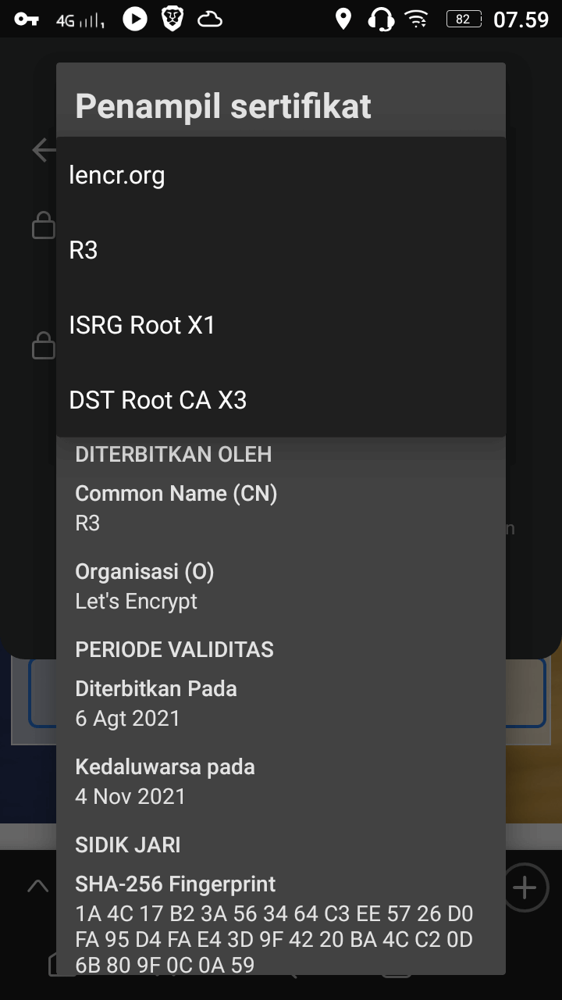


Per tanggal 30 September 2021, sertifikat akar "DST Root CA X3" telah habis masa berlakunya dan diganti menjadi "ISRG Root X1". Meski masa berlakunya habis, Let's Encrypt tetap kompatibel dengan Android 7.1.1 ke bawah yang masih memakai "DST Root CA X3" sebagai akarnya (lihat cuplikan layar di atas), jadi Anda tidak perlu melakukan apa pun.

Kalau Anda tidak memakai Android, tidak bisa mengakses web yang memakai Let's Encrypt, atau sekadar ingin memakai akar barunya, silakan unduh sertifikat akar "[ISRG Root X1](https://letsencrypt.org/certs/isrgrootx1.pem)", instal, lalu hapus sertifikat akar lama "DST Root CA X3" dari perangkat Anda. Atau, cukup perbarui sistem Anda.


Berdasarkan [halaman kompatibilitas Let's Encrypt](https://letsencrypt.org/docs/certificate-compatibility/), perangkat yang mempercayai "ISRG Root X1" berkurang bila dibandingkan yang mempercayai "DST Root CA X3". Jadi, jika Anda ingin sertifikat SSL/TLS gratis yang bisa diakses hampir semua orang, atau Anda kurang yakin dengan resolusi pihak Let's Encrypt, ZeroSSL bisa jadi pilihan terbaik untuk Anda.

#### Tidak (atau Belum?) menerapkan _Rate Limit_ {#tidak-menerapkan-rate-limit}

Sampai artikel ini diterbitkan, ZeroSSL tidak (atau belum?) menerapkan _rate limit_ atau batasan penerbitan sertifikat SSL/TLS, tidak seperti Let's Encrypt yang sudah menerapkannya sejak lama.

Tidak percaya? Silakan kunjungi [halaman komparasinya](https://zerossl.com/letsencrypt-alternative/#acme) (baca bagian "ACME"-nya) atau [halaman dokumentasinya](https://zerossl.com/documentation/acme/). Jadi Anda tidak perlu takut kehabisan kuota saat mengalami kegagalan penerbitan sertifikat dengan alasan apa pun.

#### Memiliki antarmuka untuk mengelola sertifikat {#antarmuka-pengelola-sertifikat}

ZeroSSL memiliki dasbor web untuk mengelola sertifikat SSL/TLS: Anda bisa melihat sertifikat yang telah diterbitkan sekaligus mengelolanya, serta menghabiskan kuota "SSL Gratis" dengan membuat sertifikat lewat situs web-nya.

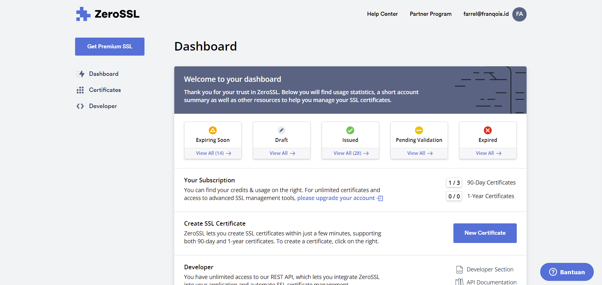 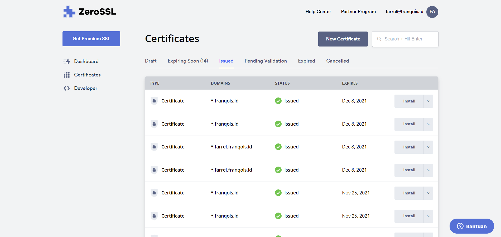

Sayangnya, Anda tidak bisa mencabut sertifikat yang diterbitkan lewat Server ACME-nya dari dasbor tersebut; Anda hanya bisa melihat dan mengunduhnya saja.


#### Pertanyaan ke-27: Apa alasan kamu menggunakan ZeroSSL, kenapa tidak Let's Encrypt saja? {#pertanyaan-ke27}


**PEMBARUAN Jum'at, 21 Agustus 2026:** Karena ZeroSSL makin sering gangguan saat penerbitan sertifikat ketimbang saat artikel ini pertama kali terbit, saya memutuskan meninggalkan ZeroSSL sepenuhnya dan menjadikan Let's Encrypt sebagai CA cadangan. Sebenarnya sudah cukup lama, tapi sempat mau mencoba lagi, cuma hasilnya gangguan mulu, jadi sekarang saya meninggalkannya sepenuhnya.

Alasan saya pada awalnya menggunakan ZeroSSL:

- **Ingin mencoba hal baru dan merasa ZeroSSL lebih baik.** Setelah bertahun-tahun memakai Let's Encrypt (sekitar 2016/2017-an), saya baru tahu ada CA lain yang menawarkan sertifikat gratis, dan dari beberapa aspek ZeroSSL terlihat lebih baik. Selama ada yang lebih baik, kenapa tidak?
- **Membantu Let's Encrypt.** Let's Encrypt adalah organisasi nirlaba yang super sibuk dan hampir semua penyedia hosting/CDN menyediakannya dari panelnya. Karena saya tidak bisa berdonasi, maka saya tidak mengeksklusifkan Let's Encrypt untuk seluruh domain saya, demi menghemat pengeluaran mereka dan memaksimalkan anggarannya untuk mengembangkan protokol ACME. Lagipula, punya lebih dari 1 CA gratisan itu sangat baik untuk ekosistem IKP.
- **Tertantang dan mendapat ilmu baru.** Mayoritas penyedia web belum mendukung pemasangan sertifikat dari ZeroSSL secara otomatis, kebanyakan cuma mendukung Let's Encrypt. Saya jadi tertantang menerbitkan, memasang dan mengotomatiskannya sendiri dengan acme.sh plus `curl`, dan akhirnya mendapat ilmu baru yang cukup berguna.

**Pertanyaan ke-28: Apa kekurangan ZeroSSL menurut Anda?** {#pertanyaan-ke28}

##### Pertanyaan ke-28: Apa kekurangan ZeroSSL menurut Anda? {#pertanyaan-ke28}

Kekurangan ZeroSSL menurut saya:

- Server ACME-nya yang kadang-kadang bermasalah, jadi Anda harus sabar saat menerbitkan/memperbarui sertifikat.
- Punya kelebihan di pengelolaan sertifikat, tapi tidak bisa mencabut/menghapus sertifikat yang diterbitkan lewat Server ACME-nya dari dasbornya.


### Parameter lanjutan acme.sh saat menerbitkan sertifikat {#parameter-tambahan}


#### Metode verifikasi selain DNS

- `--webroot lokasi_webroot` atau `-w lokasi_webroot` jika Anda ingin menggunakan metode _webroot_. Ganti `lokasi_webroot` dengan lokasi web Anda, seperti `/var/www/html` atau `/home/username/public_html`.

Contohnya:

```shell
acme.sh --issue -d www.domain.com -d domain.com -w $HOME/public_html
```
- `--apache` jika Anda ingin memakai _web server_ Apache2 sebagai verifikasinya.
- `--nginx (lokasi_conf)` jika Anda ingin memakai NGINX. Ganti `(lokasi_conf)` dengan lokasi berkas konfigurasi NGINX bila acme.sh tidak bisa mendeteksinya otomatis; kalau terdeteksi, cukup tulis `--nginx`.
- `--standalone` jika Anda tidak punya _web server_ atau sedang tidak berada di dalam server web (cth. sedang di server FTP atau SMTP). Mode ini butuh `socat` terpasang.

Anda bahkan bisa memakai metode verifikasi yang berbeda-beda untuk tiap domain dalam satu kali penerbitan:

```shell {linenos=true}
acme.sh --issue \
        -d www.domain1.com -d domain1.com --dns dns_cf \
        -d www.domain2.com -d domain2.com --dns dns_netlify \
        -d www.domain3.com -d domain3.com -w /home/username/public_html \
        -d www.domain4.com -d domain4.com --apache \
        -d www.domain5.com -d domain5.com --nginx
```

Catatan: dengan verifikasi DNS, Anda tidak bisa sembarangan membuat sertifikat untuk domain milik orang lain — berhasil atau gagal akan menambah _rate limit_ jika Anda memakai CA seperti Let's Encrypt atau Buypass. Berhati-hatilah.

#### Parameter Tambahan (`PARAMETER_TAMBAHAN`)

- `--force` untuk memaksa penerbitan ulang, misalnya memperbarui masa berlaku sertifikat meski belum waktunya.
- `--test` atau `--staging` untuk mode pengujian, cocok saat Anda sedang belajar agar tidak memengaruhi _rate limit_ asli. Saat memperbarui sertifikat mode uji, gunakan `--force --server letsencrypt_test`.
- `--server opsi_ca` untuk menerbitkan sertifikat lewat CA lain selain bawaan ZeroSSL. Ganti `opsi_ca` dengan nama pendek CA (`zerossl`, `buypass`, `buypass_test`, `letsencrypt`, `letsencrypt_test`, `sslcom`, `google`, `googletest`) atau URL Server ACME-nya ([Wiki-nya](https://github.com/acmesh-official/acme.sh/wiki/Server)).
- `--keylength opsi` atau `-k opsi` untuk menentukan jenis/ukuran kunci: `2048`, `3072`, `4096`, `8192`, `ec-256`, `ec-384`, atau `ec-512` (dibahas [di bawah](#ssl-beda-ukuran-kunci)).
- `--cert-file file`, `--key-file file`, `--ca-file file`, `--fullchain-file file` untuk menyalin berkas sertifikat, kunci, CA, dan _fullchain_ ke lokasi lain setelah penerbitan/pembaruan.
- `--reloadcmd perintah` untuk mengeksekusi perintah _reload_ server setelah sertifikat diperbarui. Kalau Anda tidak punya _web server_ di perangkat ini dan ingin memasangnya di layanan lain, pakai `--renew-hook` saja.
- `--renew-hook perintah` untuk menentukan perintah yang dieksekusi setelah sertifikat berhasil _di-renew_. Karena acme.sh tidak langsung mengeksekusinya (melainkan saat pembaruan), sebaiknya isi langsung saat menerbitkan, contoh: `--renew-hook "env sh deploy.sh"`.
- `--pre-hook perintah` dieksekusi sebelum acme.sh menjalankan tugasnya.
- `--post-hook perintah` dieksekusi sesudah acme.sh menjalankan tugasnya, tidak peduli berhasil atau gagal.
- `--always-force-new-domain-key` untuk membuat kunci pribadi baru setiap pembaruan (bawaan acme.sh: tidak membuat kunci baru). Hanya bisa dipakai saat menerbitkan sertifikat.
- `--dnssleep 300` agar acme.sh menunggu 300 detik setelah catatan DNS ditambahkan/diubah dan sebelum verifikasi CA, guna menunggu propagasi DNS.
- `--ecc` agar perintah ditujukan untuk sertifikat yang diterbitkan dengan kunci ECC/ECDSA. Tanpa parameter ini, perintah diarahkan ke sertifikat RSA. Parameter ini hanya bisa dipakai bersama `--renew`, `--revoke`, `--remove`, `--install-cert`, `--to-pkcs12` dan `--createcsr`, contoh: `acme.sh --remove -d domain.com --ecc`.

Contoh penggunaan parameter lain:

- `acme.sh --renew -d domain.com` untuk memperbarui sertifikatnya
- `acme.sh --revoke -d domain.com` untuk mencabutnya
- `acme.sh --remove -d domain.com` untuk menghapusnya dari perangkat Anda

Masih banyak parameter lainnya; jalankan `acme.sh --help` untuk daftar lengkapnya. Kalau Anda tidak butuh parameter tambahan, hapus saja teks `PARAMETER_TAMBAHAN`-nya dari perintah.


### DNS Alias Mode {#dns-alias-mode}

Mode ini dipakai jika penyedia DNS domain utama Anda tidak mendukung akses API/tidak didukung acme.sh, atau Anda tidak mau memberikan akses API ke domain penting. Caranya: pakai domain kedua yang DNS-nya didukung (dan tidak terlalu penting) sebagai alias untuk verifikasinya.


#### 1. Membuat Catatan DNS-nya

Buat catatan DNS berjenis CNAME yang diarahkan ke domain alias. Contoh, untuk menerbitkan sertifikat bagi `*.domain.com` dan `domain.com`:

```plain
_acme-challenge.domain.com
   =>   _acme-challenge.domain-lain.com
```

Atau dalam format standar _DNS Zone File_ (ISC BIND/NSD):

```bind
_acme-challenge.domain.com IN CNAME _acme-challenge.domain-lain.com.
```

Kalau Anda juga menerbitkan sertifikat untuk subdomain _wildcard_ (`*.sub.domain.com`), buat catatannya juga:

```plain
_acme-challenge.domain.com
   =>   _acme-challenge.domain-lain.com

_acme-challenge.sub.domain.com
   =>   _acme-challenge.domain-lain.com
```


Belum punya domain alias? Anda bisa menyewa domain `.my.id` mulai dari Rp9.000,00 sampai Rp50.000,00<sup>**\***</sup> per tahun, misalnya di [Dewaweb](https://afiliasi.farrelf.blog/dewaweb/) dengan harga Rp13.320,00<sup>**\*\***</sup> untuk tahun pertama lalu Rp27.750,00/tahun<sup>**\*\***</sup>, atau di [Exabytes](https://afiliasi.farrelf.blog/exabytes/) dengan Rp9.990,00<sup>**\*\***</sup> tahun pertama lalu Rp33.300,00/tahun<sup>**\*\***</sup>. Setelah itu, saya sarankan memakai Cloudflare sebagai penyedia DNS-nya karena gratis dan dukungan API-nya luas.

<sup>**\***</sup>Biaya bisa berbeda tiap penyedia, belum termasuk PPN 11%. <sup>**\*\***</sup>Harga sudah termasuk PPN 11%. Semua biaya di atas hanyalah perkiraan dan belum termasuk biaya lain seperti proteksi WHOIS, hosting, surel, dll.


**Catatan Cloudflare:** saat membuat CNAME-nya, pastikan `Proxy Status`-nya **"DNS Only"** (awan abu-abu). **Jangan diubah jadi awan oranye**, karena CA tidak akan bisa membaca catatannya untuk verifikasi.

Jika Anda menerbitkan sertifikat hanya untuk domain utama dan subdomain tertentu, satu catatan CNAME itu sudah cukup.

Setelah catatannya dibuat, siapkan juga kredensial akses API untuk **domain alias**-nya (bukan domain utama), karena nanti acme.sh yang membuat catatan TXT-nya adalah di domain alias.

#### 2. Menerbitkan Sertifikat TLS


Sebaiknya selalu tambahkan `--dnssleep durasi` agar DNS terpropagasi sempurna sebelum verifikasi. Minimal 200 detik, disarankan 300 detik; kalau masih terkendala, naikkan ke 600, 900 detik, dst.


Pakai perintah biasa dengan verifikasi DNS, hanya saja tambahkan `--challenge-alias <nama_domain_alias>`:

```shell
acme.sh --issue \
        -d '*.domain.com' \
        -d domain.com \
        --challenge-alias domain-lain.com --dns dns_cf
```

Cara kerjanya: acme.sh membuat catatan TXT `_acme-challenge` di `domain-lain.com`. CA mencari `_acme-challenge.domain.com`, menemukan CNAME yang Anda buat di langkah 1, lalu mengikuti ke `domain-lain.com` untuk memverifikasi.

Setelah terbit, **jangan hapus catatan `_acme-challenge`** dari domain utama Anda, karena catatan itu dipakai lagi saat pembaruan.

#### 3. Berbagi domain alias yang sama

Domain alias yang sama bisa dipakai untuk banyak domain utama:

```plain
_acme-challenge.domain.com
   =>   _acme-challenge.domain-lain.com

_acme-challenge.domain.id
   =>   _acme-challenge.domain-lain.com

_acme-challenge.domain.net
   =>   _acme-challenge.domain-lain.com

_acme-challenge.domain.org
   =>   _acme-challenge.domain-lain.com
```

```shell
acme.sh --issue \
        -d domain.com \
        -d www.domain.com \
        -d sub.domain.com \
        -d domain.id \
        -d domain.net \
        -d domain.org \
        --challenge-alias domain-lain.com --dns dns_cf
```

Untuk bentuk _wildcard_-nya, tambahkan saja `-d '*.domain.com'`, `-d '*.domain.id'`, dst. beserta domain tanpa wildcard-nya.

#### 4. (Sub)Domain alias yang berbeda untuk tiap domain

Anda bisa memakai alias berbeda per domain, bahkan penyedia DNS yang berbeda pula:

```plain
_acme-challenge.domain.com
   =>   _acme-challenge.domain-lain.com

_acme-challenge.domain.id
   =>   _acme-challenge.domain-lain-2.com
```

```shell
acme.sh --issue \
        -d domain.com --challenge-alias domain-lain.com \
        -d domain.id --challenge-alias domain-lain-2.com \
        --dns dns_cf
```

Dengan penyedia DNS berbeda:

```shell
acme.sh --issue \
        -d domain.com --challenge-alias domain-lain.com --dns dns_cf \
        -d domain.id --challenge-alias domain-lain-2.com --dns dns_netlify
```

(Diasumsikan `domain-lain.com` memakai Cloudflare dan `domain-lain-2.com` memakai Netlify.) Untuk _wildcard_, tambahkan `--challenge-alias` pada setiap `-d`, termasuk pada baris `*.domain.com` dan `domain.com`-nya.

#### 5. Mencampuri antara Mode Alias DNS dan Mode DNS Biasa

Pakai `--challenge-alias no` untuk menandai domain tertentu agar tetap memakai mode DNS biasa:

```shell
acme.sh --issue \
        -d domain.com --challenge-alias domain-lain.com \
        -d domain.id --challenge-alias no \
        --dns dns_cf
```

Dengan penyedia DNS berbeda:

```shell
acme.sh --issue \
        -d domain.com --challenge-alias domain-lain.com --dns dns_cf \
        -d domain.id --challenge-alias no --dns dns_netlify
```

Untuk _wildcard_, tambahkan `--challenge-alias no` juga pada setiap `-d` yang tidak memakai alias.

#### 6. Pakai `--challenge-alias` atau `--domain-alias`

acme.sh punya parameter `--domain-alias` yang fungsinya hampir sama, bedanya Anda tidak perlu membuat CNAME dengan awalan `_acme-challenge`, melainkan CNAME biasa:

```plain
# Saat memakai --challenge-alias:
_acme-challenge.domain.com
   =>   _acme-challenge.domain-lain.com

# Saat memakai --domain-alias:
_acme-challenge.domain.com
   =>   alias.domain-lain.com
```

```shell
acme.sh --issue -d domain.com --domain-alias alias.domain-lain.com --dns dns_cf
```

**Catatan:** jangan gunakan nama domain saja untuk `--domain-alias`, karena itu akan meminta acme.sh membuat catatan TXT di puncak domain (_apex_) yang membutuhkan sintaks berbeda. Kalau memang ingin di puncak, gunakan salah satu berikut (tergantung implementasi dukungan DNS API-nya):

```shell
acme.sh --issue -d domain.com --domain-alias @.domain-lain.com --dns dns_cf
acme.sh --issue -d domain.com --domain-alias .domain-lain.com --dns dns_cf
```

Alias yang berbeda per domain juga bisa, tentunya dengan menambahkan parameternya satu per satu:

```shell
acme.sh --issue \
        -d domain.com --domain-alias alias1.domain-lain.com \
        -d domain.id --domain-alias alias2.domain-lain.com \
        --dns dns_cf
```

#### 7. Terakhir

Kalau sudah selesai menerbitkannya, catatan CNAME yang telah Anda buat **jangan dihapus**, karena catatan itu akan dipakai lagi untuk verifikasi saat memperbarui sertifikat.


### Ukuran kunci dan kunci ECC/ECDSA {#ssl-beda-ukuran-kunci}


Secara baku, acme.sh menerbitkan sertifikat dengan kunci ECDSA berukuran 256 bit (ECDSA P-256). Untuk RSA, tambahkan `--keylength ukuran_kunci_rsa` atau `-k ukuran_kunci_rsa`:

```shell
acme.sh --issue -d domain.com -d www.domain.com -k 3072
```

Atau dalam bentuk _Wildcard_:

```shell
acme.sh --issue -d '*.domain.com' -d domain.com -k 3072 --dns dns_cf
```

Ukuran kunci RSA yang didukung acme.sh: RSA-2048 (`2048`), RSA-3072 (`3072`), RSA-4096 (`4096`), dan RSA-8192 (`8192`).

**Catatan:** didukung acme.sh bukan berarti didukung CA-nya; Let's Encrypt misalnya tidak mendukung RSA di atas 4096 bit.


Saya tidak menyarankan ukuran kunci yang terlalu besar. Selain membesarnya ukuran kunci, proses _TLS handshake_ bisa jadi lebih lambat dan menghabiskan CPU, yang berarti bisa memengaruhi performa situs web Anda secara keseluruhan dan berpotensi mengurangi pengunjung.

Ukuran yang ideal untuk kebanyakan kasus: 2048 bit, 3072 bit, atau paling besar 4096 bit. Tidak perlu terlalu besar.


#### Menerbitkan Sertifikat TLS dengan kunci ECC/ECDSA {#ecdsa-ssl}

Untuk ukuran kunci ECC yang berbeda, pakai `--keylength ec-ukuran_kuncinya`:

```shell
acme.sh --issue -d domain.com -d www.domain.com -k ec-384
```

Atau untuk _Wildcard_:

```shell
acme.sh --issue -d '*.domain.com' -d domain.com -k ec-384 --dns dns_cf
```

Ukuran kunci ECC/ECDSA yang didukung: ECDSA P-256 (baku), ECDSA P-384 (`ec-384`), dan ECDSA P-512 (`ec-512`).

**Catatan:** didukung acme.sh bukan berarti didukung CA-nya; Let's Encrypt misalnya belum mendukung kunci ECDSA 512 bit. Sama seperti RSA, jangan memilih ukuran yang terlalu besar; idealnya 256 bit atau paling besar 384 bit.

Sekadar informasi: sertifikat dengan kunci ECC tersimpan di direktori yang berakhiran `_ecc` (cth. `/home/username/.acme.sh/domain.com_ecc`), namanya berkas sama saja. Untuk mencabut, menghapus, atau memperbaruinya secara manual, Anda perlu menambahkan `--ecc`, contoh: `acme.sh --remove -d domain.com --ecc`.

#### Pengaruh ukuran kunci terhadap kecepatan

Hasil pengujian dengan `openssl speed rsa2048 rsa3072 rsa4096` menyimpulkan bahwa semakin besar ukuran kunci (terutama RSA), semakin besar pengaruhnya terhadap waktu tanda tangan:

```plain {linenos=true}
                  sign    verify    sign/s verify/s
rsa 2048 bits 0.000516s 0.000015s   1937.1  66884.5
rsa 3072 bits 0.001568s 0.000031s    637.9  32169.3
rsa 4096 bits 0.003504s 0.000054s    285.4  18588.0
```

(Itu di Laptop: Lenovo Legion 5 15ARH05, AMD Ryzen 7 4800H, RAM 8x2 GB DDR4. Di PC lama saya dengan Pentium G2030, angkanya jauh lebih kecil lagi: 595,1 / 192,0 / 82,5 _sign/s_ untuk RSA 2048/3072/4096.) Referensi lain: [RSA key lengths](https://www.javamex.com/tutorials/cryptography/rsa_key_length.shtml) dari Javamex.


### Berkas-berkas acme.sh {#berkas-berkas-acme-sh}


Biasanya acme.sh terinstal di `$HOME/.acme.sh`. Isinya kira-kira seperti berikut:

```shell {linenos=true}
$ ls -la "$HOME"/.acme.sh
total 256
drwx------ 10 user user   4096 Aug 27 15:43  .
drwx------ 12 user user   4096 Sep 27 11:56  ..
-rw-r--r--  1 user user   1747 Aug 27 15:38  account.conf
-rwxr-xr-x  1 user user 205958 Jul  5 16:41  acme.sh
-rw-r--r--  1 user user     92 Jul  4 18:22  acme.sh.env
drwxr-xr-x  3 user user   4096 Jul  4 18:33  ca
drwxr-xr-x  2 user user   4096 Jul  5 16:41  deploy
drwxr-xr-x  2 user user   4096 Jul  5 16:41  dnsapi
drwxr-xr-x  2 user user   4096 Jul  8 08:50  domain.com
drwxr-xr-x  2 user user   4096 Aug 27 11:45  domain.com_ecc
drwxr-xr-x  2 user user   4096 Aug 27 15:38  '*.domain.com'
drwxr-xr-x  2 user user   4096 Aug 27 15:37  '*.domain.com_ecc'
-rw-r--r--  1 user user    224 Aug 27 16:26  http.header
drwxr-xr-x  2 user user   4096 Jul  5 16:41  notify
```

**Catatan:** huruf `d` di awal baris (cth. `drwxr`) berarti itu direktori, bukan berkas.

Fungsi masing-masinya:

1. `acme.sh` — berkas utama perkakas yang dieksekusi saat Anda menjalankan acme.sh.
2. `acme.sh.env` — menyimpan _environment variables_ yang mengatur cara acme.sh dijalankan.
3. `account.conf` — berkas konfigurasi utama acme.sh.
4. `ca/` — menyimpan informasi akun CA yang Anda registrasikan lewat `--register-account` (atau otomatis saat penerbitan pertama). Dipakai untuk menerbitkan, memperbarui, dan mencabut sertifikat memakai akun tersebut.
5. `deploy/` — berkas skrip _deploy hook_ bawaan acme.sh. Untuk penggunaannya, lihat [dokumentasinya](https://github.com/acmesh-official/acme.sh/wiki/deployhooks).
6. `dnsapi/` — berkas skrip untuk verifikasi DNS; isinya daftar penyedia DNS yang didukung. Penggunaannya sudah saya jelaskan di [bagian verifikasi DNS](#verifikasi-dns).
7. Direktori bernama domain (cth. `domain.com`, `'*.domain.com'`) — menyimpan sertifikat yang telah diterbitkan beserta konfigurasinya. Isinya sangat perlu Anda ketahui karena dipakai untuk memasang sertifikat ke web Anda, dan berkas konfigurasinya (cth. `domain.com.conf`) dipakai untuk mengatur perilaku acme.sh. Namanya ditentukan oleh domain pertama yang Anda masukkan saat menerbitkan.
8. Direktori domain yang berakhiran `_ecc` — sama seperti poin 7, tapi untuk sertifikat yang diterbitkan dengan kunci [ECC/ECDSA](#ecdsa-ssl).
9. `http.header` — entah fungsinya apa, tapi mungkin dipakai saat penerbitan/pembaruan, jadi jangan dihapus.
10. `notify/` — berkas skrip _notify hook_ acme.sh; lihat [dokumentasinya](https://github.com/acmesh-official/acme.sh/wiki/notify).

#### Konfigurasi utama acme.sh

Berkas konfigurasi utamanya ada di `$HOME/.acme.sh/account.conf`. Berkas ini menyimpan kredensial yang Anda masukkan lewat variabel _shell_ (token, kunci API, nama pengguna, kata sandi); acme.sh menyimpannya otomatis dan memakainya kembali di kemudian hari.

```shell {linenos=true}
$ cat "$HOME"/.acme.sh/account.conf
LE_WORKING_DIR=/home/username/.acme.sh
LE_CONFIG_HOME=/home/username/.acme.sh
UPGRADE_HASH='8ded524236347d5a1f7a3169809cab9cf363a1c8'
ACCOUNT_EMAIL='emailku@domain.com'
#AUTO_UPGRADE='1'
USER_PATH='/home/username/bin:/home/username/.local/bin:/usr/local/sbin:/usr/local/bin:/usr/bin:/usr/lib/jvm/default/bin:/usr/bin/site_perl:/usr/bin/vendor_perl:/usr/bin/core_perl:/var/lib/snapd/snap/bin'
```

Kalau Anda salah memasukkan kredensial, cukup ubah berkas ini dengan editor teks favorit Anda.

Contoh perbaikan jika alamat surel akun salah (setelah di-backup dulu):

```shell {linenos=true}
cp "$HOME"/.acme.sh/account.conf "$HOME"/.acme.sh/account.conf.1 ## Backup dulu
sed -i '/ACCOUNT\_EMAIL\=/d' "$HOME"/.acme.sh/account.conf ## Hapus variabel ACCOUNT_EMAIL yang sudah ada
printf "ACCOUNT_EMAIL='%s'\n" "emailku@domain.com" >> "$HOME"/.acme.sh/account.conf
```

#### Isi direktori `domain.com` dan berkas yang diperlukan

```shell {linenos=true}
$ ls -la "$HOME"/.acme.sh/domain.com
total 44
-rw-r--r--  1 user user 4399 Jul  8 08:46 ca.cer
-rw-r--r--  1 user user 2472 Jul  8 08:46 domain.com.cer
-rw-r--r--  1 user user  580 Jul  8 08:46 domain.com.conf
-rw-r--r--  1 user user 1318 Jul  8 08:45 domain.com.csr
-rw-r--r--  1 user user  164 Jul  8 08:45 domain.com.csr.conf
-rw-r--r--  1 user user 2459 Jul  8 08:45 domain.com.key
-rw-r--r--  1 user user 6871 Jul  8 08:46 fullchain.cer
```

Kalau penyedia Anda butuh 3 informasi, kirimkan `domain.com.cer` (sertifikat), `domain.com.key` (kunci), dan `ca.cer` (sertifikat penengah/CA). Kalau butuh 2 informasi saja, kirimkan `fullchain.cer` dan `domain.com.key`.

**Kenapa bukan `domain.com.cer`?** Karena `fullchain.cer` adalah gabungan dari `domain.com.cer` dan `ca.cer`. Praktik terbaiknya memang selain sertifikat domain, Anda juga harus memasang kunci dan sertifikat penengahnya; kalau tidak, rantai sertifikat yang terpasang jadi tidak sempurna.

Berkas `.csr`, `.csr.conf` dan `.conf` tidak perlu Anda kirimkan — ketiganya dipakai untuk memperbarui sertifikat dan mengonfigurasi acme.sh.


### Konfigurasi acme.sh untuk Domain tertentu {#konfigurasi-acme-sh-untuk-domain}


Konfigurasi per domain memungkinkan Anda mengatur apa yang dilakukan acme.sh sebelum dan sesudah bekerja, hanya untuk domain tertentu — berguna kalau tiap domain memakai hosting/CDN yang berbeda.

#### Mengubah opsi yang sudah ada

Lihat dulu isi berkas `$HOME/.acme.sh/domain.com/domain.com.conf`:

```shell {linenos=true}
$ cat "$HOME/.acme.sh/domain.com/domain.com.conf"
Le_Domain='domain.com'
Le_Alt='*.domain.com'
Le_Webroot='dns_cf'
Le_PreHook=''
Le_PostHook=''
Le_RenewHook=''
Le_API='https://acme.zerossl.com/v2/DV90'
Le_Keylength='ec-384'
Le_OrderFinalize='https://acme.zerossl.com/v2/DV90/order/kyxxxxxxxxxxxxxxxxxxxx/finalize'
Le_LinkOrder='https://acme.zerossl.com/v2/DV90/order/kyxxxxxxxxxxxxxxxxxxxx'
Le_LinkCert='https://acme.zerossl.com/v2/DV90/cert/20xxxxxxxxxxxxxxxxxxxx'
Le_CertCreateTime='1625708943'
Le_CertCreateTimeStr='Thu Jul  8 01:49:03 UTC 2021'
Le_NextRenewTimeStr='Mon Sep  6 01:49:03 UTC 2021'
Le_NextRenewTime='1630806543'
```

Dari semua opsi di atas, **yang boleh diubah hanya `Le_PreHook`, `Le_PostHook`, dan `Le_RenewHook`**. Opini lain seperti `Le_Domain`, `Le_Alt`, `Le_API`, `Le_OrderFinalize`, `Le_LinkOrder`, dan `Le_LinkCert` jangan diubah kecuali Anda paham betul risikonya.

- `Le_PreHook` — perintah yang dieksekusi **sebelum** acme.sh menjalankan tugasnya. Nilai bakunya kosong; kalau Anda menerbitkan sertifikat dengan `--pre-hook`, opsi ini terisi otomatis.
- `Le_PostHook` — perintah yang dieksekusi **sesudah** acme.sh menjalankan tugasnya, tidak peduli berhasil atau gagal. Terisi otomatis dari parameter `--post-hook`.
- `Le_RenewHook` — perintah yang dieksekusi **setelah sertifikat berhasil diperbarui**. Terisi otomatis dari parameter `--renew-hook`.

Contoh sederhana untuk menampilkan teks sebelum acme.sh bekerja:

```shell
Le_PreHook='echo "Halo, Dunia!"'
```

Kalau perintahnya lebih dari satu baris, buat saja berkas _Shell_ di direktori yang sama dengan `domain.com.conf` (misal `$HOME/.acme.sh/domain.com`), lalu arahkan opsinya ke skrip tersebut:

```shell
Le_RenewHook='/usr/bin/env sh deploy.sh'
```

Perintah lain yang juga bisa: `sh deploy.sh`, `bash deploy.sh`, `./deploy.sh`, `env sh deploy.sh`. Khusus Termux, gunakan perintah lengkap berikut karena `/usr/bin/env sh deploy.sh` tidak bisa dieksekusi di sana:

```bash
/data/data/com.termux/files/usr/bin/env sh deploy.sh
```

**Yang perlu diingat:** direktori kerja saat perintah hook dijalankan adalah direktori tempat `domain.com.conf` berada. Jadi semua aktivitas tanpa path absolut (membuat berkas, `cat`, dst.) akan dilakukan di dalam `$HOME/.acme.sh/domain.com/`.

Setelah perintahnya dieksekusi sekali, nilainya akan berubah menjadi Base64 secara otomatis oleh acme.sh:

```shell
__ACME_BASE64__START_<BARIS_PERINTAH_DALAM_BENTUK_BASE64>__ACME_BASE64__END_
```

Di dalamnya terdapat Base64 dari perintah yang Anda tentukan — itu normal, bukan berkas rusak.

#### Menambahkan opsi di dalam konfigurasi

Selain ketiga opsi di atas, Anda juga bisa menambahkan opsi lain:

- `Le_ForceNewDomainKey` — membuat kunci pribadi baru setiap pembaruan. Nilai `1` untuk aktif, `0` untuk nonaktif (baku). Contoh: `Le_ForceNewDomainKey='1'`.
- `Le_RealCertPath` — menyalin berkas sertifikat ke lokasi tertentu setelah pembaruan, contoh: `Le_RealCertPath='/etc/ssl-certificates/domain.com.cer'`. Bawaan: tidak ada (tidak disalin ke mana pun); terisi otomatis jika Anda memakai parameter `--cert-file`.
- `Le_RealCACertPath` — sama seperti di atas, tapi untuk berkas `ca.cer`; terisi otomatis dari parameter `--ca-file`.
- `Le_RealKeyPath` — sama, untuk berkas `domain.com.key`; terisi otomatis dari parameter `--key-file`.
- `Le_RealFullChainPath` — sama, untuk berkas `fullchain.cer`; terisi otomatis dari parameter `--fullchain-file`.
- `Le_ReloadCmd` — perintah yang dieksekusi setelah proses penyalinan berkas ke lokasi tertentu selesai, biasanya untuk memuat ulang server, contoh: `Le_ReloadCmd='systemctl reload nginx'`. Nilainya juga di-_encode_ jadi Base64. Bedanya dengan `Le_RenewHook`: `Le_ReloadCmd` dijalankan lebih dulu (khusus setelah penyalinan berkas), sedangkan `Le_RenewHook` dijalankan sesudahnya dan cakupannya lebih luas.
- `Le_DNSSleep` — durasi acme.sh menunggu setelah catatan DNS ditambahkan/diubah sebelum verifikasi CA, contoh: `Le_DNSSleep='300'`. Isinya harus angka. Terisi otomatis jika Anda memakai parameter `--dnssleep`.
- **Kredensial penyedia DNS** — Anda juga bisa menyimpan kredensial DNS di konfigurasi ini agar lebih spesifik per domain, misal `CF_Token`, `CF_Account_ID`, `CF_Zone_ID` untuk Cloudflare, atau `NETLIFY_ACCESS_TOKEN` untuk Netlify DNS.

#### Menjalankan sebuah Berkas Skrip setelah Memperbarui Sertifikat TLS {#menjalankan-sebuah-berkas-skrip-setelah-memperbarui-sertifikat-tls}

Contoh kasus: Si Udin punya skrip `deploy.sh` untuk Netlify dan ingin skripnya dijalankan setelah sertifikat `www.si-udin.com` diperbarui.

```shell {linenos=true}
#!/usr/bin/env sh

# Skrip ini saya lisensikan di bawah lisensi "The Unlicense" (https://unlicense.org/)
# Silakan kembangkan sendiri kode skrip di bawah ini

PLAIN_CERT="$(awk '{printf "%s\\n", $0}' < www.si-udin.com.cer)"
PLAIN_KEY="$(awk '{printf "%s\\n", $0}' < www.si-udin.com.key)"
PLAIN_CA="$(awk '{printf "%s\\n", $0}' < ca.cer)"
NETLIFY_ACCESS_TOKEN="ACCESS_TOKEN_KAMU_DI_SINI"
NETLIFY_SITE_ID="www.si-udin.com"

curl -s \
     -H "Authorization: Bearer $NETLIFY_ACCESS_TOKEN" \
     -H "content-type: application/json" \
     -d "{\"certificate\": \"$PLAIN_CERT\", \"key\": \"$PLAIN_KEY\", \"ca_certificates\": \"$PLAIN_CA\"}" \
     "https://api.netlify.com/api/v1/sites/$NETLIFY_SITE_ID/ssl"
```

Kenapa berkasnya tidak ditentukan direktorinya? Karena saat skrip dijalankan, direktori kerjanya adalah `$HOME/.acme.sh/www.si-udin.com` yang di dalamnya sudah ada berkas sertifikat yang dibutuhkan, jadi cukup tulis nama berkasnya saja.

Skripnya disimpan di `$HOME/.acme.sh/www.si-udin.com/` (sebelahan dengan `www.si-udin.com.conf`), lalu isi `Le_RenewHook` di berkas konfigurasinya:

```shell
Le_RenewHook='/usr/bin/env sh deploy.sh'
```

Beberapa bulan kemudian saat acme.sh memperbarui sertifikatnya dan berhasil, skrip tersebut otomatis dijalankan, dan nilai `Le_RenewHook` berubah menjadi:

```shell
Le_RenewHook='__ACME_BASE64__START_L3Vzci9iaW4vZW52IHNoIGRlcGxveS5zaA==__ACME_BASE64__END_'
```

(Itu adalah Base64 dari `/usr/bin/env sh deploy.sh`.)


### Detail otomatisasi pembaruan sertifikat {#detail-otomatisasi}


#### Opsi _Systemd Timer_ yang tadi disebut

- Format `OnCalendar` yang saya pakai adalah `00/2:00`, yaitu `hh/r:mm`:
  - `hh` = pukul berapa, diisi `00`
  - `r` = pengulangan, diisi `2`, artinya semua kelipatan 2 dari `hh` (00, 02, 04, ..., 22)
  - `mm` = menit tiap jam, misal diisi `30` maka jadwalnya 00.30, 02.30, dst.
- Anda juga bisa memakai `hourly`, `daily`, atau `weekly`.
- Untuk menganalisis jadwalnya, pakai `systemd-analyze calendar`:

    ```bash
    $ systemd-analyze calendar 00/2:00
      Original form: 00/2:00
    Normalized form: *-*-* 00/2:00:00
        Next elapse: Wed 2025-07-02 16:00:00 WIB
           (in UTC): Wed 2025-07-02 09:00:00 UTC
           From now: 1h 6min left
    ```

    Tambahkan `--iterations=<angka>` untuk melihat beberapa jadwal berikutnya sekaligus.

- `RandomizedDelaySec` — menambah penundaan **acak** dengan batas maksimum sebelum layanan diluncurkan. Diisi `30m`, jadi layanan yang diharapkan jalan pukul 02.00 bisa jadi jalan pukul 02.26.13, asal tidak melebihi 30 menit. Fungsinya agar tugas tidak bentrok dengan layanan lain.
- `AccuracySec` — batas penundaan maksimum (bukan penambahan acak). Nilai bakunya `1m` sehingga opsi ini tetap aktif meski tidak Anda tulis, dengan penundaan maksimal 1 menit. Saya komentari (`#AccuracySec=30m`) karena tidak dipakai.
- `Persistent` — menerima `true`/`false`. Jika `true`, waktu terakhir timer dipicu disimpan ke disk, sehingga jadwal yang terlewat (misal karena perangkat mati) akan dijalankan begitu timer aktif kembali.

Kenapa layanannya tidak perlu `systemctl --user enable acme.sh.service`? Karena layanannya memang hanya pemicu yang dijalankan oleh _timer_-nya. Untuk uji coba: `systemctl --user start acme.sh`, lalu lihat hasilnya dengan `journalctl --user -u acme.sh.service` atau `systemctl --user status acme.sh`. Status `Active: inactive (dead)` itu normal karena memang jenisnya _oneshot_.

Opsional: tambahkan `NO_TIMESTAMP='1'` ke `account.conf` agar timestamp di keluaran acme.sh tidak muncul dua kali saat Anda membaca jurnal Systemd.

Keluaran `systemctl --user list-timers`:

```text
NEXT                            LEFT LAST                           PASSED UNIT          ACTIVATES
Wed 2025-07-02 16:15:21 WIB 1h 35min Wed 2025-07-02 14:29:01 WIB 10min ago acme.sh.timer acme.sh.service

1 timers listed.
Pass --all to see loaded but inactive timers, too.
```

Kolom `NEXT` menunjukkan kapan layanan akan dijalankan berikutnya; waktunya tampak acak karena tadi ada `RandomizedDelaySec`.

#### Rincian _Cron Job_

Baris cron yang terpasang otomatis saat instalasi kira-kira seperti ini:

```crontab
6 0 * * * "/home/username/.acme.sh"/acme.sh --cron --home "/home/username/.acme.sh" > /dev/null
```

- `6 0 * * *` adalah parameter crontab-nya (menit, jam, hari bulan, bulan, hari); di atas artinya pukul 00.06 setiap hari. Ubah sesuai kebutuhan Anda — `0 */2 * * *` berarti tiap 2 jam — dan manfaatkan [Crontab.guru](https://crontab.guru/) untuk mengeceknya.
- `"/home/username/.acme.sh"/acme.sh` adalah perintahnya; hasilnya mungkin berbeda di perangkat Anda karena nama pengguna, dll.
- `> /dev/null` membuang keluaran karena tugasnya dijalankan lewat cron; biarkan saja atau ganti/hapus kalau Anda mau melihat log.
- Untuk Termux, _cron job_ bisa diinstal dan layanannya diaktifkan dengan bantuan `cronie` yang sudah kita instal di bagian [Persiapan](#persiapan-pengguna-android). Referensinya: [thread Reddit ini](https://www.reddit.com/r/termux/comments/i27szk/how_do_i_crontab_on_termux/) dan [thread ini](https://www.reddit.com/r/termux/comments/n6y82b/do_i_need_to_set_crontab_again_when_i_restart_termux/).


### Variasi perintah untuk shell lain dan alternatifnya {#varian-perintah}


#### Pengguna `fish`

Ganti `export X="Y"` dengan `set -x X "Y"`:

```fish
set -x CF_Token "API_TOKEN_KAMU_DI_SINI"
set -x CF_Account_ID "ACCOUNT_ID_KAMU_DI_SINI"
set -x CF_Zone_ID "ZONE_ID_KAMU_DI_SINI"

set -x NETLIFY_ACCESS_TOKEN "ACCESS_TOKEN_KAMU_DI_SINI"

set -x BUNNY_API_KEY "ACCESS_KEY_KAMU_DI_SINI"
```

Variabel untuk pemasangan sertifikat:

```fish {linenos=true}
# Netlify
set NETLIFY_PLAIN_CERT (sed 's/$/\\\n/' domain.com.cer | tr -d '\n')
set NETLIFY_PLAIN_KEY (sed 's/$/\\\n/' domain.com.key | tr -d '\n')
set NETLIFY_PLAIN_CA (sed 's/$/\\\n/' ca.cer | tr -d '\n')
set NETLIFY_ACCESS_TOKEN "ACCESS_TOKEN_KAMU_DI_SINI"

# bunny.net
set BUNNY_BASE64_FULLCHAIN (openssl base64 -A < fullchain.cer)
set BUNNY_BASE64_KEY (openssl base64 -A < domain.com.key)
set BUNNY_ACCESS_KEY "ACCESS_KEY_KAMU_DI_SINI"

# cPanel
set CPANEL_PLAIN_CERT (jq -sRr @uri < domain.com.cer)
set CPANEL_PLAIN_KEY (jq -sRr @uri < domain.com.key)
set CPANEL_PLAIN_CA (jq -sRr @uri < ca.cer)
set CPANEL_SCHEME "https"
set CPANEL_ENDPOINT "contoh-domain.id:2083"
set CPANEL_USERNAME "USERNAME_CPANEL_KAMU_DI_SINI"
set CPANEL_API_TOKEN "API_TOKEN_KAMU_DI_SINI"

# DirectAdmin
set DIRECTADMIN_SCHEME "https"
set DIRECTADMIN_ENDPOINT "contoh-domain.id:2222"
set DIRECTADMIN_USERNAME "USERNAME_DIRECTADMIN_KAMU_DI_SINI"
set DIRECTADMIN_LOGIN_KEY "LOGIN_KEY_KAMU_DI_SINI"
set DIRECTADMIN_PLAIN_FULLCHAIN (sed 's/$/\\\n/' fullchain.cer | tr -d '\n')
set DIRECTADMIN_PLAIN_KEY (sed 's/$/\\\n/' domain.com.key | tr -d '\n')
```

#### Alternatif `awk` untuk menghilangkan jeda baris

Selain `sed 's/$/\\n/' | tr -d '\n'`, Anda juga bisa memakai `awk`:

```shell {linenos=true}
NETLIFY_PLAIN_CERT="$(awk -v ORS="\\\n" '1' domain.com.cer)"
NETLIFY_PLAIN_KEY="$(awk -v ORS="\\\n" '1' domain.com.key)"
NETLIFY_PLAIN_CA="$(awk -v ORS="\\\n" '1' ca.cer)"
```

Untuk DirectAdmin, alternatifnya: `DIRECTADMIN_PLAIN_FULLCHAIN="$(awk -v ORS="\\\n" '1' fullchain.cer)"`.

#### Panggilan curl dalam satu baris

Netlify:

```shell
curl -sH "Authorization: Bearer $NETLIFY_ACCESS_TOKEN" -H "content-type: application/json" --data "{\"certificate\": \"$NETLIFY_PLAIN_CERT\", \"key\": \"$NETLIFY_PLAIN_KEY\", \"ca_certificates\": \"$NETLIFY_PLAIN_CA\"}" --url "https://api.netlify.com/api/v1/sites/SITE_ID_KAMU_DI_SINI/ssl"
```

bunny\.net:

```shell
curl -sH "Accept: application/json" -H "AccessKey: $BUNNY_ACCESS_KEY" -H "Content-Type: application/json" --data "{\"Hostname\": \"CUSTOM_HOSTNAME_KAMU_DI_SINI\", \"Certificate\": \"$BUNNY_BASE64_FULLCHAIN\", \"CertificateKey\": \"$BUNNY_BASE64_KEY\"}" --url "https://api.bunny.net/pullzone/PULL_ZONE_ID_KAMU_DI_SINI/addCertificate"
```

cPanel:

```shell
curl -sGH "Authorization: cpanel $CPANEL_USERNAME:$CPANEL_API_TOKEN" -d "domain=<ALAMAT_DOMAIN_KAMU_DI_SINI>" -d "cert=$CPANEL_PLAIN_CERT" -d "key=$CPANEL_PLAIN_KEY" -d "cabundle=$CPANEL_PLAIN_CA" "$CPANEL_SCHEME://$CPANEL_ENDPOINT/execute/SSL/install_ssl"
```

DirectAdmin:

```shell
curl -sH "Content-Type: application/json" -d "{\"domain\": \"ALAMAT_DOMAIN_KAMU_DI_SINI\", \"action\":\"save\", \"type\": \"paste\", \"certificate\": \"$DIRECTADMIN_PLAIN_FULLCHAIN\n$DIRECTADMIN_PLAIN_KEY\n\"}" "$DIRECTADMIN_SCHEME://$DIRECTADMIN_USERNAME:$DIRECTADMIN_LOGIN_KEY@$DIRECTADMIN_ENDPOINT/CMD_API_SSL?json=yes"
```

#### Kenapa `sed`/`awk` dan `openssl`, bukan `cat` dan `base64`?

- `cat` hanya menampilkan isi berkas apa adanya, termasuk jeda barisnya, yang tidak bisa diproses Netlify. Makanya setiap jeda baris diganti menjadi `\n` memakai `sed`/`awk`.
- Perintah `base64` milik GNU berbeda perintah dan hasil keluarannya dengan milik non-GNU (macOS, Alpine Linux, BSD), padahal artikel ini ditujukan untuk banyak sistem operasi. OpenSSL tersedia di hampir semua sistem berbasis \*nix, sehingga hasilnya konsisten. Di Android, instal `openssl-tool` di Termux; pengguna Windows sudah dibahas di [bagian Persiapan](#persiapan-pengguna-windows).


### Hal-hal lain yang dapat Anda lakukan dengan acme.sh {#hal-lainnya}


#### Melihat Daftar Sertifikat TLS yang ada {#melihat-dafat-sertifikat}

```shell
acme.sh --list
```

```shell {linenos=true}
$ acme.sh --list
Main_Domain    KeyLength  SAN_Domains   CA          Created               Renew
*.domain.com   "ec-384"   domain.com    ZeroSSL     2022-08-11T09:42:26Z  2022-10-10T09:42:26Z
```

Keterangannya:

- `Main_Domain` — domain utama, yaitu domain pertama yang Anda masukkan saat menerbitkan sertifikat.
- `KeyLength` — kunci yang dipakai; `ec-384` berarti ECC/ECDSA P-384.
- `SAN_Domains` — domain lain selain domain utama di dalam sertifikat.
- `CA` — CA yang dipakai (di atas: ZeroSSL).
- `Created` dan `Renew` — kapan sertifikat dibuat dan kapan akan diperbarui, dalam format [ISO 8601](https://www.iso.org/iso-8601-date-and-time-format.html).

#### Mengganti CA Baku {#mengganti-ca-baku}

Secara baku acme.sh memakai ZeroSSL. Untuk menggantinya:

```shell
acme.sh --set-default-ca --server opsi_ca
```

Contoh untuk mengganti ke Let's Encrypt:

```shell
acme.sh --set-default-ca --server letsencrypt
```

`opsi_ca` bisa berupa nama pendek CA atau URL Direktori ACME-nya ([daftarnya di Wiki](https://github.com/acmesh-official/acme.sh/wiki/Server)). Sebaiknya lakukan ini **sebelum** menerbitkan sertifikat apa pun, karena hanya berlaku untuk penerbitan terbaru. Kalau telanjur, Anda perlu menerbitkan ulang sertifikatnya secara paksa dengan CA berbeda.

#### Melihat konfigurasi utama acme.sh atau konfigurasi domain {#melihat-konfigurasi}

```shell
acme.sh --info                      # konfigurasi utama (sama dengan account.conf)
acme.sh --info -d domain.com        # konfigurasi domain
acme.sh --info -d domain.com --ecc  # konfigurasi domain yang memakai ECC
```

Keluaran untuk konfigurasi domain kira-kira seperti ini:

```shell {linenos=true}
DOMAIN_CONF=/home/username/.acme.sh/domain.com/domain.com.conf
Le_Domain=domain.com
Le_Alt=*.domain.com
Le_Webroot=dns_cf
Le_PreHook=
Le_PostHook=
Le_RenewHook=/usr/bin/env sh deploy.sh
Le_API=https://acme.zerossl.com/v2/DV90
Le_Keylength=2048
Le_OrderFinalize=https://acme.zerossl.com/v2/DV90/order/kyxxxxxxxxxxxxxxxxxxxx/finalize
Le_LinkOrder=https://acme.zerossl.com/v2/DV90/order/kyxxxxxxxxxxxxxxxxxxxx
Le_LinkCert=https://acme.zerossl.com/v2/DV90/cert/20xxxxxxxxxxxxxxxxxxxx
Le_CertCreateTime=1660210946
Le_CertCreateTimeStr=2022-08-11T09:42:26Z
Le_NextRenewTimeStr=2022-10-10T09:42:26Z
Le_NextRenewTime=1665308546
```

#### Mencabut dan Menghapus Sertifikat

Mencabut (_revoke_) sertifikat akan membuat situs/aplikasi yang memakainya menjadi tidak bisa diakses, terutama dari perangkat desktop. Pastikan Anda sudah siap sebelum melakukannya.

```shell
acme.sh --revoke -d domain.com
acme.sh --remove -d domain.com
```

Tambahkan `--ecc` untuk sertifikat yang memakai kunci ECC/ECDSA (cth. `acme.sh --revoke -d domain.com --ecc`).

```plain {linenos=true}
[Fri Sep  9 13:19:42 WIB 2022] Revoke success.
[Fri Sep  9 13:20:22 WIB 2022] domain.com is removed, the key and cert files are in /home/username/.acme.sh/domain.com
[Fri Sep  9 13:20:22 WIB 2022] You can remove them by yourself.
```

Setelah itu, hapus sendiri foldernya dengan `rm -rf`. Kalau nama foldernya mengandung tanda bintang (cth. `'*.domain.com'`), kutip dengan kutip dua agar _shell_ tidak salah menghapus berkas lain.

#### Menghapus acme.sh sepenuhnya {#pertanyaan-ke11}

```shell
acme.sh --uninstall
```

Lalu hapus baris yang berkaitan dengan acme.sh dari berkas konfigurasi _shell_ Anda (`~/.bashrc`, `~/.zshrc`, atau `~/.config/fish/conf.d/acme.sh.fish`), segarkan _shell_-nya (`source <LETAK_KONFIGURASI_SHELL>` atau buka Terminal baru), dan bila perlu hapus direktorinya: `rm -rf "$HOME"/.acme.sh`.


### Rincian kebijakan masa berlaku sertifikat 47 hari {#kebijakan-sertifikat-47-hari}


Bukan cuma ZeroSSL, bahkan Forum CA/Browser sudah resmi "ketok palu" agar masa berlaku sertifikat diperpendek sampai menjadi 47 hari berdasarkan [hasil voting](https://groups.google.com/a/groups.cabforum.org/g/servercert-wg/c/bvWh5RN6tYI) tanggal 05-11 April 2025 untuk [surat suara SC-081](https://github.com/cabforum/servercert/pull/553) yang sudah direncanakan sejak 21 Oktober 2024. Kebijakan ini berlaku bertahap:

- 15 Maret 2026, masa berlaku maksimum menjadi 200 hari
- 15 Maret 2027, masa berlaku maksimum menjadi 100 hari
- 15 Maret 2029, masa berlaku maksimum menjadi 47 hari

Untuk lebih jelasnya, silakan kunjungi [halaman ini](https://www.digicert.com/blog/tls-certificate-lifetimes-will-officially-reduce-to-47-days).

Jadi, selama bisa diperbarui secara otomatis, maka harusnya tidak masalah. Sekarang ini sudah sangat banyak bahkan mayoritas perangkat lunak klien protokol ACME dan penyedia web (hosting, CDN) yang sanggup memperbarui sertifikat secara otomatis, termasuk pembaruan sertifikat dari ZeroSSL di artikel ini yang diotomatiskan lewat acme.sh. Anda hanya perlu memastikan koneksi internet selalu ada di perangkat Anda.

Berikut alasan kebijakan ini diberlakukan beserta manfaatnya:

1. **Meningkatkan kelincahan pengguna** dengan memaksa mereka mengotomatiskan pengelolaan siklus hidup sertifikat (yang kini sudah mudah berkat ACME). Meski otomatisasi sudah ada sekarang, sejarah menunjukkan terlalu banyak pengguna yang tidak mampu cepat mengganti sertifikat dalam situasi darurat seperti kunci pribadi yang terekspos, kerentanan serupa Heartbleed, atau pencabutan sertifikat yang diwajibkan.
2. **Mempercepat penghapusan algoritma kriptografi yang sudah usang.** Kalau masa berlaku sertifikat lama, proses penggantian algoritma juga lama, yang berakibat banyaknya celah keamanan di masa depan. Coba bayangkan kalau di tahun 2008 Anda menyewa [sertifikat TLS dengan masa berlaku 10 tahun](https://crt.sh/?id=35520072) (berlaku sampai 2018), yang saat itu masih ditandatangani SHA1 dengan kunci RSA 1024-bit. Tiga-lima tahun kemudian, _root program_ (Google, Mozilla, Apple, Microsoft) memutuskan tidak lagi mempercayai sertifikat yang ditandatangani algoritma usang seperti SHA1 dan RSA 1024-bit. Dengan masa berlaku pendek, proses serupa jadi jauh lebih cepat.
3. **Meminimalkan pembaruan mendadak secara manual** yang menguras waktu Anda.
4. **Meminimalkan ketergantungan terhadap sistem pencabutan sertifikat** yang dinilai ["kacau balau"](https://scotthelme.co.uk/revocation-is-broken/). Memang ada [CRLite](https://scotthelme.co.uk/crlite-finally-a-fix-for-broken-revocation/) yang digadang-gadang memperbaikinya, tapi itu hanya berlaku untuk peramban web; perangkat lunak tanpa antarmuka seperti cURL sama sekali tidak peduli. Jadi jangan ketergantungan sama pencabutan sertifikat.
5. **Selalu mendapatkan kunci terbaru** (dengan merotasi kunci pribadi) ketika sertifikat diperbarui. **Catatan:** ini tergantung perkakas klien ACME-nya; acme.sh secara baku tidak membuat kunci baru saat pembaruan, jadi kalau Anda mau, tambahkan `--always-force-new-domain-key` saat menerbitkan, atau `Le_ForceNewDomainKey='1'` di berkas `domain.com.conf`.
6. **Mengalihkan penggunaan sertifikat yang tidak sesuai ke CA Pribadi** (_Private CAs_). Sekarang banyak sistem memakai sertifikat publik bukan karena butuh, tapi karena mudah dipasang sehingga tidak perlu repot memasang sertifikat akarnya sendiri. Karena sistemnya tidak bisa diperbarui cepat, inovasi di WebPKI jadi terhambat; hal-hal seperti itu sebenarnya lebih baik dilayani oleh CA Pribadi.

Apakah ini akal-akalan CA agar untung banyak? Tentu bukan. Biasanya CA menyesuaikan model penetapan harga menjadi sistem berlangganan dengan sertifikat tak terbatas selama periode berlangganan berbayar. Kalau tidak, mereka akan kehilangan pelanggan yang beralih ke CA pesaing atau bahkan ke CA gratisan seperti ZeroSSL, Google Trust Services, dan Let's Encrypt.

Jadi, tinggal adaptasi saja sebenarnya.


### FAQ lengkap (arsip) {#faq-lengkap}


#### Pertanyaan ke-3: Apa itu PKI? {#pertanyaan-ke3}

_Public Key Infrastructure_ (bahasa Indonesia: Infrastruktur Kunci Publik atau IKP) adalah seperangkat peran, kebijakan, perangkat keras, perangkat lunak, dan prosedur untuk membuat, mengelola, mendistribusikan, menggunakan, menyimpan, dan mencabut sertifikat digital serta mengelola enkripsi kunci publik.

Tujuannya memfasilitasi transfer informasi elektronik yang aman untuk aktivitas seperti _e-commerce_, _internet banking_, dan perpesanan surel rahasia — aktivitas yang kata sandi sederhananya tidak cukup sebagai metode otentikasi.

#### Pertanyaan ke-4: Apa saja CA selain ZeroSSL dan Let's Encrypt yang bisa menggunakan Protokol ACME? {#pertanyaan-ke4}

Untuk yang gratisan: [Buypass Go SSL](https://www.buypass.com/products/tls-ssl-certificates/go-ssl), [SSL.com](https://www.ssl.com/certificates/free/), dan Google Public CA yang saya bahas di [artikel ini](https://farrelf.blog/cara-mendapatkan-sertifikat-ssl-dari-google/).

Untuk yang berbayar: [DigiCert](https://www.digicert.com/tls-ssl/certcentral-tls-ssl-manager), [Sectigo](https://www.sectigo.com/enterprise-solutions/certificate-manager/ssl-automation), [GlobalSign](https://www.globalsign.com/en/acme-automated-certificate-management), dan mungkin SSL\.com versi berbayarnya.

#### Pertanyaan ke-7: Apa bedanya mengikuti tutorial ini kalau dari panel saja ada? {#pertanyaan-ke7}

Kelebihan mengelola sertifikat sendiri seperti di artikel ini:

- Pilihan CA lebih beragam: DirectAdmin cuma bisa Let's Encrypt dan ZeroSSL, cPanel hanya Comodo/Sectigo (AutoSSL) dan Let's Encrypt (kalau ada _addon_-nya)
- Sertifikat bisa diterbitkan dan _di-renew_ ke mana saja, jadi cocok untuk Anda yang tidak hanya punya 1 server/layanan dalam 1 domain, dan membuat sertifikat _Wildcard_ jadi lebih berguna
- Metode verifikasi bebas Anda pilih; di cPanel hanya bisa sertifikat selama terhubung ke layanannya, DirectAdmin hanya mendukung DNS dan HTTP
- Pengelolaan sertifikat beserta skrip dan konfigurasinya jauh lebih fleksibel

Kekurangannya: ribet (belum lagi galatnya), dan koneksi internet harus aktif terus agar pembaruan otomatis berjalan.

Pilih mana? Tergantung kebutuhan. Kalau mengutamakan kemudahan, pakai antarmuka panel dan biarkan server yang memperbaruinya; ini mengorbankan fleksibilitas dan kemungkinan dipakai oleh layanan lain. Kalau ingin sertifikatnya bisa dipakai di mana saja, CA lebih beragam, dan konfigurasi lebih fleksibel, kelola sendiri; ini mengorbankan kesederhanaan langkah dan mungkin keamanan, karena kunci pribadi (_private key_) tersebar ke server lain.

#### Pertanyaan ke-8: Sertifikat sudah saya hapus, tapi kok masih muncul saat `--renew-all`? {#pertanyaan-ke8}

Karena Anda belum menghapus direktorinya. Setelah menghapus sertifikat dari acme.sh, hapus juga direktorinya secara manual (cth. `$HOME/.acme.sh/domain.com`).

#### Pertanyaan ke-10: Selain acme.sh, apakah ada alternatifnya untuk Windows? {#pertanyaan-ke10}

Ada, namanya [Certimate](https://docs.certimate.me/en/), aplikasi pengelola sertifikat TLS berbasis protokol ACME yang bisa berjalan di Windows, GNU/Linux, dan macOS. Pengelolaannya memakai sistem alur kerja berbentuk diagram, dengan antarmuka web sehingga diakses lewat peramban web, tapi tetap ringan saat berjalan di latar belakang.

#### Pertanyaan ke-12: Kenapa pakai `awk`/`sed`, kenapa gak `cat` aja? {#pertanyaan-ke12}

Karena isi berkas sertifikat berisi multibaris, sedangkan Netlify hanya menerima sertifikat dalam bentuk teks biasa tanpa jeda baris. Kalau pakai `cat`, yang tampil adalah isi berkas apa adanya. Jadi setiap jeda baris saya ganti menjadi `\n` memakai `awk`/`sed` agar Netlify bisa memproses permintaannya.

#### Pertanyaan ke-13: Kenapa pakai OpenSSL untuk Base64, kenapa gak perintah `base64`? {#pertanyaan-ke13}

Karena artikel ini dibuat agar bisa diikuti banyak perangkat dan sistem operasi (Windows, GNU/Linux, Android, BSD, macOS) dengan hasil yang sama. Perintah `base64` milik [GNU coreutils](https://www.gnu.org/software/coreutils/manual/html_node/base64-invocation.html) berbeda dengan milik non-GNU, baik dari segi perintah maupun hasil keluarannya; dan tidak semua sistem \*nix memakai GNU coreutils (macOS, Alpine Linux, BSD). OpenSSL tersedia di hampir semua sistem berbasis \*nix, jadi hasilnya konsisten. Di Android tinggal instal `openssl-tool` di Termux; untuk Windows, lihat [bagian Persiapan](#persiapan-pengguna-windows).

Kalau Anda punya solusi yang lebih baik, silakan berikan masukan lewat kolom komentar.

#### Pertanyaan ke-14: Saya pakai Windows 10/11 dan WSL, bagaimana cara memperbaruinya secara otomatis? {#pertanyaan-ke14}

Kalau Anda memakai WSL 2, gunakan [_systemd timer_](#otomatisasi-dengan-systemd-timer), karena WSL 2 sudah mendukung Systemd secara penuh dan di beberapa distribusi sudah aktif bawaan. Cek dulu di Terminal WSL:

```bash
systemctl status
systemctl --type=service --state=running
```

Kalau `State: Active` dan layanan systemd berjalan semua, berarti sudah siap. Kalau belum, tambahkan barisan berikut ke `/etc/wsl.conf`:

```toml
[boot]
systemd=true
```

(Kalau sudah ada, tidak usah ditambahkan lagi.) Setelah itu tutup semua yang berkaitan dengan WSL, lalu dari PowerShell jalankan `wsl --shutdown`, dan buka lagi WSL-nya.

Catatan penting: jangan mematikan WSL 2 (termasuk _terminate_ distribusi, mematikan WSL, mematikan/memulai ulang komputer), karena otomatisasi pembaruan sertifikat butuh WSL-nya hidup. Tidak mau repot? Pakai perangkat kecil seperti Raspberry Pi yang bisa menyala lama, atau Termux di ponsel Android, seperti yang saya jelaskan di awal.

#### Pertanyaan ke-15: Apa yang terjadi jika rantai sertifikat yang terpasang tidak lengkap? {#pertanyaan-ke15}

Tergantung ketidaklengkapannya seperti apa. Kalau Anda hanya memasang sertifikat dan kunci pribadinya tanpa sertifikat CA, kebanyakan peramban web modern masih bisa karena memanfaatkan ekstensi AIA (_Authority Information Access_) sesuai [RFC3280 bagian 4.2.2.1](https://datatracker.ietf.org/doc/html/rfc3280#section-4.2.2.1) atau menembolokan (_cache_) sertifikat penengahnya. Tapi ada pula klien yang tidak mendukung AIA dan tidak menembolokan, sehingga sertifikat dengan rantai tidak lengkap akan ditolak.

Ingin menguji reaksi peramban Anda? Kunjungi [incomplete-chain.badssl.com](https://incomplete-chain.badssl.com/) atau [badssl.com](https://badssl.com). Untuk memeriksa rantai situs Anda, pakai [SSL Checker](https://www.sslshopper.com/ssl-checker.html) atau [SSL Server Test](https://www.ssllabs.com/ssltest/) dari Qualys SSL Labs.

Kalau kunci pribadinya tidak dipasang, sertifikat biasanya tidak bisa dipakai sama sekali, karena server memerlukannya untuk dekripsi data. Kalau kuncinya tidak cocok dengan sertifikatnya, akan muncul galat seperti berikut:

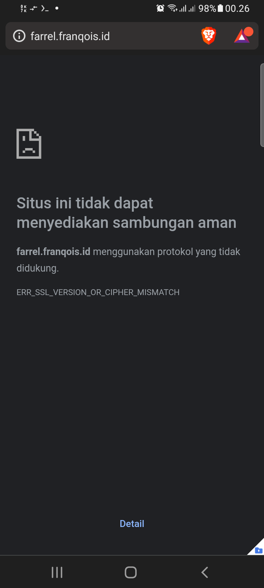 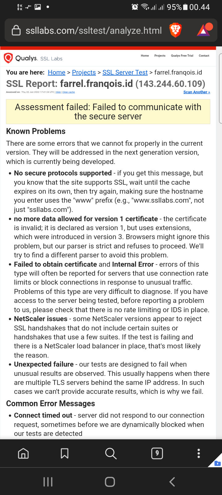

Sedangkan kalau sertifikat untuk domainnya tidak dipasang sama sekali... ya jelas gagal, karena Anda tidak memasangnya. Pasanglah dengan benar!

#### Pertanyaan ke-16: Kok sertifikat USERTrust masa berlakunya cuma sampai 2029, bukannya 2038? {#pertanyaan-ke16}

USERTrust yang Anda lihat itu bukan sertifikat akarnya, karena ia masih mengakar pada sertifikat "AAA Certificate Services". Sertifikat akar seharusnya tidak mengakar pada sertifikat apa pun — posisinya paling tinggi dalam hierarki.

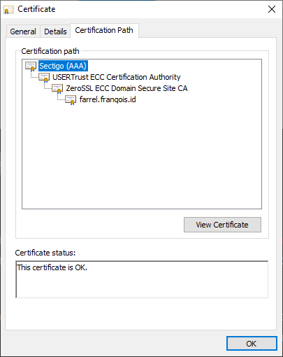 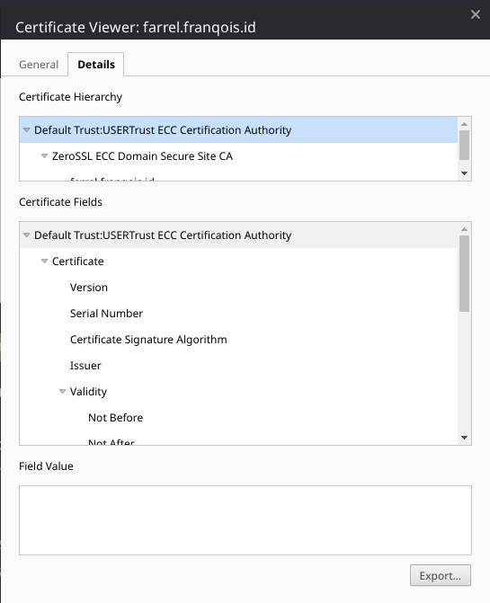

Seperti terlihat di atas, hierarki tertinggi sertifikat ZeroSSL di Windows 10 (Chrome/Chromium sebelum 105) adalah "Sectigo (AAA)", bukan "USERTrust ECC Certification Authority". Berbeda dengan sistem berbasis \*nix (GNU/Linux, Android terbaru) dan Mozilla Firefox yang menempatkan USERTrust sebagai akarnya. Jadi, rantai (_Chain of Trust_) yang Anda dapat bergantung pada perangkat lunak yang Anda pakai.

#### Pertanyaan ke-17: Kenapa sertifikat akar/rantai bisa berbeda di tiap perangkat? {#pertanyaan-ke17}

Salah satu alasannya: perangkat lunak yang sudah "berumur", tidak diperbarui, atau tidak bisa memperbarui sertifikat yang ada, sehingga ia memakai sertifikat akar lama. Selain itu, rantai yang dihasilkan saat penerbitan juga bisa Anda pilih sendiri lewat acme.sh — lihat [halaman Wiki Preferred Chain](https://github.com/acmesh-official/acme.sh/wiki/Preferred-Chain). Windows misalnya sering memakai sertifikat akar lama, sehingga rantai kepercayaan yang dihasilkan jadi terlalu banyak.

Yang jelas, agar sertifikat TLS bekerja, perangkat lunak harus "mempercayai" sertifikat akarnya. Karena sertifikat akar punya masa berlaku, perangkat lunak perlu diperbarui agar mengenali akar baru. Kalau tidak bisa diperbarui dan akar yang tersimpan sudah kedaluwarsa, skenario terburuknya adalah web/aplikasi tersebut tidak bisa diakses dari perangkat itu.

Untungnya, Windows [otomatis mengunduh sertifikat akar untuk Anda](https://community.letsencrypt.org/t/microsoft-windows-root-certificate-lazy-loading/160389) asalkan fitur [Pembaruan Sertifikat Akar Otomatis](https://docs.microsoft.com/en-us/answers/questions/202270/how-to-enable-the-34automatic-root-certificates-up.html) aktif (bawaan) dan Windows Update tetap jalan. Jadi selama akar itu dipercaya Microsoft dan Anda rutin memperbarui Windows, seharusnya aman — terutama untuk pengguna Windows 7 yang sebaiknya di-update sampai pembaruan terakhir (tutorialnya [di sini](https://www.howtogeek.com/255435/how-to-update-windows-7-all-at-once-with-microsofts-convenience-rollup/); abaikan kalimat tentang ActiveX di artikel itu, karena Microsoft Update Catalog bisa diakses peramban mana pun).

#### Pertanyaan ke-18: Saya mengalami galat/_error_ selama menggunakan acme.sh, bagaimana cara mengatasinya? {#pertanyaan-ke18}

Solusinya tergantung galatnya: berbeda pesan, berbeda penyebab, berbeda solusi. Jadi, diagnosa dulu penyebabnya dengan mengikuti [halaman dokumentasi debug acme.sh](https://github.com/acmesh-official/acme.sh/wiki/How-to-debug-acme.sh) dan membaca barisan keluarannya; kalau ada yang mencurigakan, kemungkinan besar itu penyebabnya.

Kalau kesulitan, salin seluruh keluarannya ke layanan Pastebin seperti [GitHub Gist](https://gist.github.com) atau [IX](http://ix.io/), tutup dulu informasi sensitifnya, lalu tempelkan tautannya ke kolom komentar berserta detail sistem operasi, versi acme.sh, dan kronologinya, agar saya dan yang lain bisa lebih cepat membantu.

#### Pertanyaan ke-20: Apakah ini bisa diikuti pengguna Raspberry Pi dan perangkat sejenis? {#pertanyaan-ke20}

Sangat bisa, malah saya sarankan. Untuk sistem operasinya, gunakan GNU/Linux (atau macOS, BSD, Solaris, dll). Di Android juga bisa lewat Termux.

#### Pertanyaan ke-21: Bagaimana cara memindahkan salinan acme.sh ke perangkat lain? {#pertanyaan-ke21}

1. Pastikan perangkat barunya sudah memenuhi [persiapan](#persiapan) terlebih dahulu.
2. Dari perangkat lama, kompresi direktori acme.sh-nya (berkas sertifikat dan konfigurasi ikut, sedangkan berkas program tidak usah):

    ```shell {linenos=true}
    cd
    tar --exclude '.acme.sh/deploy' --exclude '.acme.sh/notify' --exclude '.acme.sh/dnsapi' --exclude '.acme.sh/acme.sh' --exclude '.acme.sh/*.env' --format pax -cvzf acme.sh.tar.gz .acme.sh
    ```

3. Salin `acme.sh.tar.gz` ke perangkat baru (sebaiknya dienkripsi dulu), lalu pindahkan ke direktori `$HOME` di perangkat baru.
4. Di perangkat baru, instal dulu acme.sh-nya: `curl https://get.acme.sh | sh -s`
5. Ekstrak arsipnya: `tar -xvzf acme.sh.tar.gz`
6. Atur ulang `USER_PATH` di `$HOME/.acme.sh/account.conf`:

    ```bash {linenos=true}
    cp "$HOME"/.acme.sh/account.conf "$HOME"/.acme.sh/account.conf.1 ## Backup dulu
    sed -i '/USER\_PATH\=/d' "$HOME"/.acme.sh/account.conf
    printf "USER_PATH='%s'\n" "$PATH" >> "$HOME"/.acme.sh/account.conf
    ```

7. Pastikan layanan Cron selalu aktif di perangkat baru, termasuk saat _start-up_.
8. Hapus _cron job_ lama di perangkat lama supaya tidak konflik (kredensialnya sama): hapus manual lewat `crontab -e`, atau jalankan `acme.sh --uninstall-cronjob`. Kalau perlu, hapus juga acme.sh sepenuhnya dari perangkat lama dengan `acme.sh --uninstall; rm -rf ~/.acme.sh`.

Referensi terkait kompresi: [Making tar Archives More Portable](https://www.gnu.org/software/tar/manual/html_section/Portability.html) dari Proyek GNU dan [manual `tar` untuk macOS](https://ss64.com/osx/tar.html).

#### Pertanyaan ke-22: Kok muncul error 5xx saat menerbitkan/memperbarui sertifikat? (cth. "504 Gateway Time-Out") {#pertanyaan-ke22}

Penyebab terbesarnya server sedang mengalami gangguan atau _downtime_ karena suatu masalah (banyaknya pengguna, koneksi yang melambat, dll). Ini salah satu kekurangan ZeroSSL yang lumayan sering gangguan, jadi aturlah agar acme.sh dieksekusi tiap 2 jam sehari penuh agar keterlambatan pembaruan bisa diminimalkan.

#### Pertanyaan ke-26: Apakah sertifikat TLS dari ZeroSSL boleh dipasang untuk keperluan komersial (cth. _e-commerce_)? {#pertanyaan-ke26}

Saya kurang tahu pastinya. Di [Syarat & Ketentuan Layanan ZeroSSL](https://zerossl.com/terms/) tertulis:

> You may not use ZeroSSL for any commercial purpose including but not limited to selling, licensing, providing services, or distributing ZeroSSL to any third party unless you have received the express written consent of ZeroSSL beforehand.

Saya kurang paham apakah `for any commercial purpose` melarang pemasangan di situs _e-commerce_ seluruhnya, atau hanya melarang tindakan komersial terhadap layanan ZeroSSL-nya saja; dan apakah itu berlaku untuk pengguna gratisan, berbayar, atau semua. Jadi jawabannya saya kurang tahu dan belum tanya ke mereka — mungkin saja diperbolehkan selama tidak mengkomersilkan layanan mereka tanpa izin.


### Referensi lain di Artikel ini {#referensi}

Berikut referensi yang saya gunakan untuk artikel ini:

#### Referensi Penggunaan API bunny\.net

- Halaman [Dokumentasi API bunny\.net](https://docs.bunny.net/reference/pullzonepublic_addcertificate)
- Cuplikan berikut adalah obrolan di Tiket Dukungan yang menyatakan bahwa berkas sertifikat harus dikirim dalam bentuk Base64 (waktu itu dokumentasinya belum ada, sekarang sudah):

    

- Untuk konversi ke Base64, komentar pada [jawaban "Steve Folly"](https://superuser.com/a/120815) di Super User sangat membantu saya.

#### Referensi Penggunaan API Netlify

- Halaman [Dokumentasi API Netlify](https://open-api.netlify.com/#operation/provisionSiteTLSCertificate)
- Halaman **"[Get started with the Netlify API](https://docs.netlify.com/api/get-started/)"** dari Netlify
- Melakukan inspeksi jaringan di peramban web saat memasang sertifikat secara manual di Situs Web-nya, untuk mengetahui bagaimana Netlify mengirimkan datanya ke Server:
    1. Tekan <kbd>Ctrl</kbd> + <kbd>&#8679; Shift</kbd> + <kbd>I</kbd> sebelum memasang sertifikat TLS di Netlify
    2. Klik tab "Network"; jangan _refresh_ halamannya dulu
    3. Pasang sertifikat TLS Anda secara manual di halaman web-nya
    4. Setelah semua informasi terisi, klik tombol **"Install certificate"**
    5. Akan muncul permintaan ke `api.netlify.com`; klik permintaannya
    6. Gulir panel kanan ke bawah sampai menemukan **"Request Payload"**
    7. Nah, itulah data yang akan Anda kirimkan ke Netlify saat memasang sertifikat secara manual
- Untuk menghilangkan jeda baris (_line break_) dan menggantinya dengan `\n`, saya memakai jawaban dari ["Ed Morton"](https://stackoverflow.com/a/38674872) (lisensi [CC BY-SA 4.0](https://creativecommons.org/licenses/by-sa/4.0/)) dan ["mvr"](https://stackoverflow.com/a/43967678) (lisensi [CC BY-SA 3.0](https://creativecommons.org/licenses/by-sa/3.0/)) di Stack Overflow.

#### Referensi untuk lainnya

- Utas forum [**"How do I Crontab on Termux..**](https://www.reddit.com/r/termux/comments/i27szk/how_do_i_crontab_on_termux/)**"** di Reddit, referensi untuk menginstal _cron job_ di Termux
- Utas forum [**"Do I need to set crontab again when I restart termux?**](https://www.reddit.com/r/termux/comments/n6y82b/do_i_need_to_set_crontab_again_when_i_restart/)**"** di Reddit, referensi untuk mengaktifkan layanan Cron jika Termux diterminasi
- Halaman berjudul **"[RSA key lengths](https://www.javamex.com/tutorials/cryptography/rsa_key_length.shtml)"** dari Javamex, referensi pengaruh ukuran kunci RSA terhadap kecepatan (hasil uji `openssl speed` saya tulis di [bagian ukuran kunci](#ssl-beda-ukuran-kunci))
- Halaman **"[Making tar Archives More Portable](https://www.gnu.org/software/tar/manual/html_section/Portability.html)"** dari Proyek GNU dan [Manual Perintah `tar` untuk macOS](https://ss64.com/osx/tar.html)

## Penutup

Ya udah, segitu aja dulu artikel kali ini. Versi ini jauh lebih ringkas daripada versi sebelumnya yang panjang-lebar; materi lengkapnya tetap tersimpan di bab [Materi Lanjutan](#materi-lanjutan) kalau sewaktu-waktu Anda membutuhkannya.

Saya menulis artikel ini sejak 10 Juli 2021 dan butuh waktu lebih dari sebulan untuk menerbitkannya, karena membahas banyak hal dan butuh sedikit "riset" agar bisa diikuti banyak perangkat. Artikel ini juga membuka mata saya bahwa sertifikat TLS gratis tidak hanya dari Let's Encrypt saja.

Kalau ada kesalahan, salah ketik, informasi yang kurang tepat, atau pertanyaan lain, silakan berikan masukkan lewat kolom komentar yang tersediayang. Masukan dari Anda sangat berarti bagi saya dan artikel ini ke depannya. Terima kasih sudah membaca 😊

## Penggunaan Gambar dan Atribusi

Berkas-berkas gambar (seperti cuplikan layar dan gambar lainnya) yang dipakai di artikel ini disediakan di dalam [repositori blog ini](https://github.com/FarrelF/Blog). Jika Anda ingin menjelajahinya, silakan kunjungi alamat URL berikut:

```plain
https://github.com/FarrelF/Blog/tree/main/content/post/2021/08/26-cara-memasang-zerossl-dan-renew-otomatis-di-netlify-bunnycdn
```

ZeroSSL dan logonya merupakan Merek Dagang, Merek Dagang Terdaftar, dan/atau Pakaian Dagang dari "Stack Holdings GmbH", sehingga nama merek dan logo tersebut bukan milik saya pribadi; saya hanya mengambilnya dari situs web resminya dan di sana belum ada petunjuk penggunaan logonya.
