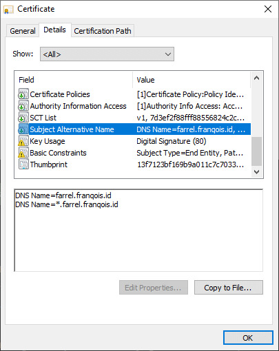

## Pembuka


Jika Anda tidak ingin membaca basa-basinya, Anda bisa langsung lanjut ke subbagian [**"Prakata"**](#prakata) sebelum ke subbagian [**"Persiapan"**](#persiapan).


Artikel kali ini akan membahas tentang Cara memasang ZeroSSL + Renew secara Otomatis di [Netlify](https://www.netlify.com), [BunnyCDN](https://afiliasi.farrelf.blog/bunnycdn), cPanel dan DirectAdmin.

~~Blog ini telah menggunakan ZeroSSL sebagai sertifikat SSL/TLS-nya dalam bentuk _Wildcard_. Gak percaya? Silakan Anda lihat sendiri.~~

**PEMBARUAN, 08 Mei 2022:** Blog ini telah memakai Google Trust Services (GTS), tidak lagi menggunakan ZeroSSL, tapi semua instruksi yang artikel ini bahas tidak banyak berubah/tidak berubah total.

Kendala saat pemasangannya adalah tidak banyak penyedia yang mendukungnya, kebanyakan hanya mendukung Let's Encrypt saja.

Sehingga saya perlu menggunakan acme.sh untuk menerbitkan/memperbarui sertifikat SSL/TLS, lalu saya melakukan _Request_ ke Server API-nya Netlify, BunnyCDN, cPanel dan DirectAdmin untuk memasangkan sertifikatnya menggunakan curl.

Terlihat sederhana, bukan? Iya, tapi sebenarnya itu tidak sesederhana dan semudah yang Anda bayangkan.

Berkat bantuan dari beberapa referensi, akhirnya saya dapat memasangkan sertifikat tersebut dan membuatnya dapat diperbarui secara otomatis.

Nah, makanya saya buat artikel ini, siapa tahu Anda tertarik atau merasa tertantang untuk memasang sertifikat SSL/TLS dari ZeroSSL ini ke dalam Web/Blog Anda bila dibandingkan dengan Let's Encrypt. Semoga artikel ini akan bermanfaat buat Anda 🙂

Di sini, Anda akan mempelajari untuk menerbitkan sertifikat SSL/TLS yang bisa Anda dapatkan dari ZeroSSL, baik jangkauannya untuk 1 domain, banyak domain atau subdomain, atau _wildcard_ dengan menggunakan acme.sh sebagai perkakasnya, setelah itu Anda akan memasangkannya dengan cara memanggil server API Bunny\.net  Netlify, DirectAdmin dan cPanel memakai curl.

Bagi yang belum tahu, [ZeroSSL](https://zerossl.com) adalah salah satu CA (_Certificate Authority_) atau otoritas sertifikat yang menerbitkan, mengelola dan mencabut sertifikat SSL/TLS untuk Internet. Ia merupakan salah satu produk dari [HID Global](https://www.hidglobal.com), yang merupakan perusahaan pemilik [CA IdenTrust](https://www.identrust.com) dan juga bagian dari [ASSA ABLOY](https://www.assaabloy.com/).

Sedangkan [acme.sh](https://acme.sh) adalah sebuah perkakas klien untuk protokol ACME, yang bertujuan sebagai alat bantu untuk menerbitkan, memperbarui, mencabut atau mengelola sertifikat SSL/TLS. Perkakas tersebut dibuat dengan menggunakan _shell_ dan kompatibel di hampir semua sistem operasi berbasis \*nix.

### Tunggu, ZeroSSL Gratis? Bukannya bayar? {#zerossl-gratis}

Iya, untuk saat ini ZeroSSL memanglah gratis, bahkan Anda juga dapat menerbitkan sertifikat SSL/TLS secara gratis dalam bentuk apa pun (termasuk _Wildcard_) dengan jumlah sertifikat yang tidak terbatas, baik dengan menggunakan RSA maupun ECC sebagai Algoritma Kunci Publiknya.

Namun, itu hanya berlaku jika Anda menerbitkannya melalui Server ACME-nya, bukan melalui Situs Web ataupun REST API-nya. Semua sertifikat yang diterbitkan melalui Protokol ACME akan memiliki masa berlaku selama 90 hari ke depan.

Serta, jika Anda membuat/menerbitkan sebuah sertifikat SSL/TLS melalui protokol ACME dan server ACME-nya, maka jumlah sertifikat yang telah diterbitkan yang tampil di situs web-nya tidak akan bertambah sama sekali, jadi kuota gratisannya tidak akan berkurang.

Infonya dari mana? Salah satu infonya berasal dari [dokumentasinya](https://zerossl.com/documentation/acme/).

~~Namun, sebetulnya jika kamu lebih teliti lagi, di Halaman "[Pricing](https://zerossl.com/pricing/)"-nya pun kamu akan menemukan tulisan "90-Day ACME Certs" yang bersebelahan dengan Simbol "tidak terbatas", yang artinya kamu dapat menerbitkan sertifikat SSL/TLS dari server ACME-nya dalam bentuk apa pun secara gratis tanpa batasan jumlah.~~

**PEMBARUAN, 16 Oktober 2021:** Simbol tersebut sekarang sudah tidak ada lagi di halaman tersebut, mungkin tujuannya memang untuk _marketing_ biar ZeroSSL tidak dianggap gratis.


Nah, sekarang sudah paham, kan? Jadi, Anda tidak perlu jadi orang kaya atau berduit banyak dulu biar bisa menerbitkan sertifikat SSL/TLS dari ZeroSSL, kecuali jika Anda ingin layanan dukungan, akses ke REST API-nya, serta sertifikat SSL/TLS dengan masa berlaku selama 1 Tahun, Anda bisa berlangganan yang berbayar.

### Kenapa ZeroSSL? Dan, kenapa gak pakai Let's Encrypt aja? {#zerossl-vs-lets-encrypt}

#### Kompatibilitas Perangkat

Sertifikat TLS dari ZeroSSL bergantung pada Sectigo (sebelumnya dikenal sebagai "COMODO CA"/"COMODO" saja) sebagai sertifikat akar dari rantai sertifikatnya (yang bisa disebut dengan "Rantai Kepercayaan", bahasa Inggrisnya: _Chain of Trust_), yang telah didukung dan dipercaya oleh mayoritas perangkat lunak sejak lama.

Informasi mengenai sertifikat akarnya sebagai berikut:

- Akar untuk Rantai (_Chain of Trust_) Pertama: "[AAA Certificate Services](https://crt.sh/?id=331986)" yang masa berlakunya sampai 31 Desember 2028 pukul 23:59:59 atau 01 Januari 2029 dalam waktu UTC

- Akar untuk Rantai (_Chain of Trust_) Kedua: "[USERTrust RSA Certification Authority](https://crt.sh/?id=1199354)" atau "[USERTrust ECC Certification Authority](https://crt.sh/?id=2841410)" yang masing-masing masa berlakunya sampai 18 Januari 2038 pukul 23:59:59 atau 19 Januari 2038 dalam waktu UTC

Ini artinya, hampir semua perangkat lunak bisa menggunakan sertifikat ini, bahkan oleh perangkat lunak versi lama sekali pun (cth. Internet Explorer 6.0+, Mozilla Firefox 1.0+, Opera 6.1+, AOL 5+, Peramban pada Blackberry 4.3.0+, Android 1.5+, dll)

Untuk lebih lanjut, Anda bisa kunjungi halaman [daftar kompatibilitasnya](https://help.zerossl.com/hc/en-us/articles/360058294074-ZeroSSL-Compatibility-List).

Sedangkan Akar dari _Chain of Trust-nya_ Let's Encrypt adalah "[DST Root CA X3](https://crt.sh/?id=8395)" (dari "IdenTrust") yang juga mendukung dan dipercaya oleh mayoritas perangkat lunak, termasuk Windows XP SP3 dan Android 7.1.1 kebawah.

Namun, sebelumnya sempat ada ["kegundahan"](https://letsencrypt.org/2020/11/06/own-two-feet.html) karena Akar yang mereka gunakan sudah mau habis masa berlakunya, akar tersebut akan habis pada tanggal 30 September 2021 dan akan digantikan dengan yang baru, yakni "[ISRG Root X1](https://crt.sh/?id=9314791)" (dari "Internet Security Research Group"), sehingga ini berimbas pada perangkat lama, terutama untuk Android 7.1.1 kebawah.

Namun, masalah ini [selesai](https://letsencrypt.org/2020/12/21/extending-android-compatibility.html) untuk Android dengan melakukan _Cross-Signing_, yang artinya sertifikat akar yang lama (DST Root CA X3) telah menerbitkan sertifikat yang 'sama dengan' sertifikat akar barunya, yakni "[ISRG Root X1](https://crt.sh/?id=3958242236)" sebagai sertifikat penengah, agar 'rantai' dapat terus digunakan meski ada bagian yang rapuh karena sudah habis masanya.


Hal ini bukan berarti masalah sudah selesai sepenuhnya, kemungkinan besar bahwa ada perangkat lain yang tidak kompatibel dengan Akar baru ini setelah Akar pertama habis masa berlakunya, kecuali Windows XP SP3 (jika Anda memperbarui sertifikat akarnya) dan Android 2.3.6 (atau di atasnya).

Berdasarkan Halaman [Kompatibilitas sertifikatnya](https://letsencrypt.org/docs/certificate-compatibility/), sepertinya perangkat yang mempercayai "ISRG Root X1" itu berkurang bila dibandingkan dengan perangkat yang mempercayai "DST Root CA X3". Sehingga, ada kemungkinan bahwa banyak perangkat lain yang tidak kompatibel dengan Let's Encrypt.


Per tanggal 30 September 2021 kemarin, sertifikat akar "DST Root CA X3" telah habis masa berlakunya dan telah diganti menjadi "ISRG Root X1".

Meski masa berlakunya habis, Let's Encrypt tetap kompatibel dengan sistem operasi Android 7.1.1 ke bawah, tapi masih menggunakan "DST Root CA X3" sebagai akarnya (lihat cuplikan layar di atas).

Jadi, jika Anda menggunakan Android 7.1.1 ke bawah, maka Anda tidak perlu melakukan apa pun.

Namun jika Anda tidak menggunakan Android, tidak bisa mengakses Web/Blog yang menggunakan Let's Encrypt atau sekadar ingin menikmati akar baru dari Let's Encrypt, silakan unduh sertifikat akar "[ISRG Root X1](https://letsencrypt.org/certs/isrgrootx1.pem)", lalu instal sertifikat akar tersebut agar dapat dipercaya oleh perangkat Anda.

Setelah selesai menginstal, nonaktifkan/hapus sertifikat akar lama, yakni "DST Root CA X3" dari perangkat Anda.

Selain mengunduh dan menginstal sertifikat akarnya secara manual, Anda juga dapat memperbarui sistem pada perangkat Anda agar dapat menikmati sertifikat akar yang baru.


Jadi, jika Anda ingin sebuah sertifikat SSL/TLS Gratis untuk web/blog atau aplikasi Anda serta dapat diakses oleh hampir semua orang atau/dan Anda kurang yakin dengan resolusi dari pihak Let's Encrypt, mungkin ZeroSSL bisa menjadi pilihan yang terbaik untuk Anda.

#### Tidak (atau Belum?) menerapkan _Rate Limit_ {#tidak-menerapkan-rate-limit}

Sampai artikel ini diterbitkan, ZeroSSL tidak (atau Belum?) menerapkan _Rate Limit_ atau batasan penerbitan sertifikat SSL/TLS, tidak seperti Let's Encrypt yang telah menerapkannya sejak lama.

Gak percaya? Silakan Anda kunjungi [halaman komparasinya](https://zerossl.com/letsencrypt-alternative/#acme) (Baca bagian "ACME"-nya) atau [halaman dokumentasinya](https://zerossl.com/documentation/acme/).

Jadi, Anda tidak perlu takut jika Anda mengalami kegagalan menerbitkan sertifikat SSL/TLS dengan alasan apa pun, karena _rate limit_ tidak ditentukan di sana.

#### Memiliki antarmuka untuk mengelola sertifikat {#antarmuka-pengelola-sertifikat}

ZeroSSL memiliki antarmuka untuk mengelola sertifikat SSL/TLS di dalam situs web-nya. Di sana, Anda bisa melihat sertifikat yang telah Anda terbitkan, sekaligus mengelola sertifikatnya.

 

Selain itu, Anda bisa menghabiskan kuota "SSL Gratis" yang telah diberikan oleh mereka dengan membuat sertifikat SSL/TLS dari situs web-nya.

Namun sayangnya, Anda tidak bisa mencabut sertifikat SSL/TLS yang telah Anda terbitkan melalui server ACME-nya di dalam situs web-nya, jadi Anda hanya bisa melihat dan mengunduhnya saja.

### Prakata

Sebelum Anda lanjut, saya peringati bahwa artikel/tutorial yang dibahas ini sangatlah "panjang x lebar", jika Anda tidak sanggup membaca artikel yang terlalu panjang, saran saya cari artikel lain yang membahas ini dengan lebih sederhana, jangan paksakan diri Anda kecuali jika ingin belajar.

Meskipun artikel ini panjang kali lebar, saya usahakan agar semuanya saya bahas dalam langkah-demi-langkah, sehingga lebih mudah dipahami oleh Anda.

Oleh karena itu, ada beberapa poin yang saya sarankan, yaitu:

- Memakai perangkat dengan layar yang lebih besar ketimbang layar dari ponsel yang Anda pakai sekarang (cth. Komputer Desktop, Monitor, Tablet/Televisi Pintar, Penggunaan fitur "Desktop Mode" pada Ponsel/Tablet Pintar, dll)
- Memiliki sebuah papan ketik (_Keyboard_) untuk mengikuti artikel ini
- Gunakan fitur "Cari di Halaman" di peramban web Anda dengan menekan tombol <kbd>Ctrl</kbd> + <kbd>F</kbd>, lalu isi dengan bagian atau teks yang ingin Anda cari

Saya usahakan agar pembahasan di artikel ini dapat diterapkan atau diikuti oleh hampir semua pengguna sistem operasi, termasuk sistem operasi Windows dan hampir semua sistem operasi berbasis \*nix, seperti sistem operasi yang berbasis Linux (cth. GNU/Linux, Android, Alpine Linux, dll), macOS, BSD, dan sistem operasi \*nix lainnya.

Namun, bukan berarti Anda dapat mengikuti semuanya meskipun saya berusaha agar ini bisa diikuti oleh hampir semua sistem operasi, karena saya belum mencoba di sistem operasi selain GNU/Linux, Windows dan Android, sehingga saya tidak berani menjaminnya.

Jadi, mohon perhatian dan pengertiannya, jika Anda melanjutkan berarti Anda sudah memahami semuanya.

Terima kasih dan selamat melanjutkan 😊

### Persiapan {#persiapan}

Di artikel ini, Anda akan mempelajari menerbitkan sertifikat SSL/TLS (selanjutnya akan saya sebut sebagai "sertifikat TLS") dengan menggunakan [acme.sh](https://acme.sh) yang (harusnya) hanya kompatibel dengan sistem operasi berbasis Unix atau mirip Unix (\*nix), termasuk GNU/Linux, macOS, BSD dan Android.

Dengan ini, tentu saja salah satu hal yang harus Anda siapkan adalah pengetahuan tentang perintah-perintah dasar dari sistem operasi berbasis \*nix, seperti `ls`, `cd`, dan dibarengi dengan pengenalan variabel dasar seperti `$HOME` dan `$PATH` serta fitur `~` di dalam _Shell_, menambahkan variabel, penavigasian, bisa _copy-paste_ dari luar ke dalam Terminal dan sebaliknya, dan bisa mengedit berkas di dalam Terminal.

Kata "Terminal" di sini bukan merujuk pada "Terminal Kendaraan" atau "Terminal Bis" ya, "Terminal" yang saya maksudkan di sini adalah aplikasi Emulator Terminal (_Terminal Emulator_) seperti x-term, Konsole, GNOME Terminal, Windows Terminal, Git Bash, dll.

Selain itu, Anda juga harus mempersiapkan perangkat lunak yang diminta agar perkakas acme.sh bisa digunakan dan Anda bisa mengikuti artikel ini secara keseluruhan, apalagi jika Anda menggunakan sistem operasi Windows.

Berikut di bawah ini adalah persiapan perangkat lunaknya:

#### Untuk Pengguna GNU/Linux, macOS, BSD dan Sistem Operasi berbasis \*nix lainnya {#persiapan-pengguna-unix-like}

Hal-hal yang harus Anda siapkan untuk pengguna sistem operasi berbasis \*nix adalah sebagai berikut:

- OpenSSL (atau LibreSSL?)
- curl
- Cron (atau Systemd Timer untuk pengguna Systemd)
- [`jq`](https://jqlang.github.io/jq/) (khusus pengguna cPanel dan/atau DirectAdmin)
- Socat (Socket Cat) (Opsional, hanya berlaku buat yang ingin menjalankan acme.sh dalam "Standalone Mode", artikel ini tidak membahasnya lebih lanjut)

#### Untuk Pengguna Windows {#persiapan-pengguna-windows}

Hal-hal yang harus Anda siapkan untuk pengguna Windows adalah sebagai berikut:

- Memiliki Akses ke Lingkungan \*nix: (Pilih salah satu caranya)
  - Mengaktifkan fitur [WSL (Windows Subsystem for Linux) 2](https://learn.microsoft.com/en-us/windows/wsl/install) untuk Windows 10 atau di atasnya (disarankan)
  - Menggunakan perangkat lunak yang dapat mengemulasikan lingkungan UNIX, seperti Git Bash, Cygwin, dll, tapi opsi ini belum saya coba
  - Mesin Virtual atau Kontainer dengan sistem operasi berbasis \*nix (disarankan menggunakan GNU/Linux)
  - Mengakses server atau perangkat Anda yang menggunakan sistem operasi \*nix dengan menggunakan klien SSH
- Persiapan perangkat lunak pada WSL, mesin virtual, kontainer atau pada server bisa mengikuti [persiapan untuk sistem operasi \*nix](#persiapan-pengguna-unix-like)

Namun, jika Anda mempunyai ponsel berbasis Android 7.0 atau di atasnya, disarankan instal Termux di ponselmu dan buatlah agar Termux-nya dapat diakses dari komputer desktop atau laptop kamu melalui SSH, lalu kamu atur agar Termux-nya dapat diaktifkan setelah perangkat dinyalakan dan terus aktif di latar belakang, caranya kunjungi [artikel ini](https://farrelf.blog/cara-menggunakan-termux-dari-komputer/).

#### Untuk Pengguna Android (tidak perlu akses _root_) {#persiapan-pengguna-android}

Hal-hal yang harus Anda siapkan untuk pengguna Android adalah sebagai berikut:

- Menggunakan sistem operasi Android versi 7.0 atau di atasnya, sebagai syarat untuk menggunakan Termux. Jika di bawah 7.0, Anda dapat [mengikuti petunjuknya](https://github.com/termux/termux-app/wiki/Termux-on-android-5-or-6), tapi saya tidak dapat menjamin bahwa Anda akan dapat mengikuti artikel ini ke depannya walau kemungkinan besar bisa-bisa saja
- Terinstalnya Termux di dalam perangkat Android Anda. Bisa diunduh di [F-Droid resminya](https://f-droid.org/repository/browse/?fdid=com.termux), bisa juga unduh di [Google Play Store](https://play.google.com/store/apps/details?id=com.termux), tapi saya sarankan lewat F-Droid karena Termux di Google Play Store masih bersifat eksperimental
- Persiapan yang harus Anda lakukan pada Termux setelah diinstal adalah sebagai berikut:
    1. Buka Termux-nya
    2. Perbarui semua paket yang ada di Termux dengan perintah: `pkg upg -y`
    3. Instal semua keperluannya dengan perintah: `pkg i -y curl wget openssl-tool jq cronie termux-services`, lalu mulai ulang Termux jika berhasil
    4. Aktifkan Layanan (_Service_) Cron di latar belakang dengan perintah: `sv-enable crond && sv up crond`
    5. Jika Anda memiliki komputer desktop atau laptop dan ponsel pintar berbasis Android yang terkoneksi dengan jaringan yang sama, maka sebaiknya kamu instal `openssh` (atau sejenisnya) di dalam Termux, lalu kamu lakukan semua itu secara remot dari komputer desktop atau laptop kamu melalui perkakas klien SSH. Caranya bisa Anda baca [artikel ini](https://farrelf.blog/cara-menggunakan-termux-dari-komputer/)

**Catatan:** Semua hal di atas dapat Anda lakukan tanpa perlu akses _root_ sedikit pun dan perangkat tidak perlu dalam keadaan _rooted_, sehingga Anda tidak perlu khawatir soal garansi perangkat.

## Sebelum menerbitkan Sertifikat TLS

Sebelum menerbitkannya, Anda perlu mengikuti beberapa poin pembahasan terlebih dahulu. Poin-poin akan saya bahas dalam langkah-demi-langkah.

Jadi, harap Anda jangan melewati satu langkah pun, kecuali jika ada catatan yang mengizinkannya.

Atau, Anda juga bisa lewati bagian ini jika Anda sudah pernah mendaftarkan akun ZeroSSL, meng-install dan konfigurasi acme.sh, serta melakukan pengaitan akun ZeroSSL dengan acme.sh sebelumnya.

### Membuat Akun ZeroSSL dan mendapatkan Kredensial EAB-nya {#membuat-akun-zerossl}

Sebelum Anda menerbitkan sertifikatnya, silakan mendaftar akun ZeroSSL terlebih dahulu melalui [situs webnya](https://zerossl.com).

Setelah mendaftar, kamu tidak perlu membuat/menerbitkan sertifikatnya di sana, melainkan hanya perlu Kredensial EAB (_External Account Binding_) yakni **"EAB KID"** dan **"EAB HMAC Key"**-nya saja.

**Apa itu Kredensial EAB?** Kredensial EAB adalah sebuah kredensial untuk menghubungkan antara perkakas/perangkat lunak yang merupakan klien untuk protokol ACME dengan akun CA yang telah Anda daftarkan.

Tanpa basa-basi lagi, langkah-langkahnya sebagai berikut:

1. Daftar Akun ZeroSSL-nya [di Situs Web-nya](https://app.zerossl.com/signup) dan login setelah itu (Atau, kamu hanya perlu [Login](https://app.zerossl.com/login) saja jika kamu sudah pernah mendaftar akun sebelumnya)
2. Pada Dasbor ZeroSSL, klik **"Developer"**
3. Setelah itu, pada bagian **"EAB Credentials for ACME Clients"**, klik _Button_ **"Generate"**
4. Simpan **"EAB KID"** dan **"EAB HMAC Key"** yang telah dihasilkan itu dengan baik, nanti akan digunakan lagi untuk acme.sh
5. Setelah menyimpannya, kamu tinggal klik _Button_ **"Done"** dan Selesai

Jika Anda tidak memahami langkah-langkah di atas, Anda dapat melihat cuplikan layar berikut yang cukup menyesuaikan dengan langkah-langkah di atas: (Silakan perbesar gambarnya dengan mengkliknya)

 

Setelah Kredensial EAB dibuat, perlu diingat bahwa sejak Maret 2022 yang lalu kredensial EAB dapat digunakan kembali, sehingga kredensial yang sama dapat digunakan berkali-kali. Jadi, simpanlah kredensial tersebut dengan baik dan jangan beritahu ke siapa pun, kecuali jika Anda mempercayai orang tersebut dan siap menanggung sendiri atas risiko yang disebabkan oleh Anda sendiri.

Sekarang lanjut ke langkah berikutnya, yakni instal acme.sh, dan Anda sama sekali tidak perlu menerbitkan sertifikat TLS-nya di sana.

### Instal acme.sh {#install-acme-sh}

Setelah mendaftar akun ZeroSSL, salah satu hal yang perlu Anda lakukan adalah menginstal acme.sh terlebih dahulu di dalam sistem operasi Anda.

Tidak perlu menggunakan akun administrator atau `root` untuk menginstalnya, atau tidak perlu dieksekusikan melalui perintah `sudo` layaknya Certbot, cukup gunakan saja akun Anda yang sekarang, seperti biasanya.

Cara menginstalnya adalah dengan mengeksekusikan salah satu perintah berikut:

Dengan curl:

```shell
curl https://get.acme.sh | sh -s email=emailku@domain.com
```

Atau dengan GNU Wget:

```shell
wget -O - https://get.acme.sh | sh -s email=emailku@domain.com
```

Atau, Anda dapat menambah parameter `--force` jika Anda tidak ingin menggunakan Cron, contohnya seperti berikut:

```shell
curl https://get.acme.sh | sh -s email=emailku@domain.com --force
```

Ganti `emailku@domain.com` dengan alamat surel Anda, jangan lupa dimasukkan, tapi jika Anda lupa atau telanjur salah memasukkan alamat surel saat menginstalnya, Anda dapat eksekusi perintah di bawah ini setelah terinstal:

```shell {linenos=true}
cp "$HOME"/.acme.sh/account.conf "$HOME"/.acme.sh/account.conf.1 ## Backup dulu
sed -i '/ACCOUNT\_EMAIL\=/d' "$HOME"/.acme.sh/account.conf ## Hapus Variabel `ACCOUNT_EMAIL` yang sudah ada
printf "ACCOUNT_EMAIL='%s'\n" "emailku@domain.com" >> "$HOME"/.acme.sh/account.conf
```

Ganti `emailku@domain.com` dengan alamat surel Anda.

Setelah selesai instal, pastikan bahwa acme.sh dapat dieksekusi dengan baik dengan mengetik `acme.sh --version` di dalam Terminal, lalu tekan tombol <kbd>&#8629; Enter</kbd>.

Jika dapat dieksekusi dengan baik, maka akan tampil versi dari acme.sh dan selamat Anda telah menginstalnya dengan benar, silakan [klik di sini](#registrasi-akun-acme-sh) untuk melanjutkan ke langkah berikutnya.

Jika tidak, gunakan perintah `source <LETAK_KONFIGURASI_SHELL>` atau tutup Terminal lalu buka lagi untuk memperbarui _Shell_.

Kalau masih tidak bisa juga, maka Anda perlu memasukkan direktori acme.sh ke dalam variabel `PATH` dengan menambahkan teks berikut di bawah ini ke dalam berkas konfigurasi _Shell_ yang nantinya akan digunakan ketika Anda menjalankan sebuah _Shell_ secara interaktif.

Berikut adalah teksnya:

```shell {linenos=true}
source ~/.acme.sh/acme.sh.env
```

Tambahkan baris di atas ke dalam berkas `~/.bashrc` jika Anda menggunakan GNU Bash atau `~/.zshrc` jika Anda adalah pengguna Z Shell.

Atau, berikut di bawah ini jika Anda menggunakan `fish` sebagai _Shell_:

```fish {linenos=true}
fish_add_path "$HOME"/.acme.sh
set -xU LE_WORKING_DIR "$HOME"/.acme.sh
```

Atau, di bawah ini jika Anda menggunakan `fish` dengan versi di bawah 3.2.0:

```fish {linenos=true}
set -Ua fish_user_paths "$HOME"/.acme.sh
set -xU LE_WORKING_DIR "$HOME"/.acme.sh
```

Tambahkan baris di atas ke dalam berkas `~/.config/fish/conf.d/acme.sh.fish` jika Anda menggunakan `fish` sebagai _Shell_.

Setelah selesai menambahkannya, simpanlah berkas tersebut dari editor teks favorit Anda dan perbarui _Shell-nya_ dengan menggunakan perintah `source <LETAK_KONFIGURASI_SHELL>` atau keluar dari Terminal lalu buka lagi, setelah itu coba eksekusikan ulang perkakas acme.sh-nya.

### Registrasi Akun melalui acme.sh {#registrasi-akun-acme-sh}

Secara baku, acme.sh menggunakan ZeroSSL sebagai CA (_Certificate Authority_)-nya, jadi jika Anda adalah orang yang pertama kali menggunakan acme.sh, silakan registrasikan akun ZeroSSL yang telah Anda buat terlebih dahulu ke Server ACME-nya menggunakan acme.sh dengan perintah berikut:

```shell
acme.sh --register-account \
        --eab-kid EAB_KID_KAMU_DI_SINI \
        --eab-hmac-key EAB_HMAC_KEY_KAMU_DI_SINI
```

Ganti `EAB_KID_KAMU_DI_SINI` dan `EAB_HMAC_KEY_KAMU_DI_SINI` dengan "EAB KID" dan "EAB HMAC Key" yang telah kamu simpan sebelumnya.

Anda bisa simpan `ACCOUNT_THUMBPRINT`-nya dengan baik, barangkali suatu saat nanti Anda ingin menjalankan acme.sh dalam "[Stateless Mode](https://github.com/acmesh-official/acme.sh/wiki/Stateless-Mode)", tapi Anda bisa dapatkan itu kembali dengan mengeksekusi perintah `acme.sh --register-account`.

Jika sudah, silakan lanjut ke [langkah berikutnya](#membuat-akses-api).

### Membuat Akses API

Sebelum menerbitkan sertifikat TLS, maka ada baiknya untuk membuat kode token untuk akses ke API-nya terlebih dahulu.

Ini akan sangat berguna untuk verifikasi DNS ke depannya dan juga memasang sertifikat TLS itu sendiri. Jadi, Anda wajib membuatnya, tapi Anda tidak perlu membuat semuanya, melainkan sesuai dengan layanan yang Anda gunakan.

Misalnya, jika Anda menggunakan Cloudflare sebagai Penyedia DNS dan Netlify sebagai Hosting atau cPanel/DirectAdmin sebagai Kontrol Panel Hosting, maka Anda hanya perlu membuat akses API dari Cloudflare untuk keperluan verifikasi DNS dan Netlify/cPanel/DirectAdmin untuk keperluan memasang sertifikat TLS.

Atau, jika Anda menggunakan Netlify sebagai Penyedia DNS dan Hostingnya, Anda hanya cukup membuat 1 kode token dari Netlify saja untuk keperluan verifikasi DNS dan memasang sertifikatnya, iya cukup 1 saja, tidak perlu membuat banyak untuk keperluan yang berbeda-beda.

Kalau sudah tahu caranya dan sudah pernah Anda lakukan sebelumnya, Anda bisa langsung [lewati ini](#verifikasi-dns-di-acmesh).

Kalau belum, silakan ikuti cara-caranya berikut di bawah ini.

#### Penyedia DNS Cloudflare {#cloudflare-api-token}

Untuk membuat Kode Token Akses API-nya, silakan baca [dokumentasinya](https://developers.cloudflare.com/fundamentals/api/get-started/create-token/), di sana sudah dijelaskan secara lengkap tentang bagaimana cara membuat kodenya.

Jika belum jelas, saya bahas saja caranya di sini. Caranya sebagai berikut:

0. Pastikan Anda sudah login terlebih dahulu menggunakan akun Cloudflare Anda dengan mengunjungi [Halaman Dasbornya](https://dash.cloudflare.com/login). Udah? Kalau begitu, Anda bisa lanjut
1. Jika Anda sudah sampai di halaman dasbornya:
   - a. Klik pada Ikon Orang di pojok kanan atas
   - b. Lalu, klik **"My Profile"**
   - c. Setelah itu, klik pada tab **"API Tokens"**

    Atau sederhananya, silakan [klik di sini](https://dash.cloudflare.com/profile/api-tokens)
2. Setelah Anda memasukki bagian **"API Token"**, klik pada _Button_ **"Create Token"**

    Kira-kira untuk no. 1 dan 2 cuplikannya akan seperti berikut:


3. Saat proses membuat Token, Anda akan memilih templat yang dipakai untuk membuat Akses API-nya. Maka dari itu, pakai saja templat **"Edit zone DNS"** dengan mengklik _Button_ **"Use this template"** di sebelahnya (Seperti pada cuplikan berikut)


4. Setelah menentukan templatnya, nanti Anda akan diminta untuk melengkapi informasi yang ada di sana. Lengkapi informasi berikut ini:
   - **Token Name**: Itu merupakan nama token yang ingin Anda buat. Secara baku, nama token menggunakan nama templatnya, bisa diubah sesuka hati Anda dengan mengklik pada ikon pensil di sebelah namanya
   - **Permissions**: Itu merupakan perizinan untuk token yang Anda buat nantinya, karena menggunakan templat **"Edit zone DNS"**, maka seharusnya informasi tersebut sudah dilengkapi. Pastikan itu sudah diisi dengan **"Zone"**, **"DNS"** dan **"Edit"**, kalau sudah, Anda bisa lewati ini.
   - **Zone Resources**: Itu merupakan cakupan zona (_Zone_) untuk token ini. Jika Anda ingin tokennya itu dapat mencakup semua domain yang telah Anda tambahkan di Cloudflare, maka pastikan pilih: (salah satu)
       - **"Include"** dan **"All zones"**
       - **"Include"**, **"All zones from an account"**, lalu pilih Akun yang ingin Anda cakup
   - **Client IP Address Filtering**: Jika Anda ingin mengatur atau menyaring alamat IP klien atau pengguna API, maka Anda bisa atur itu, ini akan cocok jika Anda ingin menggunakan API tersebut di perangkat yang alamat IP-nya tidak berubah-ubah dan bersifat publik (seperti VPS/Server). Jika tidak, maka sebaiknya lewati saja.
   - **TTL**: Atur itu jika Anda ingin token yang Anda buat memiliki masa berlaku, jika tidak maka sebaiknya lewati saja

5. Jika Anda sudah mengisi semua informasinya, klik pada _Button_ **"Continue to summary"**

    Kira-kira untuk no. 4 dan 5, cuplikannya akan menjadi seperti berikut:


6. Di sana Anda akan melihat kesimpulan dari Token yang ingin Anda buat, jika merasa yakin, silakan klik pada _Button_ **"Create Token"** (Seperti pada cuplikan berikut)


7. Setelah itu, kodenya akan tampil di sana. Salinkan **"API Token"** tersebut dengan mengklik pada _button_ **"Copy"**, lalu simpan itu baik-baik karena kode tersebut tidak akan tampil lagi, serta pastikan bahwa tidak ada satu pun orang lain yang mengetahuinya kecuali dengan seizin Anda. Selain itu, Anda juga dapat mengujinya di sana untuk memastikan apakah kode terebut bekerja atau tidak.


Nah, setelah **"API Token"** dibuat, Anda harus mendapatkan **"Account ID"**-nya, kalau kamu perlu bisa dapatkan **"Zone ID"**-nya juga.

Untuk mendapatkan kedua itu, pergi ke [Halaman Dasbor Cloudflare](https://dash.cloudflare.com), pilih domainnya, lalu gulirkan kebawah, nanti akan ketemu Informasi mengenai **"Account ID"** dan **"Zone ID"**, seperti di bawah ini:


Setelah mendapatkan semua itu, sekali lagi, simpanlah informasi tersebut baik-baik karena akan digunakan kembali, pastikan juga bahwa tidak ada seorang pun yang dapat mengetahui informasi tersebut kecuali Anda sendiri atau orang yang dapat Anda percayakan.

Jika tidak ada lagi penyedia lain yang perlu Anda buatkan Akses API-nya, silakan langsung lanjut ke bagian [Verifikasi DNS di acme.sh](#verifikasi-dns-di-acmesh)

#### Netlify {#netlify-personal-access-token}

Jika Anda menggunakan Netlify sebagai Hosting ataupun Penyedia DNS untuk domain-mu atau kedua-duanya, Anda perlu buat sebuah Akses API yang bernama **"Personal access token"**.

Ngomong-ngomong, selain bisa untuk verifikasi DNS, kode token ini bisa Anda gunakan juga untuk memasang sertifikatnya nanti. Jadi setelah Anda membuatnya, simpanlah kode tersebut dengan baik agar bisa digunakan nanti.

Namun, jika sebelumnya sudah pernah menerbitkan sertifikatnya dan membuat kode token Netlify, serta ingin memasangkan sertifikatnya di sana melalui Akses API, silakan lewati bagian ini dan verifikasi DNS dengan [klik di sini](#pasang-ssl-di-netlify) untuk langsung melompat ke caranya.

Kalau belum, silakan dibuat terlebih dahulu, caranya sebagai berikut:

0. Anda bisa langsung masuk [ke sini](https://app.netlify.com/user/applications), lakukan login terlebih dahulu jika diminta.
1. Klik pada _button_ **"New access token"** di bagian **"Personal access tokens"**


2. Masukkan Nama/Deskripsi mengenai Tokennya
3. Setelah itu, klik pada _Button_ **"Generate"** untuk menghasilkan **"Access Token"**-nya


4. Setelah **"Access Token"** tampil, simpan itu baik-baik, karena **"Access Token"** tersebut tidak bisa tampil lagi dan itu akan digunakan kembali, serta pastikan bahwa tidak ada orang lain yang mengetahuinya
5. Klik pada _Button_ **"Done"** jika merasa sudah selesai


Setelah mendapatkan semua itu, sekali lagi, simpanlah informasi tersebut baik-baik karena akan digunakan kembali, pastikan juga bahwa tidak ada seorang pun yang dapat mengetahui informasi tersebut kecuali Anda sendiri atau orang yang dapat Anda percayakan.

Jika tidak ada lagi penyedia lain yang perlu Anda buatkan Akses API-nya, silakan langsung lanjut ke bagian [Verifikasi DNS di acme.sh](#verifikasi-dns-di-acmesh)

#### bunny\.net (sebelumnya BunnyCDN) {#bunny-access-key}

Jika Anda menggunakan bunny\.net (sebelumnya: BunnyCDN) sebagai CDN, _Reverse-proxy_, Penyedia DNS ataupun Hosting, maka Anda bisa mendapatkan **"Access Key"**-nya di sini.

Namun, jika sebelumnya sudah sudah pernah menerbitkan sertifikatnya, sudah mendapatkan dan menyimpan **Access Key**-nya, serta ingin memasangkan sertifikatnya di sana melalui Akses API, silakan lewati bagian ini dan verifikasi DNS dengan [klik di sini](#pasang-ssl-di-bunnycdn) untuk langsung melompat ke caranya.

Kalau belum, silakan dapatkan terlebih dahulu, caranya sebagai berikut:

0. Silakan akses ke [Dasbor bunny.net-nya](https://dash.bunny.net/), login jika diminta.
1. Klik pada foto profilmu, lalu klik **"Account settings"** untuk masuk ke dalam pengaturan akun
2. Di dalam pengaturan akun, klik pada **"API Key"**
3. Di situ kamu akan melihat sebuah kotak teks yang diisikan dengan lingkaran atau tanda bintang, klik pada ikon papan klip untuk langsung menyalinkan kodenya atau ikon mata jika Anda ingin melihat isi yang sebenarnya
4. Nah, **"Access Key"** sudah disalin atau tampil, simpan itu baik-baik untuk digunakan nanti dan pastikan tidak ada siapa pun yang mengetahuinya

Jika Anda tidak memahami langkah-langkah di atas, maka Anda dapat melihat cuplikan layar berikut: (Silakan perbesar gambarnya dengan mengkliknya)

 

Setelah mendapatkan semua itu, sekali lagi, simpanlah informasi tersebut baik-baik karena akan digunakan kembali, pastikan juga bahwa tidak ada seorang pun yang dapat mengetahui informasi tersebut kecuali Anda sendiri atau orang yang dapat Anda percayakan.

Jika tidak ada lagi penyedia yang perlu Anda buatkan Kode Token-nya, silakan langsung lanjut ke [Verifikasi DNS di acme.sh](#verifikasi-dns-di-acmesh)

#### cPanel {#cpanel-api-token}

Jika Anda merupakan pengguna cPanel, baik di server sendiri maupun di layanan hosting yang Anda gunakan, Anda diharuskan untuk membuat kode token agar sertifikat dapat terpasang secara otomatis dengan mengakses API-nya.

Namun, jika sebelumnya sudah pernah menerbitkan sertifikatnya dan sudah membuat kode token di cPanel, serta ingin memasangkan sertifikatnya melalui API-nya, silakan lewati bagian ini dan verifikasi DNS dengan [klik di sini](#pasang-ssl-di-cpanel) untuk langsung melompat ke caranya.


Fitur ini masih dalam tahap eksperimental, jadi silakan tanggung sendiri segala risiko yang akan Anda hadapi ke depan, seperti perubahan yang terjadi dengan cepat dan risiko lainnya.


Kalau belum, silakan buat terlebih dahulu, caranya sebagai berikut:

1. Masuk ke cPanel menggunakan akun cPanel Anda, bukan Akun _Billing_ (Akun cPanel dan _Billing_ itu beda lho, jangan salah)
2. Setelah masuk ke cPanel, gulirkan tetikusnya ke arah bawah sampai ke bagian **"Security"** (bahasa Indonesia: **"Keamanan"**), pada bagian tersebut kamu klik **"Manage API Tokens"**, seperti cuplikan berikut: (Atau, langsung cari aja **"Manage API Tokens"**, terus tinggal kamu klik aja hasilnya)


3. Jika Anda baru pertama kali membuat kode token, Anda akan langsung diminta untuk melengkapi informasi yang ada di sana untuk dibuatkan kode token-nya. Lengkapi informasi berikut ini:

    

    - **API Token Name:** Itu merupakan Nama kode token yang ingin Anda buat, Anda bisa mengisinya dengan bebas, tapi karakter yang boleh dimasukkan adalah alfanumerik (besar dan kecil diperbolehkan), tanda hubung/pisah dan tanda garis bawah saja, serta peka terhadap huruf besar dan kecil (_case sensitive_)
    - **Should the API Token Expire?:** Itu menentukan masa berlaku _API Token_ yang Anda buat, jika tidak ingin ada masa berlaku, Anda tinggal pilih **"The API Token will not expire"** atau **"Specify an expiration date"** jika Anda ingin menyetel tanggalnya (Saran saya jangan ada masa berlaku, kalau mau ada masa berlakunya pastikan Anda bisa memperbaruinya secara otomatis)

4. Jika sudah selesai, klik pada _button_ **"Create"** (bahasa Indonesia: **"Buat"**)

5. Setelah mengkliknya, kamu akan melihat Kode _API Token_ yang hanya bisa dilihat sekali saja, jadi simpanlah _API Token_ tersebut baik-baik dan pastikan tidak ada seorang pun yang mengetahuinya kecuali Anda sendiri.

   Jika sudah, centang pada bagian **"Create another token after I click Yes, I saved my token."**, lalu klik pada _Button_ **"Yes, I Saved My Token"**, seperti cuplikan berikut:

    

Setelah mendapatkan semua itu, sekali lagi, simpanlah informasi tersebut baik-baik karena akan digunakan kembali, pastikan juga bahwa tidak ada seorang pun yang dapat mengetahui informasi tersebut kecuali Anda sendiri atau orang yang dapat Anda percayakan.

Jika tidak ada lagi penyedia lain yang perlu Anda buatkan Akses API-nya, silakan langsung lanjut ke bagian [Verifikasi DNS di acme.sh](#verifikasi-dns-di-acmesh)

#### DirectAdmin {#directadmin-login-key}

Jika Anda merupakan pengguna DirectAdmin, baik di server sendiri maupun di layanan hosting yang Anda gunakan, sebaiknya Anda membuat **"Login Key"** (bahasa Indonesia: Kunci Masuk) terlebih dahulu agar dapat memasangkan sertifikat TLS secara otomatis melalui API-nya.

Namun, jika sebelumnya sudah pernah menerbitkan sertifikatnya dan sudah membuat **"Login Key"**-nya di DirectAdmin, serta ingin memasangkan sertifikatnya melalui API-nya, silakan lewati bagian ini dan verifikasi DNS dengan [klik di sini](#pasang-ssl-di-directadmin) untuk langsung melompat ke caranya.

Kalau belum, silakan dibuat terlebih dahulu, caranya sebagai berikut:

1. Masuk ke DirectAdmin menggunakan Akun DirectAdmin Anda, bukan Akun _Billing_ (Akun DirectAdmin dan _Billing_ itu beda lho, jangan salah)

2. Setelah masuk ke DirectAdmin, gunakan fasilitas pencarian untuk mencari **"Login Keys"** (tanpa kutip), jika ketemu klik pada **"Login Keys"**. Seperti cuplikan berikut:


3. Setelah masuk ke **"Login Keys"**, klik pada _Button_ **"Create"** untuk membuat **"Login Key"**-nya. Seperti cuplikan berikut:


4. Lalu, lengkapi informasi berikut untuk membuatnya:

    

    - **Key Type:** Pilih jenis kuncinya, pilih saja **"Key"**
    - **Key Name:** Tentukan nama kuncinya, nama hanya boleh mengandung karakter alfanumerik saja, besar-kecilnya diperhatikan, tidak boleh ada karakter apa pun selain itu termasuk simbol dan spasi
    - **Key Value:** Tentukan nilai kuncinya, saran saya klik pada ikon dadu saja agar bisa dihasilkan dengan acak, tidak disarankan untuk menggunakan kata sandi Anda sebagai nilai kuncinya
    - **Expires On:** Tentukan masa berlaku kuncinya, saran saya centang **"Never"** saja, kecuali jika Anda dapat memperbaruinya secara terprogram
    - **Clear Key:** Di bagian ini ada opsi **"Automatically delete the key once the key expires"** yang bisa Anda centang, ini tidak akan berpengaruh kalau **"Login Key"**-nya tidak memiliki masa berlaku
    - **Allow HTM:** Di bagian ini ada opsi **"Allows browsing of the DA interface to HTM, IMG and CSS files."** yang bisa Anda centang, entah ini fungsinya buat apaan, sepertinya untuk kasus ini dicentang atau tidak juga tidak terlalu berpengaruh
    - **Commands:** Di bagian ini, Anda harus menentukan perintah mana yang diizinkan dan ditolak. Untuk kasus ini, Anda harus menolak semua perintah selain `CMD_API_SSL` dan `CMD_SSL` yang diizinkan. Caranya tinggal centang **"Deny"**, lalu cari dengan kata kunci **"SSL"** (tanpa kutip), setelah itu centang dua-duanya di kolom **"Allow"** (Untuk lebih jelas, bisa lihat pada cuplikan di atas)
    - **Allowed IPs:** Anda bisa menentukan hanya dari Alamat IP apa saja yang diperpolehkan untuk menggunakan kunci ini, saran saya tidak usah diisi untuk mengijinkan semua Alamat IP untuk menggunakan kunci ini, kecuali jika Anda mempunyai kebutuhan khusus
    - **Current Password:** Isikan ini dengan kata sandi Akun DirectAdmin Anda yang sekarang

5. Jika sudah selesai, klik pada _Button_ **"Create"** untuk membuatkan kuncinya

6. Setelah mengkliknya, kamu akan melihat **"Key Value"** yang kamu isi dan itu adalah **"Login Key"**-nya yang hanya bisa dilihat satu kali saja, jadi simpanlah kunci tersebut baik-baik dan pastikan tidak ada seorang pun yang dapat mengetahuinya kecuali Anda sendiri dan orang yang Anda percayakan.

    Jika sudah, Anda tinggal menutupinya saja dengan mengklik ikon silangnya. Seperti cuplikan berikut:

    

Jika tidak ada lagi penyedia lain yang perlu Anda buatkan Akses API-nya, silakan langsung lanjut ke bagian [Verifikasi DNS di acme.sh](#verifikasi-dns-di-acmesh)

### Verifikasi DNS di acme.sh

Agar sertifikat TLS dapat diterbitkan melalui protokol ACME, maka pengguna diperlukan melakukan verifikasi. Salah satunya adalah dengan verifikasi DNS.

Verifikasi DNS merupakan sebuah metode yang menggunakan catatan DNS (_DNS Record_) pada domain pengguna untuk memverifikasi bukti kepemilikan domain sebelum sertifikat diterbitkan atau diperbarui.

Verifikasi seperti ini tidak memerlukan keberadaan _web server_ dan juga tidak perlu mengakses konten apa pun (cth. Mengakses `http://domain.com/.well-known/.acme-challenge-xxxxxxxxxxxx`) untuk itu, sehingga Anda bisa menerbitkannya di mana saja dan di perangkat apa saja (termasuk Ponsel Pintar, Komputer Desktop, dll), selama Anda dapat menjalankan acme.sh di dalam perangkat Anda.

Ini juga sebagai syarat agar Anda dapat menerbitkan sertifikat TLS untuk semua subdomain Anda (_Wildcard SSL_) dengan mudah.

Selain itu, karena Anda ingin memasang sertifikat TLS di penyedia web yang sedang saya bahas di artikel ini, yakni Netlify, Bunny CDN, cPanel dan DirectAdmin, serta Anda melakukannya di dalam perangkat yang Anda miliki, maka metode verifikasi seperti ini wajib Anda pelajari.

Namun, agar perkakas acme.sh dapat melakukan verifikasi DNS secara otomatis saat menerbitkan dan memperbarui sertifikat TLS-nya, maka acme.sh harus dapat mengakses dan mengubah catatan DNS di dalam domain milik Anda dengan mengakses akun penyedia DNS milik Anda.

Untuk itu, Anda perlu berikan sebuah izin untuk membaca dan mengubah catatan DNS dengan memberinya sebuah kredensial milik Anda, seperti: _API Token_, Kunci API untuk Akses API atau bahkan Nama Pengguna dan Kata Sandi.

**Kalau saya gak mau gimana?** Bisa saja Anda melakukannya secara manual, sehingga Anda menambahkan catatan DNS-nya secara manual juga.

Namun sertifikat TLS tersebut memiliki masa berlaku selama 90 hari, sehingga harus diperbarui sebelum habis masanya (minimum 60 hari setelah sertifikat diterbitkan) dan saat pembaruan Anda harus masukkan lagi catatan DNS-nya secara manual, sehingga tidak mungkin kamu bisa memperbarui sertifikat tersebut secara otomatis.

Pertanyaannya, apa kamu gak capek kayak gitu terus? Ya terserah kamu, sih. Kalo saya jadi kamu, mending saya pake metode yang otomatis saja ketimbang pake yang manual.

Jadi kamu gak perlu takut, perkakas acme.sh ini gak bakalan ngumpulin data-data kamu kok, kamu hanya perlu hati-hati aja dalam menjaga perangkatnya 😊

#### Untuk Pengguna DNS Otoritatif Cloudflare {#untuk-pengguna-cloudflare}

Jika Anda menggunakan Cloudflare sebagai penyedia DNS untuk domain Anda, maka Anda perlu membuat kode Token API-nya (`CF_Token`) dan mendapatkan **"Account ID"**-nya (`CF_Account_ID`).

Kalau perlu, kamu juga bisa dapatkan **"Zone ID"**-nya juga, agar acme.sh dapat menargetkan domain/zona yang spesifik tanpa harus mencarinya lagi, tapi itu tidak wajib, kalau menurutmu gak perlu ya gak usah.

Namun dengan adanya **"Zone ID"**, maka acme.sh akan menyimpan kode token beserta **"Account ID"** di dalam berkas konfigurasi untuk domain alih-alih di dalam `~/.acme.sh/account.conf` setelah selesai menerbitkan sertifikatnya. Jika tidak, maka akan disimpan ke dalam berkas `account.conf`

Untuk cara membuatnya, silakan [klik di sini](#cloudflare-api-token).

Setelah semuanya berhasil didapat, tinggal Anda masukkan saja semua informasinya ke dalam variabel. Dengan cara berikut:

```shell {linenos=true}
### Di bawah ini adalah Informasi yang wajib dimasukki
export CF_Token="API_TOKEN_KAMU_DI_SINI"
export CF_Account_ID="ACCOUNT_ID_KAMU_DI_SINI"

### Anda juga dapat memasukkan "Zone ID" supaya acme.sh dapat menargetkan
### Domain/Zona yang spesifik dengan cepat tanpa harus mencarinya lagi
export CF_Zone_ID="ZONE_ID_KAMU_DI_SINI"
```

Atau di bawah ini jika Anda menggunakan `fish` sebagai _Shell_:

```fish {linenos=true}
set -x CF_Token "API_TOKEN_KAMU_DI_SINI"
set -x CF_Account_ID "ACCOUNT_ID_KAMU_DI_SINI"
set -x CF_Zone_ID "ZONE_ID_KAMU_DI_SINI"
```

Di mana saya memasukkannya? Saran saya di dalam Terminal-nya langsung, sebenarnya bisa juga di dalam berkas konfigurasi masing-masing _Shell_ yang Anda gunakan, hanya saja Anda perlu memulai ulang Terminal-nya atau perlu muat ulang dulu konfigurasi _Shell-nya_ dengan perintah `source <LETAK_KONFIGURASI_SHELL>`.

Udah itu aja, jika Anda menggunakan Cloudflare dan sudah memasukkan kredensial di atas, Anda hanya perlu langsung melanjutkan ke [langkah berikutnya](#menerbitkan-sertifikat-ssl) saja untuk mempelajari penerbitan sertifikat.

#### Untuk Pengguna Netlify DNS {#untuk-pengguna-netlify-dns}

Jika Anda menggunakan Netlify sebagai Penyedia DNS, Anda cuma perlu membuat **"Personal Access Token"**-nya (`NETLIFY_ACCESS_TOKEN`) saja sebagai kredensial untuk akses API-nya.

Untuk cara membuatnya, silakan [klik di sini](#netlify-personal-access-token).

Setelah berhasil dibuat, tinggal Anda masukkan saja informasinya ke dalam variabel. Dengan cara berikut:

```shell
export NETLIFY_ACCESS_TOKEN="ACCESS_TOKEN_KAMU_DI_SINI"
```

Atau, di bawah ini jika Anda menggunakan `fish` sebagai _Shell_:

```fish
set -x NETLIFY_ACCESS_TOKEN "ACCESS_TOKEN_KAMU_DI_SINI"
```

Di mana saya memasukkannya? Saran saya di dalam Terminal-nya langsung, sebenarnya bisa juga di dalam berkas konfigurasi masing-masing _Shell_ yang Anda gunakan, hanya saja Anda perlu memulai ulang Terminal-nya atau perlu muat ulang dulu konfigurasi _Shell-nya_ dengan perintah `source <LETAK_KONFIGURASI_SHELL>`.

Udah itu aja, jika Anda menggunakan Netlify dan sudah memasukkan informasi di atas, Anda hanya perlu langsung melanjutkan ke [langkah berikutnya](#menerbitkan-sertifikat-ssl) saja untuk mempelajari penerbitan sertifikat.

#### Untuk Pengguna Bunny DNS {#untuk-pengguna-bunny-dns}

Jika Anda menggunakan Bunny DNS sebagai penyedia DNS, Anda cuma perlu mendapatkan **"Access Key"**-nya saja sebagai kredensial untuk akses API-nya.

Untuk cara mendapatkannya, silakan [klik di sini](#bunny-access-key).

Setelah berhasil ditemukan, tinggal Anda masukkan saja informasinya ke dalam variabel. Dengan cara berikut:

```shell
export BUNNY_API_KEY="ACCESS_KEY_KAMU_DI_SINI"
```

Atau, di bawah ini jika Anda menggunakan `fish` sebagai _Shell_:

```fish
set -x BUNNY_API_KEY "ACCESS_KEY_KAMU_DI_SINI"
```

Di mana saya memasukkannya? Saran saya di dalam Terminal-nya langsung, sebenarnya bisa juga di dalam berkas konfigurasi masing-masing _Shell_ yang Anda gunakan, hanya saja Anda perlu memulai ulang Terminal-nya atau perlu muat ulang dulu konfigurasi _Shell-nya_ dengan perintah `source <LETAK_KONFIGURASI_SHELL>`.

Udah itu aja, jika Anda menggunakan Netlify dan sudah memasukkan informasi di atas, Anda hanya perlu langsung melanjutkan ke [langkah berikutnya](#menerbitkan-sertifikat-ssl) saja untuk mempelajari penerbitan sertifikat.

#### Untuk Pengguna Penyedia DNS lain {#untuk-pengguna-dns-lain}

Jika Anda menggunakan Penyedia DNS selain Cloudflare, Netlify DNS dan Bunny DNS, seperti Hurricane Electric Free DNS, Constellix, NS1, ClouDNS, Amazon Route 53, Google Cloud DNS, dll, maka Anda perlu membaca [halaman dokumentasinya](https://github.com/acmesh-official/acme.sh/wiki/dnsapi).

Karena setiap Penyedia DNS mempunyai cara yang berbeda-beda untuk mengaksesnya. Jadi, silakan ikuti yang ada di dokumentasinya.

Setelah itu, kamu telah dapat menggunakan acme.sh seperti biasanya untuk menerbitkan/membuat dan memperbarui sertifikat TLS kamu.

## Menerbitkan Sertifikat TLS dengan acme.sh {#menerbitkan-sertifikat-ssl}

Nah, setelah mengikuti beberapa langkah, akhirnya Anda bisa sampai di sini, yakni menerbitkan sertifikat TLS.

Ada beberapa cara untuk menerbitkannya menggunakan acme.sh, tidak perlu Anda ikuti semua dan sesuaikan dengan selera Anda, kecuali jika ada teks "Wajib dipelajari"-nya, bagian itu yang wajib Anda pelajari.

Berikut adalah cara-caranya:

### Menerbitkan Sertifikat TLS (Wajib dipelajari) {#issue-cert}

Jika Anda ingin menerbitkan sertifikat TLS dengan acme.sh (cth. hanya untuk 1 Domain dan 1 Subdomain), maka format perintahnya akan menjadi seperti berikut:

```shell
acme.sh --issue -d www.domain.com -d domain.com METODE_VERIFIKASI PARAMETER_TAMBAHAN
```

Perintah di atas akan menerbitkan sertifikat TLS yang hanya menjangkau 1 domain dan 1 subdomain saja, yakni `www.domain.com` dan `domain.com`.

Parameter `-d` berfungsi untuk menentukan domain yang dijangkau oleh sertifikat TLS tersebut saat diterbitkan, isikan itu dengan domain Anda.

Sebenarnya, Anda juga dapat menambahkan perameter `-d` agar sertifikat TLS menjangkau setiap domain yang Anda masukkan, sebanyak yang Anda mau.

Domain pertama yang Anda masukkan itu merupakan domain utama dan akan menjadi **"Common Name"**, **"Subject"** atau **"Issued to"** pada sertifikat TLS, sedangkan domain kedua dan seterusnya atau selain itu hanya dimasukkan ke dalam SAN (_Subject Alternative Name_) saja.

Selain itu, nama direktori untuk sertifikat TLS-nya sendiri akan ditentukan berdasarkan domain pertama yang Anda masukkan.

Contohnya seperti cuplikan berikut di Windows pada Chromium/Google Chrome sebelum versi 105:

 

Atau, di bawah ini untuk peramban web berbasis Chromium/Google Chrome di platform selain Windows atau versi 105 dan setelahnya:

 

Jika Anda melihat cuplikan di atas, "Common Name" yang tampil adalah `farrelf.blog` bukan `*.farrelf.blog`, padahal sertifikat yang saya terbitkan itu adalah sertifikat TLS _Wildcard_, dan `*.farrelf.blog` malah cuma dimasukkan ke dalam SAN (_Subject Alternative Name_) saja bersamaan dengan Domain Utamanya.

**Kenapa bisa begitu?** Sederhananya karena Domain Pertama yang saya masukkan ketika menerbitkan sebuah sertifikat TLS adalah `farrelf.blog`, bukan `*.farrelf.blog`. Nah, sekarang sudah paham, kan?

Parameter `--issue` berfungsi agar acme.sh menerbitkan sertifikat TLS Anda. Parameter selain `--issue` adalah sebagai berikut:

- `--renew` untuk memperbarui sertifikat TLS yang ada
- `--revoke` untuk mencabut salah satu sertifikat TLS yang ada di dalam perangkat Anda
- `--remove` untuk menghapus salah satu sertifikat TLS dari perangkat Anda
- `--renew-all` untuk memperbarui semua sertifikat TLS yang ada (**Catatan:** Anda tidak perlu menambahkan parameter `-d` jika menggunakan parameter ini)
- Dan lain-lainnya

#### Metode Verifikasi (`METODE_VERIFIKASI`)

Anda harus menggantikan `METODE_VERIFIKASI` di atas dengan parameter/argumen mengenai metode verifikasi yang ada, menjadi parameter berikut: (Setidaknya gunakan salah satu parameter)

- `--webroot lokasi_webroot` atau `-w lokasi_webroot` jika Anda ingin menggunakan metode _Webroot_.

    Ganti `lokasi_webroot` dengan lokasi Web Anda, seperti `/var/www/html`, `/home/username/public_html`, atau apa aja yang penting itu menandakan lokasi Web Anda.

- `--dns nama_dns` jika Anda ingin menggunakan metode DNS.

    Ganti `nama_dns` dengan yang ada di [halaman dokumentasinya](https://github.com/acmesh-official/acme.sh/wiki/dnsapi) dan sesuaikan dengan Penyedia DNS yang Anda gunakan. (Saya bahas ini di bagian terpisah)

- `--apache` jika Anda ingin menggunakan _Web Server_ Apache2 sebagai verifikasinya.
- `--nginx (lokasi_conf)` jika Anda ingin meggunakan _Web Server_ NGINX sebagai verifikasinya.

    Anda bisa ganti `(lokasi_conf)` dengan lokasi berkas konfigurasi untuk NGINX Anda jika diinginkan barangkali acme.sh tidak dapat mendeteksi berkas konfigurasi NGINX secara otomatis, kalau acme.sh dapat mengenalinya maka cukup tulis `--nginx` saja.

- `--standalone` jika Anda tidak mempunyai Aplikasi _Web Server_ atau sedang tidak berada di dalam Server Web (cth. Sedang berada di dalam Server FTP atau SMTP).

Dengan adanya verifikasi seperti ini, artinya Anda tidak bisa sembarangan membuat sertifikat TLS untuk domain lain, berhasil atau gagal akan menambahkan _Rate Limit_ jika Anda menggunakan CA seperti Let's Encrypt dan Buypass.

Jadi, berhati-hatilah ketika Anda ingin menerbitkan sertifikat TLS dengan menggunakan Protokol ACME, terutama jika Anda menggunakan CA selain ZeroSSL.

#### Parameter Tambahan (`PARAMETER_TAMBAHAN`)

Anda bisa menggantikan `PARAMETER_TAMBAHAN` dengan parameter lain yang ingin Anda tambahkan saat menerbitkan sertifikat TLS, parameter lainnya sebagai berikut:

- `--force` jika Anda ingin melakukannya dengan cara paksa. Ini cocok bagi Anda yang ingin menerbitkan ulang sertifikat, memperbarui masa berlaku sertifikat meski belum mau habis/belum waktunya, dll
- `--test` atau `--staging` jika Anda ingin menjalankannya dalam mode pengujian. Ini cocok bagi Anda yang sedang belajar menggunakan acme.sh atau menguji penerbitan sertifikat TLS dengan metode verifikasi yang berbeda tanpa mempengaruhi _Rate Limit_ aslinya.

    Jadi, saya sarankan agar Anda selalu memakai parameter ini jika Anda sedang mempelajari penggunaan acme.sh atau memastikan apakah sertifikat TLS bisa diterbitkan dengan benar atau tidaknya tanpa mempengaruhi _Rate Limit_ dari suatu CA.

    Kalau sudah merasa yakin, Anda dapat terbitkan ulang sertifikat TLS-nya untuk produksi dengan menggunakan parameter `--issue --force`, tanpa parameter `--test` atau `--staging`

- `--server opsi_ca` jika Anda ingin menerbitkan sertifikat TLS oleh CA lain, yang secara baku diterbitkan oleh ZeroSSL sebagai CA.

    Ganti `opsi_ca` menjadi nama pendek dari CA yang mendukung, seperti: `zerossl`, `buypass`, `buypass_test`, `letsencrypt`, `letsencrypt_test`, `sslcom`, `google`, `googletest`.

    Atau, Anda juga bisa ganti `opsi_ca` dengan memasukkan Alamat URL Server ACME dari Penyedia CA Anda. Untuk lebih lengkapnya, silakan pelajari itu dari [Halaman Wiki-nya](https://github.com/acmesh-official/acme.sh/wiki/Server)

- `--keylength opsi` atau `-k opsi` jika Anda ingin menerbitkan sertifikat TLS dengan ukuran kunci atau kunci yang berbeda. Ganti `opsi` dengan `2048`, `3072`, `4096`, `8192`, `ec-256`, `ec-384`, atau `ec-512` (Saya bahas di bagian terpisah)
- `--cert-file file` untuk menyalinkan berkas sertifikat ke dalam direktori lain setelah menerbitkan/memperbarui sertifikat TLS-nya. Ganti `file` menjadi lokasi atau/dan nama berkas yang Anda inginkan
- `--key-file file` untuk menyalinkan berkas Kunci ke dalam direktori lain setelah menerbitkan/memperbarui sertifikat TLS-nya. Ganti `file` menjadi lokasi atau/dan nama berkas yang Anda inginkan
- `--ca-file file` untuk menyalinkan berkas sertifikat CA/Penengah ke dalam direktori lain setelah menerbitkan/memperbarui sertifikat TLS-nya. Ganti `file` menjadi lokasi atau/dan nama berkas yang Anda inginkan
- `--fullchain-file file` untuk menyalinkan berkas sertifikat _Fullchain_ ke dalam direktori lain setelah menerbitkan/memperbarui sertifikat TLS-nya. Ganti `file` menjadi lokasi atau/dan nama berkas yang Anda inginkan.
- `--reloadcmd perintah` untuk mengeksekusikan perintah _reload_ server setelah menerbitkan/memperbarui sertifikat TLS-nya. Ganti `perintah` menjadi perintahnya.

    Jika Anda tidak mempunyai _web server_ di dalam perangkat kamu, dan ingin memasangkannya ke luar perangkat kamu, maka saya sarankan agar memakai parameter `--renew-hook` saja

- `--renew-hook perintah` untuk menentukan perintah yang akan dieksekusi setelah sertifikat berhasil diperbarui (_di-renew_). Ganti `perintah` menjadi perintah yang ingin Anda eksekusikan.

    Karena acme.sh tidak akan langsung mengeksekusi perintahnya, melainkan nanti saat diperbarui, maka saya sarankan langsung gunakan parameter ini saat ingin menerbitkan sertifikat dan isikan parameter tersebut dengan menggantikan `perintah` menjadi perintah untuk memasang sertifikatnya (cth. `--renew-hook env sh deploy.sh`).

    Berkas `deploy.sh` adalah berkas skrip untuk memasang sertifikat yang Anda buat nanti, bisa diganti dengan nama berkas yang Anda inginkan.

    Jika telanjur, maka Anda perlu mengkonfigurasinya secara manual, dan itu akan saya bahas lebih lanjut di bagian terpisah tentang konfigurasi acme.sh untuk domain

- `--pre-hook perintah` untuk menentukan perintah yang akan dieksekusi sebelum perkakas acme.sh menjalankan tugasnya. Ganti `perintah` menjadi perintah yang ingin Anda eksekusikan.

    Bedanya dengan `--renew-hook` adalah bahwa perintah tersebut langsung dieksekusi sebelum acme.sh menjalankan tugasnya

- `--post-hook perintah` untuk menentukan perintah yang akan dieksekusi sebelum perkakas acme.sh menjalankan tugasnya. Ganti `perintah` menjadi perintah yang ingin Anda eksekusikan.

    Bedanya dengan `--pre-hook` adalah bahwa perintah tersebut langsung dieksekusi setelah acme.sh menjalankan tugasnya, tidak peduli apakah tugas sebelumnya berhasil atau gagal

- `--always-force-new-domain-key` untuk membuat kunci pribadi (_Private Key_) baru setiap kali pembaruan sertifikat, parameter ini hanya bisa digunakan saat ingin menerbitkan sertifikat saja. Perkakas acme.sh secara baku tidak membuat kunci pribadi baru setiap kali pembaruan sertifikat, makanya ada parameter ini
- `--dnssleep 300` agar acme.sh menunggu beberapa detik setelah _DNS record_ berhasil ditambahkan/diubah dan sebelum verifikasi oleh CA agar DNS terpropagasi. Tujuannya agar proses verifikasi dari CA berjalan dengan lancar. Ganti `300` menjadi durasi berapa detik yang diperlukan untuk menunggu
- `--ecc` agar perintah tersebut ditujukan untuk sertifikat TLS yang telah diterbitkan menggunakan ECC/ECDSA sebagai algoritma kunci publiknya.

    Tanpa parameter ini, maka perintah tersebut akan dieksekusi untuk sertifikat TLS yang menggunakan RSA sebagai algoritma kuncinya. Parameter ini hanya bisa digunakan jika ada parameter `--renew`, `--revoke`, `--remove`, `--install-cert`, `--to-pkcs12` dan `--create-csr` saja.

    Contoh penggunaannya di bawah ini:
  - `acme.sh --remove -d www.domain.com --ecc` untuk menghapus salah satu sertifikat TLS yang menggunakan ECC sebagai algoritma kuncinya dari perangkat Anda
  - `acme.sh --revoke -d www.domain.com --ecc` untuk mencabut salah satu sertifikat TLS yang menggunakan ECC sebagai algoritma kuncinya dari perangkat Anda
  - Dan masih banyak lagi!

    Jadi, Anda tidak bisa menggunakan parameter ini untuk menerbitkan sertifikat TLS, atau bisa dibilang bahwa Anda hanya bisa memakainya saat sertifikat TLS tersebut telah diterbitkan dengan kunci ECC/ECDSA saja.

    Kalau mau menerbitkannya dengan kunci ECC/ECDSA, kamu bisa pelajari penggunaan parameter `--keylength` saat menerbitkan sertifikatnya (yang akan saya bahas ini di bagian-bagian selanjutnya).

Udah itu saja yang saya bahas, parameter lainnya masih banyak, tapi yang saya bahas di sini adalah kasus umumnya saja.

Jika Anda ingin mempelajari parameter lainnya lebih lanjut, silakan gunakan perintah `acme.sh --help` untuk menampilkan parameter apa saja yang bisa Anda gunakan.

Jika Anda tidak ingin menambahkan parameter lain, Anda bisa menghapus `PARAMETER_TAMBAHAN`-nya.

#### Setelah menerbitkan Sertifikat TLS

Jika Anda menerbitkan sertifikat TLS memakai acme.sh dan dinyatakan berhasil, maka akhir dari keluarannya kira-kira akan seperti berikut:

```plain
[Kam 12 Agu 2021 02:14:50  WIB] Cert success.
-----BEGIN CERTIFICATE-----
ISI SERTIFIKAT
-----END CERTIFICATE-----
[Kam 12 Agu 2021 02:14:50  WIB] Your cert is in: /home/username/.acme.sh/domain.com/domain.com.cer
[Kam 12 Agu 2021 02:14:50  WIB] Your cert key is in: /home/username/.acme.sh/domain.com/domain.com.key
[Kam 12 Agu 2021 02:14:50  WIB] The intermediate CA cert is in: /home/username/.acme.sh/domain.com/ca.cer
[Kam 12 Agu 2021 02:14:50  WIB] And the full chain certs is there: /home/username/.acme.sh/domain.com/fullchain.cer
```

Ini artinya, bahwa sertifikat TLS telah berhasil dibuat/diterbitkan oleh CA dan berkas-berkas yang diperlukan telah tersimpan di dalam direktori `/home/username/.acme.sh/domain.com` atau di `$HOME/.acme.sh/domain.com`.

Berkas-berkas seperti `domain.com.cer`, `domain.com.key` dan `ca.cer` atau `fullchain.cer` dan `domain.com.key` akan diperlukan untuk pemasangan sertifikat TLS di Hosting atau CDN, untuk lebih lanjut akan saya bahas di bagian terpisah.

Namun, nama direktori untuk menyimpan dan bahkan nama dari berkas-berkas tersebut biasanya bergantung pada domain pertama yang dimasukkan saat ingin menerbitkan sebuah sertifikat TLS.

Sebagai contoh, Anda ingin menerbitkan sertifikat TLS dengan perintah berikut:

```shell
acme.sh --issue -d www.domain.com -d domain.com -w $HOME/public_html
```

Karena domain pertama yang dimasukkan adalah `www.domain.com`, bukan `domain.com` sesuai perintah di atas, maka berkas-berkas yang diperlukan akan tersimpan di dalam direktori `/home/username/.acme.sh/www.domain.com`, bukan di dalam direktori `/home/username/.acme.sh/domain.com`.

Nah, sekarang sudah paham, kan? Kalau sudah paham, tinggal pelajari verifikasi menggunakan DNS dan tentukan cara menerbitkan sertifikat TLS-nya dengan sesuka kamu.

### Menerbitkan Sertifikat TLS dengan menggunakan DNS sebagai Metode Verifikasi (Wajib dipelajari) {#verifikasi-dns}

Jika Anda ingin menerbitkan sertifikat TLS yang menggunakan DNS sebagai Metode verifikasinya, maka tinggal tambahkan saja parameter `--dns nama_dns`.

Contoh di bawah ini adalah perintah untuk menerbitkan sertifikat TLS untuk 1 Domain dan 1 Subdomain dengan menggunakan DNS dari Cloudflare sebagai metode verifikasi:

```shell
acme.sh --issue -d www.domain.com -d domain.com --dns dns_cf
```


Jika Anda sedang mempelajari penggunaan perkakas acme.sh, maka saya sarankan agar Anda selalu tambahkan parameter `--test` atau `--staging` untuk menjalankan perkakas acme.sh dalam mode pengujian, ini cocok untuk Anda yang sedang belajar.

Kalau ingin memperbarui sertifikatnya, pastikan Anda menambahkan parameter `--force --server letsencrypt_test`, karena sekarang acme.sh akan secara otomatis membalikkan opsi CA-nya ke Let's Encrypt versi produksi yang mana itu bukan lagi termasuk tahap uji coba.

Kalau sudah merasa yakin, Anda dapat terbitkan ulang sertifikat TLS-nya untuk produksi dengan menggunakan parameter `--issue --force`, tanpa parameter `--test` atau `--staging`.


Jika Anda menggunakan penyedia DNS selain Cloudflare, ganti saja `dns_cf`-nya menjadi yang ada di dalam [dokumentasinya](https://github.com/acmesh-official/acme.sh/wiki/dnsapi).

Misalnya: Anda ingin menerbitkan sebuah sertifikat TLS untuk `www.domain.com` dan ingin menggunakan Netlify DNS sebagai metode verifikasinya, maka tinggal Anda tambahkan saja parameter `--dns dns_netlify`. Jadinya seperti berikut:

```shell
acme.sh --issue -d www.domain.com -d domain.com --dns dns_netlify
```

Agar verifikasinya semakin lancar, maka Anda perlu menunggu selama beberapa detik agar DNS terpropagasi dengan sempurna setelah catatan DNS berubah atau ditambahkan dan sebelum verifikasi oleh CA. Bagaimana caranya? Caranya dengan menambahkan parameter `--dnssleep durasi`.

Ganti `durasi` di atas dengan durasi berapa detik yang diperlukan untuk menunggu. Misalnya kamu ingin menerbitkan sebuah sertifikat TLS dan menggunakan Netlify DNS sebagai metode verifikasinya, hanya saja kamu ingin menunggu selama 300 detik agar DNS terpropagasi dengan sempurna, maka perintahnya menjadi seperti berikut:

```shell
acme.sh --issue -d www.domain.com -d domain.com --dns dns_netlify --dnssleep 300
```

Dengan begini, verifikasi dari CA akan berjalan dengan lancar dan sertifikat bisa diterbitkan.

Nah, sekarang paham, kan? Ini juga sangat penting untuk menerbitkan sertifikat TLS [dalam bentuk _Wildcard_](#wildcard-ssl), karena verifikasi melalui DNS merupakan salah satu syarat yang wajib.

Selain itu, jika Anda ingin memasang sertifikat TLS di penyedia web yang sedang saya bahas di artikel ini, yakni Netlify, Bunny CDN, cPanel dan DirectAdmin, serta Anda melakukannya di dalam perangkat seperti komputer desktop, laptop dan ponsel pintar Anda atau di dalam perangkat yang sepenuhnya milik Anda, maka metode verifikasi seperti ini wajib Anda pelajari.

Sekadar informasi saja, sebelum menggunakan DNS sebagai metode verifikasinya, saya sarankan agar Anda membaca dan pahami terlebih dahulu bagaimana cara menambahkan kredensial untuk akses API-nya, silakan [klik di sini](#verifikasi-dns-di-acmesh).

### Menerbitkan Sertifikat TLS untuk Banyak Domain dan Subdomain {#multi-domain}

Untuk menerbitkan sertifikat TLS yang menargetkan banyak domain dan subdomain, sebenarnya tinggal Anda masukkan parameter `-d` untuk setiap domainnya. Contohnya seperti berikut:

Untuk 2 Domain dan 4 Subdomain:

```shell
acme.sh --issue -d domain1.com -d www.domain1.com -d sub.domain1.com -d domain2.com -d www.domain2.com -d sub.domain2.com
```


Jika Anda sedang mempelajari penggunaan perkakas acme.sh, maka saya sarankan agar Anda selalu tambahkan parameter `--test` atau `--staging` untuk menjalankan perkakas acme.sh dalam mode pengujian, ini cocok untuk Anda yang sedang belajar.

Kalau ingin memperbarui sertifikatnya, pastikan Anda menambahkan parameter `--force --server letsencrypt_test`, karena sekarang acme.sh akan secara otomatis membalikkan opsi CA-nya ke Let's Encrypt versi produksi yang mana itu bukan lagi termasuk tahap uji coba.

Kalau sudah merasa yakin, Anda dapat terbitkan ulang sertifikat TLS-nya untuk produksi dengan menggunakan parameter `--issue --force`, tanpa parameter `--test` atau `--staging`.


Untuk 4 Domain saja:

```shell
acme.sh --issue -d domain1.com -d domain2.com -d domain3.com -d domain4.com
```

Atau, jika Anda ingin menggunakan metode verifikasi yang berbeda-beda untuk setiap domain, maka Anda bisa meraciknya dengan contoh seperti berikut:

```shell {linenos=true}
acme.sh --issue \
        -d www.domain1.com -d domain1.com --dns dns_cf \
        -d www.domain2.com -d domain2.com --dns dns_netlify \
        -d www.domain3.com -d domain3.com -w /home/username/public_html \
        -d www.domain4.com -d domain4.com --apache \
        -d www.domain5.com -d domain5.com --nginx
```

Dan seterusnya akan seperti itu caranya.

### Menerbitkan Sertifikat TLS yang menjangkau Seluruh Subdomain {#wildcard-ssl}

Jika Anda ingin menerbitkan sertifikat TLS yang menjangkau seluruh subdomain atau dalam bentuk _Wildcard_, maka tambahkan parameter `-d '*.domain.com'` saja, tapi Anda juga harus menambahkan parameter `--dns nama_dns`, karena dibutuhkan verifikasi melalui Metode DNS sebagai syarat wajib agar bisa menerbitkannya dalam bentuk _Wildcard_.

Contoh di bawah ini adalah perintah untuk menerbitkan sertifikat TLS untuk 1 domain dan semua subdomainnya dengan menggunakan DNS dari Cloudflare sebagai verifikasi:

```shell
acme.sh --issue -d '*.domain.com' -d domain.com --dns dns_cf
```


Jika Anda sedang mempelajari penggunaan perkakas acme.sh, maka saya sarankan agar Anda selalu tambahkan parameter `--test` atau `--staging` untuk menjalankan perkakas acme.sh dalam mode pengujian, ini cocok untuk Anda yang sedang belajar.

Kalau ingin memperbarui sertifikatnya, pastikan Anda menambahkan parameter `--force --server letsencrypt_test`, karena sekarang acme.sh akan secara otomatis membalikkan opsi CA-nya ke Let's Encrypt versi produksi yang mana itu bukan lagi termasuk tahap uji coba.

Kalau sudah merasa yakin, Anda dapat terbitkan ulang sertifikat TLS-nya untuk produksi dengan menggunakan parameter `--issue --force`, tanpa parameter `--test` atau `--staging`.


Sertifikat yang diterbitkan dengan perintah di atas adalah untuk `*.domain.com` dan `domain.com` dengan menggunakan DNS dari Cloudflare sebagai verifikasi.

Jika Anda bukan pengguna Cloudflare, maka tinggal Anda ganti saja `dns_cf`-nya.

**Kenapa _Wildcard-nya_ dikutip?** Karena terkadang _shell_ lain memperlakukan tanda bintang dengan berbeda jika tidak dikutip, seperti Zsh (Z shell) misalnya.

**Kenapa _Wildcard-nya_ diletakkan di awal?** Agar Domain _Wildcard-nya_ tampil sebagai "Common Name"/"Subject"/"Issued to" pada sertifikat TLS.

**Kenapa seperti itu?** Karena sertifikat TLS _Wildcard_ yang saya lihat menampilkan domain _Wildcard_ sebagai "Issued to"/"Common Name"-nya. Sebenarnya terserah kamu saja sih maunya kayak gimana, toh di atas cuma contoh aja.

**Apa itu "Issued to"/"Common Name"?** Itu sudah saya jelaskan [di bagian awal](#issue-cert).

**Apakah itu menjangkau Sub-subdomain seperti `sub.sub.domain.com`?** Tentu saja tidak, karena sertifikat TLS tersebut cuma diterbitkan untuk `*.domain.com` dan `domain.com`, yang mana cuma menjangkau `sub1.domain.com`, `sub2.domain.com`, dst, bukan `sub.sub.domain.com`.

Kalau mau seperti itu, tambahkan saja subdomain Anda dalam bentuk _Wildcard-nya_, jadi parameter yang Anda tambahkan adalah `-d '*.sub.domain.com' -d sub.domain.com` atau `-d *.sub.domain.com` saja.

Contohnya menjadi seperti berikut:

```shell
acme.sh --issue -d '*.domain.com' -d '*.sub.domain.com' -d domain.com --dns dns_cf
```

Nah, sekarang paham, kan?

### Menerbitkan Sertifikat TLS dengan menggunakan Mode Alias DNS {#dns-alias-mode}

Jika penyedia DNS Anda tidak mendukung akses API/didukung oleh acme.sh, atau khawatir tentang masalah keamanan karena memberikan akses API DNS ke domain utama Anda, maka Anda dapat menggunakan mode alias DNS (_DNS Alias Mode_).

Sebagai contoh, domain utamanya adalah `domain.com` yang mana DNS yang digunakan oleh domain tersebut tidak memiliki akses API ataupun didukung oleh acme.sh atau Anda tidak mau memberikan akses API-nya karena domain tersebut penting bagi Anda.

Selain domain utama, kamu mempunyai domain satunya lagi, yakni `domain-lain.com`, yang mana DNS yang dipakai mendukung akses API dan yang paling pentingnya adalah bahwa domain tersebut tidak terlalu penting bagi Anda, sehingga Anda bisa meminimalkan risiko keamanan yang terjadi pada domain utama Anda.

#### 1. Membuat Catatan DNS-nya {#dns-alias-mode-1}

Pertama-tama, Anda perlu membuat catatan DNS berjenis CNAME terlebih dahulu yang diarahkan ke domain alias (cth. `domain-lain.com`).


Jika Anda ingin menggunakan Mode Alias DNS, tapi belum mempunyai domainnya, Anda bisa membeli atau menyewa domain dengan ekstensi `.my.id` yang biayanya mulai dari Rp9.000,00 sampai Rp50.000,00<sup>**\***</sup>, baik untuk tahun pertama atau per tahunnya.

Anda bisa menyewa domainnya di [Dewaweb](https://afiliasi.farrelf.blog/dewaweb/) dengan harga Rp13.320,00<sup>**\*\***</sup> untuk tahun pertama, selanjutnya akan dikenai Rp27.750,00/tahun<sup>**\*\***</sup> untuk perpanjangan, atau di [Exabytes](https://afiliasi.farrelf.blog/exabytes/) dengan harga Rp9.990,00<sup>**\*\***</sup> untuk tahun pertama, selanjutnya akan dikenai Rp33.300,00/tahun<sup>**\*\***</sup> untuk perpanjangan.

Setelah menyewa domainnya, saya sarankan agar memakai Cloudflare sebagai Penyedia DNS untuk domain Anda, karena selain gratis, dukungan akses API dan perangkat lunaknya juga sangat luas.

<sup>**\***</sup>Biaya tersebut bisa saja berbeda-beda, tergantung penyedia domainnya dan itu belum termasuk PPN 11%

<sup>**\*\***</sup>Biaya sewa domain dari penyedia yang disebutkan sudah termasuk PPN 11%

**Catatan:** Semua biaya di atas hanyalah perkiraan saja, sehingga belum termasuk biaya-biaya lain yang bisa saja dikenakan seperti biaya _add-on_ proteksi WHOIS, Hosting, Surel dan lainnya.


Misalnya jika Anda ingin menerbitkan sertifikat TLS yang menjangkau `*.domain.com` dan `domain.com`, maka Anda hanya perlu membuat catatan DNS berjenis CNAME dengan nama `_acme-challenge.contoh.com` dari domain utama Anda kemudian arahkan catatan tersebut ke `_acme-challenge.domain-lain.com`.

Jika belum jelas, Anda bisa melihat informasi berikut:

```plain
_acme-challenge.domain.com
   =>   _acme-challenge.domain-lain.com
```

Atau, di bawah ini jika Anda ingin melihatnya dalam format standar berkas zona DNS (_DNS Zone File_) (cth. ISC BIND atau NSD):

```bind
_acme-challenge.domain.com IN CNAME _acme-challenge.domain-lain.com.
```

**Catatan:** Jika Anda sedang menggunakan Cloudflare dan Anda sedang membuat catatan CNAME-nya di sana, pastikan bahwa `Proxy Status`-nya adalah `DNS Only` dan warna awannya menjadi abu-abu, serta **JANGAN PERNAH DIUBAH MENJADI AWAN ORANYE, INI AKAN MENYEBABKAN CA TIDAK BISA MEMBACA CATATANNYA DENGAN BAIK UNTUK VERIFIKASI**.

Jika Anda ingin menerbitkan sertifikat TLS hanya untuk domain utama dan beberapa subdomain tertentu saja, seperti `domain.com`, `www.domain.com`, `sub.domain.com`, `sub2.domain.com`, dsb, maka catatan dengan informasi di atas seharusnya sudah cukup.

Namun, jika Anda ingin menerbitkan sertifikat TLS yang tidak hanya pada domain utamanya saja dalam bentuk _Wildcard_, melainkan subdomainnya yang dalam bentuk _Wildcard_ juga, yakni `*.sub.domain.com`, `*.domain.com` dan `domain.com`, maka Anda perlu membuat catatan DNS untuk subdomainnya juga, contohnya seperti di bawah ini:

```plain
_acme-challenge.domain.com
   =>   _acme-challenge.domain-lain.com

_acme-challenge.sub.domain.com
   =>   _acme-challenge.domain-lain.com
```

Atau, di bawah ini jika Anda ingin melihatnya dalam format standar berkas zona DNS (_DNS Zone File_) (cth. ISC BIND atau NSD):

```bind
_acme-challenge.domain.com IN CNAME _acme-challenge.domain-domain-alias.com.
_acme-challenge.sub.domain.com IN CNAME _acme-challenge.domain-domain-alias.com.
```

Setelah membuat catatan DNS-nya, Anda perlu menyiapkan kode akses API ke pengaturan catatan DNS untuk domain alias Anda.

Yap, Anda tidak salah baca, untuk domain alias, karena Anda memakai _DNS alias mode_, maka catatan DNS yang akan dibuat oleh acme.sh secara otomatis adalah untuk domain alias, bukan domain utama Anda.

Setelah semua telah dipersiapkan, Anda dapat lanjut menerbitkan sertifikatnya.

#### 2. Menerbitkan Sertifikat TLS {#dns-alias-mode-2}


Sebelum menerbitkan sertifikat TLS menggunakan Mode Alias DNS, agar DNS terpropagasi dengan sempurna dan verifikasi berjalan dengan lancar tanpa kendala, maka saya sangat menyarankan Anda untuk menambahkan parameter `--dnssleep durasi` agar acme.sh menunggu propagasi DNS terlebih dahulu sebelum verifikasi.

Ganti `durasi` dengan durasi berapa detik untuk menunggu. 200 detik itu adalah paling minimal, disarankan 300 detik, jika masih terkendala maka kamu perlu naikkan ke 600, 900 detik, dst, sampai sekiranya DNS benar-benar terpropagasi dengan sempurna.


Untuk menerbitkan sertifikat TLS-nya, Anda dapat memakai perintah biasanya yang tentunya memakai DNS sebagai metode verifikasinya, tapi Anda perlu menambahkan parameter `--challenge-alias <nama_domain_alias>`. Ganti `<nama_domain_alias>` dengan domain alias Anda, contoh kali ini adalah `domain-lain.com`.

Contoh perintahnya ada di bawah ini:

```shell
acme.sh --issue \
        -d '*.domain.com' \
        -d domain.com \
        --challenge-alias domain-lain.com --dns dns_cf
```

Perintah di atas akan menerbitkan sertifikat TLS yang menjangkau domain `*.domain.com` dan `domain.com` dengan menggunakan _DNS alias mode_ dan diverifikasi menggunakan Cloudflare sebagai penyedia DNS.

Setelah menjalankan perintah di atas, maka secara otomatis perkakas acme.sh akan membuatkan catatan DNS berjenis TXT untuk domain `domain-lain.com` dengan nama `_acme-challenge`.

Nanti server milik CA akan secara otomatis memeriksa salah satu catatan TXT dari `_acme-challenge.domain.com`, akan tapi karena subdomain tersebut Anda buatkan catatan CNAME-nya dan diarahkan ke `_acme-challenge.domain-lain.com` seperti yang telah kamu kerjakan di [langkah pertama](#dns-alias-mode-1), maka CA akan dapat menemukan catatan TXT yang dicari dan kemudian memverifikasinya.

Setelah menerbitkannya, tolong jangan hapus catatan `_acme-challenge` dari domain utama Anda, karena itu akan dipakai lagi untuk memperbarui sertifikat TLS nantinya.

#### 3. Berbagi domain alias yang sama {#dns-alias-mode-3}

Anda juga dapat memakai domain alias yang sama, meski domain utamanya berbeda-beda, Anda tinggal buat saja catatan DNS berjenis CNAME dan arahkan itu ke domain alias Anda.

Di bawah ini adalah contohnya:

```plain
_acme-challenge.domain.com
   =>   _acme-challenge.domain-lain.com

_acme-challenge.domain.id
   =>   _acme-challenge.domain-lain.com

_acme-challenge.domain.net
   =>   _acme-challenge.domain-lain.com

_acme-challenge.domain.org
   =>   _acme-challenge.domain-lain.com
```

Maka untuk menerbitkannya, Anda bisa pelajari contoh perintah berikut:

```shell
acme.sh --issue \
        -d domain.com \
        -d www.domain.com \
        -d sub.domain.com \
        -d domain.id \
        -d domain.net \
        -d domain.org \
        --challenge-alias domain-lain.com --dns dns_cf
```

Atau, perintah di bawah ini jika Anda ingin menerbitkannya dalam bentuk _Wildcard_:

```shell
acme.sh --issue \
        -d '*.domain.com' \
        -d '*.domain.id' \
        -d '*.domain.net' \
        -d '*.domain.org' \
        -d domain.com \
        -d domain.id \
        -d domain.net \
        -d domain.org \
        --challenge-alias domain-lain.com --dns dns_cf
```

#### 4. (Sub)Domain alias yang berbeda untuk tiap domain {#dns-alias-mode-4}

Di acme.sh, Anda bisa menggunakan domain/subdomain alias yang berbeda-beda, bahkan penyedia DNS yang berbeda pula untuk menerbitkan sebuah sertifikat.

Anda bisa menyetel catatan CNAME-nya dengan contoh berikut:

```plain
_acme-challenge.domain.com
   =>   _acme-challenge.domain-lain.com

_acme-challenge.domain.id
   =>   _acme-challenge.domain-lain-2.com
```

Lalu, terbitkan sertifikatnya dengan mempelajari perintah berikut:

```shell
acme.sh --issue \
        -d domain.com --challenge-alias domain-lain.com \
        -d domain.id --challenge-alias domain-lain-2.com \
        --dns dns_cf
```

Bahkan Anda juga bisa menggunakan penyedia DNS yang berbeda juga, berikut adalah contohnya:

```shell
acme.sh --issue \
        -d domain.com --challenge-alias domain-lain.com --dns dns_cf \
        -d domain.id --challenge-alias domain-lain-2.com --dns dns_netlify
```

Contoh di atas diasumsikan bahwa domain `domain-lain.com` menggunakan Cloudflare sebagai Penyedia DNS, sedangkan domain `domain-lain-2.com` menggunakan Netlify sebagai Penyedia DNS.

**Bagaimana jika dalam bentuk _Wildcard_?** Tetap saja Anda harus menambahkan `--challenge-alias`-nya juga satu per satu, contohnya berikut di bawah ini:

```shell
acme.sh --issue \
        -d '*.domain.com' --challenge-alias domain-lain.com \
        -d '*.domain.id' --challenge-alias domain-lain-2.com \
        -d domain.com --challenge-alias domain-lain.com \
        -d domain.id --challenge-alias domain-lain-2.com \
        --dns dns_cf
```

Atau, di bawah ini jika Anda menggunakan Penyedia DNS yang berbeda-beda:

```shell
acme.sh --issue \
        -d '*.domain.com' --challenge-alias domain-lain.com --dns dns_cf \
        -d '*.domain.id' --challenge-alias domain-lain-2.com --dns dns_netlify \
        -d domain.com --challenge-alias domain-lain.com --dns dns_cf \
        -d domain.id --challenge-alias domain-lain-2.com --dns dns_netlify
```

Kira-kira begitu.

#### 5. Mencampuri antara Mode Alias DNS dan Mode DNS Biasa {#dns-alias-mode-5}

Di acme.sh, Anda bisa mencampuri Mode Alias DNS dan Mode Autentikasi DNS Biasa, yang artinya Anda bisa tidak menggunakan Mode Alias DNS untuk domain tertentu.

Pakai parameter `--challenge-alias no` untuk menandai domain agar tidak memakai Mode Alias DNS, sehingga akan menggunakan Mode DNS Biasa.

Contoh kali ini adalah `domain.com` yang menggunakan Mode Alias DNS, sedangkan `domain.id` tidak, maka `domain.com` perlu ditambahkan catatan CNAME-nya yang diarahkan ke domain alias-nya, seperti berikut:

```plain
_acme-challenge.domain.com
   =>   _acme-challenge.domain-lain.com
```

Lalu, terbitkan sertifikatnya dengan mempelajari perintah berikut:

```shell
acme.sh --issue \
        -d domain.com --challenge-alias domain-lain.com \
        -d domain.id --challenge-alias no \
        --dns dns_cf
```

Contoh di atas diasumsikan bahwa Anda memakai Cloudflare sebagai Penyedia DNS. Kalau Anda memakai penyedia DNS yang berbeda, maka Anda dapat mempelajari contoh perintah berikut:

```shell
acme.sh --issue \
        -d domain.com --challenge-alias domain-lain.com --dns dns_cf \
        -d domain.id --challenge-alias no --dns dns_netlify
```

Contoh di atas diasumsikan bahwa `domain-lain.com` menggunakan Cloudflare sebagai Penyedia DNS, sedangkan `domain.id` menggunakan Netlify sebagai Penyedia DNS-nya.

**Bagaimana jika dalam bentuk _Wildcard_?** Ya tetap saja harus ditambahkan satu per satu parameter `--challenge-alias`-nya, contohnya seperti berikut:

```shell
acme.sh --issue \
        -d '*.domain.com' --challenge-alias domain-lain.com \
        -d '*.domain.id' --challenge-alias no \
        -d domain.com --challenge-alias domain-lain.com \
        -d domain.id --challenge-alias no \
        --dns dns_cf
```

Atau, berikut di bawah ini jika Anda ingin memakai penyedia DNS yang berbeda-beda:

```shell
acme.sh --issue \
        -d '*.domain.com' --challenge-alias domain-lain.com --dns dns_cf \
        -d '*.domain.id' --challenge-alias no --dns dns_netlify \
        -d domain.com --challenge-alias domain-lain.com --dns dns_cf \
        -d domain.id --challenge-alias no --dns dns_netlfy
```

Contoh di atas diasumsikan bahwa `domain-lain.com` menggunakan Cloudflare sebagai Penyedia DNS, sedangkan `domain.id` menggunakan Netlify sebagai Penyedia DNS-nya.

Kira-kira begitu.

#### 6. Pakai `--challenge-alias` atau `--domain-alias` {#dns-alias-mode-6}

Perkakas acme.sh mempunyai parameter selain `--challenge-alias`, yakni `--domain-alias` yang secara fungsi memang hampir sama.

Namun, dengan `--domain-alias` Anda tidak perlu menambahkan catatan CNAME dengan berawalan `_acme-challenge`. Sebagai contoh, ketika Anda memakai parameter `--challenge-alias`, maka Anda harus menambahkan catatan CNAME berikut:

```plain
_acme-challenge.domain.com
   =>   _acme-challenge.domain-lain.com
```

Lalu, perintah untuk menerbitkan sertifikatnya akan seperti berikut:

```shell
acme.sh --issue \
        -d domain.com \
        --challenge-alias domain-lain.com --dns dns_cf
```

Hal di atas berlaku jika Anda menerbitkannya dengan parameter `--challenge-alias`. Namun, ketika Anda menggunakan `--domain-alias`, maka catatan CNAME yang perlu ditambahkan contohnya sebagai berikut:

```plain
_acme-challenge.domain.com
   =>   alias.domain-lain.com
```

Lalu, perintah untuk menerbitkan sertifikatnya akan seperti berikut:

```shell
acme.sh --issue -d domain.com --domain-alias alias.domain-lain.com --dns dns_cf
```

**Catatan:** Jangan gunakan nama domainnya saja untuk `--domain-alias`

Ini akan meminta perkakas untuk membuatkan catatan TXT di dalam puncak domain Anda (_apex domain_). Karena menambahkan sebuah catatan dan nilainya di puncak domain itu memerlukan sintaks yang berbeda, maka hal ini tidak bisa dilakukan dalam bentuk di atas.

Jika Anda benar-benar ingin membuat catatan tersebut di puncak domain, Anda dapat gunakan perintah berikut: (Namun hal ini akan bergantung pada implementasi dukungan DNS API pada acme.sh dan juga penyedia DNS-nya)

```shell
acme.sh --issue -d domain.com --domain-alias @.domain-lain.com --dns dns_cf
```

Atau:

```shell
acme.sh --issue -d domain.com --domain-alias .domain-lain.com --dns dns_cf
```

**Bisakah menggunakan domain atau subdomain yang berbeda?** Tentu saja bisa, hanya saja nantinya Anda perlu memasukkan satu per satu parameternya saat menerbitkan sertifikat, seperti pada `--challenge-alias`.

Sebagai contohnya Anda ingin `domain.com` menggunakan `alias1.domain-lain.com` sebagai alias, sedangkan `domain.id` menggunakan `alias2.domain-lain.com`, maka Anda perlu menambahkan catatan CNAME seperti berikut:

```plain
_acme-challenge.domain.com
   =>   alias1.domain-lain.com

_acme-challenge.domain.id
   =>   alias2.domain-lain.com
```

Lalu, perintah untuk menerbitkan sertifikatnya akan seperti berikut:

```shell
acme.sh --issue \
        -d domain.com --domain-alias alias1.domain-lain.com \
        -d domain.id --domain-alias alias2.domain-lain.com \
        --dns dns_cf
```

Atau berikut di bawah ini jika Anda ingin menerbitkannya dalam bentuk _Wildcard_:

```shell
acme.sh --issue \
        -d '*.domain.com' --domain-alias alias1.domain-lain.com \
        -d '*.domain.id' --domain-alias alias2.domain-lain.com \
        -d domain.com --domain-alias alias1.domain-lain.com \
        -d domain.id --domain-alias alias2.domain-lain.com \
        --dns dns_cf
```

Kira-kira begitu.

#### 7. Terakhir {#dns-alias-mode-7}

Kalau sudah selesai menerbitkannya, tolong catatan CNAME yang telah Anda buat tadi jangan dihapus, karena catatan tersebut akan dipakai saat memperbarui sertifikat nanti untuk melakukan verifikasi ulang.

### Menerbitkan Sertifikat TLS dengan ukuran kunci yang berbeda {#ssl-beda-ukuran-kunci}

Secara baku, perkakas acme.sh akan menerbitkan sertifikat TLS dengan kunci ECDSA yang berukuran 256 bit (ECDSA P-256).

Jika Anda ingin menerbitkan sertifikat TLS dengan kunci RSA serta ukuran kunci yang berbeda, tambahkan saja parameter `--keylength ukuran_kunci_rsa` atau `-k ukuran_kunci_rsa`. Ganti `ukuran_kunci_rsa` dengan Ukuran kunci RSA yang didukung.

Contoh perintah di bawah ini jika Anda ingin menerbitkannya dengan kunci RSA yang berukuran 3072 bit (RSA-3072):

```shell
acme.sh --issue -d domain.com -d www.domain.com -k 3072
```


Jika Anda sedang mempelajari penggunaan perkakas acme.sh, maka saya sarankan agar Anda selalu tambahkan parameter `--test` atau `--staging` untuk menjalankan perkakas acme.sh dalam mode pengujian, ini cocok untuk Anda yang sedang belajar.

Kalau ingin memperbarui sertifikatnya, pastikan Anda menambahkan parameter `--force --server letsencrypt_test`, karena sekarang acme.sh akan secara otomatis membalikkan opsi CA-nya ke Let's Encrypt versi produksi yang mana itu bukan lagi termasuk tahap uji coba.

Kalau sudah merasa yakin, Anda dapat terbitkan ulang sertifikat TLS-nya untuk produksi dengan menggunakan parameter `--issue --force`, tanpa parameter `--test` atau `--staging`.


Atau, berikut di bawah ini jika Anda ingin menerbitnya dalam bentuk _Wildcard_:

```shell
acme.sh --issue -d '*.domain.com' -d domain.com -k 3072 --dns dns_cf
```

Jika Anda ingin menerbitkannya dengan ukuran kunci sebesar 4096 bit, maka tinggal Anda ganti saja parameternya menjadi `--keylength 4096` atau `-k 4096`. Intinya, perhatikan saja nilai parameternya.

Ukuran Kunci RSA yang didukung oleh acme.sh beserta nilai parameter `keylength`-nya adalah:

- RSA-2048 (`2048`)
- RSA-3072 (`3072`)
- RSA-4096 (`4096`)
- RSA-8192 (`8192`)

**Catatan:** Didukung oleh perkakas acme.sh, bukan berarti didukung oleh CA yang digunakan, salah satunya adalah Let's Encrypt yang tidak mendukung penggunaan kunci RSA dengan ukuran di atas 4096 bit.


Saya tidak menyarankan Anda untuk menerbitkan serta menggunakan ukuran kunci yang terlalu besar.

Karena selain menghasilkan kunci dengan ukuran yang besar, terkadang proses pemuatan konten pada perangkat lunak (termasuk peramban web) akan memakan waktu saat sedang proses 'jabat tangan' TLS (_TLS handshake_), yang berakibat pada membengkaknya penggunaan CPU atau prosesor pada perangkat tertentu untuk mengenkripsi transaksi data saat proses 'jabat tangan'.

Jika Anda merupakan pemilik situs web atau blog, maka kemungkinan hal ini akan mempengaruhi performa situs web secara keseluruhan dan ini mungkin akan berpotensi mengurangi pengunjung pada situs web Anda.

Saya sarankan agar Anda gunakan ukuran kunci yang ideal. Ukuran kunci yang ideal untuk kebanyakan kasus adalah 2048 bit, 3072 bit, atau yang paling besar adalah 4096 bit, tidak perlu terlalu besar.


### Menerbitkan Sertifikat TLS dengan kunci ECC/ECDSA {#ecdsa-ssl}

Secara baku, acme.sh akan menerbitkan sertifikat TLS menggunakan ECDSA sebagai algoritma kunci publiknya yang berukuran 256 bit (ECDSA P-256).

Jika Anda ingin menerbitkannya menggunakan ukuran kunci yang berbeda, maka Anda hanya perlu tambahkan saja parameter `--keylength ec-ukuran_kuncinya` atau `-k ec-ukuran_kuncinya`. Ganti `ukuran_kuncinya` dengan ukuran kunci ECC yang didukung.

Contoh perintah di bawah ini jika Anda ingin menerbitkan sertifikat TLS ECDSA dengan ukuran 384 bit:

```shell
acme.sh --issue -d domain.com -d www.domain.com -k ec-384
```


Jika Anda sedang mempelajari penggunaan perkakas acme.sh, saya sarankan agar Anda selalu tambahkan parameter `--test` atau `--staging` untuk menjalankan perkakas acme.sh dalam mode pengujian, ini cocok untuk Anda yang sedang belajar.

Kalau ingin memperbarui sertifikatnya, pastikan Anda menambahkan parameter `--force --server letsencrypt_test`, karena sekarang acme.sh akan secara otomatis membalikkan opsi CA-nya ke Let's Encrypt versi produksi yang mana itu bukan lagi termasuk tahap uji coba.

Kalau sudah merasa yakin, Anda dapat terbitkan ulang sertifikat TLS-nya untuk produksi dengan menggunakan parameter `--issue --force`, tanpa parameter `--test` atau `--staging`.


Atau, berikut di bawah ini jika Anda ingin menerbitkannya dalam bentuk _Wildcard_:

```shell
acme.sh --issue -d '*.domain.com' -d domain.com -k ec-384 --dns dns_cf
```

Jika Anda ingin menerbitkannya dengan kunci ECDSA P-256, tinggal ganti saja menjadi `-k ec-256`. Intinya, perhatikan saja nilai parameternya.

Ukuran Kunci ECC/ECDSA yang didukung oleh acme.sh beserta nilai dari parameter `keylength` adalah:

- ECDSA P-256 (baku)
- ECDSA P-384 (`ec-384`)
- ECDSA P-512 (`ec-512`)

**Catatan:** Didukung oleh acme.sh, bukan berarti didukung oleh CA yang digunakan, termasuk Let's Encrypt yang belum mendukung kunci ECDSA dengan ukuran kunci 512 bit.


Saya tidak menyarankan Anda untuk menerbitkan serta menggunakan ukuran kunci yang terlalu besar.

Karena selain menghasilkan kunci dengan ukuran yang besar, terkadang proses pemuatan konten pada perangkat lunak (termasuk peramban web) akan memakan waktu saat sedang proses 'jabat tangan' TLS (_TLS handshake_), yang berakibat pada membengkaknya penggunaan CPU atau prosesor pada perangkat tertentu untuk mengenkripsi transaksi data saat proses 'jabat tangan'.

Jika Anda merupakan pemilik situs web atau blog, maka kemungkinan hal ini akan mempengaruhi performa situs web secara keseluruhan dan ini mungkin akan berpotensi mengurangi pengunjung pada situs web Anda.

Saya sarankan agar Anda gunakan ukuran kunci yang ideal. Ukuran kunci yang ideal untuk kebanyakan kasus adalah 256 bit, atau yang paling besar adalah 384 bit, tidak perlu terlalu besar.


Sekadar Informasi saja, jika Anda menerbitkan sertifikat TLS dengan kunci ECC/ECDSA, maka berkas-berkas sertifikat TLS akan tersimpan di dalam direktori yang berakhiran dengan `_ecc`, seperti: `/home/username/.acme.sh/domain.com_ecc`, bukan di dalam direktori yang biasanya.

Nama berkas-berkasnya akan sama saja, tidak ada yang berbeda. Satu hal lagi, jika Anda ingin mencabut, menghapus, atau memperbarui/_me-renew_ sertifikat TLS secara manual, maka Anda perlu menambahkan parameter `--ecc` juga.

Contoh perintahnya sebagai berikut:

```shell
acme.sh --remove -d domain.com --ecc
```

- Contoh di atas merupakan perintah untuk menghapus sertifikat TLS yang berkunci ECDSA. Ganti `--remove` dengan parameter/argumen lain yang Anda inginkan

    Salah satunya: `--renew` jika Anda ingin memperbarui sertifikatnya, atau `--revoke` jika Anda ingin mencabut sertifikatnya, atau parameter lainnya.

- Ganti `domain.com` dengan alamat domain pertama yang Anda masukkan saat menerbitkan sertifikat TLS.

Nah, akhirnya Anda telah berhasil menerbitkan sertifikat TLS-nya, selanjutnya Anda perlu mengetahui berkas-berkas yang berada di dalam direktori acme.sh-nya, terutama mengetahui berkas mana yang perlu dikirimkan nantinya beserta konfigurasi akunnya.

Jika Anda merasa itu gak penting, maka Anda bisa langsung lanjut ke bagian [Memasang Sertifikat TLS-nya](#memasang-ssl).

## Berkas-berkas acme.sh {#berkas-berkas-acme-sh}

Bagian ini akan membahas tentang berkas-berkas yang berada di dalam direktori acme.sh itu terinstal.

Ini bukanlah hal yang wajib, sehingga bisa Anda [lewati](#memasang-ssl) jika berkenan, tapi ini sangat disarankan untuk dipelajari, selain supaya Anda bisa memasang sertifikat TLS-nya dengan baik, ini juga dapat membantu Anda untuk menyelesaikan masalah Anda saat menggunakannya.

### Letak acme.sh, isi direktorinya beserta fungsi-fungsinya {#letak-acme-sh}

Biasanya, acme.sh akan terinstal di dalam direktori `$HOME/.acme.sh`. Isi dari direktorinya sebagai berikut:

```shell {linenos=true}
$ ls -la "$HOME"/.acme.sh
total 256
drwx------ 10 user user   4096 Aug 27 15:43  .
drwx------ 12 user user   4096 Sep 27 11:56  ..
-rw-r--r--  1 user user   1747 Aug 27 15:38  account.conf
-rwxr-xr-x  1 user user 205958 Jul  5 16:41  acme.sh
-rw-r--r--  1 user user     92 Jul  4 18:22  acme.sh.env
drwxr-xr-x  3 user user   4096 Jul  4 18:33  ca
drwxr-xr-x  2 user user   4096 Jul  5 16:41  deploy
drwxr-xr-x  2 user user   4096 Jul  5 16:41  dnsapi
drwxr-xr-x  2 user user   4096 Jul  8 08:50  domain.com
drwxr-xr-x  2 user user   4096 Aug 27 11:45  domain.com_ecc
drwxr-xr-x  2 user user   4096 Aug 27 15:38 '*.domain.com'
drwxr-xr-x  2 user user   4096 Aug 27 15:37 '*.domain.com_ecc'
-rw-r--r--  1 user user    224 Aug 27 16:26  http.header
drwxr-xr-x  2 user user   4096 Jul  5 16:41  notify
```

**Catatan:** Huruf `d` di paling awal baris pada keluaran (cth. `drwxr` yang berawalan huruf `d`) itu merupakan direktori, bukan sebuah berkas.

Setiap direktori dan berkas yang ada di dalam sana memiliki fungsinya masing-masing. Fungsi-fungsi dari isi direktori acme.sh adalah sebagai berikut:

1. Berkas `acme.sh`: Berkas utama untuk perkakas acme.sh, berkas tersebut akan dieksekusi ketika Anda menjalankan perkakas acme.sh
2. Berkas `acme.sh.env`: Berkas yang digunakan untuk menyimpan lingkungan variabel (_environment variables_) yang mengatur bagaimana perkakas acme.sh dijalankan
3. Berkas `account.conf`: Berkas konfigurasi untuk perkakas acme.sh
4. Direktori `ca`: Direktori yang digunakan sebagai tempat penyimpanan Informasi mengenai akun CA yang telah Anda registrasikan/kaitkan sebelumnya melalui parameter `--register-account` atau secara otomatis jika Anda menerbitkan sertifikat TLS untuk pertama kalinya.

    Direktori tersebut (dan berkas-berkas di dalamnya) akan digunakan oleh perkakas acme.sh untuk menerbitkan, memperbarui dan mencabut sertifikat TLS dengan menggunakan akun yang telah Anda registrasikan/kaitkan sebelumnya

5. Direktori `deploy`: Direktori yang digunakan sebagai tempat penyimpanan berkas skrip _shell_ untuk penggunaan fitur _deploy hook_ yang ada pada perkakas acme.sh, isi direktori tersebut adalah skrip _deploy hook_ yang disediakan oleh perkakas tersebut.

    Direktori tersebut (dan berkas-berkas di dalamnya) akan digunakan oleh perkakas acme.sh jika Anda menggunakan fitur _deploy hook-nya_. Untuk cara penggunaannya, silakan kunjungi [halaman dokumentasinya](https://github.com/acmesh-official/acme.sh/wiki/deployhooks)

6. Direktori `dnsapi`: Direktori yang digunakan sebagai tempat penyimpanan berkas skrip _shell_ untuk penggunaan fitur verifikasi DNS yang ada pada perkakas acme.sh saat menerbitkan dan memperbarui sertifikat TLS. Isi direktori tersebut adalah penyedia DNS yang telah didukung oleh acme.sh untuk verifikasi.

    Direktori tersebut (dan berkas-berkas di dalamnya) akan digunakan oleh perkakas acme.sh jika Anda menggunakan DNS sebagai verifikasi dalam menerbitkan dan memperbarui sertifikat TLS-nya. Untuk cara penggunaannya itu sudah saya jelaskan sebelumnya, yakni di dalam bagian "[Menerbitkan Sertifikat TLS dengan Menggunakan DNS sebagai Metode Verifikasi](#verifikasi-dns)".

7. Direktori yang berawalan dengan nama domain (cth. `domain.com` dan `'*.domain.com'`) merupakan direktori yang digunakan sebagai tempat penyimpanan sertifikat TLS yang telah Anda terbitkan, beserta konfigurasinya. Isi di dalam direktori tersebut adalah berkas-berkas yang diperlukan untuk memasang sertifikat TLS ke dalam Web/Blog Anda, berkas CSR untuk memperbarui sertifikat, dan berkas konfigurasinya.

    Direktori tersebut (terutama berkas-berkas di dalamnya) sangat wajib untuk diketahui, karena itu akan sangat diperlukan untuk pemasangan dan pengaktifan sertifikat TLS yang telah Anda terbitkan ke dalam Web/Blog Anda. Berkas Konfigurasi di dalamnya (cth. `domain.com.conf`) bisa Anda gunakan untuk mengkonfigurasi perilaku acme.sh baik sebelum dan sesudahnya.

    Nama dari direktori tersebut ditentukan oleh domain pertama yang telah Anda masukkan saat menerbitkan sertifikat TLS dengan perkakas acme.sh sebelumnya atau merupakan domain utama

8. Direktori yang berawalan dengan nama domain dan berakhiran `_ecc` (cth. `domain.com_ecc` dan `'*.domain.com_ecc'`): Sama saja seperti no. 7, bedanya di sini menyimpan sertifikat TLS yang telah diterbitkan dengan kunci ECC/ECDSA, yang telah saya bahas di dalam [bagian sebelumnya](#ecdsa-ssl).
9. Berkas `http.header`: Entah berkas ini fungsinya untuk apaan, tapi mungkin berkas ini akan digunakan untuk menerbitkan dan memperbarui sertifikat TLS dengan perkakas acme.sh, jadi sebaiknya jangan dihapus
10. Direktori `notify`: Direktori yang digunakan sebagai tempat penyimpanan berkas skrip _shell_ untuk penggunaan fitur _notify hook_ yang ada pada perkakas acme.sh, isi direktori tersebut adalah skrip _notify hook_ yang disediakan oleh perkakas tersebut.

    Direktori tersebut (dan berkas-berkas di dalamnya) akan digunakan oleh perkakas acme.sh jika Anda menggunakan fitur _notify hook-nya_. Untuk cara penggunaannya, silakan kunjungi [halaman dokumentasinya](https://github.com/acmesh-official/acme.sh/wiki/notify)

Nah, itulah letak acme.sh, isi direktorinya beserta fungsi-fungsinya.

### Konfigurasi utama acme.sh

Letak berkas konfigurasi utama acme.sh terletak di `$HOME/.acme.sh/account.conf`.

Berkas tersebut menyimpan sejumlah kredensial yang Anda masukkan melalui variabel dari sebuah _shell_ (Seperti _Token_, Kunci API, atau bahkan Nama Pengguna dan Kata Sandi), acme.sh akan menyimpan informasi tersebut secara otomatis ke dalam berkas `account.conf` jika dijalankan dan akan digunakan kembali jika tersimpan.

Berikut adalah contoh isi berkas `account.conf`:

```shell {linenos=true}
$ cat "$HOME"/.acme.sh/account.conf
LE_WORKING_DIR=/home/username/.acme.sh
LE_CONFIG_HOME=/home/username/.acme.sh
UPGRADE_HASH='8ded524236347d5a1f7a3169809cab9cf363a1c8'
ACCOUNT_EMAIL='emailku@domain.com'
#AUTO_UPGRADE='1'
USER_PATH='/home/username/bin:/home/username/.local/bin:/usr/local/sbin:/usr/local/bin:/usr/bin:/usr/lib/jvm/default/bin:/usr/bin/site_perl:/usr/bin/vendor_perl:/usr/bin/core_perl:/var/lib/snapd/snap/bin'
```

Jadi, jika Anda memiliki masalah saat menggunakan acme.sh hanya karena kredensialnya tidak valid, entah itu salah memasukkan atau tidak ada, Anda bisa menggantinya dengan mengubah berkas tersebut dengan memakai Editor Teks favorit Anda.

### Isi direktori `domain.com` dan berkas yang diperlukan {#isi-direktori-domain-com}

Berikut di bawah ini adalah isi dari direktori `domain.com` yang ada di dalam perkakas acme.sh, di dalamnya ada berkas-berkas yang diperlukan untuk memasangkan sertifikat TLS.

```shell {linenos=true}
$ ls -la "$HOME"/.acme.sh/domain.com
total 44
drwxr-xr-x  2 user user 4096 Jul  8 08:46 .
drwx------ 10 user user 4096 Jul  8 08:50 ..
-rw-r--r--  1 user user 4399 Jul  8 08:46 ca.cer
-rw-r--r--  1 user user 2472 Jul  8 08:46 domain.com.cer
-rw-r--r--  1 user user  580 Jul  8 08:46 domain.com.conf
-rw-r--r--  1 user user 1318 Jul  8 08:45 domain.com.csr
-rw-r--r--  1 user user  164 Jul  8 08:45 domain.com.csr.conf
-rw-r--r--  1 user user 2459 Jul  8 08:45 domain.com.key
-rw-r--r--  1 user user 6871 Jul  8 08:46 fullchain.cer
```

Jika penyedia hosting atau CDN nanti memerlukan 3 informasi agar dapat memasangkan sertifikat TLS-nya, maka berkas yang perlu Anda gunakan/kirimkan/masukkan adalah:

- `domain.com.cer` (Sebagai sertifikatnya)
- `domain.com.key` (Sebagai kuncinya)
- `ca.cer` (Sebagai Sertifikat CA/Sertifikat Penengah/"Intermediate Certificate"-nya)

Atau, jika mereka cuma memerlukan 2 informasi saja, maka berkas yang perlu Anda gunakan/kirimkan/masukkan adalah:

- `fullchain.cer` (Sebagai sertifikatnya)
- `domain.com.key` (Sebagai kuncinya)

**Kenapa bukan `domain.com.cer`?** Karena `fullchain.cer` itu merupakan gabungan dari `domain.com.cer` dan `ca.cer`.

Udah itu saja? Udah, hanya itu yang perlu kamu unggah nantinya. Berkas `.csr`, `.csr.conf` dan `.conf` tidak perlu kamu unggah sama sekali, karena itu akan berguna nantinya untuk memperbarui sertifikat TLS Anda.

Praktik terbaik dalam memasang sertifikat TLS, selain sertifikat untuk domain, adalah Anda diharuskan untuk memasang/memberikan Informasi mengenai kunci dan sertifikat penengah (_Intermediate Certificate_) dari CA kepada penyedianya.

Jika Anda hanya menggunakan berkas `domain.com.cer` daripada `fullchain.cer` sebagai Informasi sertifikat saat penyedia hanya perlu 2 informasi saja, maka rantai pada sertifikat TLS yang terpasang malah tidak sempurna, karena tidak ada sertifikat penengah dari CA-nya.

Selain berkas CSR dan sertifikat, berkas `domain.com.conf` juga berguna sebagai konfigurasi acme.sh untuk domain tertentu (cth. `domain.com`), Anda bisa atur perintah yang akan dieksekusi sebelum atau setelah sertifikat sukses diperbarui melalui berkas tersebut, akan saya bahas ini di setelah bagian Pemasangan Sertifikat TLS.

## Memasang Sertifikat TLS {#memasang-ssl}

Setelah menerbitkan sertifikat TLS, Anda perlu memasangkannya supaya sertifikat yang telah Anda terbitkan bisa diaktifkan. Setiap penyedia Web mempunyai cara memasang yang berbeda-beda, kali ini saya bahas cara memasang sertifikat TLS untuk Netlify, Bunny CDN, cPanel dan DirectAdmin.

Memasang sertifikat TLS yang saya bahas di sini tidaklah menggunakan metode unggah manual melalui Web, melainkan kamu 'Nembak' ke API-nya atau melakukan pemanggilan ke Server API-nya melalui curl.

Berikut adalah cara-caranya:

### Di Netlify {#pasang-ssl-di-netlify}

#### Membuat "Personal Access Token" dan Mendapatkan "Site ID" {#membuat-personal-access-token-dan-site-id}

Agar Anda bisa memanggil Server API-nya, maka Anda perlu membuat kunci aksesnya, salah satunya adalah dengan membuat **"Personal Access Token"**-nya.

Untuk membuat **"Personal Access Token"**-nya sendiri sudah saya bahas di bagian "Membuat Kode Token API". Jika Anda belum sempat membuatnya, silakan [klik di sini](#netlify-personal-access-token) untuk caranya.

Setelah **"Personal Access Token"** dibuat, maka Anda perlu mendapatkan **"Site ID"**-nya juga. Untuk mendapatkannya, Anda bisa pergi ke **"Site settings"**, lalu klik pada **"General"** -> Terakhir, klik **"Site details"**, di situ akan muncul informasi-informasi mengenai Web Anda, seperti cuplikan berikut:


Jika Anda melihat cuplikan di atas, **"API ID"** yang saya tunjuk itu merupakan **"Site ID"**-nya, simpan ID tersebut baik-baik. Selain **API ID**, Anda juga bisa menggunakan domain Anda atau menggunakan subdomain dari Netlify sebagai **"Site ID"**-nya.

Langkah selanjutnya adalah memasang sertifikat TLS melalui API-nya.

#### Memasang Sertifikat TLS melalui API dari Netlify


Saya melihat ada orang yang mengajukan _Pull Request_ agar _Deploy Hook_ untuk Netlify, DirectAdmin, CacheFly, Edgio, dan KeyHelp Control Panel ada di dalam acme.sh, Anda dapat melihat _Pull Request-nya_ [di sini](https://github.com/acmesh-official/acme.sh/pull/5061).

Jika itu digabung (_merge_) dan bekerja dengan baik ketika dicoba, maka saya akan menyederhanakan tutorial di bawah ini dengan memakai _Deploy Hook_ saja untuk memasangkan sertifikat TLS-nya ketimbang cara manual seperti di bawah ini.


Untuk memasang sertifikat TLS di Netlify melalui API-nya. Maka pertama-tama, Anda perlu menavigasikan Terminal/_Shell_ Anda ke dalam folder tempat berkas sertifikat itu disimpan dengan perintah `cd` terlebih dahulu. Contoh:

```shell
cd "$HOME"/.acme.sh/domain.com
```

Lalu, simpan isi dari berkas-berkas yang diperlukannya ke dalam sebuah variabel.

Anda dapat menyimpannya dengan perintah berikut:

```shell {linenos=true}
NETLIFY_PLAIN_CERT="$(sed 's/$/\\n/' domain.com.cer | tr -d '\n')"
NETLIFY_PLAIN_KEY="$(sed 's/$/\\n/' domain.com.key | tr -d '\n')"
NETLIFY_PLAIN_CA="$(sed 's/$/\\n/' ca.cer | tr -d '\n')"
NETLIFY_ACCESS_TOKEN="ACCESS_TOKEN_KAMU_DI_SINI"
```

Atau, di bawah ini jika Anda ingin cara lain:

```shell {linenos=true}
NETLIFY_PLAIN_CERT="$(awk -v ORS="\\\n" '1' domain.com.cer)"
NETLIFY_PLAIN_KEY="$(awk -v ORS="\\\n" '1' domain.com.key)"
NETLIFY_PLAIN_CA="$(awk -v ORS="\\\n" '1' ca.cer)"
NETLIFY_ACCESS_TOKEN="ACCESS_TOKEN_KAMU_DI_SINI"
```

Atau, di bawah ini jika Anda menggunakan `fish` sebagai _Shell_:

```fish {linenos=true}
set NETLIFY_PLAIN_CERT (sed 's/$/\\\n/' domain.com.cer | tr -d '\n')
set NETLIFY_PLAIN_KEY (sed 's/$/\\\n/' domain.com.key | tr -d '\n')
set NETLIFY_PLAIN_CA (sed 's/$/\\\n/' ca.cer | tr -d '\n')
set NETLIFY_ACCESS_TOKEN "ACCESS_TOKEN_KAMU_DI_SINI"
```

Silakan ubah direktori dan nama berkas di atas sesuai dengan letak berkas sertifikat yang telah tersimpan di dalam perangkat Anda dan ubah teks `ACCESS_TOKEN_KAMU_DI_SINI` menjadi _Personal access token_ yang telah Anda buat dan simpan sebelumnya.

Selain nilai variabel, Anda juga bisa bebas menggantikan nama variabelnya sesuka hati Anda, misalnya variabel `NETLIFY_PLAIN_CERT` diubah menjadi `PLAIN_CERT`, atau `CERT`, atau apa saja, asal bisa Anda gunakan kembali variabel tersebut.

Setelah memasukkannya ke dalam variabel, Anda tinggal panggil saja API-nya dengan perintah berikut:

```shell {linenos=true}
curl -s \
     -H "Authorization: Bearer $NETLIFY_ACCESS_TOKEN" \
     -H "content-type: application/json" \
     -d "{\"certificate\": \"$NETLIFY_PLAIN_CERT\", \"key\": \"$NETLIFY_PLAIN_KEY\", \"ca_certificates\": \"$NETLIFY_PLAIN_CA\"}" \
     "https://api.netlify.com/api/v1/sites/SITE_ID_KAMU_DI_SINI/ssl"
```

Atau, gunakan perintah berikut ini jika Anda ingin memanggilnya dalam satu baris saja:

```shell
curl -sH "Authorization: Bearer $NETLIFY_ACCESS_TOKEN" -H "content-type: application/json" --data "{\"certificate\": \"$NETLIFY_PLAIN_CERT\", \"key\": \"$NETLIFY_PLAIN_KEY\", \"ca_certificates\": \"$NETLIFY_PLAIN_CA\"}" --url "https://api.netlify.com/api/v1/sites/SITE_ID_KAMU_DI_SINI/ssl"
```

Sebelum dieksekusi, silakan ganti `SITE_ID_KAMU_DI_SINI` terlebih dahulu dengan _Site ID_, domain atau subdomain di Netlify yang ingin Anda pasangkan sertifikatnya.

Jika sukses, maka akan tampil pesan dalam format JSON, seperti di bawah ini:

```json
{"id":"5dxxxxxxxxxxxxxxxxxxxxxx","state":"custom","domains":["*.domain.com","domain.com"],"created_at":"2019-08-30T06:39:58.331Z","updated_at":"2021-07-12T17:07:40.622Z","expires_at":"2021-10-06T23:59:59.000Z","custom":true,"migrate_to_le_running":false,"renewal_error_message":null,"renewable":false,"renew_running":false}
```

Atau, penampilannya akan seperti di bawah ini jika dipercantik:

```json {linenos=true}
{
   "id":"5dxxxxxxxxxxxxxxxxxxxxxx",
   "state":"custom",
   "domains":[
      "*.domain.com",
      "domain.com"
   ],
   "created_at":"2019-08-30T06:39:58.331Z",
   "updated_at":"2021-07-12T17:07:40.622Z",
   "expires_at":"2021-10-06T23:59:59.000Z",
   "custom":true,
   "migrate_to_le_running":false,
   "renewal_error_message":null,
   "renewable":false,
   "renew_running":false
}
```

Jika gagal, maka pesan yang muncul tidak seperti di atas, melainkan pesan galat (_error_) yang isinya berbeda-beda tergantung penyebabnya.

Nah, gimana? Cukup mudah, bukan? Jika Anda berhasil memasang sertifikat TLS di Netlify melalui pemanggilan Server API-nya dan tidak ada penyedia lain, maka Anda hanya perlu membuat sebuah skrip _Shell_ agar SSL bisa [diperbarui secara otomatis](#renew-ssl) atau mungkin Anda perlu mempelajari [Konfigurasi acme.sh untuk Domain tertentu](#konfigurasi-acme-sh-untuk-domain) terlebih dahulu sebelum itu.

### Di bunny\.net (Sebelumnya: BunnyCDN) {#pasang-ssl-di-bunnycdn}

#### Mendapatkan "Access Key" dan "Pull Zone ID"-nya

Sebelum Anda bisa memasang sertifikat TLS dengan melakukan pemanggilan Server API dari bunny\.net (sebelumnya: BunnyCDN), maka Anda perlu mendapatkan **"Access Key"** dan **"Pull Zone ID"**-nya terlebih dahulu.

Untuk mendapatkan **"Access Key"**-nya sendiri sudah saya bahas di bagian "Membuat Kode Token API". Jika belum sempat mendapatkannya, silakan [klik di sini](#bunny-access-key) untuk caranya.

Untuk **"Pull Zone ID"**-nya, Anda bisa dapatkan itu di pengaturannya. Caranya setelah login dan diarahkan ke Halaman Dasbor, klik **"Delivery"** yang letaknya di sebelah kiri halaman -> Lalu, klik pada **"CDN"** -> Setelah itu, pilih _Pull Zone_ yang ingin kamu pasangkan sertifikatnya -> Setelah dipilih dan diklik, maka alamat URL pada Peramban Web akan menjadi seperti format di bawah ini:

```plain
https://dash.bunny.net/cdn/ANGKA_YANG_MUNCUL
```

Angka yang muncul di akhir alamat URL (`ANGKA_YANG_MUNCUL`) itu adalah **"Pull Zone ID"** kamu, jadi simpan itu baik-baik jika Anda ingin memasangkan sertifikatnya dan pastikan kamu telah membuat **"Custom Hostname"** sebelumnya di sana.

Karena selain **"Access Key"** dan **"Pull Zone ID"**, mempunyai **"Custom Hostname"** merupakan hal yang wajib hukumnya, karena Anda tidak bisa menggunakan Subdomain dari bunny\.net (`b-cdn.net`) untuk dipasangkan sertifikatnya.

Setelah mendapatkan semuanya, selanjutnya adalah memasang sertifikat TLS melalui Akses API-nya.

#### Memasang Sertifikat TLS melalui API dari bunny\.net

Sekarang Anda tinggal memasang sertifikatnya saja dengan melakukan pemanggilan server API dari bunny\.net.

Pertama-tama, Anda perlu menavigasikan Terminal/_Shell_ Anda ke dalam folder tempat berkas sertifikat itu disimpan dengan perintah `cd` terlebih dahulu. Contoh:

```shell
cd "$HOME"/.acme.sh/domain.com
```

Lalu, simpan isi dari berkas-berkas yang diperlukannya ke dalam sebuah variabel.

Anda dapat menyimpannya dengan perintah berikut:

```shell {linenos=true}
BUNNY_BASE64_FULLCHAIN="$(openssl base64 -A < fullchain.cer)"
BUNNY_BASE64_KEY="$(openssl base64 -A < domain.com.key)"
BUNNY_ACCESS_KEY="ACCESS_KEY_KAMU_DI_SINI"
```

Atau, di bawah ini jika Anda menggunakan `fish` sebagai _Shell_:

```fish {linenos=true}
set BUNNY_BASE64_FULLCHAIN (openssl base64 -A < fullchain.cer)
set BUNNY_BASE64_KEY (openssl base64 -A < domain.com.key)
set BUNNY_ACCESS_KEY "ACCESS_KEY_KAMU_DI_SINI"
```

Silakan ubah direktori dan nama berkas di atas sesuai dengan sertifikat TLS yang tersimpan di dalam perangkat Anda dan ubah teks `ACCESS_KEY_KAMU_DI_SINI` menjadi _Access Key_ yang telah Anda simpan sebelumnya.

Selain nilai variabel, Anda juga bisa bebas menggantikan nama variabelnya sesuka hati, misalnya variabel `BUNNY_BASE64_FULLCHAIN` diubah menjadi `FULLCHAIN_CER`, atau `FULLCHAIN`, atau apa saja, asal dapat digunakan kembali variabel tersebut.

Setelah memasukkannya ke dalam variabel, tinggal panggil saja API-nya dengan perintah berikut:

```shell {linenos=true}
curl -s \
     -H "Accept: application/json" \
     -H "AccessKey: $BUNNY_ACCESS_KEY" \
     -H "Content-Type: application/json" \
     -d "{\"Hostname\": \"CUSTOM_HOSTNAME_KAMU_DI_SINI\", \"Certificate\": \"$BUNNY_BASE64_FULLCHAIN\", \"CertificateKey\": \"$BUNNY_BASE64_KEY\"}" \
     "https://api.bunny.net/pullzone/PULL_ZONE_ID_KAMU_DI_SINI/addCertificate"
```

Atau, gunakan perintah berikut ini jika Anda ingin memanggilnya dalam satu baris saja:

```shell
curl -sH "Accept: application/json" -H "AccessKey: $BUNNY_ACCESS_KEY" -H "Content-Type: application/json" --data "{\"Hostname\": \"CUSTOM_HOSTNAME_KAMU_DI_SINI\", \"Certificate\": \"$BASE64_FULLCHAIN_CER\", \"CertificateKey\": \"$BASE64_KEY\"}" --url "https://api.bunny.net/pullzone/PULL_ZONE_ID_KAMU_DI_SINI/addCertificate"
```

Sebelum dieksekusi, silakan ganti `PULL_ZONE_KAMU_DI_SINI` terlebih dahulu dengan ID _Pull Zone_ dan `CUSTOM_HOSTNAME_KAMU_DI_SINI` dengan Nama Hos/Domain Kustom di dalam _Pull Zone_ yang ingin Anda pasangkan sertifikatnya.

Jika berhasil, maka tidak akan muncul pesan apa pun (Kode Status: [**204 No Content**](https://http.cat/204)), berbeda bila dibandingkan dengan Netlify yang menampilkan pesan dalam format JSON. Sebaliknya, jika tidak berhasil, maka pesan galat akan muncul dengan pesan yang berbeda-beda, tergantung penyebabnya.

Nah, gimana? Cukup mudah, bukan? Jika Anda berhasil memasang sertifikat TLS Anda di Bunny CDN dengan memanggil API-nya dan tidak ada penyedia lain yang sedang dipakai, maka Anda hanya perlu membuat sebuah skrip _Shell_ agar SSL bisa [diperbarui secara otomatis](#renew-ssl) atau mungkin Anda perlu mempelajari [Konfigurasi acme.sh untuk Domain tertentu](#konfigurasi-acme-sh-untuk-domain) terlebih dahulu sebelum itu.

### Di cPanel {#pasang-ssl-di-cpanel}

#### Membuat API Token dan Persiapannya

Jika Anda merupakan pengguna cPanel sebagai kontrol panelnya, baik itu di dalam server ataupun pada layanan _Shared Hosting_ yang Anda gunakan, maka Anda dapat melakukannya tanpa harus mengakses SSH-nya terlebih dahulu.

Tidak ada syarat khusus dalam _hosting_ untuk memasangkan sertifikat TLS melalui akses API ini, jadi Anda dapat memasangnya dengan memakai paket _hosting_ termurah sekali pun, selama layanan _hosting_ mendukung pemasangan sertifikat TLS kustom dan mendukung cPanel API yang sepertinya mayoritas layanan hosting mendukungnya, kecuali Domainesia dengan paket termurahnya.

Namun sebelum itu, Anda harus membuat **"API Token"**-nya terlebih dahulu di cPanel-nya, yang tentu saja Anda perlu masuk ke dalam cPanel-nya untuk ini.

Jika kamu belum pernah membuat **"API Token"** sebelumnya (di dalam bagian **"Membuat Kode Token API"**), silakan [klik di sini](#cpanel-api-token) untuk caranya.

Setelah membuat **"API Token"** dan menyimpannya, Anda perlu menginstal [`jq`](https://jqlang.github.io/jq/) di dalam perangkat Anda, ini akan sangat diperlukan untuk memasang sertifikat TLS melalui API dari cPanel nantinya, karena kamu memerlukan fitur **URI Encode** untuk mengirim datanya.

Jika sudah diinstal, silakan lanjut ke langkah berikutnya.

#### Memasang Sertifikat TLS melalui API dari cPanel

Pada langkah ini Anda akan memasangkan sertifikat TLS-nya melalui pemanggilan API cPanel. Pemasangannya sendiri agak beda dari yang lain, kedua penyedia di atas menggunakan metode POST, sedangkan yang ini menggunakan metode GET.

Kedua metode ini memiliki perbedaan dalam mengirimkan datanya, tapi dengan tujuan yang sama.

Tanpa basa-basi lagi, pertama-tama, Anda perlu menavigasikan Terminal/_Shell_ Anda ke dalam folder tempat berkas sertifikat itu disimpan dengan perintah `cd` terlebih dahulu. Contoh:

```shell
cd "$HOME"/.acme.sh/domain.com
```

Lalu, simpan isi dari berkas-berkas yang diperlukannya ke dalam sebuah variabel.

Anda dapat menyimpannya dengan perintah berikut:

```shell {linenos=true}
CPANEL_PLAIN_CERT="$(jq -sRr @uri < domain.com.cer)"
CPANEL_PLAIN_KEY="$(jq -sRr @uri < domain.com.key)"
CPANEL_PLAIN_CA="$(jq -sRr @uri < ca.cer)"
CPANEL_SCHEME="https" # Pakai https atau http, baku: https
CPANEL_ENDPOINT="contoh-domain.id:2083" # Port '2083' untuk https atau '2082' untuk http
CPANEL_USERNAME="USERNAME_CPANEL_KAMU_DI_SINI" # Username cPanel kamu
CPANEL_API_TOKEN="API_TOKEN_KAMU_DI_SINI" # API Token cPanel kamu
```

Atau, di bawah ini jika Anda menggunakan `fish` sebagai _Shell_:

```fish {linenos=true}
set CPANEL_PLAIN_CERT (jq -sRr @uri < domain.com.cer)
set CPANEL_PLAIN_KEY (jq -sRr @uri < domain.com.key)
set CPANEL_PLAIN_CA (jq -sRr @uri < ca.cer)
set CPANEL_SCHEME "https" # Pakai https atau http, baku: https
set CPANEL_ENDPOINT "contoh-domain.id:2083" # Port '2083' untuk https atau '2082' untuk http
set CPANEL_USERNAME "USERNAME_CPANEL_KAMU_DI_SINI" # Username cPanel kamu
set CPANEL_API_TOKEN "API_TOKEN_KAMU_DI_SINI" # API Token cPanel kamu
```

Silakan ubah direktori dan nama berkas di atas sesuai dengan berkas sertifikat TLS yang tersimpan di dalam perangkat Anda, serta ubah nilai dari ketiga variabel di atas lainnya sesuai kredensial cPanel Anda dan cara Anda mengaksesnya.

Selain nilai variabel, Anda juga bisa bebas menggantikan nama variabelnya sesuka hati Anda, misalnya variabel `CPANEL_PLAIN_CA` diubah menjadi `PLAIN_CA`, atau `CA`, atau apa saja, asal dapat Anda gunakan kembali variabel tersebut.

Sedangkan variabel `CPANEL_ENDPOINT` adalah alamat domain/IP beserta _port_ yang kamu gunakan untuk mengakses cPanel, ini bisa Anda dapatkan di dalam halaman _billing_ dari hostingnya, di pesan surel dari hosting Anda mengenai informasi login-nya, atau bisa juga diakses dari domain yang Anda hubungkan ke server hostingnya dengan menambahkan _port_ `2083` untuk HTTPS atau `2082` untuk HTTP (cth. `contoh-domain.id:2083`).

Setelah memasukkannya ke dalam variabel, Anda tinggal panggil saja API-nya dengan perintah berikut:

```shell {linenos=true}
curl -sGH "Authorization: cpanel $CPANEL_USERNAME:$CPANEL_API_TOKEN" \
     -d "domain=<ALAMAT_DOMAIN_KAMU_DI_SINI>" \
     -d "cert=$CPANEL_PLAIN_CERT" \
     -d "key=$CPANEL_PLAIN_KEY" \
     -d "cabundle=$CPANEL_PLAIN_CA" \
     "$CPANEL_SCHEME://$CPANEL_ENDPOINT/execute/SSL/install_ssl"
```

Atau, gunakan perintah berikut ini jika Anda ingin memanggilnya dalam satu baris saja:

```shell {linenos=true}
curl -sGH "Authorization: cpanel $CPANEL_USERNAME:$CPANEL_API_TOKEN" -d "domain=<ALAMAT_DOMAIN_KAMU_DI_SINI>" -d "cert=$CPANEL_PLAIN_CERT" -d "key=$CPANEL_PLAIN_KEY" -d "cabundle=$CPANEL_PLAIN_CA" "$CPANEL_SCHEME://$CPANEL_ENDPOINT/execute/SSL/install_ssl"
```

Ganti `<ALAMAT_DOMAIN_KAMU_DI_SINI>` menjadi alamat Domain/Subdomain di cPanel yang ingin kamu pasangkan sertifikatnya.

Jika sukses, maka akan tampil pesan dalam format JSON, seperti di bawah ini:

```json
{"metadata":{},"messages":["The certificate was successfully installed on the domain “domain.com”."],"data":{"extra_certificate_domains":["sub.domain.com"],"servername":"domain.com","message":"Sertifikat SSL ini sekarang diinstal ke domain “domain.com” menggunakan alamat IP “144.xxx.xxx.xxx”. Apache diaktifkan ulang di latar belakang.\n","status":1,"domain":"domain.com","user":"username","cert_id":"ec-_wildcard__domain_com_000xxxxxxx_16xxxxxx65_3cxxxxxxxxxxxxxxxxxxxxxxxxxxxxxx1","key_id":"ec-000xxxxx38_4dxxxxxxxxxxxxxxxxxxxxxxxxxxxxxc","action":"install","warning_domains":[],"statusmsg":"Sertifikat SSL ini sekarang diinstal ke domain “domain.com” menggunakan alamat IP “144.xxx.xxx.xxx”. Apache diaktifkan ulang di latar belakang.\n","aliases":"","working_domains":["domain.com"],"ip":"144.xxx.xxx.xxx","html":"<br>Sertifikat SSL ini sekarang diinstal ke domain “domain.com” menggunakan alamat IP “144.xxx.xxx.xxx”.<br />Apache diaktifkan ulang di latar belakang."},"errors":["The event UAPI::SSL::install_ssl was handled successfully."],"status":1,"warnings":null}
```

Atau, penampilannya akan seperti berikut jika dipercantik:

```json {linenos=true}
{
    "metadata": {},
    "messages": [
        "The certificate was successfully installed on the domain “domain.com”."
    ],
    "data": {
        "extra_certificate_domains": [
            "sub.domain.com"
        ],
        "servername": "domain.com",
        "message": "Sertifikat SSL ini sekarang diinstal ke domain “domain.com” menggunakan alamat IP “144.xxx.xxx.xxx”. Apache diaktifkan ulang di latar belakang.\n",
        "status": 1,
        "domain": "domain.com",
        "user": "username",
        "cert_id": "ec-_wildcard__domain_com_000xxxxxxx_16xxxxxx65_3cxxxxxxxxxxxxxxxxxxxxxxxxxxxxxx1",
        "key_id": "ec-000xxxxx38_4dxxxxxxxxxxxxxxxxxxxxxxxxxxxxxc",
        "action": "install",
        "warning_domains": [],
        "statusmsg": "Sertifikat SSL ini sekarang diinstal ke domain “domain.com” menggunakan alamat IP “144.xxx.xxx.xxx”. Apache diaktifkan ulang di latar belakang.\n",
        "aliases": "",
        "working_domains": [
          "domain.com"
        ],
        "ip": "144.xxx.xxx.xxx",
        "html": "<br>Sertifikat SSL ini sekarang diinstal ke domain “domain.com” menggunakan alamat IP “144.xxx.xxx.xxx”.<br />Apache diaktifkan ulang di latar belakang."
    },
    "errors": [
        "The event UAPI::SSL::install_ssl was handled successfully."
    ],
    "status": 1,
    "warnings": null
}
```

Jika gagal, maka pesan yang muncul tidak seperti di atas, melainkan pesan galat (_error_) yang isinya berbeda-beda tergantung penyebabnya.

Nah, gimana? Cukup mudah, bukan? Jika berhasil memasang sertifikat TLS Anda di cPanel melalui API-nya dan tidak ada penyedia lain, maka Anda hanya perlu membuat sebuah skrip _Shell_ agar sertifikat tersebut dapat [diperbarui secara otomatis](#renew-ssl) atau mungkin Anda perlu mempelajari [Konfigurasi acme.sh untuk Domain tertentu](#konfigurasi-acme-sh-untuk-domain) terlebih dahulu sebelum itu.

### Di DirectAdmin {#pasang-ssl-di-directadmin}

Jika Anda merupakan pengguna DirectAdmin sebagai kontrol panelnya, baik itu di dalam server ataupun pada layanan _Shared Hosting_ yang digunakan, maka Anda dapat melakukannya tanpa harus mengakses SSH-nya terlebih dahulu.

Tidak ada syarat khusus dalam hosting untuk memasangkan sertifikat TLS melalui API ini, jadi Anda bisa memasangnya dengan memakai paket hosting termurah sekali pun, selama hosting mendukung pemasangan sertifikat TLS kustom.

Namun sebelum itu, saya sarankan bahwa Anda perlu membuat **"Login Key"**-nya terlebih dahulu di dalam DirectAdmin-nya.

Sebenarnya bisa saja memakai kata sandi akun DirectAdmin Anda sebagai gantinya, hanya saja tidak saya merekomendasikan ini, selain karena orang lain dapat mengetahui kata sandi utamanya, hak akses yang diberikan telalu luas untuk keperluan akses yang spesifik saja sehingga metode ini kurang aman.

Dengan menggunakan **"Login Key"**, Anda dapat mengatur hak akses dan batasannya dengan bebas, sehingga jika orang lain dapat mengetahui **"Login Key"**-nya tanpa sengaja, maka hal tersebut tidak berpengaruh/merembet ke yang lain karena aksesnya dibatasi.

Jika kamu belum pernah membuatnya (di dalam bagian **"Membuat Kode Token API"**), silakan [klik di sini](#directadmin-login-key) untuk caranya.

Jika sudah dibuat, silakan lanjut ke langkah berikutnya.

#### Memasang Sertifikat TLS melalui API dari DirectAdmin


Saya melihat ada orang yang mengajukan _Pull Request_ agar _Deploy Hook_ untuk Netlify, DirectAdmin, CacheFly, Edgio, dan KeyHelp Control Panel ada di dalam acme.sh, Anda dapat melihat _Pull Request-nya_ [di sini](https://github.com/acmesh-official/acme.sh/pull/5061).

Jika itu digabung (_merge_) dan bekerja dengan baik ketika dicoba, maka saya akan menyederhanakan tutorial di bawah ini dengan memakai _Deploy Hook_ saja untuk memasangkan sertifikat TLS-nya ketimbang cara manual seperti di bawah ini.


Sekarang Anda tinggal memasang sertifikatnya saja melalui Akses API dari DirectAdmin.

Pertama-tama, Anda perlu menyimpan isi dari berkas-berkas yang diperlukannya terlebih dahulu ke dalam sebuah variabel.

Tanpa basa-basi lagi, pertama-tama, Anda perlu menavigasikan Terminal/_Shell_ Anda ke dalam folder tempat berkas sertifikat itu disimpan dengan perintah `cd` terlebih dahulu. Contoh:

```shell
cd "$HOME"/.acme.sh/domain.com
```

Lalu, simpan isi dari berkas-berkas yang diperlukannya ke dalam sebuah variabel.

Anda dapat menyimpannya dengan perintah berikut:

```shell {linenos=true}
DIRECTADMIN_SCHEME="https" #Pilih pakai 'https' atau 'http'
DIRECTADMIN_ENDPOINT="contoh-domain.id:2222"
DIRECTADMIN_USERNAME="USERNAME_DIRECTADMIN_KAMU_DI_SINI"
DIRECTADMIN_LOGIN_KEY="LOGIN_KEY_KAMU_DI_SINI"
DIRECTADMIN_PLAIN_FULLCHAIN="$(sed 's/$/\\n/' fullchain.cer | tr -d '\n')"
DIRECTADMIN_PLAIN_KEY="$(sed 's/$/\\n/' domain.com.key | tr -d '\n')"
```

Atau, di bawah ini jika Anda ingin cara lain:

```shell {linenos=true}
DIRECTADMIN_SCHEME="https" #Pilih pakai 'https' atau 'http'
DIRECTADMIN_ENDPOINT="contoh-domain.id:2222"
DIRECTADMIN_USERNAME="USERNAME_DIRECTADMIN_KAMU_DI_SINI"
DIRECTADMIN_LOGIN_KEY="LOGIN_KEY_KAMU_DI_SINI"
DIRECTADMIN_PLAIN_FULLCHAIN="$(awk -v ORS="\\\n" '1' fullchain.cer)"
DIRECTADMIN_PLAIN_KEY="$(awk -v ORS="\\\n" '1' domain.com.key)"
```

Atau, di bawah ini jika Anda menggunakan `fish` sebagai _Shell_:

```fish {linenos=true}
set DIRECTADMIN_SCHEME "https" #Pilih pakai 'https' atau 'http'
set DIRECTADMIN_ENDPOINT "contoh-domain.id:2222"
set DIRECTADMIN_USERNAME "USERNAME_DIRECTADMIN_KAMU_DI_SINI"
set DIRECTADMIN_LOGIN_KEY "LOGIN_KEY_KAMU_DI_SINI"
set DIRECTADMIN_PLAIN_FULLCHAIN (sed 's/$/\\\n/' fullchain.cer | tr -d '\n')
set DIRECTADMIN_PLAIN_KEY (sed 's/$/\\\n/' domain.com.key | tr -d '\n')
```

Silakan ubah direktori, nama berkas dan nilai variabel di atas sesuai dengan kredensial DirectAdmin dan sertifikat TLS yang tersimpan di dalam perangkat Anda.

Selain nilai variabelnya, Anda juga bisa bebas menggantikan nama variabelnya sesuka hati, misalnya variabel `DIRECTADMIN_PLAIN_FULLCHAIN` diubah menjadi `PLAIN_FULLCHAIN`, atau `FULLCHAIN`, atau apa saja, asal dapat digunakan kembali variabel tersebut.

Variabel `DIRECTADMIN_ENDPOINT` adalah alamat domain/IP beserta _port_ yang kamu gunakan untuk login ke dalam DirectAdmin, ini bisa Anda dapatkan di dalam halaman _billing_ dari hostingnya, di pesan surel dari hosting Anda mengenai informasi login-nya, atau bisa juga diakses melalui domain yang Anda hubungkan ke server hostingnya dengan menambahkan _port_ `2222` (cth. `contoh-domain:2222`).

Setelah memasukkannya ke dalam variabel, tinggal panggil saja API-nya dengan perintah berikut:

```shell {linenos=true}
curl -s \
     -H "Content-Type: application/json" \
     -d "{\"domain\": \"ALAMAT_DOMAIN_KAMU_DI_SINI\", \"action\":\"save\", \"type\": \"paste\", \"certificate\": \"$DIRECTADMIN_PLAIN_FULLCHAIN\n$DIRECTADMIN_PLAIN_KEY\n\"}" \
     "$DIRECTADMIN_SCHEME://$DIRECTADMIN_USERNAME:$DIRECTADMIN_LOGIN_KEY@$DIRECTADMIN_ENDPOINT/CMD_API_SSL?json=yes"
```

Atau, gunakan perintah berikut ini jika Anda ingin memanggilnya dalam satu baris saja:

```shell
curl -sH "Content-Type: application/json" -d "{\"domain\": \"ALAMAT_DOMAIN_KAMU_DI_SINI\", \"action\":\"save\", \"type\": \"paste\", \"certificate\": \"$DIRECTADMIN_PLAIN_FULLCHAIN\n$DIRECTADMIN_PLAIN_KEY\n\"}" "$DIRECTADMIN_SCHEME://$DIRECTADMIN_USERNAME:$DIRECTADMIN_LOGIN_KEY@$DIRECTADMIN_ENDPOINT/CMD_API_SSL?json=yes"
```

Ganti `ALAMAT_DOMAIN_KAMU_DI_SINI` menjadi alamat "Domain" yang ada di DirectAdmin yang ingin kamu pasangkan sertifikatnya. `?json=yes` pada akhir alamat URL di atas berfungsi agar keluaran ditampilkan sebagai JSON, Anda dapat menghapusnya agar keluaran yang ditampilkan adalah URI yang dikodekan (_URI Encoded_).

Jika Anda ingin memasangkan sertifikatnya untuk subdomain, maka Anda perlu menambahkan subdomain tersebut ke dalam **"Domain"** di DirectAdmin-nya (Bukan ke dalam **"Subdomain Management"** yah).

Jika sukses, maka akan tampil pesan seperti di bawah ini jika `?json=yes` tidak dihapus:

```json
{
        "result": "",
        "success": "Certificate and Key Saved."
}
```

Atau, di bawah ini jika Anda menghapus `?json=yes`:

```plain
error=0&text=Certificate%20and%20Key%20Saved%2E&details=&
```

Yap, tidak ada rincian lebih lanjut, hanya pesan itu saja yang tampil, tapi jika tidak berhasil maka pesannya tidak seperti di atas, melainkan pesan galat yang berbeda-beda tergantung penyebabnya.

Nah, gimana? Cukup mudah, bukan? Jika Anda berhasil memasang sertifikat TLS di DirectAdmin melalui akses API-nya dan tidak ada penyedia lain, maka Anda hanya perlu membuat sebuah skrip _Shell_ agar SSL bisa [diperbarui secara otomatis](#renew-ssl) atau mungkin Anda perlu mempelajari [Konfigurasi acme.sh untuk Domain tertentu](#konfigurasi-acme-sh-untuk-domain) terlebih dahulu sebelum itu.

### Lainnya

Jika Anda menggunakan penyedia hosting selain Netlify (seperti GitHub Pages, Vercel, Surge\.sh, Render\.com), kontrol panel untuk hosting selain cPanel dan DirectAdmin (seperti Virtualmin/Webmin, Webuzo, CyberPanel, aaPanel, CWP, Kloxo-MR, InterWorx, dll) atau menggunakan penyedia CDN selain Bunny CDN (seperti Cloudflare, Fastly, AWS CloudFront, Akamai, Edgio, SwiftServe, dll), mohon maaf di sini belum tersedia.

Kenapa? Karena setiap penyedia dan perangkat lunak mempunyai cara yang berbeda untuk memanggil API-nya dan mengirim datanya, kalau saya ingin mengetahui cara kerjanya, maka saya harus mencobanya terlebih dahulu, oleh karena itu saya belum (atau mungkin tidak) bisa menyediakan semuanya di sini.

Anda dapat membaca dan mempelajari masing-masing dokumentasinya sebagai referensi dalam memasang sertifikat TLS di penyedia lain. Bila berkenan, Anda juga dapat membantu saya menambahkan penyedianya di sini dengan berkomentar di dalam kolom komentar yang tersedia.

Atau, Anda dapat menggunakan _Deploy Hook_ dari acme.sh untuk memasangkan sertifikat TLS ke berbagai layanan yang didukung olehnya, silakan baca [halaman dokumentasinya](https://github.com/acmesh-official/acme.sh/wiki/deployhooks) untuk lebih lanjut.

## Konfigurasi acme.sh untuk Domain tertentu {#konfigurasi-acme-sh-untuk-domain}

Salah satu kelebihan acme.sh selain ringan dan kompatibel di hampir semua sistem operasi berbasis \*nix adalah mampu memberikan fleksibilitas bagi Anda untuk mengatur perkakasnya dan mengatur apa yang dilakukan baik sebelum dan sesudah mengeksekusi perkakas tersebut melalui konfigurasinya.

Konfigurasi tersebut dapat Anda lakukan untuk alamat domain tertentu, sehingga tidak semua domain yang menggunakan acme.sh terkena efeknya. Hal ini akan menjadi kelebihan tersendiri sejak domain dan subdomainnya dapat menggunakan Hosting/CDN yang berbeda-beda.

Jadi, sebelum membuat/menentukan skrip untuk _me-renew_/memperbarui sertifikat TLS, mungkin ada baiknya Anda pelajari terlebih dahulu cara mengkonfigurasi acme.sh untuk alamat domain tertentu di sini.

### Mengubah opsi yang sudah ada

Anda dapat mengubah opsi-opsi yang sudah ada di dalam berkas konfigurasinya.

Untuk itu, lihatlah isi dari berkas `domain.com.conf` terlebih dahulu, biasanya berkas tersebut ada di dalam folder `$HOME/.acme.sh/domain.com`. Ganti `domain.com` dengan alamat domain Anda.

Contoh isi dari berkas `domain.com.conf` adalah sebagai berikut:

```shell {linenos=true}
$ cat "$HOME/.acme.sh/domain.com/domain.com.conf"
Le_Domain='domain.com'
Le_Alt='*.domain.com'
Le_Webroot='dns_cf'
Le_PreHook=''
Le_PostHook=''
Le_RenewHook=''
Le_API='https://acme.zerossl.com/v2/DV90'
Le_Keylength='ec-384'
Le_OrderFinalize='https://acme.zerossl.com/v2/DV90/order/kyxxxxxxxxxxxxxxxxxxxx/finalize'
Le_LinkOrder='https://acme.zerossl.com/v2/DV90/order/kyxxxxxxxxxxxxxxxxxxxx'
Le_LinkCert='https://acme.zerossl.com/v2/DV90/cert/20xxxxxxxxxxxxxxxxxxxx'
Le_CertCreateTime='1625708943'
Le_CertCreateTimeStr='Thu Jul  8 01:49:03 UTC 2021'
Le_NextRenewTimeStr='Mon Sep  6 01:49:03 UTC 2021'
Le_NextRenewTime='1630806543'
```

Kalau Anda ingin mengubahnya, silakan ubah/edit isi dari berkas tersebut dengan Editor Teks favorit Anda.

Dari semua opsi, yang boleh diubah adalah nilai dari opsi `Le_PreHook`, `Le_PostHook`, dan `Le_RenewHook` saja.

**Bagaimana dengan lainnya?** Untuk lainnya saya sarankan agar Anda tidak mengubahnya, apalagi `Le_Domain`, `Le_Alt`, `Le_API`, `Le_OrderFinalize`, `Le_LinkOrder`, dan `Le_LinkCert`, kecuali jika Anda memahami apa yang sedang Anda lakukan dan siap menerima risikonya.

Jadi, saya bahas yang boleh diubah saja. Berikut adalah penjelasan mengenai nilai dari opsi di atas:

- `Le_PreHook`: Opsi ini menentukan perintah yang akan dieksekusi sebelum perkakas acme.sh menjalankan tugasnya untuk menerbitkan/memperbarui sertifikat TLS.

    Nilai baku untuk opsi ini adalah tidak ada, tapi jika Anda menerbitkan sertifikatnya dibarengi parameter `--pre-hook`, maka opsi tersebut akan _di-encode_ menjadi Base64 dan terisi secara otomatis

- `Le_PostHook`: Opsi ini menentukan perintah yang akan dieksekusi setelah perkakas acme.sh menjalankan tugasnya untuk menerbitkan/memperbarui sertifikat TLS, tidak peduli apakah berhasil atau gagal

    Nilai baku untuk opsi ini adalah tidak ada, tapi jika Anda menerbitkan sertifikatnya dibarengi parameter `--post-hook`, maka opsi tersebut akan _di-encode_ menjadi Base64 dan terisi secara otomatis

- `Le_RenewHook`: Opsi ini menentukan perintah yang akan dieksekusi setelah perkakas acme.sh berhasil memperbarui sertifikat TLS-nya

    Nilai baku untuk opsi ini adalah tidak ada, tapi jika Anda menerbitkan sertifikatnya dibarengi parameter `--renew-hook`, maka opsi tersebut akan _di-encode_ menjadi Base64 dan terisi secara otomatis

Ketiga opsi tersebut dapat Anda isi dengan perintah itu langsung, contoh berikut ini adalah ketika Anda ingin menyetak teks `Halo, Dunia!` di sebelum perkakas acme.sh menjalankan tugasnya:

```shell
Le_PreHook='echo "Halo, Dunia!"'
```

Namun, jika perintah yang ingin Anda jalankan itu mengandung multibaris atau lebih dari satu baris perintah, saya sarankan buat saja berkas _Shell_ di dalam direktori di mana berkas `domain.com.conf` itu berada (cth. di dalam direktori `$HOME/.acme.sh/domain.com`).

Setelah itu, ubah nilai dari opsi `Le_RenewHook`, `Le_PreHook` atau `Le_PostHook` menjadi cara Anda menjalankan berkas skripnya.

Anda dapat tentukan sendiri perintah untuk menjalankan skrip pemasangan sertifikatnya, seperti `sh deploy.sh`, `bash deploy.sh`, `./deploy.sh` atau `env sh deploy.sh` atau memakai perintah yang lebih lengkap seperti `/usr/bin/env sh deploy.sh` juga tidak masalah, meski saya lebih menyarankan agar menggunakan yang lebih pendek biar gak repot.

Atau, jika Anda menggunakan Termux, disarankan menggunakan perintah yang lebih lengkap seperti berikut:

```bash
/data/data/com.termux/files/usr/bin/env sh deploy.sh
```

Walau itu sebenarnya tidak wajib, jadi Anda tetap bisa menggunakan perintah yang biasa Anda gunakan kecuali `/usr/bin/env sh deploy.sh` karena itu tidak bisa dieksekusikan saat memperbarui sertifikat di dalam Termux.

Namun perlu diingat, perintah yang dieksekusi atau dijalankan melalui acme.sh akan menggunakan direktori di mana berkas `domain.com.conf` itu berada sebagai direktori kerjanya.

Jadi, segala aktivitas masukkan/keluaran (_input_ atau _output_) pada penyimpanan yang telah Anda lakukan saat perintah tersebut dijalankan (cth. membuat sebuah berkas atau folder, melihat isi dari berkas dengan perintah `cat`, dll) tanpa menyertakan direktori lengkapnya, maka Anda akan melakukannya di dalam direktori `$HOME/.acme.sh/domain.com/`.

Setelah perintah tersebut berhasil dieksekusi, maka nilai opsi yang telah Anda ubah sebelumnya akan menjadi seperti berikut:

```shell
__ACME_BASE64__START_<BARIS_PERINTAH_DALAM_BENTUK_BASE64>__ACME_BASE64__END_
```

`<BARIS_PERINTAH_DALAM_BENTUK_BASE64>` adalah Base64 dari perintah yang sebelumnya Anda terapkan di dalam opsi tersebut. Ya, acme.sh secara otomatis _meng-encode_ perintah yang telah Anda tentukan menjadi Base64.

### Menambahkan opsi di dalam konfigurasi

Selain mengubah ketiga opsi di atas, Anda juga dapat menambahkan opsi-opsi lain di dalam konfigurasinya, berikut adalah salah satu opsinya beserta penjelasannya:

- `Le_ForceNewDomainKey`: Opsi ini bertujuan agar acme.sh membuat kunci pribadi (_Private key_) baru setiap pembaruan sertifikat. Nilai yang diterima hanya dua, yakni `1` untuk mengaktifkan dan `0` untuk menonaktifkan.

    Contoh: `Le_ForceNewDomainKey='1'` untuk mengaktifkan pembuatan kunci setiap pembaruan sertifikat.

    Nilai baku untuk opsi ini meskipun tidak disetel adalah `0`, yang berarti secara baku acme.sh tidak membuat kunci pribadi baru setiap pembaruan sertifikat

- `Le_RealCertPath`: Opsi ini bertujuan untuk menyalinkan berkas sertifikatnya setelah sertifikat berhasil diperbarui, isi opsi tersebut dengan menentukan lokasi mana berkas sertifikat itu akan disalinkan, beserta menentukan nama berkasnya juga.

    Contoh: `Le_RealCertPath='/etc/ssl-certificates/domain.com.cer'`

    Jika Anda mengisinya seperti contoh di atas, maka saat pembaruan sertifikat nanti, berkas tersebut akan disalinkan ke dalam lokasi `/etc/ssl-certificates` sebagai berkas dengan nama `domain.com.cer`.

    Nilai baku untuk opsi ini adalah tidak ada, tapi jika Anda menerbitkan sertifikatnya dibarengi dengan parameter `--cert-file`, maka opsi tersebut akan terisi secara otomatis sesuai dengan nilai dari parameternya.

    Ini artinya, secara baku acme.sh tidak menyalinkan berkas sertifikatnya ke mana pun

- `Le_RealCACertPath`: Sama seperti `Le_RealCertPath`, hanya saja opsi ini ditujukan untuk berkas sertifikat penengah atau sertifikat CA-nya (atau berkas yang biasanya dinamai dengan `ca.cer`).

    Nilai baku untuk opsi ini adalah tidak ada, tapi akan terisi secara otomatis jika Anda menerbitkan sertifikatnya dibarengi dengan parameter `--ca-file`

- `Le_RealKeyPath`: Sama seperti `Le_RealCertPath` dan `Le_RealKeyPath`, hanya saja opsi ini ditujukan untuk berkas kunci pribadinya (atau berkas yang biasanya dinamai dengan `domain.com.key`).

    Nilai baku untuk opsi ini adalah tidak ada, tapi akan terisi secara otomatis jika Anda menerbitkan sertifikatnya dibarengi dengan parameter `--key-file`

- `Le_RealFullChainPath`: Sama seperti `Le_RealCertPath`, `Le_RealKeyPath` dan `Le_RealKeyPath`, hanya saja opsi ini ditujukan untuk berkas sertifikat dengan rantai penuhnya (atau berkas yang biasanya dinamai dengan `fullchain.cer`).

    Nilai baku untuk opsi ini adalah tidak ada, tapi akan terisi secara otomatis jika Anda menerbitkan sertifikatnya dibarengi dengan parameter `--fullchain-file`

- `Le_ReloadCmd`: Opsi ini bertujuan agar acme.sh mengeksekusi sebuah skrip setelah proses menyalinkan berkas-berkas yang diperlukan ke lokasi tertentu itu selesai jika ada opsi `Le_RealCertPath`, `Le_RealCACertPath`, `Le_RealKeyPath`, atau/dan `Le_RealFullChainPath` di dalam konfigurasi.

    Anda dapat mengisi opsi ini dengan perintah yang ingin Anda eksekusikan, tapi biasanya perintah yang diisi adalah perintah untuk memuat ulang konfigurasi perangkat lunak server (termasuk _Web Server_), sesuai nama opsinya.

    Contoh: `Le_ReloadCmd='systemctl reload nginx'`

    Jika Anda mengisinya seperti contoh di atas, maka setelah pembaruan sertifikat, lebih tepatnya setelah berkas-berkas yang diperlukan tadi telah disalin ke lokasi tertentu, maka acme.sh akan secara otomatis menjalankan perintah `systemctl reload nginx` untuk memuat ulang konfigurasi NGINX.

    Setelah dieksekusi, nilai dari opsi tersebut akan _di-encode_ ke dalam Base64, sama seperti skrip _Renew Hook_.

    Bedanya dengan _Renew Hook_ (`Le_RenewHook`) adalah skala prioritas dan peruntukannya, skrip _Reload Command_ (`Le_ReloadCmd`) akan dijalankan lebih dulu dan akan dijalankan setelah proses menyalinkan berkasnya selesai, skrip tersebut untuk memuat ulang konfigurasi perangkat lunak server.

    Sedangkan skrip _Renew Hook_ akan dijalankan setelahnya dan peruntukannya lebih luas daripada itu

- `Le_DNSSleep`: Opsi ini bertujuan agar acme.sh menunggu selama beberapa detik setelah _DNS record_ ditambahkan/diubah dan sebelum verifikasi oleh CA sampai DNS benar-benar terpropagasi. Tujuannya tentu saja agar proses verifikasi dari CA berjalan tanpa kendala hanya karena tidak adanya catatan yang diminta oleh CA.

    Anda hanya dapat mengisi opsi ini hanya dengan angka (disarankan diapit dengan tanda kutip), tidak bisa dengan lainnya. Opsi yang Anda isi itu menentukan durasi berapa detik acme.sh akan menunggu setelah catatan DNS berhasil ditambahkan/diubah.

    Nilai baku dari opsi ini tidak ada sama sekali, tapi akan terisi secara otomatis jika Anda menggunakan parameter `--dnssleep` saat menerbitkan atau pun memperbarui sertifikat.

    Contoh: `Le_DNSSleep='300'`

    Jika Anda mengisinya seperti contoh di atas, maka acme.sh akan menunggu selama 300 detik (5 menit) setelah berhasil menambahkan/mengubah catatan DNS-nya dan sebelum proses verifikasi dari CA

- Kredensial Penyedia DNS kamu: Anda dapat menyimpan kredensial dari penyedia DNS yang Anda gunakan di konfigurasi khusus domain ini.

    Jika Anda adalah pengguna Cloudflare, Anda dapat menyimpan variabel `CF_Token`, `CF_Account_ID` dan `CF_Zone_ID` beserta nilainya di dalam konfigurasi tersebut tanpa perlu meletakkannya lagi di dalam berkas `~/.acme.sh/account.conf`, sehingga menjadi lebih spesifik.

    Mungkin hal itu berlaku juga bagi pengguna layanan penyedia DNS lainnya, seperti Netlify DNS yang hanya perlu menyimpan `NETLIFY_ACCESS_TOKEN` saja

Ya udah, itu saja dulu mengenai opsi-opsinya, di bawah ini membahas contoh kasusnya.

### Contoh Kasus Konfigurasi

#### Menjalankan sebuah Berkas Skrip setelah Memperbarui Sertifikat TLS

Si Udin membuat sebuah berkas skrip yang bernama `deploy.sh` untuk memperbarui TLS pada domain `www.si-udin.com` miliknya yang _di-hosting_ menggunakan Netlify dan dia ingin agar skrip tersebut dieksekusi setelah sertifikat TLS sukses diperbarui.

Isi berkas skripnya sebagai berikut:

```shell {linenos=true}
#!/usr/bin/env sh

# Skrip ini saya lisensikan di bawah lisensi "The Unlicense" (https://unlicense.org/)
# Silakan kembangkan sendiri kode skrip di bawah ini

PLAIN_CERT="$(awk '{printf "%s\\n", $0}' < www.si-udin.com.cer)"
PLAIN_KEY="$(awk '{printf "%s\\n", $0}' < www.si-udin.com.key)"
PLAIN_CA="$(awk '{printf "%s\\n", $0}' < ca.cer)"
NETLIFY_ACCESS_TOKEN="ACCESS_TOKEN_KAMU_DI_SINI"
NETLIFY_SITE_ID="www.si-udin.com"

curl -s \
     -H "Authorization: Bearer $NETLIFY_ACCESS_TOKEN" \
     -H "content-type: application/json" \
     -d "{\"certificate\": \"$PLAIN_CERT\", \"key\": \"$PLAIN_KEY\", \"ca_certificates\": \"$PLAIN_CA\"}" \
     "https://api.netlify.com/api/v1/sites/$NETLIFY_SITE_ID/ssl"
```

**Kenapa perintah di atas mengarahkan kepada berkasnya langsung? Kenapa tidak ditentukan direktorinya?** Itu karena suatu saat skrip tersebut dijalankan, maka direktori kerjanya adalah `$HOME/.acme.sh/www.si-udin.com` yang di dalamnya ada berkas `www.si-udin.com.cer`, `www.si-udin.com.key` dan `ca.cer` dan itu diperlukan bagi Netlify, serta itu merupakan tempat berkas `www.si-udin.com.conf` berada, yang gunanya untuk mengkonfigurasi supaya skrip tersebut bisa digunakan.

Sehingga, dia tidak perlu menentukan direktorinya lagi secara absolut, dia cuma perlu menuliskan nama berkasnya saja.

Setelah pembuatan skripnya selesai, ia simpan berkas tersebut, berkas skrip tersebut ia simpan di dalam direktori `$HOME/.acme.sh/www.si-udin.com/`, sehingga berkas tersebut berdekatan dengan berkas konfigurasinya, yakni `www.si-udin.com.conf`.

Setelah menyimpannya, ia perlu melakukan konfigurasi supaya skripnya bisa dijalankan saat acme.sh sukses memperbarui sertifikatnya. Untuk melakukan konfigurasi, maka ia perlu mengubah isi dari berkas `$HOME/.acme.sh/www.si-udin.com/www.si-udin.com.conf`.

Di dalam berkas tersebut ada banyak opsi yang kosong, termasuk `Le_PreHook`, `Le_PostHook`, dan `Le_RenewHook`. Karena ia mau menjalankan skrip tersebut saat sertifikat TLS sukses diperbarui, jadi ia memilih untuk mengisi opsi `Le_RenewHook` ketimbang opsi lain.

Nah, dia isi itu dengan `/usr/bin/env sh deploy.sh`. Jadi, opsinya akan menjadi seperti berikut:

```shell
Le_RenewHook='/usr/bin/env sh deploy.sh'
```

Setelah itu, ia simpan berkas tersebut dan beberapa bulan kemudian, acme.sh memperbarui sertifikat TLS tersebut dan berhasil, lalu skrip tersebut akhirnya berhasil dijalankan dan `www.si-udin.com` telah menggunakan sertifikat yang lebih baru.

Setelah skrip tersebut berhasil dijalankan dan melihat lagi konfigurasinya, ia melihat kalau nilai dari opsi `Le_RenewHook` itu berubah menjadi seperti berikut:

```shell
Le_RenewHook='__ACME_BASE64__START_L3Vzci9iaW4vZW52IHNoIGRlcGxveS5zaA==__ACME_BASE64__END_'
```

Itu artinya, perintah tersebut telah dikonversikan menjadi Base64 secara otomatis oleh acme.sh saat perintah tersebut dieksekusi.

Teks `L3Vzci9iaW4vZW52IHNoIGRlcGxveS5zaA==` di atas adalah Base64 dari perintah `/usr/bin/env sh deploy.sh`.

Nah, sekarang Anda sudah paham, kan? Kalau sudah paham, silakan lanjut ke [bagian selanjutnya](#renew-ssl).

## Membuat Skrip untuk _me-renew_ Sertifikat TLS {#renew-ssl}

Setelah mempelajari di bagian-bagian sebelumnya, sekarang tinggal membuat sertifikat TLS ini dapat diperbarui/_di-renew_ secara otomatis. Bagaimana caranya?

Caranya Anda perlu membuat sebuah skrip terlebih dahulu agar sertifikat TLS dapat diperbarui. Contoh skripnya sebagai berikut:

```bash
#!/usr/bin/env sh

# Skrip ini saya lisensikan di bawah lisensi "The Unlicense" (https://unlicense.org/)
# Silakan kembangkan sendiri kode skrip di bawah ini

PLAIN_CERT="$(awk '{printf "%s\\n", $0}' < www.si-udin.com.cer)"
PLAIN_KEY="$(awk '{printf "%s\\n", $0}' < www.si-udin.com.key)"
PLAIN_CA="$(awk '{printf "%s\\n", $0}' < ca.cer)"
NETLIFY_ACCESS_TOKEN="ACCESS_TOKEN_KAMU_DI_SINI"
NETLIFY_SITE_ID="domain.com"

curl -s \
     -H "Authorization: Bearer $NETLIFY_ACCESS_TOKEN" \
     -H "content-type: application/json" \
     -d "{\"certificate\": \"$PLAIN_CERT\", \"key\": \"$PLAIN_KEY\", \"ca_certificates\": \"$PLAIN_CA\"}" \
     "https://api.netlify.com/api/v1/sites/$NETLIFY_SITE_ID/ssl"
```

Intinya, isi skrip tersebut adalah perintah-perintah untuk memasang sertifikat pada beberapa layanan yang saya bahas di [bagian sebelumnya](#memasang-ssl). _Shebang_ bisa kamu ganti, kalau di Termux disarankan untuk menggantinya menjadi barisan berikut:

```bash
#!/data/data/com.termux/files/usr/bin/env sh
```

Kalau sudah selesai, simpanlah berkas tersebut di dalam direktori domain pada acme.sh (cth. `$HOME/.acme.sh/domain.com`) sebagai berkas _Shell_.

Anda bisa gunakan konfigurasi dari perkakas acme.sh agar dia mengeksekusi baris perintah setelah acme.sh berhasil memperbarui sertifikatnya untuk domain tertentu. Untuk selengkapnya, bisa Anda pelajari itu di [bagian sebelumnya](#konfigurasi-acme-sh-untuk-domain), beserta salah satu [contoh kasusnya](#menjalankan-sebuah-berkas-skrip-setelah-memperbarui-sertifikat-tls).

Setelah melakukan konfigurasi, tinggal perlu menunggu sampai acme.sh berhasil memperbarui sertifikatnya untuk Anda. Pastikan Anda benar-benar bisa mengotomatiskannya, caranya bisa lanjut ke [bagian selanjutnya](#otomatiskan-pembaruan-sertifikat).

## Otomatiskan pembaruan sertifikat {#otomatiskan-pembaruan-sertifikat}

Mengotomatiskan pembaruan sertifikat adalah wajib hukumnya karena masa berlaku sertifikat hanya 90 hari dan [akan terus berkurang](https://digicert.com/blog/tls-certificate-lifetimes-will-officially-reduce-to-47-days), kalau Anda tidak mampu mengotomatiskannya ya berarti Anda harus siap capek memperbarui itu semua secara manual setiap 90 hari sekali atau bahkan kurang dari itu.

Cara mengotomatiskan yang bisa Anda pilih ada 2, yakni sebagai berikut

### Menggunakan _Systemd Timer_ {#otomatisasi-dengan-systemd-timer}

Bagi pengguna yang sistemnya tidak terinstal _Cron job_ atau sesimpel gak mau menggunakannya, maka _Systemd Timer_ bisa menjadi pilihan alternatif, atau bahkan pengganti dari _Cron job_ itu sendiri.

Selain itu, cara ini lebih saya rekomendasikan jika Anda adalah pengguna Systemd di dalam sistem operasi Anda ketimbang lainnya, seperti karena tiap tugas itu memiliki berkasnya tersendiri yang bisa disebut _unit timer_ (gak kayak _Cron Jobs_ yang semuanya di dalam satu berkas), setiap tugas itu ada catatannya tersendiri sehinga mempermudah _debugging_, tercatat juga ke dalam jurnal Systemd, dll.

**Langkah ke-1:** Untuk memulainya, Anda perlu membuat terlebih dahulu layanan Systemd-nya. Pertama-tama, buatlah terlebih dahulu folder-nya dengan perintah berikut:

```bash
mkdir -p ~/.config/systemd/user
```

Loh, kok "user"? Karena di artikel ini membahas acme.sh yang terinstal di dalam lingkungan pengguna, 'kan tidak memakai `sudo` pas instal ataupun di `root`, jadi layanannya harus dibuat di lingkungan pengguna biasa. Kalau ternyata kamu instalnya di lingkungan `root` dan mau jalan di lingkungan itu, ya berarti kamu langsung ke direktori `/etc/systemd/system/` aja.

Setelah itu buatlah berkas layanannya di dalam folder tersebut, sebut saja namanya `acme.sh.service` dan isi berkasnya sebagai berikut:

```systemd
[Unit]
Description=acme.sh service
After=network-online.target nss-lookup.target

[Service]
Type=oneshot
SyslogIdentifier=acme.sh
ExecStart=/lokasi/ke/acme.sh --cron --home /lokasi/ke/folder/acme.sh
```

Ganti `/lokasi/ke/acme.sh` dengan lokasi ke berkas `acme.sh` itu berada, biasanya di `/home/username/.acme.sh/acme.sh`.

Sedangkan `/lokasi/ke/folder/acme.sh` dengan lokasi perkakas acme.sh itu berada, contoh: `/home/username/.acme.sh` atau seperti yang kamu tahu sendiri.

Simpan berkas tersebut, lalu silakan ke langkah selanjutnya.

**Langkah ke-2 (Opsional):** Kamu bisa nonaktifkan _timestamp_ di dalam acme.sh, supaya pas _debugging_ tidak muncul waktunya secara ganda. Caranya kamu tinggal tambahkan barisan berikut di dalam berkas `account.conf` yang terletak di direktori acme.sh:

```text
NO_TIMESTAMP='1'
```

Simpan konfigurasinya, lalu maju ke langkah selanjutnya.

**Langkah ke-3:** Muat ulang _daemon_ Systemd terlebih dahulu dengan perintah berikut:

```bash
systemctl --user daemon-reload
```

Setelah itu, lakukan uji coba terlebih dahulu layanan Systemd yang sudah dibuat tadi dengan perintah berikut:

```bash
systemctl --user start acme.sh
```

Lalu, lihat hasilnya dengan perintah berikut:

```bash
journalctl --user -u acme.sh.service

# Atau (salah satu, dua-duanya juga gak masalah)

systemctl --user status acme.sh
```

Kalau di lingkungan `root` gimana? Ya tinggal hapus aja parameter `--user`-nya.

Ekspektasi keluaran yang muncul adalah keluaran dari acme.sh itu sendiri dengan berbagai macam tambahan dari Systemd dan jangan kaget kalau ternyata muncul tulisan `Active: inactive (dead)` pas lihat statusnya, ya artinya layanan tersebut memang sudah tidak aktif.

Kenapa kok begitu? Ya karena memang jenisnya _oneshot_, yakni cuma sekali jalan aja, 'kan nanti mau dijalanin sama _timer-nya_ jadinya masih sesuai ekspektasi.

Kalau sudah seperti itu, ayo langsung ke langkah selanjutnya.

Gak perlu _di-enable_ ini? Ya gak perlulah, pake nanya 🙄

**Langkah ke-4** Buatlah sebuah berkas _timer_ di dalam direktori yang sama kayak tadi, yakni `~/.config/systemd/user` yang bernama sama cuma beda ekstensi aja, yakni `acme.sh.timer`. Isinya seperti berikut:

```systemd
[Unit]
Description=acme.sh timer unit

[Timer]
OnCalendar=00/2:00
RandomizedDelaySec=30m
#AccuracySec=30m
Persistent=true

[Install]
WantedBy=timers.target
```

Simpan terlebih dahulu berkas tersebut.

Seperti yang kamu lihat di atas, bahwa dengan setelan di atas, maka acme.sh akan berjalan pada setiap 2 jam sekali pada pukul dengan kelipatan 2 di menit ke-0 (seperti pukul 00:00, 02:00, 04:00, 06:00, 08:00, 10:00, 12:00, 14:00, dst).

Kenapa bisa seperti itu? Di kata kunci atau opsi `OnCalendar` itu saya isikan `00/2:00` yang artinya menggunakan format `hh/r:mm`, arti dari formatnya sebagai berikut:

- `hh` artinya waktu pukul berapa, saya isi `00`
- `r` itu artinya pengulangan yang nilainya adalah 2, yang berarti nilai `hh` ditambah semua kelipatan dari nilai pengulangan yang cocok (cth. 00, 02, 04, 06, 08, 10, 12, 14, 16, dan seterusnya)
- `mm` artinya berapa menit tiap jam itu, kalau misalnya diisi `30` maka _timer_ akan dijalankan mulai dari pukul 00:30, 02:30, dst

Kamu bisa menggantikan `00/2:00` di atas menjadi `hourly` agar dapat dijalankan setiap jam, `daily` agar dijalankan setiap hari atau `weekly` agar dijalankan setiap minggu.

Kamu juga bisa menganalisa ekspektasi bahwa layanan tersebut akan dijalankan pada pukul berapa aja dengan perintah berikut:

```bash
$ systemd-analyze calendar 00/2:00
  Original form: 00/2:00
Normalized form: *-*-* 00/2:00:00
    Next elapse: Wed 2025-07-02 16:00:00 WIB
       (in UTC): Wed 2025-07-02 09:00:00 UTC
       From now: 1h 6min left
```

Kamu juga bisa tambahkan parameter `--iterations=<angka>` untuk perulangan dengan contoh seperti berikut beserta keluarannya:

```bash
$ systemd-analyze calendar --iterations=5 00/2:00
  Original form: 00/2:00
Normalized form: *-*-* 00/2:00:00
    Next elapse: Wed 2025-07-02 16:00:00 WIB
       (in UTC): Wed 2025-07-02 09:00:00 UTC
       From now: 1h 7min left
   Iteration #2: Wed 2025-07-02 18:00:00 WIB
       (in UTC): Wed 2025-07-02 11:00:00 UTC
       From now: 3h 7min left
   Iteration #3: Wed 2025-07-02 20:00:00 WIB
       (in UTC): Wed 2025-07-02 13:00:00 UTC
       From now: 5h 7min left
   Iteration #4: Wed 2025-07-02 22:00:00 WIB
       (in UTC): Wed 2025-07-02 15:00:00 UTC
       From now: 7h left
   Iteration #5: Thu 2025-07-03 00:00:00 WIB
       (in UTC): Wed 2025-07-02 17:00:00 UTC
       From now: 9h left
```

Terus apa itu `RandomizedDelaySec`, `AccuracySec` sama `Persistent`? Opsi-opsi tersebut memiliki fungsi yang berbeda-beda, fungsinya sebagai berikut:

- `RandomizedDelaySec` itu fungsinya agar menambah waktu secara acak dengan batas waktu maksimum sebelum akhirnya layanan dapat diluncurkan, untuk di kasus ini saya isi `30m` yang berarti maksimum 30 menit.

    Misalnya kamu berekspektasi kalau layanan tersebut akan berjalan di pukul 02:00, kalau kamu mengaktifkan opsi ini, maka ekspektasikan kalau layanan tersebut bakal jalan di pukul 02:26:13 atau sekian, asal gak melebihi 30 menit, sesuai ketentuan

- `AccuracySec` itu digunakan untuk menetapkan batas waktu penundaan maksimum di mana layanan dapat diluncurkan, untuk di kasus ini saya isi dengan `30m` yang artinya maksimum penundaan hanya sampai 30 menit saja dan saya komentari supaya gak aktif.

    Ini tidak sama dengan opsi di atas, opsi ini tidak menambah waktu ekspektasi mengenai kapan layanan akan dijalankan, tapi justru opsi ini menambah penundaan sampai batas waktu yang ditentukan.

    Nilai baku dari opsi ini adalah `1m` yang artinya opsi ini tetap aktif meski tidak disetel, tapi penundaan maksimum hanya sampai 1 menit saja

- `Persistent` itu menerima nilai _boolean_, hanya bisa diisi dengan `true` atau `false`. Jika diisi `true`, seperti di kasus ini, maka waktu terakhir layanan dipicu oleh _timer_ disimpan ke dalam disk.

    Jika karena alasan apa pun jadwal eksekusi terlewatkan, layanan akan dijalankan segera saat _timer_ diaktifkan kembali, asalkan dalam waktu yang telah berlalu layanan tersebut seharusnya telah dipicu setidaknya sekali.

    Tentu opsi ini dapat berguna, misalnya untuk menjalankan jadwal yang terlewatkan akibat sistem dimatikan pada kali berikutnya mesin dinyalakan kembali.

Kenapa kok ditunda seperti itu? Agar layanan bisa berjalan dengan optimal dan tidak bentrok dengan tugas/layanan lainnya, kalau kamu mau lebih tepat waktu ya tinggal hapus aja opsinya, itu tidak masalah karena dua itu bukan opsi wajib.

Sudah mengaturnya? Kalau sudah, simpan berkas tersebut dan silakan ke langkah selanjutnya.

**Langkah ke-5:** Aktifkan dan jalankan _timer_ tersebut dengan perintah berikut:

```bash
systemctl --user enable acme.sh.timer
systemctl --user start acme.sh.timer
```

Gunakan perintah berikut untuk memastikan bahwa _timer_ berhasil dijalankan:

```bash
systemctl --user status acme.sh.timer
```

Pastikan statusnya adalah `Active: active (waiting)` yang artinya _timer_ tersebut aktif sedang menunggu.

Kalau kamu mau melihat keluaran dari acme.sh di situ, ya gak bakalan muncul, karena di situ cuma _timer-nya_ saja buat pemicu, jadi pakai perintah berikut untuk melihatnya:

```bash
systemctl --user status acme.sh
```

Silakan gunakan perintah berikut untuk melihat _timer_ yang aktif dan ekspektasi waktu layanan di jalankan:

```bash
systemctl --user list-timers
```

Maka keluarannya akan seperti di bawah ini:

```text
NEXT                            LEFT LAST                           PASSED UNIT          ACTIVATES
Wed 2025-07-02 16:15:21 WIB 1h 35min Wed 2025-07-02 14:29:01 WIB 10min ago acme.sh.timer acme.sh.service

1 timers listed.
Pass --all to see loaded but inactive timers, too.
```

Seperti yang kalian lihat pada keluaran tabel di atas, `NEXT` di atas itu menunjukkan kapan layanan itu akan dijalankan berikutnya. Kenapa waktunya acak? Karena tadi menggunakan `RandomizedDelaySec` sehingga menambah waktu jalannya layanan.

Kalau pakai `AccuracySec` memang tidak akan nambah, tapi layanan akan mengalami penundaan terlebih dahulu untuk dijalankan setelah waktunya dijalankan.

Nah, itu saja pembahasan mengenai mengotomatiskan pembaruan sertifikat menggunakan _Systemd Timer_ ini.

### Menggunakan _Cron Job_ {#otomatisasi-dengan-cron-job}

_Cron job_ merupakan cara yang paling dikenal untuk mengotomatiskan suatu tugas di dunia \*nix selain cara di atas, kalau Anda terjun ke dunia per-server-an pasti tidak asing dengan benda ini.

Selain itu, setelah perkakas acme.sh diinstal, biasanya _cron job_ akan otomatis terpasang untuk keperluan pembaruan sertifikat kalau ada. Jadi, sebenarnya Anda tidak perlu membuatnya lagi secara manual.

Namun, Anda dapat mengubah jadwal dan waktu eksekusi perkakas acme.sh-nya kalau mau. Bagaimana caranya? Caranya sebagai berikut:

Edit _Crontab_ dengan perintah berikut: (tanpa perlu akses _root_ ataupun memakai `sudo`)

```shell
crontab -e
```

Saat mengedit, Anda akan menemukan sebuah Cron dengan teks yang mirip seperti berikut:

```crontab
6 0 * * * "/home/username/.acme.sh"/acme.sh --cron --home "/home/username/.acme.sh" > /dev/null
```

`6 0 * * *` adalah parameter _Crontab_ yang menentukan kapan perintah tersebut dilaksanakan, `6 0 * * *` artinya kalau perintah tersebut akan dilaksanakan pada pukul 00:06 pada setiap harinya. Parameter yang Anda temukan nanti mungkin berbeda-beda, jadi silakan ganti parameter tersebut sesuka hati Anda, selama masih mengikuti aturan dari Cron.

Misalnya, kalau Anda ingin perintah tersebut dieksekusi pada menit ke-0 dan setiap jam ke-2 dari pukul 0 hingga 23, atau setiap 2 jam sekali pada pukul dengan kelipatan 2 di menit ke-0 (seperti pukul 00:00, 02:00, 04:00, 06:00, 08:00, 10:00, 12:00, 14:00, dst), maka Anda dapat menggantinya menjadi `0 */2 * * *`.

Atau, manfaatkan situs web [Crontab.guru](https://crontab.guru/) untuk membantu Anda dalam menentukan parameter pada _crontab-nya_.

`"/home/username/.acme.sh"/acme.sh` adalah perintahnya dan seterusnya adalah parameter atau argumen dari perintah tersebut. Perintah pada _crontab_ untuk acme.sh mungkin akan berbeda-beda, karena perbedaan nama pengguna, dll.

Untuk `> /dev/null`-nya biarkan saja, fungsinya itu hanya membuang keluaran, karena ini dijalankan melalui _Cron Job_ maka keluaran tidak diperlukan untuk itu, tapi Anda dapat menggantinya atau menghapusnya jika merasa tidak yakin.

Setelah semuanya selesai, simpanlah berkas tersebut dan keluar dari editor teks yang Anda gunakan sekarang. Setelahnya, _Cron Job_ akan dijalankan, tinggal tunggu waktunya saja agar skrip dijalankan sesuai jadwal.

Ya sudah, itu saja langkah-langkahnya.

## Hal-hal lain yang dapat Anda lakukan dengan acme.sh {#hal-lainnya}

Di sini Anda akan menjelajahi hal-hal lain yang dapat Anda lakukan melalui acme.sh, ini bukan hal yang wajib, sehingga Anda dapat lewati/akhiri saja karena ini sudah akhir artikel sebenarnya.

Berikut di bawah ini adalah hal lain yang dapat Anda lakukan.

### Melihat Daftar Sertifikat TLS yang ada {#melihat-dafat-sertifikat}

Anda dapat melihat daftar sertifikat yang ada di acme.sh dengan perintah berikut:

```shell
acme.sh --list
```

Keluarannya sebagai berikut:

```shell {linenos=true}
$ acme.sh --list
Main_Domain    KeyLength  SAN_Domains   CA          Created               Renew
*.domain.com   "ec-384"   domain.com    ZeroSSL     2022-08-11T09:42:26Z  2022-10-10T09:42:26Z
```

Seperti yang Anda lihat, keluarannya berbentuk tabel, tapi tanpa garis. Saya jelaskan satu per satu mengenai kolomnya di bawah ini:

- `Main_Domain` merupakan bahasa Inggris dari "Domain Utama" dan domain utama adalah domain pertama yang Anda masukkan saat menerbitkan sertifikat tadi
- `KeyLength` merupakan kunci dan ukuran yang digunakan sekarang, di tabel tersebut menunjukkan `ec-384` yang berarti sertifikat tersebut diterbitkan dengan ECC/ECDSA sebagai algoritma kunci publik yang berukuran P-384
- `SAN_Domains` merupakan domain SAN (_Subject Alternative Names_) dan singkat kata ini adalah domain lain selain domain utama di dalam sertifikat atau domain kedua dan seterusnya yang Anda masukkan saat menerbitkan sertifikat
- `CA` merupakan CA yang digunakan, di tabel tersebut menunjukkan `ZeroSSL` yang berarti sertifikat tersebut diterbitkan oleh ZeroSSL
- `Created` merupakan tanggal dan waktu sertifikat tersebut dibuat/diterbitkan, format yang digunakan sesuai dengan standar internasional [ISO 8601](https://www.iso.org/iso-8601-date-and-time-format.html)
- `Renew` merupakan tanggal dan waktu sertifikat tersebut akan diperbarui, format yang digunakan sesuai dengan standar internasional ISO 8601

Nah, kira-kira begitu.

### Mengganti CA Baku {#mengganti-ca-baku}

Secara baku, perkakas acme.sh menggunakan ZeroSSL sebagai CA-nya, yang artinya secara baku sertifikat akan diterbitkan oleh ZeroSSL. Jika Anda ingin menggantikan CA baku pada acme.sh, maka Anda tinggal jalankan perkakas acme.sh dengan parameter `--set-default-ca --server opsi_ca`.

Contoh perintahnya akan seperti berikut:

```shell
acme.sh --set-default-ca --server opsi_ca
```

Anda bisa ganti `opsi_ca` dengan nama pendek dari CA yang didukung oleh acme.sh atau dengan Alamat URL Direktori ACME yang dimiliki oleh CA. Untuk mengetahui apa saja nama pendek dari CA yang didukung, Anda bisa mengunjungi [Halaman Wiki-nya](https://github.com/acmesh-official/acme.sh/wiki/Server).

Contoh perintah di bawah ini adalah menggantikan CA baku menjadi Let's Encrypt:

```shell
acme.sh --set-default-ca --server letsencrypt
```

Selain menggunakan nama pendek, Anda juga dapat menggunakan Alamat URL Direktori ACME, cukup ganti saja `letsencrypt` di atas menjadi Alamat URL lengkap Direktori ACME dari CA Anda.

Penggantian CA baku ini harusnya dilakukan sebelum Anda menerbitkan sertifikat TLS apa pun, karena ini hanya berefek jika Anda menerbitkan sertifikat terbaru.

Namun, jika Anda melakukan itu setelah menerbitkan sertifikatnya, maka Anda perlu menggantikan sertifikat tersebut dengan menerbitkannya lagi secara paksa oleh CA yang berbeda.

### Melihat konfigurasi utama acme.sh atau konfigurasi domain {#melihat-konfigurasi}

Anda dapat melihat konfigurasi yang tersedia pada perkakas acme.sh, baik konfigurasi utama maupun konfigurasi yang dispesifikasikan untuk domain tertentu.

Anda dapat melihat isi konfigurasi utamanya dengan perintah berikut:

```shell
acme.sh --info
```

Keluarannya sebagai berikut:

```shell {linenos=true}
$ acme.sh --info
LE_WORKING_DIR=/home/username/.acme.sh
LE_CONFIG_HOME=/home/username/.acme.sh
UPGRADE_HASH='8ded524236347d5a1f7a3169809cab9cf363a1c8'
ACCOUNT_EMAIL='emailku@domain.com'
#AUTO_UPGRADE='1'
USER_PATH='/home/username/bin:/home/username/.local/bin:/usr/local/sbin:/usr/local/bin:/usr/bin:/usr/lib/jvm/default/bin:/usr/bin/site_perl:/usr/bin/vendor_perl:/usr/bin/core_perl:/var/lib/snapd/snap/bin'
```

Perintah di atas sama saja dengan melihat isi dari `account.conf` di dalam direktori acme.sh.

Untuk melihat konfigurasi domainnya, Anda perlu menambahkan parameter `-d domain.com`. Contoh perintahnya sebagai berikut:

```shell
acme.sh --info -d domain.com
```

Ganti `domain.com` di atas dengan domain utama Anda (gunakan `acme.sh --list` untuk mencari tahu domain utamanya).

Maka keluarannya akan seperti berikut:

```shell {linenos=true}
DOMAIN_CONF=/home/username/.acme.sh/domain.com/domain.com.conf
Le_Domain=domain.com
Le_Alt=*.domain.com
Le_Webroot=dns_cf
Le_PreHook=
Le_PostHook=
Le_RenewHook=/usr/bin/env sh deploy.sh
Le_API=https://acme.zerossl.com/v2/DV90
Le_Keylength=2048
Le_OrderFinalize=https://acme.zerossl.com/v2/DV90/order/kyxxxxxxxxxxxxxxxxxxxx/finalize
Le_LinkOrder=https://acme.zerossl.com/v2/DV90/order/kyxxxxxxxxxxxxxxxxxxxx
Le_LinkCert=https://acme.zerossl.com/v2/DV90/cert/20xxxxxxxxxxxxxxxxxxxx
Le_CertCreateTime=1660210946
Le_CertCreateTimeStr=2022-08-11T09:42:26Z
Le_NextRenewTimeStr=2022-10-10T09:42:26Z
Le_NextRenewTime=1665308546
```

Apabila Anda ingin melihat konfigurasi domain yang menggunakan ECC, tambahkan parameter `--ecc`-nya juga diakhir perintah. Contoh perintahnya sebagai berikut:

```shell
acme.sh --info -d domain.com --ecc
```

Nah, kira-kira begitu.

### Mencabut dan Menghapus Sertifikat

Anda dapat mencabut dan menghapus sertifikat TLS dari perangkat Anda (meskipun ini sudah beberapa kali dibahas di bagian sebelumnya sih), tapi dengan catatan bahwa mencabut (_revoke_) sertifikat akan menyebabkan aplikasi, web ataupun blog yang menggunakan sertifikat tersebut menjadi tidak dapat diakses, terutama dari perangkat Desktop.

Jika sudah siap, Anda dapat mencabutnya dengan perintah berikut:

```shell
acme.sh --revoke -d domain.com
```

Perintah di atas akan mencabut sertifikat yang diterbitkan menggunakan RSA sebagai algoritma kunci publiknya, jika Anda hanya ingin mencabut sertifikat yang menggunakan ECC/ECDSA, tinggal tambahkan saja parameter `--ecc`-nya, sehingga contoh perintahnya menjadi seperti berikut:

```shell
acme.sh --revoke -d domain.com --ecc
```

Keluarannya akan seperti berikut:

```shell {linenos=true}
[Fri Sep  9 13:19:38 WIB 2022] Try domain key first.
[Fri Sep  9 13:19:42 WIB 2022] Revoke success.
```

Setelah mencabutnya, Anda dapat menghapusnya dengan perintah berikut:

```shell
acme.sh --remove -d domain.com
```

Apabila Anda ingin menghapus sertifikat yang menggunakan ECC, tinggal tambahkan saja parameter `--ecc`-nya, sehingga contoh perintahnya menjadi seperti berikut:

```shell
acme.sh --remove -d domain.com --ecc
```

Keluarannya akan seperti berikut:

```plain {linenos=true}
[Fri Sep  9 13:20:22 WIB 2022] domain.com is removed, the key and cert files are in /home/username/.acme.sh/domain.com
[Fri Sep  9 13:20:22 WIB 2022] You can remove them by yourself.
```

Setelah sukses menjalankan perintah di atas, silakan hapus sendiri foldernya dengan menggunakan perintah `rm -rf`. Jika terdapat tanda bintang di nama foldernya, saya sarankan agar kamu mengutip nama folder tersebut dengan kutip dua agar _shell_ tidak salah menghapus folder/berkas dikarenakan salah mengintepretasi nama folder/berkas yang dituju.

Akhirnya, selesai juga setelah mengikuti langkah-langkah di atas. Gimana, pusing kan? Atau, malah bosen? Iyalah, gimana tidak, artikel ini saja panjang lebarnya kebangetan.

Ya sudah, semua pembahasan di artikel ini sudah selesai, kamu bisa akhiri saja sampai sini jika Anda tidak mempunyai keluhan/pertanyaan apa pun.

Namun, jika Anda memiliki pertanyaan, maka ada baiknya baca terlebih dahulu bagian berikutnya sebelum bertanya, barangkali saja pertanyaan dari pikiran kamu bisa terjawab di sini.

## Pertanyaan yang (mungkin) akan sering ditanya, beserta jawabannya {#pertanyaan-dan-jawaban}

### Pertanyaan ke-1: Apa itu Protokol ACME? {#pertanyaan-ke1}

Menurut salah satu Artikel di [Wikipedia](https://en.wikipedia.org/wiki/Automated_Certificate_Management_Environment), Protokol ACME (singkatan dari "Automatic Certificate Management Environment") adalah protokol komunikasi untuk mengotomatisasi interaksi antara Penyelenggara sertifikat (bahasa Inggris: **_Certificate Authority_** atau disingkat dengan **CA**) dan Pengguna Server Web-nya.

Hal ini memungkinkan untuk penyebaran/penginangan Infrastruktur Kunci Publik (bahasa Inggris: **_Public Key Infrastructure_** atau disingkat dengan **PKI**) dengan biaya yang rendah/murah.

Protokol tersebut dirancang oleh pihak [Internet Security Research Group](https://www.abetterinternet.org/) (ISRG), yang pada awalnya untuk layanan [Let's Encrypt](https://letsencrypt.org/) mereka.

Protokol yang berbasis pada penyampaian pesan berformat JSON melalui Protokol HTTPS ini telah ditetapkan sebagai Standar Internet di dalam [RFC 8555](https://datatracker.ietf.org/doc/html/rfc8555) oleh kelompok kerja IETF yang disewanya sendiri.

### Pertanyaan ke-2: Apa itu CA? {#pertanyaan-ke2}

**_Certificate Authority_** (disebut juga sebagai: **_Certification Authority_**) atau disingkat **CA** (bahasa Indonesia: **Otoritas Sertifikat**) adalah sebuah entitas yang mengeluarkan/menerbitkan sertifikat digital dengan memverifikasi identitas pihak subjek (seperti Situs Web, Alamat Surel, Perusahaan, Organisasi/Lembaga/Yayasan atau Perseorangan).

Dalam sertifikat TLS, CA juga bertindak sebagai pihak ketiga yang tepercaya/dipercaya baik oleh subjek (pemilik) sertifikat dan oleh pihak yang mengandalkan sertifikat (Perangkat Lunak).

### Pertanyaan ke-3: Apa itu PKI? {#pertanyaan-ke3}

Menurut salah satu artikel di [Wikipedia](https://en.wikipedia.org/wiki/Public_key_infrastructure), **_Public key Infrastructure_** (bukan tentang **Partai Komunis Indonesia**) atau disingkat **PKI** (bahasa Indonesia: **Infrastruktur Kunci Publik** atau disingkat dengan **IKP**) adalah seperangkat peran, kebijakan, perangkat keras, perangkat lunak, dan prosedur yang diperlukan untuk membuat, mengelola, mendistribusikan, menggunakan, menyimpan, dan mencabut sertifikat digital dan mengelola enkripsi kunci publik.

Tujuan IKP adalah untuk memfasilitasi transfer informasi elektronik yang aman untuk berbagai aktivitas jaringan seperti perdagangan elektronik (_e-commerce_), perbankan melalui internet (_internet banking_), dan perpesanan surel rahasia.

IKP diperlukan untuk aktivitas di mana kata sandi sederhana merupakan metode otentikasi yang kurang memadai dan juga diperlukan sebagai bukti yang lebih ketat untuk mengonfirmasi identitas pihak yang terlibat dalam komunikasi, serta untuk memvalidasi informasi yang ditransfer.

### Pertanyaan ke-4: Apa saja CA selain ZeroSSL dan Let's Encrypt yang bisa menggunakan Protokol ACME? {#pertanyaan-ke4}

Untuk yang gratisan, ada [Buypass Go SSL](https://www.buypass.com/products/tls-ssl-certificates/go-ssl), [SSL.com](https://www.ssl.com/certificates/free/) dan Google Public CA yang saya bahas di [artikel ini](https://farrelf.blog/cara-mendapatkan-sertifikat-ssl-dari-google/).

Sedangkan yang berbayar ada [DigiCert](https://www.digicert.com/tls-ssl/certcentral-tls-ssl-manager), [Sectigo](https://www.sectigo.com/enterprise-solutions/certificate-manager/ssl-automation), [GlobalSign](https://www.globalsign.com/en/acme-automated-certificate-management) dan mungkin SSL\.com versi berbayarnya mendukung protokol ACME juga.

### Pertanyaan ke-5: Saya memasang CAA Record pada DNS Domain saya, apa CAA yang harus saya isi biar supaya saya bisa menggunakan ZeroSSL? {#pertanyaan-ke5}

Anda bisa mengisinya dengan `sectigo.com`. Kenapa? Karena pada dasarnya ia menggunakan sertifikat TLS dari Sectigo, sehingga ZeroSSL itu sebenarnya tidak 'berdiri sendiri', melainkan menjalin kerjasama dengan mereka.

### Pertanyaan ke-6: Bagaimana caranya agar saya dapat menggantikan sertifikat TLS menjadi dari Let's Encrypt atau CA lainnya, saya tidak ingin Sertifikat TLS dari ZeroSSL? {#pertanyaan-ke6}

Caranya tinggal Anda terbitkan ulang sertifikat TLS oleh CA yang berbeda secara paksa.

Saat menerbitkan sertifikat TLS, Anda perlu menambahkan parameter `--server opsi_ca` dan itu harus dibarengi dengan parameter `--force` agar acme.sh dapat melakukannya dengan paksa. Tanpa parameter/argumen `--force`, maka Anda tidak mungkin bisa menggantinya.

Contoh perintahnya akan seperti berikut:

```shell
acme.sh --issue -d domain.com -d www.domain.com --server opsi_ca --force
```

Anda bisa mengganti `opsi_ca` dengan nama pendek dari CA yang didukung oleh acme.sh atau dengan Alamat URL Direktori ACME yang dimiliki oleh CA, serta domain-domain tersebut menjadi alamat domain milik Anda.

Setelah menerbitkan ulang sertifikatnya, tentu saja acme.sh tidak mengeksekusikan skrip _renewal-nya_ secara otomatis, jadi sertifikat TLS yang terpasang pada aplikasi atau situs web yang Anda miliki tidak terganti, apalagi jika Anda lebih memilih untuk membuatkan skripnya secara terpisah.

**Lalu, bagaimana caranya agar saya bisa menggantikan sertifikatnya?** Ya, Anda tinggal eksekusikan saja skrip _renewal_ tersebut secara manual untuk memasangkan sertifikat TLS yang terbaru di Situs Web/Blog atau Aplikasi Anda.

### Pertanyaan ke-7: Apa bedanya dengan mengikuti tutorial di sini kalau dari panel saja ada? Apa saja kelebihannya dan sebaiknya metode apa yang saya pakai? {#pertanyaan-ke7}

Saya tahu bahwa DirectAdmin dan cPanel memiliki antarmukanya sendiri dalam menerbitkan sertifikat TLS-nya, tapi kelebihan dalam mengelola sertifikat TLS-nya sendiri seperti yang ditulis di artikel ini adalah sebagai berikut:

- Pilihan CA yang lebih beragam ketimbang DirectAdmin yang cuma bisa menerbitkan sertifikat dari Let's Encrypt dan ZeroSSL, dan cPanel yang hanya bisa menerbitkan sertifikat dari Comodo/Sectigo melalui AutoSSL dan Let's Encrypt jika ada pengayanya
- Anda dapat menerbitkan dan bahkan memperbarui/_me-renew_ sertifikat-sertifikat tersebut ke mana saja dengan mengatur skripnya dengan benar, tanpa harus berdiam di satu tempat saja, ini akan cocok bagi Anda yang tidak hanya menggunakan 1 server/layanan dalam 1 domain saja dan ini membuat sertifikat TLS dalam bentuk _Wildcard_ menjadi lebih berguna
- Anda dapat menggunakan metode verifikasi yang Anda suka ketimbang di cPanel yang hanya bisa menerbitkan sertifikatnya jika terhubung ke dalam layanannya saja dan DirectAdmin yang hanya mendukung DNS (bisa dari luar) dan HTTP sebagai metode verifikasinya
- Anda dapat mengelola dan mengatur sertifikat TLS beserta skrip dan konfigurasinya dengan lebih fleksibel ketimbang menggunakan antarmuka yang tersedia

Hal yang perlu diperhatikan:

- Ribet, belum lagi galatnya
- Koneksi Internet harus aktif setiap saat agar dapat menerbitkan dan memperbarui sertifikat TLS secara otomatis

Pilih yang mana? Tergantung kebutuhan, jika Anda lebih menginginkan kemudahan dan langkah yang lebih sederhana, mungkin menggunakan antarmuka yang disediakan itu cocok buat Anda dan biarkan server yang memperbaruinya secara otomatis setelah ini, tapi mengorbankan fleksibilitas dan kemungkinan untuk dapat digunakan oleh server/layanan lain.

Atau, jika Anda ingin sertifikatnya dapat digunakan di mana saja dan dapat diperbarui ke mana saja, dapat menggunakan metode verifikasi yang Anda suka, pilihan CA yang lebih beragam serta konfigurasi yang lebih fleksibel, mungkin mengelola sertifikatnya sendiri akan lebih cocok buat Anda, tapi ini akan mengorbankan kemudahan dan kesederhanaan langkah yang ada pada antarmuka di panel atau mungkin keamanan juga semenjak kunci pribadi (_private key_) disebar ke server lain, tergantung bagaimana Anda mengelola sertifikatnya.

### Pertanyaan ke-8: Sertifikat TLS sudah saya hapus, tapi pas saya jalankan acme.sh dalam Cron atau untuk memperbarui semua SSL (`--renew-all`), kok domain yang terhapus masih ada saat saya cek di Terminal? {#pertanyaan-ke8}

Itu karena Anda belum menghapus direktorinya setelah menghapus sertifikat TLS dari perkakas acme.sh-nya. Jadi, Anda perlu menghapus direktori tersebut secara manual.

Solusinya adalah hapus direktori tersebut (cth. `$HOME/.acme.sh/domain.com` untuk `domain.com`) secara manual setelah menghapus sertifikatnya.

### Pertanyaan ke-9: Kenapa harus acme.sh dan kenapa tidak pakai yang lain seperti Certbot atau Lego? {#pertanyaan-ke9}

Karena acme.sh lebih sederhana dan lebih mudah dipelajari, serta fiturnya pun lumayan lengkap juga, apalagi untuk kasus umum seperti menerbitkan dan memperbarui sertifikat TLS.

Perkakas tersebut bisa diakses tanpa perlu akun `root` atau perintah `sudo` sama sekali, sehingga bisa diakses seperti biasa.

Saya dengar kalau Certbot memerlukan akses root atau menggunakan perintah `sudo` untuk itu, kalau itu benar maka hal itu gak banget, apalagi kalau kasusnya adalah memasangkan sertifikat TLS di Netlify dan BunnyCDN.

Selain itu, acme.sh juga mendukung berbagai sistem operasi \*nix dan lebih ringan karena itu merupakan berkas skrip _Shell_, serta mendukung berbagai layanan Penyedia DNS yang ada di Internet dan berbagai CA baku selain Let's Encrypt dan ZeroSSL yang bisa Anda ganti tanpa perlu memasukkan Alamat URL-nya lagi, mudah dipindahkan atau digandakan ke perangkat lain, dan sebagainya.

Mengenai alasan kenapa saya tidak menggunakan [Lego](https://github.com/go-acme/lego) sebagai perkakas klien ACME, karena jujur saja saya baru tahu perkakas tersebut dan saya sendiri sudah lama terbiasa dengan acme.sh, jadi saya perlu waktu untuk mempelajarinya.

Namun, jika Anda lebih suka atau lebih memilih untuk menggunakan Lego atau Certbot, ya silakan saja.

### Pertanyaan ke-10: Selain acme.sh, apakah ada alternatifnya untuk Windows? {#pertanyaan-ke10}

Ada, namanya [simple-acme](https://simple-acme.com) atau [Lego](https://github.com/go-acme/lego) yang mendukung Windows secara _native_.

Selain itu, ada juga [Posh-ACME](https://poshac.me/) yang merupakan modul untuk PowerShell, sehingga dapat dijalankan oleh hampir semua sistem operasi termasuk Windows, GNU/Linux, dan macOS selama terinstal [PowerShell](https://microsoft.com/PowerShell) sebagai _Shell-nya_.

Namun sayangnya, saat ini PowerShell [belum bisa diinstal secara langsung](https://github.com/termux/termux-packages/issues/1729) di Termux, sehingga harus memakai [beberapa "trik"](https://dev.to/thementor/i-run-powershell-on-android-and-so-can-you-458k) terlebih dahulu agar bisa memakainya.

Saya belum coba semuanya dan keliatannya saya lebih suka (atau mungkin lebih tepatnya "lebih terbiasa" dengan) acme.sh daripada lainnya. Kalau mau pakai ya silakan.

### Pertanyaan ke-11: Bagaimana cara menghapus acme.sh sepenuhnya? {#pertanyaan-ke11}

Anda tinggal ketik perintah berikut:

```shell
acme.sh --uninstall
```

Lalu, hapus sebuah skrip yang berkaitan dengan acme.sh di dalam berkas konfigurasi _shell_ yang Anda gunakan, seperti di dalam berkas `$HOME/.bashrc` atau `$HOME/.zshrc`.

Setelah itu, gunakan perintah `source <LETAK_KONFIGURASI_SHELL>` atau menutup, lalu membuka lagi Terminal untuk menyegarkan kembali _shell_ Anda. Kalau perlu, Anda juga dapat menghapus direktori acme.sh dengan perintah `rm -rf "$HOME"/.acme.sh` jika direktori tersebut masih ada.

### Pertanyaan ke-12: Jika Netlify hanya menerima Sertifikat TLS dalam bentuk Teks Biasa, kenapa kita pake perintah `awk`? Kenapa gak pake perintah `cat` aja? {#pertanyaan-ke12}

Karena isi berkas sertifikat itu mengandung multibaris, sedangkan Netlify tidak menerima itu.

Jika saya hanya menggunakan perintah `cat`, maka akan tampil isi dari berkas sertifikat yang sebenarnya sebagai keluaran.

Jadi, saya ganti setiap jeda baris/baris pemutus (_line break_) dengan `\n` menggunakan perintah `awk`, agar si Netlify bisa memproses permintaan dari kita.

### Pertanyaan ke-13: Kenapa pake OpenSSL untuk melakukan konversi/_encoding_ teks ke Base64? Kenapa gak pake perintah `base64` aja? {#pertanyaan-ke13}

Karena artikel ini saya buat agar bisa diikuti oleh banyak perangkat dan sistem operasi, seperti oleh Pengguna Windows, GNU/Linux, Android, BSD dan macOS. Maka saya usahakan agar perintah-perintah yang saya bahas di sini kompatibel oleh banyak perangkat lunak dengan hasil yang sama.

Sedangkan `base64` itu belum tentu kompatibel dan belum tentu akan sama baik perintah ataupun hasil keluarannya di kebanyakan sistem operasi berbasis Unix/Mirip-Unix (\*nix), `base64` [milik GNU (GNU coreutils)](https://www.gnu.org/software/coreutils/manual/html_node/base64-invocation.html) dan yang bukan milik GNU itu benar-benar berbeda, baik dari segi perintah ataupun hasil keluaran bakunya.

Lagipula, tidak semua sistem operasi berbasis \*nix memakai GNU coreutils, sebut saja macOS, Alpine Linux, dan BSD yang merupakan tiga di antaranya, jadi ya wajar saja jika mereka berbeda bila dibandingkan dengan GNU/Linux.

Oleh karena itu, saya memakai OpenSSL sebagai gantinya, selain karena kompatibilitas, saya yakin OpenSSL pasti terinstal di hampir semua sistem operasi yang berbasis \*nix seperti GNU/Linux, BSD, macOS, dan lainnya.

Kalau di Android Anda tinggal Instal Termux, lalu instal `openssl-tool` saja di dalam Termux.

**Lalu, bagaimana dengan Windows?** Untuk Pengguna Windows sudah saya bahas dari awal di bagian [Persiapan](#persiapan-pengguna-windows).

Lagian, acme.sh hanya kompatibel dengan sistem operasi atau lingkungan \*nix, jadi mau-gak mau harus pakai perangkat lunak yang bisa menyediakan lingkungan \*nix atau pakai WSL saja sekalian.

Namun, jika Anda bisa menawarkan solusi yang lebih baik daripada ini, silakan berikan masukan di dalam kolom komentar yang telah disediakan.

### Pertanyaan ke-14: Saya menggunakan Windows 10/11 dan WSL, saya berhasil memasang sertifikat TLS dengan mengikuti artikel ini, tapi bagaimana caranya agar saya bisa memperbaruinya secara otomatis? {#pertanyaan-ke14}

Kalau kamu menggunakan WSL (Windows Subsystem Linux) 2, maka harusnya kamu menggunakan `systemd-timer` untuk mengotomatiskan pembaruan sertifikat, karena WSL 2 sudah mendukung Systemd secara penuh dan di beberapa distribusi WSL 2 juga sudah mengaktifkannya secara baku (seperti Arch Linux WSL yang saya pakai misalnya).

Kalau kurang yakin, silakan buka Terminal WSL dan cek dengan perintah berikut:

```bash
systemctl status
systemctl --type=service --state=running 
```

Kalau Systemd-nya aktif, maka harusnya ada tulisan `State: Active` dan layanan yang berkaitan dengan `systemd` aktif semua.

Tapi kalau kamu masih tidak yakin juga, maka kamu bisa mengaktifkannya secara manual dengan menambahkan barisan berikut ke dalam berkas `/etc/wsl.conf`:

```toml
[boot]
systemd=true
```

Kalau sudah ada gimana? Ya gak usah ditambahin lagi dan gak usah diapa-apain, artinya Systemd udah aktif. Kalau belum ada, silakan tambahkan, setelah itu simpan dan tutup semua yang berkaitan dengan WSL, lalu buka terminal PowerShell dan eksekusikan perintah berikut untuk mematikan WSL:

```bash
wsl --shutdown
```

Setelah itu buka lagi WSL-nya, maka Systemd sudah aktif dan kamu bisa pastikan itu lagi.

Tapi pastikan bahwa kamu tidak mematikan WSL 2, entah itu dengan _terminate_ distribusi WSL, mematikan WSL, mematikan atau memulai ulang komputer (yang mana ini mematikan WSL juga) agar otomatisasi pembaruan sertifikat bisa berjalan dengan lancar.

Kalau WSL-nya mati karena alasan apa pun itu, termasuk mematikan dan menyalakan ulang komputer desktop-mu, maka kamu perlu menyalakan WSL-nya cukup dengan membuka Terminal WSL saja, bisa saat _start-up_ atau pas buka Windows Terminal atau terserah kamu caranya bagaimana.

Gak mau repot dengan hal seperti ini? Ya disarankan pakai komputer kecil seperti Raspberry Pi yang bisa kamu nyalakan selama mungkin atau kalau gak punya bisa pakai aplikasi Termux di Ponsel Android kamu, seperti yang saya jelaskan di awal. Toh, ponsel 'kan bisa dinyalakan jauh lebih lama dan konektivitasnya lebih banyak ketimbang komputer desktop.

### Pertanyaan ke-15: Apa yang terjadi jika rantai pada sertifikat TLS yang terpasang malah tidak sempurna/tidak lengkap? {#pertanyaan-ke15}

Tergantung pada ketidaksempurnaannya/tidak lengkapnya seperti apa, jika Anda hanya memasang sertifikat dan kunci pribadi (_private key_)-nya saja tanpa sertifikat CA-nya, ada perangkat lunak yang mendukung dan ada yang tidak.

Biasanya kebanyakan peramban web di desktop dan seluler (terutama versi terbaru) masih mendukungnya karena mereka memanfaatkan dukungan ekstensi AIA (_Authority Information Access_) yang tertera di dalam sertifikat untuk mengunduh sertifikat penengah yang hilang sesuai [RFC3280 bagian 4.2.2.1](https://datatracker.ietf.org/doc/html/rfc3280#section-4.2.2.1) dan ada pula yang menembolokan (_cache_) sertifikat penengah untuk melengkapi rantai sertifikat.

Namun, ada beberapa perangkat lunak klien lainnya yang tidak mendukung ekstensi AIA ini dan ada pula yang tidak menembolokan sertifikat penengah, sehingga mereka tidak mendukung sertifikat TLS yang rantainya tidak lengkap.

Kalau Anda ingin menguji 'reaksi' dari peramban web yang Anda gunakan, silakan kunjungi alamat URL [https://incomplete-chain.badssl.com/](https://incomplete-chain.badssl.com/) atau situs web [badssl.com](https://badssl.com) untuk pengujian lainnya.

Atau, kalau Anda ingin mengecek rantai sertifikat yang terpasang di situs web, blog atau aplikasi Anda, silakan kunjungi halaman [SSL Checker](https://www.sslshopper.com/ssl-checker.html) dari SSL Shopper atau [SSL Server Test](https://www.ssllabs.com/ssltest/) dari Qualys SSL Labs.

Selain hal di atas, jika Anda tidak memasang kunci pribadi, maka sertifikat tersebut biasanya tidak bisa digunakan/tidak diterima oleh perangkat lunak, karena server memerlukan kunci pribadi untuk melakukan dekripsi data.

Kalau kuncinya tidak cocok dengan sertifikatnya, maka akan ada galat seperti cuplikan di bawah ini jika Anda mengaksesnya:

 

Atau, jika Anda tidak memasang sertifikat untuk domainnya, sepertinya Anda sudah bisa menebak apa yang akan terjadi.

Kalau jawabanmu adalah "Sertifikat TLS/SSL menjadi gagal terpasang dan tidak diterima oleh perangkat lunak" maka jawabanmu benar, ya karena itu artinya Anda tidak memasang sertifikatnya.

Jadi, pasanglah sertifikatnya dengan benar!

### Pertanyaan ke-16: Kok sertifikat USERTrust yang saya lihat masa berlakunya cuma sampai tahun 2029 saja, bukannya sampai tahun 2038 seperti yang dibahas tadi? {#pertanyaan-ke16}

USERTrust yang Anda lihat itu bukanlah sertifikat akarnya. Kenapa? Karena ia masih bergantung pada sertifikat "AAA Certificate Services" sebagai sertifikat akar.

Seharusnya "Sertifikat Akar" itu tidak mengakar pada sertifikat apa pun, melainkan mengakari sertifikat lain dan dalam hierarki sertifikat TLS atau rantai kepercayaan, posisi sertifikat akar itu merupakan yang paling tinggi dibandingkan dengan bawahannya.

Jika Anda bingung, silakan lihat cuplikan berikut:

 

Seperti yang Anda lihat pada cuplikan di atas, hierarki tertinggi untuk sertifikat TLS dari ZeroSSL di Windows 10 (lebih tepatnya di Chrome/Chromium sebelum versi 105) adalah "Sectigo (AAA)" (sebutan lain dari "AAA Certificate Service"), bukan "USERTrust ECC Certification Authority".

Berbeda bila dibandingkan dengan rantai sertifikat TLS di sistem operasi berbasis \*nix seperti GNU/Linux dan Android (terutama versi terbaru), serta perangkat lunak lain seperti Mozilla Firefox yang malah menempatkan "USERTrust ECC Certification Authority" sebagai sertifikat akarnya.

Jadi, sertifikat akar atau rantai (_Chain of Trust_) yang Anda dapatkan itu bergantung pada perangkat lunak yang Anda gunakan.

### Pertanyaan ke-17: Kenapa Sertifikat Akar/Rantai yang didapat bisa berbeda-beda di tiap perangkat? {#pertanyaan-ke17}

Salah satu alasan kenapa masih menggunakan sertifikat akar yang lama oleh perangkat lunak adalah karena perangkat lunak tersebut sudah 'berumur', tidak diperbarui ataupun tidak bisa memperbarui sertifikat yang ada, sehingga sertifikat akar alternatif belum/tidak ada.

Atau rantai yang dihasilkan saat menerbitkan sertifikat melalui perkakas klien ACME bisa saja berbeda, seperti misalnya di acme.sh Anda dapat memilih rantai mana yang akan digunakan untuk menerbitkan sertifikat, silakan kunjungi [halaman Wiki ini](https://github.com/acmesh-official/acme.sh/wiki/Preferred-Chain) untuk caranya.

Alasan selain itu saya kurang tahu, mungkin ini masalah implementasi teknis yang berbeda di tiap perangkat lunak, seperti pada Windows (baik versi terbaru ataupun yang lama) yang seringkali menggunakan sertifikat akar lama ketimbang sertifikat akar baru yang mengakibatkan rantai kepercayaan yang didapat terlalu banyak. (Lihat di jawaban pada pertanyaan sebelumnya)

Namun yang jelas, agar sertifikat TLS dapat bekerja dengan baik, maka perangkat lunak perlu 'mempercayai'/mengenali sertifikat akar tersebut, salah satunya adalah perlu memiliki sertifikat akarnya dan memasangkannya ke dalam perangkat Anda.

Masalahnya sertifikat akar memiliki masa berlaku, sehingga perlu diperbarui agar aplikasi/web yang menggunakan sertifikat tersebut dapat diakses/digunakan secara terus-menerus di dalam perangkat itu.

Memperbarui perangkat lunak adalah salah satu cara untuk memperbarui masa berlaku dari sertifikat akar yang lama dan dapat mengenali sertifikat akar baru yang sudah bermunculan seiring berjalannya waktu.

Namun jika tidak bisa diperbarui, maka perangkat lunak akan menggunakan sertifikat akar lama yang tersimpan di dalam tempat penyimpanan sertifikatnya.

Jika sertifikat akar tersebut habis masa berlakunya, maka skenario terburuknya adalah aplikasi atau web yang terpasang sertifikat dengan akar tersebut akan tidak bisa diakses dari perangkat itu sebagaimana mestinya.

Kalau Anda memakai Windows sebagai sistem operasinya, maka seharusnya Anda tidak perlu khawatir soal ini karena secara otomatis [Windows akan mengunduh sertifikat akarnya untuk Anda](https://community.letsencrypt.org/t/microsoft-windows-root-certificate-lazy-loading/160389) (dengan asumsi bahwa fitur [Pembaruan Sertifikat Akar Otomatis](https://docs.microsoft.com/en-us/answers/questions/202270/how-to-enable-the-34automatic-root-certificates-up.html) yang secara baku sudah aktif dan Windows Update tetap aktif).

Jadi, selama akar tersebut dipercaya oleh Microsoft dan Anda tetap mengaktifkan Windows Update, maka seharusnya aman dan akan lebih baik untuk selalu memperbarui sistem Windows Anda, terutama untuk pengguna Windows 7 (bukan "memperbaharuinya" atau menggantikan versi Windows ke versi terbaru).

Apabia Anda ingin memperbarui Windows 7 sampai pembaruan terakhir, silakan ikuti tutorial yang tersedia melalui [tautan ini](https://www.howtogeek.com/255435/how-to-update-windows-7-all-at-once-with-microsofts-convenience-rollup/).

Ketika Anda mengikuti tutorial pada tautan tersebut, tolong abaikan kalimat di bawah ini:

> Unfortunately, this website requires ActiveX, which means it only works in Internet Explorer–you can’t use Google Chrome, Mozilla Firefox, or even Microsoft Edge on a Windows 10 PC.

Karena nyatanya situs web **Microsoft Update Catalog** tersebut tidak membutuhkan fitur ActiveX agar bisa diakses dan digunakan sebagaimana mestinya, sehingga situs web tersebut bisa diakses menggunakan peramban web mana pun, begitupula dengan pengunduhannya, jadi Anda bisa mengikuti tutorial tersebut seperti biasanya asal mengabaikan kalimat yang saya kutip di atas.

### Pertanyaan ke-18: Saya mengalami galat/_error_ selama menggunakan acme.sh, bagaimana cara mengatasinya? {#pertanyaan-ke18}

Cara mengatasinya itu bergantung dengan galatnya. Berbeda pesan galat, maka akan beda penyebabnya, beda penyebab maka solusi pun akan berbeda pula. Sehingga, saya tidak bisa memberikan solusi yang pasti.

Jadi, pertama-tama Anda perlu diagnosa terlebih dahulu mengenai penyebabnya. Untuk caranya, silakan kunjungi [halaman dokumentasinya](https://github.com/acmesh-official/acme.sh/wiki/How-to-debug-acme.sh).

Anda perlu melihat-lihat/membaca barisan keluarannya saat acme.sh sedang bekerja, jika ada yang menurut Anda mencurigakan, mungkin saja itu adalah penyebabnya.

Jika Anda merasa kesulitan untuk mengatasi masalahnya, mungkin Anda bisa salinkan semua keluarannya terlebih dahulu, lalu tempelkan itu ke dalam layanan Pastebin seperti [GitHub Gist](https://gist.github.com), [IX](http://ix.io/), dll.

Setelah menempelkannya, Anda perlu mengirimkan teksnya, sebelum dikirimkan mungkin Anda perlu menutupi beberapa informasi terlebih dahulu, setelah dikirimkan maka akan muncul alamat URL untuk mengakses teksnya, salinkan alamat URL tersebut dan tempelkan itu ke dalam kolom komentar nantinya.

Serta, berikan pembuka dan detail seperti informasi mengenai sistem operasi, versi acme.sh, kronologi, dll, selengkap mungkin di dalam kolom komentarnya, agar saya dan yang lain bisa lebih cepat membantu Anda, karena Informasi yang diperlukan telah tersedia.

### Pertanyaan ke-19: Bagaimana cara menggantikan kredensial akses API untuk Penyedia DNS yang telah saya masukkan sebelumnya? Soalnya tadi saya salah memasukkannya {#pertanyaan-ke19}

Jika Anda ingin mengganti kredensial yang telah Anda masukkan sebelumnya dengan alasan apa pun, seperti salah ketik, kredensialnya telah diganti, dll, maka ada beberapa cara yang dapat Anda tempuh untuk mengubah kredensialnya, yakni:

#### Metode 1: Mengubah kredensial di dalam `account.conf`

Anda dapat mengubah isi berkas `account.conf`, nanti di situ akan ada variabel/opsi yang berawalan `SAVED_` dan diakhiri dengan informasi yang telah disimpan. Lokasi berkas `account.conf` itu berada di `$HOME/.acme.sh/account.conf`. Berkas tersebut dapat diubah menggunakan editor teks apa pun, termasuk editor teks favorit Anda.

Kalau bingung itu apaan, saya bahas saja bagaimana cara kerjanya. Sebagai contoh, Anda menggunakan Cloudflare sebagai penyedia DNS untuk domain Anda, maka Anda perlu menyimpan kredensial berupa "API Token" ke dalam variabel `CF_Token` dan "Account ID" ke dalam variabel `CF_Account_ID` di dalam Terminal terlebih dahulu sebelum menerbitkan sertifikat.

Setelah menyimpannya dan menjalankan perkakas acme.sh untuk menerbitkan sertifikatnya, maka secara otomatis acme.sh akan menyimpan kedua informasi tersebut ke dalam berkas `account.conf`, tapi dalam bentuk variabel `SAVED_CF_Token` untuk `CF_Token` dan `SAVED_CF_Account_ID` untuk `CF_Account_ID`-nya.

Nah, jika Anda menggunakan Cloudflare sebagai penyedia DNS dan ingin menggantikan kredensialnya, entah itu ganti "API Token" atau/dan "Account ID"-nya, maka cukup ganti saja nilai dari variabel `SAVED_CF_Token` dan `SAVED_CF_Account_ID` atau salah satunya di dalam berkas `$HOME/.acme.sh/account.conf`.

Kalau mau cepat, Anda bisa salin, lalu tempelkan perintah berikut ke dalam Terminal Anda.

Gunakan Perintah berikut ini jika Anda ingin menggantikan dua-duanya:

```shell {linenos=true}
cp "$HOME"/.acme.sh/account.conf "$HOME"/.acme.sh/account.conf.1 ## Backup dulu
sed -i '/SAVED\_CF\_Token\=/d' "$HOME"/.acme.sh/account.conf
sed -i '/SAVED\_CF\_Account\_ID\=/d' "$HOME"/.acme.sh/account.conf
printf "SAVED_CF_Token='%s'\n" "API_TOKEN_KAMU_DI_SINI" >> "$HOME"/.acme.sh/account.conf
printf "SAVED_CF_Account_ID='%s'\n" "ACCOUNT_ID_KAMU_DI_SINI" >> "$HOME"/.acme.sh/account.conf
```

Atau, contoh perintah di bawah ini jika Anda hanya ingin menggantikan `CF_Token`-nya saja:

```shell {linenos=true}
cp "$HOME"/.acme.sh/account.conf "$HOME"/.acme.sh/account.conf.1 ## Backup dulu
sed -i '/SAVED\_CF\_Token\=/d' "$HOME"/.acme.sh/account.conf
printf "SAVED_CF_Token='%s'\n" "API_TOKEN_KAMU_DI_SINI" >> "$HOME"/.acme.sh/account.conf
```

Namun jika Anda menggunakan penyedia DNS lain, maka variabel yang digunakan akan berbeda-beda untuk setiap penyedia, oleh karena itu Anda perlu mengetahui dan menyesuaikan variabel-variabel tersebut, untuk mengetahui variabel yang mereka gunakan, silakan kunjungi terlebih dahulu [halaman dokumentasinya](https://github.com/acmesh-official/acme.sh/wiki/dnsapi).

Setelah itu, coba perbarui/terbitkan lagi sertifikatnya, dengan begini acme.sh akan menggunakan kredensial barunya.

#### Metode 2: Mengubah kredensial di dalam konfigurasi domainnya

Selain menggunakan `account.conf`, Anda juga dapat mengubah kredensial bahkan menambahkan kredensial akses API dari penyedia DNS Anda melalui konfigurasi domainnya.

Berkas Konfigurasi Domainnya berada di `$HOME/.acme.sh/domain.com/domain.com.conf`. Berkas tersebut dapat diubah menggunakan editor teks apa pun, termasuk editor teks favorit Anda, serta Anda dapat mengubah ataupun menambahkan variabelnya di situ.

Kalau bingung itu apaan, saya bahas saja bagaimana cara kerjanya. Sebagai contoh, Anda menggunakan Cloudflare sebagai penyedia DNS untuk domain Anda, maka Anda perlu menyimpan kredensial berupa "API Token" ke dalam variabel `CF_Token`, "Account ID" ke dalam variabel `CF_Account_ID` dan "Zone ID" ke dalam variabel `CF_Zone_ID` di dalam Terminal terlebih dahulu.

Setelah menyimpannya dan menjalankan perkakas acme.sh untuk menerbitkan sertifikatnya, maka secara otomatis acme.sh akan menyimpan kedua informasi tersebut bukan ke dalam berkas `account.conf`, melainkan ke dalam konfigurasi domainnya, tanpa diubah variabel beserta nilainya tidak seperti ketika disimpan ke dalam `account.conf`.

Nah, jika Anda menggunakan Cloudflare sebagai penyedia DNS dan ingin menggantikan kredensialnya, entah itu ganti "API Token", "Account ID" atau/dan "Zone ID"-nya, maka cukup ganti saja nilai dari variabel `CF_Token`, `CF_Account_ID` dan `CF_Zone_ID` atau salah satunya di dalam berkas `$HOME/.acme.sh/domain.com/domain.com.conf`, bahkan Anda bisa menambahkan variabel lainnya di dalam sana.

Namun jika Anda menggunakan penyedia DNS lain, maka variabel yang digunakan akan berbeda-beda untuk setiap penyedia, oleh karena itu Anda perlu mengetahui dan menyesuaikan variabel-variabel tersebut, untuk mengetahui variabel yang mereka gunakan, silakan kunjungi terlebih dahulu [halaman dokumentasinya](https://github.com/acmesh-official/acme.sh/wiki/dnsapi).

Setelah itu, tunggu saja sampai waktu pembaruan sertifikat telah tiba.

### Pertanyaan ke-20: Apakah ini juga bisa diikuti oleh pengguna perangkat komputer kecil seperti Raspberry Pi dan perangkat sejenis lainnya? {#pertanyaan-ke20}

Sangat bisa, saya bahkan menyarankan agar Anda memakai perangkat seperti ini kalau punya, Anda sangat bisa untuk mengikuti semua tutorial yang ada di sini menggunakan perangkat komputer kecil Anda, seperti Raspberry Pi atau perangkat sejenisnya.

Untuk sistem operasinya, saya sarankan Anda gunakan GNU/Linux yang merupakan salah satu sistem operasi berbasis \*nix dibandingkan dengan Windows, kalau mau yang lain seperti macOS, BSD, Solaris, dll, juga boleh. Di Android juga bisa, tapi saya sarankan unduh, instal dan gunakan aplikasi Termux di dalamnya untuk itu.

### Pertanyaan ke-21: Bagaimana cara memindahkan salinan acme.sh ke dalam perangkat lain? {#pertanyaan-ke21}

Bisa sekali, cara memindahkan acme.sh ke dalam perangkat lainnya adalah sebagai berikut:

1. Pastikan perangkat yang Anda tuju atau perangkat baru Anda sudah memenuhi [persiapannya](#persiapan) terlebih dahulu. Sudah? Kalau begitu, Anda bisa lanjut.
2. Sebelum itu, Anda perlu menyalinkan direktori acme.sh ke perangkat baru dari perangkat lama Anda. Kompresi direktori dan berkas tersebut dengan perintah berikut dari perangkat lama Anda:

```shell {linenos=true}
cd
tar --exclude '.acme.sh/deploy' --exclude '.acme.sh/notify' --exclude '.acme.sh/dnsapi' --exclude '.acme.sh/acme.sh' --exclude '.acme.sh/*.env' --format pax -cvzf acme.sh.tar.gz .acme.sh
```

Anda bisa mengganti `acme.sh.tar.gz` menjadi nama berkas yang Anda inginkan, asal akhirannya ada `.tar.gz`.

**Catatan:** Jika Anda menggunakan [Metode ke-2](#membuat-berkas-skrip-shell), maka Anda perlu kompresi berkas `renew-ssl.sh`-nya juga.

3. Setelah mengkompresinya, silakan langsung menyalinkannya ke dalam perangkat yang ingin Anda tuju/perangkat baru Anda. Jika perlu, silakan lakukan enkripsi pada berkas tersebut terlebih dahulu sebelum menyalinkan/mengirimkannya
4. (**Catatan:** Mulai sekarang/di langkah ini, gunakan perangkat yang Anda tuju/perangkat baru Anda sampai seterusnya) Setelah disalin ke dalam perangkat baru, pindahkan berkas tersebut ke dalam direktori `$HOME` atau `~` yang ada di dalam perangkat baru Anda.

5. Setelah itu, buka Terminalnya dari perangkat baru, lalu instal terlebih dahulu acme.sh-nya dengan perintah berikut:

```bash
curl https://get.acme.sh | sh -s
```

6. Setelah Anda menginstalnya, dekripsi berkas `acme.sh.tar.gz` jika Anda melakukan enkripsi, lalu ekstrak berkas tersebut dengan perintah berikut:

```bash
tar -xvzf acme.sh.tar.gz
```

7. Setelah diekstrak, aturlah `USER_PATH` di dalam berkas `$HOME/.acme.sh/account.conf` dengan perintah berikut:

```bash {linenos=true}
cp "$HOME"/.acme.sh/account.conf "$HOME"/.acme.sh/account.conf.1 ## Backup dulu
sed -i '/USER\_PATH\=/d' "$HOME"/.acme.sh/account.conf
printf "USER_PATH='%s'\n" "$PATH" >> "$HOME"/.acme.sh/account.conf
```

8. Kalau sudah selesai, pastikan agar layanan Cron selalu aktif di dalam perangkat baru Anda, baik saat perangkat dijalankan, bahkan saat perangkat dalam posisi _start-up_/setelah dinyalakan.

9. Setelah ini semua berhasil dan selesai, maka sebaiknya Anda hapus _Cron Job_ yang berkaitan dengan acme.sh atau pembaruan sertifikat TLS di dalam perangkat lama Anda, hal ini dilakukan supaya tidak menimbulkan konflik saat memperbarui sertifikatnya hanya karena kredensialnya sama.

    Caranya bisa hapus manual melalui `crontab -e`, atau gunakan perintah `acme.sh --uninstall-cronjob` untuk menghapusnya secara otomatis dari perangkat lama Anda

    Kalau perlu, Anda juga dapat menghapus acme.sh sepenuhnya dari perangkat lama Anda dengan perintah `acme.sh --uninstall; rm -rf ~/.acme.sh`

### Pertanyaan ke-22: Saat saya menerbitkan/memperbarui sertifikat TLS melalui acme.sh, kok malah muncul error 5xx yah? (cth. "504 Gateway Time-Out") {#pertanyaan-ke22}

Penyebab dari masalah ini kemungkinan terbesarnya adalah bahwa server tersebut sedang mengalami gangguan, kendala atau ketidaktersediaan (_downtime_) karena suatu masalah, seperti banyaknya pengguna, koneksi dari server atau proksi yang melambat, dll.

Kekurangan ZeroSSL ya begini, selalu saja gangguan maka dari itu aturlah agar acme.sh dapat dieksekusi setiap 2 jam dalam seharian penuh, dengan begini Anda dapat mengurangi keterlambatan pembaruan sertifikat karena masalah seperti ini.

### Pertanyaan ke-23: Saat saya menerbitkan/memperbarui sertifikat TLS melalui acme.sh, kok CA malah gak mengenali perubahan _DNS record_ yang dilakukan yah, sehingga seringkali berujung gagal verifikasi? {#pertanyaan-ke23}

Karena catatan DNS (_DNS record_) tersebut baru saja ditambahkan atau diubah dan TTL (_Time-to-live_) seringkali disetel ke beberapa menit (biasanya 2 menit), apalagi kalau penyedia DNS yang kamu gunakan bukanlah dari Cloudflare atau kamu menggunakan alias DNS (_DNS Alias Mode_) sebagai metodenya, sehingga perlu beberapa waktu untuk propagasi.

Makanya saya sarankan kamu perlu menunggu sampai DNS benar-benar terpropagasi sebelum verifikasi. Bagaimana caranya? Sebetulnya sudah saya jelaskan kok, di acme.sh kamu bisa gunakan parameter `--dnssleep durasi` baik untuk menerbitkan sertifikat sampai memperbaruinya, atau bisa juga memasukkan `Le_DNSSleep='durasi'` ke dalam konfigurasi acme.sh untuk domain kamu.

Ganti `durasi` di atas dengan waktu durasi menunggu selama beberapa detik, misalnya jika kamu setel ke angka `200` maka kamu perlu menunggu 200 detik setelah catatan DNS berhasil ditambahkan atau diubah dan sebelum verifikasi dari CA.

Perlu diingat bahwa 200 itu adalah yang paling minimum, nilai minimum yang disarankan adalah 300 detik, kalau masih terkendala verifikasi kamu perlu naikkan lagi ke 600, 900 detik, dst, sampai bisa terpropagasi.

### Pertanyaan ke-24: Apakah benar bahwa SSL gratisan itu memiliki enkripsi yang lemah? {#pertanyaan-ke24}

Itu tidak benar, jika ada artikel yang menyatakan demikian, itu bisa dipastikan sesat. Karena Enkripsi, baik itu Algoritma, _Cipher_ (Penyandian) dan entropi pada enkripsi itu ditentukan sepenuhnya oleh konfigurasi _Cipher Suite_ yang ada pada Server.

Sertifikatnya memang punya andil yang sangat penting dalam keamanan, karena ia membawa kunci publik di dalamnya, tapi yang melakukan enkripsi dan dekripsi tetap saja oleh server dan kliennya, bukan oleh sertifikat atau pun pihak CA-nya.

Lagipula, algoritma dan ukuran kunci publik yang bisa Anda dapatkan baik dari sertifikat TLS berbayar atau bahkan gratisan itu sama aja kok, dan yang pasti Anda tidak akan mendapatkan kunci yang sudah 'tertinggal' (cth. RSA dengan ukuran 1024-bit).

Bahkan algoritma kunci publik yang digunakan pada sertifikat TLS berbayar yang terpasang di dalam situs web/blog yang saya lihat kebanyakan pada memakai algoritma kunci RSA dengan ukuran 2048-bit saja, yang merupakan kunci yang cukup ideal untuk saat ini, walaupun saat ini ada yang memakai algoritma yang lebih baru (seperti ECC/ECDSA), empat di antaranya adalah Facebook, Twitter, Cloudflare dan Google (meski rantainya tidak sepenuhnya ECC).

Selain itu, saat sertifikat TLS ingin dibuat memakai acme.sh saja, Anda bisa menentukan ukuran dan jenis kuncinya dengan bebas selama didukung oleh acme.sh dan pihak CA-nya, semakin besar ukuran kuncinya maka semakin kuat kuncinya.

Namun, semakin besar pula pengorbanan kinerja dari sebuah perangkat saat mengunjunginya, karena perangkat keras belum tentu dapat memprosesnya dengan cepat, apalagi jika tidak memiliki fitur akselerasi dari perangkat keras, sehingga ini akan mengorbankan kinerja dari sebuah Web/Blog juga.

Jadi, harus dipertimbangkan dengan baik untuk pemilihan kuncinya ya 🙂

### Pertanyaan ke-25: Masa aktif Sertifikat TLS gratisan (termasuk dari ZeroSSL) rata-rata hanya 90 hari, apakah itu tidak bermasalah? {#pertanyaan-ke25}

Bukan cuma itu saja, bahkan sekarang ada kabar bahwa Forum CA/Browser sudah resmi 'ketok palu' agar masa berlaku sertifikat bakal diperpendek lagi sampai menjadi 47 hari berdasarkan [hasil voting](https://groups.google.com/a/groups.cabforum.org/g/servercert-wg/c/bvWh5RN6tYI) dari tanggal 05-11 April 2025 untuk [surat suara SC-081](https://github.com/cabforum/servercert/pull/553) yang sudah direncanakan dari 21 Oktober 2024 yang lalu.

Tentu saja kebijakan ini dimulai perlahan-lahan, hal ini bakal berlaku mulai pada tanggal berikut:

- 15 Maret 2026, masa berlaku maksimum menjadi 200 hari
- 15 Maret 2027, masa berlaku maksimum menjadi 100 hari
- 15 Maret 2029, masa berlaku maksimum menjadi 47 hari

Untuk lebih jelasnya, silakan kunjungi [halaman ini](https://www.digicert.com/blog/tls-certificate-lifetimes-will-officially-reduce-to-47-days).

Jadi, selama bisa diperbarui secara otomatis, maka harusnya tidak masalah.

Sekarang ini sudah sangat banyak atau bahkan mayoritas perangkat lunak klien untuk Protokol ACME, Penyedia Web (seperti Layanan Hosting Web dan CDN), dll, sanggup memperbarui sertifikat tersebut secara otomatis berkat dukungan protokol ACME-nya.

Untuk kasus pembaruan sertifikat TLS dari ZeroSSL (yang telah saya bahas di artikel ini), itu juga diperbarui secara otomatis melalui perkakas acme.sh yang telah dijalankan di dalam latar belakang pada ponsel atau perangkat Anda.

Jadi, Anda hanya perlu duduk diam dan menunggu bahwa sertifikat TLS berhasil diperbarui, tidak perlu melakukan apa pun, Anda hanya perlu pastikan bahwa koneksi Internet selalu ada pada ponsel atau perangkat Anda.

Ada alasan mengapa kebijakan ini diberlakukan, beserta manfaatnya dalam memiliki sertifikat dengan masa yang pendek, seperti berikut ini:

1. Untuk meningkatkan kelincahan pengguna dengan memaksa mereka untuk mengotomatisasi pengelolaan siklus hidup sertifikat mereka (yang kini sudah mudah berkat ACME), ini juga agar Anda mempelajari dan terbiasa dengan proses otomatisasi sertifikat.

    Meskipun ini sudah ada sekarang, sejarah telah menunjukkan bahwa terlalu banyak pengguna yang tidak memiliki kemampuan untuk dengan cepat mengganti sertifikat mereka dalam situasi darurat seperti kunci pribadi yang terekspos, kerentanan serupa Heartbleed, atau pencabutan sertifikat yang diwajibkan.

2. Untuk mempercepat penghapusan algoritma kriptografi yang sudah usang. Kalau masa berlaku sertifikatnya lama, proses penggantian algoritma kriptografi akan berlangsung lama juga yang akibatnya menjadi banyaknya celah keamanan di masa yang akan datang.

    Ini juga bermanfaat untuk sisi pengguna/klien agar selalu mendapatkan algoritma terbaru, coba kamu bayangkan kalau di tahun 2008 yang lalu kamu menyewa sebuah [sertifikat TLS dengan masa berlaku 10 tahun](https://crt.sh/?id=35520072) (yang artinya berlaku sampai tahun 2018), yang mana saat itu sertifikat TLS masih ditandatangani dengan algoritma SHA1 dan menggunakan kunci RSA 1024-bit.

    Namun 3-5 tahun kemudian, _root program_ (seperti Google, Mozilla, Apple dan Microsoft) tersebut malah memutuskan untuk tidak lagi mempercayai atau memblokir sertifikat yang ditandatangani dengan algoritma yang telah usang seperti SHA1 dan menggunakan kunci yang telah usang seperti RSA dengan ukuran 1024-bit.

    Nah, kira-kira seperti itulah maksudnya, paham kan? Dari sini aja prosesnya dulu itu lama sekali, karena saat itu banyak sertifikat dengan masa berlaku yang lama, yang mana itu membuat mereka harus menyesuaikan juga, kalau ada kebijakan ini, maka diharapkan proses itu bakalan jadi jauh lebih cepat daripada waktu dulu

3. Dengan mengotomatiskan pembaruan sertifikat, Anda dapat meminimalkan pembaruan dalam keadaan mendadak secara manual. Memperbaruinya secara manual akan menguras waktu lain berharga Anda
4. Meminimalisir ketergantungan terhadap sistem pencabutan sertifikat yang dinilai ["kacau balau"](https://scotthelme.co.uk/revocation-is-broken/), walau memang belum sempurna.

    Ya betul, sekarang ada [CRLite](https://scotthelme.co.uk/crlite-finally-a-fix-for-broken-revocation/) yang digadang-gadang dapat memperbaiki segala masalah yang ada pada sistem pencabutan di dunia IKP Web (WebPKI).

    Tapi itu hanya berlaku buat peramban web, lalu bagaimana dengan perangkat lunak seperti cURL? Yap betul, mereka sama sekali **tidak peduli**, belum lagi perangkat lunak klien lainnya yang belum tentu peduli dan mengimplementasikan juga.

    Jadi, jangan ketergantungan sama pencabutan sertifikat ya!

5. Anda selalu bisa mendapatkan kunci terbaru (dengan merotasi kunci pribadi) ketika memperbarui sertifikatnya secara otomatis.

    **Catatan:** Ini tergantung dari perkakas klien ACME yang Anda gunakan, acme.sh secara baku tidak merotasi kunci pribadi, dengan kata lain tidak membuat kunci pribadi baru ketika memperbarui sertifikatnya, sehingga ia tetap menggunakan kunci yang ada sebelumnya.

    Ketika Anda ingin menerbitkan sertifikatnya, Anda dapat menambahkan parameter `--always-force-new-domain-key` atau jika telanjur, Anda dapat menambahkan `Le_ForceNewDomainKey=1` di dalam berkas `domain.com.conf` agar acme.sh selalu membuat kunci baru setiap pembaruan sertifikat

6. Untuk mengalihkan penggunaan sertifikat yang tidak sesuai ke otoritas sertifikat pribadi atau CA Pribadi (bahasa inggris: _Private CAs_), walaupun sebenarnya ini lebih ke manfaat kebijakannya sih.

    Sekarang banyak sekali sistem yang menggunakan sertifikat publik bukan karena mereka butuh, tapi karena mudah dipasang sehingga gak perlu repot-repot memasang sertifikat akarnya sendiri di dalam sistem operasi mereka.

    Karena sistemnya gak bisa diperbarui dengan cepat, maka yang kayak gini bikin inovasi di dalam WebPKI terhambat, karena harus menyesuaikan dengan sistem yang kaku seperti itu.

    Termasuk segala perubahan dan perbaikan yang sulit diterapkan karena dianggap merusak sistem-sistem itu, yang sebenarnya akan jauh lebih baik jika itu dilayani oleh CA Pribadi

Validitas sertifikat yang diperkecil ini jelas bukan untuk menghasilkan banyak keuntungan dengan menjual sertifikat. Biasanya CA akan menyesuaikan model penetapan harga mereka menjadi sistem berlangganan dengan sertifikat tak terbatas selama periode berlangganan berbayar, yang mana harusnya bukan hal yang sulit bagi pihak CA.

Jika tidak, mereka akan kehilangan pelanggan karena pelanggan bakal beralih ke CA pesaing yang lebih mampu atau bahkan ke CA gratisan seperti ZeroSSL, Google Trust Services dan Let’s Encrypt.

Nah, itulah jawaban dari pertanyaan ini, jadi tinggal adaptasi saja sebenarnya.

### Pertanyaan ke-26: Apakah Sertifikat TLS dari ZeroSSL (baik gratisan atau berbayarnya) itu boleh dipasang pada situs web untuk keperluan komersial (seperti Perdagangan Elektronik, dll)? {#pertanyaan-ke26}

Saya kurang tahu secara pastinya apakah sertifikat TLS tersebut boleh tidak digunakan oleh situs web yang punya keperluan komersial, seperti perdagangan elektronik (bahasa Inggris: **_e-commerce_**).

Namun, di dalam halaman [Syarat & Ketentuan Layanannya](https://zerossl.com/terms/), tertulis kalimat berikut:

> You may not use ZeroSSL for any commercial purpose including but not limited to selling, licensing, providing services, or distributing ZeroSSL to any third party unless you have received the express written consent of ZeroSSL beforehand.

Saya kurang tahu/kurang paham apa maksud dari kalimat `for any commercial purpose` di sini, apakah tidak boleh dipasang di Situs Web Perdagangan Elektronik secara keseluruhan atau melarang tindakan komersil pada layanan ZeroSSL-nya saja.

Kalaupun tidak boleh dipasang di Situs Web tersebut, saya juga kurang tahu apakah itu berlaku untuk pengguna gratisan, yang berbayar atau malah semua. Karena TOS ini sepertinya melingkupi semua layanan yang ada pada ZeroSSL, gak peduli itu gratisan ataupun berbayar.

Jadi, jawabannya saya kurang tahu dan belum saya tanya ke mereka, mungkin saja diperbolehkan sama mereka selama tidak mengkomersilkan layanan mereka tanpa izin dari mereka.

### Pertanyaan ke-27: Apa alasan kamu menggunakan ZeroSSL? Kenapa kamu gak pakai Let's Encrypt aja? Padahal tampilan blog ini akan lebih baik apabila diakses dengan Peramban Web yang Sangat Modern {#pertanyaan-ke27}

Alasan saya menggunakan ZeroSSL (atau CA lain) sebagai berikut:

#### Karena ingin mencoba hal yang baru dan merasa ZeroSSL lebih baik ketimbang Let's Encrypt

Setelah beberapa tahun saya menggunakan sertifikat TLS dari Let's Encrypt (entahlah, mungkin sekitar dari 2016 atau 2017-an), karena sekarang ini saya baru tahu kalau ada CA selain Let's Encrypt yang menawarkan sertifikat TLS-nya secara gratis, seperti ZeroSSL, maka saya memutuskan untuk tidak lagi menggunakan Let's Encrypt sebagai CA yang 'eksklusif'.

Selain itu, dari beberapa aspek, sertifikat TLS dari ZeroSSL jelas lebih baik ketimbang Let's Encrypt untuk saat ini. Mungkin Let's Encrypt mendapatkan banyak sponsor/donatur dari luaran sana, tapi bukan berarti sertifikatnya lebih baik dibandingkan lainnya.

Bisa jadi uang hasil sponsor atau donasi tersebut digunakan untuk memperbarui infrastruktur mereka, pengembangan fitur-fitur, perangkat lunak dan protokol ACME-nya.

Jadi, selama ZeroSSL lebih baik daripada Let's Encrypt pada beberapa aspek, kenapa tidak? Toh, saya pake ini juga bukan sekadar untuk blog ini saja.

#### Membantu Let's Encrypt

Alasan ini mungkin terlihat aneh, tapi saya jelaskan mengapa saya menggunakan alasan ini.

Let's Encrypt itu merupakan organisasi nirlaba yang super sibuk, CA tersebut terkenal di mana-mana dan hampir semua penyedia Hosting/CDN menyediakan fitur pemasangan sertifikat TLS tersebut dari panelnya, salah satunya adalah Netlify, Vercel, Render, GitHub Pages, GitLab Pages, Bunny CDN, Akamai, Cloudflare, bahkan di layanan _Shared Hosting_ pun biasanya ada fitur tersebut.

Bukan hanya dari layanan dan jasa saja, tapi tutorial dari orang lain pun pada menyarankan untuk menggunakan Let's Encrypt dan kebanyakan dari orang mengenal "SSL Gratis" itu hanyalah dari Let's Encrypt saja.

Karena saya tidak bisa berdonasi dalam bentuk uang, sponsor atau dalam bentuk apa pun itu, maka saya tidak lagi mengeksklusifkan Let's Encrypt untuk seluruh domain dan subdomain saya sebagai CA demi menghemat pengeluaran mereka serta memaksimalkan anggarannya.

Dengan memaksimalkan anggarannya, maka mereka bisa memfokuskan anggarannya untuk hal lain, seperti mengembangkan protokol ACME agar protokol tersebut bisa lebih baik lagi dari yang sekarang.

Lagipula, memiliki lebih dari 1 CA gratisan yang menggunakan Protokol ACME itu merupakan hal yang sangat, sangat baik untuk ekosistem IKP dan penggunanya sama-sama diuntungkan di sini, karena ada pilihan lain.

#### Merasa tertantang dan mendapat ilmu baru

Saat ingin menggunakan ZeroSSL, mayoritas penyedia web belum mendukung antarmuka untuk pemasangan sertifikat TLS dari ZeroSSL secara otomatis, kebanyakan dari mereka cuma mendukung Let's Encrypt saja, seperti yang pernah saya bahas di awal.

Sehingga saya merasa tertantang untuk menerbitkan, memasang dan mengotomasi pembaruan sertifikat TLS tersebut sendirian, dengan menggunakan acme.sh untuk mengelola sertifikatnya dan curl untuk memasang sertifikatnya dengan memanfaatkan Server API dari Penyedia Web-nya.

Pada akhirnya, saya mendapatkan ilmu baru yang cukup berguna juga, setidaknya untuk saya sendiri.

### Pertanyaan ke-28: Apa kekurangan ZeroSSL menurut Anda? {#pertanyaan-ke28}

Kekurangannya menurut saya adalah:

- Server ACME-nya yang kadang-kadang bermasalah. Jadi, Anda harus bersabar jika Anda mengalami masalah saat menerbitkan/memperbarui sertifikat TLS melalui server ACME-nya.
- Memiliki kelebihan di pengelolaan sertifikatnya, tapi tidak bisa mencabut atau menghapus sertifikat TLS yang diterbitkan melalui server ACME-nya

Itu aja sih kekurangannya untuk saat ini.

## Referensi lain di Artikel ini

Di bawah ini adalah referensi-referensi yang saya gunakan untuk artikel ini yang sebelumnya tidak saya sebut/bahas.

Berikut adalah referensinya:

### Referensi Penggunaan API bunny.net

- Halaman [Dokumentasi API bunny.net](https://docs.bunny.net/reference/pullzonepublic_addcertificate)
- Cuplikan berikut adalah Obrolan di Dukungan Tiket yang menyatakan jika ingin memasangkan sertifikat TLS menggunakan panggilan API-nya, maka berkas-berkas tersebut harus dikirimkan dalam bentuk Base64:


Ngomong-ngomong, saya tanya di Tiket Dukungan itu karena saat artikel ini ditulis sampai pertama kali diterbitkan belum ada dokumentasi resmi yang menyatakan bahwa itu dikirimkan dalam bentuk Base64, kalau sekarang sih sudah ada.

- Untuk konversi ke dalam Base64, komentar-komentar di dalam [jawaban dari "Steve Folly"](https://superuser.com/a/120815) di Super User sangat membantu saya.

### Referensi Penggunaan API Netlify

- Halaman [Dokumentasi API Netlify](https://open-api.netlify.com/#operation/provisionSiteTLSCertificate)
- Halaman yang berjudul **"[Get started with the Netlify API](https://docs.netlify.com/api/get-started/)"** dari Netlify
- Melakukan Inspeksi Jaringan di Peramban Web saat memasang sertifikat TLS secara manual di dalam Situs Web-nya, dengan bertujuan untuk mengetahui bagaimana Netlify mengirimkan datanya ke dalam Server dan hasilnya itulah yang dijadikan referensi.

  Anda bisa lakukan itu sendiri dengan cara berikut:
  1. Tekan tombol <kbd>Ctrl</kbd> + <kbd>&#8679; Shift</kbd> + <kbd>I</kbd> sebelum memasang sertifikat TLS di Netlify
  2. Klik pada tab "Network", nanti di situ akan tampil sebuah panel kosong dan hanya berpesan kalau kamu perlu menyegarkan (_refresh_) halamannya atau menekan tombol <kbd>Ctrl</kbd> + <kbd>R</kbd> terlebih dahulu, tapi jangan Anda lakukan itu.
  3. Pasang Sertifikat TLS kamu secara manual di Halaman Web-nya
  4. Jika kamu sudah selesai mengisi semua informasi yang diperlukan, klik pada _button_ **"Install certificate"**
  5. Setelah kamu mengklik _button_ tersebut, maka di dalam Panel Inspeksi Jaringan akan muncul sebuah permintaan (_request_) dari `api.netlify.com`, klik pada permintaan tersebut, nanti akan muncul sebuah Informasi mengenai permintaan tersebut di sebelah kanan Panelnya.
  6. Setelah muncul, arahkan kursor kamu ke sebelah kanan Panel, lalu kamu gulirkan itu ke bawah menggunakan tetikus (_mouse_) kamu sampai kamu menemukan bagian **"Request Payload"** atau sejenisnya.
  7. Jika ketemu, seperti itulah data yang akan kamu kirimkan ke Netlify saat memasang sertifikat TLS kamu secara manual

- Untuk cara menghilangkan jeda barisnya (_line break_) dan menggantinya dengan karakter `\n`, saya pakai [jawaban dari "Ed Morton"](https://stackoverflow.com/a/38674872) dan [dari mvr](https://stackoverflow.com/a/43967678) di Stack Overflow sebagai referensi, masing-masing jawabannya dilisensikan di bawah [CC BY-SA 4.0](https://creativecommons.org/licenses/by-sa/4.0/) (Ed Morton) dan [CC BY-SA 3.0](https://creativecommons.org/licenses/by-sa/3.0/) (mvr).

### Referensi untuk lainnya

- Utas forum yang berjudul **"[How do I Crontab on Termux..](https://www.reddit.com/r/termux/comments/i27szk/how_do_i_crontab_on_termux/)"** di Reddit sebagai referensi untuk menginstal _Cron Job_ di Termux
- Utas forum yang berjudul **"[Do I need to set crontab again when I restart termux?](https://www.reddit.com/r/termux/comments/n6y82b/do_i_need_to_set_crontab_again_when_i_restart/)"** di Reddit sebagai referensi untuk mengaktifkan Layanan Cron jika Termux diterminasi
- Halaman yang berjudul **"[RSA key lengths](https://www.javamex.com/tutorials/cryptography/rsa_key_length.shtml)"** dari Javamex sebagai referensi untuk pengaruh Ukuran kunci RSA bagi kecepatan
- Hasil dari pengujian dengan perintah `openssl speed rsa2048 rsa3072 rsa4096` yang rata-rata menyatakan/menyimpulkan bahwa semakin besar ukuran kuncinya (terutama untuk kunci RSA), maka akan semakin besar pengaruhnya terhadap kecepatan.

Di bawah ini adalah hasil pengujian di Laptop: (Menggunakan Laptop Lenovo Legion 5 15ARH05, Prosesor: AMD Ryzen 7 4800H, RAM: 8x2 GB DDR4)

```plain {linenos=true}
                  sign    verify    sign/s verify/s
rsa 2048 bits 0.000516s 0.000015s   1937.1  66884.5
rsa 3072 bits 0.001568s 0.000031s    637.9  32169.3
rsa 4096 bits 0.003504s 0.000054s    285.4  18588.0
```

Dan, di bawah ini adalah hasil pengujian di PC saya: (PC-nya menggunakan Prosesor: Intel Pentium G2030, RAM: 2x2 GB DDR3)

```plain {linenos=true}
                  sign    verify    sign/s verify/s
rsa 2048 bits 0.001680s 0.000050s    595.1  19946.8
rsa 3072 bits 0.005208s 0.000106s    192.0   9463.3
rsa 4096 bits 0.012121s 0.000186s     82.5   5368.5
```

- Halaman **"[Making tar Archives More Portable](https://www.gnu.org/software/tar/manual/html_section/Portability.html)"** dari Proyek GNU
- Halaman [Manual Perintah `tar` untuk macOS](https://ss64.com/osx/tar.html) (yang entah apakah benar sesuai atau tidaknya untuk versi sekarang, itu pun bukan halaman resmi dari Apple)

## Penutup

Ya udah, segitu aja dulu artikel kali ini. Gimana? Pusing? Meriang? Ya makanya pelan-pelan bacanya, sudah saya jelaskan dari awal kalau artikel ini bakalan panjang kali lebar.

Saya tulis artikel ini sejak 10 Juli 2021 dan perlu waktu 1 bulan lebih agar saya bisa menerbitkannya, karena artikel ini membahas banyak hal dan juga sedikit 'riset' agar artikel ini bisa diikuti oleh banyak perangkat, belum lagi sama kalimat-kalimatnya, itu pun belum sama pengujiannya.

Selain itu, artikel ini pada akhirnya dapat membuka mata dan pengetahuan baru bahwa sertifikat TLS yang gratis itu tidak hanya dari Let's Encrypt saja, tapi ada CA lain yang dapat menerbitkan sertifikat TLS secara gratis untuk Anda, seperti ZeroSSL ini.

Terima kasih bagi yang telah membaca serta mempelajari yang ada di artikel ini, mohon maaf jika artikel ini memiliki beberapa kekeliruan dan kesalahan, seperti salah ketik, kurang jelas, salah informasi, kurang rapi, dll, karena artikel ini jauh dari sempurna.

Saya akan berusaha untuk terus-terusan memperbarui artikel ini seiring berkembangnya informasi yang ada, karena yang saya pos ini adalah tutorial, sehingga perlu adanya penyesuaian.

Jika adanya kesalahan dan kekeliruan, atau kalau Anda memiliki pertanyaan lainnya, bisa Anda berikan masukkan melalui kolom komentar yang tersedia. Masukkan dari Anda akan sangat berarti bagi saya dan artikel ini untuk ke depannya nanti.

Terima kasih atas perhatiannya 😊

## Penggunaan Gambar dan Atribusi

Berkas-berkas gambar (seperti cuplikan layar dan Gambar lainnya) yang digunakan di dalam artikel ini, disediakan di dalam [repositori blog ini](https://github.com/FarrelF/Blog).

Jika Anda ingin menjelajahinya, silakan kunjungi Alamat URL berikut:

```plain
https://github.com/FarrelF/Blog/tree/main/content/post/2021/08/26-cara-memasang-zerossl-dan-renew-otomatis-di-netlify-bunnycdn
```

ZeroSSL dan logonya merupakan Merek Dagang, Merek Dagang Terdaftar, atau/dan Pakaian Dagang dari "Stack Holdings GmbH", sehingga nama merek dan logo tersebut bukanlah milik saya pribadi, saya hanya dapatkan itu dari Situs Web Resminya dan di sana belum ada petunjuk penggunaan logonya.
