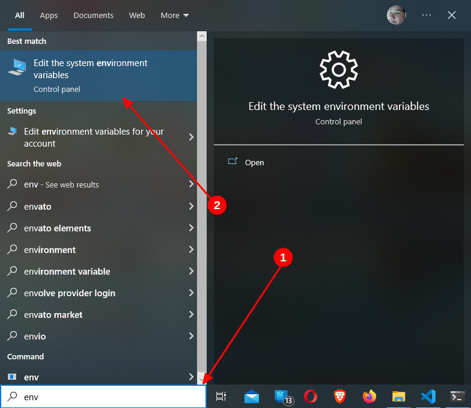

## Apa itu Hugo?
Hugo adalah salah satu SSG (_Static-site Generator_) atau Generator Web Statis yang dibuat menggunakan bahasa pemrograman Go, dikembangkan oleh Steve Francia, Bjørn Erik Pedersen, dan kontributor lainnya

Hugo juga merupakan FLOSS (_Free/Libre Open Source Software_) yang dirilis di bawah [Lisensi Apache 2.0](https://github.com/gohugoio/hugo/blob/master/LICENSE), kode sumbernya bisa Anda akses [di sini](https://github.com/gohugoio/hugo).

Hugo mendukung berbagai _Platform_ yang ada, termasuk Sistem Operasi Windows, macOS, berbasis Linux, dan BSD, baik untuk arsitektur x86, x64 (disebut sebagai x86-64, x86_64 atau AMD64), ARM dan ARM64.

SSG ini diklaim sebagai SSG tercepat oleh para pengembangnya, salah satunya adalah karena Hugo berjalan di lingkungan yang _Native_, tanpa ketergantungan (_dependencies_) apapun dan memiliki fitur yang dinamakan _Fast Render Mode_.

Selain itu, Hugo juga memiliki banyak fitur lainnya, seperti i18n untuk dukungan multibahasa, berkas data, berkas statis, pemrosesan gambar, pemrosesan berkas CSS, JS, dll yang dapat menunjang kebutuhan untuk Situs Web/Blog Anda.

## Varian Hugo
Hugo memiliki 2 varian, yakni Hugo (varian Standar/Biasa) dan Hugo Extended, bedanya adalah kalau Hugo Extended memiliki fitur tambahan, seperti pemrosesan berkas SCSS/SASS yang tidak dimiliki oleh Hugo Standar.

Namun, secara resmi Hugo Extended memiliki dukungan yang lebih sedikit dibandingkan dengan Hugo biasa dan hanya disediakan untuk _Platform_ berikut:
- Windows yang berarsitektur x64
- Sistem Operasi berbasiskan Linux yang berarsitektur x64 dan ARM64, serta perlu "GNU C Library" (glibc)
- macOS yang berarsitektur x64 dan ARM64 (itu pun dicampur jadi satu berkas biner)

Meskipun secara resmi Hugo Extended hanya disediakan untuk _Platform_ di atas saja, akan tetapi Anda juga bisa menginstalnya di _Platform_ lain, salah satunya adalah Void Linux dan Termux di Android, nanti akan saya bahas cara instalnya.

## Cara Install Hugo
Di bagian ini, saya akan membahas Cara Install-nya.

Caranya sendiri akan berbeda-beda untuk setiap Sistem Operasi ataupun _Platform_ yang ada, jadi pastikan Anda mengikutinya sesuai dengan Sistem Operasi atau _Platform_ yang digunakan.

Berikut adalah cara instalasinya:

### Windows
#### Pengelola Paket Scoop
Jika Anda menggunakan [Scoop](https://scoop.sh) sebagai Pengelola Paket di Windows, Anda bisa meng-install Hugo dengan perintah berikut:

```powershell
scoop install hugo
```

Atau, ganti `hugo` jadi `hugo-extended` jika Anda ingin meng-install Hugo Extended, seperti berikut:

```powershell
scoop install hugo-extended
```

Perintah di atas akan meng-install Hugo di dalam Direktori Pengguna (`%USERPROFILE%\scoop\apps`), jika Anda ingin Hugo-nya dapat berjalan di Semua Pengguna, maka perlu menambahkan argumen `-g`.

Perintahnya akan menjadi seperti berikut:

```powershell
scoop install hugo-extended -g
```

Namun, Anda perlu membuka Command Prompt, Windows Terminal, Windows PowerShell atau PowerShell Core-nya sebagai Administrator terlebih dahulu sebelum menjalankan perintah di atas.

Jika Anda sudah meng-install `sudo` melalui Scoop atau [`gsudo`](https://github.com/gerardog/gsudo) sebelumnya, maka cukup tambahkan saja `sudo` sebelum menjalankan perintah Scoop, tanpa harus menjalankan Terminal sebagai Administrator, menjadi seperti berikut:

```powershell
sudo scoop install hugo-extended -g
```

Dengan begini, Anda tidak perlu membuka Terminal-nya sebagai Administrator lagi.

Untuk memperbarui versinya, silakan ganti opsi `install` di atas menjadi `update`.

#### Pengelola Paket Chocolatey
Jika Anda menggunakan [Chocolatey](https://chocolatey.org/) sebagai Pengelola Paket di Windows, Anda bisa meng-install Hugo dengan perintah berikut:

```powershell
choco install hugo
```

Perintah di atas akan meng-install Hugo dalam varian Biasa/Standar, jika Anda ingin meng-install Hugo Extended, cukup ganti saja `hugo` menjadi `hugo-extended`, seperti berikut:

```powershell
choco install hugo-extended
```

Untuk memperbarui versinya, silakan ganti opsi `install` di atas menjadi `upgrade`.


Secara baku, Chocolatey akan meng-install paket-paketnya di dalam direktori `%ProgramData%\chocolatey`, sehingga paket yang terinstal dapat diakses oleh semua pengguna di dalam 1 sistem.

Namun, direktori tersebut memerlukan izin Administrator untuk mengisinya. Oleh karena itu, Anda perlu membuka Command Prompt, Windows Terminal, PowerShell, atau lainnya sebagai Administrator sebelum menginstal, menghapus, dan memperbarui paket melalui Chocolatey.

Atau, Anda juga bisa memakai [`gsudo`](https://github.com/gerardog/gsudo) agar dapat memakai perintah `sudo` di dalam Terminal tanpa harus membukanya sebagai Administrator.


#### Berkas Biner, tanpa Pengelola Paket (Manual)
Hugo telah menyediakan berkas Biner yang telah dikompilasi agar dapat digunakan secara langsung dan berkas tersebut diarsipkan dengan format/ekstensi `.zip` (untuk Windows), jadi Anda bisa langsung menggunakannya setelah berkas tersebut diunduh dan diekstrak.

Berkas Biner di sini adalah nama lain dari Berkas yang tujuannya untuk dieksekusi, kalau di Windows Anda akan mengenal dengan berkas yang berekstensi `.exe`.

Jika Anda tidak ingin menggunakan Pengelola Paket apapun untuk menginstalnya, maka berikut adalah langkah-langkahnya:

1. Unduh Berkas Arsip yang berisi berkas biner Hugo di [Halaman Perilisannya](https://github.com/gohugoio/hugo/releases).

    Di situ tersedia 4 berkas yang bisa Anda unduh salah satunya, semua itu diarsipkan dalam format Zip, sesuaikan dengan Arsitektur Sistem Operasi yang dipakai.

    Namun, jika Anda ingin meng-install Hugo Extended, unduh berkas yang namanya diawali dengan `hugo_extended`

2. Setelah diunduh, ekstrak berkas arsip tersebut ke dalam folder/direktori apa saja.

    Saya asumsikan bahwa Anda mengekstraknya ke dalam Folder `C:\Hugo\bin` dan akan saya gunakan direktori tersebut untuk seterusnya

3. Setelah diekstrak, Anda perlu menambahkan ke dalam variabel `PATH` agar Hugo bisa dieksekusikan di mana saja.

    Pertama-tama, klik "Start Menu", lalu manfaatkan fasilitas pencarian yang ada di sana atau Anda juga bisa langsung ke pencarian yang ada di _Taskbar_ jika Anda memasangkannya.

    Saat di pencarian, ketik `env` di situ, nanti akan muncul tulisan **Edit the system environment variables** dan klik tulisan tersebut, seperti cuplikan berikut:



4. Nanti akan muncul dialog **System Properties**, di dalam dialog tersebut, klik pada _Button_ **Environment Variables...**, seperti cuplikan berikut:


5. Setelah itu, Anda akan memasukki dialog yang berjudul **Environment Variables**, di situ nanti ada dua kolom, yakni **User variables** yang terletak di atas dan **System variables** yang terletak di bawah.

    Karena Variabel yang di ubah ini lingkupnya ke satu Sistem Operasi, yang artinya semua Akun Pengguna (_User Account_) kena, maka carilah variabel `PATH` di dalam kolom **System variables**.

    Setelah ketemu, pilih variabel tersebut dan klik pada _Button_ **Edit**, seperti cuplikan berikut:


6. Anda memasukki dialog yang berjudul **Edit environment variables**, di situ Anda akan merubah nilai dari variabel tersebut. Windows 10 dan Windows 7 mungkin memiliki penampilan yang berbeda, jadi cara mengubahnya akan berbeda-beda, berikut di bawah ini adalah caranya:

    - Di Windows 10: Nilai dari variabel `PATH` yang tampil di Windows 10 adalah dalam bentuk daftar. Untuk menambahkannya, cukup Anda klik pada _Button_ **New**, lalu isi nilainya dengan Lokasi berkas Biner Hugo itu berada.

        Jika Anda sebelumnya mengekstrak Hugo di `C:\Hugo\bin`, maka isi nilainya dengan `C:\Hugo\bin` juga. Setelah menambahkannya, klik pada _Button_ **OK**, seperti cuplikan berikut:

        

    - Di Windows 7: Nilai dari Variabel `PATH` yang tampil di Windows 7 adalah dalam bentuk deretan. Untuk menambahkannya, cukup Anda tambahkan `C:\Hugo\bin;` saja di bagian akhir deretan (**JANGAN DIGANTI SEMUA DERETANNYA!!**).

        `C:\Hugo\bin` menunjukkan tempat di mana Hugo diekstrak, jika Anda mengekstraknya di tempat lain, maka ganti `C:\Hugo\bin` menjadi lokasi di mana Berkas Biner Hugo itu berada.

        Setelah itu, klik pada _Button_ **OK**.

        **Catatan:** Mohon maaf, karena saya tidak lagi memakai Windows 7, jadi cuplikannya belum ada saat ini

7. Jika masih ada sesi Command Prompt, Windows Terminal, Windows PowerShell, PowerShell Core, dll, maka Anda perlu menutup semuanya terlebih dahulu/mengakhiri semua sesinya, lalu membukanya kembali.

    Biasanya, perubahan pada variabel `PATH` tidak akan berefek jika sesinya masih ada. Jika Anda tidak membuka Terminalnya, silakan Anda membukanya terlebih dahulu, entah itu Command Prompt, Windows Terminal, PowerShell, dll.

8. Setelah Anda membuka Terminalnya, silakan Anda eksekusikan perintah `hugo version` untuk menampilkan versi Hugo yang Anda gunakan. Jika berhasil, maka akan tampil keluaran seperti berikut:

```plain

```

9. Selamat! Anda telah berhasil meng-install Hugo. Jika Anda ingin memperbarui versi Hugo-nya, cukup unduh lagi berkas binernya, lalu tinggal timpakan berkas lamanya.

Nah, untuk Windows nya saya cukupkan di sini dulu, berikutnya saya bahas Cara Install Hugo untuk Sistem Operasi GNU/Linux.

WinGet? Sayang sekali, itu masih belum ada hingga saat ini, jadi Anda harus menggunakan metode lain selain WinGet tentunya.

### GNU/Linux {#gnu-linux}
#### Debian, Ubuntu dan Keluarganya
Jika Anda adalah pengguna Debian, Ubuntu atau Keluarganya, sebenarnya Anda dapat menginstalnya dengan perintah berikut:

```shell
sudo sh -c 'apt update; apt install -y hugo'
```

Atau:

```shell
apt update; apt install -y hugo
```

Namun cara di atas tidak saya rekomendasikan, karena versi yang Anda dapatkan nantinya merupakan versi yang lama (kecuali jika Anda menggunakan Distribusi dengan rilis bergulir).

Jika Anda ingin versi terbaru dari Hugo, silakan Anda unduh itu di halaman [perilisan resminya](https://github.com/gohugoio/hugo/releases), pastikan unduh `.deb` nya, setelah itu Anda instal secara manual.

Atau, jika Anda lebih suka lewat Terminal, maka pertama-tama Anda perlu mengubah hak akses Anda di Terminal menjadi `root` dengan perintah `sudo su`, `sudo -i` atau `sudo -s`.

Setelah itu, tentukan apakah Anda mau meng-install Hugo varian Biasa/Standar atau Extended, beserta Arsitektur Sistem Operasi yang Anda gunakan sekarang.

Jika sudah ditentukan, Anda bisa mengikuti caranya berikut:

Jika Anda ingin menggunakan Hugo dengan varian Standar, silakan Anda salinkan skrip berikut di bawah ini dan tempelkan itu ke dalam Terminal, lalu tekan "Enter": (Langsung copas aja)

```shell {linenos=true}
HUGO_VERSION="$(curl -s https://api.github.com/repos/gohugoio/hugo/releases/latest | grep tag_name | cut -d 'v' -f2 | cut -d'"' -f1)"
HUGO_ARCH="amd64"
HUGO_FILENAME="hugo_"$HUGO_VERSION"_linux-"$HUGO_ARCH".deb"
cd /tmp; wget -c "https://github.com/gohugoio/hugo/releases/download/v"$HUGO_VERSION"/"$HUGO_FILENAME""
```

Atau, gunakan skrip berikut jika Anda menggunakan `fish` sebagai _Shell_:

```fish {linenos=true}
set HUGO_VERSION (curl -s https://api.github.com/repos/gohugoio/hugo/releases/latest | grep tag_name | cut -d 'v' -f2 | cut -d'"' -f1)
set HUGO_ARCH "amd64"
set HUGO_FILENAME "hugo_"$HUGO_VERSION"_linux-"$HUGO_ARCH".deb"
cd /tmp; wget -c "https://github.com/gohugoio/hugo/releases/download/v"$HUGO_VERSION"/"$HUGO_FILENAME""
```

**Penjelasan:**
- Baris `HUGO_VERSION=` atau `set HUGO_VERSION`: Untuk mendapatkan versi terbaru Hugo, lalu memasukkannya ke dalam variabel `HUGO_VERSION`
- Baris `HUGO_ARCH=` atau `set HUGO_ARCH`: Untuk menentukan Arsitektur Sistem pada berkas Hugo yang ingin Anda unduh. Arsitektur yang tersedia adalah `amd64`, `arm` atau `arm64`
- Baris `HUGO_FILENAME` atau `set HUGO_FILENAME`: Untuk memasukkan Nama Berkas yang ingin diunduh ke dalam variabel `HUGO_FILENAME` dan Nilai tersebut diambil dari nama berkas Hugo Aslinya dan variabel `HUGO_VERSION` untuk versinya dan `HUGO_ARCH` untuk Arsitektur Sistemnya
- `cd /tmp; wget -c "https://github.com/gohugoio/hugo/releases/download/v"$HUGO_VERSION"/"$HUGO_FILENAME""`: Untuk menavigasikan Terminal ke `/tmp`, lalu mengunduh Hugo-nya di sana dengan bantuan GNU Wget

Kalau mau, silakan ganti nilai dari variabel `HUGO_ARCH` di atas dengan Arsitektur Sistem Operasi yang Anda gunakan, tetapi tersedia di Hugo.

Arsitektur yang tersedia adalah sebagai berikut:
- `amd64` (untuk x86_64, x64, atau AMD64)
- `arm` (untuk AArch32 atau Pengguna ARM dengan 32-bit)
- `arm64` (untuk Pengguna AArch64 atau ARM dengan 64-bit)

Jika Anda ingin mengunduh Hugo Extended, maka tinggal Anda copas saja skrip berikut ke dalam Terminal, lalu tekan "Enter":

```shell {linenos=true}
HUGO_VERSION="$(curl -s https://api.github.com/repos/gohugoio/hugo/releases/latest | grep tag_name | cut -d 'v' -f2 | cut -d'"' -f1)"
HUGO_FILENAME="hugo_extended_"$HUGO_VERSION"_Linux-64bit.deb"
cd /tmp; wget -c "https://github.com/gohugoio/hugo/releases/download/v"$HUGO_VERSION"/"$HUGO_FILENAME""
```

Atau, gunakan skrip berikut jika Anda menggunakan `fish` sebagai _Shell_:

```fish {linenos=true}
set HUGO_VERSION (curl -s https://api.github.com/repos/gohugoio/hugo/releases/latest | grep tag_name | cut -d 'v' -f2 | cut -d'"' -f1)
set HUGO_ARCH "amd64"
set HUGO_FILENAME "hugo_extended_"$HUGO_VERSION"_linux-"$HUGO_ARCH".deb"
cd /tmp; wget -c "https://github.com/gohugoio/hugo/releases/download/v"$HUGO_VERSION"/"$HUGO_FILENAME""
```

**Penjelasan:**
- Baris `HUGO_VERSION=` atau `set HUGO_VERSION`: Untuk mendapatkan versi terbaru Hugo, lalu memasukkannya ke dalam variabel `HUGO_VERSION`
- Baris `HUGO_ARCH=` atau `set HUGO_ARCH`: Untuk menentukan Arsitektur Sistem pada berkas Hugo yang ingin Anda unduh. Arsitektur yang tersedia adalah `amd64` atau `arm64`
- Baris `HUGO_FILENAME` atau `set HUGO_FILENAME`: Untuk memasukkan Nama Berkas yang ingin diunduh ke dalam variabel `HUGO_FILENAME` dan Nilai tersebut diambil dari nama berkas Hugo Aslinya dan variabel `HUGO_VERSION` untuk versinya dan `HUGO_ARCH` untuk Arsitektur Sistemnya
- `cd /tmp; wget -c "https://github.com/gohugoio/hugo/releases/download/v"$HUGO_VERSION"/"$HUGO_FILENAME""`: Untuk menavigasikan Terminal ke `/tmp`, lalu mengunduh Hugo-nya di sana dengan bantuan GNU Wget

Lalu, instal berkas yang telah Anda unduh dengan perintah berikut:

```shell {linenos=true}
dpkg -i "$HUGO_FILENAME"
rm "$HUGO_FILENAME"
```

**Penjelasan:**
- `dpkg -i "$HUGO_FILENAME"`: Untuk meng-install Hugo melalui `dpkg` dari berkas mentahannya yang berekstensi `deb` dan nama berkasnya diambil dari variabel `HUGO_FILENAME`.
- `rm "$HUGO_FILENAME"`: Untuk menghapus mentahan Hugo setelah menginstalnya

Jika merasa sudah selesai, silakan alihkan kembali hak akses di dalam Terminal Anda menjadi Pengguna Biasa dengan perintah `exit`.

Untuk memperbarui versi Hugo-nya, Anda perlu mengulangi semua langkah-langkah di atas.

#### SUSE Linux Enterprise (SLE), openSUSE Leap/Tumbleweed dan Keluarganya (Tidak Resmi)
Jika Anda adalah pengguna SUSE Linux Enterprise, openSUSE Leap/Tumbleweed atau Keluarganya, sebelum menginstalnya, tambahkan dulu repositori dari luar (dari [`home:darix:apps`](https://build.opensuse.org/project/show/home:darix:apps), jadi itu bukan resmi) yang bisa Anda percayakan dengan salah satu perintah berikut:

```shell {linenos=true}
### Untuk Pengguna SUSE Linux Enterprise (SLE) 15 SP3
sudo zypper ar -f https://download.opensuse.org/repositories/home:darix:apps/SLE_15_SP3/home:darix:apps.repo

### Untuk Pengguna openSUSE Leap 15.3
sudo zypper ar -f https://download.opensuse.org/repositories/home:darix:apps/openSUSE_Leap_15.3/home:darix:apps.repo

### Untuk Pengguna openSUSE Tumbleweed
sudo zypper ar -f https://download.opensuse.org/repositories/home:darix:apps/openSUSE_Tumbleweed/home:darix:apps.repo
```

Setelah itu segarkan repositorinya, lalu install Hugo-nya dengan perintah berikut:

```shell {linenos=true}
sudo zypper ref
sudo zypper in hugo
```

Untuk lebih lanjut. silakan kunjungi [Halaman Unduh Repositorinya](https://software.opensuse.org/download/package?package=hugo&project=home%3Adarix%3Aapps).

**Catatan:** Saya tidak memakai SUSE Linux Enterprise, openSUSE dan Keluarganya, tetapi berdasarkan [konfigurasinya](https://build.opensuse.org/package/view_file/home:darix:apps/hugo/hugo.spec?expand=1), kemungkinan varian Hugo yang digunakan adalah Hugo Extended.

#### Arch Linux, Manjaro dan Keluarganya
Jika Anda adalah pengguna Arch Linux, Manjaro atau Keluarganya, Anda dapat meng-install Hugo dengan perintah berikut:

```shell
sudo pacman -S hugo
```

~~Namun jika Anda lebih memilih lewat AUR (_Arch User Repository_), silakan gunakan paket [`hugo-bin`](https://aur.archlinux.org/packages/hugo-bin/) dari AUR.~~

~~Cara Instal paket dari AUR akan berbeda-beda, tergantung _AUR Helper_ yang Anda gunakan.~~

~~Namun jika Anda menggunakan Yay sebagai _AUR Helper_ nya, maka Anda dapat memakai perintah berikut:~~

```shell
yay -S hugo-bin
```

**PEMBARUAN Senin, 29 November 2021:** Paket `hugo-bin` yang ada di AUR mungkin sudah tidak ada, jadi untuk sekarang instal Hugo melalui paket resminya saja.

**Catatan:** Berdasarkan [Konfigurasinya](https://github.com/archlinux/svntogit-community/blob/packages/hugo/trunk/PKGBUILD), varian Hugo yang digunakan oleh Arch, Manjaro dan Keluarganya adalah Hugo Extended.

#### Solus dan Keluarganya
Jika Anda menggunakan Solus atau Keluarganya, maka Anda dapat menginstalnya dengan perintah berikut:

```shell
sudo eopkg install hugo
```

**Catatan:** Saya tidak memakai Solus dan Keluarganya, tetapi berdasarkan [konfigurasinya](https://dev.getsol.us/source/hugo/browse/master/package.yml), kemungkinan varian Hugo yang digunakan oleh Solus dan Keluarganya adalah Hugo Extended.

#### Void Linux dan Keluarganya
Jika Anda adalah pengguna Void Linux atau Keluarganya, Anda dapat meng-install Hugo dengan perintah berikut:

```shell
sudo xbps-install -S hugo
```

**Catatan:** Saya tidak memakai Void Linux dan Keluarganya, tetapi berdasarkan [templatnya](https://github.com/void-linux/void-packages/blob/master/srcpkgs/hugo/template), kemungkinan varian Hugo yang digunakan oleh Void Linux dan Keluarganya adalah Hugo Extended. Selain itu, Hugo Extended yang mereka gunakan didukung oleh semua arsitektur (baik itu x86, x64, ARM, ARM64, dan arsitektur lainnya) dan "C Library" (`glibc` dan `musl`) yang ada pada Void Linux.

#### Homebrew (Lebih Universal)
Jika Anda ingin menggunakan [Homebrew (brew)](https://brew.sh/) yang lebih Universal, maka Anda bisa menginstalnya dengan perintah berikut:

```shell
brew install hugo
```

**Catatan:** Saya tidak memakai Pengelola Paket Homebrew, tetapi berdasarkan [kode formulanya](https://github.com/Homebrew/homebrew-core/blob/HEAD/Formula/hugo.rb), kemungkinan varian Hugo yang digunakan oleh Pengelola Paket Homebrew adalah Hugo Extended.

#### Snap (Lebih Universal)
Jika Anda ingin menggunakan Snap yang lebih Universal, maka Anda bisa menginstalnya dengan perintah berikut:

```shell
snap install hugo
```

Perintah di atas akan meng-install Hugo dengan varian biasa, jika Anda ingin meng-install Hugo Extended, Anda hanya perlu tambahkan argumen `--channel=extended/stable` saja, menjadi seperti berikut:

```shell
snap install hugo --channel=extended/stable
```


Kalau dibilang 'Universal' mungkin tidak terlalu, semenjak Snap sendiri memasukkan Systemd sebagai ketergantungan, sehingga Distribusi yang Anda gunakan harus memakai Systemd sebagai Init agar Snap bisa digunakan. 

Jika Anda menggunakan Distribusi non-systemd seperti Void Linux, Devuan, MX Linux (lebih tepatnya ia tidak menggunakannya sebagai "Init baku"), Artix Linux, GUIX dan Keluarganya dan lainnya, maka kemungkinan besar Anda tidak dapat menggunakan Pengelola Paket Snap.

Makanya di awal saya bilang "lebih Universal", karena bisa untuk distribusi lainnya yang lebih luas ketimbang menggunakan Pengelola Paket bawaan.


#### Berkas Biner, tanpa Pengelola Paket (Lebih Universal, Manual)
Hugo telah menyediakan berkas Biner yang telah dikompilasi agar dapat digunakan secara langsung dan berkas tersebut diarsipkan dengan format/ekstensi `.tar.gz` (untuk GNU/Linux), jadi Anda bisa langsung menggunakannya setelah berkas tersebut diunduh dan diekstrak.

Berkas Biner adalah nama lain dari Berkas yang tujuannya untuk dieksekusi, kalau di Windows Anda akan mengenal dengan berkas yang berekstensi `.exe`.

Berkas tersebut biasanya akan kompatibel dengan hampir seluruh distribusi GNU/Linux, jadi jika distribusi yang Anda gunakan tidak saya bahas di sini dan tidak mau menggunakan Pengelola Paket 'Universal' atau bahkan sama sekali tidak mau menggunakan Pengelola Paket, maka Anda bisa gunakan berkas Binernya.

Cara sederhananya:
1. Unduh salah satu berkas Arsip yang berisikan berkas Biner Hugo dari [Halaman Perilisannya](https://github.com/gohugoio/hugo/releases) (yang berformat `.tar.gz`)
2. Ekstrak berkasnya
3. Izinkan agar berkas yang bernama `hugo` bisa dieksekusi (dengan mengeksekusi perintah `chmod +x hugo`)
4. Pindahkan berkas yang bernama `hugo` ke dalam direktori `/usr/local/bin` (dengan mengeksekusi perintah `sudo mv hugo /usr/local/bin/`)
5. Pastikan bahwa `/usr/local/bin/hugo` itu milik pengguna `root` (dengan mengeksekusi perintah `sudo chown root:root /usr/local/bin/hugo`)
6. Selesai!

**Catatan:** Bisa saja Anda memindahkan berkas tersebut ke dalam direktori lain yang termasuk dalam variabel `PATH`, seperti `/home/username/.local/bin` misalnya dan tidak perlu melakukan peralihan kepemilikan ke `root`, tetapi saya rekomendasikan agar diletakkan ke dalam direktori `/usr/local/bin` supaya Hugo bisa dieksekusi oleh seluruh pengguna di satu sistem.

Jika Anda lebih suka melakukannya secara langsung di Terminal (atau cara panjangnya) maka pertama-tama Anda perlu mengubah hak akses Anda di Terminal menjadi `root` dengan perintah `sudo su`, `sudo -i`, atau `sudo -s`.

Setelah itu, tentukan apakah Anda mau meng-install Hugo varian Biasa/Standar atau Extended, beserta Arsitektur Sistem Operasi yang Anda gunakan sekarang.

Jika sudah ditentukan, Anda bisa mengikuti caranya berikut:

Jika Anda ingin menggunakan Hugo dengan varian Standar, silakan Anda salinkan skrip berikut di bawah ini dan tempelkan itu ke dalam Terminal, lalu tekan "Enter": (Langsung copas aja)

```shell {linenos=true}
HUGO_VERSION="$(curl -s https://api.github.com/repos/gohugoio/hugo/releases/latest | grep tag_name | cut -d 'v' -f2 | cut -d'"' -f1)"
HUGO_ARCH="amd64"
HUGO_FILENAME="hugo_"$HUGO_VERSION"_linux-"$HUGO_ARCH".tar.gz"
cd /tmp; wget -c "https://github.com/gohugoio/hugo/releases/download/v"$HUGO_VERSION"/"$HUGO_FILENAME""
```

Atau, gunakan skrip berikut jika Anda menggunakan `fish` sebagai _Shell_:

```fish {linenos=true}
set HUGO_VERSION (curl -s https://api.github.com/repos/gohugoio/hugo/releases/latest | grep tag_name | cut -d 'v' -f2 | cut -d'"' -f1)
set HUGO_ARCH "amd64"
set HUGO_FILENAME "hugo_"$HUGO_VERSION"_linux-"$HUGO_ARCH".tar.gz"
cd /tmp; wget -c "https://github.com/gohugoio/hugo/releases/download/v"$HUGO_VERSION"/"$HUGO_FILENAME""
```

**Penjelasan:**
- Baris `HUGO_VERSION=` atau `set HUGO_VERSION`: Untuk mendapatkan versi terbaru Hugo, lalu memasukkannya ke dalam variabel `HUGO_VERSION`
- Baris `HUGO_ARCH=` atau `set HUGO_ARCH`: Untuk menentukan Arsitektur Sistem pada berkas Hugo yang ingin Anda unduh. Arsitektur yang tersedia adalah `amd64`, `arm` atau `arm64`
- Baris `HUGO_FILENAME` atau `set HUGO_FILENAME`: Untuk memasukkan Nama Berkas yang ingin diunduh ke dalam variabel `HUGO_FILENAME` dan Nilai tersebut diambil dari nama berkas Hugo Aslinya dan variabel `HUGO_VERSION` untuk versinya dan `HUGO_ARCH` untuk Arsitektur Sistemnya
- `cd /tmp; wget -c`: Untuk menavigasikan Terminal ke `/tmp`, lalu mengunduh Hugo-nya di sana dengan bantuan GNU Wget

Kalau mau, silakan ganti nilai dari variabel `HUGO_ARCH` di atas dengan Arsitektur Sistem Operasi yang Anda gunakan, tetapi tersedia di Hugo. 

Arsitektur yang tersedia adalah sebagai berikut:
- `amd64` (untuk x86_64, x64, atau AMD64)
- `arm` (untuk AArch32 atau Pengguna ARM dengan 32-bit)
- `arm64` (untuk Pengguna AArch64 atau ARM dengan 64-bit)

Jika Anda ingin mengunduh Hugo Extended, maka tinggal Anda copas saja skrip berikut ke dalam Terminal, lalu tekan "Enter":

```shell {linenos=true}
HUGO_VERSION="$(curl -s https://api.github.com/repos/gohugoio/hugo/releases/latest | grep tag_name | cut -d 'v' -f2 | cut -d'"' -f1)"
HUGO_ARCH="amd64"
HUGO_FILENAME="hugo_extended_"$HUGO_VERSION"_linux-"$HUGO_ARCH".tar.gz"
cd /tmp; wget -c "https://github.com/gohugoio/hugo/releases/download/v"$HUGO_VERSION"/"$HUGO_FILENAME""
```

Atau, gunakan skrip berikut jika Anda menggunakan `fish` sebagai _Shell_:

```fish {linenos=true}
set HUGO_VERSION (curl -s https://api.github.com/repos/gohugoio/hugo/releases/latest | grep tag_name | cut -d 'v' -f2 | cut -d'"' -f1)
set HUGO_ARCH "amd64"
set HUGO_FILENAME "hugo_extended_"$HUGO_VERSION"_linux-"$HUGO_ARCH".tar.gz"
cd /tmp; wget -c "https://github.com/gohugoio/hugo/releases/download/v"$HUGO_VERSION"/"$HUGO_FILENAME""
```

**Penjelasan:**
- Baris `HUGO_VERSION=` atau `set HUGO_VERSION`: Untuk mendapatkan versi terbaru Hugo, lalu memasukkannya ke dalam variabel `HUGO_VERSION`
- Baris `HUGO_ARCH=` atau `set HUGO_ARCH`: Untuk menentukan Arsitektur Sistem pada berkas Hugo yang ingin Anda unduh. Arsitektur yang tersedia adalah `amd64` atau `arm64`
- Baris `HUGO_FILENAME` atau `set HUGO_FILENAME`: Untuk memasukkan Nama Berkas yang ingin diunduh ke dalam variabel `HUGO_FILENAME` dan Nilai tersebut diambil dari nama berkas Hugo Aslinya dan variabel `HUGO_VERSION` untuk versinya dan `HUGO_ARCH` untuk Arsitektur Sistemnya
- `cd /tmp; wget -c "https://github.com/gohugoio/hugo/releases/download/v"$HUGO_VERSION"/"$HUGO_FILENAME""`: Untuk menavigasikan Terminal ke `/tmp`, lalu mengunduh Hugo-nya di sana dengan bantuan GNU Wget


Setelah mengunduhnya, tentukan terlebih dahulu di mana Anda meng-install Hugo-nya, apakah di dalam direktori pengguna yang hanya dapat dijalankan oleh Anda sendiri atau di dalam direktori sistem agar dapat dijalankan oleh semua pengguna.

Jika Anda ingin Hugo-nya dapat dijalankan oleh semua pengguna, silakan ikuti caranya di bawah ini. Namun, jika Anda ingin Hugo-nya diinstal di dalam direktori pengguna dan tanpa perlu perintah `sudo` ataupun hak akses `root`, silakan [klik di sini](#pertanyaan-ke4).


Setelah mengunduhnya, Anda perlu mengeksekusi skrip berikut untuk menginstalnya:

```shell {linenos=true}
tar -xvzf "$HUGO_FILENAME"; install -Dm755 hugo /usr/local/bin/
install -Dm644 LICENSE /usr/share/licenses/hugo/LICENSE
rm "$HUGO_FILENAME" hugo LICENSE README.md
cd -
```

**Penjelasan:**
- `tar -xvzf "$HUGO_FILENAME"; install -Dm755 hugo /usr/local/bin/`: Untuk mengekstrak Berkas Arsip, lalu menginstal Hugo di direktori `/usr/local/bin` dan Chmod dari berkas tersebut disetel dengan nilai 755
- `install -Dm644 LICENSE /usr/share/licenses/hugo/LICENSE`: Untuk menyalinkan berkas `LICENSE` milik Hugo kedalam direktori `/usr/share/licenses/hugo` dan Chmod dari berkas tersebut disetel dengan nilai 644
- `rm "$HUGO_FILENAME" LICENSE README.md`: Menghapus berkas yang sudah tak terpakai lagi
- `cd -`: Kembali ke direktori sebelumnya

Setelah itu, pastikan kalau Hugo dapat berjalan dengan mengeksekusi perintah berikut untuk melihat versi Hugo yang Anda gunakan sekarang:

```shell
hugo version
```

Jika berhasil, maka keluarannya akan seperti di bawah ini:

```plain

```

Keluaran di atas itu terjadi karena saya menggunakan Hugo Extended, jika Anda menggunakan varian biasa, harusnya sih sama aja, bedanya cuma gak ada tulisan `extended` nya aja.

Masih dalam hak akses `root`, kalau mau, Anda juga dapat membuat Halaman Panduan (manpages) untuk Hugo dengan skrip berikut:

```shell {linenos=true}
hugo gen man --dir '/tmp/hugo_manpages'
cd /tmp/hugo_manpages; gzip -9 *
install -Dm644 * -t /usr/local/man/man1
cd -; rm -rf /tmp/hugo_manpages
```

**Penjelasan:**
- `hugo gen man --dir '/tmp/hugo_manpages'`: Untuk membuat Halaman Panduan Hugo dan berkas-berkasnya akan diletakkan di dalam direktori `/tmp/hugo_manpages` (Direktori tersebut akan dibuatkan secara otomatis jika tidak ada, jadi Anda tidak perlu membuatnya terlebih dahulu)
- `cd /tmp/hugo_manpages; gzip -9 *`: Untuk menavigasikan _Shell_ ke dalam direktori `/tmp/hugo_manpages`, lalu mengkompresi semua berkas di dalamnya dengan Gzip dan menghapus semua berkas aslinya
- `install -Dm644 * -t /usr/local/man/man1`: Untuk menyalinkan semua berkas di dalamnya ke `/usr/local/man/man1` dan menyetel nilai Chmod-nya ke 644
- `cd -; rm -rf /tmp/hugo_manpages`: Untuk kembali ke direktori sebelumnya, lalu menghapus direktori `/tmp/hugo_manpages` dan seluruh berkas di dalamnya (atau secara rekursif)

Kalau sudah, Anda bisa tes Halaman Panduannya dengan mengeksekusi perintah `man hugo` di dalam Terminal Anda.

Jika Anda ingin memasang fitur _Completion_ untuk _Shell_ yang Anda gunakan di Terminal, maka Anda dapat memasangkannya dengan perintah berikut: (Sesuaikan dengan _Shell_ yang ter-install di Sistem Anda)

```shell {linenos=true}
hugo completion bash | install -Dm644 /dev/stdin "/usr/share/bash-completion/completions/hugo"
hugo completion zsh | install -Dm644 /dev/stdin "/usr/share/zsh/site-functions/_hugo"
hugo completion fish | install -Dm644 /dev/stdin "/usr/share/fish/vendor_completions.d/hugo.fish"
```

**Penjelasan:**
- Baris `hugo completion bash`: Untuk membuat _Autocomplete_ untuk GNU Bash dan meletakkannya ke dalam direktori `/usr/share/bash-completion/completions` sebagai berkas yang bernama `hugo` (Untuk pengguna GNU Bash/`bash`)
- Baris `hugo completion zsh`: Untuk membuat _Autocomplete_ untuk Z Shell dan meletakkannya ke dalam direktori `/usr/share/zsh/site-functions/completions` sebagai berkas yang bernama `_hugo` (Untuk pengguna Z Shell/`zsh`)
- Baris `hugo completion fish`: Untuk membuat _Autocomplete_ untuk `fish` dan meletakkannya ke dalam direktori `/usr/share/fish/vendor_completions.d` sebagai berkas yang bernama `hugo.fish` (Untuk pengguna `fish`)

Silakan Anda coba fitur _Completion_ di dalam Terminal Anda setelah itu.

Jika merasa sudah selesai, silakan alihkan kembali hak akses di dalam Terminal Anda menjadi Pengguna Biasa dengan perintah `exit`.

Untuk memperbarui versi Hugo-nya, Anda perlu mengulangi semua langkah-langkah di atas.

### macOS
#### MacPorts
**Catatan:** Saya tidak memakai Sistem Operasi macOS dan MacPorts sebagai Pengelola Paket, mungkin cara instalasi yang saya lontarkan di sini kurang begitu akurat sehingga bisa saja salah. Jika terjadi kesalahan dan Anda adalah pengguna MacPorts, mohon berikan masukkan/koreksi dari Anda melalui Kolom Komentar.

Jika Anda menggunakan [MacPorts](https://www.macports.org/) sebagai Pengelola Paket di dalam macOS Anda, maka Anda dapat meng-install Hugo dengan perintah berikut:

```shell
sudo port install hugo
```

Perintah di atas akan meng-install Hugo dengan varian biasa, jika Anda ingin meng-install Hugo Extended, Anda hanya perlu tambahkan argumen `+extended` saja, menjadi seperti berikut:

```shell
sudo port install hugo +extended
```

**Catatan:** Meng-installnya melalui MacPorts mungkin akan menghimpun (_compile_) kode sumber Hugo di dalam perangkat Anda.

Anda juga dapat menambahkan fitur _Completion_ untuk Bash kalau mau dengan menambahkan argumen `+bash_completion` di dalam baris perintahnya saja.

Jika Anda tidak ingin menggunakan `sudo`, maka hapus saja `sudo` nya.

#### Homebrew
Jika Anda menggunakan [Homebrew (brew)](https://brew.sh/) sebagai Pengelola Paket di dalam macOS Anda, maka Anda dapat meng-install Hugo dengan perintah berikut:

```shell
brew install hugo
```

**Catatan:** Saya tidak memakai Pengelola Paket Homebrew, tetapi berdasarkan [kode formulanya](https://github.com/Homebrew/homebrew-core/blob/HEAD/Formula/hugo.rb), kemungkinan varian Hugo yang digunakan oleh Pengelola Paket Homebrew adalah Hugo Extended.

### Android
#### Termux
Jika Anda menggunakan [Termux](https://termux.com/) di dalam Android, maka Anda dapat meng-install Hugo dengan perintah berikut:

```shell
pkg i hugo
```

Perintah di atas akan meng-install Hugo Extended, bukan Hugo varian Biasa/Standar, berdasarkan [konfigurasinya](https://github.com/termux/termux-packages/blob/master/packages/hugo/build.sh) meskipun Anda menggunakan Arsitektur dari ARM.

Jadi, Anda tidak perlu lagi khawatir mengenai masalah varian Hugo di Android Anda, tetapi saya sarankan agar Anda menggunakan [Termux versi terbarunya](https://f-droid.org/en/packages/com.termux/) (tidak diunduh dari Google Play Store) untuk pengalaman yang lebih nyaman dan versi Android-nya minimal 7.0 agar Termux versi terbaru bisa digunakan.

### BSD
#### OpenBSD dan Keluarganya
**Catatan:** Saya tidak memakai Sistem Operasi berbasis BSD, seperti OpenBSD, mungkin cara instalasi yang saya lontarkan di sini kurang begitu akurat sehingga bisa saja salah. Jika terjadi kesalahan dan Anda adalah pengguna OpenBSD, mohon berikan masukkan/koreksi dari Anda melalui Kolom Komentar.

Jika Anda adalah pengguna OpenBSD dan Keluarganya, maka Anda dapat meng-install Hugo dengan perintah berikut:

```shell
doas pkg_add hugo
```

Karena saya tidak pakai, jadi saya tidak tahu apa varian Hugo yang terinstal nantinya dan dapat versi berapa.

Jika versi yang didapat adalah versi lama dan Anda sangat ingin mendapatkan versi terbarunya, maka Anda bisa mempertimbangkan opsi instalasi melalui [OpenBSD Ports](https://openports.se/www/hugo), mungkin ini akan menghimpun (_compile_) kode sumber Hugo.

### Docker
Jika Anda menggunakan Docker, mungkin Anda bisa gunakan _Docker Image_ [`klakegg/hugo`](https://hub.docker.com/r/klakegg/hugo/) untuk itu. Ini memang bukan resmi dari pengembang, tetapi mereka sendiri merekomendasikannya.

## Pertanyaan dan Jawaban
### Pertanyaan ke-1: Varian Hugo mana yang harus dipakai? {#pertanyaan-ke1}
**Jawab:** Usahakan untuk selalu gunakan Hugo Extended ketimbang Hugo dengan varian Biasa/Standar.

Dukungan tema akan lebih beragam jika Anda menggunakan Hugo Extended, karena ada beberapa tema yang menggunakan SCSS ketimbang CSS untuk mengatur penampilannya.

Lagipula, sudah banyak _Platform_ yang mendukung Hugo Extended ini, walaupun secara resmi hanya disediakan untuk _Platform_ tertentu saja.

### Pertanyaan ke-2: Kenapa Cara Install Hugo di Fedora, Red Hat dan Keluarganya malah gak dibahas? {#pertanyaan-ke2}
**Jawab:** Karena versi Hugo yang digunakan oleh Fedora, Red Hat, dan Keluarganya adalah versi lama.

Hingga saat ini, saya belum menemukan _Repository_ luar yang cocok untuk Fedora, Red Hat, dan Keluarganya.

Jika Anda sangat ingin meng-install Hugo di dalam Distribusi yang tidak saya bahas, maka saya sarankan agar Anda menginstalnya melalui cara yang lebih "Universal" seperti menggunakan Snap, Homebrew atau melalui cara manual (mengunduh berkas biner, tanpa pengelola paket).

### Pertanyaan ke-3: Apakah Cara Install untuk openSUSE Leap/Tumbleweed atau SLE bisa diaplikasikan di Fedora, Red Hat, dan Keluarganya? {#pertanyaan-ke3}
**Jawab:** Tidak bisa, kalaupun bisa maka sebaiknya jangan, karena pada dasarnya Distribusi Keluarga SUSE dan Fedora/Red Hat memang berbeda meskipun sama-sama menggunakan RPM sebagai salah satu Sistem Pengelolaan Paketnya dan sama-sama merupakan GNU/Linux.

Letak perbedaannya nanti di paket ketergantungannya, mulai dari nama paketnya sampai versi dari paket-paket tersebut yang didapat akan berbeda satu sama lain.

Jika Anda ingin mencobanya ya silakan saja, tetapi segala resiko yang ada atau yang telah terjadi, silakan Anda tanggung sendiri.

### Pertanyaan ke-4: Saya ingin menginstal Hugo dengan mengunduh Berkas Biner di GNU/Linux, tetapi apakah ada cara agar saya dapat menginstalnya di direktori pengguna tanpa perlu hak akses `root` ataupun menggunakan `sudo` lagi? {#pertanyaan-ke4}
**Jawab**: Ada, pada dasarnya Anda dapat mengikuti cara di atas, tetapi Anda perlu mengubah beberapa direktori tujuan pada skrip di atas, seperti `/usr/local/bin` menjadi `$HOME/.local/bin`, `/usr/local/man/man1` menjadi `$HOME/.local/share/man/man1` untuk Halaman Manual, dll.

**Catatan**: Saya belum pernah coba instal Hugo di dalam direktori pengguna, sehingga akan terjadi ketidakakuratan dalam pembahasan, namun saya berani jamin bahwa perintah-perintah di bawah ini tidak akan membahayakan sedikitpun baik untuk Sistem Operasi dan data-data pribadi Anda.

#### Install Hugo
Kalau Anda gak mau ribet, setelah Anda mengunduh Hugo-nya, Anda bisa gunakan skrip berikut untuk menginstal Hugo-nya di dalam direktori pengguna:

```shell {linenos=true}
tar -xvzf "$HUGO_FILENAME"; install -Dm755 hugo "$HOME"/.local/bin/
install -Dm644 LICENSE "$HOME"/.local/share/licenses/hugo/LICENSE
rm "$HUGO_FILENAME" hugo LICENSE README.md
cd -
```

Setelah menginstalnya, silakan Anda pastikan agar Hugo dapat dieksekusi setelah diinstal dengan perintah berikut untuk menampilan versinya:

```shell
hugo version
```

Jika berhasil, maka harusnya akan muncul keluaran seperti di bawah ini:

```plain

```

Kalau muncul keluaran seperti di atas, maka tandanya Hugo berhasil diinstal. Tulisan `+extended` di atas terjadi ketika Anda menggunakan Hugo Extended, kalau tidak, maka tulisan tersebut memang tidak ada.

Kalau tidak muncul sama sekali atau bahkan mengalami pesan galat, maka artinya instalasi belum berhasil.

#### Membuat Halaman Panduan Hugo
Kalau mau, Anda juga dapat membuat halaman panduannya yang akan disimpan di dalam direktori pengguna dengan skrip berikut:

```shell {linenos=true}
hugo gen man --dir '/tmp/hugo_manpages'
cd /tmp/hugo_manpages; gzip -9 *
install -Dm644 * -t "$HOME"/.local/share/man/man1
cd -; rm -rf /tmp/hugo_manpages
```

Secara baku, direktori `"$HOME"/.local/share/man/man1` tidak dianggap sebagai tempat untuk menyimpan halaman panduan, sehingga tidak terbaca oleh Aplikasi pembaca Halaman Panduan seperti `man`.

Jadi, Anda harus memasukkan direktori tersebut ke dalam variabel `MANPATH` bersamaan dengan direktori lainnya yang ada di dalam perintah `manpath -g`.

Anda bisa gunakan perintah di bawah ini untuk menambahkannya:

```shell
MANPATH="$(manpath -g):$HOME/.local/share/man" && export MANPATH
```

Atau, jika Anda menggunakan `fish` sebagai _Shell_, silakan gunakan perintah berikut:

```fish
set -gx MANPATH (manpath -g) "$HOME"/.local/share/man
```

Anda bisa menyimpan salah satu dari perintah di atas ke dalam berkas konfigurasi untuk _Shell_ yang Anda gunakan agar perintah tersebut bisa dieksekusi ketika _Shell_ dijalankan secara interaktif.

#### Membuat fitur _Shell Completion_ untuk Hugo
Jika Anda adalah pengguna `fish` sebagai _Shell_, maka Anda dapat memasang fitur _Shell Completion-nya_ dengan perintah berikut:

```fish
hugo completion fish | install -Dm644 /dev/stdin "$HOME/.config/fish/completions/hugo.fish"
```

Atau, jika Anda adalah pengguna GNU Bash, maka Anda dapat memasang fitur _Shell Completion-nya_ dengan perintah berikut:

```shell
hugo completion bash | install -Dm 644 /dev/stdin "$HOME/.local/share/bash-completion/completions/hugo"
```

Fitur seperti ini akan memerlukan paket/perkakas yang bernama [`bash-completion`](https://github.com/scop/bash-completion/) dan itu bisa Anda instal di dalam distribusi yang Anda gunakan. 

Biasanya, perkakas tersebut sudah terinstal secara baku di beberapa distribusi GNU/Linux, seperti: Ubuntu, openSUSE, Fedora, Manjaro, dll. Namun jika Anda merasa tidak demikian, maka Anda bisa menginstalnya sendiri dengan mengikuti petunjuk dari distribusi Anda.

Jika Anda menggunakan perkakas `bash-completion` versi 2.8 atau di atasnya (seperti yang ada pada mayoritas Distribusi GNU/Linux), maka seharusnya itu langsung bekerja.

Namun jika Anda merasa masih menggunakan versi di bawahnya atau merasa kurang yakin, maka Anda dapat menambahkan baris skrip berikut ke dalam berkas `~/.bash_completion` ataupun di dalam berkas `~/.bashrc`:

```shell
for bcfile in "$HOME"/.local/share/bash-completion/completions/* ; do
  [ -f "$bcfile" ] && . $bcfile
done
```

**Catatan**: Skrip di atas saya dapatkan dari [Jawaban Russell E Glaue](https://serverfault.com/a/831184) untuk pertanyaan **"Standard place for user defined bash_completion.d scripts?"** di Server Fault, dilisensikan di bawah CC BY-SA 4.0 oleh penjawab.

Dengan begitu, Anda bisa menggunakan fitur _Shell Completion-nya_ di dalam Bash.

Namun jika Anda menggunakan Z Shell (disingkat menjadi `zsh`), maka pertama-tama Anda perlu ketahui terlebih dahulu isi dari variabel `FPATH` dengan perintah berikut beserta keluarannya:

```shell {linenos=true}
$ echo $FPATH
/home/user/.oh-my-zsh/plugins/colored-man-pages:/home/user/.oh-my-zsh/plugins/sudo:/home/user/.oh-my-zsh/plugins/debian:/home/user/.oh-my-zsh/plugins/git:/home/user/.oh-my-zsh/functions:/home/user/.oh-my-zsh/completions:/home/user/.oh-my-zsh/cache/completions:/usr/local/share/zsh/site-functions:/usr/share/zsh/site-functions:/usr/share/zsh/functions/Calendar:/usr/share/zsh/functions/Chpwd:/usr/share/zsh/functions/Completion:/usr/share/zsh/functions/Completion/Base:/usr/share/zsh/functions/Completion/Linux:/usr/share/zsh/functions/Completion/Unix:/usr/share/zsh/functions/Completion/X:/usr/share/zsh/functions/Completion/Zsh:/usr/share/zsh/functions/Exceptions:/usr/share/zsh/functions/Math:/usr/share/zsh/functions/MIME:/usr/share/zsh/functions/Misc:/usr/share/zsh/functions/Newuser:/usr/share/zsh/functions/Prompts:/usr/share/zsh/functions/TCP:/usr/share/zsh/functions/VCS_Info:/usr/share/zsh/functions/VCS_Info/Backends:/usr/share/zsh/functions/Zftp:/usr/share/zsh/functions/Zle
```

Hasil keluaran di atas mungkin akan berbeda-beda pada setiap perangkat, adapun tulisan `/home/user/.oh-my-zsh` pada keluaran di atas itu akan terjadi jika Anda menggunakan [`oh-my-zsh`](https://ohmyz.sh/) sebagai kerangka kerja untuk mengelola konfigurasi Z Shell Anda.

Variabel tersebut mendefinisikan satu set direktori, yang berisi berkas yang dapat ditandai untuk dimuat secara otomatis oleh Z Shell saat dijalankan, termasuk _Completion-nya_. Jadi, ketika Anda membuat sebuah skrip _Completion_, maka Anda perlu meletakkannya di dalam salah satu direktori yang ada di dalam variabel `FPATH` itu tadi.

Contohnya jika Anda menggunakan `oh-my-zsh`, maka Anda perlu meletakkannya di dalam folder `~/.oh-my-zsh/completions` dan kabar baiknya direktori tersebut ada di dalam variabel `FPATH`. Berikut adalah perintah untuk membuat _Completion-nya_:

```shell
hugo completion zsh | install -Dm 644 /dev/stdin "$HOME/.oh-my-zsh/completions/_hugo"
```

Namun jika Anda tidak menggunakan `oh-my-zsh`, Anda bisa mengganti `$HOME/.oh-my-zsh/completions/_hugo` di atas menjadi direktori lain, tetapi termasuk dalam variabel `FPATH`.

Jika Anda ingin meletakkannya di dalam direktori kustom yang mana itu tidak termasuk dalam variabel `FPATH`, maka Anda perlu memasukkan direktori tersebut ke dalam variabelnya secara manual dengan perintah/skrip berikut:

```shell
FPATH="/direktori/kustom/kamu:$FPATH" && export FPATH
```

Atau, perintah berikut:

```shell
fpath=( /direktori/kustom/kamu "${fpath[@]}" )
```

Atau, berikut di bawah ini jika Anda ingin multi-baris:

```shell
fpath=(
    /direktori/kustom/kamu
    /direktori/kustom/kamu2
    "${fpath[@]}"
)
```

Anda bisa simpan perintah/skrip di atas di dalam berkas `~/.zshrc` agar perintah tersebut dapat dieksekusi oleh Z Shell ketika dijalankan secara interaktif.

## Penutup
Sudah? Iya, sudah, cuma itu saja yang perlu Anda lakukan. Ini merupakan Artikel yang membahas tentang 'Cara Install Hugo', bukan 'Cara Install Hugo beserta konfigurasinya', walaupun saya sedikit berbasa-basi tentang apa itu Hugo dan apa saja variannya.

Demi kesederhanaan Artikel ini, maka topik tentang membuat Blog di Hugo beserta konfigurasinya akan saya bahas secara terpisah.

Jika kamu mempunyai pertanyaan, kritik dan saran, komentar atau masukkan lainnya, silakan kamu berkomentar melalui kolom komentar yang tersedia atau bisa kamu [Hubungi Saya](/tentang).

Terima kasih atas perhatiannya 😊
