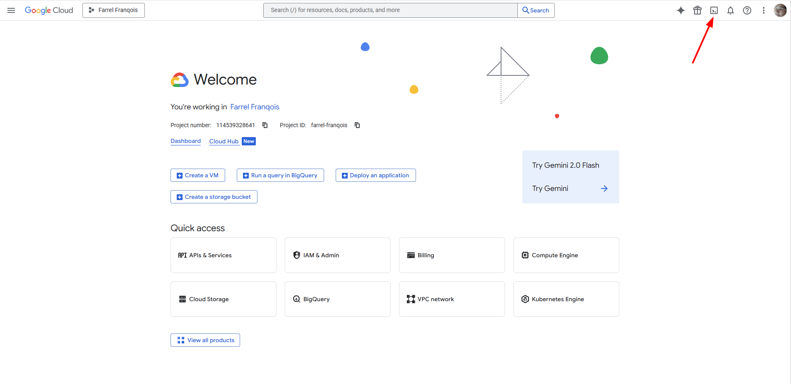
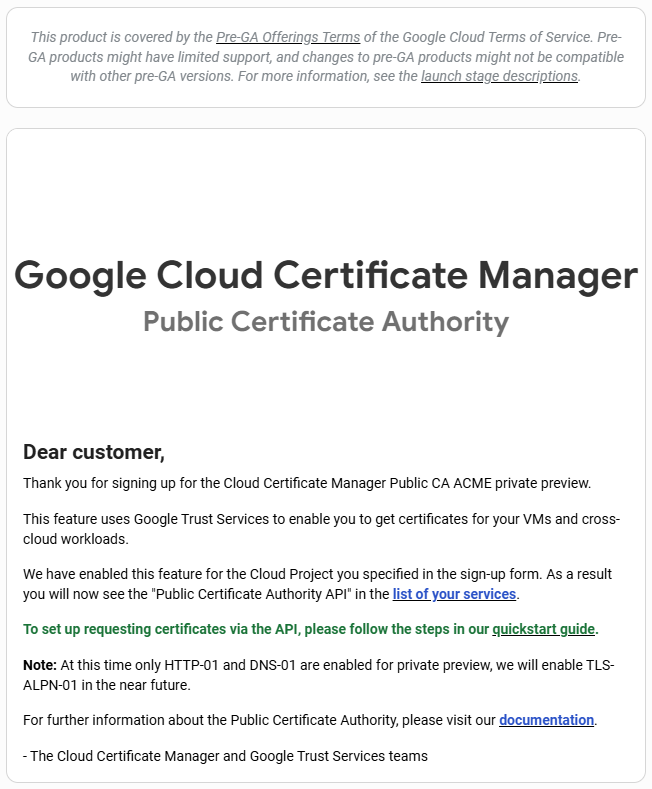

## Pembuka
Pada tanggal 29 Maret 2022 kemarin, pihaknya baru saja mengumumkan bahwa mereka sudah meluncurkan layanan CA mereka dan server ACME-nya secara publik, yakni **"Google Public CA"**, yang mana bisa digunakan oleh siapa saja, termasuk orang yang tidak menggunakan layanan dari Google sekalipun untuk Aplikasinya.

Pengumumannya bisa Anda baca [di sini](https://cloud.google.com/blog/products/identity-security/automate-public-certificate-lifecycle-management-via--acme-client-api).

Artinya apa? Ini artinya bahwa Anda bisa mendapatkan/menggunakan sertifikat SSL/TLS dari Google tanpa harus menggunakan layanan/hosting dari Google terlebih dahulu untuk Web, Blog atau Aplikasinya.

Untuk saat ini, Anda bisa mendapatkan sertifikat SSL/TLS tersebut secara gratis, mendukung RSA/ECC sebagai algoritma kunci publik dan mendukung penerbitan dalam bentuk _Wildcard_ juga, ~~meski sekarang masih dalam tahap Uji Coba/Pratinjau Beta (_Beta preview_)~~.

**PEMBARUAN Sabtu, 10 September 2022:** Sekarang Google Public CA bukan lagi dalam tahap _Beta Preview_ atau Pratinjau Beta, melainkan sedang dalam tahap _Public Preview_.

_Semoga seterusnya bisa gratis, Amiin_.

Selain itu, sertifikat yang diterbitkan merupakan sertifikat langsung dari [**"Google Trust Services (GTS)"**](https://pki.goog), yang kompatibilitas perangkatnya tidak perlu diragukan lagi dan menggunakan infrastruktur dari Google untuk menerbitkannya.

## Persiapan
Karena ini sepenuhnya menggunakan protokol ACME dan ini bersifat _Self-managed_, maka tentu saja tidak ada antarmuka pengguna dari Google secara langsung untuk mengelolanya.

Jadi, persiapan yang perlu Anda lakukan adalah sebagai berikut:
1. Punya Akun Google (Kalau kamu pengguna Android, ya gak usah ditanya lah yaa)
2. Punya Koneksi Internet (Kalau Internet aja gak punya, gimana kamu bisa baca artikel ini?)
3. Terinstalnya perkakas klien ACME di dalam perangkat kamu, entah itu di dalam Komputer PC, Laptop, Server/VPS, Ponsel Pintar, atau lainnya.

Di instruksi kali ini, saya akan memakai [acme.sh](https://acme.sh) sebagai perkakas klien ACME yang merupakan perkakas favorit saya. Jadi, maaf yah buat pengguna Certbot, Lego, atau lainnya, saya belum bisa menjelaskannya, karena belum saya pakai.

Namun, kalau kamu sebelumnya pernah memasang Sertifikat SSL/TLS dari ZeroSSL dengan membaca artikel saya sebelumnya yang panjang kali lebar itu, pasti perkakas tersebut sangatlah familiar bagi Anda.

Jika Anda menggunakan acme.sh sebagai perkakasnya, silakan perbarui terlebih dahulu versinya dengan perintah berikut:

```shell
acme.sh --upgrade --auto-upgrade
```

Kalau mau, Anda juga dapat membaca [artikel saya sebelumnya](/cara-memasang-zerossl-di-netlify-bunnycdn/), siapa tahu mau nambah ilmu (terutama tentang pemasangan sertifikat SSL/TLS ke Netlify dan Bunny CDN, serta _Renew_ secara otomatis), tetapi kalau gak dibaca juga gak apa-apa.

Setelah semuanya sudah siap, gak usah banyak _cing-cong_, mari kita langsung eksekusi!

## Membuat Proyek di Google Cloud Console
Pertama-tama, Anda perlu membuat sebuah Proyek (bahasa Inggrisnya: **Project**) di [**"Google Cloud Console"**](https://console.cloud.google.com/) (Sebelumnya bernama **"Google Developer Console"**). Ini nantinya diperlukan karena kita akan mengakses API-nya.

Sebagai catatan, Anda tidak perlu memasukkan kartu kredit/debit hanya untuk menambahkan proyek di sana, jadi Anda bisa melakukan semuanya secara gratis. Namun, kuotanya terbatas untuk 10 proyek saja per Akun.

Jadi, jika Anda sebelumnya telah membuat proyek di sana, maka saya sarankan Anda [lewati ini](#mengaktifkan-akses-api-nya-dan-membuat-kredensial-eab) dan pakai proyek yang ada saja, cukup simpan saja **"Project ID"** pada Proyek yang telah Anda buat sebelumnya, karena itu akan dipakai.

Jika belum, Anda bisa membuatnya melalui **"Cloud Shell"** yang ada di **"Google Cloud Console"**-nya, caranya berikut ini:

**Langkah ke-1:** Masuk ke [**"Google Cloud Console"**-nya](https://console.cloud.google.com/)

**Langkah ke-2:** Setelah masuk, silakan aktifkan **"Cloud Shell"**-nya dengan klik pada ikon Terminal di pojok kanan atas, seperti pada cuplikan berikut:



**Langkah ke-3:** Di **"Cloud Shell"**-nya, silakan Anda buat proyeknya dengan perintah berikut:

```shell
gcloud projects create <PROJECT_ID>
```

Tentukan sendiri ID Proyeknya (_Project ID_) dengan menggantikan `<PROJECT_ID>`-nya. ID Proyek haruslah unik, boleh terdiri dari tanda strip, angka dan huruf kecil, tidak boleh selain itu.

Contoh:

```shell
gcloud projects create test-project-3049113
```

`test-project-3049113` adalah contoh ID Proyek yang saya buat, silakan ganti ID tersebut dan tentukan sendiri ID Proyeknya dengan unik.

**Langkah ke-4:** Setelah menentukan ID Proyeknya, silakan tekan **"Enter"**, nanti secara otomatis akan dibuatkan proyeknya. Jika ini berhasil, maka keluarannya akan seperti berikut:

```shell {linenos=true}
$ gcloud projects create test-project-3049113
Create in progress for [https://cloudresourcemanager.googleapis.com/v1/projects/test-project-3049113].
Waiting for [operations/cp.5266221063755867120] to finish...done.    
Enabling service [cloudapis.googleapis.com] on project [test-project-3049113]...
Operation "operations/acat.p2-566660100705-de51fa1a-3c95-49b1-907a-7e26627da3e4" finished successfully.
```

Kira-kira akan seperti di atas.

**Langkah ke-5:** Jika berhasil, maka sebaiknya kamu simpan ID dari proyek tersebut dengan baik di dalam perangkat kamu.

Jika semua sudah selesai, Anda tinggal langsung daftarkan proyeknya saja.

## Mendaftarkan Proyek

Karena Google Public CA sudah bukan lagi termasuk _Beta preview_, maka Anda tidak perlu lagi mengisi formulir hanya untuk mengaktifkan akses API **Public CA**-nya, saran saya langkah ini langsung Anda [lewati saja](#mengaktifkan-akses-api-nya-dan-membuat-kredensial-eab).


Berikutnya adalah daftarkan proyek yang Anda buat tadi terlebih dahulu dengan mengisi formulir permintaan akses yang tersedia.

**Kenapa?** Karena Anda perlu mengaktifkan API **"Public Certificate Authority"** yang mana itu dinonaktifkan secara baku dan itu wajar karena sebenarnya server tersebut masih dalam tahap Uji Coba (_Beta preview_).

**Biar apa?** Biar supaya Anda bisa meminta Kredensial EAB (_External Account Binding_) melalui panggilan API-nya, lalu Anda pakai kredensial tersebut untuk menerbitkan sertifikat SSL/TLS-nya melalui perkakas klien ACME (seperti acme.sh) nantinya.

Silakan [klik di sini](https://docs.google.com/forms/d/e/1FAIpQLSd8zUIww_ztyT9a56OPq9NXISiyw6Y9g8S7LBtRQjxPhsHz5A/viewform?ts=620a6854) untuk mengakses formulirnya.

Formulirnya akan seperti cuplikan layar berikut:


Akun Google-nya bisa bebas, tetapi lebih baik gunakan akun Google yang Anda gunakan ketika membuat proyek di **"Google Cloud Console"**. Jika Anda ingin menggantikan akunnya, silakan klik pada tautan **"Ganti akun"**.

Setelah itu, isikan formulirnya dengan benar, berikut adalah penjelasan mengenai formulir yang Anda isikan nantinya

- **Email:** Isikan Alamat Surel Anda, alamat ini nantinya digunakan untuk mengirimkan sebuah pemberitahuan bahwa Proyek tersebut telah diterima oleh Google
- **Google Cloud Project ID:** Isikan itu dengan ID dari Proyek (bahasa Inggrisnya: **"Project ID"**) yang telah Anda buat sebelumnya di **"Google Cloud Console"**
- **Estimated usage:** Perkirakan berapa sertifikat SSL/TLS yang Anda terbitkan/perbarui setiap 3 bulan sekali, sebaiknya kalau bisa isi itu dengan benar dan jujur, serta isi itu sesuai dengan kebutuhan Anda, ini kemungkinan bisa jadi penentu persiapan yang dilakukan oleh pihak mereka nantinya.

    Tips: Untuk meminimalkan jumlah sertifikat SSL/TLS per 3 bulan, saran saya pikirkanlah untuk memakai sertifikat SSL/TLS dalam bentuk _Wildcard_ dan manfaatkan _Multi-domain_ dalam 1 sertifikat jika perlu

- **Optional feedback:** Anda bisa mengisi masukkan untuk Google Public CA nanti, ini tidak wajib diisi, jika Anda tidak mempunyai masukkan apa pun, ya tidak usah diisi

Nah, setelah semua sudah diisi, silakan klik pada _Button_ **"Kirim"** (atau, bahasa Inggrisnya adalah **"Submit"**), lalu tinggal Anda tunggu saja hasilnya, biasanya hanya dalam beberapa jam.

Pastikan untuk selalu periksa pesan surel Anda baik di dalam kotak masuk ataupun di dalam folder Spam, karena jika sudah diterima, maka akan muncul pesan surel dari `public-ca-preview-access@google.com` dengan nama `Public CA Preview Access`, bersubjek `Welcome to Google Cloud Certificate Manager, Public CA`, yang isinya kira-kira seperti cuplikan berikut:



Jika Anda menerima pesan di atas, maka sudah dipastikan bahwa Anda bisa mengaktifkan Akses API untuk **"Public Certificate Authority"** milik Google melalui **"Google Cloud Console"**.

## Mengaktifkan Akses API-nya dan membuat kredensial EAB
Setelah diterima, Anda perlu mengaktifkan Akses API-nya terlebih dahulu dan berikan izin akses untuk membuat kredensial EAB-nya.

Caranya seperti berikut:

**Langkah ke-1:** Masuk ke [**"Google Cloud Console"**-nya](https://console.cloud.google.com/)

**Langkah ke-2:** Setelah masuk, silakan aktifkan **"Cloud Shell"**-nya dengan klik pada ikon Terminal di pojok kanan atas.

**Langkah ke-3:** Di **"Cloud Shell"**-nya, pastikan Anda memilih proyek mana yang ingin diaktifkan Akses API-nya:

```shell
gcloud config set project <PROJECT_ID>
```

Ganti `<PROJECT_ID>` dengan ID Proyek Anda.

**Langkah ke-4:** Berikan izin untuk membuat kredensial EAB dengan perintah berikut di dalam **"Cloud Shell"**-nya:

```shell
gcloud projects add-iam-policy-binding <PROJECT_ID> \
  --member=user:<USER> \
  --role=roles/publicca.externalAccountKeyCreator
```

Ganti `<PROJECT_ID>` dengan ID Proyek Anda.
Ganti `<USER>` dengan Alamat Surel untuk akun Google Anda atau Alamat Surel lain yang ingin Anda tambahkan izinnya.

**Langkah ke-5:** Aktifkan Akses API-nya dengan perintah berikut:

```shell
gcloud services enable publicca.googleapis.com
```

**Langkah ke-6:** Setelah diaktifkan, buatlah kredensial EAB-nya dengan perintah berikut:

```shell
gcloud beta publicca external-account-keys create
```

Jika berhasil, nanti keluarannya akan seperti berikut:

```plain
[b64MacKey: Qxxx_dxxxxxxxxxxxxxxxxxxxxx_cxxx-2xxxxxxxxxxxxxxxxxxxxxxxxxxxxxxxxxxxxxxxxxxxxxx
keyId: bxxxxxxxxxxxxxxxxxxxxxxxxxxxxxxx]
```

Hal yang perlu diperhatikan/dicatat adalah bahwa:
- Nilai dari `b64MacKey` adalah **"EAB HMAC Key"**-nya
- Nilai dari `keyId` adalah **"EAB Key ID"** atau **"EAB KID"**-nya

Jangan lupa simpan hasil keluaran tersebut itu baik-baik karena akan dipakai nantinya oleh perkakas klien ACME dan pastikan bahwa tidak ada seorang pun yang mengetahui itu, kecuali Anda sendiri.

Kredensial EAB yang tidak digunakan hanya bertahan selama 7 hari dan hanya bisa dipakai sekali saja, tetapi akun untuk server ACME yang telah Anda daftarkan menggunakan kredensial tersebut tidak memiliki masa berlaku.

Jadi, buruan dipakai kredensial EAB-nya setelah ini.

### Membuat Kredensial EAB untuk Mode Pementasan/Uji coba
Yap, Anda tidak salah lihat, server ACME dari Google Public CA itu sendiri memiliki fasilitas yang memungkinkan penggunanya untuk menguji penerbitan sertifikat dalam mode pementasan (_Staging Mode_).

Ini sangat berguna bagi Anda yang ingin menguji coba proses penerbitan sertifikat berlangsung ataupun bagi yang sedang mempelajari klien ACME yang sedang digunakan, entah itu sekadar mengecek kredensial DNS yang dipakai, menguji coba konfigurasi yang telah ditetapkan, dll, tanpa mempengaruhi _rate limit_ aslinya.

Jika ingin menguji cobanya, Anda bisa ikuti caranya berikut:

**Langkah ke-1:** Masuk ke **"Google Cloud Console"** dan aktifkan **"Cloud shell"**-nya seperti biasa. Sebelum itu, pastikan bahwa Anda telah mengaktifkan Akses API-nya terlebih dahulu di Proyek yang Anda buat tadi

**Langkah ke-2:** Pastikan Anda telah memilih proyek sebelumnya dengan ciri bahwa ID Proyeknya tertera di dalam Terminalnya. Jika belum/tidak yakin, Anda bisa menyetelnya dengan perintah berikut:

```shell
gcloud config set project <PROJECT_ID>
```

Ganti `<PROJECT_ID>` dengan ID Proyek Anda.

**Langkah ke-3:** Anda perlu menggantikan Alamat URL _Endpoint_ untuk Google Public CA-nya dengan perintah berikut, lalu tekan "Enter":

```shell
gcloud config set api_endpoint_overrides/publicca https://preprod-publicca.googleapis.com/
```

**Langkah ke-4:** Setelah menggantikan Alamat URL _Endpoint-nya_, Anda perlu membuat kredensial EAB dengan perintah yang sama seperti di bagian sebelumnya. Kalau belum yakin, lupa atau merasa malas, Anda bisa _copy-paste_ perintah berikut:

```shell
gcloud beta publicca external-account-keys create
```

Sama seperti sebelumnya, keluarannya akan seperti berikut jika berhasil:

```plain
[b64MacKey: Qxxx_dxxxxxxxxxxxxxxxxxxxxx_cxxx-2xxxxxxxxxxxxxxxxxxxxxxxxxxxxxxxxxxxxxxxxxxxxxx
keyId: bxxxxxxxxxxxxxxxxxxxxxxxxxxxxxxx]
```

Hal yang perlu diperhatikan/dicatat adalah bahwa:
- Nilai dari `b64MacKey` adalah **"EAB HMAC Key"**-nya
- Nilai dari `keyId` adalah **"EAB Key ID"** atau **"EAB KID"**-nya

Selain hal di atas, hal yang perlu Anda catat adalah bahwa kredensial EAB yang Anda buat barusan adalah kredensial EAB untuk Mode Pementasan, jadi pastikan Anda memisahkan kredensial EAB untuk produksi dan mode pementasan jika Anda pernah membuat kredensial EAB sebelumnya.

Simpanlah kredensial tersebut dengan baik.

**Langkah ke-5:** Setelah selesai mencatat, Anda perlu mengembalikan Alamat URL _Endpoint-nya_ seperti semula dengan perintah berikut:

```shell
gcloud config unset api_endpoint_overrides/publicca
```

Setelah ini semua, pakai kredensialnya secepat mungkin, karena kredensial tersebut cuma bertahan selama 7 hari setelah pembuatan jika tidak dipakai dan hanya bisa dipakai sekali saja.

Meski begitu, akun untuk server ACME yang telah Anda daftarkan menggunakan kredensial tersebut tidak memiliki masa berlaku.

## Mengkaitkan Kredensial EAB dengan Perkakas Klien ACME
Setelah membuat kredensial EAB-nya, sekarang waktunya Anda gunakan kredensial tersebut ke dalam perkakas klien ACME dalam rangka mendaftarkan sebuah "akun" untuk server ACME-nya, dalam instruksi kali ini saya memakai acme.sh sebagai perkakas klien untuk protokol ACME-nya.

Untuk mendaftarkan sebuah akun dengan menggunakan Kredensial EAB yang telah dibuat sebelumnya, Anda dapat menggunakan perintah berikut:

```shell
acme.sh --register-account -m <ALAMAT_SUREL_KAMU> \
        --eab-kid <EAB_KID_KAMU> \
        --eab-hmac-key <EAB_HMAC_KEY_KAMU> \
        --server google
```

Ganti:
- `<ALAMAT_SUREL_KAMU>` menjadi alamat surel kamu
- `<EAB_KID_KAMU>` menjadi **"EAB KID"** yang telah kamu simpan sebelumnya
- `<EAB_HMAC_KEY_KAMU>` menjadi **"EAB HMAC Key"** yang telah kamu simpan sebelumnya

Jika ingin mendaftarkan sebuah akun untuk Mode Ujicoba/Pementasannya, Anda bisa mengganti `google` pada argumen `--server` menjadi `googletest` dan pastikan bahwa Anda menggunakan kredensial EAB yang tepat untuk itu.

Jika registrasi berhasil, maka Anda sudah mulai bisa menerbitkan sertifikat SSL/TLS dengan menggunakan **"Google Public CA"**, lalu bisa Anda kelola sesuka hati melalui perkakas acme.sh.

## Menerbitkan sertifikat SSL/TLS dari Google
Untuk menerbitkan sertifikat SSL/TLS dari Google melalui acme.sh, maka Anda hanya perlu pelajari contoh perintah berikut:

```shell
acme.sh --issue \
        -d '*.contoh.com' \
        -d contoh.com \
        --dns dns_cf --server google
```

Perintah di atas akan menerbitkan Sertifikat SSL/TLS dengan menggunakan **"Google Public CA"** sebagai CA-nya, sertifikat tersebut mencakup hanya untuk domain `*.contoh.com` dan `contoh.com` saja dengan menggunakan Layanan DNS dari Cloudflare sebagai Metode Verifikasinya.

Jika Anda sudah lama menggunakan acme.sh sebelumnya, maka harusnya Anda sudah familiar dengan perintah di atas yang sebenarnya cuma nambahin parameter `--server google` saja. Namun, kalau Anda belum pernah sama sekali menggunakannya, saran saya kamu pelajari itu di [artikel saya sebelumnya](/cara-memasang-zerossl-di-netlify-bunnycdn/#menerbitkan-sertifikat-ssl).

Anda juga bisa menggantikan `google` pada parameter `--server` menjadi `googletest` jika Anda ingin menguji coba proses penerbitan sertifikat tanpa harus mempengaruhi _rate limit_ aslinya.

Perkakas acme.sh menggunakan ZeroSSL sebagai CA baku, sehingga Anda tetap diharuskan untuk menggunakan parameter `--server google` setiap kali menerbitkan sertifikat SSL/TLS baru dari Google.

Jika Anda ingin menggantikan CA bakunya, Anda bisa memakai perintah berikut:

```shell
acme.sh --set-default-ca --server google
```

Dengan begini, Anda tidak perlu lagi memakai parameter `--server google` hanya sekadar menerbitkan Sertifikat SSL/TLS dari Google saja.

Nah, artikelnya saya cukupkan sampai sini saja. Jika Anda mempunyai pertanyaan lain, silakan tanyakan itu di kolom komentar yang tersedia, tetapi sebelum bertanya, ada baiknya bila Anda membaca dan memahami pertanyaan yang (akan) sering ditanya beserta jawabannya agar bisa menjadi referensi buat Anda.

## Pertanyaan yang (akan) sering ditanya {#pertanyaan-dan-jawaban}
### Pertanyaan ke-1: Apakah saya perlu memasukkan kartu kredit/debit terlebih dahulu agar dapat menggunakan Google Cloud Console? {#pertanyaan-ke1}
Seharusnya tidak perlu kamu masukkan dan semua itu bisa Anda lakukan secara gratis tanpa membayar biaya sepeser pun.

Hanya saja, maksimum proyek yang bisa Anda buat adalah sebanyak 10 proyek per Akun. Jadi, jika Anda pernah memiliki/membuat proyek sebelumnya di **"Google Cloud Console"** atau **Google Developer Console**, maka saya sangat menyarankan agar memakai proyek yang ada saja.

### Pertanyaan ke-2: Apakah semua sertifikat SSL/TLS yang diterbitkan oleh Google Public CA ini gratis? {#pertanyaan-ke2}
Untuk saat ini, jawabannya adalah **Iya**. Anda bisa menerbitkan Sertifikat SSL/TLS tersebut secara gratis melalui protokol ACME-nya.

Baik sertifikat SSL/TLS dalam bentuk biasa, _Multi-domain_ atau bahkan _Wildcard_ sekali pun bisa Anda terbitkan secara gratis dengan RSA atau ECC sebagai Algoritma Kunci Publiknya.

Hanya saja sifatnya ini adalah _Self-managed_, sehingga semuanya Anda kelola secara mandiri tanpa bantuan ataupun dukungan dari pihak Google secara langsung.

### Pertanyaan ke-3: Berapa lama masa aktif sertifikat SSL/TLS dari Google Public CA ini? {#pertanyaan-ke3}
Secara baku, semua sertifikat yang diterbitkan oleh Google Trust Services memiliki masa aktif selama 90 hari per sertifikat dan itu merupakan nilai maksimalnya.

Namun, protokol ACME telah mengizinkan klien untuk meminta dengan masa aktif yang berbeda-beda yang tentunya kurang dari masa aktif maksimal.

Oleh karena itu, Google sendiri mengizinkan Anda untuk menerbitkan sertifikat SSL/TLS-nya dengan masa aktif yang seminimal-minimalnya selama 1 hari.

Namun, mereka sendiri menyarankan Anda untuk menerbitkan sertifikatnya minimal dengan masa aktif 3 hari atau lebih untuk mencegah [ketidaktepatan pada jam](https://static.googleusercontent.com/media/research.google.com/en//pubs/archive/46359.pdf) dan validitas sertifikat yang tumpang tindih, yang mengakibatkan Web, Blog atau Aplikasi menjadi tidak bisa diakses oleh karenanya.

### Pertanyaan ke-4: Bagaimana caranya agar saya bisa menerbitkan sertifikat SSL/TLS dengan masa aktif kurang dari 90 hari? {#pertanyaan-ke4}
Di acme.sh, Anda bisa tambahkan parameter `--valid-to <tanggal waktu>` saat ingin menerbitkan sebuah sertifikat.

Contoh:

```shell
acme.sh --issue \
        -d '*.contoh.com' \
        -d contoh.com \
        --dns dns_cf --valid-to "+30d"
```

Perintah di atas akan menerbitkan sertifikat SSL/TLS untuk domain `*.contoh.com` dan `contoh.com` dengan masa berlaku selama 30 hari.

Contoh lainnya:

```shell
acme.sh --issue \
        -d '*.contoh.com' \
        -d contoh.com \
        --dns dns_cf --valid-to "+30h"
```

Sama seperti perintah sebelumnya, bedanya hanya masa aktifnya selama 30 jam saja.

Format yang diterima oleh parameter di atas adalah `+*d` dan `+*h` saja, selain itu akan ditolak.

Selain menggunakan format yang relatif, Anda juga bisa menggunakan format yang absolut dengan menentukan tanggal dan waktunya secara lengkap. Penulisan tanggal dan waktunya harus memenuhi standar ISO 8601 dan harus ditulis dalam format UTC, sehingga ditulis seperti ini: `2022-04-01T08:10:33Z`

Contoh:

```shell
acme.sh --issue \
        -d '*.contoh.com' \
        -d contoh.com \
        --dns dns_cf --valid-to "2022-04-01T08:10:33Z"
```

Perintah di atas akan menerbitkan sertifikat SSL/TLS untuk domain `*.contoh.com` dan `contoh.com` dengan masa berlaku pada tanggal 01 April 2022 dengan pukul 08:10:33 dalam waktu UTC.

Menggunakan Format Absolut membuat acme.sh tidak sanggup memperbarui sertifikatnya secara otomatis, jadi saran saya pakai saja format yang relatif, sehingga bisa diperbarui secara otomatis.

### Pertanyaan ke-5: Apakah sertifikat SSL/TLS yang diterbitkan itu merupakan sertifikat langsung dari Google Trust Services? {#pertanyaan-ke5}
Iya, betul.

Semua sertifikat SSL/TLS yang telah Anda terbitkan melalui **"Google Public CA"** itu adalah sertifikat langsung dari **"Google Trust Services (GTS)"**, yang di mana sertifkatnya digunakan oleh seluruh layanan Google, termasuk YouTube dan Blogger, sehingga kompatibilitas perangkatnya tidak perlu Anda ragukan lagi.

### Pertanyaan ke-6: Kalau saya menerbitkan sertifikat SSL/TLS dengan memakai ECC sebagai Algoritma Kunci Publiknya, apakah rantai yang dipakai itu murni ECC juga? {#pertanyaan-ke6}
Sayangnya, tidak. Alasannya kurang tahu dan kapan menggunakan rantai murni ECC yang sepenuhnya juga saya kurang tahu, yang jelas bukan sekarang ini menurut klaim mereka.

### Pertanyaan ke-7: Saya memakai perkakas ACME selain acme.sh, seperti Certbot, apa Alamat URL untuk Direktori ACME-nya? {#pertanyaan-ke7}
Alamat URL-nya sebagai berikut:

Server Produksi (baku):

```plain
https://dv.acme-v02.api.pki.goog/directory
```

Server Uji coba:

```plain
https://dv.acme-v02.test-api.pki.goog/directory
```

### Pertanyaan ke-8: Kenapa kamu memakai acme.sh? {#pertanyaan-ke8}
Karena lebih simpel dan lebih mudah dipelajari, serta fiturnya juga lumayan lengkap, seperti dukungan layanan penyedia DNS-nya yang lengkap, pilihan CA yang cukup banyak, eksekusi skrip setelah pembaruan sertifikat, opsi penginangan sertifikat, mengatur masa berlaku sertifikat saat penerbitan, dll.

Perkakas tersebut juga tidak memerlukan hak akses `root` ataupun menggunakan `sudo`, sehingga kamu bisa bebas menggunakannya tanpa terkendala perizinan dan juga pastinya lebih aman ketimbang menggunakan hak akses `root`.

Perkakas acme.sh juga berbasis _Shell_ dan diklaim memenuhi standar POSIX juga, jadi selain menjadi lebih ringan dan fleksibel, perkakas tersebut juga dapat dijalankan di hampir semua Sistem Operasi berbasis \*nix.

Selain itu, karena sifat perkakas tersebut yang diinstal di dalam direktori pengguna dan secara baku semua konfigurasinya diletakkan ke dalam 1 folder, yakni `~/.acme.sh`, maka semua salinannya juga bisa dipindahkan ke perangkat lain dengan lebih mudah tanpa harus melakukan langkah yang lebih sulit.

Alasan-alasan tersebutlah yang membuat saya secara pribadi lebih menyukai acme.sh ketimbang perkakas klien ACME lain, seperti Certbot misalnya.

Ini sebenarnya adalah sebuah alasan yang sama seperti artikel sebelumnya, sehingga kalau kamu pernah membaca artikel sebelumnya, mungkin kamu akan berpikir bahwa jawaban ini sangat familiar bagi Anda, karena pada dasarnya ya sama saja, cuma beda kasusnya.

### Pertanyaan ke-9: Apa kelebihan dan kekurangan dari Google Public CA menurut kamu? {#pertanyaan-ke9}
Mungkin lebih baik bila disebutkan "Poin menarik" dan "Hal yang perlu diperhatikan" daripada "kelebihan" dan "kekurangan", karena kelebihan bagi saya belum tentu itu merupakan kelebihan bagi Anda dan kekurangan bagi saya belum tentu itu merupakan kekurangan bagi Anda, atau justru malah sebaliknya.

Jadi saya langsung saja bahas hal yang menarik dan yang perlu diperhatikan soal **"Google Public CA"** ini.

Poin menarik:
- Penerbitan/pembaruan sertifikat yang cepat. Hal ini dikarenakan ia menggunakan infrastruktur jaringan dari Google untuk server ACME-nya dan kita penggunanya akan diarahkan ke Server terdekat saat memakainya, sehingga proses penerbitan/pembaruan sertifikat akan menjadi jauh lebih cepat
- Lebih minim gangguan saat proses penerbitan atau pembaruan, sehingga kamu lebih jarang menemukan galat 5xx saat penerbitan atau pembaruan sertifikat, karena infrastruktur jaringan dari Google itu tadi
- Kamu bisa menerbitkan sertifikat dalam bentuk biasa, _Multi-domain_, dan bahkan _Wildcard_ baik menggunakan RSA ataupun ECC sebagai Algoritma Kunci Publiknya
- Masa berlaku sertifikat bisa bervariasi, bisa dimulai dari yang hanya berlaku 1 hari saja sampai 90 hari ke depan, walaupun disarankan minimal 3 hari
- Sertifikat yang diterbitkannya bisa digunakan oleh hampir semua perangkat.

    Hal ini dikarenakan ia menggunakan [GlobalSign Root CA - R1](https://crt.sh/?id=88) (Halaman demonya [di sini](https://valid.r1.roots.globalsign.com/)) sebagai sertifikat akar, yang merupakan sertifikat akar tertua dari GlobalSign yang berlaku dari tahun 1998 sampai 2028 dan digunakan secara luas pada tahun 1999.

    Selain itu, sertifikatnya digunakan oleh hampir semua layanan Google, termasuk YouTube, Blogger, Pencarian Google dan Google Drive, sehingga kompatibilitasnya tidak perlu diragukan lagi

- Yang paling penting adalah semuanya bisa digunakan secara gratis, setidaknya untuk saat ini

Hal yang perlu diperhatikan:
- Masih dalam tahap uji coba, sehingga bisa saja nantinya terjadi hal-hal yang tidak kamu inginkan
- ~~Karena masih dalam tahap uji coba, maka partisipasinya jadi jauh lebih sulit dan diharuskan untuk mengisi sebuah formulir agar Akses API-nya bisa diaktifkan~~
- Algoritma Kunci Publik pada rantai sertifikat di atasnya masih menggunakan RSA, meski sertifikat SSL/TLS-nya diterbitkan menggunakan ECC, tetapi rantainya tidak benar-benar murni ECC, tidak seperti ZeroSSL dan Let's Encrypt
- Tidak mendukung nama domain Unicode yang disandikan atau _di-encode_ menggunakan Punycode.

    Sehingga kemungkinan bahwa tidak adanya dukungan nama domain terinternasionalisasikan (bahasa Inggris: **Internationalized Domain Names** atau disingkat menjadi **IDN**) dan Huruf lain selain Alfabet, termasuk Emoji itu memang benar adanya

- Jika Anda ingin Situs Web/Blog-nya diakses oleh pengguna di Tiongkok (bukan Hong Kong, Makau dan Taiwan, tentunya), mungkin sebaiknya jangan memakai sertifikat SSL/TLS ini karena seluruh layanannya diblokir oleh GFW (_Great Firewall_)-nya yang berimbas pada pemuatan Situs Web/Blog Anda karena masalah pada pemuatan sertifikatnya/jabat tangan TLS-nya.

    Saya tidak terkejut dengan hal seperti ini karena hampir seluruh layanan Google diblokir oleh pemerintah Tiongkok, jadi harusnya peristiwa seperti ini bukanlah hal yang mengejutkan

**PEMBARUAN Sabtu, 10 September 2022:** Karena Google Public CA sudah bukan lagi termasuk _Beta preview_ dan tidak perlu lagi mengisi sebuah formulir agar dapat mengaktifkan akses API-nya, jadi satu hal di atas tidak lagi berlaku

Untuk perbandingan antar CA ACME lebih lanjut, silakan kunjungi salah satu halaman dokumentasi Posh-ACME dengan [klik di sini](https://poshac.me/docs/v4/Guides/ACME-CA-Comparison/).

Ada satu hal lagi yang ingin saya bahas, hanya saja saya tidak tahu apakah ini merupakan poin menarik atau justru merupakan hal yang perlu diperhatikan.

Hal ini adalah bahwa sertifikat tersebut memiliki CRL (_Certificate Revocation List_) dan juga OCSP (_Online Certificate Status Protocol_) untuk pencabutannya di saat sertifikat SSL/TLS gratisan yang berbasis ACME lainnya yang pernah saya coba hanya memiliki OCSP saja, tetapi tidak dengan CRL.

Saya tidak bisa memasukkannya sebagai hal yang "menarik" adalah karena yang pertama saya kurang mempelajari lebih dalam mengenai CRL dan OCSP ini, dan yang kedua karena menurut beberapa referensi, CRL itu termasuk _outdated_ dan OCSP diklaim lebih cepat daripada CRL karena ia tidak perlu mengunduh semua list sertifikat yang telah dicabut.

Untuk mempercepatnya lagi, kita hanya perlu mengaktifkan fitur **OCSP Stapling** saja pada Server Web/Blog agar pengunjung tidak lagi mengakses Server (atau, Responder) OCSP-nya saat mengunjungi sebuah Web/Blog, mungkin saja adanya CRL ini untuk memperluas kompatibilitas perangkat mengingat CRL sendiri ada lebih dulu ketimbang OCSP.

Namun menariknya, setiap sertifikat yang diterbitkan oleh Google Trust Services memiliki alamat URL-nya sendiri untuk CRL dan OCSP-nya, mungkin saja dengan strategi seperti ini akan meminimalkan untuk mengunduh semua daftar sertifikat yang telah dicabut, sehingga pemuatan sertifikatnya/jabat tangannya akan jauh lebih cepat, ya saya kurang tahu juga sih selebihnya.

Mungkin hal di atas bisa saja ada yang salah, jika ada koreksi, silakan berikan masukkannya melalui kolom komentar.

### Pertanyaan ke-10: Apa pengalamanmu saat menggunakan Google Public CA? Apakah ada masalah sejauh ini? {#pertanyaan-ke10}
Sejauh ini belum ada masalah apa pun, baik saat penerbitan sampai pemakaiannya. Penerbitannya bisa dibilang cepat, jauh lebih cepat ketimbang saat saya memakai ZeroSSL dan saya belum pernah menemukan galat 5xx saat penerbitan ataupun galat yang membuat perkakas acme.sh mengulangi proses penerbitan sertifikat.

Jika ada masalah saat pemakaian ataupun pembaruan sertifikat (semoga jangan), mungkin akan saya perbarui juga di sini. 

Untuk pencabutannya belum saya coba, karena saya belum sempat dan belum ada urgensi juga untuk mencabut sertifikatnya, mungkin kedepannya akan saya coba.

### Pertanyaan ke-11: Saya memasang CAA Record di dalam pengaturan DNS pada Domain saya, apa CAA Record yang harus saya isi? {#pertanyaan-ke11}
Jika Anda memasang **CAA Record**, pastikan Anda menambahkan `pki.goog` di dalamnya. Dengan ini, Anda akan mengizinkan Google Trust Services untuk menerbitkan sertifikat SSL/TLS-nya untuk domain Anda.

Untuk referensinya/selebihnya, bisa Anda kunjungi server ACME-nya secara langsung melalui Peramban Web-mu, Alamat URL-nya sudah saya sebutkan di jawaban pada [pertanyaan ke-7](#pertanyaan-ke7) lalu lihat pada bagian `caaIdentities` dan di situ akan ada `pki.goog` sebagai isi dari `caaIdentities` yang merupakan **CAA Record** yang bisa Anda isi untuk mengizinkan Google Trust Services.

Hal di atas bukan hanya berlaku untuk Google Trust Services saja, tetapi berlaku juga untuk server ACME lainnya seperti Let's Encrypt, ZeroSSL, Buypass, SSL.com, dll yang bisa Anda coba sendiri.

## Penutup
Yap, sekian saja artikelnya untuk kali ini, bagaimana? Mudah, bukan? Dengan begini, Anda bisa memakai sertifikat SSL/TLS dari Google secara gratis tanpa perlu memakai layanan dari mereka untuk Web/Blog-nya.

Itu aja? Yah, tidaklah, selanjutnya ya pasang sertifikat SSL/TLS-nya ke dalam Situs Web/Blog kamu agar bisa digunakan, jika Anda memakai Netlify, Bunny CDN, atau/dan cPanel, saya sarankan Anda baca [artikel saya sebelumnya](/cara-memasang-zerossl-di-netlify-bunnycdn/#memasang-ssl) dan mulai bacanya dari bagian **Memasang Sertifikat SSL**.

Maaf yah buat pengguna Certbot dan Klien ACME lainnya, baris perintahnya tidak saya bahas di sini, karena saya sendiri belum pernah menggunakannya, saya sendiri memakai acme.sh sebagai perkakas klien ACME.

Terima kasih bagi Anda yang telah membaca serta mempelajari yang ada di artikel ini, mohon maaf jika artikel ini memiliki beberapa kekeliruan dan kesalahan, seperti salah ketik, kurang jelas, salah informasi, dll, karena artikel ini jauh dari sempurna.

Saya akan berusaha untuk terus-terusan memperbarui artikel ini seiring berkembangnya Informasi yang ada, karena yang saya pos ini adalah tutorial, sehingga perlu adanya penyesuaian.

Jika adanya kesalahan dan kekeliruan, atau kalau Anda memiliki pertanyaan lainnya, bisa Anda berikan masukkan melalui kolom komentar yang tersedia. Masukkan dari Anda akan sangat berarti bagi saya dan artikel ini untuk kedepannya nanti.

## Penggunaan Gambar dan Atribusi
Berkas-berkas Gambar (seperti Cuplikan layar dan Gambar lainnya) yang di gunakan di dalam artikel ini, disediakan di dalam [_Repository_ Blog ini](https://github.com/FarrelF/Blog).

Jika Anda ingin menjelajahinya, silakan kunjungi Alamat URL berikut:

```plaintext
https://github.com/FarrelF/Blog/tree/main/content/post/2022/05/15-cara-mendapatkan-sertifikat-ssl-dari-google
```

Google dan logonya merupakan Merek Dagang, Merek Dagang Terdaftar, atau/dan Pakaian Dagang dari "Google LLC", sehingga nama merek dan logo tersebut bukanlah milik saya pribadi.
