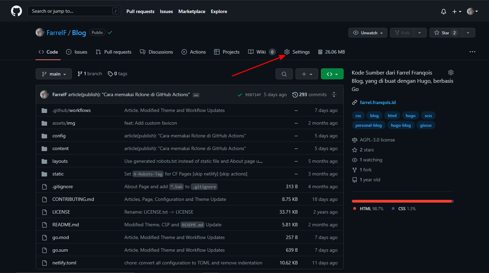
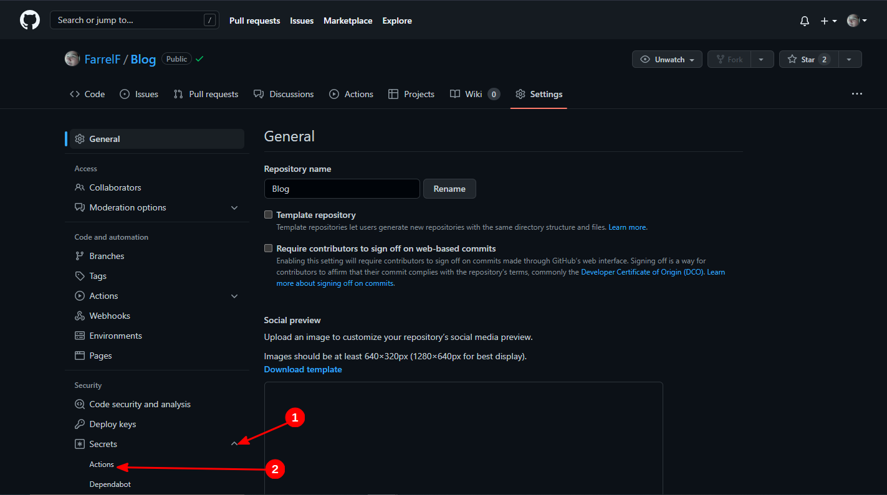
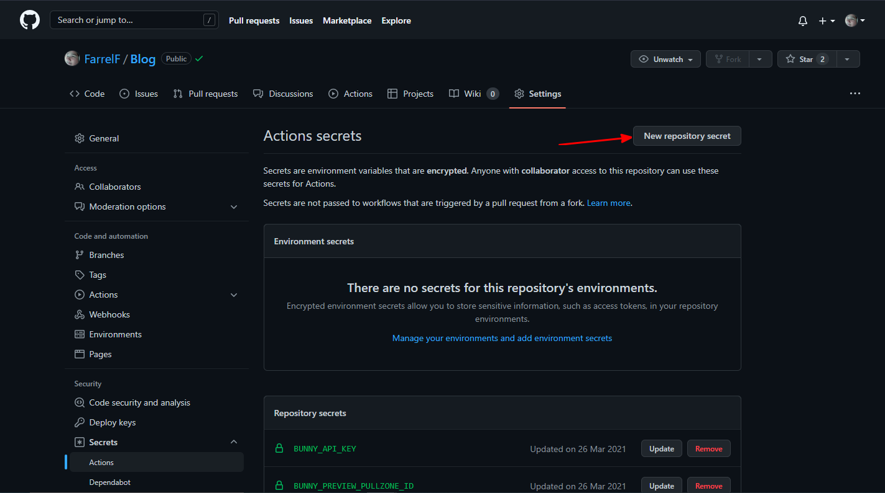
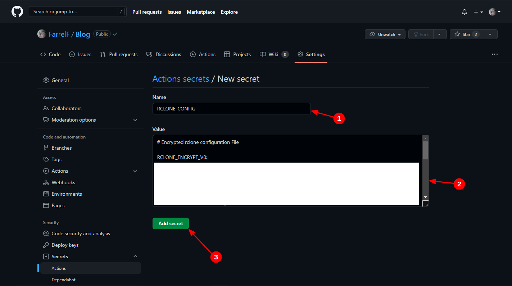
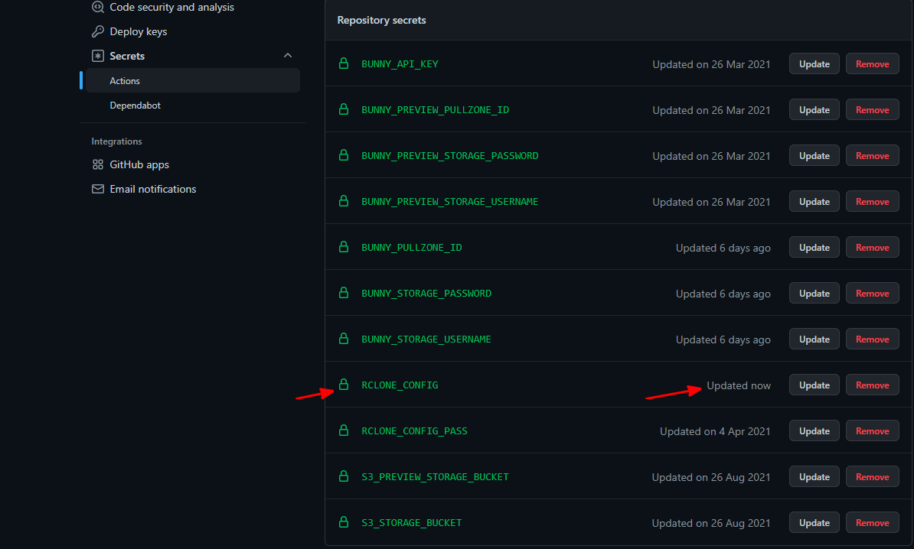

## Pembuka
[Rclone](https://rclone.org/) adalah sebuah program berbasis baris perintah yang bertujuan untuk mengelola berkas di layanan penyimpanan berbasis awan (_Cloud Storage_). Perangkat lunak ini adalah alternatif yang kaya fitur dari antarmuka penyedia penyimpanan berbasis awan, selain itu Rclone sendiri mendukung berbagai macam penyedia penyimpanan awan dan protokol transfer standar. 

Sedangkan [GitHub Actions](https://github.com/features/actions) adalah sebuah platform integrasi dan penyebaran berkelanjutan (disebut sebagai CI/CD, yang merupakan singkatan dari **_Continuous Integration and Continuous Deployment_**) dari GitHub yang memungkinkan Anda untuk mengotomatiskan alur pembangunan (_build_), pengujian, dan penyebaran Anda.

Platform tersebut dapat digunakan dengan berbagai tujuan, seperti menghimpun kode sumber, menguji sebuah perangkat lunak beserta fungsinya, menghasilkan sebuah web statis lalu mengunggahnya, dll.

Kenapa? Karena pada dasarnya platform tersebut merupakan komputer/server virtual yang menjalani perintah apapun yang Anda perlukan, tetapi dengan kontrol yang lebih terbatas, jadi Anda hanya bisa menjalankan perintah yang sudah tertera di dalam konfigurasinya saja.

Selain itu, data yang tersimpan di dalamnya akan terhapus secara otomatis oleh sistem setelah selesai (kecuali jika data-data tersebut diunggah ke server yang berbeda), hal seperti ini merupakan umum di platform CI/CD manapun, tidak terbatas pada GitHub Actions saja.

Karena batasan-batasan tersebut yang tidak seperti perangkat pada umumnya, maka cara memakai/mengimplementasikan Rclone di CI/CD seperti GitHub Actions itu sendiri akan cukup berbeda ketimbang memakainya di dalam komputer/server biasa.

Nah, oleh karena itu, artikel yang cukup singkat ini akan membahas tentang cara memakai Rclone di GitHub Actions, jika Anda adalah pengguna Rclone dan ingin mengimplementasinya ke GitHub Actions yang merupakan penyedia CI/CD dengan berbagai keperluan, mungkin artikel ini akan sangat cocok untuk Anda.

## Persiapan
Berikut di bawah ini adalah persiapan yang harus Anda lakukan untuk mengimplementasinya ke dalam GitHub Actions, antara lain:
- Mempunyai akun GitHub, repositorinya dan bisa memakai GitHub Actions
- Terpasangnya Rclone di dalam sistem operasi Anda dan pernah menggunakan serta mengkonfigurasi Rclone sebelumnya

Itu aja? Iya, cuma itu aja persiapannya. Setelah semuanya sudah siap, tinggal perlu implementasikan saja ke GitHub Actions

## Konfigurasi GitHub Actions
Untuk konfigurasinya, Anda bisa memakai contoh konfigurasi berikut. Konfigurasi di bawah ini adalah konfigurasi agar GitHub Actions dapat menghasilkan web statis dengan Hugo Extended dan mengunggahnya ke penyimpanan S3 dengan Rclone:

```yaml
name: Build and Deploy
on:
  push:
    branches:
      - main

jobs:
  build:
    name: Build
    runs-on: ubuntu-22.04
    env:
      TZ: Asia/Jakarta ## Mengatur Zona Waktu menjadi Asia/Jakarta, yang merupakan sebutan lain dari WIB (Waktu Indonesia Barat)
      HUGO_ENV: production ## Mengatur lingkungan yang digunakan oleh Hugo

    ## Langkah di bawah ini akan mengkloning sumber kode dari Repo kamu
    steps:
    - name: Checkout the Code
      uses: actions/checkout@v3
      with:
        fetch-depth: 0

    ## Langkah di bawah ini akan menginstal Hugo Extended di dalam sistem CI/CD yang sedang dijalankan
    - name: Install and Set up Hugo Extended
      uses: peaceiris/actions-hugo@v2
      with:
        hugo-version: 'latest'
        extended: true

    ## Langkah di bawah ini akan membangun sebuah web statis
    - name: Building the Static Web
      run: hugo --gc --minify

    ## Langkah di bawah ini akan menginstal dan mengkonfigurasi Rclone di dalam sistem CI/CD
    - name: Installing and Configuring Rclone
      run: |
        curl https://rclone.org/install.sh | sudo bash
        mkdir -p ${HOME}/.config/rclone
        echo "${{ secrets.RCLONE_CONFIG }}" > ${HOME}/.config/rclone/rclone.conf

    ## Langkah di bawah ini akan mengunggah web statis ke penyimpanan S3 
    - name: Upload Static Web to S3 Storage
      env:
        ## Variabel di bawah ini (RCLONE_CONFIG_PASS) adalah kata sandi untuk mengakses Konfigurasi Rclone 
        ## jika Anda mengenkripsinya, jika tidak maka Anda tidak perlu mendeklarasikan variabel ini
        ## Sedangkan jika iya, Anda perlu mendeklarasikan variabel itu yang isinya tersimpan di dalam "Secrets"
        RCLONE_CONFIG_PASS: ${{ secrets.RCLONE_CONFIG_PASS }}

        ## Kedua variabel di bawah ini adalah menentukan nama remot dan lokasi tujuannya
        S3_SERVICE: NAMA_REMOTE_RCLONE ## Ganti NAMA_REMOTE_RCLONE dengan nama remot yang ada di konfigurasi Rclone 
        S3_STORAGE_BUCKET_PATH: LOKASI_TUJUAN ## Ganti LOKASI_TUJUAN dengan folder/lokasi tujuan di remot yang ingin Anda isi
      run: rclone sync -v -P --stats-one-line ./public ${S3_SERVICE}:/${S3_STORAGE_BUCKET_PATH}
```

Konfigurasi di atas merupakan contohnya saja yang kasusnya adalah menghasilkan web statis dengan Hugo, lalu mengunggahnya ke penyimpanan berbasis S3, bisa saja Anda memiliki kasus yang berbeda sehingga konfigurasinya tidaklah sama seperti di atas.

Namun secara garis besar, itulah cara memakai Rclone di GitHub Actions, tetapi ada beberapa hal yang harus Anda perhatikan di atas, yakni:

- `${{ secrets.RCLONE_CONFIG }}`: Ini adalah variabel "Secrets" yang bernama `RCLONE_CONFIG` dan berisikan konfigurasi Rclone itu sendiri. Karena isinya tersimpan di dalam "Secrets", maka tidak mungkin variabel tersebut dideklarasikan ke dalam berkas konfigurasi, nanti akan saya bahas cara pembuatannya.

    Biasanya, berkas konfigurasi Rclone berlokasi di:
    - Untuk Windows: `%USERPROFILE%\.config\rclone\rclone.conf`
    - Untuk \*nix: `$HOME/.config/rclone/rclone.conf` atau `~/.config/rclone/rclone.conf`
    - Atau, di dalam direktori program itu sendiri

    Untuk lebih lanjut, silakan kunjungi [halaman dokumentasinya](https://rclone.org/docs/#config-config-file).

    Atau, Anda dapat mengetahui keberadaan berkas tersebut dengan mengeksekusi perintah `rclone config file`, nanti akan keluar lokasi berkas konfigurasi Rclone yang Anda pakai sekarang

- `${{ secrets.RCLONE_CONFIG_PASS }}`: Ini adalah variabel "Secrets" yang bernama `RCLONE_CONFIG_PASS` dan berisikan kata sandi untuk konfigurasi Rclone jika Anda mengenkripsinya. Karena isinya tersimpan di dalam "Secret", jadi tidak mungkin dideklarasikan ke dalam berkas konfigurasi, nanti akan saya bahas cara pembuatannya.

Bagi yang belum tahu apa itu "Secrets". "Secrets", sesuai dengan namanya, adalah sebuah variabel-variabel bersifat 'rahasia' yang nilainya disimpan di dalam server yang terenkripsi.

Bukan hanya terenkripsi, bahkan isi dari variabel "Secret" pun disembunyikan dari dalam log GitHub Actions, sehingga tidak ada seorang pun yang dapat mengetahui apa isinya, kecuali jika diakali, misalnya mengunggah isi dari "Secret" tersebut ke server luar dan hal tersebut perlu izin/turun tangan langsung dari pengurus atau/dan pembuat repositorinya.

Semua variabel "Secrets" pada konfigurasi di atas bisa diubah sesuka hati, contohnya: `${{ secrets.RCLONE_CONFIG }}` menjadi `${{ secrets.RCLONE_CONFIG_FILE }}`. Namun ketika Anda ingin membuatnya nanti, pastikan namanya sesuai dengan yang ada di konfigurasi.

Kalau sudah selesai, simpanlah berkas konfigurasi untuk GitHub Actions tersebut ke dalam direktori `.github/workflows` yang terletak di dalam repositori kamu.

Setelah disimpan, jangan dibuat _commit_, lalu _di-push_ dulu. Bagian selanjutnya adalah membuat terlebih dahulu "Secret"-nya.

## Membuat GitHub Actions Secret
Langkah-langkah untuk membuat **GitHub Actions Secret**-nya sebagai berikut:

**Langkah ke-1:** Kunjungi repositori GitHub kamu terlebih dahulu

**Langkah ke-2:** Di repositori, klik pada **"Settings"** yang berikon roda gerigi

**Langkah ke-3:** Nanti di bagian **"Security"**, klik pada **"Secrets"**, lalu klik **"Actions"** di dalamnya

**Langkah ke-4:** Kamu akan mengunjungi **"Actions secret"**, untuk membuatnya klik pada _Button_ **"New repository secret"**

**Langkah ke-5:** Isikan nama dari "Secret" yang ingin Anda buat, lalu isikan juga nilainya. Jika sudah selesai dan merasa yakin, klik pada _Button_ **"Add secret"** untuk menambahkan "Secret"

**Langkah ke-6:** Jika sudah berhasil dibuat, seharusnya muncul pesan "Repository secret added" dan "Secret" dengan nama yang Anda tentukan tadi sudah langsung ada

Kalau Anda merasa tidak paham atau kebingungan dalam mengikuti langkah-langkah di atas, Anda dapat melihat cuplikan berikut di bawah ini, saya urutkan gambarnya berdasarkan angka yang tertera di keterangan gambar:

    

## Setelah GitHub Actions Secret dibuat
Setelah itu, Anda perlu memeriksa dan apakah konfigurasi beserta variabelnya sudah benar sesuai dengan kebutuhan Anda, kalau merasa yakin maka Anda dapat segera buat _commit_, lalu _push_ ke dalam repositori Anda.

Setelah _di-push_, lihat lognya untuk melihat perjalanannya akan seperti apa, pastikan bahwa GitHub Actions dapat menjalankannya dengan baik tanpa mengalami masalah/galat (_error_).

## Penutup
Terima kasih kepada Anda yang telah membaca dan memahami artikel ini. Itu saja dulu untuk artikel kali ini, ~~maaf artikelnya belum memiliki gambar ataupun cuplikan apapun untuk saat ini, sehingga terkesan sangat kurang lengkap~~.

**PEMBARUAN Selasa, 09 September 2022:** Sekarang artikel ini memiliki cuplikan dan diperbarui supaya lebih lengkap.

Artikel ini saya buat berdasarkan pengalaman saya dalam mengimplementasikan Rclone ke dalam GitHub Actions untuk mengunggah web statis ke berbagai penyedia penyimpanan.

Semoga artikel ini bermanfaat untuk Anda, terutama yang ingin mengimplementasikan Rclone ke dalam GitHub Actions. Itu saja dan terima kasih atas perhatiannya 😊